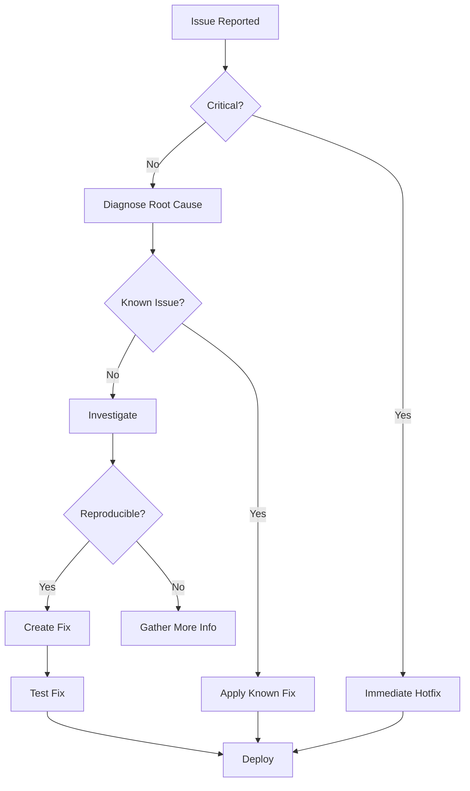

<\!-- DEPRECATED: This document has been consolidated into patterns/implementation-patterns-guide.md -->
<\!-- Archived: 2025-01-06 for disaster recovery only -->
<\!-- DO NOT UPDATE: Make changes to the consolidated guide instead -->


# Troubleshooting Framework Reference - Fieldmark v3

## Overview {essential}

This reference provides a systematic framework for diagnosing and resolving issues across all Fieldmark v3 field types. Use this guide to establish consistent troubleshooting approaches and escalation paths.

## Quick Diagnosis Framework {essential}

### Universal Diagnostic Steps
1. **Identify Symptoms** - What exactly is the user experiencing?
2. **Check Console** - Browser/app console for JavaScript errors
3. **Verify Platform** - iOS, Android, or Web-specific issue?
4. **Test Isolation** - Does it occur in a minimal test case?
5. **Check Configuration** - Valid JSON and parameters?
6. **Review Logs** - Sync logs, network requests, validation errors
7. **Document Pattern** - Reproducible steps and conditions

## Common Issue Categories {essential}

### Category Matrix
| Category | Frequency | Impact | Typical Resolution Time |
|----------|-----------|--------|------------------------|
| Configuration | High | Medium | 5-15 minutes |
| Platform-specific | Medium | High | 15-30 minutes |
| Performance | Medium | High | 30-60 minutes |
| Data validation | High | Low | 5-10 minutes |
| Sync/Network | Low | Critical | Variable |
| Permissions | Medium | Critical | 10-20 minutes |

## Universal Error Patterns {important}

### JavaScript Errors
| Error Pattern | Common Cause | Quick Fix |
|--------------|--------------|-----------|
| `Cannot read property of undefined` | Missing null checks | Add optional chaining |
| `Maximum call stack exceeded` | Infinite loop/recursion | Check conditions |
| `Out of memory` | Large data/images | Reduce size/pagination |
| `Network timeout` | Slow connection | Retry/offline mode |
| `Permission denied` | Missing permissions | Check platform settings |

### Silent Failures
**Indicators:**
- No error message but unexpected behavior
- Console warnings without errors
- Partial functionality
- Platform-specific differences

**Common Causes:**
- Sanitization removing content
- Validation preventing saves
- Platform API differences
- Race conditions

## Diagnostic Tools and Techniques {important}

### Browser DevTools
```javascript
// Essential console commands
console.log('Component state:', this.state);
console.table(validationErrors);
console.time('Operation'); // ... console.timeEnd('Operation');
debugger; // Breakpoint
```

### Network Inspection
- Check request/response payloads
- Verify API endpoints
- Monitor request timing
- Identify failed requests
- Check CORS headers

### Mobile Debugging
#### iOS
- Safari Web Inspector
- Console.app for native logs
- Simulator vs device testing
- Memory profiler

#### Android
- Chrome DevTools remote
- adb logcat filtering
- Android Studio profiler
- WebView debugging

## Issue Resolution Framework {important}

### Severity Levels
1. **Critical** - Data loss, app crash, security issue
2. **High** - Feature unusable, widespread impact
3. **Medium** - Workaround available, limited impact
4. **Low** - Cosmetic, rare occurrence

### Resolution Workflow


## Common Troubleshooting Scenarios {comprehensive}

### Scenario 1: Field Not Displaying
**Diagnostic Path:**
1. Check console for errors
2. Verify component name spelling
3. Confirm namespace correct
4. Check conditions if applicable
5. Verify JSON syntax
6. Test in different notebook

**Common Fixes:**
- Correct component-name case
- Fix namespace typo
- Resolve condition logic
- Fix JSON syntax error

### Scenario 2: Validation Always Failing
**Diagnostic Path:**
1. Check validation schema syntax
2. Verify field type matches validation
3. Test with minimal validation
4. Check for conflicting validations
5. Review initialValue compatibility

**Common Fixes:**
- Match array/string validation to field
- Correct yup method names
- Fix validation parameters
- Align with multiple setting

### Scenario 3: Performance Degradation
**Diagnostic Path:**
1. Profile with DevTools
2. Count active components
3. Measure data size
4. Check render frequency
5. Monitor memory usage

**Common Fixes:**
- Reduce active field count
- Implement pagination
- Optimize images/data
- Add debouncing
- Clear unused data

### Scenario 4: Platform-Specific Issues
**Diagnostic Path:**
1. Identify affected platforms
2. Check platform-specific APIs
3. Review permission states
4. Test on multiple devices
5. Check version compatibility

**Common Fixes:**
- Add platform detection
- Implement fallbacks
- Request permissions properly
- Update WebView/browser
- Add polyfills

## Error Message Decoder {comprehensive}

### Field-Agnostic Error Messages
| Error Message | Likely Cause | Resolution |
|--------------|--------------|------------|
| "Required field" | Validation without value | Provide value or remove validation |
| "Invalid type" | Type mismatch | Check type-returned vs validation |
| "Component not found" | Wrong name/namespace | Verify component registration |
| "Permission denied" | Platform permission | Request in app settings |
| "Network error" | Connection issue | Check connectivity/CORS |
| "Memory exhausted" | Too much data | Reduce/paginate data |
| "Sync conflict" | Concurrent edits | Choose version/merge |
| "Invalid configuration" | JSON syntax/schema | Validate JSON structure |

## Prevention Strategies {important}

### Design-Time Prevention
- Validate JSON before deployment
- Test on minimum spec devices
- Set realistic data limits
- Plan for offline scenarios
- Document known limitations

### Runtime Prevention
- Add comprehensive error handling
- Implement retry mechanisms
- Provide user feedback
- Add performance monitoring
- Include diagnostic logging

### Testing Prevention
- Cross-platform testing
- Edge case coverage
- Performance testing
- Permission denial testing
- Network condition testing

## Escalation Procedures {essential}

### When to Escalate
- Data loss occurring
- Security vulnerability found
- Widespread platform issue
- No known workaround
- Regression from update

### Escalation Path
1. **Level 1**: Check documentation and known issues
2. **Level 2**: Community forum/discussion
3. **Level 3**: GitHub issue creation
4. **Level 4**: Direct support contact

### Information to Provide
```markdown
## Issue Report Template
**Environment:**
- Platform: [iOS/Android/Web]
- Version: [Fieldmark version]
- Device: [Model/Browser]

**Issue:**
- Expected: [What should happen]
- Actual: [What does happen]
- Steps: [How to reproduce]

**Diagnostics:**
- Console errors: [Any errors]
- Network failures: [Failed requests]
- Configuration: [Relevant JSON]

**Attempts:**
- Tried: [What you've tried]
- Result: [What happened]
```

## Quick Reference Tables {essential}

### Diagnostic Command Reference
| Platform | Command | Purpose |
|----------|---------|---------|
| All | `console.log()` | Debug output |
| Web | `debugger;` | Breakpoint |
| iOS | `Safari Inspector` | Remote debug |
| Android | `chrome://inspect` | Remote debug |
| All | `JSON.stringify()` | Inspect objects |

### Time to Resolution Guidelines
| Issue Type | Target Time | Maximum Time |
|------------|-------------|--------------|
| Configuration | 15 min | 1 hour |
| Validation | 10 min | 30 min |
| Platform | 30 min | 2 hours |
| Performance | 1 hour | 4 hours |
| Data corruption | Immediate | 1 hour |

## See Also {comprehensive}

### Field-Specific Troubleshooting
- [Display Field Troubleshooting](../field-categories/display-field-v05.md#troubleshooting-guide)
- [Location Fields Troubleshooting](../field-categories/location-fields-v05.md#troubleshooting-guide)
- [Media Fields Troubleshooting](../field-categories/media-fields-v05.md#troubleshooting-guide)
- [Relationship Field Troubleshooting](../field-categories/relationship-field-v05.md#troubleshooting-guide)

### Related References
- [Platform Behaviors Reference](./platform-behaviors-reference.md)
- [Performance Thresholds Reference](./performance-thresholds-reference.md)
- [Validation Timing Reference](./validation-timing-reference.md)
- [Error Recovery Patterns](./error-recovery-patterns.md)

## Metadata {comprehensive}
- **Document Version**: v01
- **Last Updated**: 2025-01-03
- **Status**: Initial framework creation
- **Purpose**: Standardize troubleshooting approaches across all field types
- **Maintenance**: Update with new issue patterns and resolutions