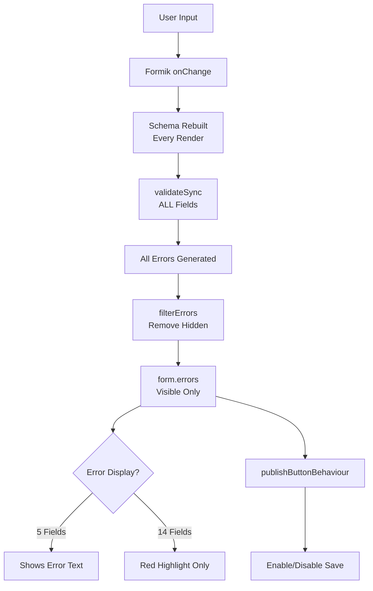

<\!-- DEPRECATED: This document has been consolidated into patterns/dynamic-forms-guide.md -->
<\!-- Archived: 2025-01-06 for disaster recovery only -->
<\!-- DO NOT UPDATE: Make changes to the consolidated guide instead -->


# Validation System - Comprehensive Third Draft Documentation
## Fieldmark/FAIMS3 Technical Reference

### Document Classification
- **Component Type**: Core System Architecture
- **Audience Tags**: {designer} {developer} {claude-code}
- **Depth Levels**: {essential} {important} {comprehensive}
- **Version**: 1.0.0
- **Last Technical Verification**: August 2025
- **Key Discovery**: Hidden field validation may not actually block submission due to filterErrors

---

## 1. Executive Summary {essential} {designer}

### Current State
The Fieldmark validation system provides basic data quality controls through required fields and value constraints. Validation executes synchronously on every field change, with schemas rebuilt on every render. The system lacks "soft validation" (warnings that can be overridden), which is the most requested feature from field teams.

### Critical Limitations
1. **No soft validation** - All validation is "hard" (blocking)
2. **14 of 19 field types don't display error messages** - Only show red highlighting
3. **No conditional validation** - Cannot make fields conditionally required
4. **No cross-field validation** - Cannot validate relationships between fields
5. **Performance issues** - All fields validate on every change, even hidden ones

### Key Insights from Investigation
- **Hidden required fields may not actually block submission** - filterErrors removes them from formProps.errors
- **Schema rebuilding is inefficient but functional** - Happens on every render, not just mount
- **Error display fixes are simple** - 2-3 hours to fix all 14 broken fields
- **filterErrors is very recent** - Added January 2025, only 1-2 months old

---

## 2. How Validation Actually Works {comprehensive} {developer}

### Architecture Overview



### Core Components and Timing

#### 1. Schema Building (Every Render!)
```typescript
// Location: /app/src/gui/components/record/form.tsx:1585-1588
// Rebuilds on EVERY render, not just mount
render() {
  const validationSchema = getValidationSchemaForViewset(
    this.props.ui_specification,
    viewsetName
  );
}
```
**Performance Impact**: Schema rebuilds unnecessarily on every state change, section navigation, or re-render.

#### 2. Validation Execution (Synchronous, All Fields)
```typescript
// Location: form.tsx:1623
validationSchema.validateSync(values, {abortEarly: false});
```
- Validates ALL fields including hidden ones
- No debouncing or throttling
- Blocks UI thread
- Runs on: mount, every change, blur, section navigation

#### 3. Error Filtering (Recent Addition)
```typescript
// Added January 2025 - only 1-2 months old!
filterErrors({errors, values, viewsetName}) {
  const visibleFields = currentlyVisibleFields({...});
  // Returns ONLY errors for visible fields
  return filteredErrors;
}
```
**Key Discovery**: This SHOULD prevent hidden required fields from blocking submission, but the feature is very new and may have bugs.

### Performance Characteristics

| Fields | Validation Time | UI Impact | Recommendation |
|--------|----------------|-----------|----------------|
| 10 | ~5-10ms | Imperceptible | No issues |
| 50 | ~25-50ms | Slight lag | Consider optimization |
| 100 | ~50-100ms | Noticeable lag | Split form or add debouncing |
| 200+ | ~200ms+ | Severe lag | Requires architectural changes |

**Hidden fields impact**: ALL fields validate even when hidden, then errors filtered after - doubles the work!

---

## 3. Critical Warnings and Anti-Patterns {essential} {designer} {claude-code}

### ⚠️ Warning 1: Hidden Required Fields

**THE ISSUE**: Required fields hidden by conditions still validate, though filterErrors should remove their errors.

**STATUS**: Unclear - filterErrors (added Jan 2025) should fix this, but users report it still blocks submission.

**NEVER DO THIS** (until bug confirmed fixed):
```json
{
  "other-details": {
    "component-parameters": {
      "required": true  // DON'T combine with conditions!
    },
    "condition": {
      "operator": "equal",
      "field": "category",
      "value": "other"
    }
  }
}
```

**WORKAROUND**: Use duplicate fields pattern:
```json
{
  "email_when_not_required": {
    "component-parameters": {
      "label": "Email (Optional)",
      "required": false
    },
    "condition": {
      "operator": "not-equal",
      "field": "contact_method",
      "value": "email"
    }
  },
  "email_when_required": {
    "component-parameters": {
      "label": "Email (Required)",
      "required": true
    },
    "condition": {
      "operator": "equal",
      "field": "contact_method",
      "value": "email"
    }
  }
}
```

### ⚠️ Warning 2: Most Fields Don't Show Error Messages

**14 of 19 field types** validate but display NO error text:

| Broken Fields (No Error Text) | Working Fields (Show Errors) |
|-------------------------------|------------------------------|
| RadioGroup | TextField |
| Select | NumberField |
| MultiSelect | DateTimeNow |
| AdvancedSelect | Checkbox |
| TakePhoto | InputFieldBase |
| TakePoint | |
| RelatedRecordSelector | |
| BasicAutoIncrementer | |
| TemplatedStringField | |
| Address | |
| FileUploader | |
| QRCodeFormField | |
| MapFormField | |
| ActionButton | |

**Impact**: Users see red highlighting but no explanation of what's wrong.

**Fix Effort**: 2-3 hours total (15 minutes per field to add FormHelperText).

### ⚠️ Warning 3: Type Mismatches Cause Confusion

| Field | Declared Type | Actual Behavior | Common Issue |
|-------|---------------|-----------------|--------------|
| BasicAutoIncrementer | String | Padded strings ("0001") | "0150" < "0099" is TRUE |
| NumberField | Number | Empty → null (not 0) | Null vs zero confusion |
| ControlledNumber | Integer | Accepts decimals | Type not enforced |
| Checkbox | Boolean | Validation expects string | Error message type mismatch |
| MultiSelect | Array | Empty array vs null | Inconsistent handling |

---

## 4. Validation Rules Reference {important} {designer}

### Through Designer Interface

#### Required Fields (All Field Types)
- **Designer**: Check "Required" checkbox
- **Effect**: Field must have value before submission
- **JSON Generated**:
```json
"validationSchema": [
  ["yup.string"],  // or appropriate type
  ["yup.required", "This field is required"]
]
```

#### Number Ranges (ControlledNumber Only)
- **Designer**: Set min/max values
- **Effect**: Number must be within range
- **JSON Generated**:
```json
"validationSchema": [
  ["yup.number"],
  ["yup.min", 0, "Must be positive"],
  ["yup.max", 100, "Maximum 100"]
]
```

### Through JSON Editing (Advanced)

#### String Validation
```json
"validationSchema": [
  ["yup.string"],
  ["yup.required", "Required message"],
  ["yup.min", 10, "Minimum 10 characters"],
  ["yup.max", 100, "Maximum 100 characters"],
  ["yup.matches", "^[A-Z]", "Must start with capital"],
  ["yup.email", "Must be valid email"]
]
```

#### Array Validation (Relationships, Photos)
```json
"validationSchema": [
  ["yup.array"],
  ["yup.min", 1, "At least one required"],
  ["yup.max", 5, "Maximum 5 allowed"],
  ["yup.required", "This field is required"]
]
```

#### Object Validation (GPS, Complex Fields)
```json
"validationSchema": [
  ["yup.object"],
  ["yup.required", "Location required"],
  ["yup.nullable"]  // Allows null values
]
```

### What's NOT Possible

❌ **Conditional validation**: `yup.when()` not supported
❌ **Cross-field validation**: Cannot reference other fields
❌ **Custom validators**: `yup.test()` not available
❌ **Async validation**: No server-side checks
❌ **Soft validation**: No warnings, only errors
❌ **Dynamic messages**: Cannot change based on value

---

## 5. Field-Specific Validation Behavior {comprehensive} {developer}

### Fields with Working Validation Display

#### TextField Family (TextField, EmailField, MultilineTextField)
```typescript
// Location: /app/src/gui/fields/FAIMSTextField.tsx
// Uses fieldToTextField from formik-mui
error={Boolean(hasError)}
helperText={hasError ? String(props.form.errors[props.field.name]) : ''}
```
- ✅ Shows error messages below field
- ✅ Red border when invalid
- ✅ Touch state properly managed
- ✅ Blur event sets touched

#### NumberField / ControlledNumber
```typescript
// Location: /app/src/gui/fields/NumberField.tsx:65
onBlur={() => form.setFieldTouched(field.name, true)}
```
- ✅ Custom error for invalid numbers
- ✅ Range validation messages
- ✅ Handles null vs zero properly
- ⚠️ Empty string becomes null, not 0

#### Checkbox
```typescript
// Location: /app/src/gui/fields/checkbox.tsx:81-87
<FormHelperText>
  {error ? (form.errors[field.name] as string) : ''}
</FormHelperText>
```
- ✅ Reference implementation for error display
- ✅ Boolean validation works
- ⚠️ Error expects string type

### Fields with Broken Validation Display

#### RadioGroup
```typescript
// Location: /app/src/gui/fields/radio.tsx
// HAS: error={Boolean(form.errors?.[field.name])}
// MISSING: FormHelperText component
```
**Fix Required**:
```typescript
import { FormHelperText } from '@mui/material';
// After line 167
{form.errors?.[field.name] && form.touched?.[field.name] && (
  <FormHelperText error>
    {String(form.errors[field.name])}
  </FormHelperText>
)}
```

#### Select / MultiSelect
- ❌ No error prop at all
- ❌ No FormHelperText
- ❌ No touched state handling
- ❌ Users see nothing when validation fails

### Shared Component Solution

```typescript
// Proposed: /app/src/gui/components/FieldError.tsx
export const FieldError = ({ form, field }) => (
  form.errors?.[field.name] && form.touched?.[field.name] ? (
    <FormHelperText error>
      {String(form.errors[field.name])}
    </FormHelperText>
  ) : null
);

// Usage in any field:
<FieldError form={form} field={field} />
```

---

## 6. Validation Timing and State Management {important} {developer}

### Validation Execution Points

| Trigger | Function Called | When | Performance Impact |
|---------|----------------|------|-------------------|
| Form Mount | validateOnMount | Initial render | High - all fields |
| Field Change | validateOnChange | Every keystroke | High - no debouncing |
| Field Blur | validateOnBlur | Focus lost | Low - single field |
| Section Change | validateForm() | Navigation | Medium - all fields |
| Save Attempt | validateForm() | Submit click | High - all fields |

### Touch State Management

**Working Fields** (proper blur handling):
```typescript
onBlur={() => form.setFieldTouched(field.name, true)}
```

**Broken Fields** (no touch management):
- RadioGroup - No blur concept for radio buttons
- Select - Missing onBlur handler
- MultiSelect - No blur implementation
- TakePhoto - No blur equivalent

**Impact**: Errors show immediately instead of after interaction.

### Section Validation State

```typescript
// Location: recordStepper.tsx:106-116
const hasErrors = (sectionId: string) => {
  return (
    visitedSteps.has(sectionId) &&
    ui_specification.views[sectionId]?.fields.some(
      field => formErrors && formErrors[field]
    )
  );
};
```

- Section can be "visited" but still have errors
- Red "!" badge shows for sections with errors
- Only shows for visited sections
- Hidden field errors excluded (via filterErrors)

---

## 7. Save Button Behavior (publishButtonBehaviour) {important} {designer}

### Configuration Options

| Mode | Behavior | When to Use | Issues |
|------|----------|-------------|--------|
| `"always"` | Save always enabled | Quick data entry | No validation enforcement |
| `"visited"` | Enabled after all sections viewed | Ensures complete review | Doesn't check validity |
| `"noErrors"` | Enabled only when valid | Data quality enforcement | Hidden required fields may block |

### Implementation Details

```typescript
// Location: form.tsx:1668-1677
const hasErrors = Object.keys(formProps.errors).length > 0;
const showPublishButton =
  publishButtonBehaviour === 'always' ||
  (publishButtonBehaviour === 'visited' && allSectionsVisited) ||
  (publishButtonBehaviour === 'noErrors' && !hasErrors);
```

**Key Insight**: Uses filtered errors (formProps.errors), so hidden fields SHOULD NOT block saving.

---

## 8. Performance Optimization Strategies {comprehensive} {developer}

### Current Performance Issues

1. **Schema rebuilt on EVERY render** (not just mount)
2. **ALL fields validated** including hidden ones
3. **No debouncing** on validation
4. **Synchronous validation** blocks UI thread
5. **Errors calculated then filtered** (double work)

### Recommended Optimizations

#### Quick Win: Validate Only Visible Fields
```typescript
// In validate function
const visibleFields = currentlyVisibleFields({...});
const visibleValues = Object.keys(values)
  .filter(key => visibleFields.includes(key))
  .reduce((obj, key) => ({ ...obj, [key]: values[key] }), {});
validationSchema.validateSync(visibleValues, {abortEarly: false});
```

#### Add Debouncing
```typescript
import { debounce } from 'lodash';
const debouncedValidate = debounce(validate, 300);
```

#### Cache Schemas by Visibility Pattern
```typescript
const schemaCache = new Map();
function getCachedSchema(visibleFields) {
  const key = visibleFields.sort().join(',');
  if (!schemaCache.has(key)) {
    schemaCache.set(key, buildSchema(visibleFields));
  }
  return schemaCache.get(key);
}
```

#### Async Validation for Large Forms
```typescript
validate={async (values) => {
  return new Promise((resolve) => {
    setTimeout(() => {
      const errors = validateSync(values);
      resolve(errors);
    }, 0);
  });
}}
```

---

## 9. Troubleshooting Guide {essential} {designer}

### Common Issues and Solutions

#### "Form won't save but no errors visible"

**Diagnosis Steps**:
1. Open browser console
2. Type: `console.log(formProps.errors)`
3. Check for errors on hidden fields
4. Look for RadioGroup/Select fields (no error display)

**Solutions**:
- Remove required from conditional fields
- Check all RadioGroup/Select fields manually
- Temporarily set publishButtonBehaviour to "always"

#### "Validation is slow/laggy"

**Diagnosis**:
```javascript
// Add to console:
const start = performance.now();
formProps.validateForm();
console.log(`Validation took ${performance.now() - start}ms`);
```

**Solutions**:
- Reduce fields per section (<50)
- Avoid complex regex patterns
- Split into multiple forms
- Remove unnecessary validation rules

#### "Numbers comparing incorrectly"

**Common Issues**:
- BasicAutoIncrementer: "0150" < "0099" (string comparison)
- Empty NumberField: null not 0
- ControlledNumber: Accepts decimals despite Integer type

**Solutions**:
- Use numeric IDs without padding
- Handle null explicitly in conditions
- Use Number validation not Integer

### Browser Console Debugging

```javascript
// Check all validation errors
console.log(formProps.errors);

// Check touched fields
console.log(formProps.touched);

// Check all field values
console.log(formProps.values);

// Test specific field visibility
const field = document.querySelector('[name="field-name"]');
console.log(field ? 'Visible' : 'Hidden');

// Force validation
formProps.validateForm().then(errors => console.log(errors));

// Check which fields are causing issues
Object.entries(formProps.errors).forEach(([field, error]) => {
  console.log(`${field}: ${error}`);
});
```

---

## 10. Future Requirements and Roadmap {comprehensive} {designer}

### Priority 1: Soft Validation (Most Requested)

**User Need**: Warnings that can be acknowledged and overridden.

**Proposed Implementation**:
```json
{
  "validationSchema": [
    ["yup.string"],
    ["yup.warning", "matches", "^[A-Z]", "Should start with capital letter"],
    ["yup.error", "required", "This field is required"]
  ]
}
```

**Requirements**:
- Field-level soft/hard configuration
- Visual distinction (yellow vs red)
- Override reason capture
- Notebook-wide default setting

### Priority 2: Fix Error Display (Quick Win)

**Effort**: 2-3 hours total

**Approach**:
1. Create shared FieldError component
2. Add to all 14 broken fields
3. Ensure touch state handling

### Priority 3: Conditional Validation

**Use Cases**:
- "If field X = value, then field Y required"
- "Required when visible" option
- Cross-field validation within form

**Proposed Syntax**:
```json
"validationSchema": [
  ["yup.string"],
  ["yup.when", "contact_method", {
    "is": "email",
    "then": ["yup.required", "Email required when email contact selected"]
  }]
]
```

### Priority 4: Server-Side Post-Sync Validation

**Requirements**:
- Automatic execution after sync
- Data quality review interface
- Bidirectional sync for field follow-up
- Designer configuration for rules
- Cross-record validation support

**Implementation Needs**:
- Backend validation engine
- Quality dashboard UI
- Rule builder in Designer
- Field app integration

### Priority 5: GPS Accuracy Validation

**Requirements**:
- Dual thresholds (hard/soft)
- Field-level configuration
- Range: 10m to sub-cm
- Override with annotation

**Proposed Configuration**:
```json
{
  "gps_accuracy": {
    "hard_threshold": 5,  // Blocks if accuracy > 5m
    "soft_threshold": 2,  // Warns if accuracy > 2m
    "unit": "meters"
  }
}
```

### Priority 6: Cross-Field Validation

**Common Patterns**:
- Date ranges (end after start)
- Numeric relationships
- Logical constraints
- Parent-child dependencies

### Priority 7: Performance Optimizations

1. Debounced validation (300ms)
2. Validate only visible fields
3. Schema caching
4. Async validation option
5. Partial validation on field change

### Priority 8: Breaking Changes Management

**Designer Warnings**:
- Detect validation changes that break existing data
- Migration tool for validation rules
- "Pre-validation" flag for old data
- Git integration for audit trail

### Priority 9: Navigation and Recovery

**Features**:
- Jump-to-error navigation
- Validation issues panel
- Section blocking (hard mode)
- Section warnings (soft mode)

---

## 11. Implementation Priorities {essential} {developer}

### Immediate Fixes (This Week)

1. **Add FormHelperText to all fields** (2-3 hours)
   - Create shared component
   - Apply to 14 broken fields
   - Test error display

2. **Document hidden field behavior** (1 hour)
   - Confirm if filterErrors prevents blocking
   - Update Designer warnings
   - Create clear guidelines

3. **Add performance logging** (1 hour)
   - Measure actual validation times
   - Identify bottlenecks
   - Set performance thresholds

### Short Term (This Month)

1. **Implement debouncing** (4 hours)
   - Add 300ms delay to onChange
   - Prevent validation storms
   - Improve responsiveness

2. **Validate only visible fields** (4 hours)
   - Modify validation pipeline
   - Test with complex conditions
   - Verify performance gains

3. **Create validation test suite** (8 hours)
   - Test all field types
   - Cover edge cases
   - Performance benchmarks

### Medium Term (This Quarter)

1. **Soft validation system** (40 hours)
   - Extend Yup schema format
   - Add warning UI components
   - Override reason capture
   - Designer integration

2. **Conditional validation** (20 hours)
   - Implement yup.when() support
   - Dynamic schema building
   - Cross-field dependencies

3. **Designer validation builder** (40 hours)
   - Visual rule creation
   - Validation preview
   - Test mode

### Long Term (This Year)

1. **Server-side validation** (80+ hours)
   - Backend engine
   - Quality dashboard
   - Sync integration
   - Rule configuration

2. **Performance overhaul** (40 hours)
   - Async validation
   - Worker threads
   - Incremental validation
   - Smart caching

---

## 12. Best Practices and Guidelines {essential} {designer}

### For Notebook Designers

#### DO:
✅ Keep validation simple - use conditions for complex logic
✅ Test thoroughly in deployed notebooks (not Designer preview)
✅ Provide clear, actionable error messages
✅ Document validation rules in helperText
✅ Consider mobile users with limited connectivity
✅ Use "always" publishButtonBehaviour during development

#### DON'T:
❌ Use required on conditional fields (until bug fixed)
❌ Rely on validation alone for data quality
❌ Create deeply nested validation logic
❌ Assume error messages display (14 fields don't!)
❌ Use different types in conditions vs validation
❌ Trust Designer preview for validation testing

#### REMEMBER:
- Validation runs on EVERY change (performance matters)
- Hidden fields still validate (may cause issues)
- Most fields don't show error text (only red color)
- Soft validation coming but not yet available
- Cross-field validation not currently possible
- Test with real data in real conditions

### For Developers

#### Code Patterns:
```typescript
// Always include FormHelperText for errors
<FormHelperText error={hasError}>
  {hasError ? String(form.errors[field.name]) : ''}
</FormHelperText>

// Always handle touch state
onBlur={() => form.setFieldTouched(field.name, true)}

// Check for null vs undefined vs empty
const value = field.value ?? '';  // Handles null/undefined
const isEmpty = value === '' || value === null;

// Type-safe validation
if (typeof value === 'number' && !isNaN(value)) {
  // Numeric validation
}
```

#### Performance Patterns:
```typescript
// Debounce expensive operations
const debouncedValidate = useMemo(
  () => debounce(validate, 300),
  [validate]
);

// Memoize computed values
const visibleFields = useMemo(
  () => currentlyVisibleFields({...}),
  [conditions, values]
);

// Early return for unchanged values
if (prevValues === values) return prevErrors;
```

### For Field Teams

#### Data Quality Tips:
- Save frequently (every 5-10 minutes)
- Review red indicators before saving
- Check hidden sections for issues
- Document override reasons
- Verify GPS accuracy manually
- Test forms before fieldwork

#### Troubleshooting in Field:
1. Can't save? Check RadioGroups and Selects
2. Slow form? Reduce fields per section
3. Missing errors? Check browser console
4. GPS issues? Check accuracy threshold
5. Sync problems? Save as draft first

---

## 13. Technical Reference {comprehensive} {claude-code}

### Validation Pipeline

```typescript
// Complete validation flow with file locations

// 1. Schema Building
// Location: /app/src/gui/components/validation.ts:58-77
export function getValidationSchemaForViewset(
  ui_specification: ProjectUIModel,
  viewset_name: string
) {
  const fields = getFieldsForViewSet(ui_specification, viewset_name);
  const validationSchema = Object();
  fieldNames.forEach(fieldName => {
    validationSchema[fieldName] = expand_validation_schema(
      ui_specification,
      fieldName,
      fields[fieldName]['validationSchema']
    );
  });
  return transformAll([['yup.object'], ['yup.shape', validationSchema]]);
}

// 2. Validation Execution
// Location: /app/src/gui/components/record/form.tsx:1618-1657
validate={(values) => {
  try {
    validationSchema.validateSync(values, {abortEarly: false});
    return {};
  } catch (err) {
    const errors = err.inner.reduce((acc, error) => {
      if (error.path) acc[error.path] = error.message;
      return acc;
    }, {});
    return filterErrors({errors, values, viewsetName});
  }
}}

// 3. Error Filtering
// Location: /app/src/gui/components/record/form.tsx:1547-1575
filterErrors({errors, values, viewsetName}) {
  const visibleFields = currentlyVisibleFields({
    uiSpec: ui_specification,
    values: values,
    viewsetId: viewsetName
  });
  
  return Object.keys(errors)
    .filter(field => visibleFields.includes(field))
    .reduce((filtered, field) => {
      filtered[field] = errors[field];
      return filtered;
    }, {});
}

// 4. Save Button Logic
// Location: /app/src/gui/components/record/form.tsx:1668-1677
const hasErrors = Object.keys(formProps.errors).length > 0;
const showPublishButton =
  publishButtonBehaviour === 'always' ||
  (publishButtonBehaviour === 'visited' && allSectionsVisited) ||
  (publishButtonBehaviour === 'noErrors' && !hasErrors);
```

### File Structure

```
/app/src/gui/
├── components/
│   ├── validation.ts           # Schema building
│   ├── record/
│   │   ├── form.tsx            # Main validation logic
│   │   ├── recordStepper.tsx   # Section validation
│   │   ├── view.tsx            # Section rendering
│   │   └── branchingLogic.tsx  # Conditional visibility
│   └── ui/
│       └── PermissionAlerts.tsx # Platform-specific messages
├── fields/                      # Field components
│   ├── InputFieldBase.tsx      ✅ Working validation
│   ├── NumberField.tsx         ✅ Working validation
│   ├── FAIMSTextField.tsx      ✅ Working validation
│   ├── DateTimeNow.tsx         ✅ Working validation
│   ├── checkbox.tsx            ✅ Working validation
│   ├── radio.tsx               ❌ No error display
│   ├── select.tsx              ❌ No error display
│   ├── multiselect.tsx         ❌ No error display
│   ├── selectadvanced.tsx      ❌ No error display
│   ├── RelatedRecordSelector.tsx ❌ No error display
│   ├── TakePhoto.tsx           ❌ No error display
│   ├── TakePoint.tsx           ❌ No error display
│   ├── BasicAutoIncrementer.tsx ❌ No error display
│   ├── TemplatedStringField.tsx ❌ No error display
│   ├── Address.tsx             ❌ No error display
│   ├── FileUploader.tsx        ❌ No error display
│   ├── QRCodeFormField.tsx     ❌ No error display
│   ├── MapFormField.tsx        ❌ No error display
│   └── ActionButton.tsx        ❌ No validation
└── utils/
    └── formUtilities.ts        # Form helpers
```

### Yup Schema Format (via yup-ast)

```typescript
// Package: @demvsystems/yup-ast v1.2.2
// Transforms arrays to Yup schemas

// Array format:
[
  ["yup.string"],                           // yup.string()
  ["yup.required", "Message"],              // .required("Message")
  ["yup.min", 5, "Min 5"],                 // .min(5, "Min 5")
  ["yup.matches", /regex/, "Match pattern"] // .matches(/regex/, "Match pattern")
]

// Limitations:
// - No yup.when() support (conditional validation)
// - No yup.test() support (custom validators)
// - No async validation
// - No lazy evaluation
```

### Constants and Configuration

```typescript
// No validation-specific environment variables
// No validation-specific feature flags
// No performance tuning parameters

// Only related constants:
MAX_CONSEQUTIVE_SAVE_ERRORS = 5;  // Draft system
LOCK_HOLD_TIMEOUT = 5000;          // Form lock timeout
LOCK_WAIT_TIMEOUT = 120000;        // 2 minutes

// Platform detection for field behavior:
if (Capacitor.getPlatform() === 'web') {
  // Web-specific behavior
} else {
  // Mobile behavior
}
```

---

## 14. Migration and Compatibility {important} {developer}

### From Older Notebooks

#### Validation Schema Changes
- Pre-2024: Used custom validation format
- 2024+: Migrated to yup-ast arrays
- Migration: Automatic on notebook import

#### Breaking Changes to Avoid
1. **Never change field types** after data collection
2. **Never add required** to existing fields
3. **Never tighten validation** without data review
4. **Never change field IDs** (breaks everything)

### Data Import Considerations

#### Round-Trip Compatibility
- Export preserves all validation states
- Import skips validation by default
- Re-validation optional on import
- Invalid data flagged but accepted

#### Version Control Strategy
```bash
# Validation included in notebook JSON
git add notebook.json
git commit -m "Added validation to site-name field"
git tag v1.2.0-validation-update
```

### Platform Differences

| Platform | Validation Behavior | Special Considerations |
|----------|-------------------|----------------------|
| Web | Standard | Some fields disabled (QRCode) |
| iOS | Standard | GPS accuracy validation important |
| Android | Standard | Performance issues with many fields |
| Offline | Standard | No server-side validation |

---

## 15. Appendix: Complete Validation Examples {comprehensive} {claude-code}

### Example 1: Archaeological Site Recording

```json
{
  "site-id": {
    "component-name": "BasicAutoIncrementer",
    "component-parameters": {
      "label": "Site ID",
      "required": true
    },
    "validationSchema": [
      ["yup.string"],
      ["yup.required", "Site ID is required"],
      ["yup.matches", "^SITE-\\d{4}$", "Format: SITE-0001"]
    ]
  },
  "site-type": {
    "component-name": "RadioGroup",
    "component-parameters": {
      "label": "Site Type",
      "required": true,
      "options": [
        {"value": "habitation", "label": "Habitation"},
        {"value": "burial", "label": "Burial"},
        {"value": "industrial", "label": "Industrial"},
        {"value": "other", "label": "Other"}
      ]
    },
    "validationSchema": [
      ["yup.string"],
      ["yup.required", "Site type must be selected"]
    ]
  },
  "other-type-description": {
    "component-name": "TextField",
    "component-parameters": {
      "label": "Describe Other Type",
      "required": false  // NOT required despite condition
    },
    "condition": {
      "operator": "equal",
      "field": "site-type",
      "value": "other"
    },
    "validationSchema": [
      ["yup.string"],
      ["yup.min", 20, "Please provide at least 20 characters"]
    ]
  },
  "gps-location": {
    "component-name": "TakePoint",
    "component-parameters": {
      "label": "GPS Location",
      "required": true
    },
    "validationSchema": [
      ["yup.object"],
      ["yup.required", "GPS location is mandatory"]
    ]
  },
  "site-photos": {
    "component-name": "TakePhoto",
    "component-parameters": {
      "label": "Site Photos"
    },
    "validationSchema": [
      ["yup.array"],
      ["yup.min", 1, "At least one photo required"],
      ["yup.max", 10, "Maximum 10 photos"]
    ]
  }
}
```

### Example 2: Duplicate Field Pattern for Conditional Required

```json
{
  "recording-level": {
    "component-name": "Select",
    "component-parameters": {
      "label": "Recording Level",
      "options": [
        {"value": "basic", "label": "Basic"},
        {"value": "detailed", "label": "Detailed"}
      ]
    }
  },
  "description-basic": {
    "component-name": "MultilineTextField",
    "component-parameters": {
      "label": "Brief Description",
      "required": false,
      "rows": 3
    },
    "condition": {
      "operator": "equal",
      "field": "recording-level",
      "value": "basic"
    },
    "validationSchema": [
      ["yup.string"],
      ["yup.max", 200, "Maximum 200 characters for basic recording"]
    ]
  },
  "description-detailed": {
    "component-name": "MultilineTextField",
    "component-parameters": {
      "label": "Detailed Description",
      "required": true,
      "rows": 10,
      "helperText": "Provide comprehensive description (minimum 500 characters)"
    },
    "condition": {
      "operator": "equal",
      "field": "recording-level",
      "value": "detailed"
    },
    "validationSchema": [
      ["yup.string"],
      ["yup.required", "Detailed description is required"],
      ["yup.min", 500, "Minimum 500 characters for detailed recording"]
    ]
  }
}
```

### Example 3: Complex Number Validation

```json
{
  "measurement-value": {
    "component-name": "ControlledNumber",
    "component-parameters": {
      "label": "Measurement (cm)",
      "min": 0,
      "max": 1000,
      "precision": 2
    },
    "validationSchema": [
      ["yup.number"],
      ["yup.required", "Measurement is required"],
      ["yup.min", 0.01, "Must be greater than 0"],
      ["yup.max", 1000, "Maximum 1000 cm"],
      ["yup.test", "precision", "Maximum 2 decimal places", 
        "(value) => !value || value.toString().split('.')[1]?.length <= 2"]
    ]
  }
}
```

---

## See Also

- **[Conditional Logic System](./ConditionalLogic.md)** - How conditions interact with validation
- **[Field Type Reference](./FieldTypes.md)** - Complete validation capabilities per field
- **[Performance Optimization Guide](./Performance.md)** - Improving form responsiveness
- **[Designer User Guide](./Designer.md)** - Setting up validation through GUI
- **[JSON Schema Reference](./JSONSchema.md)** - Complete JSON validation syntax
- **[Bug Reports and Feature Requests](./BugReports.md)** - Known issues and roadmap

---

*Documentation Version: 1.0.0*  
*Last Technical Verification: August 2025*  
*Next Review: September 2025*

*Critical Note: This documentation reflects the validation system as of August 2025, including the recent filterErrors addition (January 2025) which may still have undiscovered bugs. The hidden required fields issue may or may not be resolved by filterErrors - testing required.*