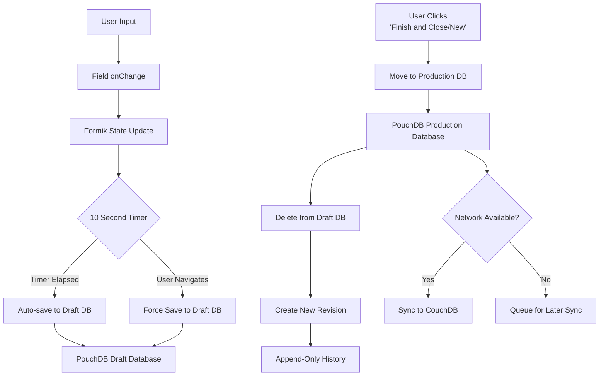
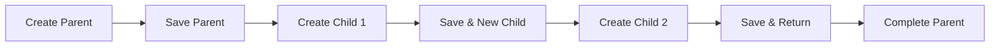
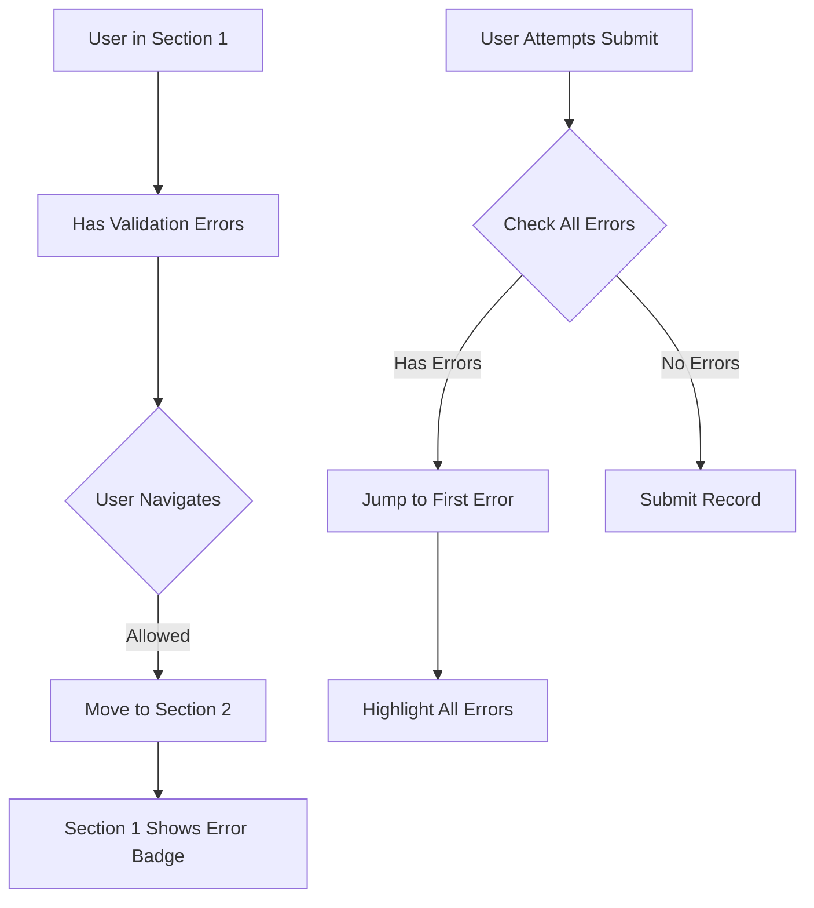

# Form Navigation and Data Flow - Third Draft Documentation
## Fieldmark/FAIMS3 Technical Reference

### Document Classification
- **Component Type**: Core System Behavior
- **Audience Tags**: {designer} {developer} {claude-code} {user}
- **Depth Levels**: {essential} {important} {comprehensive}
- **Version**: 1.0.0
- **Last Technical Verification**: August 2025
- **Key Discovery**: Navigation is completely decoupled from validation and sync

---

## 1. Executive Summary {essential} {designer}

### System Overview
Fieldmark's navigation system provides flexible form traversal through either vertical (scrolling) or horizontal (breadcrumb) patterns. Navigation operates independently of validation state and sync operations, allowing users to move freely between sections while data auto-saves to a draft database every 10 seconds. The system currently uses a two-database architecture (draft + production), with production data stored append-only for full history tracking. The draft stage will be eliminated to prevent data loss from forgotten drafts.

### Critical Architecture Decisions
1. **No Navigation Blocking**: Users can navigate freely regardless of validation errors
2. **Automatic Persistence**: Draft saves every 10 seconds (future: no 'drafts', immediate saves to 'production', rely on record history to revert errors)  
3. **Decoupled Sync**: Background synchronization never blocks navigation
4. **Simple State Management**: Navigation state lives in React components, not Redux
5. **Parent-Child Context**: Maintained through React Router location state

### Key Limitations
- No deep linking to specific sections
- No keyboard navigation shortcuts
- No multi-form progress aggregation
- No navigation guards or permission checks (handled at API level)
- Progress percentage doesn't persist across sessions
- Draft data doesn't sync until "Finish and..." clicked (being addressed)

---

## 2. Navigation Patterns {essential} {user}

### Primary Navigation Modes

#### Vertical Organization (Scrolling)
Best for linear data collection workflows:
```
┌─────────────────────────┐
│ Section 1: Basic Info   │
│ [Fields...]             │
├─────────────────────────┤
│ Section 2: Details      │
│ [Fields...]             │
├─────────────────────────┤
│ Section 3: Notes        │
│ [Fields...]             │
└─────────────────────────┘
```
- All sections visible on single page
- Natural scrolling between sections
- Immediate visibility of all data
- Best for forms with <5 sections

#### Horizontal Organization (Breadcrumbs)
Best for complex multi-step workflows:
```
Home > Site > Details > [Current Section]

[Previous] Section 2 of 5 [Next]
```
- One section visible at a time
- Breadcrumb navigation between sections
- Minimal scrolling per section
- Best for forms with many sections or conditional logic

### Navigation State Tracking {important} {developer}

```javascript
// Component state (not Redux)
state = {
  activeStep: 2,              // Current section index
  view_cached: "details",     // Current section ID
  visitedSteps: Set(["basic", "details"]) // Visited sections
}
```

**Important**: Navigation position is NOT persisted - users return to first section on reload.

---

## 3. Data Flow Architecture {comprehensive} {developer}

### Save and Persistence Flow



**Current System**: Two separate PouchDB instances
- **Draft Database**: Temporary storage, auto-saves every 10 seconds
- **Production Database**: Append-only record history after user clicks "Finish and..."

**Future System**: Single production database only
- Eliminate draft database entirely
- All changes save directly to production as new revisions
- "Finish and..." buttons become pure navigation
- Rely on record history viewer to review/revert changes

### Draft Storage Structure (To Be Eliminated) {important} {developer}

**Current: Separate Draft Database**
```json
{
  "_id": "drf-uuid-v4-here",  // Draft ID prefix
  "created": "2024-03-15T10:30:00Z",
  "updated": "2024-03-15T10:40:00Z",
  "fields": {
    "site-name": "Test Site",
    "description": "Archaeological survey"
  },
  "annotations": {},
  "attachments": {},
  "project_id": "project-123",
  "existing": null,  // Or {record_id, revision_id} for edits
  "type": "Survey",
  "field_types": {},
  "record_id": "rec-uuid"
}
```

**Issues with Draft System**:
- Stored in separate PouchDB instance from production
- Doesn't sync until user clicks "Finish and..."
- Often forgotten, leading to data loss
- Creates confusion about data state

### Future: Eliminating the Draft Stage {important} {designer}

**Current Problems with Draft System**:
- Users forget to click "Finish and..." leaving data in draft limbo
- Drafts don't sync until moved to production
- Confusion between draft and published states
- Data loss when drafts are abandoned

**Planned Changes** (High Priority):
- Remove draft database entirely
- Every change saves directly to production database
- Production database already append-only (keeps full history)
- "Finish and Close/New" buttons become navigation only
- Record history browser for viewing/reverting changes
- No more "draft" vs "published" distinction

---

## 4. Parent-Child Navigation {essential} {designer}

### Recommended Workflow



### Parent-Child Data Transfer {important} {developer}

#### Location State Structure
```javascript
{
  parent_record_id: "parent-123",
  parent_link: "/project/123/record/parent-123",
  field_id: "children-relationship",
  child_record_id: "child-456"
}
```

#### Sticky Fields Configuration {important} {designer}
Fields that should carry data between child records:
```json
{
  "excavation-unit": {
    "component-name": "TextField",
    "component-parameters": {
      "sticky": true,  // Preserves value for next child
      "name": "unit",
      "label": "Excavation Unit"
    }
  }
}
```

### Navigation Options After Save

**Current System** (with draft database):

| Button | Current Behavior | Future Behavior (no drafts) |
|--------|------------------|----------------------------|
| Finish and Close | Publishes to production + Returns to project | Just returns to project |
| Finish and New | Publishes to production + Creates new record | Just creates new record |
| Cancel | Discards draft + Returns | Returns (changes already saved) |
| Auto-save | Saves to draft DB only | Saves to production |

**For Child Records**:

| Action | Behavior | Use Case | Implementation |
|--------|----------|----------|----------------|
| Save & New Child | Publishes current child + Creates new with parent context | Multiple specimens | `navigateAfterSaveChild()` |
| Save & Return | Publishes child + Returns to parent form | Finished with children | Uses `parent_link` from state |
| Save & Continue | Saves to draft + Stays in form | More edits needed | Default behavior |

---

## 5. Progress Tracking {essential} {user}

### Progress Calculation {important} {developer}

```javascript
// Only counts visible, required fields
const progress = requiredFields
  .filter(field => isFieldVisible(field))
  .filter(field => hasValue(field))
  .length / totalVisibleRequired;
```

### Progress Display Patterns

#### Mobile Stepper
```
[<] Step 2 of 5 [>]
```
- Shows current position
- Total section count
- Previous/Next navigation

#### Desktop Stepper
```
[✓] Basic Info -- [!] Details -- [ ] Photos -- [ ] Review
```
- ✓ = Visited, no errors
- ! = Visited, has errors  
- □ = Not visited

### Progress Scope {important} {designer}

**Current Implementation**:
- Progress per individual record only
- Recalculates on every render
- Adjusts dynamically for conditional fields
- Does NOT persist across sessions

**Future Considerations**:
- Parent + children aggregate progress
- Multi-form notebook progress
- Persistent progress tracking

---

## 6. Validation and Navigation {essential} {designer}

### Non-Blocking Validation Pattern



### Error Navigation Behavior {important} {developer}

```javascript
// Current: Non-blocking navigation
onChangeStepper(step) {
  // No validation check - always allows navigation
  this.setState({
    activeStep: step,
    view_cached: views[step]
  });
  this.updateVisitedSteps(views[step]);
}

// Future: Jump to error on submit
handleSubmit() {
  const errors = validateForm();
  if (errors.length > 0) {
    jumpToField(errors[0].fieldId);  // First error
    highlightAllErrors(errors);       // All errors visible
  }
}
```

### Visual Error Indicators

| Platform | Section with Errors | Required Fields | Completed Section |
|----------|-------------------|-----------------|-------------------|
| Desktop Tabs | Red dot with count | Asterisk (*) | Checkmark (✓) |
| Desktop Inline | Red text below header | Asterisk (*) | Green border |
| Mobile | Red badge on step | Red asterisk | Green checkmark |

---

## 7. Synchronization Behavior {important} {developer}

### Sync Independence Principle

Synchronization operates completely independently of navigation:

```javascript
// Navigation continues regardless of sync state
const canNavigate = true;  // Always true
const isSyncing = useSelector(state => state.project.isSyncing);
// isSyncing state available but never blocks navigation
```

### Background Sync Process

1. **Continuous Operation**: Sync runs whenever network available
2. **Queue Management**: Changes queued if offline
3. **No Navigation Impact**: Users work uninterrupted
4. **Visual Indicators**: Optional sync status display
5. **Conflict Resolution**: Handled separately in Control Centre

### Sync Status Communication {comprehensive} {developer}

```javascript
// Redux state available but not enforced
state.project.isSyncing     // true during active sync
state.project.lastSyncTime  // timestamp of last successful sync
state.project.syncQueue     // pending changes count
state.project.syncErrors    // any sync failures
```

---

## 8. Breadcrumb Navigation {important} {developer}

### Implementation Details

```typescript
// Breadcrumb truncation on mobile
const abbreviateTitle = (title: string) => {
  if (title.length > 10 && !not_xs) {
    return title.substring(0, 7) + '...';
  }
  return title;
};

// Responsive breadcrumb limits
<MuiBreadcrumbs
  maxItems={not_xs ? 4 : 2}        // Desktop: 4, Mobile: 2
  itemsAfterCollapse={not_xs ? 2 : 1}
  itemsBeforeCollapse={not_xs ? 0 : 1}
>
```

### Breadcrumb Behavior Rules

1. **Simple Navigation Only**: No state display or validation indicators
2. **Auto-save on Click**: Changes save to draft before navigation
3. **No Deep Linking**: Cannot link to specific sections via URL
4. **Responsive Display**: Collapses on mobile to save space

---

## 9. Edge Cases and Error Handling {comprehensive} {developer}

### Orphaned Child Records

**Scenario**: Parent record deleted while children exist

**Current Behavior**:
- Children remain in database (orphaned)
- Still accessible if ID known
- No automatic cleanup
- Manual intervention required

**Recommended Practice**: Always delete children before parent

### Missing Parent Context

**Scenario**: Creating child without parent

**Behavior**:
```javascript
// Without parent context
location.state = null;  // No parent_link or parent_record_id

// Record created but unlinked
{
  "relationship": null,  // No parent connection
  // Rest of child data...
}
```

**Recovery**: Must manually link via relationship field edit

### Navigation to Non-Existent Records

**Current Behavior**:
- No 404 handling
- Database error bubbles up
- White screen possible

**Planned Improvement**:
```javascript
// Future error boundary
if (!recordExists) {
  return <RecordNotFound />;
}
```

### Concurrent Edit Conflicts

**Scenario**: Same record edited on multiple devices

**Resolution**:
1. Both edits save locally
2. Sync creates conflict
3. Control Centre shows conflict
4. User chooses winning version
5. Navigation unaffected throughout

---

## 10. Performance Considerations {comprehensive} {developer}

### Navigation Performance Issues

| Issue | Impact | Mitigation |
|-------|--------|------------|
| Progress recalculates every render | CPU usage | Memoize calculation |
| All sections render initially | Memory spike | Implement lazy loading |
| Validation on every change | UI lag | Debounce validation |
| Large breadcrumb arrays | Render delay | Virtualize breadcrumbs |

### Optimization Patterns

```javascript
// Memoized progress calculation
const progress = useMemo(
  () => calculateProgress(fields, values),
  [fields, values]
);

// Debounced navigation
const debouncedNavigate = useMemo(
  () => debounce(handleNavigate, 300),
  []
);
```

---

## 11. Navigation Patterns Library {important} {designer}

### Pattern 1: Linear Survey Collection

```json
{
  "sections": ["site", "context", "finds", "photos", "notes"],
  "navigation": "inline",
  "validation": "soft",
  "progress": "per-section"
}
```
**Use When**: Sequential data collection, minimal backtracking

### Pattern 2: Hierarchical Recording

```json
{
  "parent": "excavation-unit",
  "children": ["contexts", "samples", "finds"],
  "navigation": "tabs",
  "sticky_fields": ["unit_id", "date"],
  "auto_save": true
}
```
**Use When**: One-to-many relationships, repeated child creation

### Pattern 3: Conditional Workflow

```json
{
  "sections": {
    "basic": {"always": true},
    "archaeological": {"condition": "type == 'archaeological'"},
    "ecological": {"condition": "type == 'ecological'"}
  },
  "navigation": "breadcrumb",
  "skip_hidden": true
}
```
**Use When**: Dynamic forms, role-based sections

---

## 12. Best Practices {essential} {designer}

### DO:
✅ Create parent records before children  
✅ Use sticky fields for repeated child data  
✅ Configure validation as warnings when possible  
✅ Test navigation on both mobile and desktop  
✅ Keep section names short for mobile display  
✅ Design for offline-first operation  
✅ Remember to click "Finish and..." to move data to production (until draft system removed)

### DON'T:
❌ Rely on navigation blocking for validation  
❌ Create orphaned child records intentionally  
❌ Assume navigation state persists  
❌ Put critical actions in breadcrumbs  
❌ Exceed 5-7 sections without good reason  
❌ Forget drafts don't sync until published (current system)  

---

## 13. Migration Guide: Eliminating Draft Database {important} {developer}

### Current Two-Database System

```javascript
// Current: Separate draft and production databases
User enters data → Draft DB (auto-save) → Click "Finish" → Production DB (append-only) → Draft deleted
```

**Two PouchDB Instances**:
1. **Draft Database**: Temporary, not synced, auto-saves every 10 seconds
2. **Production Database**: Append-only history, syncs to CouchDB

### Future Single-Database System

```javascript
// Future: Direct to production, no draft stage
User enters data → Production DB (immediate save as revision) → History preserved
```

**Single PouchDB Instance**:
- All changes create new revisions immediately
- Full history available for review/revert
- Syncs continuously to CouchDB
- No draft/published distinction

### What Changes for Users

| Current Behavior | Future Behavior |
|-----------------|-----------------|
| Data in draft until "Finish and..." clicked | Data in production immediately |
| Drafts may be forgotten/lost | All changes preserved automatically |
| "Finish and Close" publishes + navigates | "Finish and Close" only navigates |
| Can't see draft data from other devices | All data visible after sync |
| Draft/Published status indicators | Single status: all data is "live" |

### Migration Requirements

1. **UI Changes**:
   - Remove draft badges/indicators
   - Change "Finish and..." button labels
   - Add revision history viewer
   - Add revert controls

2. **Backend Changes**:
   - Remove draft database instance
   - Update save logic to write to production
   - Ensure revision API supports browsing
   - Create revert mechanism

3. **User Communication**:
   - "Your data saves automatically"
   - "No more draft/publish steps"
   - "Use history to review changes"
   - Training on revision browser

---

## See Also

- [Notebook Structure Documentation](./notebook-structure.md) - Form, section, and field organization
- [Validation System](./validation.md) - Validation rules and error handling  
- [Conditional Logic Guide](./conditional-logic.md) - Dynamic form behavior
- [RelationshipField Documentation](./relationship-field.md) - Parent-child configuration
- [Synchronization Architecture](./sync.md) - Detailed sync behavior
- [Control Centre Guide](./control-centre.md) - Export and conflict resolution

---

**Document Version**: 1.0.0  
**Last Updated**: August 2025  
**Technical Verification**: Complete via 60+ Q&A with Claude Code  
**Production Status**: Ready for use

*Critical Note: This documentation reflects navigation as of August 2025. The system currently uses a two-database approach (draft + production), with production already using append-only storage. The draft database is planned for removal, after which all changes will save directly to the production database, eliminating draft-related data loss issues while maintaining the full revision history already available in production.*