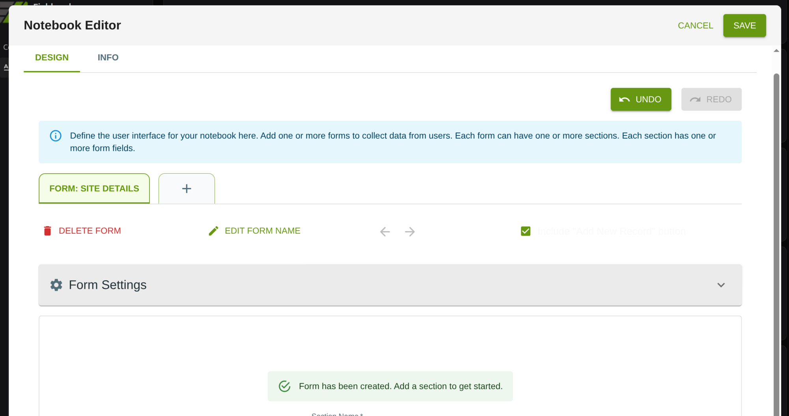
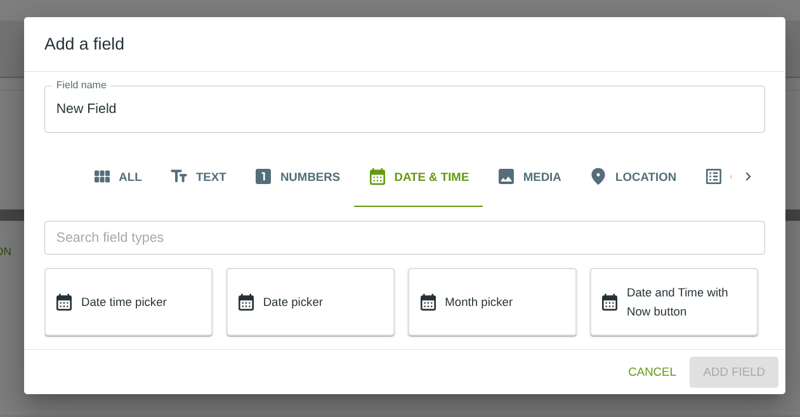
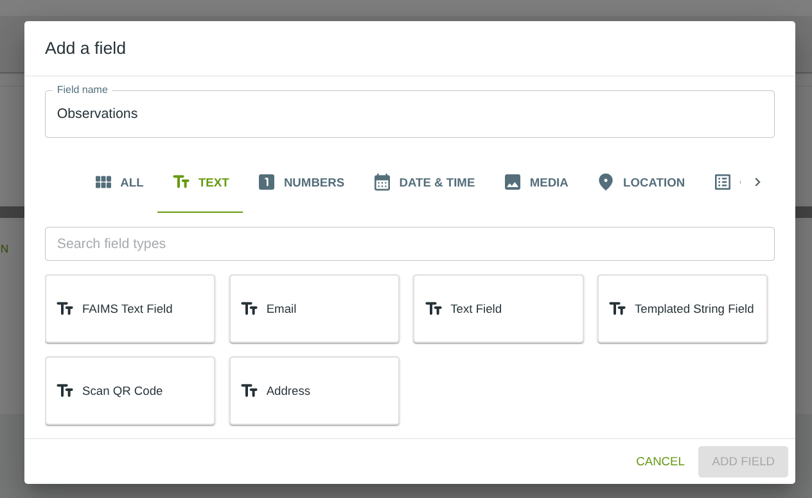

# Your First Notebook in 15 Minutes 🚀

*Welcome to Fieldmark! In the next 15 minutes, you'll create your first data collection notebook and enter your first record. No experience needed - just follow along!*

## What You'll Achieve

By the end of this guide, you'll have:
- ✅ Created a working notebook from scratch
- ✅ Added fields for data collection
- ✅ Entered and saved your first record
- ✅ Learned how to invite team members
- ✅ Gained confidence to explore further

## Before You Start

**You'll need**: A Fieldmark account with at least Standard User permissions. If you don't have an account yet, ask your project administrator or team admin to invite you.

**Browser**: Works best with Chrome, Firefox, or Safari. Make sure you're using a recent version.

**URLs you'll use**:
- **Dashboard URL**: Usually `https://dashboard.fieldmark.app` (for designing and managing notebooks)
- **Data Collection App URL**: Usually `https://app.fieldmark.app` (for entering records)
- Note: Your organization may have custom URLs - check with your administrator

<!-- URLs comparison explained in text above - no screenshot needed -->

### 📖 Quick Terms to Know

Before we dive in, here are five terms you'll see:

- **Dashboard**: Your home screen after logging in - think of it as mission control
- **Notebook**: A data collection form you create and customise
- **Notebook Editor**: The visual tool where you build and modify notebooks and templates (sometimes just called "Editor")
- **Records**: The actual data entries people create using your notebook
- **Fields**: Individual input elements (like text boxes or photo buttons) in your form

---

## Step 1: Access Your Dashboard (2 minutes)

Let's begin by logging into Fieldmark and finding our way around.

### Login to Fieldmark

1. Open your browser and go to your Fieldmark Dashboard URL (usually `https://api.fieldmark.app`)
2. Enter your email and password (or select the appropriate SSO provider, e.g., Google)
3. Click **Sign In**

### Welcome to Your Dashboard!

After logging in, you'll see the Dashboard Overview. This is your command centre where you can:
- Create new notebooks (from scratch or from templates)
- Access and edit existing notebooks
- Create and edit templates
- Manage teams and users

> ✨ **Pro Tip**: Bookmark this page! You'll be coming back here often. In most browsers, press `Ctrl+D` (Windows/Linux) or `Cmd+D` (Mac) to bookmark.

### ✓ You'll Know It Worked When...
- You see your name or email in the bottom-left user menu
- The Dashboard (right pane) shows navigation options like Notebooks, Templates, Users, Teams
- You see a list of notebooks in the main window
- No error messages or login prompts appear

Great! You're in. Now let's create something amazing.

---

## Step 2: Create Your First Notebook (3 minutes)

Creating a notebook is easy. Let's do it!

### Create a New Notebook

From the Dashboard:

1. Click **Notebooks** in the left navigation
2. Click **+ Create Notebook**

### Name Your Creation

In the creation dialog:
1. **Template/Notebook Name**: Type "My First Survey" (or any name you like!)
2. **Select team**: Use the dropdown (required)
   - If you have only one team, it will be pre-selected
   - If you have multiple teams, choose the appropriate one for this notebook
3. Ignore the 'optional' fields
4. Click **Create Notebook**

### Navigating to your new, blank notebook

After you click 'Create Notebook', you will return to the list of notebooks, where you should:
1. **Find your new notebook**:
   - It will appear at the end of the notebook list
   - **If you have many notebooks**: Look for pagination controls at the bottom of the list (showing "1-10 of X notebooks" with arrow buttons)
   - **Quick tip**: Use the search bar at the top of the list to search for "My First Survey"
   - Scroll down and click through pages until you see your notebook

2. Click on the name of the notebook you just created (last in the list)
3. Click on the **Actions** tab
4. Click **Open in Editor**

### Hello, Notebook Editor!

Fantastic! You're now in the Notebook Editor. This is where the magic happens.

You'll see the main interface elements:
- **Top bar**: CANCEL and SAVE buttons on the right
- **Action buttons**: UNDO and REDO buttons (below the top bar, above the tabs)
- **Tab bar**: DESIGN and INFO tabs on the left
- **"+" button**: Click to add a new form
- **Form editing area**: Shows "Form Name" field with "Form 1" pre-filled, and "ADD NEW FORM" button

> ⚠️ **Common Mistake**: Don't worry if it looks empty - that's normal! We're about to fill it with useful fields. Remember to click the green SAVE button in the top-right when you want to save your work.

> 💡 **Tip**: Notice the UNDO and REDO buttons below the top bar. Use these to recover from accidental deletions or changes. They're your safety net while building forms!

### ✓ You'll Know It Worked When...
- The Notebook Editor opens with "Form 1" in the Form Name field
- You see the blue info box with UI instruction text
- The "+" button is visible below the info box (for adding new forms)
- The Form Name field (showing "Form 1") is visible to the left of the green "ADD NEW FORM" button
- The DESIGN tab is selected and shows a green underline
- SAVE and CANCEL buttons are visible in the top-right
- No error messages appear

> 📱 **Mobile Users**: The Notebook Editor works best on tablets or computers. If you're on a phone, you might want to switch devices for this setup phase. Once created, your notebook will work perfectly on mobile for data collection!

### Understanding Notebooks Structure

Before we add fields, let's understand how Fieldmark organizes your data:

**Notebooks** contain **Forms** → **Forms** contain **Sections** → **Sections** contain **Form Fields** (where you enter data)

Think of it like this:
- 📓 **Notebook** = Your entire survey or data collection project ("My First Survey")
- 📋 **Form** = A specific data entry screen ("Site Details", "Environmental Observations", etc.)
- 📂 **Section** = A group of related fields within a form (optional, for organization)
- ✏️ **Form Field** = Individual data entry points (text boxes, dropdowns, etc.)

Right now, we have a notebook with one empty form called "Form 1". Let's make it more meaningful!

### Name Your Form

Let's give "Form 1" a descriptive name:

1. **Click in the Form Name field** (where it says "Form 1")
2. **Clear the text** and type **"Site Details"** (or another name that describes what data you'll collect)
3. **Press the green "ADD NEW FORM" button** to create the form

> ✨ **Pro Tip**: Use descriptive form names like "Daily Observations", "Specimen Collection", or "Interview Notes" - they'll make it easier to navigate your data later.

### ✓ You'll Know It Worked When...
- The form name has changed from "Form 1" to your chosen name ("Site Details")
- You see the form badge showing "FORM: SITE DETAILS" in the editing area
- A green success message appears: "Form has been created. Add a section to get started."
- Form controls are visible: DELETE FORM and EDIT FORM NAME options
- Form Settings panel is visible below

Now you're ready to add a section to organize your fields!

### Create Your First Section

Sections help organize related fields within a form. Let's create one:

1. **Scroll down** to find the "Section Name" field (it should be visible below the success message)
2. **Click in the Section Name field** and type **"Basic Information"** (or another name that groups your first set of fields)
3. **Click the "+" button** next to the Section Name field to create the section

> ✨ **Pro Tip**: Use section names like "Location Details", "Measurements", or "Photos" to group related fields - this makes forms easier to navigate, especially on mobile devices.

### ✓ You'll Know It Worked When...
- The interface changes to show your section: "Basic Information" with a green badge showing "1" (representing "first section")
- Section controls appear: DELETE SECTION, DUPLICATE SECTION, MOVE SECTION, EDIT SECTION NAME, ADD NEW SECTION
- You see the **"ADD A FIELD"** button (with green plus icon)
- "Visible Fields" and "Hidden Fields" areas are shown below
- The section is ready to receive form fields

Perfect! Now your form has a section, and we're in the main editing interface where we'll add fields!

---

## Step 3: Add Your Fields (5-7 minutes)

Now for the fun part - let's add fields to collect data! We'll add five essential fields, taking our time with each one.

### Part A: Your First Two Fields (2 minutes)

Let's start with the basics - a text field and a dropdown. These are the bread and butter of data collection.

#### Field 1: Site Name (Text Field)

1. **Click the "ADD A FIELD" button** (green button with plus icon)
2. **In the "Add a field" dialog that opens**:
   - **Field name**: Change "New Field" to **"Site Name"**
   - **Field type**: Click on **"FAIMS Text Field"** (single-line text input)
   - Click **"ADD FIELD"** button at bottom

3. **Click on the grey bar** to expand the field
4. **Configure the field**:
   - **Label**: Already shows "Site Name" ✓
   - **Field ID**: Auto-generated as "Site-Name" ✓
   - **Helper Text**: Type "Enter the official site designation or name"
   - **Required**: Toggle ON ☑

### ✓ You'll Know It Worked When...
- The "Site Name" field appears in the "Visible Fields" area
- Helper text displays: "Enter the official site designation or name"
- Required ☑ is checked
- The field is ready for data collection!

> 💡 **More Options**: Fields can also have Advanced Helper Text (formatted popup help), Conditions (show/hide based on other fields), Annotations, or "Copy value to new records" for smart defaults. We'll keep it simple for now!

#### Field 2: Site Type (Radio Buttons)

Now let's add a choice field where users select one option from a list.

1. **Collapse the Site Name field** - click on the grey bar to collapse it
2. **Click the "ADD A FIELD" button**
3. **In the "Add a field" dialog**:
   - **Field name**: Change "New Field" to **"Site Type"**
   - **Navigate to Choice fields**: Click the right chevron (>) next to the category tabs to see more options
   - **Field type**: Click on **"Select one option"** (creates radio buttons)
   - Click **"ADD FIELD"**

4. **Click on the grey bar** to expand the field
5. **Add your options** - these are the choices users will see:
   - You'll see one default option "1" in the list
   - Click the **pencil icon** (edit) next to "1" to open the "Edit Option" dialog
   - Change "1" to **"Habitation"** and click **SAVE**
   - Now use **"Add Option"** field to add the remaining options:
     - Type **"Mortuary"** and click **"Add"**
     - Repeat for: **"Ceremonial"**, **"Workshop/Industrial"**, **"Defensive"**, **"Agricultural"**, **"Other"**
   - Use the drag handles (⋮⋮) or up/down arrows to reorder if needed

6. **Configure the field**:
   - **Label**: Already shows "Site Type" ✓
   - **Field ID**: Auto-generated as "Site-Type" ✓
   - **Helper Text**: Type "Select the primary function of this site"
   - **Required**: Toggle ON ☑
   - **Annotation**: Toggle ON ☑ (allows margin notes for qualifications)
   - **Uncertainty**: Toggle ON ☑ (allows flagging uncertain observations)

### ✓ You'll Know It Worked When...
- The "Site Type" field shows a green "Required" badge in the header
- All 7 options are visible in the list: Habitation, Mortuary, Ceremonial, Workshop/Industrial, Defensive, Agricultural, Other
- Helper text displays: "Select the primary function of this site"
- Required ☑, Annotation ☑, and Uncertainty ☑ are all checked with green checkmarks
- The field is ready for data collection!

> ✨ **Fieldmark Feature**: The **Annotation** and **Uncertainty** toggles are unique to Fieldmark! They help capture data quality nuances:
> - **Annotation**: Add contextual notes (e.g., when selecting "Other", use annotation to describe what type of site it actually is)
> - **Uncertainty**: Flag observations you're unsure about for later review

> 💡 **Pro Tip**: You can use markdown in option text - try `**Important Option**` to make text bold!

**Quick Save**: Click the **SAVE** button in the top-right to save your progress.

### Part B: Date and Long Text (2 minutes)

Now let's add fields for capturing when and what happened.

#### Field 3: Survey Date (Date and Time)

While Fieldmark automatically timestamps all records, explicitly capturing dates as field data is important: it affirms from human input when information was collected and makes data easier to work with when exported.

1. **Collapse the Site Type field** - click on the grey bar to collapse it
2. **Click the "ADD A FIELD" button**
3. **In the "Add a field" dialog**:
   - **Field name**: Change "New Field" to **"Survey Date"**
   - **Field type**: Click on the **DATE & TIME** tab (already visible on first page)
   - Select **"Date and Time with Now button"** (auto-populates with current date/time)
   - Click **"ADD FIELD"**

4. **Click on the grey bar** to expand the field
5. **Configure the field**:
   - **Label**: Already shows "Survey Date" ✓
   - **Field ID**: Auto-generated as "Survey-Date" ✓
   - **Helper Text**: Type "Date and time when this site was surveyed"
   - **Time pre-populated**: Toggle ON ☑ (auto-fills with current date/time when record is created; date/time can still be changed)
   - **Required**: Toggle ON ☑

### ✓ You'll Know It Worked When...
- The "Survey Date" field appears in the Visible Fields list with "DateTimeNow" badge
- Helper text displays: "Date and time when this site was surveyed"
- Time pre-populated ☑ and Required ☑ are both checked
- The field is ready to auto-populate when users create records!

#### Field 4: Observations (Multi-line Text)

For longer descriptions, we need a multiline text field.

1. **Collapse the Survey Date field** - click on the grey bar to collapse it
2. **Click the "ADD A FIELD" button**
3. **In the "Add a field" dialog**:
   - **Field name**: Change "New Field" to **"Observations"**
   - **Field type**: Click on the **TEXT** tab (already visible on first page)
   - Select **"Text Field"** (multi-line text area for longer notes)
   - Click **"ADD FIELD"**

4. **Click on the grey bar** to expand the field
5. **Configure the field**:
   - **Label**: Already shows "Observations" ✓
   - **Field ID**: Auto-generated as "Observations" ✓
   - **Helper Text**: Type "Describe site conditions, features, and any notable characteristics"
   - Leave **Required** unchecked (observations can be optional)

### ✓ You'll Know It Worked When...
- The "Observations" field appears in the Visible Fields list with "TextField" badge
- Helper text displays: "Describe site conditions, features, and any notable characteristics"
- The field is ready for longer text entries!

> 📱 **Mobile Tip**: Text Field automatically expands on mobile devices as users type more content, making it perfect for field notes!

### Part C: Adding Photo Capability (1 minute)

Let's add the ability to capture photos - essential for field documentation!

#### Field 5: Site Photo (Camera)

1. **Collapse the Observations field** - click on the grey bar to collapse it
2. **Click the "ADD A FIELD" button**
3. **In the "Add a field" dialog**:
   - **Field name**: Change "New Field" to **"Site Photo"**
   - **Field type**: Click on the **MEDIA** tab
   - Select **"Take Photo"** (enables camera capture)
   - Click **"ADD FIELD"**

4. **Click on the grey bar** to expand the field
5. **Configure the field**:
   - **Label**: Already shows "Site Photo" ✓
   - **Field ID**: Auto-generated as "Site-Photo" ✓
   - **Helper Text**: Type "Photograph the site for documentation"
   - Leave **Required** unchecked (photos can be optional)
   - **Annotation**: Toggle ON ☑
   - **Annotation Label**: Change from "annotation" to **"Photo notes"**

### ✓ You'll Know It Worked When...
- The "Site Photo" field appears in the Visible Fields list with "TakePhoto" badge
- Helper text displays: "Photograph the site for documentation"
- Annotation ☑ is checked with custom label "Photo notes"
- All 5 fields are now visible: Site Name, Site Type, Survey Date, Observations, Site Photo
- Your form is ready for data collection!

### Configure Form Settings

Now let's configure how the form behaves when collecting data.

1. **Find the Form Settings panel** at the top of the form editor (below "FORM: SITE DETAILS")
2. **Click anywhere in the grey "Form Settings" bar** to expand the settings if collapsed
3. **Configure the settings**:
   - **Finish Button Behavior**: Leave as **"Always Show"** (users can save records anytime)
   - **Layout Style**: Leave as **"Tabs"** (sections display as tabs for organized navigation)
   - **Summary Fields**: Click the dropdown and select both **"Site Name"** and **"Site Type"** (these will show in the record list table)
   - **Human-Readable ID Field**: Select **"Site Name"** (provides meaningful record labels instead of opaque, computer-generated identifiers (UUIDs))

> 💡 **Advanced Option**: The "Finish Button Behavior" can be changed to "Show Only When No Errors Exist" to ensure all required fields are completed before allowing save, or "Show Once All Sections Visited" to guide users through multi-section forms.

### ✓ You'll Know It Worked When...

- Form Settings panel shows all four settings configured
- Summary Fields displays "Site Name ×" and "Site Type ×" (× removes item)
- Human-Readable ID Field shows "Site Name"
- All 5 fields are visible in your "Basic Information" section below

### Save Your Work

**Important:** The Notebook Editor does not auto-save. Let's save your progress now.

1. **Click the green SAVE button** in the top-right corner
2. **You'll be returned to the Dashboard** - this is expected behavior
3. **To continue editing later**, simply click **"Open in Editor"** again from the Dashboard

> ⚠️ **Remember to Save**: Get in the habit of clicking SAVE periodically as you work. The Editor will close and return you to the Dashboard each time you save, but you can immediately click "Open in Editor" to resume editing.

> 💡 **Tip**: You can always resume editing your notebook at any time by returning to the Dashboard, selecting your notebook from the list, clicking the **Actions** tab, and choosing **Open in Editor**. Your work is saved and ready to continue.

> ✨ **Pro Tip**: Start simple like we just did. You can always come back to add more fields, validation rules, or conditional logic. Most successful notebooks begin with 5-10 fields and evolve based on actual use. Once you're comfortable with the basics, explore the **INFO tab** to add project metadata like project lead, organization, and custom key-value pairs.

---

## Step 4: Activate and Test Your Notebook (3 minutes)

Time to see your creation in action! Let's activate your notebook in the Fieldmark mobile app and enter test data.

### Open the Fieldmark App

Your notebook has been saved in the Editor. Now let's activate it for data collection:

1. **Open a new browser tab** and navigate to your Fieldmark data collection app URL (usually `https://app.fieldmark.app`)
2. **Log in** with the same credentials you used to access the Editor

### Activate Your Notebook

When the app opens, you'll see the "My Notebooks" screen:

1. **Click on the "NOT ACTIVE" tab** - you'll see a list of notebooks that need activation
2. **Find your notebook** in the list (look for "My First Survey" or whatever name you chose)
   - If you have many notebooks, scroll through the list to locate yours
3. **Click the green "ACTIVATE" button** next to your notebook
4. **A modal dialog appears** explaining activation

5. **Read the information** in the modal:
   - Explains that activating downloads existing records to your device
   - Warns that you need a stable internet connection
   - Notes that you currently cannot de-activate notebooks (feature coming soon)
6. **Click the green "ACTIVATE" button** in the modal to confirm
7. **You'll be automatically taken to the "ACTIVE" tab** - your notebook now appears in the Active list

> 💡 **What does Active mean?** When a notebook is "Active", all data you collect will be saved to your device for offline work. Activating downloads existing notebook records to your device. We recommend completing this while you have a stable internet connection.

> ⚠️ **Don't see your notebook?** If your notebook doesn't appear in the NOT ACTIVE list, make sure you're logged in with the same credentials you used in the Editor. If you still don't see it, contact your Fieldmark administrator about permissions.

### ✓ You'll Know It Worked When...
- The view automatically switches to the "ACTIVE" tab showing "ACTIVE (1)"
- Your notebook appears in the list under the ACTIVE tab
- You can now click on the notebook name to open it

### Understanding Offline-First Design

Before we continue, here's an important feature: Fieldmark is designed to work offline.

> 💡 **Offline-First**: No network connection is needed for data collection in the field. Your data is saved locally to your device, and it automatically syncs to the server when you have connectivity (unless you've disabled sync in Settings). This means you can collect data anywhere, anytime.

This is why we "activate" notebooks - the activation process downloads the notebook structure to your device so you can work without internet.

### Open Your Notebook

Now let's open your notebook to start collecting data:

1. **Click on your notebook's name** in the ACTIVE tab (e.g., "Quickstart-test" or "My First Survey")

You'll see the record list interface:
- **ADD NEW SITE DETAILS** button (orange) - for creating new records
- **REFRESH RECORDS** button (green) - refreshes the displayed list from local database (useful to see records synced in the background)
- **MY SITE DETAILSS (0)** tab - shows your record list (currently empty)
- Additional tabs: DETAILS, SETTINGS, MAP
- **Empty table** showing column headers for your data (Site Name, Site Type, Created, Last Updated, etc.)
- "No rows" message - because this is a brand new notebook

### Create Your First Record

Let's add your first record:

1. **Click the orange "ADD NEW SITE DETAILS" button**

You'll see the data entry form with a progress bar at the top. Notice that required fields are marked with a red asterisk (*).

2. **Fill in Site Name**:
   - Type **"Test Location Alpha"** in the Site Name field
   - Helper text shows: "Enter the official site designation or name"

3. **Fill in Site Type**:
   - Select **"Habitation"** from the radio button options
   - Notice the **blue dog ear icon** on the right - this opens annotation and uncertainty fields

4. **Optional: Try the Annotation feature** (if you want to explore it):
   - Click the **blue dog ear icon** next to Site Type
   - An annotation text area and uncertainty checkbox appear below
   - Type a note like: "This site is likely a dwelling but may be a workshop."
   - Check the **uncertainty** checkbox to flag this observation as uncertain
   - This is a powerful feature for capturing data quality context!

5. **Fill in Survey Date**:
   - The field auto-fills with the current date/time (e.g., "02/10/2025, 18:17:14")
   - You can click the **calendar icon** to open a date/time picker if you need to change it
   - Or click **NOW** button to update to the current time
   - Click "Clear" or "Today" in the picker as needed

6. **Fill in Observations**:
   - Type in the multi-line text area: "I looked at the site and it's a dwelling"
   - This field is optional (no red asterisk)
   - Helper text shows: "Describe site conditions, features, and any notable characteristics"

7. **Add a Site Photo**:
   - Scroll to the Site Photo section
   - You'll see "No Photos Yet" with a **"TAKE FIRST PHOTO"** button
   - Click the green photo button
   - Allow camera permissions if asked
   - Take any photo (even of your desk - this is just practice!)
   - Note: Site Photo also has a blue dog ear icon for "Photo notes" annotation

### Save Your Record

At the bottom of the form, you'll see three buttons:

- **FINISH AND CLOSE SITE-DETAILS** (green) - saves the record and returns to the record list
- **FINISH AND NEW SITE-DETAILS** (orange text) - saves the record and immediately opens a new blank form (useful for entering multiple records in a row)
- **CANCEL** (orange) - discards the record without saving

**Click "FINISH AND CLOSE SITE-DETAILS"** to save your first record!

Congratulations! 🎉 You've just created your first Fieldmark record!

### ✓ You'll Know It Saved When...

You're automatically returned to the record list view. Here's what you'll see:

- **MY SITE DETAILSS (1)** tab now shows 1 record (changed from "(0)")
- Your record appears in the table with the following columns:
  - **Sync**: Orange icon with three dots (indicates not yet synced to server)
  - **Site Name**: "Test Location Alpha" (Summary Field #1)
  - **Site Type**: "Habitation" (Summary Field #2)
  - **Created**: Timestamp like "2025-10-02 18:32:49"
  - **Created By**: Your username (e.g., "shawn@fieldnote.com.au")
  - **Last Updated**: Same as Created for a new record
  - **Last Updated By**: Your username
- **Pagination** at bottom shows "1-1 of 1"

> 💡 **About Sync**: Fieldmark automatically syncs records when you're online. The orange icon with three dots means the record hasn't synced to the server yet. Once synced, it will turn into a green cloud icon with a checkmark. If other team members have added records, click the **REFRESH RECORDS** button to update your view with records that synced in the background.
>
> If multiple team members edit the same record while offline, Fieldmark has a conflict resolution workflow to help you merge changes.

### Notebook Settings

Before we finish, let's explore the SETTINGS tab to understand sync and data management options.

1. **Click on the SETTINGS tab** (next to MY SITE DETAILSS, DETAILS, and MAP tabs)

You'll see several important controls:

**Sync Notebook**
- Toggle switch (currently ON)
- Controls whether this notebook syncs to the server
- Turn this OFF to save mobile data when working in the field
- Your data is still saved locally; it will sync when you turn it back ON

**Get attachments from other devices**
- Toggle switch (currently Off)
- When enabled, Fieldmark automatically downloads photos and attachments created by other team members
- **Trade-off**: Lets you see what your team is documenting, but uses more storage and mobile data
- **Important**: Your uploads always go to the server regardless of this setting
- Recommended: Keep OFF to minimize data usage, turn ON when on WiFi if you want to review team photos

**Deactivate Notebook**
- Removes the notebook from your active list
- **Warning**: Make sure all your data has synced before deactivating (check for green cloud icons!)
- Click **DEACTIVATE NOTEBOOK** button (red text) only if you're done using this notebook on this device

> 💡 **Data Management Tip**: If you're working in areas with limited connectivity or want to conserve mobile data, turn OFF "Sync Notebook" while collecting data. Turn it back ON when you have WiFi to upload your records to the server.

---

## 🎯 You Did It!

Congratulations! You've successfully created your first Fieldmark notebook and collected your first record. In less than 15 minutes, you've:

- ✅ Created a notebook in the Notebook Editor
- ✅ Added forms, sections, and fields with proper configuration
- ✅ Configured Form Settings (Summary Fields, HRID)
- ✅ Activated the notebook in the Fieldmark app
- ✅ Created and saved your first record
- ✅ Learned about sync settings and data management

**This is a major milestone!** You now understand the core Fieldmark workflow from design to data collection.

---

## Next Steps

Ready to take your notebook further? All of these features are managed through the **Control Centre** after selecting your notebook from the list:

- **Invite team members** - Share your notebook and assign roles (Data Collector, Reviewer, Viewer, Admin)
- **Add more forms, sections, and fields** - Build out your data collection structure
- **Export your data** - Download records as CSV, JSON, or other formats for analysis
- **Turn your notebook into a template** - Reuse and modify your design for similar projects
- **Explore conditional logic** - Make forms that adapt based on user input
- **Try advanced field types** - Geolocation, related records, auto-incrementers, and more

> 💡 **Control Centre Access**: Log into the Control Centre, select your notebook from the list, and explore the management options available to you based on your permissions.

---

## Get Help

- **Documentation**: Comprehensive guides for all Fieldmark features
- **Team Support**: Ask your team administrator for organization-specific guidance
- **In-app Help**: Look for the help icon (?) throughout the interface

---

## Keep Learning

You've mastered the basics - now it's time to experiment! Try creating a notebook for a real use case, test it on mobile devices, and explore the features that matter most to your work.

**Welcome to the Fieldmark community!** 🎉

---

*Remember: Every expert was once a beginner. You've taken your first steps, and that's the hardest part. Keep experimenting, keep learning, and most importantly - keep collecting great data!*