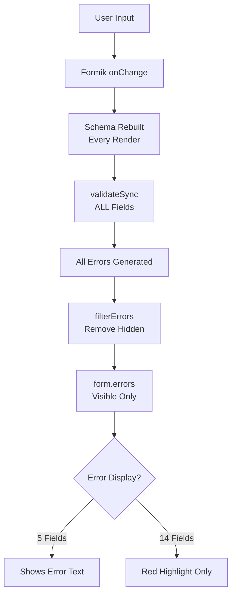

<!-- concat:boundary:start section="dynamic-forms-guide" -->
<!-- concat:metadata
document_id: dynamic-forms-guide
category: patterns
version: 1.0
last_updated: 2025-01-06
purpose: Comprehensive guide to validation and conditional logic for dynamic forms
source_documents:
  - validation.md (33KB)
  - conditional-logic.md (37KB)
  - validation-timing-reference.md (6KB)
-->

# Dynamic Forms Guide

## Overview {essential}

This guide consolidates all knowledge about creating dynamic, responsive forms in Fieldmark through validation rules and conditional logic. It covers validation strategies, conditional field display, cross-field dependencies, error handling patterns, and performance considerations for creating adaptive data collection instruments.

## Critical Limitations and Warnings {essential}

### Validation System Limitations {essential}

1. **No soft validation** - All validation is "hard" (blocking), no warnings that can be overridden
2. **14 of 19 field types don't display error messages** - Only show red highlighting
3. **No conditional validation** - Cannot make fields conditionally required based on other fields
4. **No cross-field validation** - Cannot validate relationships between fields
5. **Performance issues** - All fields validate on every change, even hidden ones

### Conditional Logic Limitations {essential}

1. **No cross-form references** - Conditions can only reference fields within same form
2. **Hidden fields with validation** - Use required validation on hidden fields with care
3. **Type matching required** - Number fields require number values, not strings
4. **No field ID migration** - When field IDs change, conditions fail silently
5. **Complex fields cannot be used** - Photos, GPS, relationships need workarounds

## Validation System Architecture {important}

### How Validation Actually Works {#validation-architecture}



**Note**: The `filterErrors` function (added January 2025) properly removes validation errors from hidden fields, preventing them from blocking submission. However, be deliberate when adding validation to fields that may be hidden.

### Validation Timing Lifecycle

#### 1. On Mount
- Validation runs immediately when form loads
- Errors hidden (field remains "pristine")
- Establishes initial validation state

#### 2. On Change
- Validation runs synchronously on every value change
- Error display immediate (if component supports it)
- Field transitions from "pristine" to "touched"

#### 3. On Blur
- Re-validates when user leaves field
- Shows/updates error messages
- Confirms "touched" status

#### 4. On Submit
- All fields validated regardless of touched state
- All errors shown, even for untouched fields
- All fields marked as touched

### Performance Characteristics

**Note**: These are estimated thresholds based on code analysis. Actual performance varies significantly by device, browser, and field complexity.

| Fields | Estimated Validation Time | Potential UI Impact | Recommendation |
|--------|---------------------------|-------------------|----------------|
| ~10 | Minimal | Imperceptible | No issues expected |
| ~50 | Increasing | May notice slight lag | Consider optimization |
| ~100 | Noticeable | Possible lag | Consider splitting form or debouncing |
| 200+ | Significant | Likely performance issues | Architectural changes recommended |

## Field-Specific Validation {important}

### Text Fields {#text-fields}

**Validation capabilities**:
```json
"validationSchema": [
  ["yup.string"],
  ["yup.required", "Required message"],
  ["yup.min", 10, "Minimum 10 characters"],
  ["yup.max", 100, "Maximum 100 characters"],
  ["yup.matches", "^[A-Z]", "Must start with capital"],
  ["yup.email", "Must be valid email"]
]
```

**Error display**: ✅ Full support - shows messages below field

### Number Fields {#number-fields}

**Validation capabilities**:
```json
"validationSchema": [
  ["yup.number"],
  ["yup.required", "Required"],
  ["yup.min", 0, "Must be positive"],
  ["yup.max", 100, "Maximum 100"],
  ["yup.integer", "Must be whole number"]
]
```

**Error display**: ✅ Full support
**Note**: Empty string becomes null, not 0

### Date/Time Fields {#datetime-fields}

**Validation capabilities**:
```json
"validationSchema": [
  ["yup.string"],
  ["yup.required", "Date required"]
]
```

**Error display**: ✅ Full support
**Note**: Limited validation - mostly just required/not required

### Selection Fields {#select-fields}

#### RadioGroup
- **Error display**: ❌ No error text (only red highlight)
- **Fix required**: Add FormHelperText component

#### Select/MultiSelect
- **Error display**: ❌ No error display at all
- **Impact**: Users see nothing when validation fails

#### Checkbox
- **Error display**: ✅ Full support
- **Note**: Boolean validation works correctly

### Location Fields {#location-fields}

**GPS/Map validation**:
```json
"validationSchema": [
  ["yup.object"],
  ["yup.required", "Location required"]
]
```

**Note**: Cannot validate coordinate ranges or precision

### Media Fields {#media-fields}

**Photo/File validation**:
```json
"validationSchema": [
  ["yup.array"],
  ["yup.min", 1, "At least one photo required"],
  ["yup.max", 5, "Maximum 5 photos"]
]
```

**Note**: Async validation after upload completes

### Display Fields {#display-fields}

**No validation** - Display only, no user input

### Relationship Fields {#relationship-field}

**Validation capabilities**:
```json
"validationSchema": [
  ["yup.array"],
  ["yup.min", 1, "At least one relationship required"]
]
```

**Error display**: ❌ No error text shown

### Annotation and Uncertainty Fields {#annotation-fields}

**How Annotations Interact with Validation:**

Annotations and uncertainty markers bypass the validation system entirely:

- **No validation applied**: Annotation text can be any length, any content
- **No required status**: Cannot make annotations mandatory through validation
- **No character limits**: Even if main field has limits, annotation doesn't
- **Always optional**: Users decide when context/exceptions worth noting
- **Hidden field behavior**: Annotations remain even when main field hidden

**Best Practices for Annotations:**
```json
{
  "measurement-field": {
    "validationSchema": [
      ["yup.number"],
      ["yup.required"],
      ["yup.min", 0],
      ["yup.max", 100]
    ],
    "meta": {
      "annotation": {
        "include": true,
        "label": "Measurement notes"  // Specific, not generic
      },
      "uncertainty": {
        "include": true,
        "label": "Estimate"  // Clear meaning
      }
    }
  }
}
```

**Training Over Validation:**
Since annotations can't be required through validation, train users to:
- Always annotate when selecting "Other"
- Note measurement methods that differ from standard
- Document environmental conditions affecting readings
- Explain provisional identifications
- Record equipment problems or limitations

## Conditional Logic System {important}

### Basic Condition Structure {#conditional-basics}

```json
{
  "field-name": {
    "component-name": "TextField",
    "component-parameters": {...},
    "condition": {
      "operator": "equal",
      "field": "trigger-field",
      "value": "expected-value"
    }
  }
}
```

### How Conditions Work

1. **Compilation**: Conditions compiled to JavaScript functions on form load
2. **Controller Fields**: Any field referenced becomes a "controller field"
3. **Evaluation**: Only when controller fields change
4. **Application**: Hide/show fields before render (no flicker)

### Operators Reference

#### Comparison Operators

| Operator | Description | Type Handling | Example |
|----------|-------------|---------------|---------|
| `equal` | Exact match | Strict (===) | `"yes"`, `5`, `true` |
| `not-equal` | Not equal | Strict (!==) | `"no"`, `10`, `false` |
| `greater` | Greater than | Coercion | `10` |
| `greater-equal` | Greater or equal | Coercion | `0` |
| `less` | Less than | Coercion | `100` |
| `less-equal` | Less or equal | Coercion | `999` |
| `regex` | Pattern match | String | `"\\d+"`, `"^[A-Z]"` |

#### Array Operators

| Operator | Description | Example |
|----------|-------------|---------|
| `contains` | Array includes value | `"option1"` |
| `does-not-contain` | Array excludes value | `"option2"` |
| `contains-one-of` | Has at least one | `["A", "B", "C"]` |
| `contains-all-of` | Has all values | `["A", "B"]` |

#### Logical Operators

| Operator | Description | Short-Circuit |
|----------|-------------|---------------|
| `and` | All conditions true | Yes (first false) |
| `or` | Any condition true | Yes (first true) |

## Common Dynamic Form Patterns {important}

### Pattern: Other → Specify {#other-specify}

```json
{
  "category": {
    "component-name": "Select",
    "component-parameters": {
      "label": "Category",
      "ElementProps": {
        "options": [
          {"value": "site", "label": "Archaeological Site"},
          {"value": "artifact", "label": "Artifact"},
          {"value": "other", "label": "Other"}
        ]
      }
    }
  },
  "category_other": {
    "component-name": "TextField",
    "component-parameters": {
      "label": "Please specify other",
      "required": true
    },
    "condition": {
      "operator": "equal",
      "field": "category",
      "value": "other"
    }
  }
}
```

### Pattern: Progressive Disclosure {#progressive-disclosure}

```json
{
  "basic_survey": {
    "component-name": "RadioGroup",
    "component-parameters": {
      "label": "Conduct detailed survey?",
      "options": [
        {"value": "yes", "label": "Yes - Full Survey"},
        {"value": "no", "label": "No - Basic Only"}
      ]
    }
  },
  "DetailedSection": {
    "label": "Detailed Survey Information",
    "condition": {
      "operator": "equal",
      "field": "basic_survey",
      "value": "yes"
    },
    "fields": ["measurements", "environmental-conditions"]
  }
}
```

### Pattern: Conditional Required Fields Workaround {#conditional-required}

Since conditional validation isn't supported, use duplicate fields:

```json
{
  "email_when_not_required": {
    "component-parameters": {
      "label": "Email (Optional)",
      "required": false
    },
    "condition": {
      "operator": "not-equal",
      "field": "contact_method",
      "value": "email"
    }
  },
  "email_when_required": {
    "component-parameters": {
      "label": "Email (Required)",
      "required": true
    },
    "condition": {
      "operator": "equal",
      "field": "contact_method",
      "value": "email"
    }
  }
}
```

### Pattern: Complex Field Workaround {#complex-field-workaround}

**Advanced Pattern**: For fields that can't be used in conditions (photos, GPS), you can create hidden indicators using TemplatedStringField. This is a useful workaround but has not been extensively tested in production:

```json
{
  "site-photos": {
    "component-name": "TakePhoto",
    "component-parameters": {
      "label": "Site Photographs"
    }
  },
  "_has_photos": {
    "component-name": "TemplatedStringField",
    "component-parameters": {
      "template": "{{#site-photos}}yes{{/site-photos}}{{^site-photos}}no{{/site-photos}}",
      "hidden": true
    }
  },
  "photo-description": {
    "component-name": "MultilineTextField",
    "component-parameters": {
      "label": "Describe the photographs",
      "required": true
    },
    "condition": {
      "operator": "equal",
      "field": "_has_photos",
      "value": "yes"
    }
  }
}
```

## Complex Logic Patterns {comprehensive}

### AND Logic {#and-logic}

Show field only if multiple conditions are met:

```json
{
  "condition": {
    "operator": "and",
    "conditions": [
      {"operator": "equal", "field": "sample-collected", "value": "yes"},
      {"operator": "greater", "field": "sample-count", "value": 0}
    ]
  }
}
```

### OR Logic {#or-logic}

Show field if any condition is met:

```json
{
  "condition": {
    "operator": "or",
    "conditions": [
      {"operator": "equal", "field": "contact-method", "value": "email"},
      {"operator": "equal", "field": "contact-method", "value": "online"}
    ]
  }
}
```

### Nested Complex Logic {#nested-logic}

Combine AND and OR for sophisticated patterns:

```json
{
  "condition": {
    "operator": "or",
    "conditions": [
      {
        "operator": "and",
        "conditions": [
          {"operator": "equal", "field": "survey-type", "value": "detailed"},
          {"operator": "greater", "field": "team-size", "value": 2}
        ]
      },
      {"operator": "equal", "field": "override-details", "value": true}
    ]
  }
}
```

## Save Button Behavior {important}

### publishButtonBehaviour Configuration {#save-button}

| Mode | Behavior | When to Use | Issues |
|------|----------|-------------|--------|
| `"always"` | Save always enabled | Quick data entry | No validation enforcement |
| `"visited"` | Enabled after all sections viewed | Ensures complete review | Doesn't check validity |
| `"noErrors"` | Enabled only when valid | Data quality enforcement | Consider hidden field validation |

### Implementation Details

```javascript
const hasErrors = Object.keys(formProps.errors).length > 0;
const showPublishButton =
  publishButtonBehaviour === 'always' ||
  (publishButtonBehaviour === 'visited' && allSectionsVisited) ||
  (publishButtonBehaviour === 'noErrors' && !hasErrors);
```

**Key Insight**: Uses filtered errors, so hidden fields SHOULD NOT block saving.

## Error Handling Patterns {comprehensive}

### Visual Error Indicators {#error-indicators}

| Platform | Section with Errors | Required Fields | Completed Section |
|----------|-------------------|-----------------|-------------------|
| Desktop Tabs | Red dot with count | Asterisk (*) | Checkmark (✓) |
| Desktop Inline | Red text below header | Asterisk (*) | Green border |
| Mobile | Red badge on step | Red asterisk | Green checkmark |

### Error Display by Field Type

| Field Type | Shows Error Text | Visual Indication | Status |
|------------|-----------------|-------------------|--------|
| TextField | ✅ Yes | Red border + error text below | Working |
| NumberField | ✅ Yes | Red border + error text below | Working |
| DateTimeNow | ✅ Yes | Red border + error text below | Working |
| Checkbox | ✅ Yes | Red + error text below | Working |
| RadioGroup | ❌ No | Red highlight only | Needs fix |
| Select | ❌ No | Red border only | Needs fix |
| MultiSelect | ❌ No | Red border only | Needs fix |
| RelationshipField | ❌ No | Red border only | Needs fix |

## Performance Optimization {comprehensive}

### Condition Performance Boundaries {#performance}

**Note**: These are rough estimates from code analysis. Your experience may vary based on specific conditions and hardware.

| Complexity | Estimated Threshold | Notes |
|------------|-------------------|-------|
| Simple conditions | Many (e.g., 100-200) | Generally minimal impact |
| Complex nested conditions | ~20-30 per form | May become noticeable |
| Controller fields | ~50 | Each triggers re-evaluation |
| Nesting depth | ~10 levels | Deep nesting may degrade performance |

### Optimization Strategies

#### 1. Optimize Condition Ordering
Leverage short-circuiting:

```json
// Put likely-true first in OR
{
  "operator": "or",
  "conditions": [
    {"operator": "equal", "field": "common-field", "value": true},
    {"operator": "regex", "field": "description", "value": "complex.*pattern"}
  ]
}

// Put likely-false first in AND
{
  "operator": "and",
  "conditions": [
    {"operator": "equal", "field": "rare-condition", "value": true},
    {"operator": "greater", "field": "count", "value": 100}
  ]
}
```

#### 2. Validate Only Visible Fields
```javascript
const visibleFields = currentlyVisibleFields({...});
const visibleValues = Object.keys(values)
  .filter(key => visibleFields.includes(key))
  .reduce((obj, key) => ({ ...obj, [key]: values[key] }), {});
```

#### 3. Add Debouncing
```javascript
import { debounce } from 'lodash';
const debouncedValidate = debounce(validate, 300);
```

## Field Type Interactions {comprehensive}

### Value Types for Conditions {#field-values}

| Field Type | Value Type | Condition Value | Notes |
|------------|------------|-----------------|-------|
| TextField | string | `"text"` | Exact string match |
| NumberField | number | `42` | Use numbers, not strings |
| Checkbox | boolean | `true` or `false` | Not "true" string |
| RadioGroup | string | `"option1"` | Returns value, not label |
| Select (single) | string | `"selected"` | Returns value property |
| Select (multiple) | array | Use array operators | Empty = `[]` |
| DatePicker | string | `"2024-01-01"` | ISO format |
| BasicAutoIncrementer | string | `"0001"` | Padded string |

### Complex Fields That Cannot Be Used

| Field Type | Returns | Workaround |
|------------|---------|------------|
| TakePhoto | Blob array | Use TemplatedStringField pattern |
| TakePoint | GeoJSON | Extract to hidden field |
| MapFormField | GeoJSON | Manual indicator field |
| RelationshipField | Objects | Hidden status field |

## Troubleshooting Guide {comprehensive}

### Common Issues and Solutions {#troubleshooting}

#### "Form won't save but no errors visible"

**Diagnosis**:
1. Open browser console
2. Type: `console.log(formProps.errors)`
3. Check for errors on hidden fields
4. Look for RadioGroup/Select fields (no error display)

**Solutions**:
- Remove required from conditional fields
- Check all RadioGroup/Select fields manually
- Temporarily set publishButtonBehaviour to "always"

#### "Validation is slow/laggy"

**Diagnosis**:
```javascript
const start = performance.now();
formProps.validateForm();
console.log(`Validation took ${performance.now() - start}ms`);
```

**Solutions**:
- Reduce fields per section (<50)
- Avoid complex regex patterns
- Split into multiple forms

#### "Condition not working"

**Common causes**:
1. Type mismatch (string "5" vs number 5)
2. Field ID changed
3. Field returns complex object
4. Malformed condition syntax

**Debug steps**:
1. Check field value type in console
2. Verify field ID exists
3. Test with simple equal operator first
4. Check for console errors

## Best Practices Summary {comprehensive}

### DO:
✅ Test conditions in deployed notebook (not Designer preview)  
✅ Use correct value types (numbers for number fields)  
✅ Consider hidden indicator fields for complex conditions (advanced)  
✅ Order conditions for short-circuit optimization  
✅ Keep validation rules simple and fast  
✅ Provide clear helperText to prevent errors  
✅ Enable annotations for fields needing context/exceptions  
✅ Use specific labels for annotation fields  
✅ Train users on annotation importance (can't enforce via validation)  

### DON'T:
❌ Make hidden fields required without careful consideration  
❌ Reference fields across forms  
❌ Use complex regex on text fields  
❌ Exceed 20-30 conditional fields  
❌ Rely on error text for RadioGroup/Select (only shows red)  
❌ Forget that validation runs on hidden fields  
❌ Try to validate annotation content  
❌ Add annotations to free-text fields  

## Migration Notes {comprehensive}

### Known Issues Being Addressed
- Missing error display on 14 field types (fields turn red but show no error text)
- Schema rebuilding on every render
- No soft validation support
- No conditional validation rules

### Planned Improvements
- Soft validation (warnings)
- Conditional validation rules
- Cross-field validation
- Better error display for all fields
- Performance optimizations

## Related Documentation {important}

- [Form Structure Guide](./form-structure-guide.md) - Form architecture and navigation
- [Field Selection Guide](./field-selection-guide.md) - Choosing appropriate fields
- [Implementation Patterns Guide](./implementation-patterns-guide.md) - Common patterns
- [Component Reference](../references/component-reference.md) - Technical details
- [Platform Reference](../references/platform-reference.md) - Device-specific behavior

<!-- concat:boundary:end section="dynamic-forms-guide" -->