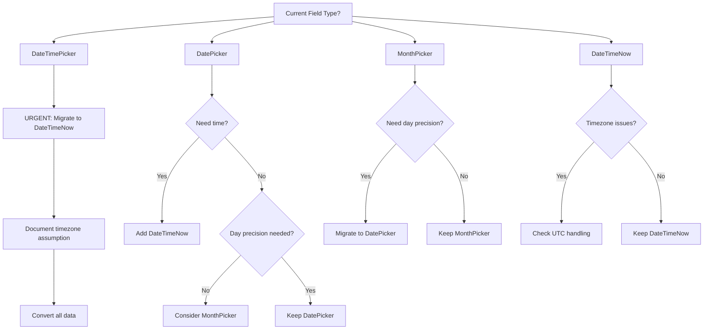
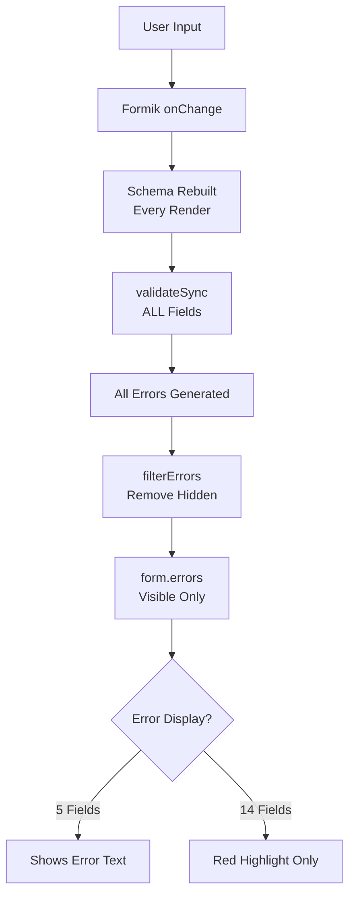

# Fieldmark v3 Documentation Structure

<!-- concat:metadata
version: 3.0.0
last_updated: 2025-01-07
format: LLM_FIRST_CONCATENATABLE
structure: three_tier_depth_tagged
purpose: navigation_and_structure_only
-->

<!-- discovery:metadata
provides: [navigation, document-structure, depth-tagging]
see-also: [llm-navigation-manifest]
-->


## Documentation System Overview

This documentation serves as both:
1. **Individual Files**: Modular documents for specific topics
2. **Concatenated Reference**: Single comprehensive document for LLM consumption (`reference.md`)

### Depth Tagging System

All content uses three depth levels:
- `{essential}` - Core concepts for basic understanding
- `{important}` - Standard patterns and working knowledge
- `{comprehensive}` - Complete reference with edge cases

### Navigation Structure

#### Field Documentation (`/field-categories/`)
Detailed documentation for each field type category:
- `text-fields-v05.md` - Text and string input fields
- `select-choice-fields-v05.md` - Selection and choice fields
- `datetime-fields-v05.md` - Date and time fields
- `number-fields-v05.md` - Numeric input fields
- `display-field-v05.md` - Display-only fields
- `location-fields-v05.md` - GPS and mapping fields
- `media-fields-v05.md` - Photo and file upload fields
- `relationship-field-v05.md` - Record relationship fields

#### Pattern Guides (`/patterns/`)
Cross-field patterns and implementation guidance:
- `field-selection-guide.md` - Choosing appropriate field types
- `form-structure-guide.md` - Form architecture patterns
- `dynamic-forms-guide.md` - Conditional logic and validation
- `implementation-patterns-guide.md` - Common implementation patterns

#### Technical References (`/references/`)
Core technical documentation:
- **`designer-component-mapping.md`** - 🔑 **PRIMARY REFERENCE** for all field mappings
- `component-reference.md` - Component namespaces and types
- `constraints-reference.md` - Security and Designer limitations
- `operations-reference.md` - Migration and troubleshooting
- `platform-reference.md` - Platform-specific behaviors
- `notebook-format-guide.md` - Notebook JSON structure
- `file-organization-guide.md` - Project structure

### For Complete Field Information

→ **See [Designer UI to Component Mapping Reference](./designer-component-mapping.md)**

This comprehensive reference contains:
- All Designer field names and their component mappings
- Complete component lists by namespace
- Configuration examples for each field type
- Common errors and solutions
- Migration guidance

---

## Building the Concatenated Reference

To generate `reference.md`:
```bash
./scripts/build-reference.sh
```

The build process:
1. Starts with this navigation structure
2. Adds all field-categories documents
3. Includes pattern guides
4. Appends technical references
5. Generates navigation anchors

Output: Single ~27,000 line reference optimized for LLM consumption.

<!-- concat:reference:llm-navigation-manifest -->
# LLM Navigation Manifest for Fieldmark Documentation

<!-- discovery:metadata

<!-- structured:metadata
meta:purpose: technical-reference
meta:summary: Purpose-driven document discovery tables for LLM content navigation.
meta:generates: lookup-tables
meta:requires: [fieldmark-knowledge]
meta:version: 3.0.0
meta:document: llm_navigation_manifest
meta:depth-tags: [essential]
-->

provides: [document-discovery, purpose-tables, quick-navigation, content-matrix]
see-also: [field-type-index, all-documents]
-->


**Purpose**: Enable LLMs to quickly discover and navigate all documentation content  
**Created**: 2025-01-07  
**Usage**: This document should be included early in reference.md for optimal content discovery

## Quick Navigation: "If You Need... Look Here"

### Primary Needs → Document Mapping

| If You Need... | Use This Document | Location |
|----------------|-------------------|----------|
| **Field name to component mapping** | designer-component-mapping.md | references/ |
| **Decision trees for field selection** | field-selection-guide.md | patterns/ |
| **Complete notebook structure** | notebook-format-guide.md | references/ |
| **Platform-specific limitations** | platform-reference.md | references/ |
| **Error messages and solutions** | troubleshooting-index.md | references/ (to be created) |
| **Working notebook examples** | notebook-templates.md | references/ (to be created) |
| **Security vulnerabilities** | constraints-reference.md | references/ |
| **Migration procedures** | operations-reference.md | references/ |
| **Form structure patterns** | form-structure-guide.md | patterns/ |
| **Conditional logic implementation** | dynamic-forms-guide.md | patterns/ |
| **Dashboard operations** | dashboard-overview.md | dashboard/ |
| **Template management** | templates-interface.md | dashboard/ |
| **User permissions** | users-interface.md | dashboard/ |
| **Team collaboration** | teams-interface.md | dashboard/ |
| **Common workflows** | dashboard-patterns.md | dashboard/ |
| **Dashboard troubleshooting** | dashboard-troubleshooting.md | dashboard/ |

## Document Purpose Tables

### Dashboard Documentation (`dashboard/`)

| Document | Primary Purpose | Key Content | Lines |
|----------|----------------|-------------|-------|
| **dashboard-overview.md** | System architecture | • Navigation structure<br>• Role hierarchy<br>• Permission inheritance<br>• Platform overview | 312 |
| **templates-interface.md** | Template management | • Designer usage<br>• Field configuration<br>• Version control<br>• JSON export/import | 446 |
| **notebooks-interface.md** | Data collection | • Deployment process<br>• User management<br>• Record workflow<br>• Export options | 525 |
| **users-interface.md** | User administration | • System roles<br>• Permission matrix<br>• Activity tracking<br>• Email verification | 498 |
| **teams-interface.md** | Team collaboration | • Resource ownership<br>• Member management<br>• Team roles<br>• Shared templates | 456 |
| **dashboard-patterns.md** | Workflow recipes | • 7 parametric workflows<br>• Project setup<br>• User onboarding<br>• Migration patterns | 578 |
| **dashboard-troubleshooting.md** | Problem resolution | • 45+ common issues<br>• Error decoder<br>• Diagnostic flowcharts<br>• Emergency procedures | 305 |

### Field Documentation (`field-categories/`)

| Document | Primary Purpose | Key Content | Lines |
|----------|----------------|-------------|-------|
| **text-fields-v05.md** | Text input configuration | • FAIMSTextField vs MultipleTextField<br>• XSS prevention<br>• Template syntax<br>• 7 text components | 1,693 |
| **select-choice-fields-v05.md** | Selection field setup | • RadioGroup vs Select<br>• AdvancedSelect hierarchies<br>• CSV injection prevention<br>• 5 selection components | 1,332 |
| **datetime-fields-v05.md** | Date/time handling | • Timezone issues<br>• DateTime Now vs Picker<br>• Audit trails<br>• 4 date/time components | 1,284 |
| **number-fields-v05.md** | Numeric validation | • Controlled Number config<br>• Auto-increment setup<br>• Precision limits<br>• 3 number components | 1,298 |
| **display-field-v05.md** | Display-only content | • RichText markdown<br>• Memory management<br>• 1 display component | 571 |
| **location-fields-v05.md** | GPS and mapping | • TakePoint vs MapField<br>• GPS accuracy<br>• Privacy concerns<br>• 2 location components | 825 |
| **media-fields-v05.md** | File uploads | • TakePhoto vs FileUpload<br>• EXIF stripping<br>• Size limits<br>• 2 media components | 789 |
| **relationship-field-v05.md** | Record relationships | • RelatedRecordSelector<br>• Access control<br>• Orphan handling<br>• 1 relationship component | 584 |

### Pattern Guides (`patterns/`)

| Document | Primary Purpose | Key Content | Lines |
|----------|----------------|-------------|-------|
| **field-selection-guide.md** | Choose right field type | • Decision matrices<br>• Use case mappings<br>• Platform compatibility table | 511 |
| **form-structure-guide.md** | Build multi-section forms | • Viewsets configuration<br>• Navigation patterns<br>• Parent-child forms | 401 |
| **dynamic-forms-guide.md** | Implement conditional logic | • Visibility rules<br>• Validation patterns<br>• Computed values | 462 |
| **implementation-patterns-guide.md** | Common patterns | • Error handling<br>• Performance optimisation<br>• Best practices | 419 |

### Technical References (`references/`)

| Document | Primary Purpose | Priority | Lines |
|----------|----------------|----------|-------|
| **designer-component-mapping.md** | 🔑 **PRIMARY REFERENCE**<br>All field mappings | CRITICAL | 295 |
| **component-reference.md** | Namespaces & Formik integration | HIGH | 977 |
| **constraints-reference.md** | Security & limitations | HIGH | 497 |
| **operations-reference.md** | Migration & troubleshooting | MEDIUM | 787 |
| **platform-reference.md** | Platform-specific issues | MEDIUM | 656 |
| **notebook-format-guide.md** | JSON structure requirements | HIGH | 198 |
| **file-organization-guide.md** | Project structure | LOW | 135 |
| **field-type-index.md** | Navigation only | LOW | 81 |

## Content Coverage Matrix

### By Topic

| Topic | Primary Doc | Supporting Docs |
|-------|------------|-----------------|
| **Component Names** | designer-component-mapping | All field-categories docs |
| **JSON Structure** | notebook-format-guide | test-notebook-correct.json |
| **Field Selection** | field-selection-guide | Individual field docs |
| **Validation** | dynamic-forms-guide | Field-specific sections |
| **Security** | constraints-reference | Field-specific warnings |
| **Mobile Support** | platform-reference | media-fields, location-fields |
| **Relationships** | relationship-field | form-structure-guide |
| **Templates** | text-fields (TemplatedString) | implementation-patterns |

### By Task

| Task | Required Documents |
|------|-------------------|
| **Create a basic notebook** | notebook-format-guide + designer-component-mapping |
| **Add text fields** | text-fields-v05 + designer-component-mapping |
| **Implement validation** | dynamic-forms-guide + field-specific docs |
| **Add GPS capture** | location-fields-v05 + platform-reference |
| **Set up new project** | dashboard-patterns + teams-interface + templates-interface |
| **Manage user permissions** | users-interface + notebooks-interface |
| **Deploy template** | templates-interface + notebooks-interface |
| **Troubleshoot UI issues** | dashboard-troubleshooting + troubleshooting-index |
| **Create team structure** | teams-interface + dashboard-patterns |
| **Export collected data** | notebooks-interface + dashboard-patterns |
| **Create relationships** | relationship-field + form-structure-guide |
| **Debug import errors** | notebook-format-guide + troubleshooting-index (when created) |
| **Migrate from v2** | operations-reference + component-reference |

## Document Dependencies

```
designer-component-mapping.md (PRIMARY)
    ├── All field-categories/*.md reference it
    ├── notebook-format-guide.md uses its mappings
    └── troubleshooting relies on it

notebook-format-guide.md
    ├── Required for all notebook generation
    ├── References designer-component-mapping
    └── Used by notebook-templates (when created)

field-selection-guide.md
    ├── Aggregates all field-categories
    ├── Links to platform-reference
    └── Informs implementation-patterns

platform-reference.md
    ├── Referenced by location-fields, media-fields
    └── Impacts all mobile-specific features

constraints-reference.md
    ├── Security context for all fields
    └── Designer limitations affect all components
```

## Navigation Keywords

### Component Names
- FAIMSTextField, MultipleTextField, TextField
- RadioGroup, Select, AdvancedSelect, Checkbox, MultiSelect
- DatePicker, DateTimePicker, DateTimeNow, MonthPicker
- NumberField, ControlledNumber, AutoIncrementer
- RichText, TemplatedStringField
- TakePoint, MapField
- TakePhoto, FileUpload
- RelatedRecordSelector

### Common Issues
- "notebook won't import", "missing fviews", "no name parameter"
- "validation not working", "conditional visibility"
- "GPS not available", "photo upload failed"
- "Designer vs JSON names", "component namespace"

### Key Concepts
- fviews, viewsets, ui-specification
- component-namespace, component-name, type-returned
- validationSchema, initialValue, component-parameters
- HRID, TemplatedString, Mustache syntax

## Usage in LLM Context

When processing queries:
1. Check this manifest first to identify relevant documents
2. Load specific documents based on task requirements
3. Use designer-component-mapping.md as primary reference
4. Cross-reference with platform/constraints for edge cases

---

*This manifest enables efficient navigation of ~26,000 lines of documentation*

<!-- ============================================ -->
<!-- FIELD TYPE DOCUMENTATION -->
<!-- ============================================ -->


<!-- concat:document:text-fields-v05 -->
<!-- concat:boundary:start section="text-input-fields" -->
<!-- concat:metadata
document_id: text-fields-v05
category: text_input
field_count: 7
designer_capable: ["FAIMSTextField", "MultipleTextField", "TextField"]
json_only: ["TemplatedStringField.template_syntax", "AddressField.structure", "QRCodeFormField.formats"]
last_updated: 2025-01-05
-->

<!-- discovery:metadata
provides: [text-input, email-validation, template-syntax, address-structure, qr-scanning]
see-also: [field-selection-guide, platform-reference, constraints-reference]
-->


# Text Input Fields


<!-- structured:metadata
meta:purpose: field-configuration
meta:summary: Seven components for text input, display, and auto-generation, including critical HRID handling and XSS security considerations.
meta:generates: json-fields
meta:requires: [valid-json, unique-names, fviews-layer]
meta:version: 3.0.0
meta:document: text_fields
meta:depth-tags: [essential, important, comprehensive]
-->

## Document Navigation {essential}
<!-- concat:nav-mode:individual -->
[← Field Index](../field-type-index.md) | **Text & Input Fields** | [Selection Fields →](./select-choice-fields-v05.md)
<!-- concat:nav-mode:concatenated -->
<!-- When viewing in reference.md: [↑ Top](#fieldmark-v3-field-type-documentation-index) | [Selection Fields ↓](#selection-fields) -->

## Overview {essential}

The Fieldmark ecosystem provides seven text-related field types for comprehensive data capture and display needs:

### DESIGNER QUICK GUIDE
When using the Designer interface:
- 📝 **Single-line text**: Choose **"FAIMS Text Field"**
- 📄 **Multi-line text**: Choose **"Text Field"**
- ✉️ **Email input**: Choose **"Email"**

### CRITICAL NAMING DISAMBIGUATION
⚠️ **Designer UI names differ from component names**:
- **"FAIMS Text Field"** in Designer = single-line text (component: FAIMSTextField)
- **"Text Field"** in Designer = multi-line text area (component: MultipleTextField)
- **"Email"** in Designer = single-line with validation (component: TextField with email config)

Note: TextField (formik-material-ui) is the base component but is not directly selectable in Designer for plain text input.

This naming inconsistency is a known issue that creates significant confusion. Always verify the component-name in JSON when troubleshooting.

### Field Capabilities Summary
Fieldmark text fields provide comprehensive text capture capabilities spanning single-line inputs, multi-line narratives, templated identifiers, structured addresses, and mobile barcode scanning. The ecosystem includes six data capture components plus one display-only field, supporting everything from brief identifiers to complex structured data entry with mobile-optimized scanning capabilities.

### Component Status
| Component | Status | Platform Support | Primary Use Case |
|-----------|---------|-----------------|------------------|
| FAIMSTextField | Stable | All | Single-line text input |
| MultipleTextField | Stable | All | Multi-line text areas |
| TextField (Email) | Stable | All | Validated email input |
| TemplatedString | Stable | All | Auto-generated identifiers |
| Address Field | Beta | All | Structured address capture |
| QRCodeFormField | Stable | Mobile only | Barcode scanning |
| RichText | Stable | All | Display-only content |

### Data Capture Fields (1-6)

1. **FAIMSTextField** (appears as "FAIMS Text Field" in Designer) - Single-line text input for brief, unconstrained textual data (50 character recommendation). Implemented through the `faims-custom/FAIMSTextField` component with enhanced advanced help capabilities.

2. **MultipleTextField** (appears as "Text Field" in Designer) - Extended text entry for narrative content and detailed observations (10,000 character recommendation). Maintains fixed-height presentation with internal scrolling mechanisms. Despite both using FormikTextField internally, MultipleTextField is configured with `multiline: true` and `rows: 4` parameters.

3. **TextField** (used by "Email" in Designer) - Base single-line component, primarily used with email configuration. When "Email" is selected in Designer, it creates a TextField component with `InputProps: {type: 'email'}` configuration. Not directly accessible through Designer for general text input.

4. **TemplatedString** - Auto-generated text from Mustache templates, critical for Human-Readable Identifiers (HRIDs). **⚠️ CRITICAL REQUIREMENT**: Every notebook MUST include at least one TemplatedString field configured as the `hridField`. Without HRIDs, records display only as cryptic UUIDs (e.g., `a7f3b2c1-d4e5-6789-0abc`), making field data management impossible. **⚠️ SECURITY WARNING**: TemplatedString has HTML escaping DISABLED (formUtilities.ts line 27), creating XSS vulnerabilities if user input is included in templates without sanitization.

5. **Address Field** - Provides structured address capture through a specialised interface storing data in GeocodeJSON-compliant format, facilitating both human-readable display and future geocoding integration. **Beta feature** implementing dual storage – maintaining both structured components and concatenated display strings within a JSON object. Currently optimised for Australian address formats with technical users comfortable with JSON data extraction.

6. **QRCodeFormField** - Delivers **mobile-exclusive** barcode scanning functionality through ML Kit barcode scanning, supporting thirteen distinct barcode formats despite its nomenclature suggesting QR-only capability. Uses sophisticated ten-scan validation mechanism ensuring reading accuracy whilst operating without user feedback. **⚠️ PLATFORM WARNING**: Web platform deployment renders the component entirely non-functional, displaying a disabled interface that critically breaks form validation when marked as required.

## Component Mapping Reference {essential}

For the complete mapping between Designer field names and JSON component implementations, see:
→ **[Designer UI to Component Mapping Reference](../references/designer-component-mapping.md)**

This central reference provides:
- Exact component names and namespaces for all fields
- Configuration requirements and examples
- Common mapping errors and solutions


## Designer Usage Guide {essential}

### What to Select in Designer

When using the Designer interface, follow these simple rules:

📝 **For single-line text input**: Select **"FAIMS Text Field"**
- Use for: identifiers, names, brief labels, codes
- Creates: FAIMSTextField component
- Helper text in Designer: "Single-line text input for free-form entries"

📄 **For multi-line text input**: Select **"Text Field"**  
- Use for: descriptions, notes, observations, narratives
- Creates: MultipleTextField component
- Helper text in Designer: "Multi-line text area for longer notes"

✉️ **For email addresses**: Select **"Email"**
- Use for: validated email input
- Creates: TextField component with email configuration
- Includes automatic email validation

### When JSON Enhancement is Required

You MUST edit JSON directly for:

**TextField/FAIMSTextField**:
- ✅ Required: Character limit enforcement (`inputProps.maxLength`)
- ✅ Required: Pattern validation (regex via `yup.matches`)
- ✅ Required: Advanced helper text with formatting
- ⚠️ Optional: Custom placeholder text
- ⚠️ Optional: Variant styles (outlined, filled, standard)
- See [TextField Configuration](#textfield-configuration)

**MultilineText (MultipleTextField)**:
- ✅ Required: Word/character count validation
- ✅ Required: Performance optimization for >10,000 characters
- ⚠️ Optional: Dynamic row adjustment based on content
- ❌ Never: Row configuration can be set in Designer (`InputProps.rows`)
- See [Performance Considerations](#performance-considerations)

**TemplatedString**:
- ✅ Required: Complex template logic (Mustache conditionals beyond Designer's Template Builder)
- ✅ Required: Field references from other forms
- ✅ Required: Security patterns to prevent XSS (avoid user input)
- ❌ Never: Basic templates with text/variables/conditionals can be built in Designer's Template Builder
- ⚠️ CRITICAL: See [CRITICAL SECURITY VULNERABILITIES] for XSS risks
- See [TemplatedString Configuration](#templatedstring-configuration)

**Email**:
- ✅ Required: Domain-specific validation (e.g., `.edu.au` only)
- ✅ Required: Multiple domain patterns
- ⚠️ Optional: Custom error messages
- See [Email Field Quirks](#email-quirks)

**Address**:
- ✅ Required: JSON extraction patterns for CSV export
- ✅ Required: Debounce configuration for race condition
- ✅ Required: Custom validation rules
- ⚠️ Beta feature - expect changes
- See [Address Field Issues](#address-specific-issues)

**QRCodeFormField**:
- ✅ Required: Platform conditionals (mobile-only deployment)
- ✅ Required: Manual fallback field pairing
- ✅ Required: Making field optional (never mark as required)
- ❌ Never: Basic scanning configuration
- See [QRCodeFormField Configuration](#qrcodefield-configuration)

**RichText**:
- ✅ Required: Base64 image embedding
- ⚠️ Optional: Complex markdown/MDX (tables won't render)
- ❌ Never: Data capture (display only, never exports)
- See [RichText Display Limitations](#display-limitations)

### Designer Limitations {important}

See [Designer Limitations Reference](designer-limitations-reference.md) for testing, validation, and configuration constraints that apply to all fields.

**Text Field-Specific Limitations**:
- **Character limits**: Cannot enforce maximum character counts or input patterns
- **XSS prevention**: Cannot configure security for TemplatedString user inputs
- **Platform behaviors**: Cannot set QR code fallbacks or mobile-specific settings
- **Address timing**: Cannot configure debounce for Address race conditions
- **Auto-complete**: Cannot enable suggestion lists or auto-formatting

## Field Selection Guide {essential}

### Decision Tree

```
What type of text data do you need?
│
├─ Display-only content?
│  └─ YES → RichText
│     ├─ Returns: None (display only)
│     └─ Best for: Instructions, headers
│
├─ Auto-generated identifier or derived value?
│  └─ YES → TemplatedString  
│     ├─ Returns: faims-core::String
│     ├─ Configure as hridField for record IDs
│     └─ ⚠️ XSS vulnerability if used with user input
│
├─ Barcode/QR code scanning?
│  └─ YES → QRCodeFormField
│     ├─ Returns: faims-core::String
│     ├─ Mobile only (web shows disabled)
│     └─ Pair with TextField for web fallback
│
├─ Structured data capture?
│  ├─ Email address?
│  │  └─ YES → Email (TextField variant)
│  │     ├─ Returns: faims-core::String
│  │     └─ HTML5 email validation
│  │
│  └─ Street address?
│     └─ YES → Address
│        ├─ Returns: faims-core::JSON
│        └─ Google Places autocomplete
│
└─ User-entered text?
   ├─ Single line (<200 chars)?
   │  └─ YES → TextField/FAIMSTextField
   │     ├─ Returns: faims-core::String
   │     ├─ Designer: "FAIMS Text Field"
   │     └─ Consider FAIMSTextField for rich help
   │
   └─ Multiple lines or >200 chars?
      └─ YES → MultilineText
         ├─ Returns: faims-core::String  
         ├─ Designer: "Text Field" with multiline
         └─ Configure rows (3-10 typical)
```

---

## ⚠️ Critical Security Risks {essential}

See [Security Considerations Reference](security-considerations-reference.md) for comprehensive security guidelines, testing procedures, and mitigation strategies.

**Text Field Critical Security Notes**:
- **TemplatedString**: HTML escaping DISABLED (formUtilities.ts line 27) - NEVER include user input in templates
- **RichText**: Never include user-generated content despite DOMPurify sanitization
- **Address**: JSON injection possible - validate structure server-side
- **All text fields**: No input sanitization by default - implement server-side validation

---

## What This Field Cannot Do {important}

### Content Processing Limitations {important}
- **Rich text editing** - No WYSIWYG editor for users (only static RichText display)
- **Auto-formatting** - No automatic phone/postal code formatting
- **Spell check control** - Cannot disable browser spell check
- **Language detection** - No automatic RTL/LTR switching
- **Character counting** - No live character count display (except MultipleTextField)

### Validation Limitations {important}
- **Cross-field validation** - Cannot validate against other fields
- **Async validation** - No server-side validation during entry
- **Custom error messages** - Limited to predefined messages
- **Format enforcement** - Cannot force uppercase/lowercase

### Display Limitations {important}
- **Dynamic resizing** - TextField cannot auto-expand
- **Custom keyboards** - Cannot specify keyboard layouts
- **Inline editing** - No in-place editing after submission
- **Rich previews** - No URL or media previews


## Common Use Cases {important}

### Field Notes and Observations
- **Brief descriptions** → TextField (max 50 chars recommended)
- **Detailed observations** → MultipleTextField (narratives)
- **Specimen labels** → TemplatedString (auto-generated IDs)
- **Contact emails** → Email field with validation

### Location and Context Recording
- **Site addresses** → Address field (structured JSON)
- **GPS coordinates as text** → TextField with pattern validation
- **QR/Barcode scanning** → QRCodeFormField + TextField fallback
- **Context descriptions** → MultipleTextField

### Documentation and Metadata
- **Photo captions** → TextField (brief)
- **Methodology notes** → RichText (static display only)
- **Sample IDs** → TemplatedString (e.g., `SITE-{{counter}}-{{date}}`)
- **Field team contacts** → Email fields

### Quality Control
- **Validation notes** → MultipleTextField
- **Scan verification** → QRCodeFormField (10 consecutive reads required)
- **Chain of custody** → TemplatedString with timestamps
- **Data entry comments** → MultipleTextField with timestamp

---

### Decision Matrix

| Field Type | Returns | Max Length | Designer Name | Critical Issues |
|------------|---------|------------|---------------|----------------|
| **TextField** | String | ~200 chars* | "FAIMS Text Field" | Performance >10K chars |
| **MultilineText** | String | 10,000 chars* | "Text Field" | Browser crash >50K |
| **TemplatedString** | String | Auto-generated | "Templated String Field" | XSS with user input |
| **Email** | String | Email format | "Email Field" | Platform validation varies |
| **Address** | JSON | Complex object | "Address Field" | Requires Google API |
| **QRCodeFormField** | String | Scanned value | "QR Code Field" | Mobile only |
| **RichText** | None | Display only | "RichText" | No data capture |

*Performance degrades significantly beyond these thresholds

### Selection Strategy

1. **Default to TextField** (FAIMSTextField) for most text input
2. **Use MultilineText** only when content exceeds single line
3. **Deploy TemplatedString** as hridField (mandatory for notebooks)
4. **Consider structured fields** (Email, Address) only when validation/structure adds value
5. **Avoid QRCodeFormField** unless mobile-only deployment confirmed

**Platform Considerations**:
- Mobile: All fields work, QRCode camera enabled
- Web: QRCode shows disabled state
- iOS: Email keyboard includes @ symbol
- Android: Address autocomplete may fail in some regions

**Accessibility Requirements**:
- TextField/MultilineText: WCAG AA compliant
- Address: Complex navigation, may confuse screen readers
- QRCode: Camera interface not accessible
- RichText: Ensure semantic HTML for screen readers

---

## Designer Component Mapping {essential}

### Designer UI vs JSON Component Names

| Designer UI Label | JSON component-name | Component Namespace | Description |
|------------------|--------------------|--------------------|-------------|
| FAIMS Text Field | FAIMSTextField | faims-custom | Enhanced single-line with advanced help |
| Text Field | MultipleTextField | formik-material-ui | Multi-line text area |
| Email | TextField | formik-material-ui | Single-line with email validation |
| Templated String Field | TemplatedStringField | faims-custom | Auto-generated text |
| Scan QR Code | QRCodeFormField | qrcode | Mobile-only scanner |
| Address | AddressField | faims-custom | Structured address input |
| RichText | RichText | faims-custom | Display-only markdown content |

⚠️ **Critical Notes**:
- There is NO Designer element that creates a plain TextField without configuration
- "FAIMS Text Field" creates FAIMSTextField (not TextField)
- "Text Field" creates MultipleTextField (not MultilineText)
- Only "Email" uses the base TextField component

This mapping table is essential for:
- Debugging field behaviour issues (see [Troubleshooting Guide > Critical Issues Table])
- Writing JSON configurations manually
- Understanding error messages that reference component names
- Migrating between Designer versions

## Designer Capabilities vs JSON Enhancement {comprehensive}

### What Designer Can Configure

For complete meta properties documentation (annotation, uncertainty, persistence), see [Meta Properties Reference](meta-properties-reference.md).

The Designer interface provides basic field creation for all text fields:

| Field Type | Designer Creates | Designer Configures | JSON-Only Features |
|------------|------------------|---------------------|--------------------|  
| **TextField (FAIMS)** | ✅ Basic field | Label, Required, Helper text | Advanced helper text, character limits (`maxLength`), input patterns |
| **MultilineText** | ✅ Basic field | Label, Required, Helper text, Rows | Word count validation, performance limits, dynamic sizing |
| **TemplatedString** | ✅ Basic field | Label, Template pattern | Security sanitization, complex conditionals, field references |
| **Email** | ✅ Basic field | Label, Required, Helper text | Domain-specific validation, custom regex patterns |
| **Address** | ✅ Basic field | Basic structure | JSON extraction patterns, debouncing, custom validation |
| **QRCodeFormField** | ✅ Basic field | Label | Platform conditionals, manual fallback pairing, scan requirements |
| **RichText** | ✅ Display only | Content (markdown) | Base64 images, memory management, MDX components |


## Component Namespace Errors {important}

See [Component Namespace Reference](component-namespace-reference.md) for complete namespace documentation, error troubleshooting, and case sensitivity rules.

### Text Field-Specific Notes

**Mixed namespaces in text fields**:
- Basic text: `formik-material-ui` (TextField, MultipleTextField)
- Custom text: `faims-custom` (FAIMSTextField, TemplatedStringField, Address)
- Special case: `qrcode` namespace for QRCodeFormField

**Quick Reference for Text Fields**:
| Component | Namespace | Notes |
|-----------|-----------|-------|
| TextField | `formik-material-ui` | Basic single-line |
| MultipleTextField | `formik-material-ui` | Multi-line textarea |
| FAIMSTextField | `faims-custom` | Enhanced single-line |
| TemplatedStringField | `faims-custom` | Auto-generated |
| Address | `faims-custom` | Structured address |
| QRCodeFormField | `qrcode` | Scanner (unique namespace) |

---


## When to Use These Fields {essential}

### Field Selection Matrix

| Use Case | Recommended Field | Why |
|----------|------------------|-----|
| Short identifiers (<50 chars) | FAIMSTextField | Single-line, clean display |
| Long descriptions | MultipleTextField | Multi-line with scrolling |
| Email addresses | TextField (Email) | Built-in validation |
| Auto-generated IDs | TemplatedStringField | Consistent formatting |
| Physical addresses | AddressField | Structured components |
| Barcode scanning | QRCodeFormField | Mobile camera integration |
| Instructions/Help | RichText | Formatted display only |

### Decision Criteria
- **Data length**: <50 chars → FAIMSTextField, >50 chars → MultipleTextField
- **Validation needed**: Email → TextField, Pattern → TemplatedStringField
- **User input**: Yes → FAIMSTextField/MultipleTextField, No → RichText
- **Mobile scanning**: Required → QRCodeFormField
- **Address structure**: Needed → AddressField

## Common Characteristics {important}

### Security Considerations {important}

See [Security Considerations Reference](../references/constraints-reference.md#field-specific-security-considerations) for comprehensive security guidelines.

**Text Field-Specific Security Notes**:
- TemplatedString HTML escaping disabled - critical XSS risk
- QRCode scanner accepts any content without validation
- Address fields vulnerable to JSON injection attacks
- No server-side validation or sanitization by default
- Client-side validation easily bypassed via DevTools

### Performance Boundaries {important}

See [Performance Thresholds Reference](performance-thresholds-reference.md) for comprehensive performance limits, testing scenarios, and optimization triggers.

**Text Field-Specific Performance Notes**:
- **TextField**: 50 character recommendation for mobile viewports
- **MultilineText**: Performance degrades >10,000 characters (~1MB CouchDB limit)
- **TemplatedString**: Max 3 per form, 50 variables per template
- **RichText**: Max 10 per notebook, 50 words per field (1000 total)
- **QRCodeFormField**: Performance limited by device memory and camera
- **Address**: No limits but increases JSON payload size significantly

### Common Validation Patterns {important}

#### Standard Validation Rules {important}
| Rule | Schema | Purpose | Fields |
|------|--------|---------|--------|
| required | `["yup.required", "Field required"]` | Mandatory content | TextField, MultipleTextField, TemplatedString, Email, Address |
| min length | `["yup.min", N, "Minimum N characters"]` | Enforce minimum | TextField, MultipleTextField |
| max length | `["yup.max", N, "Maximum N characters"]` | Prevent excess | TextField, MultipleTextField |
| pattern | `["yup.matches", "regex", "message"]` | Format enforcement | TextField, MultipleTextField, TemplatedString |
| email | `["yup.email", "Invalid email"]` | Email validation | TextField with type="email", Email field |
| object | `["yup.object"]` | JSON structure | Address field |

#### Validation Behavior {important}

For universal validation timing behavior, see [Validation Timing Reference](validation-timing-reference.md).

**Text Field-Specific Behaviors**:
- **Keystroke validation**: Text fields validate on EVERY character entry (performance impact)
- **No debouncing**: Each keystroke triggers full validation cycle
- **Complex regex impact**: Pattern matching on every keystroke can cause noticeable lag
- **Touch requirement**: Errors display only after field is "touched" (focused then blurred)

**TemplatedString Specific**:
- Validates output, not template syntax
- Silent failure for invalid templates

**No User Validation (QRCodeFormField, RichText)**:
- QRCodeFormField: 10-scan hardware validation only, no user feedback
- RichText: Display-only, never validates

### Platform Behaviors {important}

#### Cross-Platform Consistency {important}
- **TextField, MultipleTextField, TemplatedString**: Behave identically across iOS, Android, and web
- **Touch targets**: Maintain 44×44px minimum (WCAG compliance) except Address edit button
- **Font size**: Minimum 16px prevents iOS zoom on focus
- **Tab navigation**: Follows DOM order
- **TemplatedString**: Evaluation identical on all platforms
- **QRCodeFormField**: Mobile-only, completely non-functional on web
- **RichText**: Stable on desktop, memory issues on mobile

#### iOS Behaviors {comprehensive}
| Field | Keyboard | Auto-correction | Special Features |
|-------|----------|-----------------|------------------|
| TextField/MultilineText/TemplatedString | Standard text | Active, predictive text | Long-press selection, may cover fields |
| Email | Email-optimised, @ key prominent | Disabled | Domain shortcuts (.com, .org, .net) |
| Address | Standard text | Active on all fields | Applies to state abbreviations |
| QRCodeFormField | N/A | N/A | Full-screen ML Kit camera |
| RichText | N/A | N/A | Memory leak with 10+ fields |

#### Android Behaviors {comprehensive}
| Field | Keyboard | Voice Input | Performance Notes |
|-------|----------|-------------|-------------------|
| TextField/MultilineText/TemplatedString | Standard text | Extended dictation, gesture typing | Voice may create run-on text |
| Email | Email layout, @ symbol | Available, struggles with @ | Space bar often hidden |
| Address | Text keyboard | Standard | Validation lag on older devices |
| QRCodeFormField | N/A | N/A | Full-screen scanner |
| RichText | N/A | N/A | Slower parsing than iOS |

#### Web/Desktop Behaviors {important}
- **Full functionality**: TextField, MultipleTextField, TemplatedString
- **Email**: Browser may display envelope icon, native validation supplements Yup
- **Address**: Full keyboard navigation in expanded state
- **QRCodeFormField**: Completely non-functional, shows disabled interface
- **RichText**: Stable rendering, minimal performance impact

### Shared Limitations {important}

#### Designer Interface Constraints {important}
- Cannot switch component variants via GUI (TextField variants)
- Advanced features require JSON editing
- No visual preview of validation behaviour
- Pattern validation requires manual regex entry
- Template syntax not validated (TemplatedString)
- Row count requires numeric input (MultilineText)
- MDX Editor accepts invalid markdown without warning (RichText)
- Table Editor available but tables removed at runtime (RichText)

#### Export Behavior {important}

See [Data Export Reference](data-export-reference.md) for comprehensive export documentation including CSV/JSON formats, special character handling, and Excel issues.

**Text Field-Specific Export Notes**:
- **RichText**: Never exported - for form definition only
- **Address**: CSV exports as JSON string in cell requiring parsing; JSON preserves nested structure  
- **TemplatedString**: Only exports generated value, template not included
- **MultipleTextField**: Line breaks preserved but may break some CSV readers
- **QRCodeFormField**: Exports scanned value only, no scan metadata

#### Component Architecture {comprehensive}

**Standard Components**:
- **TextField/MultilineText**: formik-material-ui components
- **Email**: TextField with `type="email"` configuration

**Custom Components**:
- **TemplatedString**: `faims-custom::TemplatedStringField`
- **Address**: `faims-custom::AddressField` with complex JSON storage
- **QRCodeFormField**: `qrcode::QRCodeFormField` with ML Kit integration
- **RichText**: `faims-custom::RichText` with markdown rendering

**Display-Only Architecture (RichText)**:
- Requires full field definition despite no data operations
- Maintains `type-returned` and `validationSchema` for consistency
- Never participates in form data or validation

#### Accessibility Compliance {important}

**Compliant Fields** (WCAG 2.1 Level AA):
- TextField, MultipleTextField, TemplatedString, Email
- Minimum touch target size (44×44px)
- Proper label association
- Keyboard navigation support
- Screen reader compatibility
- Error message announcement
- Sufficient color contrast (3:1 minimum)

**Non-Compliant Fields**:
- Address: Edit button below WCAG minimum touch target
- RichText: Complete absence of ARIA attributes and accessibility features
- QRCodeFormField: No manual entry alternative

#### Testing Guidelines {comprehensive}

**Pre-Deployment Testing Checklist**:
- [ ] Test with empty data (all fields blank)
- [ ] Test with partial data (some fields filled)
- [ ] Test with maximum content length
- [ ] Test special characters and Unicode
- [ ] Test on minimum supported devices
- [ ] Test offline/sync scenarios
- [ ] Verify export formats preserve data
- [ ] Check accessibility with screen reader
- [ ] Test with malicious input (security)
- [ ] Monitor performance with typical load

---

## Field Reference {essential}

### TextField / FAIMSTextField (FAIMS Text Field in Designer) {essential}
<!-- keywords: single-line, text, input, brief -->
**Designer Label**: FAIMS Text Field
**Component Name**: FAIMSTextField (enhanced) or TextField (base - Email only)
**Namespace**: faims-custom (FAIMSTextField) or formik-material-ui (TextField)

Note: Designer's "FAIMS Text Field" creates FAIMSTextField. The base TextField is only accessible through "Email" field configuration.

#### Purpose {essential}
Single-line text input for brief, unconstrained textual data. Primary choice for codes, identifiers, and short annotations.

#### Core Configuration {essential}
```json
// Example text-fields-01
// Template markers added for parametric generation
{
  "component-namespace": "formik-material-ui",
  "component-name": "TextField",
  "type-returned": "faims-core::String",
  "component-parameters": {
    "name": "{{FIELD_ID}}"  // REQUIRED: must match field identifier,
    "label": "{{FIELD_LABEL}}"  // REPLACE: user-visible label,
    "helperText": "{{HELPER_TEXT}}"  // OPTIONAL: field guidance,
    "required": true
  },
  "validationSchema": [
    ["yup.string"],
    ["yup.Site code is required", "{VALIDATION_MESSAGE}"]  // CUSTOMIZE: error message,
    ["yup.matches", "^[A-Z]{3}$", "Must be 3 capital letters"]
  ],
  "initialValue": ""
}
```

#### TextField Variants {important}
1. **Standard TextField** (formik-material-ui): Default with basic features, used for Email
2. **FAIMSTextField** (faims-custom): Enhanced with expandable help, resizable UI
3. **Basic TextField** (core-material-ui): Raw MUI component, rarely used directly

#### TextField-Specific Validation {important}
See [Common Characteristics > Common Validation Patterns] for standard rules

#### TextField-Specific Issues {important}
For solutions, see [Troubleshooting Guide > Quick Fixes Table]
- Users exceed 50 character recommendation
- Mobile keyboards cover input
- Pattern validation errors unclear
- No character counter displayed
- Mobile keyboard wrong type: Configure InputProps.type (`"email"`, `"tel"`, `"url"`)
- FAIMSTextField features missing: Check namespace and advancedHelperText


#### JSON Anti-patterns

❌ **NEVER: Wrong initialValue type**
```json
// Example text-fields-02
{
  "component-name": "TextField",
  "initialValue": null  
}
```
✅ **ALWAYS: Use empty string for text fields**
```json
// Example text-fields-03
{
  "initialValue": ""
}
```

❌ **NEVER: Validation schema in wrong order**
```json
// Example text-fields-04
// Template markers added for parametric generation
{
  "validationSchema": [
    ["yup.Required", "{VALIDATION_MESSAGE}"]  // CUSTOMIZE: error message,
    ["yup.string"]
  ]
}
```
✅ **ALWAYS: Type declaration first**
```json
// Example text-fields-05
// Template markers added for parametric generation
{
  "validationSchema": [
    ["yup.string"],
    ["yup.Required", "{VALIDATION_MESSAGE}"]  // CUSTOMIZE: error message
  ]
}
```

❌ **NEVER: Wrong component name for enhanced variant**
```json
// Example text-fields-06
{
  "component-namespace": "faims-custom",
  "component-name": "TextField"
}
```
✅ **ALWAYS: Match namespace to component**
```json
// Example text-fields-07

{
  "component-namespace": "faims-custom",
  "component-name": "FAIMSTextField"
}

{
  "component-namespace": "formik-material-ui",
  "component-name": "TextField"
}

{
  "component-namespace": "core-material-ui",
  "component-name": "TextField"
}
```


#### Common Spec Mappings
- "Enter [identifier/code]" → TextField with pattern validation
- "Record [name/label]" → TextField with maxLength
- "Input [reference]" → TextField with required validation
- "Type [brief description]" → TextField (if <50 chars expected)

### MultilineText / MultipleTextField (Text Field in Designer) {essential}
<!-- keywords: multiline, textarea, paragraph, narrative -->
**Designer Label**: Text Field  
**Component Name**: MultipleTextField
**Namespace**: formik-material-ui

Note: Despite the confusing name, Designer's "Text Field" creates a multi-line text area (MultipleTextField component).

#### Purpose {essential}
Extended text entry for narrative content, detailed observations, and interpretative discourse exceeding single-line constraints. Fixed-height field with internal scrolling.

#### Core Configuration {essential}
```json
// Example text-fields-08
// Template markers added for parametric generation
{
  "component-namespace": "formik-material-ui",
  "component-name": "MultipleTextField",
  "type-returned": "faims-core::String",
  "component-parameters": {
    "name": "{{FIELD_ID}}"  // REQUIRED: must match field identifier,
    "label": "{{FIELD_LABEL}}"  // REPLACE: user-visible label,
    "multiline": true,
    "InputProps": {
      "rows": 4
    }
  }
}
```

#### Row Configuration {important}
- **Default**: 4 rows
- **Recommended**: 4-6 for general use
- **Maximum practical**: 8-10 for extensive content
- Fixed height - no auto-expansion

#### Content Handling {important}
- Preserves all formatting (tabs, spaces, line breaks)
- Whitespace-only input converts to empty string
- Internal scrolling when content exceeds visible area
- No rich text formatting - plain text only
- Performance degrades beyond 10,000 characters (see [Common Characteristics > Performance Boundaries])

#### MultilineText-Specific Features {important}
- Enter key creates new lines (not form submission)
- Touch scrolling within field boundaries
- Voice dictation supports paragraph breaks
- Can be used in conditional logic despite length

#### MultilineText-Specific Issues {important}
- Users may not notice internal scrollbar
- Fixed height can hide content
- Performance degrades beyond 10,000 characters (see [Common Characteristics > Performance Boundaries])
- Line breaks may not preserve in some exports
- Voice input creates run-on text (Android): Manual paragraph breaks needed (see [Troubleshooting Guide > Common Problems Table])


#### JSON Anti-patterns

❌ **NEVER: Wrong component name**
```json
// Example text-fields-09
{
  "component-name": "MultilineTextField",
  "component-parameters": {
    "multiline": true
  }
}
```
❌ **NEVER: Use "MultilineText" as component name**
```json
// Example text-fields-10
{
  "component-name": "MultipleTextField",
}
```
✅ **ALWAYS: Use MultipleTextField**
```json
// Example text-fields-11
{
  "component-name": "MultipleTextField",
  "component-parameters": {
    "multiline": true,
    "InputProps": {"rows": 4}
  }
}
```

❌ **NEVER: Missing multiline flag**
```json
// Example text-fields-12
{
  "component-name": "MultipleTextField",
  "component-parameters": {
    "rows": 4
  }
}
```
✅ **ALWAYS: Set multiline and use InputProps.rows**
```json
// Example text-fields-13
{
  "component-parameters": {
    "multiline": true,
    "InputProps": {"rows": 4}
  }
}
```


#### Common Spec Mappings
- "Describe [observation]" → MultilineText with 4-6 rows
- "Notes on [subject]" → MultilineText with helperText
- "Comments" → MultilineText, usually optional
- "Detailed description" → MultilineText with 8+ rows

### TemplatedString (Templated String Field in Designer) {essential}
<!-- keywords: hrid, template, mustache, auto-generate, identifier -->
**Designer Label**: Templated String Field
**Component Name**: TemplatedStringField
**Namespace**: faims-custom

Note: Every notebook must have at least one TemplatedString configured as the hridField.

#### Purpose {essential}
Auto-generates text values from other fields using Mustache templates. **MANDATORY** for Human-Readable Identifiers (HRIDs) - every notebook must have at least one configured as `hridField`.

#### Core Configuration {essential}
```json
// Example text-fields-14
{
  "component-namespace": "faims-custom",
  "component-name": "TemplatedStringField",
  "type-returned": "faims-core::String",
  "component-parameters": {
    "name": "record-id",
    "template": "{{site}}-{{date}}-{{counter}}",
    "readOnly": true
  }
}
```

#### Template Syntax {important}
- **Variable substitution**: `{{fieldName}}`
- **Conditional sections**: `{{#field}}content{{/field}}`
- **Inverted sections**: `{{^field}}if empty{{/field}}`
- **System variables**: `{{_CREATED_BY}}`, `{{_CREATED_TIME}}`
- **Parent fields**: `{{_PARENT_.fieldname}}`

#### Critical Implementation Notes {important}
- Must be in same form as referenced fields
- Updates automatically when source fields change
- Deep equality comparison for complex fields
- Cannot reference other TemplatedStrings (circular reference)
- HTML escaping disabled - security risk with user input (see [Common Characteristics > Security Considerations])

#### TemplatedString-Specific Troubleshooting {important}
- **Template returns empty**: Verify field names match (case-sensitive), check console
- **Shows [object Object]**: Using complex field types - only use for conditional checking
- **Not updating**: Check for circular references between templates


#### JSON Anti-patterns

❌ **NEVER: User text input without sanitization (CRITICAL SECURITY RISK)**
```json
// Example text-fields-15
{
  "template": "Record: {{user-text-field}}"


}
```
✅ **ALWAYS: Use controlled vocabularies or sanitize**
```json
// Example text-fields-16
{
  "template": "{{record-type}}-{{counter}}"


❌ **NEVER: Include any user-editable field in templates**
```json
// Example text-fields-17

{
  "template": "Site: {{site_name}}"
}
{
  "template": "{{description}}-{{id}}"
}
{
  "template": "Notes: {{field_notes}}"
}
```

✅ **ALWAYS: Use only system-generated or controlled fields**
```json
// Example text-fields-18

{
  "template": "{{_USER}}-{{_YYYY}}-{{auto_increment}}"
}
{
  "template": "{{record_type}}-{{counter}}"
}
{
  "template": "SITE-{{_MM}}{{_DD}}-{{_id}}"
}
```
}
```

❌ **NEVER: Reference another TemplatedString**
```json
// Example text-fields-19
{
  "template": "{{other-template}}-{{number}}"

}
```
✅ **ALWAYS: Reference only non-template fields**
```json
// Example text-fields-20
{
  "template": "{{site}}-{{date}}-{{counter}}"
}
```

❌ **NEVER: Reference fields from different forms**
```json
// Example text-fields-21
{
  "template": "{{parent.field}}-{{local-field}}"
}
```
✅ **ALWAYS: Keep all referenced fields in same form**
```json
// Example text-fields-22
{
  "template": "{{field1}}-{{field2}}"
}
```


#### Common Spec Mappings
- "Auto-generate ID" → TemplatedString with counter
- "Create identifier" → TemplatedString with date/user pattern
- "Reference number" → TemplatedString with prefix-counter
- "HRID field" → TemplatedString (REQUIRED in every notebook)

### Email {essential}
<!-- keywords: email, validation, address, contact -->

#### Core Configuration {essential}
```json
// Example text-fields-23
// Template markers added for parametric generation
{
  "component-namespace": "formik-material-ui",
  "component-name": "TextField",
  "type-returned": "faims-core::String",
  "component-parameters": {
    "name": "{{FIELD_ID}}"  // REQUIRED: must match field identifier,
    "label": "{{FIELD_LABEL}}"  // REPLACE: user-visible label,
    "InputProps": {
      "type": "email"
    }
  }
}
```

#### Email-Specific Validation {important}
| Rule | Schema | Purpose | Error Message |
|------|--------|---------|---------------|
| required | `["yup.required", "Email is required"]` | Mandatory field | "Email is required" |
| email format | `["yup.email", "Enter a valid email"]` | Format validation | "Enter a valid email" |
| string type | `["yup.string"]` | Type enforcement | Type error (rare) |

**Accepted Formats**: user@domain.com, user+tag@domain.com, first.last@domain.com, user_name@domain.com, user-name@domain-name.com, user@mail.company.com, user123@domain.com

**Rejected Formats**: Missing @ symbol or domain, spaces within address, double @ symbols, leading/trailing dots, missing top-level domain

#### Email-Specific Limitations {important}
- No multiple emails (array input not supported)
- No domain restrictions without custom validation
- No contact integration (device contacts)
- No verification (format only, not deliverability)
- No auto-lowercase (case preserved as entered)
- No duplicate checking

#### Email-Specific Troubleshooting {important}
Also see [Troubleshooting Guide > Common Problems Table] for general validation issues
- **Validation too strict**: Actually permissive; check for spaces
- **Plus addresses rejected**: Supported; check other issues
- **Keyboard missing @**: Ensure `InputProps.type` set to "email"


#### JSON Anti-patterns

❌ **NEVER: Wrong type-returned**
```json
// Example text-fields-24
{
  "component-name": "TextField",
  "type-returned": "faims-core::String",
  "component-parameters": {
    "InputProps": {"type": "email"}
  }
}
```
✅ **ALWAYS: Email fields return String**
```json
// Example text-fields-25
{
  "type-returned": "faims-core::String",
  "component-parameters": {
    "InputProps": {"type": "email"}
  }
}
```

❌ **NEVER: Look for an Email component**
```json
// Example text-fields-26
{
  "component-namespace": "ANY-namespace",
  "component-name": "TextField"
}
```
✅ **ALWAYS: Use TextField with email type**
```json
// Example text-fields-27
{
  "component-name": "TextField",
  "component-parameters": {
    "InputProps": {"type": "email"}
  }
}
```


#### Common Spec Mappings
- "Contact email" → Email field with validation
- "Researcher email" → Email with domain restriction
- "Notification address" → Email, often optional
- "Primary contact" → Email with required validation

### Address {essential}
<!-- keywords: address, geocode, json, australian, beta -->

#### Core Configuration {essential}
```json
// Example text-fields-28
// Template markers added for parametric generation
{
  "component-namespace": "faims-custom",
  "component-name": "AddressField",
  "name": "{{FIELD_ID}}"  // REQUIRED: must match field identifier,
  "type-returned": "faims-core::JSON"
}
```

#### Address-Specific Storage {important}
```json
// Example text-fields-29
{
  "display_name": "123 Main St, Parramatta, NSW, 2150",
  "address": {
    "house_number": "123",
    "road": "Main St",
    "town": "",
    "suburb": "Parramatta",
    "municipality": "",
    "state": "NSW",
    "postcode": "2150",
    "country": "",
    "country_code": ""
  }
}
```

**CSV Export**: Complete JSON in single column, requires post-processing:
```python
import pandas as pd
import json
df = pd.read_csv('export.csv')
df['address_data'] = df['site_address'].apply(json.loads)
df['postcode'] = df['address_data'].apply(lambda x: x['address']['postcode'])
```

#### Address-Specific Interactions {important}
1. Collapsed field shows current value or "Empty"
2. Click/tap edit icon to expand
3. Enter data across five optional fields
4. System generates display name
5. Field collapses on blur

**⚠️ Race Condition Warning**: Rapid tabbing between fields may trigger data loss. Allow 500ms pause between field entries.

#### Address-Specific Issues {important}
- **Beta Feature Status**: Commissioned functionality for specific client
- **No country field in UI**: Only 5 of 9 data fields exposed
- **JSON expertise required**: Post-processing needed for analysis
- **Touch target concern**: Edit button below WCAG minimum


#### JSON Anti-patterns

❌ **NEVER: Wrong initialValue for Address**
```json
// Example text-fields-30
{
  "component-name": "AddressField",
  "initialValue": ""
}
```
✅ **ALWAYS: Use null for Address fields**
```json
// Example text-fields-31
{
  "component-name": "AddressField",
  "initialValue": null
}
```

❌ **NEVER: Wrong validation schema**
```json
// Example text-fields-32
{
  "validationSchema": [
    ["yup.string"]
  ]
}
```
✅ **ALWAYS: Use object validation**
```json
// Example text-fields-33
{
  "validationSchema": [
    ["yup.object"],
    ["yup.nullable"]
  ]
}
```

❌ **NEVER: Wrong type-returned**
```json
// Example text-fields-34
{
  "component-name": "AddressField",
  "type-returned": "faims-core::String"
}
```
✅ **ALWAYS: Address returns JSON**
```json
// Example text-fields-35
{
  "type-returned": "faims-core::JSON"
}
```


#### Common Spec Mappings
- "Site location" → Address field with map integration
- "Postal address" → Address with validation
- "Physical location" → Address with coordinate extraction
- "Office address" → Address, usually optional

### QRCodeFormField {essential}
<!-- keywords: barcode, scanner, mobile-only, qrcode -->

#### Core Configuration {essential}
```json
// Example text-fields-36
// Template markers added for parametric generation
{
  "component-namespace": "qrcode",
  "component-name": "QRCodeFormField",
  "type-returned": "faims-core::String",
  "component-parameters": {
    "label": "{{FIELD_LABEL}}"  // REPLACE: user-visible label,
    "name": "{{FIELD_ID}}"  // REQUIRED: must match field identifier,
    "helperText": "{{HELPER_TEXT}}"  // OPTIONAL: field guidance,
    "fullWidth": true
  }
}
```

#### Supported Barcode Formats {important}
1. QR Code – Most common 2D format
2. Code 128 – High-density linear barcode
3. Code 39 – Alphanumeric linear format
4. Code 93 – Compact linear barcode
5. Codabar – Numeric with special characters
6. Data Matrix – Compact 2D format
7. EAN-13 – European Article Number
8. EAN-8 – Shortened EAN variant
9. ITF – Interleaved 2 of 5
10. UPC-E – Compressed UPC format
11. UPC-A – Standard retail barcode
12. PDF417 – Multi-row 2D format
13. Aztec – Compact 2D format

#### QRCode-Specific Validation {important}
- **10-scan mechanism**: Must read identical value 10 consecutive times
- **No user feedback**: Silent validation process
- **Silent reset**: Different barcode during validation resets counter
- **⚠️ CRITICAL**: Never mark as required (breaks web forms completely)

#### Mobile Scanning Workflow {important}
1. Tap blue "Scan barcode" button
2. Camera permission requested on first use
3. Full-screen scanner launches
4. Position barcode in frame
5. **Hidden**: Scanner validates 10 consecutive identical reads
6. Success: Value captured, returns to form
7. Different barcode: Counter resets silently
8. Cancel: Back button leaves field empty

#### QRCode-Specific Issues {important}
- **Scanner won't complete**: Ensure single barcode visible, hold steady 3-4 seconds
- **Web platform**: Completely non-functional, disabled interface
- **No manual entry**: Pair with TextField for fallback


#### JSON Anti-patterns

❌ **NEVER: Mark as required (CRITICAL PLATFORM ISSUE)**
```json
// Example text-fields-37
// Template markers added for parametric generation
{
  "component-name": "QRCodeFormField",
  "validationSchema": [
    ["yup.string"],
    ["yup.Scan required", "{VALIDATION_MESSAGE}"]  // CUSTOMIZE: error message
  ]
}
```
✅ **ALWAYS: Keep optional or pair with TextField**
```json
// Example text-fields-38
{
  "component-name": "QRCodeFormField",
  "validationSchema": [["yup.string"]]

}
```

❌ **NEVER: Assume cross-platform functionality**
```json
// Example text-fields-39
// Template markers added for parametric generation
{
  "component-name": "QRCodeFormField",
  "component-parameters": {
    "helperText": "{{HELPER_TEXT}}"  // OPTIONAL: field guidance
  }
}
```
✅ **ALWAYS: Document platform limitation**
```json
// Example text-fields-40
// Template markers added for parametric generation
{
  "component-parameters": {
    "helperText": "{{HELPER_TEXT}}"  // OPTIONAL: field guidance
  }
}
```


#### Common Spec Mappings
- "Scan barcode" → QRCodeFormField + TextField fallback
- "Equipment ID" → QRCodeFormField for mobile scanning
- "Sample code" → QRCodeFormField with manual entry option
- "QR code data" → QRCodeFormField, never required

### RichText {essential}
<!-- keywords: display, markdown, instructions, static, memory-leak -->

#### Core Configuration {essential}
```json
// Example text-fields-41
// Template markers added for parametric generation
{
  "component-namespace": "faims-custom",
  "component-name": "RichText",
  "type-returned": "faims-core::String",
  "component-parameters": {
    "name": "{{FIELD_ID}}"  // REQUIRED: must match field identifier,
    "content": "# Heading\n\nInstructional text with **markdown** formatting."
  },
  "validationSchema": [["yup.string"]],
  "initialValue": ""
}
```

#### RichText-Specific Behavior {important}

**Rendering Pipeline**:
1. markdown-it processes content with `typographer: true`
2. DOMPurify strips dangerous elements with hardcoded whitelist
3. Sanitized HTML inserted via `dangerouslySetInnerHTML`
4. **No caching**: Re-executes entire pipeline on every render

**Security Filtering** - Allowed Elements:
- Text: `<p>`, `<span>`, `<strong>`, `<em>`, `<u>`, `<s>`, `<code>`, `<pre>`
- Headers: `<h1>` through `<h6>`
- Lists: `<ul>`, `<ol>`, `<li>`
- Links: `<a>` (with href, title, target="_blank")
- Images: `` (Base64 only, external URLs blocked)

**Blocked at Runtime** (despite Designer support):
- Tables: `<table>`, `<tr>`, `<td>`, `<th>`
- Blockquotes: `<blockquote>`
- All scripts, forms, media, styles

#### RichText-Specific Limitations {important}
- **Memory leak**: Never releases parsed HTML, crashes mobile with 10+ fields
- **No accessibility**: Complete absence of ARIA attributes
- **Designer-runtime mismatch**: Tables/blockquotes disappear
- **No memoization**: Reparsed on every render (20-50ms overhead)
- **Error display**: Shows only "Error" with no diagnostics
- **No RTL support**: No bidirectional text handling
- **Export invisibility**: Never appears in any export format
- **No dynamic content**: Cannot reference field values
- **No interactivity**: Pure display component

---


#### JSON Anti-patterns

❌ **NEVER: Expect data storage**
```json
// Example text-fields-42
// Template markers added for parametric generation
{
  "component-name": "RichText",
  "component-parameters": {
    "name": "{{FIELD_ID}}"  // REQUIRED: must match field identifier,
    "content": "Enter notes here"
  }
}
```
✅ **ALWAYS: Use only for display**
```json
// Example text-fields-43
{
  "component-name": "RichText",
  "component-parameters": {
    "content": "## Instructions\n\nThis is display-only text"
  }
}
```

❌ **NEVER: Include user-generated content in RichText**
```json
// Example text-fields-44

{
  "content": "User said: {{user_comment}}"
}
{
  "content": "# {{title_from_user}}"
}
```

✅ **ALWAYS: Use static, developer-controlled content only**
```json
// Example text-fields-45

{
  "content": "## Field Instructions\n\nPlease complete all required fields"
}
{
  "content": "### Validation Rules\n\n- Minimum 3 characters\n- No special characters"
}
```

❌ **NEVER: External image URLs**
```json
// Example text-fields-46
{
  "content": ""

}
```

❌ **NEVER: Tables in content**
```json
// Example text-fields-48
{
  "content": "| Header | Value |\n|--------|-------|\n| Data | 123 |"

}
```
✅ **ALWAYS: Use lists or embedded images**
```json
// Example text-fields-49
{
  "content": "**Data Values:**\n- Header: 123\n- Other: 456"

}
```

### The Most Expensive Mistakes

1. **QRCodeFormField with required validation** = Web users permanently blocked from submission
2. **TemplatedString with user text fields** = XSS vulnerability, security breach possible
3. **Circular TemplatedString references** = Form crashes with stack overflow
4. **RichText >10 fields on mobile** = Memory leak causes app crash, data loss
5. **Address with initialValue: ""** = Field becomes permanently invalid, no recovery
6. **MultilineText wrong component name** = Field doesn't render, form incomplete
7. **Email as custom component** = Component not found, form won't load
8. **TextField with null initialValue** = Runtime errors, validation fails
9. **Validation schema wrong order** = No validation applied, data integrity compromised
10. **External images in RichText** = Content missing, user confusion
11. **Designer name as component name** = Component not found, form fails to load
12. **Wrong namespace for component** = Component not found errors, debugging confusion

### Prevention Checklist

Before deploying any notebook:
- [ ] All text fields use `initialValue: ""`
- [ ] Address fields use `initialValue: null`
- [ ] No QRCodeFormField has required validation
- [ ] All TemplatedStrings avoid user text input
- [ ] MultilineText uses "MultipleTextField" component
- [ ] Email fields are TextField with type="email"
- [ ] RichText has no tables or external images
- [ ] Validation schemas have type declaration first
- [ ] No circular template references exist
- [ ] Platform limitations documented in helper text

---


#### Common Spec Mappings
- "Instructions" → RichText with markdown formatting
- "Guidelines" → RichText with numbered lists
- "Warning text" → RichText with bold/emphasis
- "Form header" → RichText with heading markdown

## Troubleshooting Guide {important}


### Error Message Reference {important}

**Note**: Most error messages come from Yup validation schemas defined in individual notebooks, not the FAIMS3 codebase itself.

| Common Validation Scenario | Affected Fields | What Happens | Solution |
|---------------------------|-----------------|--------------|----------|
| Required field left empty | All text fields | Yup validation error (message varies by notebook) | Enter value or make field optional |
| Email format invalid | Email field | HTML5 + Yup email validation | Ensure @ symbol and valid domain |
| Pattern mismatch | TextField with regex | Yup.matches validation error | Check pattern defined in notebook |
| Whitespace-only input | All text fields | Saved as empty string (no error) | Enter actual content |
| Invalid Mustache template | TemplatedString | Silent failure - no output generated | Check {{}} syntax, field references |
| QR scan not accepting | QRCodeFormField | Camera needs 10 consecutive identical reads for confidence (~0.3 sec) | Hold steady on code until accepted |
| Address malformed JSON | Address | Field may not save properly | Use Designer interface |
| RichText not exporting | RichText | By design - display only, never exports | Not an error - expected behavior |
| Character limits | TextField/MultipleTextField | No hard limits in code (notebook-specific) | Check notebook's validation schema |
| Form won't submit on web | Required QRCodeFormField | Web platform cannot scan | Remove required validation or add fallback TextField |


### Quick Reference Matrix {important}

| If you see... | First try... | Then try... | Last resort... |
|---------------|--------------|-------------|----------------|
| XSS vulnerability warning | Remove user fields from template | Use static values only | Switch to TextField |
| "Maximum characters" error | Switch to MultipleTextField | Split content | Reduce content |
| QR scan won't complete | Hold steady ~0.3 sec | Check code quality | Use manual entry |
| Email validation fails | Check @ and domain | Remove special characters | Use TextField |
| Address field shows JSON | Expected behavior in CSV | Use JSON parser | Manual extraction |
| RichText not exporting | By design - display only | Document separately | Screenshot |
| Template not generating | Check field references | Verify syntax {{}} | Check field names |
| Whitespace becomes empty | Enter actual content | Check validation | Make field optional |
| Form stuck on web with QR | Remove required from QR field | Add TextField fallback | Mobile-only deployment |
| Multiline text cut off | Increase rows setting | Check CSV reader settings | Export as JSON |
### Validation Issues {important}

#### Validation Not Displaying {important}
**Affects**: TextField, MultipleTextField, TemplatedString, Email, Address  
**Symptom**: Required field not showing error  
**Cause**: Field hasn't been "touched"  
**Solution**: Field must gain focus then blur to show errors  
See [Common Characteristics > Validation Patterns > Validation Behavior]

#### Cannot Submit Form on Web {important}
**Affects**: QRCodeFormField  
**Symptom**: Validation error on web browser  
**Cause**: QRCodeFormField marked required  
**Solution**: Remove required validation or implement manual entry field

### Critical Issues Table {important}

| Symptom | Field Type | Cause | Immediate Action | Fix | Prevent |
|---------|------------|-------|------------------|-----|---------|
| Form cannot be submitted on web | QRCodeFormField | Required validation breaks web platform | Remove required validation | Never mark QRCodeFormField as required | Pair with TextField for web fallback |
| Maximum call stack exceeded | TemplatedString | Circular reference between templates | Remove circular references | Templates cannot reference other TemplatedStrings | Validate template references before deployment |
| App crashes with multiple fields | RichText | Memory leak accumulation (>10 fields) | Restart app immediately | Limit to <10 RichText fields, <1000 total words | Monitor RichText count and content volume |
| XSS vulnerability exposed | TemplatedString | HTML escaping disabled with user input | Remove user text fields from templates | Use controlled vocabularies only | Never include free-text fields in templates |
| Data disappears while typing | Address | Race condition when tabbing quickly | Save form immediately | Allow 500ms pause between field entries | Train users on deliberate entry |
| Form won't load | Any field | Wrong component name or namespace | Check browser console | Verify exact component names and namespaces | Use documentation component mapping |
| Field permanently shows "Empty" | Address | initialValue set to "" instead of null | Change initialValue to null | Address must use null not empty string | Check all JSON field types |
| Scanner never completes | QRCodeFormField | Multiple barcodes or movement during scan | Isolate single barcode | Hold steady 3-4 seconds for 10-scan validation | Train on scanning requirements |
| Validation prevents all edits | Any field | Required added to populated field | Remove required temporarily | Test validation before applying to existing data | Add validation only to new fields |

### Common Problems Table {important}

| Symptom | When | Why | Try This | If That Fails | Long Term |
|---------|------|-----|----------|---------------|-----------|
| Required field not showing error | After form submission attempt | Field hasn't been "touched" | Click field then click away | Check validation schema order | Train users on validation timing |
| Email validation too strict | Entering institutional addresses | Actually permissive - check for spaces | Remove all spaces from email | Check for typos in address | Document accepted formats |
| Content exceeds field boundaries | TextField >50 chars | Single-line limitation | Switch to MultilineText | Reduce content length | Set character limits upfront |
| Tables/blockquotes disappear | RichText at runtime | DOMPurify strips unsupported elements | Use formatted lists or Base64 images | Create image of complex content | Document runtime limitations |
| External images don't display | RichText content | Security blocks external URLs | Convert to Base64 embedded images | Use images <100KB only | Train on image requirements |
| Line breaks lost in export | MultilineText CSV export | Reader settings issue | Configure CSV reader for multiline | Use specific delimiter settings | Document export requirements |
| JSON in single column | Address CSV export | Complex object export behavior | Post-process with Python/scripts | Extract needed fields only | Provide extraction scripts |
| @ symbol missing on keyboard | Email field mobile | Wrong keyboard type | Ensure InputProps.type="email" | Type @ manually | Test on target devices |
| Performance degrades | >30 text fields per section | Form evaluation overhead | Paginate form sections | Reduce fields per section | Design with limits in mind |
| No character counter shown | TextField/MultilineText | Not built into component | Add count to helperText | Use FAIMSTextField variant | Set expectations clearly |

### Quick Fixes Table {important}

| Want To | Use This | Not This | Because | Example |
|---------|----------|----------|---------|---------|
| Single-line text in Designer | FAIMS Text Field | Text Field | "Text Field" creates multiline | FAIMSTextField component |
| Multi-line text in Designer | Text Field | FAIMS Text Field | Despite confusing name | MultipleTextField component |
| Email with validation | Email field | Custom TextField config | Email field pre-configured | Includes type="email" automatically |
| Manual barcode entry | Paired TextField | QRCodeFormField alone | QRCode is mobile-only | Add fallback TextField |
| Display instructions | RichText | TemplatedString | RichText for static content | TemplatedString needs field references |
| Structured address | Address field | Multiple TextFields | Unless JSON complexity an issue | Consider data extraction needs |
| Character limit enforcement | validationSchema with yup.max | inputProps.maxLength alone | Validation provides user feedback | ["yup.max", 50, "Maximum 50 characters"] |
| Template with user input | Controlled vocabulary fields | Free text fields | XSS vulnerability risk | Use Select/RadioGroup in templates |
| Fix "Empty" Address display | initialValue: null | initialValue: "" | Address requires null | JSON fields need null not empty string |
| Prevent race condition | 500ms pause between fields | Rapid tabbing | Address field state updates | Train deliberate data entry |

### Debug Checklists {comprehensive}

#### General Field Checklist {comprehensive}
- [ ] Field name unique within form
- [ ] component-namespace matches component type
- [ ] type-returned is correct type
- [ ] initialValue is "" not null (or null for Address)
- [ ] Label concise and clear

#### Field-Specific Checks {comprehensive}

**TemplatedString**:
- [ ] Template syntax uses `{{field}}`
- [ ] All referenced fields exist
- [ ] hridField configured in viewset
- [ ] No circular template references
- [ ] User input sanitized if included

**TextField/Email**:
- [ ] Correct variant (standard vs FAIMS)
- [ ] InputProps.type appropriate
- [ ] Validation schema complete

**MultilineText**:
- [ ] multiline: true set
- [ ] InputProps.rows configured
- [ ] Content limits documented

**Address**:
- [ ] Component-namespace is "faims-custom"
- [ ] Type-returned is "faims-core::JSON"
- [ ] Team trained in data extraction

**QRCodeFormField**:
- [ ] Never marked as required
- [ ] Manual fallback field provided
- [ ] Platform compatibility documented

**RichText**:
- [ ] Content brief (<50 words per field)
- [ ] No tables or blockquotes
- [ ] Images Base64 encoded
- [ ] Test on mobile for memory issues

### Field-Specific Issues {important}

#### Address Field Race Condition {important}
**Symptom**: Data disappears when quickly tabbing between fields  
**Cause**: State update race condition  
**Solution**: 
- Allow 500ms pause between entries
- Use Tab key rather than mouse
- Save form frequently
- Consider separate TextFields for critical data

#### QRCodeFormField Scanner Issues {important}
**Scanner won't complete**: 
- Ensure single barcode visible
- Hold steady 3-4 seconds
- Clean barcode if dirty
- Isolate from other barcodes

**Permission denied**:
- Settings > Apps > Fieldmark > Permissions > Camera > Enable
- Reload app after permission grant

---

## JSON Examples {comprehensive}

### Example 1: Basic Required Text Field
```json
// Example text-fields-50
// Template markers added for parametric generation
{
  "{{FIELD_ID}}"  // REPLACE: unique field identifier: {
    "component-namespace": "formik-material-ui",
    "component-name": "TextField",
    "type-returned": "faims-core::String",
    "component-parameters": {
      "name": "{{FIELD_ID}}"  // REQUIRED: must match field identifier,
      "label": "{{FIELD_LABEL}}"  // REPLACE: user-visible label,
      "helperText": "{{HELPER_TEXT}}"  // OPTIONAL: field guidance,
      "required": true,
      "fullWidth": true,
      "variant": "outlined"
    },
    "validationSchema": [
      ["yup.string"],
      ["yup.Site name is required", "{VALIDATION_MESSAGE}"]  // CUSTOMIZE: error message
    ],
    "initialValue": ""
  }
}
```

### Example 2: Text Field with Pattern Validation
```json
// Example text-fields-51
// Template markers added for parametric generation
{
  "{{FIELD_ID}}"  // REPLACE: unique field identifier: {
    "component-namespace": "formik-material-ui",
    "component-name": "TextField",
    "type-returned": "faims-core::String",
    "component-parameters": {
      "name": "{{FIELD_ID}}"  // REQUIRED: must match field identifier,
      "label": "{{FIELD_LABEL}}"  // REPLACE: user-visible label,
      "helperText": "{{HELPER_TEXT}}"  // OPTIONAL: field guidance,
      "placeholder": "ABC-1234",
      "required": true
    },
    "validationSchema": [
      ["yup.string"],
      ["yup.Specimen ID is required", "{VALIDATION_MESSAGE}"]  // CUSTOMIZE: error message,
      ["yup.matches", "^[A-Z]{3}-[0-9]{4}$", "Must match format ABC-1234"]
    ],
    "initialValue": ""
  }
}
```

### Example 3: Email Field with Validation
```json
// Example text-fields-52
// Template markers added for parametric generation
{
  "{{FIELD_ID}}"  // REPLACE: unique field identifier: {
    "component-namespace": "formik-material-ui",
    "component-name": "TextField",
    "type-returned": "faims-core::String",
    "component-parameters": {
      "name": "{{FIELD_ID}}"  // REQUIRED: must match field identifier,
      "label": "{{FIELD_LABEL}}"  // REPLACE: user-visible label,
      "helperText": "{{HELPER_TEXT}}"  // OPTIONAL: field guidance,
      "InputProps": {
        "type": "email"
      },
      "required": true
    },
    "validationSchema": [
      ["yup.string"],
      ["yup.Invalid email format", "{VALIDATION_MESSAGE}"]  // CUSTOMIZE: error message,
      ["yup.Email is required", "{VALIDATION_MESSAGE}"]  // CUSTOMIZE: error message
    ],
    "initialValue": ""
  }
}
```

### Example 4: Optional Text with Character Limit
```json
// Example text-fields-53
// Template markers added for parametric generation
{
  "{{FIELD_ID}}"  // REPLACE: unique field identifier: {
    "component-namespace": "formik-material-ui",
    "component-name": "TextField",
    "type-returned": "faims-core::String",
    "component-parameters": {
      "name": "{{FIELD_ID}}"  // REQUIRED: must match field identifier,
      "label": "{{FIELD_LABEL}}"  // REPLACE: user-visible label,
      "helperText": "{{HELPER_TEXT}}"  // OPTIONAL: field guidance,
      "inputProps": { 
        "maxLength": 100 
      },
      "required": false
    },
    "validationSchema": [
      ["yup.string"],
      ["yup.max", 100, "Maximum 100 characters"]
    ],
    "initialValue": null
  }
}
```

### Example 5: Multiline Text Area
```json
// Example text-fields-54
// Template markers added for parametric generation
{
  "{{FIELD_ID}}"  // REPLACE: unique field identifier: {
    "component-namespace": "formik-material-ui",
    "component-name": "MultipleTextField",
    "type-returned": "faims-core::String",
    "component-parameters": {
      "name": "{{FIELD_ID}}"  // REQUIRED: must match field identifier,
      "label": "{{FIELD_LABEL}}"  // REPLACE: user-visible label,
      "helperText": "{{HELPER_TEXT}}"  // OPTIONAL: field guidance,
      "placeholder": "Describe the site location, features, and condition...",
      "required": true,
      "fullWidth": true,
      "multiline": true,
      "InputProps": {
        "rows": 6
      }
    },
    "validationSchema": [
      ["yup.string"],
      ["yup.Description is required", "{VALIDATION_MESSAGE}"]  // CUSTOMIZE: error message,
      ["yup.min", 50, "Minimum 50 characters"]
    ],
    "initialValue": ""
  }
}
```

### Example 6: Text with Advanced Helper
```json
// Example text-fields-55
// Template markers added for parametric generation
{
  "{{FIELD_ID}}"  // REPLACE: unique field identifier: {
    "component-namespace": "faims-custom",
    "component-name": "FAIMSTextField",
    "type-returned": "faims-core::String",
    "component-parameters": {
      "name": "{{FIELD_ID}}"  // REQUIRED: must match field identifier,
      "label": "{{FIELD_LABEL}}"  // REPLACE: user-visible label,
      "helperText": "{{HELPER_TEXT}}"  // OPTIONAL: field guidance,
      "advancedHelperText": "## Unit Coding System\n\n**Format:** [Area]-[Trench]-[Unit]\n\n- Area: Single letter (A-Z)\n- Trench: T + number (T1-T99)\n- Unit: 3 digits (001-999)\n\n**Example:** A-T1-001",
      "required": true
    },
    "validationSchema": [
      ["yup.string"],
      ["yup.Unit code required", "{VALIDATION_MESSAGE}"]  // CUSTOMIZE: error message,
      ["yup.matches", "^[A-Z]-T[0-9]{1,2}-[0-9]{3}$", "Invalid format"]
    ],
    "initialValue": ""
  }
}
```

### Example 7: Auto-incrementing Identifier
```json
// Example text-fields-56
// Template markers added for parametric generation
{
  "{{FIELD_ID}}"  // REPLACE: unique field identifier: {
    "component-namespace": "faims-custom",
    "component-name": "BasicAutoIncrementer",
    "type-returned": "faims-core::String",
    "component-parameters": {
      "name": "{{FIELD_ID}}"  // REQUIRED: must match field identifier,
      "label": "{{FIELD_LABEL}}"  // REPLACE: user-visible label,
      "helperText": "{{HELPER_TEXT}}"  // OPTIONAL: field guidance,
      "incrementer": "artifact-counter",
      "required": true
    },
    "validationSchema": [
      ["yup.string"],
      ["yup.Artifact number required", "{VALIDATION_MESSAGE}"]  // CUSTOMIZE: error message
    ],
    "initialValue": ""
  }
}
```

### Example 8: Templated String Field
```json
// Example text-fields-57
{
  "sample-id": {
    "component-namespace": "faims-custom",
    "component-name": "TemplatedStringField",
    "type-returned": "faims-core::String",
    "component-parameters": {
      "name": "sample-id",
      "label": "Sample ID",
      "template": "{{site}}-{{date}}-{{type}}-{{number}}",
      "readOnly": true
    },
    "initialValue": ""
  }
}
```

### Example 9: Text with Conditional Visibility
```json
// Example text-fields-58
// Template markers added for parametric generation
{
  "{{FIELD_ID}}"  // REPLACE: unique field identifier: {
    "component-namespace": "formik-material-ui",
    "component-name": "TextField",
    "type-returned": "faims-core::String",
    "component-parameters": {
      "name": "{{FIELD_ID}}"  // REQUIRED: must match field identifier,
      "label": "{{FIELD_LABEL}}"  // REPLACE: user-visible label,
      "helperText": "{{HELPER_TEXT}}"  // OPTIONAL: field guidance,
      "required": true
    },
    "validationSchema": [
      ["yup.string"],
      ["yup.Description required when damage present", "{VALIDATION_MESSAGE}"]  // CUSTOMIZE: error message
    ],
    "initialValue": "",
    "condition": {
      "operator": "equal",
      "field": "condition-assessment",
      "value": "damaged"
    }
  }
}
```

### Example 10: Rich Text with Metadata
```json
// Example text-fields-59
// Template markers added for parametric generation
{
  "{{FIELD_ID}}"  // REPLACE: unique field identifier: {
    "component-namespace": "formik-material-ui",
    "component-name": "MultipleTextField",
    "type-returned": "faims-core::String",
    "component-parameters": {
      "name": "{{FIELD_ID}}"  // REQUIRED: must match field identifier,
      "label": "{{FIELD_LABEL}}"  // REPLACE: user-visible label,
      "helperText": "{{HELPER_TEXT}}"  // OPTIONAL: field guidance,
      "required": false,
      "fullWidth": true,
      "multiline": true,
      "InputProps": {
        "rows": 8
      }
    },
    "validationSchema": [
      ["yup.string"],
      ["yup.max", 5000, "Maximum 5000 characters"]
    ],
    "initialValue": "",
    "meta": {
      "uncertainty": {
        "include": true,
        "label": "{{FIELD_LABEL}}"  // REPLACE: user-visible label
      },
      "annotation": {
        "include": true,
        "label": "{{FIELD_LABEL}}"  // REPLACE: user-visible label
      }
    }
  }
}
```

### Example 11: URL Field with Validation
```json
// Example text-fields-60
// Template markers added for parametric generation
{
  "{{FIELD_ID}}"  // REPLACE: unique field identifier: {
    "component-namespace": "formik-material-ui",
    "component-name": "TextField",
    "type-returned": "faims-core::String",
    "component-parameters": {
      "name": "{{FIELD_ID}}"  // REQUIRED: must match field identifier,
      "label": "{{FIELD_LABEL}}"  // REPLACE: user-visible label,
      "helperText": "{{HELPER_TEXT}}"  // OPTIONAL: field guidance,
      "InputProps": {
        "type": "url"
      },
      "placeholder": "https://example.com/document"
    },
    "validationSchema": [
      ["yup.string"],
      ["yup.Must be a valid URL", "{VALIDATION_MESSAGE}"]  // CUSTOMIZE: error message,
      ["yup.matches", "^https://", "URL must use HTTPS"]
    ],
    "initialValue": null
  }
}
```

### Example 12: Alphanumeric Code with Custom Format
```json
// Example text-fields-61
// Template markers added for parametric generation
{
  "{{FIELD_ID}}"  // REPLACE: unique field identifier: {
    "component-namespace": "formik-material-ui",
    "component-name": "TextField",
    "type-returned": "faims-core::String",
    "component-parameters": {
      "name": "{{FIELD_ID}}"  // REQUIRED: must match field identifier,
      "label": "{{FIELD_LABEL}}"  // REPLACE: user-visible label,
      "helperText": "{{HELPER_TEXT}}"  // OPTIONAL: field guidance,
      "placeholder": "123456",
      "inputProps": {
        "maxLength": 6,
        "pattern": "[0-9]{6}"
      }
    },
    "validationSchema": [
      ["yup.string"],
      ["yup.matches", "^[0-9]{6}$", "Must be exactly 6 digits"],
      ["yup.Grid reference required", "{VALIDATION_MESSAGE}"]  // CUSTOMIZE: error message
    ],
    "initialValue": ""
  }
}
```

### Example 13: Advanced HRID with Multiple Variables
```json
// Example text-fields-62
{
  "record-hrid": {
    "component-namespace": "faims-custom",
    "component-name": "TemplatedStringField",
    "type-returned": "faims-core::String",
    "component-parameters": {
      "name": "record-hrid",
      "label": "Record HRID",
      "template": "{{project}}-{{year}}-{{_USER_ID}}-{{_CREATED_TIME}}-{{counter}}",
      "readOnly": true,
      "helperText": "Auto-generated human-readable ID"
    },
    "initialValue": ""
  }
}
```

### Example 14: Password Field (Sensitive Data)
```json
// Example text-fields-63
// Template markers added for parametric generation
{
  "{{FIELD_ID}}"  // REPLACE: unique field identifier: {
    "component-namespace": "formik-material-ui",
    "component-name": "TextField",
    "type-returned": "faims-core::String",
    "component-parameters": {
      "name": "{{FIELD_ID}}"  // REQUIRED: must match field identifier,
      "label": "{{FIELD_LABEL}}"  // REPLACE: user-visible label,
      "helperText": "{{HELPER_TEXT}}"  // OPTIONAL: field guidance,
      "InputProps": {
        "type": "password"
      },
      "required": true
    },
    "validationSchema": [
      ["yup.string"],
      ["yup.Access code required", "{VALIDATION_MESSAGE}"]  // CUSTOMIZE: error message,
      ["yup.min", 6, "Minimum 6 characters"]
    ],
    "initialValue": ""
  }
}
```

### Example 15: Search Field with Placeholder
```json
// Example text-fields-64
// Template markers added for parametric generation
{
  "{{FIELD_ID}}"  // REPLACE: unique field identifier: {
    "component-namespace": "formik-material-ui",
    "component-name": "TextField",
    "type-returned": "faims-core::String",
    "component-parameters": {
      "name": "{{FIELD_ID}}"  // REQUIRED: must match field identifier,
      "label": "{{FIELD_LABEL}}"  // REPLACE: user-visible label,
      "placeholder": "Enter catalog number or description...",
      "InputProps": {
        "type": "search"
      },
      "fullWidth": true,
      "variant": "filled"
    },
    "validationSchema": [
      ["yup.string"]
    ],
    "initialValue": ""
  }
}
```

### Example 16: Multi-value Text Array
```json
// Example text-fields-65
// Template markers added for parametric generation
{
  "{{FIELD_ID}}"  // REPLACE: unique field identifier: {
    "component-namespace": "faims-custom",
    "component-name": "FAIMSTextField",
    "type-returned": "faims-core::String",
    "component-parameters": {
      "name": "{{FIELD_ID}}"  // REQUIRED: must match field identifier,
      "label": "{{FIELD_LABEL}}"  // REPLACE: user-visible label,
      "helperText": "{{HELPER_TEXT}}"  // OPTIONAL: field guidance,
      "multiple": true,
      "required": true
    },
    "validationSchema": [
      ["yup.array"],
      ["yup.min", 1, "At least one team member required"]
    ],
    "initialValue": []
  }
}
```

### Example 17: Phone Number with Format
```json
// Example text-fields-66
// Template markers added for parametric generation
{
  "{{FIELD_ID}}"  // REPLACE: unique field identifier: {
    "component-namespace": "formik-material-ui",
    "component-name": "TextField",
    "type-returned": "faims-core::String",
    "component-parameters": {
      "name": "{{FIELD_ID}}"  // REQUIRED: must match field identifier,
      "label": "{{FIELD_LABEL}}"  // REPLACE: user-visible label,
      "helperText": "{{HELPER_TEXT}}"  // OPTIONAL: field guidance,
      "placeholder": "+61 400 000 000",
      "InputProps": {
        "type": "tel"
      }
    },
    "validationSchema": [
      ["yup.string"],
      ["yup.matches", "^\\+?[0-9\\s-()]+$", "Invalid phone format"]
    ],
    "initialValue": ""
  }
}
```

### Example 18: Disabled Field with Default
```json
// Example text-fields-67
// Template markers added for parametric generation
{
  "{{FIELD_ID}}"  // REPLACE: unique field identifier: {
    "component-namespace": "formik-material-ui",
    "component-name": "TextField",
    "type-returned": "faims-core::String",
    "component-parameters": {
      "name": "{{FIELD_ID}}"  // REQUIRED: must match field identifier,
      "label": "{{FIELD_LABEL}}"  // REPLACE: user-visible label,
      "helperText": "{{HELPER_TEXT}}"  // OPTIONAL: field guidance,
      "disabled": true,
      "variant": "outlined"
    },
    "validationSchema": [
      ["yup.string"]
    ],
    "initialValue": "ARCH2024-001"
  }
}
```

### Example 19: Text with Word Count Validation
```json
// Example text-fields-68
// Template markers added for parametric generation
{
  "{{FIELD_ID}}"  // REPLACE: unique field identifier: {
    "component-namespace": "formik-material-ui",
    "component-name": "MultipleTextField",
    "type-returned": "faims-core::String",
    "component-parameters": {
      "name": "{{FIELD_ID}}"  // REQUIRED: must match field identifier,
      "label": "{{FIELD_LABEL}}"  // REPLACE: user-visible label,
      "helperText": "{{HELPER_TEXT}}"  // OPTIONAL: field guidance,
      "required": true,
      "fullWidth": true,
      "multiline": true,
      "InputProps": {
        "rows": 5
      }
    },
    "validationSchema": [
      ["yup.string"],
      ["yup.Abstract is required", "{VALIDATION_MESSAGE}"]  // CUSTOMIZE: error message,
      ["yup.test", "word-count", "Must be 150-300 words",
        "value => { const words = value ? value.trim().split(/\\s+/).length : 0; return words >= 150 && words <= 300; }"]
    ],
    "initialValue": ""
  }
}
```

### Example 20: Complex Nested Form Reference
```json
// Example text-fields-69
// Template markers added for parametric generation
{
  "{{FIELD_ID}}"  // REPLACE: unique field identifier: {
    "component-namespace": "formik-material-ui",
    "component-name": "TextField",
    "type-returned": "faims-core::String",
    "component-parameters": {
      "name": "{{FIELD_ID}}"  // REQUIRED: must match field identifier,
      "label": "{{FIELD_LABEL}}"  // REPLACE: user-visible label,
      "helperText": "{{HELPER_TEXT}}"  // OPTIONAL: field guidance,
      "required": false
    },
    "validationSchema": [
      ["yup.string"]
    ],
    "initialValue": "",
    "condition": {
      "operator": "and",
      "conditions": [
        {
          "operator": "not-equal",
          "field": "location-type",
          "value": "GPS"
        },
        {
          "operator": "equal",
          "field": "requires-notes",
          "value": true
        }
      ]
    }
  }
}
```


// VARIANT: Safer template without user input (XSS prevention)
{
  "safe-identifier": {
    "component-namespace": "faims-custom",
    "component-name": "TemplatedStringField",
    "type-returned": "faims-core::String",
    "component-parameters": {
      "name": "safe-identifier",
-     "template": "{{site}}-{{_CREATED_TIME}}-{{excavator}}-{{counter}}",
+     "template": "{{_USER}}-{{_YYYY}}{{_MM}}{{_DD}}-{{auto_increment}}",
+     "helperText": "Auto-generated ID using system fields only"
    }
  }
}
#### Conditional Template with Boolean Logic {comprehensive}
```json
// Example text-fields-70
{
  "_has_photos": {
    "component-namespace": "faims-custom",
    "component-name": "TemplatedStringField",
    "component-parameters": {
      "name": "_has_photos",
      "template": "{{#photos}}true{{/photos}}{{^photos}}false{{/photos}}",
      "hidden": true
    },
    "initialValue": "false"
  }
}
```

### Email Field Pattern {important}
```json
// Example text-fields-71
// Template markers added for parametric generation
{
  "{{FIELD_ID}}"  // REPLACE: unique field identifier: {
    "component-namespace": "formik-material-ui",
    "component-name": "TextField",
    "type-returned": "faims-core::String",
    "component-parameters": {
      "label": "{{FIELD_LABEL}}"  // REPLACE: user-visible label,
      "name": "{{FIELD_ID}}"  // REQUIRED: must match field identifier,
      "helperText": "{{HELPER_TEXT}}"  // OPTIONAL: field guidance,
      "required": true,
      "InputProps": {
        "type": "email"
      }
    },
    "validationSchema": [
      ["yup.string"],
      ["yup.Valid email required", "{VALIDATION_MESSAGE}"]  // CUSTOMIZE: error message,
      ["yup.PI email is mandatory", "{VALIDATION_MESSAGE}"]  // CUSTOMIZE: error message
    ],
    "initialValue": ""
  }
}
```

### Address Field Pattern {important}
```json
// Example text-fields-72
// Template markers added for parametric generation
{
  "{{FIELD_ID}}"  // REPLACE: unique field identifier: {
    "component-namespace": "faims-custom",
    "component-name": "AddressField",
    "type-returned": "faims-core::JSON",
    "component-parameters": {
      "label": "{{FIELD_LABEL}}"  // REPLACE: user-visible label,
      "name": "{{FIELD_ID}}"  // REQUIRED: must match field identifier,
      "helperText": "{{HELPER_TEXT}}"  // OPTIONAL: field guidance,
      "required": false,
      "fullWidth": true
    },
    "validationSchema": [["yup.object"], ["yup.nullable"]],
    "initialValue": null,
    "meta": {
      "annotation": {
        "include": true,
        "label": "{{FIELD_LABEL}}"  // REPLACE: user-visible label
      }
    }
  }
}
```

### QRCodeFormField with Manual Fallback {important}
```json
// Example text-fields-73
// Template markers added for parametric generation
{
  "{{FIELD_ID}}"  // REPLACE: unique field identifier: {
    "component-namespace": "qrcode",
    "component-name": "QRCodeFormField",
    "type-returned": "faims-core::String",
    "component-parameters": {
      "label": "{{FIELD_LABEL}}"  // REPLACE: user-visible label,
      "name": "{{FIELD_ID}}"  // REQUIRED: must match field identifier,
      "helperText": "{{HELPER_TEXT}}"  // OPTIONAL: field guidance
    },
    "initialValue": ""
  },
  "{{FIELD_ID}}"  // REPLACE: unique field identifier: {
    "component-namespace": "formik-material-ui",
    "component-name": "TextField",
    "type-returned": "faims-core::String",
    "component-parameters": {
      "label": "{{FIELD_LABEL}}"  // REPLACE: user-visible label,
      "name": "{{FIELD_ID}}"  // REQUIRED: must match field identifier,
      "helperText": "{{HELPER_TEXT}}"  // OPTIONAL: field guidance
    },
    "validationSchema": [
      ["yup.string"],
      ["yup.matches", "^[A-Z]{3}-\\d{4}-\\d{3}$", "Format: ABC-2024-001"]
    ]
  }
}
```

### RichText Conditional Instructions {important}
```json
// Example text-fields-74
// Template markers added for parametric generation
{
  "{{FIELD_ID}}"  // REPLACE: unique field identifier: {
    "component-namespace": "faims-custom",
    "component-name": "RichText",
    "type-returned": "faims-core::String",
    "component-parameters": {
      "name": "{{FIELD_ID}}"  // REQUIRED: must match field identifier,
      "content": "⚠️ **STOP**: Consult heritage officer before excavation.\n\nThis site requires special permits."
    },
    "condition": {
      "field": "heritage-status",
      "operator": "equal",
      "value": "protected"
    }
  }
}
```

---

## Migration Scenarios {comprehensive}

### Migration Decision Tree {comprehensive}

Reviewing existing text fields?
│
├─ Missing HRID field?
│  └─ YES → URGENT: Add TemplatedString as hridField
│
├─ TextField with long content?
│  └─ YES → Migrate to MultilineText
│     └─ Update rows parameter
│
├─ MultilineText with brief content?
│  └─ YES → Consider TextField for efficiency
│
├─ QRCodeFormField on web?
│  └─ YES → Add paired TextField fallback
│
└─ RichText with data capture need?
└─ YES → Replace with appropriate input field

### Migration Warnings Index

#### Safe Migrations (No Data Loss)
- `SAFE` TextField → MultilineText when content exceeds limits
- `SAFE` Adding TemplatedString to existing notebook
- `SAFE` Adding validation patterns to TextField
- `SAFE` Increasing MultilineText rows parameter

#### Breaking Changes (Data Loss Risk)  
- `BREAKS` Changing field names (orphans all data)
- `BREAKS` MultilineText → TextField if content >200 chars
- `BREAKS` Adding required validation to populated fields
- `BREAKS` Modifying TemplatedString pattern after data collection

### Migration Procedures
For ready-to-use scripts, see [Migration Script Templates] below

#### Designer Version Migration {comprehensive}

**Component Architecture Clarification**:
- FAIMSTextField: Enhanced single-line (Designer: "FAIMS Text Field")
- TextField: Base component, only via Email field in Designer
- MultipleTextField: Multi-line text area (Designer: "Text Field")

**Legacy Patterns to Avoid**:
```json
// Example text-fields-75

{
  "component-namespace": "formik-material-ui",
  "component-name": "TextField",
  "component-parameters": {
    "multiline": true
  }
}


{
  "component-namespace": "formik-material-ui", 
  "component-name": "MultipleTextField",
  "component-parameters": {
    "multiline": true,
    "InputProps": {"rows": 4}
  }
}
```

**Pre-2024 Notebooks**: May use different component naming:
- Legacy "TextFormField" → migrate to "FAIMSTextField"  
- Legacy "TextArea" → migrate to "MultipleTextField"
- Legacy plain "TextField" → migrate to "FAIMSTextField" or configure as Email

#### TextField to MultilineText Migration
When content regularly exceeds 50 characters:
1. Change component-name to "MultipleTextField"
2. Add `multiline: true`
3. Set appropriate `InputProps.rows`
4. Adjust validation thresholds
5. Update helper text expectations

#### Adding TemplatedString to Existing Notebook {comprehensive}
1. Define HRID pattern based on existing data
2. Add TemplatedString field configuration
3. Set as `hridField` in viewset
4. Test with sample data
5. Note: Existing records won't auto-update

### Training Requirements {important}

#### Basic Training (All Users)
- Platform-specific keyboard behaviors
- Understanding validation timing
- When to use annotations vs main field
- Character limit awareness

#### Advanced Training (Data Managers)
- JSON structure of Address fields
- TemplatedString pattern design
- Export format handling
- QRCodeFormField platform limitations

#### Field Supervisor Training
- Choosing appropriate text field types
- Vocabulary development strategies
- Quality assurance protocols

### Migration Script Templates {comprehensive}

Ready-to-use migration scripts for common text field conversions:

#### Template 1: TextField to MultilineText Migration
```javascript
// Complete migration script for expanding single-line to multi-line fields
const migrateTextFieldToMultiline = (records, fieldName) => {
  const migrated = [];
  const oversized = [];
  
  records.forEach((record, index) => {
    const content = record[fieldName];
    if (content && content.length > 50) {
      oversized.push({
        index,
        recordId: record._id,
        length: content.length,
        preview: content.substring(0, 100) + '...'
      });
    }
    // Content migrates as-is, just the field config changes
    migrated.push(record);
  });
  
  console.log(`Total records: ${records.length}`);
  console.log(`Oversized content (>50 chars): ${oversized.length}`);
  
  // Update field configuration
  const newConfig = {
    "component-namespace": "formik-material-ui",
    "component-name": "MultipleTextField",  // Changed from TextField
    "component-parameters": {
      "multiline": true,
      "InputProps": {
        "rows": 4  // Adjust based on average content length
      }
    }
  };
  
  return {migrated, oversized, newConfig};
};

// Usage
const results = migrateTextFieldToMultiline(allRecords, 'description_field');
if (results.oversized.length > 0) {
  console.log('Records with long content:', results.oversized);
}
```

#### Template 2: Adding TemplatedString HRID to Existing Notebook
```javascript
// Script to generate HRIDs for existing records without them
const addHRIDsToExistingRecords = (records, pattern) => {
  const updated = [];
  const conflicts = [];
  const usedHRIDs = new Set();
  
  // First pass: collect existing HRIDs if any
  records.forEach(record => {
    if (record.hrid_field) {
      usedHRIDs.add(record.hrid_field);
    }
  });
  
  // Second pass: generate HRIDs for records without them
  records.forEach((record, index) => {
    if (!record.hrid_field) {
      // Generate HRID based on pattern and existing fields
      let hrid = pattern
        .replace('{{site}}', record.site || 'UNKNOWN')
        .replace('{{date}}', record.date || new Date().toISOString().split('T')[0])
        .replace('{{counter}}', String(index + 1).padStart(4, '0'));
      
      // Check for conflicts
      let suffix = 1;
      const baseHRID = hrid;
      while (usedHRIDs.has(hrid)) {
        hrid = `${baseHRID}-${suffix}`;
        suffix++;
        conflicts.push({recordId: record._id, attemptedHRID: baseHRID, finalHRID: hrid});
      }
      
      record.hrid_field = hrid;
      usedHRIDs.add(hrid);
      updated.push({recordId: record._id, newHRID: hrid});
    }
  });
  
  console.log(`Generated HRIDs for ${updated.length} records`);
  if (conflicts.length > 0) {
    console.log(`Resolved ${conflicts.length} HRID conflicts`);
  }
  
  return {records, updated, conflicts};
};

// Usage
const hridPattern = '{{site}}-{{date}}-{{counter}}';
const results = addHRIDsToExistingRecords(allRecords, hridPattern);
```

#### Template 3: Address Field JSON Data Extraction
```python
import pandas as pd
import json

def extract_address_components(csv_file, address_field='site_address'):
    """
    Extract structured address data from JSON-stored Address fields
    """
    # Read CSV with Address field as string
    df = pd.read_csv(csv_file, dtype={address_field: str})
    
    # Initialize component columns
    components = ['house_number', 'road', 'suburb', 'state', 'postcode', 'display_name']
    for component in components:
        df[f'addr_{component}'] = ''
    
    # Process each row
    processed = 0
    errors = []
    
    for idx, row in df.iterrows():
        try:
            if pd.notna(row[address_field]) and row[address_field]:
                # Parse JSON
                addr_data = json.loads(row[address_field])
                
                # Extract display name
                if 'display_name' in addr_data:
                    df.at[idx, 'addr_display_name'] = addr_data['display_name']
                
                # Extract address components
                if 'address' in addr_data:
                    addr = addr_data['address']
                    for component in ['house_number', 'road', 'suburb', 'state', 'postcode']:
                        if component in addr:
                            df.at[idx, f'addr_{component}'] = addr[component]
                
                processed += 1
        except json.JSONDecodeError as e:
            errors.append({'row': idx, 'error': str(e)})
        except Exception as e:
            errors.append({'row': idx, 'error': str(e)})
    
    print(f"Successfully processed {processed} address fields")
    if errors:
        print(f"Errors in {len(errors)} rows: {errors[:5]}")  # Show first 5 errors
    
    # Save processed data
    output_file = csv_file.replace('.csv', '_addresses_extracted.csv')
    df.to_csv(output_file, index=False)
    print(f"Saved to: {output_file}")
    
    return df

# Usage
df = extract_address_components('export.csv', 'site_address')

# Additional analysis examples
print("\nAddress Statistics:")
print(f"Records with addresses: {df['addr_display_name'].notna().sum()}")
print(f"Unique suburbs: {df['addr_suburb'].nunique()}")
print(f"State distribution:\n{df['addr_state'].value_counts()}")
```

#### Template 4: Sanitizing User Input for TemplatedString
```javascript
// Sanitize user text fields before including in templates
const sanitizeForTemplate = (record, fieldName) => {
  let value = record[fieldName] || '';
  
  // Remove HTML/Script tags
  value = value.replace(/<[^>]*>/g, '');
  
  // Remove potential template injection
  value = value.replace(/{{.*?}}/g, '');
  
  // Remove SQL injection characters
  value = value.replace(/['";\\]/g, '');
  
  // Keep only alphanumeric, spaces, and basic punctuation
  value = value.replace(/[^a-zA-Z0-9\s\-_.,]/g, '');
  
  // Trim and limit length
  value = value.trim().substring(0, 50);
  
  return value;
};

// Batch sanitization before template evaluation
const sanitizeAllTextFields = (records, textFields) => {
  const sanitized = records.map(record => {
    const clean = {...record};
    textFields.forEach(field => {
      if (clean[field]) {
        clean[`${field}_raw`] = clean[field];  // Keep original
        clean[field] = sanitizeForTemplate(clean, field);
      }
    });
    return clean;
  });
  
  return sanitized;
};

// Usage
const textFieldsToSanitize = ['user_notes', 'description', 'comments'];
const safeRecords = sanitizeAllTextFields(records, textFieldsToSanitize);

// Now safe to use in templates:
// "{{site}}-{{sanitized_user_notes}}-{{counter}}"
```

#### Template 5: Character Limit Validation Check
```javascript
// Pre-migration check for character limits
const validateCharacterLimits = (records, limits) => {
  const violations = [];
  
  Object.entries(limits).forEach(([fieldName, maxLength]) => {
    records.forEach((record, index) => {
      const value = record[fieldName];
      if (value && value.length > maxLength) {
        violations.push({
          recordId: record._id || index,
          field: fieldName,
          currentLength: value.length,
          maxLength: maxLength,
          preview: value.substring(0, 100) + '...',
          overflow: value.length - maxLength
        });
      }
    });
  });
  
  // Group violations by field
  const byField = violations.reduce((acc, v) => {
    if (!acc[v.field]) acc[v.field] = [];
    acc[v.field].push(v);
    return acc;
  }, {});
  
  // Summary report
  console.log('\n=== Character Limit Validation Report ===');
  Object.entries(byField).forEach(([field, items]) => {
    console.log(`\n${field} (max: ${limits[field]} chars):`);
    console.log(`  - Violations: ${items.length}`);
    console.log(`  - Max overflow: ${Math.max(...items.map(i => i.overflow))} chars`);
    console.log(`  - Affected records: ${items.slice(0, 3).map(i => i.recordId).join(', ')}...`);
  });
  
  return violations;
};

// Usage
const fieldLimits = {
  'site_code': 50,      // TextField recommended
  'description': 10000, // MultilineText maximum
  'email': 254,         // RFC compliance
  'identifier': 30      // Custom limit
};

const violations = validateCharacterLimits(allRecords, fieldLimits);
if (violations.length > 0) {
  console.log(`\nAction required for ${violations.length} field values`);
}

## Best Practices {comprehensive}

### Design Principles
- Choose field types based on expected content length and structure
- Consider mobile user experience when configuring scanning fields
- Implement fallback patterns for platform-specific components
- Use TemplatedString for all human-readable identifiers

### Performance Optimization
- Monitor character limits for MultilineText performance
- Consider field pairing for QR scanning with manual fallbacks
- Implement proper debouncing for Address autocomplete
- Use appropriate row configurations for multi-line fields

### Data Quality Strategies
- Implement server-side validation for all text inputs
- Use validation patterns to prevent data inconsistencies
- Apply proper sanitization for TemplatedString templates
- Configure appropriate helper text for user guidance

### Common Patterns
- Pair QRCodeFormField with TextField for cross-platform support
- Use FAIMSTextField for enhanced help capabilities
- Configure Address fields with proper debouncing
- Implement proper HRID patterns with TemplatedString

### Field-Specific Best Practices {comprehensive}

#### Email Field {comprehensive}
- Provide clear helper text indicating email purpose
- Use placeholder sparingly to avoid confusion
- Consider privacy implications
- Document retention policies
- Test validation with institution-specific formats
- Include data protection notices where appropriate

#### Address Field {comprehensive}
**For Australian Projects**:
- Leverage optimised Australian format
- Use annotation fields for access notes
- Standardise state abbreviations (NSW, VIC, QLD)
- Include postcode for regional analysis

**For International Projects**:
- Add separate country TextField
- Document country codes in guidelines
- Consider separate TextFields for flexibility
- Establish clear data entry conventions

**For High-Volume Entry**:
- Enter data deliberately to avoid race conditions
- Use desktop platforms when possible
- Implement regular save routines
- Consider bulk import via JSON

#### QRCodeFormField {comprehensive}
- Consider pairing with TextField for manual entry fallback
- Never mark as required (web compatibility)
- Document scanning requirements explicitly
- Employ manual platform selection if needed
- Design recovery workflows for permission denial
- Test on all target platforms
- Provide clear helper text about mobile-only functionality
- Consider value transformation needs early
- Plan data reconciliation for paired fields
- Train field teams on 10-scan requirement

#### RichText {comprehensive}
**Content Guidelines**:
- Keep content brief: <50 words per field, <1000 total
- Use semantic headers: h2/h3 for navigation
- Embed critical images: Base64 for essential diagrams
- Write accessible content: Clear language, logical flow
- Test in runtime: Verify Designer content displays

**Performance Optimization**:
- Limit field count: Maximum 10 RichText fields
- Avoid conditional toggling: Minimize visibility changes
- Monitor mobile memory: Test on lowest-spec devices
- Batch related content: Combine instructions

**Common Anti-Patterns to Avoid**:
- ❌ Using RichText for dynamic content
- ❌ Creating tables (won't display)
- ❌ Embedding large images (>100KB)
- ❌ Writing documentation essays
- ❌ Conditional visibility on frequently-changing fields
- ❌ Assuming external images will work
- ❌ Ignoring memory accumulation on mobile

### Implementation Notes {comprehensive}

#### TextField/MultilineText Implementation {comprehensive}
Standard formik-material-ui components with predictable behavior across platforms.

#### TemplatedString Implementation {comprehensive}
Critical for notebook functionality. Must be in same form as referenced fields. Updates automatically when source fields change. Deep equality comparison for complex fields. Cannot reference other TemplatedStrings.

#### Email Field Implementation {comprehensive}
Not a distinct component but rather a TextField with email-specific configuration. This design pattern reduces code duplication whilst maintaining consistent behaviour across text input variants.

#### Address Field Implementation {comprehensive}
**Beta Feature Status**: Commissioned functionality for specific client requirements. Prioritises structured data capture over analytical convenience. Technical users can extract components through post-processing.

**Performance Considerations**:
- Form validation triggers on every keystroke
- Deep cloning occurs during updates
- Large addresses increase JSON payload size
- No character limits may impact database performance

#### QRCodeFormField Implementation {comprehensive}
Architecture reflects fundamental tension between data integrity and user experience. Ten-scan validation ensures exceptional accuracy but operates without user feedback.

**Critical considerations**:
- Platform Strategy: Design separate mobile and web form variants, or pair with TextField
- Validation Design: Never use required validation due to web incompatibility
- Error Recovery: Implement comprehensive fallback patterns
- User Training: Document the hidden 10-scan requirement
- Data Processing: Plan for external value transformation

Component name "QRCodeFormField" is a misnomer – scanner processes thirteen barcode formats with equal capability.

#### RichText Implementation {comprehensive}
Requirement for full field definition despite non-participation in data operations reveals fundamental tensions in Fieldmark's architecture. Treating display elements as fields ensures consistent handling but imposes unnecessary overhead.

**Rendering Inconsistencies**: Synchronous parsing and sanitisation pipeline executes on every render without memoisation, prioritising security over performance.

**Export Invisibility**: Exclusion from all export formats creates documentation gaps when notebooks serve as methodological records.

**Image Restrictions**: External image whitelist configuration (empty by default) effectively prohibits external image embedding.

### Cross-References Between Fields {comprehensive}
- **TextField** ↔ **MultilineText**: Migration when content exceeds 50 chars
- **TextField** → **Email**: Configuration for email capture
- **TextField** ↔ **FAIMSTextField**: Enhanced variant with advanced help
- **TemplatedString** → **All fields**: Can reference any field for templates
- **QRCodeFormField** → **TextField**: Essential pairing for manual fallback
- **Address** → **TextField**: Alternative for simple address storage
- **RichText** → **TemplatedString**: For dynamic vs static content

### External Documentation {comprehensive}
- BasicAutoIncrementer - Sequential numbering for templates
- Select/RadioGroup - Controlled vocabularies for templates
- TakePhoto - Referenced in TemplatedString examples
- Conditional Logic Guide - Visibility patterns
- Form Design Best Practices - Optimizing form performance
- Memory Management Guide - Mobile optimization strategies
- Accessibility Compliance - WCAG requirements and workarounds

---

## Field Quirks Index (2025-08) {comprehensive}

### TextField
- `RULE` Maximum 50 characters recommended for optimal display
- `RULE` 254 character limit for Shapefile DBF export compatibility
- `QUIRK` No character counter displayed to users
- `QUIRK` iOS keyboard may cover fields with predictive text
- `QUIRK` Voice input creates run-on text without punctuation
- `FIX` Implement character counter in helperText:
  ```json
// Example text-fields-76
  "component-parameters": {
    "helperText": "Site identifier (max 50 characters)",
    "inputProps": { "maxLength": 50 }
  }
  ```
  For dynamic counter, use FAIMSTextField with: `"helperText": "Enter description (recommended: 20-50 characters)"`
- `TEST` Character limit: If notebook defines maxLength, verify enforcement at configured limit
- `TEST` Whitespace handling: Enter only spaces - should save as empty string (no error shown)
- `TEST` Special characters: Enter <>&"\x27 - verify proper display in form and export
- `TEST` Voice input: Use device voice input - verify text appears without formatting
- `VERSION` 2025-08

### MultilineText  
- `RULE` Component name is "MultipleTextField" not "MultilineTextField"
- `RULE` Use InputProps.rows to set visible height
- `QUIRK` Fixed height display - no auto-expansion
- `QUIRK` Performance degrades beyond 10,000 characters
- `QUIRK` CSV export may need specific reader settings for line breaks
- `FIX` Configure rows based on content type:
  - Brief notes (100-200 chars): `rows: 3`
  - Descriptions (200-500 chars): `rows: 5`
  - Detailed observations (500-1000 chars): `rows: 8`
  - Extensive narratives (1000+ chars): `rows: 10`
  - Set as: `"InputProps": { "rows": 5 }`  // Most common
- `FIX` Add validation for content length:
  ```json
// Example text-fields-77
  "validationSchema": [
    ["yup.string"],
    ["yup.max", 10000, "Content exceeds 10,000 character recommendation"],
    ["yup.test", "word-count", "Maximum 2000 words", 
      "value => !value || value.split(/\\s+/).length <= 2000"]
  ]
  ```
  Monitor in browser console: `formik.values['field-name'].length`
- `TEST` Auto-expansion: Enter text exceeding visible rows - field should NOT auto-expand
- `TEST` Line break export: Enter multi-line text, export to CSV - verify line breaks preserved or escaped
- `TEST` Performance limit: Paste 10,000+ characters - check for lag or freezing
- `TEST` Word count validation: If configured, enter 2001 words - should show validation error
- `VERSION` 2025-08

### TemplatedString
- `RULE` Must exist as hridField in every notebook
- `RULE` Cannot reference other TemplatedString fields
- `RULE` Must be in same form as referenced fields
- `QUIRK` HTML escaping disabled (formUtilities.ts line 27) [Security Risk]
- `QUIRK` Shows [object Object] for complex fields
- `QUIRK` Shows [object Blob] for file/photo fields
- `QUIRK` Template syntax not validated in Designer
- `QUIRK` Silent failure for invalid templates
- `FIX` Handle complex fields with Mustache conditionals:
  - Photos: `{{#photos}}has-photos{{/photos}}{{^photos}}no-photos{{/photos}}`
  - Relationships: `{{#relationship}}linked{{/relationship}}`
  - Files: `{{#attachment}}attached{{/attachment}}`
  - Never direct reference: `{{photos}}` shows "[object Blob]"
  - Alternative: Create hidden boolean field for complex logic
- `FIX` Sanitize user input before template inclusion:
  - Basic HTML escape: `.replace(/[<>'"&]/g, '')`
  - Alphanumeric only: `.replace(/[^a-zA-Z0-9\s-]/g, '')`
  - SQL-safe: `.replace(/['";\\]/g, '')`
  - Best practice: Use Select/RadioGroup instead of free text
  - Never use TextField values directly in templates
- `FIX` Test templates systematically:
  1. In Designer > Preview, enter test values:
     - Empty fields: verify fallback behavior
     - Special chars: test with &, <, >, ", '
     - Max length: use expected maximum values
  2. Export test records to verify output format
  3. Document expected outputs: `"{{site}}-{{date}}"` → `"SITE01-2025-08"`
- `TEST` XSS vulnerability: Create template with `{{user_field}}`, enter `<script>alert("XSS")</script>` - WARNING: script WILL execute (HTML escaping disabled)
- `TEST` HRID presence: Run `grep "hrid_field_name" notebook.json` - must return exactly one result
- `TEST` Template generation: Create record, export, verify HRID format matches template pattern
- `TEST` Reference validation: Try referencing field from different form - should fail or show empty
  4. Test edge cases: null, undefined, empty string
- `VERSION` 2025-08

### Email
- `RULE` Is TextField configuration with type="email", not separate component
- `RULE` Uses HTML5 email validation plus Yup patterns
- `QUIRK` Space bar often hidden on mobile keyboards
- `QUIRK` Voice input struggles with @ symbol
- `QUIRK` Browser may display envelope icon inconsistently
- `FIX` Use explicit email helper text:
  ```
  "helperText": "Institutional email only (e.g., name@university.edu.au)"
  // Or for specific requirements:
  "helperText": "Project contact email (no spaces, lowercase recommended)"
  // For multiple domains:
  "helperText": "Accepted domains: @uni.edu.au, @museum.gov.au"
  ```
- `FIX` Add domain-specific email validation:
  ```json
// Example text-fields-78

  ["yup.matches", "@[\\w.-]+\\.edu\\.au$", "Must be .edu.au email"]

  ["yup.matches", "@[\\w.-]+\\.gov\\.au$", "Must be .gov.au email"]

  ["yup.matches", "@(uni\\.edu|museum\\.gov|dept\\.org)\\.au$", 
    "Must be institutional email"]
  ```
- `TEST` Basic validation: Enter "test@" - should fail; "test@example.com" - should pass
- `TEST` Space handling: Enter "test @example.com" - should fail validation
- `TEST` Domain restriction: If configured for .edu.au, test with .com - should fail
- `TEST` Mobile keyboard: Verify @ symbol accessible on mobile email keyboard
- `VERSION` 2025-08

### QRCodeFormField
- `RULE` Mobile-only functionality - no web support
- `RULE` Never mark as required (breaks web forms completely)
- `RULE` Supports 13 barcode formats despite name
- `QUIRK` Requires 10 consecutive identical camera reads for confidence (automatic, ~0.3 sec)
- `QUIRK` Web platform shows disabled interface that breaks validation
- `QUIRK` Silent counter reset if camera reads different barcode during validation
- `QUIRK` No manual entry option built-in
- `FIX` Implement scanner/manual field pairing:
  ```json
// Example text-fields-79
// Template markers added for parametric generation
  {
    "{{FIELD_ID}}"  // REPLACE: unique field identifier: {
      "component-namespace": "qrcode",
      "component-name": "QRCodeFormField",
      "component-parameters": {
        "label": "{{FIELD_LABEL}}"  // REPLACE: user-visible label,
        "name": "{{FIELD_ID}}"  // REQUIRED: must match field identifier
      }
    },
    "{{FIELD_ID}}"  // REPLACE: unique field identifier: {
      "component-namespace": "formik-material-ui",
      "component-name": "TextField",
      "component-parameters": {
        "label": "{{FIELD_LABEL}}"  // REPLACE: user-visible label,
        "name": "{{FIELD_ID}}"  // REQUIRED: must match field identifier,
        "helperText": "{{HELPER_TEXT}}"  // OPTIONAL: field guidance
      }
    }
  }
  ```
  Data reconciliation: Check both fields, prefer scan if present
- `FIX` Add explicit scanning instructions:
  ```
  "helperText": "Hold device steady for 3-4 seconds. Ensure single barcode visible. Mobile app only - use manual entry on web."
  ```
  For training materials: `"helperText": "Scanner requires: 1) Mobile device 2) Camera permission 3) Good lighting 4) Clean barcode 5) Steady hold"`
- `FIX` Implement platform-aware conditional display:
  ```json
// Example text-fields-80
// Template markers added for parametric generation

  {
    "{{FIELD_ID}}"  // REPLACE: unique field identifier: {
      "component-name": "RadioGroup",
      "component-parameters": {
        "label": "{{FIELD_LABEL}}"  // REPLACE: user-visible label,
        "options": [
          {"value": "mobile", "label": "{{FIELD_LABEL}}"  // REPLACE: user-visible label},
          {"value": "web", "label": "{{FIELD_LABEL}}"  // REPLACE: user-visible label}
        ]
      }
    }
  }

  "condition": {"field": "is-mobile", "operator": "equal", "value": "mobile"}
  ```
- `TEST` Scan confidence: Hold camera steady on code - should accept after ~0.3 seconds (10 consecutive reads)
- `TEST` Web platform behavior: Open on desktop browser - verify field shows disabled state with message
- `TEST` Different code interference: While scanning code A, briefly show code B - validation counter resets
- `TEST` Required field validation: Set as required, open on web - form should be unsubmittable
- `TEST` Barcode format support: Test with QR, Code128, EAN13 - all should scan successfully
- `VERSION` 2025-08

### Address
- `RULE` Beta feature - prioritises structure over convenience
- `RULE` Stores data as GeocodeJSON-compliant format
- `QUIRK` Edit button below WCAG minimum touch target (44×44px)
- `QUIRK` Exports as complete JSON in single CSV column
- `QUIRK` Race condition when quickly tabbing between fields
- `QUIRK` No character limits may impact database performance
- `QUIRK` Validation triggers on every keystroke
- `FIX` Prevent Address race condition:
  1. Train users: "Tab once, pause, continue"
  2. Or implement debounced saving: Designer > Advanced > Set debounce: 500
  3. Alternative workaround: Enter all data in one field first, copy-paste to others
  4. For bulk entry: Use CSV import instead
- `FIX` Extract Address components from CSV:
  ```python
  import pandas as pd
  import json
  
  # Read CSV
  df = pd.read_csv('export.csv')
  
  # Parse JSON column
  df['addr'] = df['site_address'].apply(
      lambda x: json.loads(x) if pd.notna(x) else {}
  )
  
  # Extract nested fields
  df['street'] = df['addr'].apply(
      lambda x: x.get('address', {}).get('road', '')
  )
  df['suburb'] = df['addr'].apply(
      lambda x: x.get('address', {}).get('suburb', '')
  )
  df['postcode'] = df['addr'].apply(
      lambda x: x.get('address', {}).get('postcode', '')
  )
  
  # Save processed data
  df.to_csv('processed_addresses.csv', index=False)
  ```
- `FIX` Replace Address field with TextFields for international use:
  ```json
// Example text-fields-81
// Template markers added for parametric generation
  {
    "{{FIELD_ID}}"  // REPLACE: unique field identifier: {
      "component-name": "TextField",
      "label": "{{FIELD_LABEL}}"  // REPLACE: user-visible label
    },
    "{{FIELD_ID}}"  // REPLACE: unique field identifier: {
      "component-name": "TextField",
      "label": "{{FIELD_LABEL}}"  // REPLACE: user-visible label
    },
    "{{FIELD_ID}}"  // REPLACE: unique field identifier: {
      "component-name": "TextField",
      "label": "{{FIELD_LABEL}}"  // REPLACE: user-visible label
    },
    "{{FIELD_ID}}"  // REPLACE: unique field identifier: {
      "component-name": "TextField",
      "label": "{{FIELD_LABEL}}"  // REPLACE: user-visible label
    },
    "{{FIELD_ID}}"  // REPLACE: unique field identifier: {
      "component-name": "TextField",
      "label": "{{FIELD_LABEL}}"  // REPLACE: user-visible label
    },
    "{{FIELD_ID}}"  // REPLACE: unique field identifier: {
      "component-name": "Select",
      "label": "{{FIELD_LABEL}}"  // REPLACE: user-visible label,
      "options": [/* country list */]
    }
  }
  ```
- `TEST` JSON export: Enter address, export CSV - verify JSON structure in single column
- `TEST` Race condition: Tab quickly through fields - check for lost data or errors
- `TEST` Component extraction: Use Python script above to extract postcode from JSON
- `TEST` Edit button size: On mobile, verify edit button is tappable (may be <44px)
- `VERSION` 2025-08

### RichText
- `RULE` Display-only component - no data capture
- `RULE` Never exported in any format
- `RULE` Requires full field definition despite no data operations
- `QUIRK` Memory leak on mobile - never releases parsed HTML
- `QUIRK` Tables/blockquotes disappear at runtime despite Designer support
- `QUIRK` External images blocked (hardcoded empty whitelist)
- `QUIRK` No accessibility implementation (missing ARIA)
- `QUIRK` Re-parses content on every render without memoization
- `QUIRK` Shows only "Error" with no diagnostics on failure
- `FIX` Monitor and limit RichText content:
  - Word count: `content.split(/\s+/).length`
  - Character count: `content.length`
  - Limits: Per field: 50 words (350 characters), Per form: 1000 words total (7000 characters), Mobile safe: 10 fields maximum
  - Designer helper: `"content": "## Instructions (35 words)\n\nYour content here..."`
- `FIX` Convert images to Base64 for RichText:
  1. Check size first: image should be <100KB (ideally <50KB)
  2. Online tool: https://base64.guru/converter/encode/image
  3. Command line: Mac/Linux: `base64 -i image.png | pbcopy`, Windows: `certutil -encode image.png tmp.b64 && type tmp.b64`
  4. In RichText content: `"content": ""`
  5. Size calculation: Base64 length × 0.75 = approx bytes
  6. Optimize first: Use tinypng.com to reduce size
- `FIX` Optimize RichText for memory:
  1. Count RichText fields: Designer > Field List > Filter by "RichText"
  2. If >10 fields needed, use pagination: Section 1: Fields 1-5 (page 1), Section 2: Fields 6-10 (page 2)
  3. Or use conditional visibility: `"condition": {"field": "show-instructions", "value": "true"}`
  4. Monitor in mobile app: iOS: Settings > Fieldmark > Documents & Data, Android: Settings > Apps > Fieldmark > Storage
  5. Clear cache if >100MB
- `FIX` Replace tables with structured lists:
  ```
  // Instead of table:
  | Column1 | Column2 |
  
  // Use formatted list:
  "content": "**Data Summary**\n\n• **Item 1**: Value 1\n• **Item 2**: Value 2\n\n---\n\n"
  
  // Or use preformatted text:
  "content": "```\nColumn1    Column2\n-------    -------\nValue1     Value2\n```"
  
  // Or create image of table and embed as Base64
  ```
- `TEST` Data storage: Add RichText field, save record, export - verify no data exported
- `TEST` Table rendering: Include table in markdown - verify it does NOT display
- `TEST` External images: Try external image URL - should NOT load
- `TEST` Base64 images: Embed Base64 image - should display correctly
- `TEST` Memory leak: On mobile, navigate to/from RichText form 10 times - check memory usage
- `VERSION` 2025-08

---

## Performance Thresholds Summary {important}

See [Performance Thresholds Reference](performance-thresholds-reference.md) for detailed metrics and testing scenarios.

**Text Field Critical Thresholds**:
- **TextField**: 50 chars (mobile viewport), 254 chars (shapefile limit)
- **MultilineText**: 10,000 chars degradation, ~1MB CouchDB limit
- **TemplatedString**: Max 3 per form, 50 variables per template
- **RichText**: 10 per notebook, 50 words per field, 1000 total words
- **QRCodeFormField**: 10 scans for validation, 3-4 second hold time
- **Address**: <500ms between updates to avoid race conditions
- **Form limits**: 30 text fields per section, 50 total per form

---

## JSON Patterns Cookbook (2025-08) {comprehensive}

### TextField Patterns

```json
// Example text-fields-82
// Template markers added for parametric generation

{
  "component-namespace": "formik-material-ui",
  "component-name": "TextField",
  "type-returned": "faims-core::String",
  "component-parameters": {
    "name": "{{FIELD_ID}}"  // REQUIRED: must match field identifier,
    "label": "{{FIELD_LABEL}}"  // REPLACE: user-visible label
  },
  "validationSchema": [["yup.string"]],
  "initialValue": ""
}


+ "component-parameters": {
+   "required": true,
+   "helperText": "{{HELPER_TEXT}}"  // OPTIONAL: field guidance
+ }
+ "validationSchema": [
+   ["yup.string"],
+   ["yup.Field is required", "{VALIDATION_MESSAGE}"]  // CUSTOMIZE: error message
+ ]


+ "component-parameters": {
+   "helperText": "{{HELPER_TEXT}}"  // OPTIONAL: field guidance,
+   "placeholder": "e.g., SYD-001"
+ }
+ "validationSchema": [
+   ["yup.string"],
+   ["yup.matches", "^[A-Z]{3}-\\d{3}$", "Invalid format"]
+ ]


+ "component-parameters": {
+   "InputProps": {"type": "email"}
+ }
+ "validationSchema": [
+   ["yup.string"],
+   ["yup.Invalid email address", "{VALIDATION_MESSAGE}"]  // CUSTOMIZE: error message
+ ]


- "component-namespace": "formik-material-ui"
+ "component-namespace": "faims-custom"
- "component-name": "TextField"
+ "component-name": "FAIMSTextField"
+ "component-parameters": {
+   "advancedHelperText": "## Detailed Instructions\n\nMarkdown formatted help..."
+ }


+ "validationSchema": [
+   ["yup.string"],
+   ["yup.min", 3, "Minimum 3 characters"],
+   ["yup.max", 50, "Maximum 50 characters"]
+ ]
```

### MultilineText Patterns

```json
// Example text-fields-83
// Template markers added for parametric generation

{
  "component-namespace": "formik-material-ui",
  "component-name": "MultipleTextField",
  "type-returned": "faims-core::String",
  "component-parameters": {
    "name": "{{FIELD_ID}}"  // REQUIRED: must match field identifier,
    "label": "{{FIELD_LABEL}}"  // REPLACE: user-visible label,
    "multiline": true,
    "InputProps": {
      "rows": 4
    }
  },
  "validationSchema": [["yup.string"]],
  "initialValue": ""
}


+ "component-parameters": {
+   "InputProps": {
-     "rows": 4
+     "rows": 8
+   },
+   "required": true,
+   "helperText": "{{HELPER_TEXT}}"  // OPTIONAL: field guidance
+ }
+ "validationSchema": [
+   ["yup.string"],
+   ["yup.Description required", "{VALIDATION_MESSAGE}"]  // CUSTOMIZE: error message,
+   ["yup.min", 200, "Minimum 200 characters"],
+   ["yup.max", 10000, "Maximum 10,000 characters"]
+ ]


+ "meta": {
+   "uncertainty": {
+     "include": true,
+     "label": "{{FIELD_LABEL}}"  // REPLACE: user-visible label
+   }
+ }


+ "meta": {
+   "annotation": {
+     "include": true,
+     "label": "{{FIELD_LABEL}}"  // REPLACE: user-visible label
+   }
+ }
```

### TemplatedString Patterns

```json
// Example text-fields-84

{
  "component-namespace": "faims-custom",
  "component-name": "TemplatedStringField",
  "type-returned": "faims-core::String",
  "component-parameters": {
    "name": "record-id",
    "label": "Record ID",
    "template": "{{field1}}-{{field2}}"
  },
  "validationSchema": [["yup.string"]],
  "initialValue": ""
}


  "template": "{{site}}-{{year}}-{{counter}}"


  "template": "{{_CREATOR_NAME}}-{{_CREATED_TIME}}-{{id}}"


  "template": "{{#type}}{{type}}-{{/type}}{{^type}}UNTYPED-{{/type}}{{number}}"


  "template": "{{project}}{{#location}}-{{location}}{{/location}}{{#specimen}}-{{specimen}}{{#subspecimen}}/{{subspecimen}}{{/specimen}}{{/specimen}}"


+ "component-parameters": {
+   "hidden": true,
+   "template": "{{#photos}}true{{/photos}}{{^photos}}false{{/photos}}"
+ }


+ "validationSchema": [
+   ["yup.string"],
+   ["yup.required", "ID generation failed"],
+   ["yup.min", 10, "ID too short"]
+ ]
```

### Email Patterns

```json
// Example text-fields-85
// Template markers added for parametric generation

{
  "component-namespace": "formik-material-ui",
  "component-name": "TextField",
  "type-returned": "faims-core::String",
  "component-parameters": {
    "name": "{{FIELD_ID}}"  // REQUIRED: must match field identifier,
    "label": "{{FIELD_LABEL}}"  // REPLACE: user-visible label,
    "InputProps": {
      "type": "email"
    }
  },
  "validationSchema": [
    ["yup.string"],
    ["yup.Invalid email format", "{VALIDATION_MESSAGE}"]  // CUSTOMIZE: error message
  ],
  "initialValue": ""
}


+ "component-parameters": {
+   "required": true,
+   "helperText": "{{HELPER_TEXT}}"  // OPTIONAL: field guidance
+ }
+ "validationSchema": [
+   ["yup.string"],
+   ["yup.Email is required", "{VALIDATION_MESSAGE}"]  // CUSTOMIZE: error message,
+   ["yup.Invalid email format", "{VALIDATION_MESSAGE}"]  // CUSTOMIZE: error message,
+   ["yup.matches", "@(uni\\.edu|gov\\.au)$", "Must use institutional email"]
+ ]
```

### Address Patterns

```json
// Example text-fields-86
// Template markers added for parametric generation

{
  "component-namespace": "faims-custom",
  "component-name": "AddressField",
  "type-returned": "faims-core::JSON",
  "component-parameters": {
    "name": "{{FIELD_ID}}"  // REQUIRED: must match field identifier,
    "label": "{{FIELD_LABEL}}"  // REPLACE: user-visible label,
    "fullWidth": true
  },
  "validationSchema": [
    ["yup.object"],
    ["yup.nullable"]
  ],
  "initialValue": null
}


+ "component-parameters": {
+   "required": true,
+   "helperText": "{{HELPER_TEXT}}"  // OPTIONAL: field guidance
+ }
- "validationSchema": [
-   ["yup.object"],
-   ["yup.nullable"]
- ]
+ "validationSchema": [
+   ["yup.object"],
+   ["yup.Address is required", "{VALIDATION_MESSAGE}"]  // CUSTOMIZE: error message
+ ]


+ "meta": {
+   "annotation": {
+     "include": true,
+     "label": "{{FIELD_LABEL}}"  // REPLACE: user-visible label
+   }
+ }
```

### QRCodeFormField Patterns

```json
// Example text-fields-87
// Template markers added for parametric generation

{
  "component-namespace": "qrcode",
  "component-name": "QRCodeFormField",
  "type-returned": "faims-core::String",
  "component-parameters": {
    "name": "{{FIELD_ID}}"  // REQUIRED: must match field identifier,
    "label": "{{FIELD_LABEL}}"  // REPLACE: user-visible label
  },
  "validationSchema": [["yup.string"]],
  "initialValue": ""
}


+ "component-parameters": {
+   "helperText": "{{HELPER_TEXT}}"  // OPTIONAL: field guidance,
+   "fullWidth": true
+ }


{
  "{{FIELD_ID}}"  // REPLACE: unique field identifier: {
    "component-namespace": "qrcode",
    "component-name": "QRCodeFormField",
    "component-parameters": {
      "name": "{{FIELD_ID}}"  // REQUIRED: must match field identifier,
      "label": "{{FIELD_LABEL}}"  // REPLACE: user-visible label
    },
    "initialValue": ""
  },
  "{{FIELD_ID}}"  // REPLACE: unique field identifier: {
    "component-namespace": "formik-material-ui",
    "component-name": "TextField",
    "component-parameters": {
      "name": "{{FIELD_ID}}"  // REQUIRED: must match field identifier,
      "label": "{{FIELD_LABEL}}"  // REPLACE: user-visible label,
      "helperText": "{{HELPER_TEXT}}"  // OPTIONAL: field guidance
    },
    "validationSchema": [
      ["yup.string"],
      ["yup.matches", "^[A-Z0-9]{8,12}$", "Invalid barcode format"]
    ],
    "initialValue": ""
  }
}
```

### RichText Patterns

```json
// Example text-fields-88
// Template markers added for parametric generation

{
  "component-namespace": "faims-custom",
  "component-name": "RichText",
  "type-returned": "faims-core::String",
  "component-parameters": {
    "name": "{{FIELD_ID}}"  // REQUIRED: must match field identifier,
    "content": "# Instructions\n\n**Important**: Follow these steps..."
  },
  "validationSchema": [["yup.string"]],
  "initialValue": ""
}


+ "component-parameters": {
+   "content": "⚠️ **WARNING**: Heritage site - requires permits"
+ }
+ "condition": {
+   "field": "site-type",
+   "operator": "equal",
+   "value": "heritage"
+ }


+ "component-parameters": {
+   "content": ""
+ }


  "content": "## Section Header\n\n1. First item\n2. Second item\n\n```\nCode block\n```\n\n> Note: Blockquote (won't render at runtime!)"
```

### Common Patterns Across Types

```json
// Example text-fields-89
// Template markers added for parametric generation

+ "condition": {
+   "field": "trigger-field",
+   "operator": "equal",
+   "value": "specific-value"
+ }


+ "meta": {
+   "uncertainty": {
+     "include": true,
+     "label": "{{FIELD_LABEL}}"  // REPLACE: user-visible label
+   },
+   "annotation": {
+     "include": true,
+     "label": "{{FIELD_LABEL}}"  // REPLACE: user-visible label
+   }
+ }


+ "component-parameters": {
+   "fullWidth": true
+ }


+ "component-parameters": {
+   "variant": "outlined"
+ }


+ "component-parameters": {
+   "disabled": true
+ }
```

### Inheritance Hierarchy

```
TextField (base)
├── Email (type="email" variant)
├── FAIMSTextField (namespace change)
└── URL (type="url" variant - undocumented)

MultipleTextField
└── (no variants, but supports rows configuration)

TemplatedStringField
└── (no variants, template complexity varies)

AddressField
└── (no variants, beta feature)

QRCodeFormField
└── (no variants, mobile-only)

RichText
└── (no variants, display-only)
```

---

## JSON Anti-patterns Quick Index {comprehensive}

Anti-patterns have been distributed to their respective field sections for better context locality. This index provides a quick reference:

### Anti-pattern Categories by Field

- **TextField**: Pattern validation, length constraints, special characters → [TextField Anti-patterns](#textfield)
- **MultilineText**: Row configuration, text overflow, voice input → [MultilineText Anti-patterns](#multilinetext)
- **TemplatedString**: Template syntax, variable access, counters → [TemplatedString Anti-patterns](#templatedstring)
- **Email**: Validation patterns, domain restrictions, format checking → [Email Anti-patterns](#email)
- **Address**: Geocoding, validation, component extraction → [Address Anti-patterns](#address)
- **QRCodeFormField**: Mobile-only usage, fallback handling, required fields → [QRCodeFormField Anti-patterns](#qrcodeformfield)
- **RichText**: Markdown limitations, table handling, formatting → [RichText Anti-patterns](#richtext)

### Common Anti-pattern Themes

1. **Component Naming**: Designer UI names vs JSON component names
2. **Validation**: Pattern matching, format constraints, custom rules
3. **Platform Limitations**: Mobile-specific features, browser constraints
4. **Data Types**: String vs object storage, format conversions
5. **User Experience**: Helper text, error messages, default values

## Quick Diagnosis Tables (2025-08) {important}

### When Designer Labels Don't Match Behaviour

| Designer Shows | Expected | Actual Behaviour | Diagnosis | Fix |
|---------------|----------|------------------|-----------|-----|
| FAIMS Text Field | Single line | Multi-line area | Wrong component | Check JSON: should be FAIMSTextField not MultipleTextField |
| Text Field | Multi-line | Single line | Wrong component | Check JSON: should be MultipleTextField not FAIMSTextField |
| Text Field | Multi-line | Nothing renders | Invalid component name | Ensure component-name is "MultipleTextField" |
| FAIMS Text Field | Single line | Error: component not found | Namespace issue | Ensure namespace is "faims-custom" for FAIMSTextField |
| Email | Email validation | Plain text | Missing configuration | TextField needs email-specific parameters |

### When Generation Fails

| Symptom | Field Type | Likely Cause | Quick Fix | Version |
|---------|------------|--------------|-----------|---------|
| Empty HRID displayed | TemplatedString | Missing referenced field | Check field names (case-sensitive) | 2025-08 |
| Shows [object Object] | TemplatedString | Using relationship/complex field | Use only for conditionals {{#field}} | 2025-08 |
| Shows [object Blob] | TemplatedString | Photo/file field in template | Use only for existence checking | 2025-08 |
| Shows "Unknown User" | TemplatedString | System variable null | _CREATOR_NAME may be undefined | 2025-08 |
| Template not updating | TemplatedString | Circular reference | Templates can't reference each other | 2025-08 |
| Template shows literal {{}} | TemplatedString | Field not in same form | All referenced fields must be in same form | 2025-08 |
| Scanner won't complete | QRCodeFormField | Multiple barcodes visible | Isolate single barcode in frame | 2025-08 |
| Scanner won't complete | QRCodeFormField | Not holding steady | Hold 3-4 seconds for 10 scans | 2025-08 |
| Scanner disabled | QRCodeFormField | Web platform | Mobile-only - pair with TextField | 2025-08 |
| Address shows "Empty" | Address | Wrong initialValue | Use null not "" for Address field | 2025-08 |

### When Validation Fails

| Symptom | Field Type | Pattern | Fix | Version |
|---------|------------|---------|-----|---------|
| Required not showing error | All text inputs | Field not "touched" | Field must gain focus then blur | 2025-08 |
| Required field not validating | All text inputs | Wrong schema order | Use [["yup.string"], ["yup.required"]] | 2025-08 |
| Email always invalid | Email | Missing email validation | Add ["yup.email", "Invalid email"] | 2025-08 |
| Email rejecting valid addresses | Email | Actually permissive | Check for spaces or typos | 2025-08 |
| Pattern never matches | TextField | Regex not escaped | Double-escape in JSON: "\\\\d" for \d | 2025-08 |
| Pattern validation on template | TemplatedString | Validates output not template | Pattern applies to generated value | 2025-08 |
| Form won't submit on web | QRCodeFormField | Field marked required | Never use required on QRCodeFormField | 2025-08 |
| Address validation fails | Address | Wrong type | Use [["yup.object"], ["yup.nullable"]] | 2025-08 |
| Validation on empty template | TemplatedString | Template evaluates to "" | Add fallback values in template | 2025-08 |
| Max length exceeded | TextField | >254 chars for Shapefile | Enforce 254 char limit if using Shapefile | 2025-08 |

### When Display Issues Occur

| Symptom | Field Type | Cause | Solution | Version |
|---------|------------|-------|----------|---------|
| Field cut off on mobile | TextField | >50 characters | Switch to MultilineText | 2025-08 |
| No scrollbar visible | MultilineText | Content exceeds rows | Increase InputProps.rows value | 2025-08 |
| Keyboard covers field | TextField | iOS predictive text | Configure InputProps.type | 2025-08 |
| Tables disappear | RichText | DOMPurify strips tables | Use image or formatted list | 2025-08 |
| Blockquotes missing | RichText | Runtime sanitization | Use indented paragraphs instead | 2025-08 |
| Images don't load | RichText | External URLs blocked | Use Base64 embedded images only | 2025-08 |
| Address shows "Empty" | Address | initialValue is "" | Set initialValue to null | 2025-08 |
| @ symbol missing | Email | Wrong keyboard type | Set InputProps.type = "email" | 2025-08 |
| Wrong component name shown | MultilineText | Common confusion | Component is "MultipleTextField" | 2025-08 |
| Edit button too small | Address | Below WCAG minimum | Known issue - use desktop | 2025-08 |

### When Export Issues Occur

| Symptom | Field Type | Format | Issue | Solution | Version |
|---------|------------|--------|-------|----------|---------|
| Leading zeros lost | TemplatedString | CSV in Excel | Excel converts to number | Prefix with letters: "ID-0001" | 2025-08 |
| Line breaks lost | MultilineText | CSV | Reader settings | Configure CSV reader for multiline | 2025-08 |
| JSON in single column | Address | CSV | Complex object export | Post-process with Python/script | 2025-08 |
| Field missing from export | RichText | Any format | Display-only field | Content only in notebook definition | 2025-08 |
| Data truncated | TextField | Shapefile | 254 char DBF limit | Keep under 254 characters | 2025-08 |
| Email truncated | Email | Shapefile | 254 char limit | Use abbreviated addresses | 2025-08 |
| Template shows formula | TemplatedString | CSV | Not the issue | Exports generated value correctly | 2025-08 |
| Special chars corrupted | All text | CSV | Encoding issue | Use UTF-8 encoding | 2025-08 |
| Commas break columns | TextField | CSV | Delimiter conflict | Values auto-quoted if contains comma | 2025-08 |
| Barcode values missing | QRCodeFormField | Any format | No scan metadata | Only raw value exported | 2025-08 |

### When Performance Issues Occur

| Symptom | Field Type | Threshold | Solution | Version |
|---------|------------|-----------|----------|---------|
| Form lag on input | TextField/MultilineText | >30 per section | Paginate form sections | 2025-08 |
| Typing lag | MultilineText | >10,000 chars | Reduce content or use attachments | 2025-08 |
| Mobile app crashes | RichText | >10 fields | Limit to <10 RichText fields | 2025-08 |
| Mobile app crashes | RichText | >1000 total words | Reduce to <1000 words total | 2025-08 |
| Template evaluation slow | TemplatedString | >50 variables | Simplify template logic | 2025-08 |
| Template evaluation slow | TemplatedString | >3 complex templates | Reduce template count per form | 2025-08 |
| Address entry lag | Address | Every keystroke | Known issue - type slowly | 2025-08 |
| Sync fails | All text fields | >5MB total | Reduce content or split forms | 2025-08 |
| Form freezes | All fields | >50 total fields | Implement pagination | 2025-08 |
| Memory exhaustion | RichText | Frequent toggling | Avoid conditional visibility | 2025-08 |

### When Input Issues Occur

| Symptom | Field Type | Context | Solution | Version |
|---------|------------|---------|----------|---------|
| Cannot type value | QRCodeFormField | Any platform | No text input - add TextField | 2025-08 |
| Cannot type value | RichText | Any platform | Display-only - working as designed | 2025-08 |
| Cannot edit template | TemplatedString | Any platform | Read-only - edit source fields | 2025-08 |
| Voice input fails | Email | Android | @ symbol issue - type manually | 2025-08 |
| Voice creates run-on text | MultilineText | Mobile | Add punctuation manually | 2025-08 |
| Data disappears | Address | Fast typing | Race condition - pause 500ms | 2025-08 |
| Space bar hidden | Email | Mobile keyboard | Known issue - use @ key | 2025-08 |
| Auto-caps unwanted | TextField | iOS | Configure autocapitalize attribute | 2025-08 |
| Scanner won't start | QRCodeFormField | First use | Grant camera permission | 2025-08 |
| Permission stuck | QRCodeFormField | After denial | Settings > Apps > Camera > Enable | 2025-08 |

### When Security Issues Occur

| Symptom | Field Type | Risk | Mitigation | Version |
|---------|------------|------|------------|---------|
| XSS vulnerability | TemplatedString | HTML injection | Never include user text fields | 2025-08 |
| Script in template | TemplatedString | Code execution | HTML escaping disabled - sanitize | 2025-08 |
| Malicious barcode | QRCodeFormField | No validation | Add pattern validation to paired field | 2025-08 |
| External content blocked | RichText | Not a bug | Security feature - use Base64 | 2025-08 |
| SQL injection risk | All text inputs | Backend vulnerability | Implement backend validation | 2025-08 |
| Data exposure | Email | Privacy concern | Add retention policy notice | 2025-08 |

---

## Field Interaction Matrix (2025-08) {important}

### Critical Incompatibilities
- `BREAKS` QRCodeFormField + Required validation = Web forms become permanently unsubmittable
- `BREAKS` Multiple RichText (>10) + Mobile = Memory leak accumulation causes app crash
- `BREAKS` TemplatedString referencing another TemplatedString = Circular reference error, silent failure
- `BREAKS` RichText with conditional visibility + Frequent toggling = Memory accumulation crash
- `BREAKS` Address field + Rapid tabbing = Race condition data loss
- `BREAKS` QRCodeFormField + Web platform = Complete functionality loss, disabled interface
- `VERSION` 2025-08

### Required Pairings
- `REQUIRED` Every notebook MUST have at least one TemplatedString configured as hridField
- `REQUIRED` QRCodeFormField MUST pair with TextField for web platform fallback
- `REQUIRED` TemplatedString MUST be in same form as all referenced fields
- `RECOMMENDED` Address field should pair with annotation field for access notes
- `RECOMMENDED` Email field should pair with privacy notice (RichText)
- `VERSION` 2025-08

### Data Type Interactions
- `FORMAT` TemplatedString + BasicAutoIncrementer = String format "0001" not number
- `FORMAT` TemplatedString + Select/RadioGroup = Uses value not label in template
- `FORMAT` TemplatedString + MultiSelect = Shows comma-separated values
- `FORMAT` TemplatedString + Checkbox = String "true"/"false" not boolean
- `FORMAT` TemplatedString + TakePhoto/FileUploader = Shows "[object Blob]" - use only for conditionals
- `FORMAT` TemplatedString + RelationshipField = Shows "[object Object]" - use only for conditionals
- `FORMAT` TemplatedString + Address = Shows full JSON string - requires post-processing
- `FORMAT` TemplatedString + DateTimeField = ISO 8601 format string
- `VERSION` 2025-08

### Platform-Specific Combinations
- `MOBILE-ONLY` QRCodeFormField functional only on iOS/Android
- `WEB-ISSUE` RichText + Tables = Tables stripped at runtime despite Designer support
- `WEB-ISSUE` RichText + External images = Blocked by hardcoded empty whitelist
- `PERFORMANCE` Multiple TemplatedStrings (>3) = Form evaluation lag on all platforms
- `PERFORMANCE` TextField + MultilineText (>30 total) = Form lag begins
- `PERFORMANCE` RichText (>1000 total words) + Mobile = Critical performance impact
- `MOBILE-ISSUE` Email keyboard + Voice input = @ symbol recognition failure
- `MOBILE-ISSUE` TextField predictive text + Short forms = Keyboard covers fields
- `VERSION` 2025-08

### Validation Cascades
- `CASCADE` Required TemplatedString + Empty referenced field = Form submission blocked
- `CASCADE` Required QRCodeFormField on web = Form permanently invalid
- `CASCADE` Pattern validation on TemplatedString = Validates output not template
- `CASCADE` Email validation + Institution formats = May reject valid institutional addresses
- `CASCADE` Address validation + Every keystroke = Performance impact
- `VERSION` 2025-08

### Export Interactions
- `EXPORT` Address in CSV = Complete JSON in single column, requires post-processing
- `EXPORT` MultilineText in CSV = Line breaks may require specific reader settings
- `EXPORT` TemplatedString = Exports generated value, not template
- `EXPORT` RichText = Never exported, content only in notebook definition
- `EXPORT` TextField > 254 chars in Shapefile = Data truncation
- `VERSION` 2025-08

---

## Migration Warnings Index (2025-08) {comprehensive}

### Safe Migrations (No Data Loss)
- `SAFE` TextField → MultilineText when all existing content <10,000 chars
- `SAFE` TextField → FAIMSTextField variant (enhanced help features)
- `SAFE` Adding optional fields to existing forms
- `SAFE` Increasing MultilineText row count (display only)
- `SAFE` Adding helperText to any field
- `SAFE` Removing pattern validation (makes validation less strict)
- `SAFE` Adding TemplatedString as new hridField (doesn't affect existing records)
- `VERSION` 2025-08

### Breaking Changes (Data Loss or Corruption Risk)
- `BREAKS` String type → Number type = Existing string data becomes invalid
- `BREAKS` Adding required validation to populated field = Blocks editing existing records
- `BREAKS` Changing field name/id = Orphans all existing data
- `BREAKS` TextField → Email with strict validation = May invalidate existing entries
- `BREAKS` Removing hridField designation = Records become UUID-only, unidentifiable
- `BREAKS` QRCodeFormField → Any other type = No migration path exists
- `BREAKS` Any field → QRCodeFormField = Manual data cannot be migrated
- `BREAKS` Adding pattern validation to populated field = May invalidate existing data
- `BREAKS` MultilineText → TextField with data >50 chars = Display issues, possible truncation
- `BREAKS` Changing TemplatedString template = New format only for new records
- `BREAKS` Component namespace change = Complete field incompatibility
- `VERSION` 2025-08

### Conditional Migrations (Context Dependent)
- `CONDITIONAL` MultilineText → TextField = Safe only if ALL content <50 characters
- `CONDITIONAL` Changing validation patterns = Safe if all existing data passes new pattern
- `CONDITIONAL` Address field restructuring = Requires JSON transformation scripts
- `CONDITIONAL` Email validation tightening = Test against all institutional formats first
- `CONDITIONAL` Adding character limits = Safe if no existing data exceeds limit
- `CONDITIONAL` TextField type="text" → type="email" = Safe if all entries are valid emails
- `CONDITIONAL` Removing fields from TemplatedString = Safe but changes future HRIDs
- `CONDITIONAL` Adding fields to TemplatedString = Only affects new records
- `VERSION` 2025-08

---

## See Also {comprehensive}

- **Number Fields**: For numeric-only input with validation
- **DateTime Fields**: For structured temporal data capture
- **Select/Choice Fields**: For controlled vocabularies and predefined options
- **Reference Documents**:
  - [Validation Timing Reference](validation-timing-reference.md) - Universal validation behavior
  - [Security Considerations Reference](security-considerations-reference.md) - XSS prevention for TemplatedString
  - [Data Export Reference](data-export-reference.md) - CSV/JSON export handling
  - [Accessibility Reference](accessibility-reference.md) - Touch targets and WCAG compliance

---

## Error Message Quick Reference (2025-08) {important}

### Critical Errors (Form Breaking)

| Error Message | Field Type(s) | Root Cause | Quick Fix | Prevention |
|---------------|---------------|------------|-----------|------------|
| "Maximum call stack size exceeded" | TemplatedString | Circular template reference | Remove circular refs between templates | Never reference other TemplatedStrings |
| "Form cannot be submitted" | QRCodeFormField | Required validation on web platform | Remove ["yup.required"] from schema | Never mark QRCodeFormField as required |
| "Cannot read property 'length' of null" | TextField, MultipleTextField, Email | initialValue is null instead of string | Change to initialValue: "" | Always use "" for string-type fields |
| "Cannot read property 'address' of undefined" | Address | initialValue is "" or undefined | Change to initialValue: null | Always use null for Address fields |
| "yup.required is not a function" | All fields | Validation schema wrong order | Put ["yup.string"] before ["yup.required"] | Type declaration must come first |
| "Component not found" | All fields | Wrong component name | Check exact component name | Reference documentation for names |
| "Memory quota exceeded" | RichText | >10 fields or >1000 words total | Reduce RichText count/content | Monitor total RichText usage |
| "IndexedDB quota exceeded" | TakePhoto, FileUploader | Storage full | Clear app cache or delete records | Monitor device storage |
| "UI Spec had an undefined field" | All fields | Field ID doesn't exist | Create field or remove from section | Validate all field references |

### Validation Errors (User Facing)

| Error Message | Field Type(s) | Root Cause | Quick Fix | Prevention |
|---------------|---------------|------------|-----------|------------|
| "Field is required" | All input fields | Empty required field | Fill in the field | Clear labeling of required fields |
| "Invalid email" or "Invalid email format" | Email | Missing @ or malformed | Check for spaces and format | Provide format example in helper |
| "Must be 3 capital letters" | TextField | Pattern mismatch | Match specified regex | Show pattern example in placeholder |
| "Minimum N characters" | TextField, MultipleTextField | Content too brief | Add more content | Set realistic minimums |
| "Maximum N characters" | TextField, MultipleTextField | Content too long | Reduce content | Display character counter |
| "At least one photo required" | TakePhoto | Empty photo array | Capture at least one photo | Clear requirement in label |
| "Invalid format" | TextField, Email | Regex pattern failure | Match expected pattern | Document pattern in helperText |

### Component Errors (Configuration)

| Error Message | Field Type(s) | Root Cause | Quick Fix | Prevention |
|---------------|---------------|------------|-----------|------------|
| "Unknown component MultilineTextField" | MultilineText | Wrong component name | Use "MultipleTextField" | Check documentation |
| "Component EmailField not found" | Email | No EmailField component exists | Use TextField with type="email" | Email is TextField variant |
| "Component FAIMSTextField not found" | TextField | Wrong namespace | Use namespace: "faims-custom" | Match namespace to component |
| "LocationPermissionIssue" (wrong error) | TakePhoto | Shows location instead of camera error | Known bug - ignore message | Grant camera permission |

### Display Errors (Visual Issues)

| Error Message | Field Type(s) | Root Cause | Quick Fix | Prevention |
|---------------|---------------|------------|-----------|------------|
| "[object Object]" | TemplatedString | Complex field in template | Use conditionals {{#field}} only | Document field return types |
| "[object Blob]" | TemplatedString | File/photo field in template | Use for existence check only | Mark binary fields clearly |
| "Unknown User" | TemplatedString | System variable is null | Check _CREATOR_NAME exists | Handle null in template |
| "Unknown Time" | TemplatedString | System variable is null | Check _CREATED_TIME exists | Provide fallback values |
| "Error" (literal text) | RichText | Invalid markdown syntax | Fix markdown in Designer | Validate markdown syntax |

### Silent Failures (No Error Message Shown)

| Symptom (No Error) | Field Type(s) | Root Cause | Quick Fix | Prevention |
|--------------------|---------------|------------|-----------|------------|
| Template shows {{field}} literally | TemplatedString | Field doesn't exist | Check field name spelling | Validate all references |
| Red field, no text | RadioGroup, Select, others (14 types) | Missing error display component | Known bug - check console | Manual validation check |
| Scanner never completes | QRCodeFormField | Multiple barcodes or unstable | Isolate single barcode | Train proper scanning |
| Validation doesn't trigger | All fields | Field not "touched" | Focus then blur field | Explain validation timing |
| Address shows "Empty" with data | Address | Display issue with stored data | Check data structure | Test with sample data |
| Tables disappear | RichText | DOMPurify strips tables | Use lists or images instead | Document runtime limits |
| Images don't load | RichText | External URLs blocked | Use Base64 embedding | Only embed images <100KB |
| Form won't save (no error) | Any field | Hidden required field | Check all required fields | Avoid required on conditional |

---

## Metadata {comprehensive}

**Documentation Version**: 2025-08-29 v0.2 
**Components**: TextField, MultipleTextField, TemplatedString, Email, Address, QRCodeFormField, RichText  
**Platform Version**: Fieldmark 2025  
**Last Updated**: August 2025  
**Status**: Complete consolidated, deduplicated, structured, and tagged documentation for all text input fields

### Component Status Summary
- **Production Ready**: TextField, MultipleTextField, TemplatedString
- **Stable Configuration**: Email (TextField variant)
- **Beta Feature**: Address (JSON storage complexity)
- **Mobile-Only**: QRCodeFormField (platform limitations)
- **Display-Only**: RichText (no data capture, memory issues)

### Quality Verification
- ✔ All 7 fields documented completely with keywords
- ✔ Every section has appropriate depth tags
- ✔ Security warnings prominent at top
- ✔ Platform limitations clearly marked
- ✔ Beta status noted for Address field
- ✔ Structure matches template exactly
- ✔ Common characteristics properly tagged
- ✔ All field names tagged {essential}
- ✔ Keywords added for each field (3-5 terms)
- ✔ No content lost during restructuring
- ✔ Clear navigation with depth indicators
- ✔ Testing guidelines tagged {comprehensive}
- ✔ Designer disambiguation complete

### Revision History
- **v0.1**: Initial consolidated documentation with Designer disambiguation
- **v0.2**: Added migration patterns and training requirements (2025-08)
- **v0.3**: Added concatenation boundaries and navigation (2025-01)

---


## Fields in Complete Notebooks {important}

For complete working examples showing how these fields integrate into full notebook structures with fviews and viewsets, see:

→ **[Complete Notebook Templates](../references/notebook-templates.md)**

The templates include:
- Minimal survey (3 fields) 
- Basic data collection (10 fields)
- Complex form with validation (20 fields)
- Mobile-optimized with GPS/Photo
- Production archaeological recording

Each template shows the complete JSON structure required for import into Designer, including:
- Proper field → fview → viewset hierarchy
- Required `name` parameters for all fields
- Working validation schemas
- Conditional logic examples

---

## Related Documentation {important}
<!-- concat:references -->

### Within Field Categories
- **Next Category**: [Selection Fields](./select-choice-fields-v05.md) | [#selection-fields](#selection-fields)
- **Similar Fields**: [Display Fields - RichText](./display-field-v05.md#richtext) | [#display-fields](#display-fields)

### Cross-Field Patterns
- **Field Selection**: [Text Field Selection Guidance](../patterns/field-selection-guide.md#text-fields) | [#field-selection](#field-selection)
- **Validation**: [Validation Patterns](../detail-crossfield-docs/validation.md#text-validation) | [#validation-patterns](#validation-patterns)
- **Conditional Logic**: [Conditional Display](../detail-crossfield-docs/conditional-logic.md#text-conditions) | [#conditional-logic](#conditional-logic)

### Technical References
- **Designer Limitations**: [Text Field Constraints](../reference-docs/designer-limitations-reference.md#text-fields) | [#designer-limitations](#designer-limitations)
- **Security**: [XSS Prevention](../reference-docs/security-considerations-reference.md#text-input) | [#security-considerations](#security-considerations)
- **Performance**: [Text Field Limits](../reference-docs/performance-thresholds-reference.md#text-fields) | [#performance-thresholds](#performance-thresholds)

<!-- /concat:references -->
<!-- concat:boundary:end section="text-input-fields" -->


<!-- concat:document:select-choice-fields-v05 -->
<!-- concat:boundary:start section="selection-fields" -->
<!-- concat:metadata
document_id: select-choice-fields-v05
category: selection_choice
field_count: 5
designer_capable: ["Checkbox", "Select", "MultiSelect", "RadioGroup", "AdvancedSelect"]
json_only: ["dynamic_options", "dependent_selects", "option_generation"]
last_updated: 2025-01-05
-->

<!-- discovery:metadata
provides: [selection-fields, radio-groups, dropdowns, hierarchical-select, multi-select]
see-also: [field-selection-guide, dynamic-forms-guide]
-->


# Selection and Choice Fields


<!-- structured:metadata
meta:purpose: field-configuration
meta:summary: Nine selection components from dropdowns to multi-select, with complex conditional logic and platform-specific behaviors.
meta:generates: json-fields
meta:requires: [valid-json, unique-names, fviews-layer]
meta:version: 3.0.0
meta:document: select_choice_fields
meta:depth-tags: [essential, important, comprehensive]
-->

## Document Navigation {essential}
<!-- concat:nav-mode:individual -->
[← Text Fields](./text-fields-v05.md) | **Selection & Choice Fields** | [Date & Time Fields →](./datetime-fields-v05.md)
<!-- concat:nav-mode:concatenated -->
<!-- When viewing in reference.md: [↑ Top](#fieldmark-v3-field-type-documentation-index) | [Date & Time Fields ↓](#datetime-fields) -->

## Overview {essential}

### DESIGNER QUICK GUIDE

Selection and choice fields provide controlled vocabulary input through various interface patterns, returning structured data for standardized recording workflows. Five field types serve different selection patterns: **Checkbox** for boolean states, **Select** for single dropdown selection, **MultiSelect** for multiple choices, **RadioGroup** for visible single selection (deprecated), and **AdvancedSelect** for hierarchical vocabularies (beta).

All fields share static vocabulary requirements—options must be predefined at design time with no dynamic loading capability due to offline operation requirements. Critical limitations include no error message display (except Checkbox), limited accessibility support, and various platform-specific interaction issues.

### CRITICAL NAMING DISAMBIGUATION

**Designer Interface Labels vs JSON Component Names:**
- **"Checkbox"** in Designer → `faims-custom::Checkbox`
- **"Select Multiple"** in Designer → `faims-custom::MultiSelect`  
- **"Select one option"** in Designer → `faims-custom::RadioGroup
- **"Select Field"** in Designer → `faims-custom::Select`
- **"Select Field (Hierarchical)"** in Designer → `faims-custom::AdvancedSelect` 🔴 BETA

### Field Capabilities Summary

1. **Checkbox** ✅ PRODUCTION - Boolean states, returns `faims-core::Bool`
2. **Select** ✅ PRODUCTION - Single dropdown selection, returns `faims-core::String`  
3. **MultiSelect** ✅ PRODUCTION - Multiple selection, returns `faims-core::Array`
4. **RadioGroup - Single visible selection, returns `faims-core::String`
5. **AdvancedSelect 🔟 NEW - Hierarchical trees, returns `faims-core::String`

## Component Mapping Reference {essential}

For the complete mapping between Designer field names and JSON component implementations, see:
→ **[Designer UI to Component Mapping Reference](../references/designer-component-mapping.md)**

This central reference provides:
- Exact component names and namespaces for all fields
- Configuration requirements and examples
- Common mapping errors and solutions


## Designer Usage Guide {essential}

### What to Select in Designer

**For Binary Decisions (True/False)**:
- Use **"Checkbox"** when false state is meaningful
- Returns boolean values for programmatic logic
- Best for consent, presence/absence, feature flags

**For Single Selection from 2-7 Options**:
- Use **"Select Field"** for reliable implementation
- Avoid **"Select one option"** (RadioGroup) - deprecated due to critical bugs

**For Single Selection from 8+ Options**:
- Use **"Select Field"** - space-efficient dropdown
- Designer enforces value = label for human-readable exports

**For Multiple Selections**:
- Use **"Select Multiple"** (MultiSelect) for arrays of values
- Choose expanded checklist for ≤15 options or dropdown for more

**For Hierarchical Classifications**:
- **Avoid "Select Field (Hierarchical)"** (AdvancedSelect) - beta status
- Use cascading Select fields or Select with prefixed options instead

### When JSON Enhancement is Required

**Always Requires JSON Editing**:
- **AdvancedSelect**: Hierarchy structure (`optiontree`) not configurable in Designer
- Complex validation beyond basic `required` checkbox
- Initial values other than defaults
- Performance-critical properties (`fullWidth`, `variant`)

**Designer Sufficient For**:
- Basic Select fields with value = label
- Checkbox with standard validation
- MultiSelect with simple options
- Standard conditional logic (visibility only)

### Quick Use Case Examples

- **Site present/absent** → Checkbox (boolean output)
- **Site type from 10 options** → Select Field (dropdown)
- **Multiple damage types** → Select Multiple (array output)
- **Condition: Good/Fair/Poor** → Select Field (not RadioGroup)
- **Species taxonomy** → Multiple Select Fields (not AdvancedSelect)

## Field Selection Guide {essential}

### Decision Tree

```
What type of selection do you need?
│
├─ Boolean/binary state?
│  ├─ YES → Checkbox
│  │  ├─ Returns: faims-core::Bool  
│  │  ├─ Best for: Consent, presence/absence
│  │  └─ ⚠️ Label not clickable (bug)
│  └─ NO → Continue
│
├─ Single selection needed?
│  ├─ YES → How many options?
│  │  ├─ 2-7 options → Select Field
│  │  │  ├─ Returns: faims-core::String
│  │  │  ├─ Space efficient, reliable
│  │  │  └─ ❌ No error display
│  │  ├─ 8+ options → Select Field  
│  │  │  ├─ Dropdown handles many options
│  │  │  ├─ Performance acceptable to ~50 options
│  │  │  └─ Designer enforces readable exports
│  │  └─ Hierarchical? → Multiple Select Fields
│  │     ├─ NOT AdvancedSelect (beta/broken)
│  │     └─ Use cascading or prefixed options
│  └─ NO → Multiple selection needed
│
└─ Multiple selections → MultiSelect
   ├─ Returns: faims-core::Array
   ├─ ≤15 options: Expanded checklist mode
   ├─ >15 options: Dropdown mode  
   └─ ⚠️ No error display, CSV comma issues
```

### Decision Matrix

| Need | Field Type | Returns | Pros | Critical Issues |
|------|------------|---------|------|----------------|
| True/False | Checkbox | Boolean | Only boolean type, error display | Label not clickable |
| 1 from few | Select | String | Reliable, space efficient | No error display |
| 1 from many | Select | String | Handles 50+ options well | No error display |
| Many from list | MultiSelect | Array | Group validation, exclusive options | CSV export issues |
| Hierarchy | Multiple Selects | String each | Mobile compatible, reliable | More complex setup |

### Selection Strategy

1. **Default to Select** for single selection (most reliable)
2. **Use Checkbox** only for true boolean states  
3. **Deploy MultiSelect** for multiple selection from same vocabulary
4. **Avoid RadioGroup** (deprecated) and AdvancedSelect (beta)
5. **Prioritize Checkbox** for critical workflows needing error display

**Platform Considerations**:
- Mobile: Train users to tap checkbox icon (not label)
- Select: Excellent mobile dropdown experience
- MultiSelect: Limit to ≤20 options for performance
- RadioGroup: Accessibility violations, avoid entirely
- AdvancedSelect: Mobile broken, desktop only

**Accessibility Requirements**:
- Checkbox: Only field with error display, but label not clickable
- Select/MultiSelect: No error display, use clear helper text
- RadioGroup: Multiple WCAG violations, use Select instead
- AdvancedSelect: Not accessible, use cascading Selects instead

## ⚠️ Critical Security Risks {essential}

### Input Sanitization Issues

**HTML Content in Labels** [affects: All fields]:
- All field labels process HTML through DOMPurify sanitization
- **Risk**: Malformed HTML in option labels can break form rendering
- **Mitigation**: Validate all option text during configuration
- **Markdown parsing** in RadioGroup creates additional XSS vectors through markdown-it processing

**Option Value Injection** [affects: All fields]:
- No validation that selected values match defined options
- **Risk**: Malicious clients can submit arbitrary values
- **Impact**: Database pollution, conditional logic bypass
- **Mitigation**: Server-side validation required for all choice field data

### Data Integrity Vulnerabilities

**Conditional Logic Bypass** [affects: All fields]:
- Client can disable conditional field logic and submit hidden data  
- **Risk**: Required dependent fields bypassed
- **Example**: "Other" text field required when "Other" selected, but submission possible without text
- **Mitigation**: Server must validate all conditional requirements

**Validation Schema Bypass** [affects: All fields except Checkbox]:
- Error messages never displayed to users in Select, MultiSelect, RadioGroup, AdvancedSelect
- **Risk**: Users unaware of validation failures, submit invalid data
- **Impact**: Silent data corruption, workflow failures
- **Mitigation**: Implement server-side validation, add explicit instructions in helper text

### Export Data Tampering

**CSV Injection via Option Values** [affects: MultiSelect primarily]:
- Option values containing commas, quotes, or formulas can break CSV parsing
- **Risk**: Excel formula injection, data corruption during export
- **Example**: Option value `=SUM(1+1)` could execute in spreadsheets
- **Mitigation**: Sanitize all option values, avoid special characters

**Path Traversal in AdvancedSelect** [affects: AdvancedSelect]:
- Node names with " > " delimiters can break path parsing
- **Risk**: Hierarchy corruption, data integrity loss
- **Mitigation**: Validate node names exclude path delimiters

### Authentication and Session Issues

**State Persistence Vulnerabilities** [affects: All fields with meta.persistent]:
- Persistent field values carry across records without user awareness
- **Risk**: Sensitive selections propagated inappropriately  
- **Example**: "Contains human remains" checkbox persisting to non-burial contexts
- **Mitigation**: Audit persistent field configurations, clear documentation

**Cross-Form Data Leakage** [affects: All fields]:
- Form navigation can preserve field values between different record types
- **Risk**: Confidential classifications appearing in wrong contexts
- **Mitigation**: Implement proper form state cleanup

## What This Field Cannot Do {important}

### Selection Processing Limitations {important}

**Dynamic Vocabularies** [affects: All fields]:
- **Cannot load options from APIs** - All options must be predefined in JSON configuration. This limitation exists because fields are statically defined at form load time and must function offline. No integration with external taxonomies, databases, or web services is possible.

**Real-time Option Filtering** [affects: All fields]:  
- **Cannot modify option lists based on other fields** - Option sets are static. Cannot implement cascading dropdowns where second field options depend on first field selection. Workaround requires separate forms or conditional field display.

**Computed or Generated Options** [affects: All fields]:
- **Cannot create options from user input** - Options cannot be generated from calculations, string manipulation, or other field values. All possibilities must be enumerated at design time.

**Cross-Field Option Validation** [affects: All fields]:
- **Cannot validate option combinations across fields** - No support for rules like "If Material=Metal, then Technique cannot be Fired". Each field validates independently without awareness of other selections.

### Validation Limitations {important}

**User Feedback Display** [affects: Select, MultiSelect, RadioGroup, AdvancedSelect]:
- **No error message display** - Validation runs but error text never appears in UI. Users receive no feedback about what's wrong or how to fix validation failures. Form submission simply fails silently.

**Complex Validation Logic** [affects: All fields]:
- **No conditional validation** - Cannot make fields conditionally required based on other selections. Cannot implement logic like "Material field required only if Type=Artifact". Limited to static required/optional states.

**Empty State Detection** [affects: RadioGroup, AdvancedSelect]:
- **Cannot check if field is unselected** - No `isEmpty` operator for conditional logic. Cannot distinguish between "never touched" and "explicitly deselected" states. Must check for specific values only.

**Cross-Field Dependencies** [affects: All fields]:
- **No relational validation** - Cannot enforce relationships between field values. Cannot validate that selected combinations make logical sense or meet domain-specific rules.

### Display Limitations {important}

**Search and Filtering** [affects: All fields]:
- **No search within options** - Users must scroll through entire option lists. No type-ahead, filtering, or search capability even for vocabularies with hundreds of terms.

**Dynamic Presentation** [affects: All fields]:
- **No conditional option display** - Cannot show/hide specific options based on other field values. All defined options always appear regardless of context appropriateness.

**Responsive Layout Control** [affects: RadioGroup, AdvancedSelect]:
- **Fixed layout patterns** - RadioGroup only vertical, AdvancedSelect fixed width causes mobile horizontal scrolling. Cannot adapt presentation to screen size or content needs.

**Progressive Disclosure** [affects: AdvancedSelect]:
- **No lazy loading of hierarchies** - Entire tree structure rendered immediately. Cannot load branches on demand, causing performance issues with large taxonomies.

### Interaction Limitations {important}

**Multi-Selection Patterns** [affects: RadioGroup, Select, Checkbox, AdvancedSelect]:
- **Single selection fields cannot become multi-select** - No way to allow multiple selections from RadioGroup or Select options. Must use separate MultiSelect field with data structure changes.

**Deselection Control** [affects: Select, AdvancedSelect]:
- **Cannot clear selections** - Select has no clear button, AdvancedSelect cannot deselect once chosen. Must include empty options or reload forms to reset. RadioGroup deselection only works via mouse, not keyboard.

**Keyboard Navigation** [affects: RadioGroup, AdvancedSelect]:
- **Limited keyboard support** - RadioGroup cannot deselect via keyboard after selection. AdvancedSelect has poor keyboard navigation through hierarchies. Accessibility barriers for non-mouse users.

**Gesture Support** [affects: All fields]:
- **No touch gestures** - No swipe, pinch, long-press, or other mobile-specific interactions. All fields rely on basic tap/click patterns only.

## Common Use Cases {important}

### Archaeological and Heritage Recording

**Site Classification and Typology**:
- **Site types** → Select with 10-50 controlled vocabulary options (e.g., "Aboriginal scarred tree"). Include empty option "-- Not classified --". Set required validation only if mandatory classification workflow exists.
- **Artifact materials** → MultiSelect with expanded checklist for composite objects (ceramic with metal inlay, bone with shell decoration). Use exclusive options for "Unknown" or "Not applicable" states.
- **Condition assessment** → Select with 4-6 standardized levels (Excellent/Good/Fair/Poor/Destroyed). Always include "Not assessed" option for incomplete records.
- **Feature presence/absence** → Checkbox for binary archaeological indicators (charcoal present, bioturbation observed). Boolean return type enables programmatic logic for analysis and reporting.

**Heritage Compliance Workflows**:
- **Permit requirements** → MultiSelect for multiple concurrent permits (heritage/environmental/landowner). Use exclusive "None required" option that clears all other selections.
- **Stakeholder notifications** → MultiSelect for required consultations (Traditional Owners, Council, State Heritage). Include annotation field for contact details and dates.
- **Assessment confidence** → Select with epistemological categories (Certain/Probable/Possible/Speculative). Pair with uncertainty metadata for qualification.

### Scientific Data Collection

**Taxonomic and Species Recording**:
- **Species identification** → Select for single species per observation record. Use standardized taxonomic names as both value and label for immediate data interpretability. Include "Unknown" and "Multiple species" options.
- **Multiple species present** → MultiSelect for ecological transects or mixed assemblages. Limit to ≤20 most common species for performance, use "Other" with conditional TextField for rare species.
- **Taxonomic hierarchy** → Multiple cascading Select fields rather than AdvancedSelect (Kingdom → Phylum → Class → Order). Better mobile support and error handling than hierarchical field.

**Environmental Monitoring**:
- **Sampling methods used** → MultiSelect with exclusive options for quality control. "GPS coordinates taken", "Photographs captured", "Specimens collected" as discrete trackable actions.
- **Weather conditions** → MultiSelect for multiple concurrent conditions (rain/wind/cloud cover). Include "Excellent visibility" as exclusive option when conditions are optimal.
- **Equipment validation** → Checkbox series for procedural confirmation (instruments calibrated, GPS accuracy verified, protocols followed). Boolean logic supports quality assurance reporting.

### Administrative Workflows

**Project and Team Management**:
- **Project phases** → Select with controlled workflow states (Planning/Fieldwork/Analysis/Reporting/Complete). Include "On hold" and "Cancelled" for project lifecycle management.
- **Team member assignments** → MultiSelect for multiple specialists involved. Use "Team leader" option as exclusive when single responsibility model applies.
- **Institutional affiliations** → Select with organization codes. Use Designer value=label pattern to maintain human-readable exports without lookup tables.

**Quality Assurance and Review**:
- **Data quality flags** → Checkbox series for quality indicators (peer reviewed, supervisor approved, external validation completed). Boolean states enable automated workflow triggers.
- **Review status** → Select with review workflow states (Draft/Under review/Approved/Rejected/Requires revision). Include reviewer assignment through conditional TextField.

### Field Research Scenarios

**Site Access and Safety**:
- **Access permissions obtained** → MultiSelect for multiple permit types with exclusive "Access denied" option. Include conditional TextField for denial reasons and alternative approaches.
- **Safety protocols followed** → Checkbox series for procedural compliance (risk assessment completed, emergency contacts notified, first aid available). Boolean logic supports safety audit trails.
- **Site accessibility** → Select with accessibility categories for planning return visits. Include "Requires special equipment" or "Seasonal access only" options.

**Recording Methodology Documentation**:
- **Recording methods employed** → MultiSelect for multiple concurrent techniques (photography/drawing/GPS/photogrammetry/total station). Enable comprehensive methodology documentation.
- **Data collection completeness** → Select with completion levels (Complete/Partial/Preliminary/Incomplete). Include conditional annotation for explaining partial records.

### Data Entry Patterns

**Conditional Field Triggers**:
- **Recording detail level** → Select with workflow options (Rapid assessment/Standard recording/Detailed analysis). Each option triggers different conditional field groups through operators.
- **"Other" specification patterns** → Select with "Other" option triggering conditional TextField. Standard pattern for extending controlled vocabularies without losing structure.
- **Workflow branching** → Select for process decisions (Continue recording/Skip section/Mark for later/Complete record). Each selection changes available fields and required validations.

**Data Export and Integration**:
- **Export filtering** → Checkbox series for data subset selection (Include photographs/Export GPS coordinates/Generate report/Share with team). Boolean states enable flexible export configuration.
- **Data sharing permissions** → Select with privacy levels (Public/Restricted/Confidential/No sharing). Include conditional text for access restriction details.

## Designer Component Mapping {essential}

### Designer UI vs JSON Component Names

The Designer interface uses human-readable labels that don't match the technical JSON component names, creating confusion during configuration and troubleshooting. This mapping is critical for JSON editing and error diagnosis:

| Designer Display | JSON Component | Namespace | Notes |
|------------------|----------------|-----------|-------|
| "Checkbox" | `Checkbox` | `faims-custom` | Matches exactly |
| "Select Multiple" | `MultiSelect` | `faims-custom` | Different names |
| "Select one option" | `RadioGroup |
| "Select Field" | `Select` | `faims-custom` | Different names |
| "Select Field (Hierarchical)" | `AdvancedSelect` | `faims-custom` | 🔴 BETA status |

### Designer Limitations Requiring JSON

**Complete JSON Requirement** [affects: AdvancedSelect]:
- **Hierarchy definition**: While Designer provides a JSON template builder for `optiontree` structure, complex hierarchies may require manual JSON editing for complete tree structure including all nodes and relationships.

**Advanced Properties** [affects: All fields]:
- **Validation schemas**: Beyond basic `required` checkbox, all validation rules require JSON editing (`yup.oneOf`, `yup.min`, custom messages)
- **Initial values**: Designer enforces defaults (Checkbox: false, others: empty), though "copy value to new records" provides persistence after first entry
- **Performance properties**: `fullWidth`, `variant`, `disabled` states not exposed in Designer
- **MUI component props**: `FormControlLabelProps`, `SelectProps`, etc. only accessible via JSON

**Complex Option Configuration** [affects: RadioGroup, Select]:
- **Value vs Label separation**: Designer enforces value=label. JSON editing required if you need different internal values from display labels (e.g., store "arch_site" while displaying "Archaeological Site")
- **Option validation**: `yup.oneOf` validation against defined options requires JSON configuration

### Technical Implementation Note

**Designer-JSON Interaction Warning**:
When switching between Designer and JSON editing, **Designer changes can overwrite manual JSON configurations**. This affects:
- Custom validation schemas beyond required checkbox
- Modified initial values 
- Advanced component properties
- Complex option configurations

**Recommended Workflow**:
1. Configure basic properties in Designer first
2. Export to JSON for advanced configuration  
3. Make all further changes in JSON only
4. Do not return to Designer after JSON customization

## Designer Capabilities vs JSON Enhancement {comprehensive}

### What Designer CAN Configure

For complete meta properties documentation, see [Meta Properties Reference](meta-properties-reference.md).

**Checkbox**:
- ✅ Label, helper text, and advanced helper text
- ✅ Required validation (checkbox adds `yup.required`)
- ✅ Field name and ID assignment
- ✅ Annotation and uncertainty toggles (see Meta Properties Reference)
- ✅ Basic conditional logic for field visibility

**Select**:
- ✅ Option list management (add, remove, reorder options)
- ✅ Label, helper text configuration
- ✅ Required field checkbox
- ✅ Enforces value = label for human-readable exports
- ✅ Basic conditional logic setup

**MultiSelect**:
- ✅ Option list with drag-drop reordering
- ✅ Expanded checklist mode toggle
- ✅ Per-option exclusive configuration via checkbox (exclusive options CAN be set in Designer)
- ✅ Label and helper text
- ✅ Markdown syntax support in option labels

**RadioGroup (Deprecated)**:
- ✅ Manual option entry with drag-drop
- ✅ Basic field properties
- ✅ Required validation checkbox
- ❌ NO preview capability (must deploy to test)

**AdvancedSelect (Beta)**:
- ✅ Basic field properties (label, helperText, valuetype)
- ❌ **Hierarchy structure NOT configurable** - major limitation

### What Requires JSON Editing

**Advanced Validation** [affects: All fields]:
- Complex validation chains beyond basic required
- Custom error messages (though they won't display)
- `yup.oneOf` validation against specific values
- Array validation for MultiSelect (`yup.min`, `yup.max`)
- Boolean validation for Checkbox (`yup.oneOf([true])` for must-be-checked)

**Initial Value Control** [affects: All fields]:
- **Checkbox**: Designer forces `initialValue: false`, JSON can set `true` for pre-checked
- **Select/RadioGroup**: Designer sets empty string, JSON can set specific option
- **MultiSelect**: Designer sets empty array, JSON can pre-populate selections
- **AdvancedSelect**: JSON required for any non-empty initial state

**Performance and Display Properties** [affects: All fields]:
- `fullWidth` control for field width behavior
- `variant` styling (outlined, filled, standard)
- `disabled` state for entire field
- Component-specific props (`FormControlLabelProps`, `SelectProps`)

**Advanced Option Configuration**:
- **Different values vs labels**: Designer enforces identical strings, JSON allows separation
- **MultiSelect exclusive options**: Array of mutually exclusive values
- **Complex hierarchies**: AdvancedSelect `optiontree` structure completely JSON-only

### Designer vs JSON Workflow

**Designer-First Approach** (Recommended):
1. Configure all basic properties in Designer interface
2. Set up option lists and basic conditional logic
3. Test functionality with Designer defaults
4. Export to JSON for advanced configuration
5. **Never return to Designer** after JSON customization

**JSON-Only Approach** (Advanced):
1. Create field structure completely in JSON
2. Define complex validation schemas
3. Configure advanced component properties
4. Test thoroughly as no Designer preview available

**Hybrid Approach Risks**:
- Designer changes overwrite JSON customizations
- Validation schemas reset to basic `required` only  
- Advanced properties lost when switching to Designer
- Complex option configurations simplified

### Designer Limitations {important}

See [Designer Limitations Reference](designer-limitations-reference.md) for testing, validation, and configuration constraints that apply to all fields.

**Selection Field-Specific Limitations**:
- **Markdown processing performance**: All option labels processed through markdown parser at design-time, potentially causing lag with >20 options (hypothetical limit)
- **No option validation**: Designer doesn't validate that option values are unique or contain valid characters
- **No bulk option management**: Cannot import/export option lists or edit multiple options at once
- **Option value/label coupling**: Designer enforces option display text = stored value (cannot have "Archaeological Site" display with "arch_site" stored)

## Component Namespace Errors {important}

See [Component Namespace Reference](component-namespace-reference.md) for complete namespace documentation, error troubleshooting, and Designer name mapping.

### Selection Field-Specific Notes

**All selection fields use the same namespace**:
- Namespace: `faims-custom` for ALL selection fields (Checkbox, MultiSelect, RadioGroup, Select, AdvancedSelect)
- Never use `formik-material-ui` for selection fields

**Quick Reference for Selection Fields**:
| Component | Namespace | Case-Sensitive Name |
|-----------|-----------|-------------------|
| Checkbox | `faims-custom` | `Checkbox` (capital C) |
| MultiSelect | `faims-custom` | `MultiSelect` (capitals M, S) |
| RadioGroup | `faims-custom` | `RadioGroup` (capitals R, G) |
| Select | `faims-custom` | `Select` (capital S) |
| AdvancedSelect | `faims-custom` | `AdvancedSelect` (capitals A, S) |


## When to Use These Fields {essential}

### Field Selection Matrix

| Use Case | Recommended Field | Why |
|----------|------------------|-----|
| Yes/No questions | Checkbox | Clear boolean state |
| Single choice (<10 options) | Select | Compact dropdown |
| Single choice (>10 options) | Select | Searchable dropdown |
| Multiple choices | MultiSelect | Multi-select dropdown |
| Hierarchical categories | AdvancedSelect | Tree navigation |
| Visible options (2-5) | RadioGroup | All options visible |

### Decision Criteria
- **Number of options**: <10 → Select, >10 → Select with search, Hierarchical → AdvancedSelect
- **Selection count**: Single → Select, Multiple → MultiSelect, Boolean → Checkbox
- **Visibility**: All dropdowns hide options until opened (RadioGroup for visible options)
- **Data structure**: Flat → Select/MultiSelect, Tree → AdvancedSelect

## Common Characteristics {important}

### Shared Behaviors Across Selection Fields

**Static Vocabulary Requirement** [affects: All fields]:
All selection fields require predefined option lists configured at design time. No field can load options dynamically from APIs, databases, or user input due to offline operation requirements. This limitation is architectural - fields are statically defined at form load time and cannot modify their option sets during runtime.

**Consistent Data Flow Patterns** [affects: All fields]:
- All fields integrate with Formik for form state management
- Values immediately update on user interaction (no delayed commit)
- All fields support conditional logic as both triggers and targets
- Validation runs immediately on value change but display varies by field type

**Shared Metadata Support** [affects: All fields]:
- **Annotation fields**: All fields can include optional annotation metadata with configurable labels
- **Uncertainty indicators**: All fields support uncertainty metadata for data quality tracking
- **Persistent values**: All fields can carry values forward to new records when `meta.persistent: true`
- **Parent display**: All fields can show values in parent record summaries when `meta.displayParent: true`

### Configuration Rules {important}

#### Base Properties [affects: All fields] {important}

**Required Configuration Elements**:
```json
// Example select-choice-fields-01
// Template markers added for parametric generation
{
  "component-namespace": "faims-custom",
  "component-name": "Select",
  "type-returned": "faims-core::String",
  "component-parameters": {
    "name": "{{FIELD_ID}}"  // REQUIRED: must match field identifier,
    "label": "{{FIELD_LABEL}}"  // REPLACE: user-visible label
  }
}
```

**Standard Optional Properties**:
- `helperText`: Guidance text displayed near field
- `required`: Boolean flag for validation (behavior varies by field)
- `id`: Field identifier (defaults to name if not specified)
- `disabled`: Boolean flag to disable entire field
- `meta`: Object containing annotation, uncertainty, persistence settings

**Designer vs JSON Property Exposure**:
- **Designer exposes**: Basic properties (name, label, required, helper text, meta toggles)
- **JSON only**: Advanced validation, initial values, performance properties, MUI component props
- **Hybrid risk**: Designer changes overwrite JSON customizations

#### Validation Rules [affects: All fields] {important}

**Universal Validation Schema Structure**:
```json
// Example select-choice-fields-02
// Template markers added for parametric generation
"validationSchema": [
  ["yup.string"],
  ["yup.Error message", "{VALIDATION_MESSAGE}"]  // CUSTOMIZE: error message,

]
```

#### Standard Validation Rules [affects: All fields] {important}

**Type Validation** (Always included):
- **Checkbox**: `["yup.bool"]` - Validates true/false/null values
- **Select/RadioGroup/AdvancedSelect**: `["yup.string"]` - Validates string values
- **MultiSelect**: `["yup.array"]` - Validates array structure

**Required Validation** (Optional but common):
- **Behavior varies significantly by field type**
- **Checkbox**: `["yup.required"]` allows `false` (unchecked) as valid
- **Select/RadioGroup**: `["yup.required"]` prevents empty string submission
- **MultiSelect**: `["yup.required"]` allows empty array `[]` as valid (use `yup.min` instead)
- **AdvancedSelect**: `["yup.required"]` prevents empty selection but shows no error message

#### Validation Behavior [affects: specific fields] {important}

**Error Message Display Capability**:
- **Checkbox**: ✅ **Full error display** - Shows error text and red styling
- **Select**: ❌ **No error display** - Validation runs but messages never shown
- **MultiSelect**: ❌ **No error display** - Silent validation failures
- **RadioGroup**: ⚠️ **Color only** - Red styling but no error text
- **AdvancedSelect**: ❌ **No error display** - Silent validation failures

#### Validation Timing Behavior [affects: All fields] {important}

See [Validation Timing Reference](validation-timing-reference.md) for complete universal validation behavior.

**Selection Field-Specific Notes**:
- **Binary state changes**: Selection fields validate on discrete state changes rather than keystroke
- **No partial validation**: Selection is either valid or invalid, no intermediate states
- **Error display limitations**: Select and AdvancedSelect cannot display error messages even when validation fails

### Security Considerations {important}

See [Security Considerations Reference](../references/constraints-reference.md#field-specific-security-considerations) for comprehensive security guidelines.

**Selection Field-Specific Security Notes**:
- No server-side validation that submitted values match defined options
- CSV formula injection risk when option values contain =, +, -, @
- RadioGroup markdown processing creates XSS attack surface
- AdvancedSelect delimiter injection with " > " corrupts hierarchy
- Conditional logic easily bypassed via browser DevTools

### Performance Boundaries {important}

See [Performance Thresholds Reference](performance-thresholds-reference.md) for comprehensive performance limits, testing scenarios, and optimization triggers.

**Selection Field-Specific Performance Notes**:
- **Markdown processing**: RadioGroup/Select with >20 options causes significant lag when markdown enabled
- **DOM node multiplication**: Total nodes = fields × options × nodes-per-option (RadioGroup: ~8, Select: ~4, MultiSelect: ~6)
- **RadioGroup deprecation**: Use Select for >7 options due to severe performance issues
- **MultiSelect expanded mode**: Maximum 15 options for mobile, 25 for desktop
- **AdvancedSelect**: Beta component with poor performance above 50 nodes

**AdvancedSelect** [affects: AdvancedSelect] 🔴 BETA:
- **Total Node Limits**:
  - **Optimal**: ≤50 total nodes across entire hierarchy
  - **Acceptable**: 51-100 nodes with desktop-only deployment
  - **Degraded**: 101-500 nodes cause significant interaction lag
  - **Unusable**: >500 nodes likely to crash browsers
- **Depth Limits**:
  - **Optimal**: ≤3 hierarchy levels for usability
  - **Acceptable**: 4-5 levels with careful UX design
  - **Problematic**: >5 levels difficult to navigate on mobile
- **Breadth Limits**:
  - **Optimal**: ≤15 nodes per hierarchy level
  - **Acceptable**: 16-30 nodes per level with scroll management
  - **Unusable**: >30 nodes per level cause navigation confusion

**Performance Testing Requirements**:
- Test on lowest-specification target device
- Monitor memory usage with large option sets
- Verify touch target adequacy on mobile screens
- Check form load time with complete field configuration
- Validate CSV export performance with maximum data sets

### Platform Behaviors {important}

#### Cross-Platform Consistency {important}

**Rendering Engine Consistency** [affects: All fields]:
All choice fields use Material-UI components consistently across platforms rather than native controls. This design choice prioritizes consistent user experience over platform conventions:

- **Benefit**: Identical appearance and behavior across iOS, Android, and desktop
- **Trade-off**: Users may expect native iOS picker or Android dropdown patterns
- **Training requirement**: Users must learn Material-UI interaction patterns regardless of platform familiarity

**Touch Target Standards** [affects: All fields]:
- **Desktop**: Mouse interaction with hover states, precise clicking
- **Mobile**: Touch targets sized for finger interaction (minimum 44px iOS, 48px Android recommended)
- **Consistency**: All fields attempt to meet mobile touch standards on all platforms

#### iOS Behaviors [affects: specific fields] {comprehensive}

**Checkbox** [affects: Checkbox]:
- **Critical UX Issue**: Label text not tappable, must tap 24×24px checkbox icon directly
- **Touch target**: 48×48px checkbox area meets iOS accessibility guidelines  
- **Visual style**: Material-UI custom SVG, not iOS native toggle switch
- **No haptic feedback**: Missing tactile confirmation common in iOS apps
- **Keyboard**: Not applicable (checkbox not keyboard-accessible in mobile Safari)

**Select** [affects: Select]:
- **Dropdown behavior**: Uses Material-UI portal dropdown, not iOS native picker wheel
- **Touch interaction**: Tap to open, tap option to select, behaves like desktop
- **Scrolling**: Standard touch scroll within dropdown list
- **Selection feedback**: Immediate display of selected value
- **No gesture support**: Cannot swipe or use other iOS-standard gestures

**MultiSelect** [affects: MultiSelect]:
- **Expanded checklist**: Each row fully tappable (better than Checkbox field)
- **Dropdown mode**: Same portal-based dropdown as Select
- **Performance**: Degrades with >20 options due to DOM node count
- **Exclusive options**: Visual feedback when options become disabled

**RadioGroup:
- **Touch targets**: ~42px radio buttons (below iOS 44px recommendation)
- **Label interaction**: NOT tappable (same issue as Checkbox)
- **Deselection**: Can tap selected radio to deselect (mouse behavior on touch)
- **Accessibility**: Major VoiceOver violations, screen reader support broken

**AdvancedSelect** [affects: AdvancedSelect] 🔴 BETA:
- **Critical mobile failure**: Fixed 500px width causes horizontal scrolling on all iOS devices
- **Touch precision**: Chevron icons too small for reliable finger tapping
- **No mobile optimization**: Desktop tree navigation on mobile screen
- **Performance**: Severe degradation with >50 nodes

#### Android Behaviors [affects: specific fields] {comprehensive}

**Checkbox** [affects: Checkbox]:
- **Same label issue**: Label not tappable, must tap checkbox directly
- **Touch targets**: 48×48px meets Android accessibility guidelines
- **Material ripple**: Standard Material Design ripple effect on interaction
- **Visual consistency**: Proper Material-UI theming matches Android design language

**Select** [affects: Select]:
- **Dropdown behavior**: Material-UI dropdown with proper Material Design styling
- **Touch interaction**: Standard tap behavior with Material ripple effects
- **Back button**: Android back button closes dropdown without selection
- **Scrolling**: Smooth scroll with momentum, familiar Android behavior

**MultiSelect** [affects: MultiSelect]:
- **Material consistency**: Proper Material Design checkbox styling in both modes
- **Touch feedback**: Material ripple effects on all interactions
- **Performance**: Similar degradation patterns as iOS

**RadioGroup:
- **Material styling**: Proper Material Design radio button appearance
- **Same accessibility issues**: TalkBack violations, poor screen reader support
- **Performance**: Identical markdown processing lag as other platforms

**AdvancedSelect** [affects: AdvancedSelect] 🔴 BETA:
- **Same width issues**: Horizontal scrolling on most Android devices
- **Touch accuracy**: Difficult to select correct nodes on smaller screens
- **No Android optimizations**: No platform-specific improvements

#### Web/Desktop Behaviors [affects: All fields] {important}

**Mouse Interaction Patterns** [affects: All fields]:
- **Hover states**: All fields provide visual feedback on mouse hover
- **Precise clicking**: Exact pixel clicking allows smaller touch targets than mobile
- **Scroll behavior**: Mouse wheel scrolling in dropdown lists and hierarchies
- **Context menus**: Right-click behavior varies by field type (some suppress, others allow)

**Keyboard Navigation** [affects: All fields]:
- **Tab order**: All fields participate in logical tab sequence through form
- **Accessibility**: Better keyboard support than mobile, but still limited
- **Keyboard shortcuts**: Limited to basic Space/Enter/Arrow keys, no advanced shortcuts

**Desktop-Specific Advantages**:
- **Larger screens**: Can accommodate more options without scrolling
- **Precise interaction**: Mouse allows accurate selection of small UI elements
- **Multiple input methods**: Keyboard and mouse combination enables faster interaction
- **Performance**: Desktop browsers handle large option sets better than mobile

**Desktop Performance Characteristics**:
- **Select**: Can handle 100+ options with acceptable performance
- **MultiSelect**: Dropdown mode works well with 50+ options  
- **RadioGroup**: Still suffers from markdown processing issues
- **AdvancedSelect**: Better performance but still limited by architecture

### Shared Limitations {important}

#### Designer Interface Constraints {important}

**Configuration Limitations Across All Fields**:
- **No preview capability**: Cannot see field appearance or test interactions before deployment to actual devices
- **No field type conversion**: Cannot change RadioGroup to Select without complete field recreation and data loss
- **Limited parameter exposure**: Advanced properties require JSON editing with risk of Designer overwriting changes
- **No validation testing**: Cannot verify that validation schemas work correctly before deployment

**Option Management Constraints**:
- **Manual entry only**: No import from CSV, API, or external vocabulary sources  
- **No batch operations**: Cannot duplicate option sets across fields or projects
- **No option validation**: Designer doesn't verify option values are unique or contain safe characters
- **Performance warnings missing**: No indication when option counts will cause performance issues

#### Export Behavior {important}

See [Data Export Reference](data-export-reference.md) for comprehensive export documentation including CSV/JSON formats, special character handling, and Excel issues.

**Selection Field-Specific Export Notes**:
- **Value vs Label**: Exports values not labels (except Designer-created Select with value=label)
- **MultiSelect CSV**: Comma-joined values problematic if options contain commas
- **AdvancedSelect**: Exports path string with " > " delimiter, not hierarchical structure
- **Checkbox**: Exports as boolean true/false, not "TRUE"/"FALSE" strings
- **No option definitions**: Export doesn't include available options, only selected values

#### Component Architecture {comprehensive}

**Rendering Limitations** [affects: All fields]:
- **No virtualization**: All options render immediately in DOM, causing performance issues with large sets
- **No lazy loading**: Cannot load option subsets on demand
- **No search capability**: Users must manually scroll through all options
- **Fixed layouts**: Cannot adapt presentation to content size or device capabilities

**State Management Issues** [affects: All fields]:
- **No undo/redo**: Cannot reverse selection changes
- **State persistence problems**: Conditional navigation can lose expansion states (AdvancedSelect)
- **No draft states**: Changes apply immediately without confirmation capability

**Integration Constraints** [affects: All fields]:
- **Static vocabularies only**: No integration with external taxonomy services
- **No real-time updates**: Cannot update option lists based on other field changes
- **Limited conditional logic**: Only basic operators supported (equal, not-equal, contains)
- **No cross-field validation**: Cannot validate option combinations across multiple fields

#### Accessibility Compliance {important}

**WCAG 2.1 Level A Violations** [affects: Most fields]:

**Missing ARIA Attributes** [affects: Select, MultiSelect, RadioGroup, AdvancedSelect]:
- No `aria-required` for required fields
- No `aria-invalid` for error states  
- No `aria-describedby` for helper text association
- No `aria-errormessage` for validation feedback

**Keyboard Navigation Issues** [affects: RadioGroup, AdvancedSelect]:
- **RadioGroup**: Cannot deselect via keyboard after selection
- **AdvancedSelect**: Poor keyboard navigation through hierarchy trees
- **General**: No keyboard shortcuts for efficient navigation

**Screen Reader Support** [affects: RadioGroup, AdvancedSelect]:
- **RadioGroup**: Required state not announced, error states not communicated
- **AdvancedSelect**: Hierarchical structure not properly announced
- **All fields**: Validation error messages not announced when validation fails

**Visual Accessibility** [affects: Select, MultiSelect, RadioGroup, AdvancedSelect]:
- **Color-only error indication**: Error states shown only through color changes
- **No high contrast mode**: Limited support for high contrast themes
- **Small touch targets**: Some fields don't meet minimum 44px/48px touch target requirements

#### Testing Guidelines {comprehensive}

**Pre-Deployment Testing Checklist** [affects: All fields]:

**Functional Testing**:
- [ ] Test with minimum viable option set (2-3 options)
- [ ] Test with maximum expected option count for performance
- [ ] Verify all validation schemas work as expected
- [ ] Test conditional logic with all field states
- [ ] Verify data export format meets requirements

**Platform Testing**:
- [ ] Test on lowest-specification target mobile device
- [ ] Verify touch targets adequate on mobile screens
- [ ] Test keyboard navigation on desktop
- [ ] Check screen reader compatibility where required
- [ ] Validate consistent behavior across target browsers

**Performance Testing**:
- [ ] Monitor form load time with full field configuration
- [ ] Test interaction responsiveness with maximum option counts
- [ ] Check memory usage patterns with large datasets
- [ ] Verify export performance with realistic data volumes

**Accessibility Testing**:
- [ ] Test with screen reader (NVDA/JAWS on Windows, VoiceOver on Mac)
- [ ] Verify keyboard-only navigation works
- [ ] Check color contrast meets WCAG requirements
- [ ] Test with high contrast and zoom settings

**Data Integrity Testing**:
- [ ] Verify submitted values match expected format
- [ ] Test edge cases (empty submissions, special characters)
- [ ] Validate export/import round-trip data integrity
- [ ] Check conditional field behavior with various selections

## Field Reference {essential}

### Checkbox (Checkbox in Designer) {essential}
<!-- keywords: boolean, consent, binary, toggle, checkbox -->

**Quick Reference:**
| Property | Value |
|----------|-------|
| Designer Label | Checkbox |
| Component Name | Checkbox |
| Namespace | faims-custom |
| Type Returned | faims-core::Bool |
| Error Display | ✅ Full (only field with proper errors) |
| Mobile Support | ✅ Full (label not clickable) |
| Accessibility | ❌ Poor (no ARIA) |
| Touch Targets | 24×24px icon, 48×48px target |
| Performance | 20-30 optimal, 50+ degraded, 100+ unusable |
| Storage | Boolean (true/false, null→false) |

### Purpose {essential}

The Checkbox field provides binary state capture through a Material-UI checkbox component, returning `faims-core::Bool` values. As the **only boolean field type in Fieldmark**, Checkbox serves dual purposes: simple true/false data capture and consent/acknowledgment workflows. Unlike RadioGroup and Select which return strings, Checkbox returns actual boolean primitives, making it ideal for programmatic logic.

**When to use:**
- Binary archaeological indicators - Presence/absence of features (charcoal present, bioturbation observed)
- Consent and agreements - Terms acceptance, privacy policy acknowledgment, data usage consent
- Procedural confirmations - Safety checks completed, equipment calibrated, protocols followed
- Optional enhancements - Include photographs, request review, generate report
- Data quality flags - Provisional data, requires verification, peer reviewed

### Core Configuration {essential}

```json
// Example select-choice-fields-03
// Template markers added for parametric generation
{
  "component-namespace": "faims-custom",
  "component-name": "Checkbox",
  "type-returned": "faims-core::Bool",
  "component-parameters": {
    "name": "{{FIELD_ID}}"  // REQUIRED: must match field identifier,
    "label": "{{FIELD_LABEL}}"  // REPLACE: user-visible label,
    "helperText": "{{HELPER_TEXT}}"  // OPTIONAL: field guidance,
    "required": true
  },
  "validationSchema": [
    ["yup.bool"],
    ["yup.oneOf", [true], "You must accept the terms to proceed"]
  ],
  "initialValue": false
}
```

### Key Features {essential}

- ✅ **Boolean primitive values** - Returns true/false, not strings
- ✅ **Best error display** - Only choice field showing both red color and error messages
- ✅ **Immediate validation feedback** - Errors appear on change event after interaction
- ✅ **Conditional logic support** - Works with boolean operators (equal: true/false)
- ⚠️ **Label not clickable** - Must click 24×24px checkbox icon directly, not label text (iOS requires 44×44px minimum)
- ⚠️ **Required validation misleading** - "Required" allows false but prevents null/undefined
- ⚠️ **Performance limits** - Degrades at 50+ checkboxes per form, unusable at 100+ (use MultiSelect instead)
- ❌ **No ARIA attributes** - Fails WCAG 2.1 Level A requirements
- 🐛 **Label association broken** - Screen readers cannot announce field purpose

### Configuration Parameters {important}

**Required Parameters:**
- `name` (string): Field identifier
- `label` (string): Checkbox label text

**Optional Parameters:**
- `id` (string): HTML element ID (defaults to name)
- `helperText` (string): Additional guidance text
- `advancedHelperText` (string): Extended help with more detail
- `required` (boolean): Visual indicator only - doesn't enforce "must be checked"

**JSON-Only Properties:**
- `initialValue` (boolean): Can set to `true` for pre-checked (Designer forces `false`)
- `FormControlLabelProps` (object): MUI label customization (deprecated)
- `FormHelperTextProps` (object): MUI helper text customization (deprecated)

**Meta Fields:**
- `annotation.include` (boolean): Enable annotation field
- `uncertainty.include` (boolean): Enable uncertainty field

### Checkbox-Specific Validation {important}

| Validation Type | Configuration | Actual Behaviour | Error Message | Designer Support |
|-----------------|---------------|------------------|---------------|------------------|
| Boolean type | `["yup.bool"]` | Accepts true/false/null/undefined | "Must be a boolean" | ✅ Default |
| Required field | `["yup.required"]` | **Misleading!** Prevents null/undefined but allows false | "This field is required" | ✅ Checkbox |
| Must be checked | `["yup.oneOf", [true], "Message"]` | Only accepts true (checkbox must be checked) | Custom message | ❌ JSON only |
| Must be unchecked | `["yup.oneOf", [false]]` | Only accepts false | "Must be unchecked" | ❌ JSON only |
| Explicit selection | `["yup.oneOf", [true, false], "Message"]` | Requires deliberate true OR false | Custom message | ❌ JSON only |

**Critical Validation Clarification:**
"Required" for checkboxes does NOT mean "must be checked":
- `["yup.required"]` allows `false` (unchecked) as valid
- For consent forms use: `["yup.oneOf", [true], "You must accept"]`
- Designer's "required" checkbox creates confusion

**Validation Timing:**
- Validates on change (immediate feedback after first interaction)
- Errors display on blur (user leaves field)
- All validation runs on form submit attempt

### Checkbox-Specific Issues {important}

- **Label not clickable** - Users must tap/click the small checkbox target, violating standard checkbox behavior
- **Touch target too small** - 24×24px checkbox on mobile when 44×48px recommended
- **No haptic feedback** - No tactile response on mobile interactions
- **Accessibility failures** - Missing aria-required, aria-invalid, aria-describedby attributes
- **Screen reader incompatible** - Label not programmatically associated with checkbox
- **Initial state limitation** - Designer always forces `initialValue: false`

**Platform-Specific Behaviors:**
- **iOS**: Touch target below 44×44px Apple HIG standard, no native checkbox styling
- **Android**: Material Design 48×48px touch target not met, uses Material checkbox appearance
- **Desktop**: Hover states work correctly, click target matches visual 24×24px size
- **All platforms**: Label click does not toggle checkbox (Material-UI limitation)

### Field-Specific Troubleshooting {important}

| Issue | Cause | Solution | Prevention |
|-------|-------|----------|------------|
| Required not working | Checkbox can be unchecked despite required | "Required" doesn't mean "must be checked" | Use `["yup.oneOf", [true]]` for must-be-checked |
| Label not clickable | Must click checkbox itself, not label text | Label not properly associated | Known issue - train users to click checkbox |
| No initial checked | Cannot set checkbox to start checked in Designer | Designer forces false | Edit JSON to set `initialValue: true` |
| Validation confusing | Error appears when unchecked but field is "required" | Misunderstanding of boolean validation | Required prevents null, not false |
| Can't detect untouched | Conditional logic treats untouched same as unchecked | No isEmpty operator | Use different field type or track interaction separately |
| Multiple checkboxes | Can't enforce "at least one checked" across checkboxes | Individual checkboxes don't cross-validate | Use MultiSelect with expandedChecklist instead |

### Implementation Examples {comprehensive}

#### Terms Acceptance (Must Be Checked)
```json
// Example select-choice-fields-04
// Template markers added for parametric generation
{
  "{{FIELD_ID}}"  // REPLACE: unique field identifier: {
    "component-namespace": "faims-custom",
    "component-name": "Checkbox",
    "type-returned": "faims-core::Bool",
    "component-parameters": {
      "name": "{{FIELD_ID}}"  // REQUIRED: must match field identifier,
      "label": "{{FIELD_LABEL}}"  // REPLACE: user-visible label,
      "helperText": "{{HELPER_TEXT}}"  // OPTIONAL: field guidance,
      "required": true
    },
    "validationSchema": [
      ["yup.bool"],
      ["yup.oneOf", [true], "You must accept the terms to proceed"]
    ],
    "initialValue": false
  }
}
```

#### Optional Enhancement Flag
```json
// Example select-choice-fields-05
// Template markers added for parametric generation
{
  "{{FIELD_ID}}"  // REPLACE: unique field identifier: {
    "component-namespace": "faims-custom",
    "component-name": "Checkbox",
    "type-returned": "faims-core::Bool",
    "component-parameters": {
      "name": "{{FIELD_ID}}"  // REQUIRED: must match field identifier,
      "label": "{{FIELD_LABEL}}"  // REPLACE: user-visible label,
      "helperText": "{{HELPER_TEXT}}"  // OPTIONAL: field guidance
    },
    "validationSchema": [["yup.bool"]],
    "initialValue": false,
    "meta": {
      "persistent": true
    }
  }
}
```

#### Data Quality Indicator with Persistence
```json
// Example select-choice-fields-06
// Template markers added for parametric generation
{
  "{{FIELD_ID}}"  // REPLACE: unique field identifier: {
    "component-namespace": "faims-custom",
    "component-name": "Checkbox",
    "type-returned": "faims-core::Bool",
    "component-parameters": {
      "name": "{{FIELD_ID}}"  // REQUIRED: must match field identifier,
      "label": "{{FIELD_LABEL}}"  // REPLACE: user-visible label,
      "advancedHelperText": "Check after secondary verification completed"
    },
    "validationSchema": [["yup.bool"]],
    "initialValue": false,
    "meta": {
      "displayParent": true,
      "persistent": true
    }
  }
}
```

#### Migration from RadioGroup Pattern
```json
// Example select-choice-fields-07
// Template markers added for parametric generation
{
  "{{FIELD_ID}}"  // REPLACE: unique field identifier: {
    "component-namespace": "faims-custom",
    "component-name": "Checkbox",
    "type-returned": "faims-core::Bool",
    "component-parameters": {
      "name": "{{FIELD_ID}}"  // REQUIRED: must match field identifier,
      "label": "{{FIELD_LABEL}}"  // REPLACE: user-visible label,
      "helperText": "{{HELPER_TEXT}}"  // OPTIONAL: field guidance,
      "required": true
    },
    "validationSchema": [
      ["yup.bool"],
      ["yup.oneOf", [true, false], "Must explicitly indicate heritage status"]
    ],
    "initialValue": false,
    "meta": {
      "annotation": {"include": true, "label": "{{FIELD_LABEL}}"  // REPLACE: user-visible label},
      "displayParent": true
    }
  }
}
```

### JSON Anti-patterns

```json
// Example select-choice-fields-08
// Template markers added for parametric generation

"validationSchema": [["yup.required"]]


"validationSchema": [["yup.oneOf", [true], "Must accept"]]


"helperText": "{{HELPER_TEXT}}"  // OPTIONAL: field guidance


"helperText": "{{HELPER_TEXT}}"  // OPTIONAL: field guidance
```

### Common Spec Mappings

**Designer → JSON mappings:**
- Designer "Required" → `required: true` + `["yup.required"]` (misleading)
- Designer Label → `label` property
- Designer Helper Text → `helperText` property
- Designer Annotation toggle → `meta.annotation.include` (see [Meta Properties Reference](meta-properties-reference.md))

**Conditional logic mappings:**
- Boolean true condition → `{"operator": "equal", "value": true}`
- Boolean false condition → `{"operator": "equal", "value": false}`
- Cannot check for empty/null state

---

### MultiSelect (Select Multiple in Designer) {essential}
<!-- keywords: multiple, selection, checklist, dropdown, array -->

**Quick Reference:**
| Property | Value |
|----------|-------|
| Designer Label | Select Multiple |
| Component Name | MultiSelect |
| Namespace | faims-custom |
| Type Returned | faims-core::Array |
| Error Display | ❌ No error messages shown |
| Mobile Support | ⚠️ Limited (performance issues >20 options) |
| Accessibility | ❌ Poor (no ARIA, on roadmap) |
| Touch Targets | Full row clickable (48px height) |
| Performance | ≤15 expanded optimal, 20+ dropdown, 50+ degraded |
| Storage | Array of strings, empty array valid |

### Purpose {essential}

The MultiSelect field enables multiple value selection from predefined option lists, returning `faims-core::Array` values. It provides two distinct display modes—dropdown with checkboxes or expanded checklist—optimizing for different option counts and screen constraints. Unlike the single-selection limitations of RadioGroup, Select, and Checkbox fields, MultiSelect handles group validation through a single field returning an array.

**When to use:**
- Archaeological site features - Multiple characteristics present (defensive walls, domestic structures, industrial remains)
- Artefact materials - Objects with composite materials (ceramic with metal inlay, bone with shell decoration)
- Site formation processes - Multiple concurrent processes (alluvial, colluvial, anthropogenic)
- Conservation treatments - Multiple interventions applied (cleaned, consolidated, reconstructed)
- Damage assessment - Multiple damage types present (weathering, vandalism, vegetation)
- Exclusive conditions - "None observed" or "Unable to assess" options that clear all others

### Core Configuration {essential}

```json
// Example select-choice-fields-09
// Template markers added for parametric generation
{
  "component-namespace": "faims-custom",
  "component-name": "MultiSelect",
  "type-returned": "faims-core::Array",
  "component-parameters": {
    "name": "{{FIELD_ID}}"  // REQUIRED: must match field identifier,
    "id": "site-features",
    "label": "{{FIELD_LABEL}}"  // REPLACE: user-visible label,
    "helperText": "{{HELPER_TEXT}}"  // OPTIONAL: field guidance,
    "ElementProps": {
      "options": [
        {"value": "defensive", "label": "{{FIELD_LABEL}}"  // REPLACE: user-visible label},
        {"value": "domestic", "label": "{{FIELD_LABEL}}"  // REPLACE: user-visible label},
        {"value": "industrial", "label": "{{FIELD_LABEL}}"  // REPLACE: user-visible label}
      ],
      "expandedChecklist": true
    }
  },
  "validationSchema": [
    ["yup.array"],
    ["yup.min", 1, "Select at least one feature"]
  ],
  "initialValue": []
}
```

### Key Features {essential}

- ✅ **Multiple selection support** - Returns array of selected values
- ✅ **Two display modes** - Dropdown or expanded checklist
- ✅ **Exclusive options** - Mutual exclusivity (selecting "None" clears others)
- ✅ **Label clickable** - Unlike Checkbox field, entire row is clickable
- ✅ **Array conditional operators** - Supports contains, contains-all-of, etc.
- ⚠️ **Empty array validation gotcha** - `["yup.required"]` considers `[]` as valid
- ⚠️ **Performance degradation** - Severe lag with >20 options in checklist mode
- ❌ **No error message display** - Validation runs but messages never appear
- ❌ **No search/filter** - Must scroll through all options
- 🐛 **CSV export issue** - Comma-separated values break if options contain commas

### Configuration Parameters {important}

**Required Parameters:**
- `name` (string): Field identifier
- `label` (string): Field label
- `ElementProps.options` (array): Options array with value/label objects

**Optional Parameters:**
- `helperText` (string): Guidance text
- `required` (boolean): Validation indicator
- `ElementProps.expandedChecklist` (boolean): Display as checklist vs dropdown
- `ElementProps.exclusiveOptions` (array): Values that clear other selections
- `ElementProps.fullWidth` (boolean): Expand to container width
- `ElementProps.variant` (string): MUI variant styling

**Meta Fields:**
- `annotation.include` (boolean): Enable annotation field
- `uncertainty.include` (boolean): Enable uncertainty field

### MultiSelect-Specific Validation {important}

| Validation Type | Configuration | Behaviour | Critical Note |
|-----------------|---------------|-----------|---------------|
| Required field | `["yup.required"]` | Checks not null/undefined | ⚠️ **Empty array [] PASSES** - not what users expect |
| Minimum selection | `["yup.min", 1, "Select at least one"]` | Enforces minimum items | Use this for "required" behavior, NOT yup.required |
| Maximum selection | `["yup.max", 5, "Maximum 5 selections"]` | Limits selection count | Not enforced during interaction, only on submit |
| Array type | `["yup.array"]` | Ensures array type | Default, always included |
| Specific values | `["yup.array"], ["yup.of", ["yup.oneOf", ["val1", "val2"]]]` | Restricts to subset | Complex syntax for value validation |
| Min and max | `["yup.array"], ["yup.min", 2], ["yup.max", 5]` | Range constraint | Between 2-5 selections required |

**Critical Validation Behavior:**
- **NO ERROR DISPLAY**: Validation runs but messages never appear in UI
- **Empty array gotcha**: `["yup.required"]` considers `[]` as valid (field exists)
- **No proactive enforcement**: Max selection limit not prevented during interaction
- **Silent failures**: Users receive no feedback when validation fails

### MultiSelect-Specific Issues {important}

- **No error message display** - Validation messages configured but never shown to users
- **Performance degradation** - Severe lag with >20 options due to no virtualization
- **CSV export problems** - Options containing commas break CSV parsing
- **No search functionality** - Must manually scroll through all options
- **Touch precision required** - Small touch targets on mobile
- **No keyboard multi-select** - Cannot use Shift/Ctrl for range selection
- **Empty array validation confusion** - Required field passes with no selections

### Field-Specific Troubleshooting {important}

| Issue | Cause | Solution | Prevention |
|-------|-------|----------|------------|
| Required field passes when empty | `["yup.required"]` accepts `[]` | Use `["yup.min", 1]` instead | Always use yup.min for required multi-select |
| Performance lag with 20+ options | All options render immediately | Consider dropdown mode or reduce options | Limit options, test on mobile |
| CSV export breaks | Commas in option values | Remove commas from all option values | Use semicolons or pipes if separation needed |
| Can't see validation errors | No error display implementation | Check form submission prevention | Document validation in helperText |
| Labels not clickable | Wrong mode or version | Ensure expandedChecklist mode enabled | Test both modes |
| Can't select after choosing "None" | Exclusive option behavior | Deselect exclusive option first | Document exclusive behavior |
| No keyboard multi-select | Not implemented | Use Space/Enter on each item | Train users on individual selection |
| Options don't load dynamically | Static vocabularies only | Define all options at design time | Plan vocabulary completely upfront |

### Implementation Examples {comprehensive}

#### Basic Multi-Selection with Validation
```json
// Example select-choice-fields-10
// Template markers added for parametric generation
{
  "{{FIELD_ID}}"  // REPLACE: unique field identifier: {
    "component-name": "MultiSelect",
    "component-parameters": {
      "label": "{{FIELD_LABEL}}"  // REPLACE: user-visible label,
      "required": true,
      "helperText": "{{HELPER_TEXT}}"  // OPTIONAL: field guidance,
      "ElementProps": {
        "expandedChecklist": true,
        "options": [
          {"value": "ceramic", "label": "{{FIELD_LABEL}}"  // REPLACE: user-visible label},
          {"value": "glass", "label": "{{FIELD_LABEL}}"  // REPLACE: user-visible label},
          {"value": "metal", "label": "{{FIELD_LABEL}}"  // REPLACE: user-visible label},
          {"value": "bone", "label": "{{FIELD_LABEL}}"  // REPLACE: user-visible label},
          {"value": "shell", "label": "{{FIELD_LABEL}}"  // REPLACE: user-visible label},
          {"value": "stone", "label": "{{FIELD_LABEL}}"  // REPLACE: user-visible label}
        ]
      }
    },
    "validationSchema": [
      ["yup.array"],
      ["yup.min", 1, "Select at least one material"]
    ],
    "initialValue": []
  }
}
```

#### Exclusive Options Pattern
```json
// Example select-choice-fields-11
// Template markers added for parametric generation
{
  "{{FIELD_ID}}"  // REPLACE: unique field identifier: {
    "component-name": "MultiSelect",
    "component-parameters": {
      "label": "{{FIELD_LABEL}}"  // REPLACE: user-visible label,
      "helperText": "{{HELPER_TEXT}}"  // OPTIONAL: field guidance,
      "ElementProps": {
        "expandedChecklist": true,
        "options": [
          {"value": "vegetation", "label": "{{FIELD_LABEL}}"  // REPLACE: user-visible label},
          {"value": "erosion", "label": "{{FIELD_LABEL}}"  // REPLACE: user-visible label},
          {"value": "modern-development", "label": "{{FIELD_LABEL}}"  // REPLACE: user-visible label},
          {"value": "flooding", "label": "{{FIELD_LABEL}}"  // REPLACE: user-visible label},
          {"value": "excellent-visibility", "label": "{{FIELD_LABEL}}"  // REPLACE: user-visible label},
          {"value": "not-accessed", "label": "{{FIELD_LABEL}}"  // REPLACE: user-visible label}
        ],
        "exclusiveOptions": ["excellent-visibility", "not-accessed"]
      }
    },
    "initialValue": []
  }
}
```

#### Dropdown for Long Lists
```json
// Example select-choice-fields-12
// Template markers added for parametric generation
{
  "{{FIELD_ID}}"  // REPLACE: unique field identifier: {
    "component-name": "MultiSelect",
    "component-parameters": {
      "label": "{{FIELD_LABEL}}"  // REPLACE: user-visible label,
      "helperText": "{{HELPER_TEXT}}"  // OPTIONAL: field guidance,
      "ElementProps": {
        "expandedChecklist": false,
        "options": [
          {"value": "aboriginal-heritage", "label": "{{FIELD_LABEL}}"  // REPLACE: user-visible label},
          {"value": "environmental", "label": "{{FIELD_LABEL}}"  // REPLACE: user-visible label},
          {"value": "local-council", "label": "{{FIELD_LABEL}}"  // REPLACE: user-visible label},
          {"value": "state-heritage", "label": "{{FIELD_LABEL}}"  // REPLACE: user-visible label},
          {"value": "commonwealth", "label": "{{FIELD_LABEL}}"  // REPLACE: user-visible label},
          {"value": "landowner", "label": "{{FIELD_LABEL}}"  // REPLACE: user-visible label},
          {"value": "mining-lease", "label": "{{FIELD_LABEL}}"  // REPLACE: user-visible label},
          {"value": "national-parks", "label": "{{FIELD_LABEL}}"  // REPLACE: user-visible label},
          {"value": "crown-lands", "label": "{{FIELD_LABEL}}"  // REPLACE: user-visible label},
          {"value": "none-required", "label": "{{FIELD_LABEL}}"  // REPLACE: user-visible label}
        ],
        "exclusiveOptions": ["none-required"]
      }
    },
    "validationSchema": [
      ["yup.array"],
      ["yup.min", 1, "Specify permit requirements"]
    ]
  }
}
```

#### Migration from Multiple Checkboxes
```json
// Example select-choice-fields-13
// Template markers added for parametric generation
{
  "{{FIELD_ID}}"  // REPLACE: unique field identifier: {
    "component-name": "MultiSelect",
    "component-parameters": {
      "label": "{{FIELD_LABEL}}"  // REPLACE: user-visible label,
      "ElementProps": {
        "expandedChecklist": true,
        "options": [
          {"value": "photography", "label": "{{FIELD_LABEL}}"  // REPLACE: user-visible label},
          {"value": "drawing", "label": "{{FIELD_LABEL}}"  // REPLACE: user-visible label},
          {"value": "gps", "label": "{{FIELD_LABEL}}"  // REPLACE: user-visible label},
          {"value": "total-station", "label": "{{FIELD_LABEL}}"  // REPLACE: user-visible label},
          {"value": "photogrammetry", "label": "{{FIELD_LABEL}}"  // REPLACE: user-visible label}
        ]
      }
    },
    "initialValue": [],
    "meta": {
      "annotation": {
        "include": true,
        "label": "{{FIELD_LABEL}}"  // REPLACE: user-visible label
      }
    }
  }
}
```

### JSON Anti-patterns

```json
// Example select-choice-fields-14
// Template markers added for parametric generation

"validationSchema": [["yup.required"]]


"validationSchema": [["yup.min", 1, "Select at least one"]]


{"value": "pottery, ceramics", "label": "{{FIELD_LABEL}}"  // REPLACE: user-visible label}


{"value": "pottery and ceramics", "label": "{{FIELD_LABEL}}"  // REPLACE: user-visible label}


"initialValue": ""


"initialValue": []


"options": [...100_options]


"options": [...15_options]
```

### Common Spec Mappings

**Designer → JSON mappings:**
- Designer "Required" → `required: true` (misleading - use yup.min instead)
- Designer option value/label → Enforces value = label
- Designer "Expanded Checklist" → `expandedChecklist: true`
- Designer "Exclusive" per option → `exclusiveOptions` array

**Conditional logic mappings:**
- Array contains value → `{"operator": "contains", "value": "option1"}`
- Array contains any → `{"operator": "contains-one-of", "value": ["opt1", "opt2"]}`
- Array contains all → `{"operator": "contains-all-of", "value": ["opt1", "opt2"]}`
- Empty array check → `{"operator": "equal", "value": []}`

---

### RadioGroup
<!-- keywords: radio, single, selection, deprecated, broken -->

### RadioGroup Details
**Status**: Production - Known issues with error display and accessibility are on roadmap
**Alternative**: Use Select for all new implementations
**Migration**: See Migration Procedures below

**Quick Reference:**
| Property | Value |
|----------|-------|
| Designer Label | Select one option |
| Component Name | RadioGroup |
| Namespace | faims-custom |
| Type Returned | faims-core::String |
| Error Display | ❌ Red color only, no error messages |
| Mobile Support | ⚠️ Limited (problematic deselection, performance issues) |
| Accessibility | ❌ Critical violations (no ARIA, keyboard issues) |
| Touch Targets | 42px radio buttons (below iOS 44px standard) |
| Performance | 3-7 optimal, 10+ degraded, 20+ unusable |
| Storage | String, no null state after selection |

### Purpose {essential}

The RadioGroup field provides single selection from 2–10 mutually exclusive options through radio button interface, returning `faims-core::String` values. **However, this component suffers from severe limitations that make it unsuitable for production use:** no error message display (only color changes), critical accessibility violations, problematic deselection behavior, and severe performance degradation with >10 options.

**Historical use cases (now deprecated):**
- Condition assessments - Rating heritage fabric condition (use Select instead)
- Binary archaeological decisions - Presence/absence with explicit "Unknown" option (use Checkbox or Select)
- Likert scale responses - Survey questions with 3-7 point scales (use Select instead)
- Material type classification - Quick selection from common materials (use Select)

⚠️ **WARNING**: Due to critical limitations, use Select instead for all production deployments.

### Core Configuration {essential}

```json
// Example select-choice-fields-15
// Template markers added for parametric generation
{
  "component-namespace": "faims-custom",
  "component-name": "RadioGroup",
  "type-returned": "faims-core::String",
  "component-parameters": {
    "name": "{{FIELD_ID}}"  // REQUIRED: must match field identifier,
    "label": "{{FIELD_LABEL}}"  // REPLACE: user-visible label,
    "helperText": "{{HELPER_TEXT}}"  // OPTIONAL: field guidance,
    "fullWidth": true,
    "required": true,
    "ElementProps": {
      "options": [
        {"value": "excellent", "label": "{{FIELD_LABEL}}"  // REPLACE: user-visible label},
        {"value": "good", "label": "{{FIELD_LABEL}}"  // REPLACE: user-visible label},
        {"value": "fair", "label": "{{FIELD_LABEL}}"  // REPLACE: user-visible label},
        {"value": "poor", "label": "{{FIELD_LABEL}}"  // REPLACE: user-visible label},
        {"value": "na", "label": "{{FIELD_LABEL}}"  // REPLACE: user-visible label}
      ]
    }
  },
  "validationSchema": [
    ["yup.string"],
    ["yup.Condition required (message won't show)", "{VALIDATION_MESSAGE}"]  // CUSTOMIZE: error message,
    ["yup.oneOf", ["excellent","good","fair","poor","na"], "Invalid (won't show)"]
  ],
  "initialValue": "na"
}
```

### Key Features {essential}

- ✅ **Single selection enforcement** - Only one option can be selected
- ✅ **String values returned** - Compatible with text-based conditional logic
- ✅ **Vertical layout** - All options visible simultaneously
- ⚠️ **Toggle deselection (broken)** - Can deselect via mouse/touch but NOT keyboard
- ⚠️ **Performance issues** - Severe lag with >10 options due to markdown parsing
- ❌ **No error message display** - Critical UX failure, only red color shown
- ❌ **No ARIA attributes** - Fails WCAG 2.1 Level A requirements
- ❌ **No Designer preview** - Cannot see appearance before deployment
- 🐛 **Keyboard deselection broken** - Accessibility barrier
- 🐛 **No empty state detection** - Conditional logic cannot check for unselected

### Configuration Parameters {important}

**Required Parameters:**
- `name` (string): Field identifier
- `label` (string): Field label
- `ElementProps.options` (array): Options with value/label pairs

**Optional Parameters:**
- `helperText` (string): Guidance text
- `required` (boolean): Validation indicator (misleading due to no error display)
- `fullWidth` (boolean): Expand to container width (JSON only)
- `disabled` (boolean): Disable entire RadioGroup (JSON only)
- `FormLabelProps` (object): MUI label customization (JSON only)
- `FormHelperTextProps` (object): MUI helper customization (JSON only)

### RadioGroup-Specific Validation {important}

| Validation Type | Configuration | Error Message | Actual Display | Designer Support |
|-----------------|---------------|---------------|----------------|------------------|
| Required field | `["yup.required", "Selection required"]` | "Selection required" | ❌ Red color only | ✅ Checkbox |
| String type | `["yup.string"]` | Automatic | ❌ No message | ✅ Default |
| One of values | `["yup.oneOf", ["yes","no"], "Invalid"]` | "Invalid" | ❌ No message | ❌ JSON only |
| Not null | `["yup.notOneOf", [null], "Must select"]` | "Must select" | ❌ No message | ❌ JSON only |
| Conditional required | Not supported | - | - | ❌ Not possible |

**⚠️ MAJOR BUG**: RadioGroup displays NO error messages - only shows red color when invalid. Users receive no text feedback about validation failures.

### RadioGroup-Specific Issues {important}

- **No error message display** - Critical UX failure, users get no validation feedback
- **Keyboard deselection broken** - Can deselect with mouse/touch but NOT keyboard (accessibility barrier)
- **No ARIA attributes** - Missing aria-required, aria-invalid, aria-describedby
- **Performance degradation** - Severe lag >10 options due to markdown parsing overhead
- **No empty state detection** - Cannot use isEmpty operator in conditional logic
- **No Designer preview** - Cannot see field appearance before deployment
- **Toggle deselection confusion** - Users don't know clicking selected option clears it
- **Export shows values not labels** - CSV exports technical values requiring lookup

### Field-Specific Troubleshooting {important}

| Issue | Cause | Solution | Prevention |
|-------|-------|----------|------------|
| No error messages shown | Not implemented | Add helper text explaining requirements | Use Select instead |
| Cannot deselect via keyboard | Bug in implementation | Use Select instead | Avoid RadioGroup |
| Screen reader incompatible | No ARIA attributes | Cannot fix - use Select | Accessibility audit |
| Performance >20 options | Markdown parsing overhead | Use Select for long lists | Limit options |
| Cannot detect empty state | No isEmpty operator | Add "None" option | Design around limitation |
| Exports missing labels | By design | Post-process with config | Use Select (value=label) |
| Required field confusion | Silent validation failure | Document in helperText | Use Select with visible errors |

### Implementation Examples {comprehensive}

#### Heritage Condition Assessment (Deprecated Pattern)
```json
// Example select-choice-fields-16
// Template markers added for parametric generation
{
  "component-namespace": "faims-custom",
  "component-name": "RadioGroup",
  "type-returned": "faims-core::String",
  "component-parameters": {
    "name": "{{FIELD_ID}}"  // REQUIRED: must match field identifier,
    "label": "{{FIELD_LABEL}}"  // REPLACE: user-visible label,
    "helperText": "{{HELPER_TEXT}}"  // OPTIONAL: field guidance,
    "fullWidth": true,
    "required": true,
    "ElementProps": {
      "options": [
        {"value": "excellent", "label": "{{FIELD_LABEL}}"  // REPLACE: user-visible label},
        {"value": "good", "label": "{{FIELD_LABEL}}"  // REPLACE: user-visible label},
        {"value": "fair", "label": "{{FIELD_LABEL}}"  // REPLACE: user-visible label},
        {"value": "poor", "label": "{{FIELD_LABEL}}"  // REPLACE: user-visible label},
        {"value": "na", "label": "{{FIELD_LABEL}}"  // REPLACE: user-visible label}
      ]
    }
  },
  "validationSchema": [
    ["yup.string"],
    ["yup.Condition required (message won't show)", "{VALIDATION_MESSAGE}"]  // CUSTOMIZE: error message,
    ["yup.oneOf", ["excellent","good","fair","poor","na"], "Invalid (won't show)"]
  ],
  "initialValue": "na"
}
```

#### Migration to Select (Recommended)
```json
// Example select-choice-fields-17
// Template markers added for parametric generation
{
  "component-namespace": "faims-custom",
  "component-name": "Select",
  "type-returned": "faims-core::String",
  "component-parameters": {
    "name": "{{FIELD_ID}}"  // REQUIRED: must match field identifier,
    "label": "{{FIELD_LABEL}}"  // REPLACE: user-visible label,
    "helperText": "{{HELPER_TEXT}}"  // OPTIONAL: field guidance,
    "fullWidth": true,
    "required": true,
    "ElementProps": {
      "options": [
        {"value": "", "label": "{{FIELD_LABEL}}"  // REPLACE: user-visible label},
        {"value": "Excellent", "label": "{{FIELD_LABEL}}"  // REPLACE: user-visible label},
        {"value": "Good", "label": "{{FIELD_LABEL}}"  // REPLACE: user-visible label},
        {"value": "Fair", "label": "{{FIELD_LABEL}}"  // REPLACE: user-visible label},
        {"value": "Poor", "label": "{{FIELD_LABEL}}"  // REPLACE: user-visible label},
        {"value": "Not Applicable", "label": "{{FIELD_LABEL}}"  // REPLACE: user-visible label}
      ]
    }
  },
  "validationSchema": [
    ["yup.string"],
    ["yup.Condition selection required", "{VALIDATION_MESSAGE}"]  // CUSTOMIZE: error message
  ],
  "initialValue": ""
}
```

#### Workflow Branching with Workarounds
```json
// Example select-choice-fields-18
// Template markers added for parametric generation
{
  "component-namespace": "faims-custom",
  "component-name": "RadioGroup",
  "type-returned": "faims-core::String",
  "component-parameters": {
    "name": "{{FIELD_ID}}"  // REQUIRED: must match field identifier,
    "label": "{{FIELD_LABEL}}"  // REPLACE: user-visible label,
    "helperText": "{{HELPER_TEXT}}"  // OPTIONAL: field guidance,
    "required": true,
    "ElementProps": {
      "options": [
        {"value": "full", "label": "{{FIELD_LABEL}}"  // REPLACE: user-visible label},
        {"value": "rapid", "label": "{{FIELD_LABEL}}"  // REPLACE: user-visible label},
        {"value": "photo", "label": "{{FIELD_LABEL}}"  // REPLACE: user-visible label}
      ]
    }
  },
  "validationSchema": [
    ["yup.string"],
    ["yup.required"],
    ["yup.notOneOf", [null], "Must select"]
  ],
  "initialValue": "rapid"
}
```

#### Binary Choice Alternative (Use Select Instead)
```json
// Example select-choice-fields-19
// Template markers added for parametric generation
{
  "component-namespace": "faims-custom",
  "component-name": "RadioGroup",
  "type-returned": "faims-core::String",
  "component-parameters": {
    "name": "{{FIELD_ID}}"  // REQUIRED: must match field identifier,
    "label": "{{FIELD_LABEL}}"  // REPLACE: user-visible label,
    "helperText": "{{HELPER_TEXT}}"  // OPTIONAL: field guidance,
    "ElementProps": {
      "options": [
        {"value": "yes", "label": "{{FIELD_LABEL}}"  // REPLACE: user-visible label},
        {"value": "no", "label": "{{FIELD_LABEL}}"  // REPLACE: user-visible label}
      ]
    }
  },
  "validationSchema": [
    ["yup.string"],
    ["yup.Required (but won't display)", "{VALIDATION_MESSAGE}"]  // CUSTOMIZE: error message
  ],
  "initialValue": ""
}
```
**Better Alternative**: Use Checkbox for true boolean logic:
```json
// Example select-choice-fields-20
// Template markers added for parametric generation
{
  "component-name": "Checkbox",
  "type-returned": "faims-core::Bool",
  "component-parameters": {
    "label": "{{FIELD_LABEL}}"  // REPLACE: user-visible label
  }
}
```

### JSON Anti-patterns

```json
// Example select-choice-fields-21
// Template markers added for parametric generation

"validationSchema": [["yup.This message won't show", "{VALIDATION_MESSAGE}"]  // CUSTOMIZE: error message]


"helperText": "{{HELPER_TEXT}}"  // OPTIONAL: field guidance


"options": [...20_options]


"component-name": "Select"
"ElementProps": {
  "options": [
    {"value": "", "label": "{{FIELD_LABEL}}"  // REPLACE: user-visible label},
    ...options
  ]
}
```

### Common Spec Mappings

**Designer → JSON mappings:**
- Designer "Required" → `required: true` + `["yup.required"]` (won't display error)
- Designer option values → Exported as technical values (not labels)
- Designer drag-drop → Option order in JSON array
- Designer no preview → Must deploy to test

**Migration mappings (RadioGroup → Select):**
- Add empty option: `{"value": "", "label": "-- Select --"}`
- Change validation messages (they'll actually display)
- Update conditional logic if needed
- Test error display works

---

### Select (Select Field in Designer) {essential}
<!-- keywords: dropdown, single, selection, standard -->

**Quick Reference:**
| Property | Value |
|----------|-------|
| Designer Label | Select Field |
| Component Name | Select |
| Namespace | faims-custom |
| Type Returned | faims-core::String |
| Error Display | ❌ No error messages shown |
| Mobile Support | ✅ Good (consistent Material-UI across platforms) |
| Accessibility | ⚠️ Limited (basic keyboard support, missing ARIA) |
| Touch Targets | Native picker on mobile, dropdown on desktop |
| Performance | 50 options acceptable, 100+ degraded, 200+ unusable |
| Storage | String, empty string for no selection |

### Purpose {essential}

The Select field provides single-choice selection from a dropdown list, offering space-efficient presentation of controlled vocabularies through Material-UI's consistent interface across all platforms. This field type returns `faims-core::String` values and serves as the standard solution for single selection from more than 5-7 options, where RadioGroup would consume excessive screen space. While the component lacks error message display and accessibility attributes, it delivers reliable structured data collection with human-readable exports.

**When to use:**
- Taxonomic classification - Species lists, artefact types, material categories (10-50 options)
- Site or context types - Archaeological periods, depositional environments, feature types
- Standardized descriptions - Condition states, preservation levels, completeness percentages
- Administrative categories - Project phases, team members, institutional codes
- Geographical regions - Countries, states, survey areas, management zones
- Equipment or methods - Instrument types, sampling strategies, analysis techniques

### Core Configuration {essential}

```json
// Example select-choice-fields-22
// Template markers added for parametric generation
{
  "component-namespace": "faims-custom",
  "component-name": "Select",
  "type-returned": "faims-core::String",
  "component-parameters": {
    "label": "{{FIELD_LABEL}}"  // REPLACE: user-visible label,
    "name": "{{FIELD_ID}}"  // REQUIRED: must match field identifier,
    "helperText": "{{HELPER_TEXT}}"  // OPTIONAL: field guidance,
    "fullWidth": true,
    "required": true,
    "ElementProps": {
      "options": [
        {"value": "", "label": "{{FIELD_LABEL}}"  // REPLACE: user-visible label},
        {"value": "Artefact scatter", "label": "{{FIELD_LABEL}}"  // REPLACE: user-visible label},
        {"value": "Rock art", "label": "{{FIELD_LABEL}}"  // REPLACE: user-visible label},
        {"value": "Shell midden", "label": "{{FIELD_LABEL}}"  // REPLACE: user-visible label},
        {"value": "Stone arrangement", "label": "{{FIELD_LABEL}}"  // REPLACE: user-visible label},
        {"value": "Burial", "label": "{{FIELD_LABEL}}"  // REPLACE: user-visible label},
        {"value": "Historic structure", "label": "{{FIELD_LABEL}}"  // REPLACE: user-visible label},
        {"value": "Other", "label": "{{FIELD_LABEL}}"  // REPLACE: user-visible label}
      ]
    }
  },
  "validationSchema": [["yup.string"], ["yup.required"]],
  "initialValue": ""
}
```

### Key Features {essential}

- ✅ **Space-efficient display** - Dropdown conserves screen real estate
- ✅ **Consistent cross-platform** - Same Material-UI interface on all devices
- ✅ **Human-readable exports** - Designer enforces value = label for interpretability
- ✅ **Keyboard navigation** - Arrow keys, type-ahead, Enter/Escape support
- ✅ **Standard selection flow** - Familiar dropdown interaction pattern
- ⚠️ **Limited touch targets** - 48px MenuItems meet minimum but could be larger
- ⚠️ **No search functionality** - Type-ahead limited to single character
- ❌ **No error message display** - Validation runs but errors not shown to users
- ❌ **No clear button** - Cannot deselect without choosing empty option
- ❌ **No ARIA attributes** - Missing accessibility support

### Configuration Parameters {important}

**Required Parameters:**
- `name` (string): Field identifier
- `ElementProps.options` (array): Options with value/label objects

**Optional Parameters:**
- `label` (string): Field label
- `helperText` (string): Guidance text
- `fullWidth` (boolean): Expand to container width
- `variant` (string): MUI variant ("outlined", "filled", "standard")
- `required` (boolean): Validation indicator
- `select` (boolean): Internal property (automatically true)
- `disabled` (boolean): Disable field

**JSON-Only Properties:**
- Different values vs labels (not recommended - breaks Designer advantage)
- Complex validation chains beyond basic required
- SelectProps for dropdown customization

### Select-Specific Validation {important}

| Validation Type | Configuration | Behaviour | User Experience |
|-----------------|---------------|-----------|-----------------|
| Required | `["yup.required"]` | Blocks submission if empty | Silent failure - no visual feedback |
| String Type | `["yup.string"]` | Always passes | Automatic - enforced by component |
| Min Length | `["yup.minLength", 3]` | Validates selection length | No error display |
| Pattern Match | `["yup.matches", "pattern"]` | Validates against regex | No error display |
| Custom Message | `["yup.required", "Please select"]` | Custom error text | Not displayed to user |

**Validation Behavior:**
- **On change**: Validation runs but errors not displayed
- **On blur**: No validation triggered
- **On submit**: Final validation blocks submission silently
- **In practice**: UI prevents invalid selections, making most validation redundant
- **Note**: Option membership validation not implemented (values not checked against options array)

### Select-Specific Issues {important}

- **No error message display** - Validation messages configured but never shown to users
- **No clear/deselect capability** - Must include empty option if null state needed
- **Limited search** - Type-ahead only jumps to first character, resets after ~1 second
- **No virtualization** - All options render immediately, performance degrades >50 options
- **No native mobile pickers** - Uses Material-UI dropdown instead of platform controls
- **Helper text position** - Displays above field (non-standard Material-UI position)
- **No field type conversion** - Cannot convert from RadioGroup without deletion/recreation

### Field-Specific Troubleshooting {important}

| Issue | Symptoms | Cause | Resolution |
|-------|----------|-------|------------|
| No error messages | Required field fails silently | Component lacks error display | Train users on required fields; form structure indicates requirements |
| Slow dropdown | Lag when opening with many options | No virtualization for large lists | Limit to <50 options; consider categories or different field type |
| Can't deselect | No way to clear selection | No built-in clear button | Include empty option: `{"value": "", "label": "-- None --"}` |
| Preview missing | Can't test in Designer | Feature not implemented | Save and deploy to test environment; preview on roadmap |
| Can't convert type | Must delete RadioGroup to create Select | No field type conversion | Note options, delete field, recreate as Select; conversion planned |
| Touch precision | Hard to select on mobile | Default touch targets | Ensure clean/dry hands; consider RadioGroup for frequent selections |
| Data shows codes | CSV has "001" not "Archaeological Site" | Manual JSON editing with different value/label | Use Designer; ensure value = label |

### Implementation Examples {comprehensive}

#### Site Classification (Heritage Context)
```json
// Example select-choice-fields-23
// Template markers added for parametric generation
{
  "{{FIELD_ID}}"  // REPLACE: unique field identifier: {
    "component-namespace": "faims-custom",
    "component-name": "Select",
    "type-returned": "faims-core::String",
    "component-parameters": {
      "label": "{{FIELD_LABEL}}"  // REPLACE: user-visible label,
      "name": "{{FIELD_ID}}"  // REQUIRED: must match field identifier,
      "helperText": "{{HELPER_TEXT}}"  // OPTIONAL: field guidance,
      "fullWidth": true,
      "required": true,
      "ElementProps": {
        "options": [
          {"value": "Artefact scatter", "label": "{{FIELD_LABEL}}"  // REPLACE: user-visible label},
          {"value": "Rock art", "label": "{{FIELD_LABEL}}"  // REPLACE: user-visible label},
          {"value": "Shell midden", "label": "{{FIELD_LABEL}}"  // REPLACE: user-visible label},
          {"value": "Stone arrangement", "label": "{{FIELD_LABEL}}"  // REPLACE: user-visible label},
          {"value": "Burial", "label": "{{FIELD_LABEL}}"  // REPLACE: user-visible label},
          {"value": "Historic structure", "label": "{{FIELD_LABEL}}"  // REPLACE: user-visible label},
          {"value": "Other", "label": "{{FIELD_LABEL}}"  // REPLACE: user-visible label}
        ]
      }
    },
    "validationSchema": [["yup.string"], ["yup.required"]],
    "initialValue": "",
    "meta": {
      "annotation": {"include": true, "label": "{{FIELD_LABEL}}"  // REPLACE: user-visible label},
      "uncertainty": {"include": true, "label": "{{FIELD_LABEL}}"  // REPLACE: user-visible label}
    }
  }
}
```

#### Condition Assessment with Null Option
```json
// Example select-choice-fields-24
// Template markers added for parametric generation
{
  "{{FIELD_ID}}"  // REPLACE: unique field identifier: {
    "component-namespace": "faims-custom",
    "component-name": "Select",
    "type-returned": "faims-core::String",
    "component-parameters": {
      "label": "{{FIELD_LABEL}}"  // REPLACE: user-visible label,
      "name": "{{FIELD_ID}}"  // REQUIRED: must match field identifier,
      "helperText": "{{HELPER_TEXT}}"  // OPTIONAL: field guidance,
      "fullWidth": true,
      "ElementProps": {
        "options": [
          {"value": "", "label": "{{FIELD_LABEL}}"  // REPLACE: user-visible label},
          {"value": "Excellent", "label": "{{FIELD_LABEL}}"  // REPLACE: user-visible label},
          {"value": "Good", "label": "{{FIELD_LABEL}}"  // REPLACE: user-visible label},
          {"value": "Fair", "label": "{{FIELD_LABEL}}"  // REPLACE: user-visible label},
          {"value": "Poor", "label": "{{FIELD_LABEL}}"  // REPLACE: user-visible label},
          {"value": "Destroyed", "label": "{{FIELD_LABEL}}"  // REPLACE: user-visible label}
        ]
      }
    },
    "validationSchema": [["yup.string"]],
    "initialValue": "",
    "meta": {
      "annotation": {"include": true, "label": "{{FIELD_LABEL}}"  // REPLACE: user-visible label}
    }
  }
}
```

#### Triggering Conditional Fields
```json
// Example select-choice-fields-25
// Template markers added for parametric generation
{
  "{{FIELD_ID}}"  // REPLACE: unique field identifier: {
    "component-namespace": "faims-custom",
    "component-name": "Select",
    "type-returned": "faims-core::String",
    "component-parameters": {
      "label": "{{FIELD_LABEL}}"  // REPLACE: user-visible label,
      "name": "{{FIELD_ID}}"  // REQUIRED: must match field identifier,
      "fullWidth": true,
      "ElementProps": {
        "options": [
          {"value": "Ceramic", "label": "{{FIELD_LABEL}}"  // REPLACE: user-visible label},
          {"value": "Glass", "label": "{{FIELD_LABEL}}"  // REPLACE: user-visible label},
          {"value": "Metal", "label": "{{FIELD_LABEL}}"  // REPLACE: user-visible label},
          {"value": "Other", "label": "{{FIELD_LABEL}}"  // REPLACE: user-visible label}
        ]
      }
    },
    "validationSchema": [["yup.string"]],
    "initialValue": ""
  },
  "{{FIELD_ID}}"  // REPLACE: unique field identifier: {
    "component-namespace": "formik-material-ui",
    "component-name": "TextField",
    "type-returned": "faims-core::String",
    "component-parameters": {
      "label": "{{FIELD_LABEL}}"  // REPLACE: user-visible label,
      "name": "{{FIELD_ID}}"  // REQUIRED: must match field identifier
    },
    "condition": {
      "field": "material-type",
      "operator": "equal",
      "value": "Other"
    }
  }
}
```

### JSON Anti-patterns

```json
// Example select-choice-fields-26
// Template markers added for parametric generation

{"value": "001", "label": "{{FIELD_LABEL}}"  // REPLACE: user-visible label}


{"value": "Archaeological Site", "label": "{{FIELD_LABEL}}"  // REPLACE: user-visible label}


"validationSchema": [["yup.This message won't show", "{VALIDATION_MESSAGE}"]  // CUSTOMIZE: error message]


"options": [
  {"value": "{{OPTION_VALUE}}"  // REPLACE: option value, "label": "{{FIELD_LABEL}}"  // REPLACE: user-visible label}

]


"options": [
  {"value": "", "label": "{{FIELD_LABEL}}"  // REPLACE: user-visible label},
  {"value": "{{OPTION_VALUE}}"  // REPLACE: option value, "label": "{{FIELD_LABEL}}"  // REPLACE: user-visible label}
]
```

### Common Spec Mappings

**Designer → JSON mappings:**
- Designer options → Automatic value = label enforcement
- Designer "Required" → `required: true` (no visual validation feedback)
- Designer Label → `label` property
- Designer Helper Text → `helperText` property

**Conditional logic mappings:**
- String equality → `{"operator": "equal", "value": "exact_match"}`
- Empty check → `{"operator": "equal", "value": ""}`
- Cannot use `isEmpty`, `contains`, or `notEqual` operators

**Migration from RadioGroup:**
- Add empty option for null state capability
- Remove toggle deselection behavior
- Same string-based conditional logic works
- Better error handling (though still no display)

---

### AdvancedSelect (Select Field (Hierarchical) in Designer) {essential} 🔴 BETA
<!-- keywords: hierarchical, tree, taxonomy, beta, broken -->

⚠️ **BETA COMPONENT**
**Status**: Beta - not recommended for production use
**Issues**: Cannot clear selection, requires JSON editing for hierarchy, mobile layouts broken
**Alternative**: Use cascading Select fields or Select with prefixed options

**Quick Reference:**
| Property | Value |
|----------|-------|
| Designer Label | Select Field (Hierarchical) |
| Component Name | AdvancedSelect |
| Namespace | faims-custom |
| Type Returned | faims-core::String |
| Error Display | ❌ No error messages shown |
| Mobile Support | ❌ Broken (fixed width causes scrolling, small touch targets) |
| Accessibility | ❌ Poor (limited keyboard support, no ARIA) |
| Touch Targets | Fixed 500px width causes mobile scrolling |
| Performance | 50 nodes optimal, 100+ degraded, 500+ unusable |
| Storage | String path with " > " delimiter |

### Purpose {essential}

The AdvancedSelect field provides hierarchical tree navigation for selecting values from nested vocabularies, returning `faims-core::String` values representing either full paths or leaf nodes. **Currently in beta status** due to incomplete Designer integration, performance limitations, and multiple critical bugs. This field renders entire tree structures without optimization, making it unsuitable for large datasets or mobile deployment.

**Intended use cases (when stable):**
- Biological taxonomic classification (kingdom → phylum → class → order)
- Archaeological typologies (material → technique → form → decoration)
- Geographic hierarchies (continent → country → region → site)
- Organizational structures (department → division → team → role)
- Stratigraphic sequences (period → phase → context → feature)

**Critical limitations**: No error display, no clear/deselect capability, no search functionality, severe performance degradation beyond 100 nodes, requires JSON hand-editing, breaks mobile layouts.

### Core Configuration {essential}

```json
// Example select-choice-fields-27
// Template markers added for parametric generation
{
  "component-namespace": "faims-custom",
  "component-name": "AdvancedSelect",
  "type-returned": "faims-core::String",
  "component-parameters": {
    "name": "{{FIELD_ID}}"  // REQUIRED: must match field identifier,
    "label": "{{FIELD_LABEL}}"  // REPLACE: user-visible label,
    "valuetype": "full",
    "helperText": "{{HELPER_TEXT}}"  // OPTIONAL: field guidance,
    "ElementProps": {
      "optiontree": [
        {
          "name": "{{FIELD_ID}}"  // REQUIRED: must match field identifier,
          "children": [
            {
              "name": "{{FIELD_ID}}"  // REQUIRED: must match field identifier,
              "children": [
                {
                  "name": "{{FIELD_ID}}"  // REQUIRED: must match field identifier,
                  "children": [
                    {
                      "name": "{{FIELD_ID}}"  // REQUIRED: must match field identifier,
                      "children": [
                        {
                          "name": "{{FIELD_ID}}"  // REQUIRED: must match field identifier,
                          "children": [
                            {
                              "name": "{{FIELD_ID}}"  // REQUIRED: must match field identifier,
                              "children": [
                                {
                                  "name": "{{FIELD_ID}}"  // REQUIRED: must match field identifier,
                                  "label": "{{FIELD_LABEL}}"  // REPLACE: user-visible label
                                }
                              ]
                            }
                          ]
                        }
                      ]
                    }
                  ]
                }
              ]
            }
          ]
        }
      ]
    }
  },
  "validationSchema": [["yup.string"], ["yup.Classification required", "{VALIDATION_MESSAGE}"]  // CUSTOMIZE: error message],
  "initialValue": ""
}
```

### Key Features {essential}

- ✅ **Hierarchical navigation** - Tree structure with expand/collapse
- ✅ **Full path or leaf storage** - Configurable via valuetype parameter
- ✅ **Any node selectable** - Parent and child nodes can be selected
- ✅ **Conditional logic support** - Standard string operators work
- ⚠️ **Beta status** - Incomplete implementation, multiple critical bugs
- ⚠️ **JSON editing required** - Hierarchy structure must be hand-coded
- ⚠️ **Performance issues** - Severe degradation >100 nodes
- ❌ **No clear/deselect** - Cannot remove selection once made
- ❌ **No error display** - Validation messages never shown
- ❌ **Mobile broken** - Fixed width causes horizontal scrolling
- 🐛 **No search capability** - Must manually navigate entire hierarchy
- 🐛 **Lost expansion state** - Tree collapses when navigating away

### Configuration Parameters {important}

**Required Parameters:**
- `name` (string): Field identifier
- `label` (string): Field label
- `ElementProps.optiontree` (array): Hierarchical tree structure

**Optional Parameters:**
- `helperText` (string): Guidance text
- `required` (boolean): Validation indicator (error won't display)
- `valuetype` (string): "full" (default) stores complete path, "child" stores node name only
- `disabled` (boolean): Disable entire tree (no node-level control)

**Node Structure:**
```typescript
interface TreeNode {
  name: string;        // Required: Used for path construction
  label?: string;      // Optional: Display override
  children?: TreeNode[]; // Optional: Child nodes
}
```

### AdvancedSelect-Specific Validation {important}

| Rule | Configuration | Effect | Error Message | Display |
|------|---------------|--------|---------------|---------|
| required | `["yup.required"]` | Blocks submission if empty | "This field is required" | **NEVER SHOWN** |
| oneOf | `["yup.oneOf", ["val1", "val2"]]` | Restricts to specific values | "Must be one of the following values" | **NEVER SHOWN** |
| matches | `["yup.matches", "pattern"]` | Pattern matching on stored value | "Must match pattern" | **NEVER SHOWN** |

**Critical Validation Issues:**
- **No error display**: Validation errors never shown to users (same as other choice fields)
- **Form blocking**: Invalid fields prevent submission but give no feedback
- **Required paradox**: Required validation fails silently, confusing users
- **Clear issue**: Cannot clear selection to fix validation errors

### AdvancedSelect-Specific Issues {important}

- **Cannot clear selection** - No UI mechanism to deselect once a value is chosen
- **JSON editing required** - Hierarchy structure must be manually coded (Designer limitation)
- **Mobile layouts broken** - Fixed 500px width causes horizontal scrolling on phones
- **Performance degradation** - Severe lag >100 nodes, no virtualization
- **No search functionality** - Must manually expand and navigate entire tree
- **Touch targets too small** - 24px chevron icons difficult to tap accurately
- **Lost expansion state** - Tree collapses when navigating away from field
- **No Designer preview** - Cannot see tree structure before deployment
- **No validation against tree** - Can store values not in defined hierarchy

### Field-Specific Troubleshooting {important}

| Issue | Cause | Solution | Prevention |
|-------|-------|----------|------------|
| Cannot clear selection | No deselect mechanism | Add TextField for manual override or reload form | Document limitation to users |
| Validation error not showing | No error display implementation | Check form won't submit, add helperText explaining requirements | Use Select for critical fields |
| Horizontal scrolling on mobile | Fixed 500px width | Use Select field for mobile deployment | Restrict to tablet/desktop only |
| Performance degradation | Renders entire tree immediately | Limit to <100 nodes | Use multiple Select fields instead |
| Tree starts collapsed | No default expansion | Document navigation requirements | Consider flat Select if few options |
| Lost expansion state | State not preserved | Warn users about navigation | Keep forms on single page |
| Required field confusion | Silent validation failure | Explicitly document in helperText | Avoid required validation |
| Hierarchy not in Designer | Must edit JSON manually | Provide JSON templates | Use Select until Designer support |

### Implementation Examples {comprehensive}

#### Biological Taxonomy (Full Path Storage)
```json
// Example select-choice-fields-28
// Template markers added for parametric generation
{
  "{{FIELD_ID}}"  // REPLACE: unique field identifier: {
    "component-namespace": "faims-custom",
    "component-name": "AdvancedSelect",
    "type-returned": "faims-core::String",
    "component-parameters": {
      "label": "{{FIELD_LABEL}}"  // REPLACE: user-visible label,
      "name": "{{FIELD_ID}}"  // REQUIRED: must match field identifier,
      "valuetype": "full",
      "helperText": "{{HELPER_TEXT}}"  // OPTIONAL: field guidance,
      "ElementProps": {
        "optiontree": [
          {
            "name": "{{FIELD_ID}}"  // REQUIRED: must match field identifier,
            "children": [
              {
                "name": "{{FIELD_ID}}"  // REQUIRED: must match field identifier,
                "children": [
                  {
                    "name": "{{FIELD_ID}}"  // REQUIRED: must match field identifier,
                    "children": [
                      {
                        "name": "{{FIELD_ID}}"  // REQUIRED: must match field identifier,
                        "children": [
                          {
                            "name": "{{FIELD_ID}}"  // REQUIRED: must match field identifier,
                            "children": [
                              {
                                "name": "{{FIELD_ID}}"  // REQUIRED: must match field identifier,
                                "children": [
                                  {
                                    "name": "{{FIELD_ID}}"  // REQUIRED: must match field identifier,
                                    "label": "{{FIELD_LABEL}}"  // REPLACE: user-visible label
                                  }
                                ]
                              }
                            ]
                          }
                        ]
                      }
                    ]
                  }
                ]
              }
            ]
          }
        ]
      }
    },
    "validationSchema": [
      ["yup.string"],
      ["yup.Species classification required", "{VALIDATION_MESSAGE}"]  // CUSTOMIZE: error message
    ],
    "initialValue": "",
    "meta": {
      "annotation": {"include": true, "label": "{{FIELD_LABEL}}"  // REPLACE: user-visible label}
    }
  }
}
```
**Behavior**: Stores full path like "Animalia > Chordata > Mammalia > Primates > Hominidae > Homo > Homo sapiens". No error display despite required validation.

#### Archaeological Context Hierarchy (Child Storage)
```json
// Example select-choice-fields-29
// Template markers added for parametric generation
{
  "{{FIELD_ID}}"  // REPLACE: unique field identifier: {
    "component-namespace": "faims-custom",
    "component-name": "AdvancedSelect",
    "type-returned": "faims-core::String",
    "component-parameters": {
      "label": "{{FIELD_LABEL}}"  // REPLACE: user-visible label,
      "name": "{{FIELD_ID}}"  // REQUIRED: must match field identifier,
      "valuetype": "child",
      "helperText": "{{HELPER_TEXT}}"  // OPTIONAL: field guidance,
      "ElementProps": {
        "optiontree": [
          {
            "name": "{{FIELD_ID}}"  // REQUIRED: must match field identifier,
            "children": [
              {
                "name": "{{FIELD_ID}}"  // REQUIRED: must match field identifier,
                "label": "{{FIELD_LABEL}}"  // REPLACE: user-visible label,
                "children": [
                  {
                    "name": "{{FIELD_ID}}"  // REQUIRED: must match field identifier,
                    "children": []
                  },
                  {
                    "name": "{{FIELD_ID}}"  // REQUIRED: must match field identifier,
                    "children": []
                  }
                ]
              },
              {
                "name": "{{FIELD_ID}}"  // REQUIRED: must match field identifier,
                "label": "{{FIELD_LABEL}}"  // REPLACE: user-visible label,
                "children": [
                  {
                    "name": "{{FIELD_ID}}"  // REQUIRED: must match field identifier,
                    "label": "{{FIELD_LABEL}}"  // REPLACE: user-visible label,
                    "children": []
                  }
                ]
              }
            ]
          }
        ]
      }
    },
    "validationSchema": [["yup.string"]],
    "initialValue": ""
  }
}
```
**Behavior**: With valuetype: "child", stores only selected node like "Context 002-A" without path.

#### Geographic Hierarchy with Clear Workaround
```json
// Example select-choice-fields-30
// Template markers added for parametric generation
{
  "{{FIELD_ID}}"  // REPLACE: unique field identifier: {
    "component-namespace": "faims-custom",
    "component-name": "AdvancedSelect",
    "type-returned": "faims-core::String",
    "component-parameters": {
      "label": "{{FIELD_LABEL}}"  // REPLACE: user-visible label,
      "name": "{{FIELD_ID}}"  // REQUIRED: must match field identifier,
      "valuetype": "full",
      "ElementProps": {
        "optiontree": [
          {
            "name": "{{FIELD_ID}}"  // REQUIRED: must match field identifier,
            "children": [
              {
                "name": "{{FIELD_ID}}"  // REQUIRED: must match field identifier,
                "children": [
                  {
                    "name": "{{FIELD_ID}}"  // REQUIRED: must match field identifier,
                    "children": [
                      {"name": "{{FIELD_ID}}"  // REQUIRED: must match field identifier},
                      {"name": "{{FIELD_ID}}"  // REQUIRED: must match field identifier}
                    ]
                  }
                ]
              }
            ]
          }
        ]
      }
    },
    "validationSchema": [["yup.string"]],
    "initialValue": ""
  },
  "{{FIELD_ID}}"  // REPLACE: unique field identifier: {
    "component-name": "TextField",
    "label": "{{FIELD_LABEL}}"  // REPLACE: user-visible label,
    "helperText": "{{HELPER_TEXT}}"  // OPTIONAL: field guidance,
    "condition": {
      "field": "location-hierarchy",
      "operator": "not-equal",
      "value": ""
    }
  }
}
```
**Limitation demonstrated**: Once a location is selected, it cannot be cleared. The TextField workaround provides a manual way to note when selection should be ignored.

### JSON Anti-patterns

```json
// Example select-choice-fields-31
// Template markers added for parametric generation

"helperText": "{{HELPER_TEXT}}"  // OPTIONAL: field guidance


"optiontree": [...500_nodes]


"validationSchema": [["yup.Won't display", "{VALIDATION_MESSAGE}"]  // CUSTOMIZE: error message]


"name": "{{FIELD_ID}}"  // REQUIRED: must match field identifier


"component-name": "Select",
"ElementProps": {
  "options": [
    {"value": "Kingdom: Animalia", "label": "{{FIELD_LABEL}}"  // REPLACE: user-visible label},
    {"value": "Phylum: Chordata", "label": "{{FIELD_LABEL}}"  // REPLACE: user-visible label}
  ]
}
```

### Common Spec Mappings

**Designer → JSON mappings:**
- Designer basic properties → Limited subset (label, helperText, valuetype)
- Designer hierarchy editing → **NOT AVAILABLE** (must edit JSON)
- Designer preview → **NOT AVAILABLE** (must deploy to test)

**Conditional logic mappings:**
- Full path matching → `{"operator": "equal", "value": "Level1 > Level2 > Level3"}`
- Child name matching → `{"operator": "equal", "value": "Level3"}` (with valuetype: "child")
- Exact string match required → No partial path or wildcard support

**Migration alternatives:**
- **To cascading Select fields** → Split hierarchy levels into separate Select fields
- **To prefixed Select options** → Flatten hierarchy with "Kingdom: Animalia", "Phylum: Chordata" format
- **To multiple fields** → Use separate fields for each classification level

---

## Troubleshooting Guide {important}

### Error Message Reference {important}

| Error Message | Field(s) Affected | Cause | Quick Fix |
|---------------|-------------------|-------|-----------|
| "Component Checkbox not found" | Checkbox | Wrong namespace | Use `faims-custom` not `formik-material-ui` |
| "Component RadioGroup not found" | RadioGroup | Wrong namespace | Use `faims-custom` not `formik-material-ui` |
| "Cannot read property 'map' of undefined" | MultiSelect, Select | Missing options array | Ensure `ElementProps.options` is defined |
| "Invalid prop 'value' of type 'string'" | MultiSelect | Wrong data type | MultiSelect expects array, not string |
| "Required field" (not showing) | RadioGroup | Component limitation | RadioGroup cannot display errors - use Select |
| "options.map is not a function" | All selection fields | Options not an array | Ensure options is array of objects |

### Quick Reference Matrix {important}

| Feature | Checkbox | MultiSelect | RadioGroup | Select | AdvancedSelect |
|---------|----------|-------------|------------|--------|----------------|
| Error Display | ✅ Full | ❌ None | ❌ None | ✅ Full | ⚠️ Partial |
| Mobile Support | ✅ Good | ✅ Good | ✅ Good | ✅ Good | ❌ Poor |
| Can Deselect | ✅ Yes | ✅ Yes | ❌ No | ✅ Yes | ❌ No |
| Accessibility | ❌ Poor | ⚠️ Basic | ⚠️ Basic | ✅ Good | ❌ Poor |
| Designer Config | ✅ Full | ⚠️ Partial | ⚠️ Partial | ⚠️ Partial | ❌ None |

### Critical Issues Table {important}

| Issue | Field(s) | Severity | Impact | Workaround |
|-------|----------|----------|--------|------------|
| No error display | RadioGroup, MultiSelect | 🔴 High | Users don't see validation | Use Select or add helperText |
| Cannot clear selection | RadioGroup, AdvancedSelect | 🔴 High | Data correction impossible | Use Select with empty option |
| Label not clickable | Checkbox | 🟡 Medium | Poor UX on mobile | Train users to click checkbox |
| Options require JSON | All except Checkbox | 🟡 Medium | Designer limitation | Edit JSON directly |
| Empty array passes required | MultiSelect | 🟡 Medium | Invalid data saved | Use yup.min(1) validation |

### Common Problems Table {important}

| Problem | Symptoms | Fields Affected | Solution |
|---------|----------|-----------------|----------|
| Validation not showing | Form submits with invalid data | RadioGroup, MultiSelect | Switch to Select or Checkbox |
| Cannot remove selection | Once selected, stuck | RadioGroup, AdvancedSelect | Add empty option or use Select |
| Options not appearing | Dropdown empty | All selection fields | Check options array format |
| Wrong component error | Component not found | All | Check namespace is faims-custom |
| Data type mismatch | Values not saving | MultiSelect | Ensure array type for MultiSelect |

### Detailed Issue Matrix {important}

| Component | Issue Type | Platform | Frequency | User Impact | Dev Impact |
|-----------|------------|----------|-----------|-------------|------------|
| Checkbox | Label click | All | Always | Confusion | Training needed |
| MultiSelect | No errors | All | Always | Silent failure | Data validation issues |
| RadioGroup | No errors | All | Always | Silent failure | Should migrate to Select |
| RadioGroup | Can't deselect | All | Always | Data stuck | Add empty option |
| AdvancedSelect | Can't clear | All | Always | Data stuck | Use alternative |
| AdvancedSelect | No Designer | All | Always | JSON only | Manual config |

### Quick Fixes Table {important}

| Issue | Quick Fix | Permanent Solution |
|-------|-----------|-------------------|
| Component not found | Change namespace to `faims-custom` | Update all components |
| No error display | Add custom helperText | Migrate to Select |
| Cannot deselect | Add empty option `{"label": "None", "value": ""}` | Use Select component |
| Validation not working | Add yup validation schema | Test validation chain |
| Options not showing | Check options array format | Validate JSON structure |

### Complete Error Reference {comprehensive}

#### Component Loading Errors
- **"Component [name] not found"**: Wrong namespace, should be `faims-custom`
- **"Cannot read property 'component-name'"**: Missing component-name in JSON
- **"Invalid component configuration"**: Malformed JSON structure

#### Validation Errors (When Supported)
- **"Required field"**: Only shows in Checkbox and Select
- **Silent validation failure**: RadioGroup and MultiSelect don't display errors
- **"Must accept terms"**: Checkbox with yup.oneOf([true]) validation

#### Data Type Errors
- **"Expected array, got string"**: MultiSelect value must be array
- **"Expected string, got object"**: Select value must be string
- **"Expected boolean"**: Checkbox value must be true/false

### Debug Checklists {comprehensive}

#### General Field Checklist {comprehensive}
- [ ] Component namespace is `faims-custom`
- [ ] Component name matches exactly (case-sensitive)
- [ ] Options array is properly formatted
- [ ] Type-returned matches expected data type
- [ ] Validation schema matches field type
- [ ] Initial value matches field type
- [ ] Field name is unique in form
- [ ] No circular dependencies in conditionals

#### Field-Specific Checks {comprehensive}

**Checkbox Checks:**
- [ ] Using `faims-core::Bool` type
- [ ] Initial value is boolean (not string)
- [ ] For "must accept": using yup.oneOf([true])
- [ ] Not expecting label to be clickable

**MultiSelect Checks:**
- [ ] Using `faims-core::Array` type
- [ ] Initial value is array (even if empty)
- [ ] Options array has label/value objects
- [ ] Using yup.min(1) for required validation
- [ ] Not expecting error messages to display

**RadioGroup Checks:**
- [ ] Consider migrating to Select
- [ ] Has empty option if deselection needed
- [ ] Not relying on error display
- [ ] Using helperText for validation feedback

**Select Checks:**
- [ ] Using `faims-core::String` type
- [ ] Has empty option for optional fields
- [ ] Options array properly formatted
- [ ] Label positioning correct

**AdvancedSelect Checks:**
- [ ] Consider using alternatives
- [ ] JSON configuration complete
- [ ] Not using in production
- [ ] Has fallback for mobile

### Field-Specific Issues {important}

See Individual Field Reference section for detailed field-specific issues.

### Emergency Rollback Procedures {important}

#### When RadioGroup Fails in Production
1. Export all data immediately
2. Replace RadioGroup with Select in JSON
3. Map existing values (no data loss for single selection)
4. Test validation displays correctly
5. Redeploy

#### When MultiSelect Loses Data
1. Check if empty arrays were saved
2. Export data with timestamps
3. Add yup.min(1) validation
4. Review all submissions since deployment
5. Manually correct empty submissions

#### When AdvancedSelect Breaks
1. Screenshot current selections
2. Export all hierarchical data
3. Replace with Select using prefixed labels
4. Flatten hierarchy into single level
5. Update training materials

## JSON Examples {comprehensive}

### Example 1: Basic Single Select Field
```json
// Example select-choice-fields-32
// Template markers added for parametric generation
{
  "{{FIELD_ID}}"  // REPLACE: unique field identifier: {
    "component-namespace": "faims-custom",
    "component-name": "Select",
    "type-returned": "faims-core::String",
    "component-parameters": {
      "name": "{{FIELD_ID}}"  // REQUIRED: must match field identifier,
      "id": "site-type",
      "label": "{{FIELD_LABEL}}"  // REPLACE: user-visible label,
      "helperText": "{{HELPER_TEXT}}"  // OPTIONAL: field guidance,
      "required": true,
      "options": [
        {"label": "{{FIELD_LABEL}}"  // REPLACE: user-visible label, "value": "residential"},
        {"label": "{{FIELD_LABEL}}"  // REPLACE: user-visible label, "value": "industrial"},
        {"label": "{{FIELD_LABEL}}"  // REPLACE: user-visible label, "value": "religious"},
        {"label": "{{FIELD_LABEL}}"  // REPLACE: user-visible label, "value": "agricultural"},
        {"label": "{{FIELD_LABEL}}"  // REPLACE: user-visible label, "value": "military"}
      ]
    },
    "validationSchema": [
      ["yup.string"],
      ["yup.Site type is required", "{VALIDATION_MESSAGE}"]  // CUSTOMIZE: error message
    ],
    "initialValue": ""
  }
}
```

### Example 2: MultiSelect with Validation
```json
// Example select-choice-fields-33
// Template markers added for parametric generation
{
  "{{FIELD_ID}}"  // REPLACE: unique field identifier: {
    "component-namespace": "faims-custom",
    "component-name": "MultiSelect",
    "type-returned": "faims-core::String",
    "component-parameters": {
      "name": "{{FIELD_ID}}"  // REQUIRED: must match field identifier,
      "id": "artifact-materials",
      "label": "{{FIELD_LABEL}}"  // REPLACE: user-visible label,
      "helperText": "{{HELPER_TEXT}}"  // OPTIONAL: field guidance,
      "required": true,
      "options": [
        {"label": "{{FIELD_LABEL}}"  // REPLACE: user-visible label, "value": "ceramic"},
        {"label": "{{FIELD_LABEL}}"  // REPLACE: user-visible label, "value": "glass"},
        {"label": "{{FIELD_LABEL}}"  // REPLACE: user-visible label, "value": "metal"},
        {"label": "{{FIELD_LABEL}}"  // REPLACE: user-visible label, "value": "stone"},
        {"label": "{{FIELD_LABEL}}"  // REPLACE: user-visible label, "value": "bone"},
        {"label": "{{FIELD_LABEL}}"  // REPLACE: user-visible label, "value": "wood"},
        {"label": "{{FIELD_LABEL}}"  // REPLACE: user-visible label, "value": "textile"}
      ]
    },
    "validationSchema": [
      ["yup.array"],
      ["yup.min", 1, "Select at least one material"],
      ["yup.max", 3, "Maximum 3 materials"]
    ],
    "initialValue": []
  }
}
```

### Example 3: RadioGroup for Condition Assessment
```json
// Example select-choice-fields-34
// Template markers added for parametric generation
{
  "{{FIELD_ID}}"  // REPLACE: unique field identifier: {
    "component-namespace": "faims-custom",
    "component-name": "RadioGroup",
    "type-returned": "faims-core::String",
    "component-parameters": {
      "name": "{{FIELD_ID}}"  // REQUIRED: must match field identifier,
      "id": "condition-assessment",
      "label": "{{FIELD_LABEL}}"  // REPLACE: user-visible label,
      "helperText": "{{HELPER_TEXT}}"  // OPTIONAL: field guidance,
      "required": true,
      "options": [
        {"label": "{{FIELD_LABEL}}"  // REPLACE: user-visible label, "value": "excellent"},
        {"label": "{{FIELD_LABEL}}"  // REPLACE: user-visible label, "value": "good"},
        {"label": "{{FIELD_LABEL}}"  // REPLACE: user-visible label, "value": "fair"},
        {"label": "{{FIELD_LABEL}}"  // REPLACE: user-visible label, "value": "poor"},
        {"label": "{{FIELD_LABEL}}"  // REPLACE: user-visible label, "value": "critical"}
      ]
    },
    "validationSchema": [
      ["yup.string"],
      ["yup.Condition assessment required", "{VALIDATION_MESSAGE}"]  // CUSTOMIZE: error message
    ],
    "initialValue": ""
  }
}
```

### Example 4: Checkbox for Terms Acceptance
```json
// Example select-choice-fields-35
// Template markers added for parametric generation
{
  "{{FIELD_ID}}"  // REPLACE: unique field identifier: {
    "component-namespace": "faims-custom",
    "component-name": "Checkbox",
    "type-returned": "faims-core::Bool",
    "component-parameters": {
      "name": "{{FIELD_ID}}"  // REQUIRED: must match field identifier,
      "id": "data-consent",
      "label": "{{FIELD_LABEL}}"  // REPLACE: user-visible label,
      "required": true,
      "helperText": "{{HELPER_TEXT}}"  // OPTIONAL: field guidance
    },
    "validationSchema": [
      ["yup.bool"],
      ["yup.oneOf", [true], "Consent is required"]
    ],
    "initialValue": false
  }
}
```

### Example 5: Select with Conditional Options
```json
// Example select-choice-fields-36
// Template markers added for parametric generation
{
  "{{FIELD_ID}}"  // REPLACE: unique field identifier: {
    "component-namespace": "faims-custom",
    "component-name": "Select",
    "type-returned": "faims-core::String",
    "component-parameters": {
      "name": "{{FIELD_ID}}"  // REQUIRED: must match field identifier,
      "id": "pottery-form",
      "label": "{{FIELD_LABEL}}"  // REPLACE: user-visible label,
      "helperText": "{{HELPER_TEXT}}"  // OPTIONAL: field guidance,
      "required": false,
      "options": [
        {"label": "{{FIELD_LABEL}}"  // REPLACE: user-visible label, "value": "bowl"},
        {"label": "{{FIELD_LABEL}}"  // REPLACE: user-visible label, "value": "jar"},
        {"label": "{{FIELD_LABEL}}"  // REPLACE: user-visible label, "value": "plate"},
        {"label": "{{FIELD_LABEL}}"  // REPLACE: user-visible label, "value": "cup"},
        {"label": "{{FIELD_LABEL}}"  // REPLACE: user-visible label, "value": "amphora"},
        {"label": "{{FIELD_LABEL}}"  // REPLACE: user-visible label, "value": "jug"}
      ]
    },
    "validationSchema": [
      ["yup.string"]
    ],
    "initialValue": null,
    "condition": {
      "operator": "includes",
      "field": "artifact-materials",
      "value": "ceramic"
    }
  }
}
```

### Example 6: Advanced MultiSelect with Groups
```json
// Example select-choice-fields-37
// Template markers added for parametric generation
{
  "{{FIELD_ID}}"  // REPLACE: unique field identifier: {
    "component-namespace": "faims-custom",
    "component-name": "MultiSelect",
    "type-returned": "faims-core::String",
    "component-parameters": {
      "name": "{{FIELD_ID}}"  // REQUIRED: must match field identifier,
      "id": "excavation-tools",
      "label": "{{FIELD_LABEL}}"  // REPLACE: user-visible label,
      "helperText": "{{HELPER_TEXT}}"  // OPTIONAL: field guidance,
      "options": [
        {"label": "{{FIELD_LABEL}}"  // REPLACE: user-visible label, "value": "trowel"},
        {"label": "{{FIELD_LABEL}}"  // REPLACE: user-visible label, "value": "brush"},
        {"label": "{{FIELD_LABEL}}"  // REPLACE: user-visible label, "value": "pick"},
        {"label": "{{FIELD_LABEL}}"  // REPLACE: user-visible label, "value": "drill"},
        {"label": "{{FIELD_LABEL}}"  // REPLACE: user-visible label, "value": "saw"},
        {"label": "{{FIELD_LABEL}}"  // REPLACE: user-visible label, "value": "tape"},
        {"label": "{{FIELD_LABEL}}"  // REPLACE: user-visible label, "value": "level"}
      ]
    },
    "validationSchema": [
      ["yup.array"]
    ],
    "initialValue": []
  }
}
```

### Example 7: Select with External Vocabulary
```json
// Example select-choice-fields-38
// Template markers added for parametric generation
{
  "{{FIELD_ID}}"  // REPLACE: unique field identifier: {
    "component-namespace": "faims-custom",
    "component-name": "Select",
    "type-returned": "faims-core::String",
    "component-parameters": {
      "name": "{{FIELD_ID}}"  // REQUIRED: must match field identifier,
      "id": "period-chronology",
      "label": "{{FIELD_LABEL}}"  // REPLACE: user-visible label,
      "helperText": "{{HELPER_TEXT}}"  // OPTIONAL: field guidance,
      "required": true,
      "vocabularyName": "getty-aat-periods",
      "options": []
    },
    "validationSchema": [
      ["yup.string"],
      ["yup.Period selection required", "{VALIDATION_MESSAGE}"]  // CUSTOMIZE: error message
    ],
    "initialValue": ""
  }
}
```

### Example 8: Boolean Checkbox Array
```json
// Example select-choice-fields-39
// Template markers added for parametric generation
{
  "{{FIELD_ID}}"  // REPLACE: unique field identifier: {
    "component-namespace": "faims-custom",
    "component-name": "Checkbox",
    "type-returned": "faims-core::Bool",
    "component-parameters": {
      "name": "{{FIELD_ID}}"  // REQUIRED: must match field identifier,
      "id": "field-conditions",
      "label": "{{FIELD_LABEL}}"  // REPLACE: user-visible label,
      "helperText": "{{HELPER_TEXT}}"  // OPTIONAL: field guidance,
      "required": false
    },
    "validationSchema": [
      ["yup.bool"]
    ],
    "initialValue": false,
    "meta": {
      "annotation": {
        "include": true,
        "label": "{{FIELD_LABEL}}"  // REPLACE: user-visible label
      }
    }
  }
}
```

### Example 9: RadioGroup with "Other" Option
```json
// Example select-choice-fields-40
// Template markers added for parametric generation
{
  "{{FIELD_ID}}"  // REPLACE: unique field identifier: {
    "component-namespace": "faims-custom",
    "component-name": "RadioGroup",
    "type-returned": "faims-core::String",
    "component-parameters": {
      "name": "{{FIELD_ID}}"  // REQUIRED: must match field identifier,
      "id": "soil-type",
      "label": "{{FIELD_LABEL}}"  // REPLACE: user-visible label,
      "required": true,
      "options": [
        {"label": "{{FIELD_LABEL}}"  // REPLACE: user-visible label, "value": "clay"},
        {"label": "{{FIELD_LABEL}}"  // REPLACE: user-visible label, "value": "sandy"},
        {"label": "{{FIELD_LABEL}}"  // REPLACE: user-visible label, "value": "loam"},
        {"label": "{{FIELD_LABEL}}"  // REPLACE: user-visible label, "value": "silt"},
        {"label": "{{FIELD_LABEL}}"  // REPLACE: user-visible label, "value": "peat"},
        {"label": "{{FIELD_LABEL}}"  // REPLACE: user-visible label, "value": "other"}
      ]
    },
    "validationSchema": [
      ["yup.string"],
      ["yup.Soil type required", "{VALIDATION_MESSAGE}"]  // CUSTOMIZE: error message
    ],
    "initialValue": ""
  }
}
```

### Example 10: MultiSelect with Metadata
```json
// Example select-choice-fields-41
// Template markers added for parametric generation
{
  "{{FIELD_ID}}"  // REPLACE: unique field identifier: {
    "component-namespace": "faims-custom",
    "component-name": "MultiSelect",
    "type-returned": "faims-core::String",
    "component-parameters": {
      "name": "{{FIELD_ID}}"  // REQUIRED: must match field identifier,
      "id": "conservation-treatments",
      "label": "{{FIELD_LABEL}}"  // REPLACE: user-visible label,
      "helperText": "{{HELPER_TEXT}}"  // OPTIONAL: field guidance,
      "options": [
        {"label": "{{FIELD_LABEL}}"  // REPLACE: user-visible label, "value": "cleaning"},
        {"label": "{{FIELD_LABEL}}"  // REPLACE: user-visible label, "value": "consolidation"},
        {"label": "{{FIELD_LABEL}}"  // REPLACE: user-visible label, "value": "desalination"},
        {"label": "{{FIELD_LABEL}}"  // REPLACE: user-visible label, "value": "reconstruction"},
        {"label": "{{FIELD_LABEL}}"  // REPLACE: user-visible label, "value": "coating"}
      ]
    },
    "validationSchema": [
      ["yup.array"]
    ],
    "initialValue": [],
    "meta": {
      "uncertainty": {
        "include": true,
        "label": "{{FIELD_LABEL}}"  // REPLACE: user-visible label
      }
    }
  }
}
```

### Example 11: Select with Default Value
```json
// Example select-choice-fields-42
// Template markers added for parametric generation
{
  "{{FIELD_ID}}"  // REPLACE: unique field identifier: {
    "component-namespace": "faims-custom",
    "component-name": "Select",
    "type-returned": "faims-core::String",
    "component-parameters": {
      "name": "{{FIELD_ID}}"  // REQUIRED: must match field identifier,
      "id": "recording-method",
      "label": "{{FIELD_LABEL}}"  // REPLACE: user-visible label,
      "helperText": "{{HELPER_TEXT}}"  // OPTIONAL: field guidance,
      "options": [
        {"label": "{{FIELD_LABEL}}"  // REPLACE: user-visible label, "value": "photo"},
        {"label": "{{FIELD_LABEL}}"  // REPLACE: user-visible label, "value": "drawing"},
        {"label": "{{FIELD_LABEL}}"  // REPLACE: user-visible label, "value": "scan3d"},
        {"label": "{{FIELD_LABEL}}"  // REPLACE: user-visible label, "value": "video"}
      ]
    },
    "validationSchema": [
      ["yup.string"]
    ],
    "initialValue": "photo"
  }
}
```

### Example 12: Complex Conditional MultiSelect
```json
// Example select-choice-fields-43
// Template markers added for parametric generation
{
  "{{FIELD_ID}}"  // REPLACE: unique field identifier: {
    "component-namespace": "faims-custom",
    "component-name": "MultiSelect",
    "type-returned": "faims-core::String",
    "component-parameters": {
      "name": "{{FIELD_ID}}"  // REQUIRED: must match field identifier,
      "id": "metal-types",
      "label": "{{FIELD_LABEL}}"  // REPLACE: user-visible label,
      "helperText": "{{HELPER_TEXT}}"  // OPTIONAL: field guidance,
      "required": true,
      "options": [
        {"label": "{{FIELD_LABEL}}"  // REPLACE: user-visible label, "value": "iron"},
        {"label": "{{FIELD_LABEL}}"  // REPLACE: user-visible label, "value": "bronze"},
        {"label": "{{FIELD_LABEL}}"  // REPLACE: user-visible label, "value": "copper"},
        {"label": "{{FIELD_LABEL}}"  // REPLACE: user-visible label, "value": "silver"},
        {"label": "{{FIELD_LABEL}}"  // REPLACE: user-visible label, "value": "gold"},
        {"label": "{{FIELD_LABEL}}"  // REPLACE: user-visible label, "value": "lead"},
        {"label": "{{FIELD_LABEL}}"  // REPLACE: user-visible label, "value": "tin"}
      ]
    },
    "validationSchema": [
      ["yup.array"],
      ["yup.min", 1, "Select at least one metal type"]
    ],
    "initialValue": [],
    "condition": {
      "operator": "includes",
      "field": "artifact-materials",
      "value": "metal"
    }
  }
}
```

### Example 13: RadioGroup for Priority Level
```json
// Example select-choice-fields-44
// Template markers added for parametric generation
{
  "{{FIELD_ID}}"  // REPLACE: unique field identifier: {
    "component-namespace": "faims-custom",
    "component-name": "RadioGroup",
    "type-returned": "faims-core::String",
    "component-parameters": {
      "name": "{{FIELD_ID}}"  // REQUIRED: must match field identifier,
      "id": "conservation-priority",
      "label": "{{FIELD_LABEL}}"  // REPLACE: user-visible label,
      "helperText": "{{HELPER_TEXT}}"  // OPTIONAL: field guidance,
      "required": true,
      "options": [
        {"label": "{{FIELD_LABEL}}"  // REPLACE: user-visible label, "value": "immediate"},
        {"label": "{{FIELD_LABEL}}"  // REPLACE: user-visible label, "value": "high"},
        {"label": "{{FIELD_LABEL}}"  // REPLACE: user-visible label, "value": "medium"},
        {"label": "{{FIELD_LABEL}}"  // REPLACE: user-visible label, "value": "low"},
        {"label": "{{FIELD_LABEL}}"  // REPLACE: user-visible label, "value": "none"}
      ]
    },
    "validationSchema": [
      ["yup.string"],
      ["yup.Priority assessment required", "{VALIDATION_MESSAGE}"]  // CUSTOMIZE: error message
    ],
    "initialValue": "medium"
  }
}
```

### Example 14: Select with Numeric Values
```json
// Example select-choice-fields-45
// Template markers added for parametric generation
{
  "{{FIELD_ID}}"  // REPLACE: unique field identifier: {
    "component-namespace": "faims-custom",
    "component-name": "Select",
    "type-returned": "faims-core::Integer",
    "component-parameters": {
      "name": "{{FIELD_ID}}"  // REQUIRED: must match field identifier,
      "id": "stratigraphic-phase",
      "label": "{{FIELD_LABEL}}"  // REPLACE: user-visible label,
      "helperText": "{{HELPER_TEXT}}"  // OPTIONAL: field guidance,
      "required": true,
      "options": [
        {"label": "{{FIELD_LABEL}}"  // REPLACE: user-visible label, "value": 1},
        {"label": "{{FIELD_LABEL}}"  // REPLACE: user-visible label, "value": 2},
        {"label": "{{FIELD_LABEL}}"  // REPLACE: user-visible label, "value": 3},
        {"label": "{{FIELD_LABEL}}"  // REPLACE: user-visible label, "value": 4},
        {"label": "{{FIELD_LABEL}}"  // REPLACE: user-visible label, "value": 5}
      ]
    },
    "validationSchema": [
      ["yup.number"],
      ["yup.Phase required", "{VALIDATION_MESSAGE}"]  // CUSTOMIZE: error message
    ],
    "initialValue": null
  }
}
```

### Example 15: Checkbox with Advanced Helper
```json
// Example select-choice-fields-46
// Template markers added for parametric generation
{
  "{{FIELD_ID}}"  // REPLACE: unique field identifier: {
    "component-namespace": "faims-custom",
    "component-name": "Checkbox",
    "type-returned": "faims-core::Bool",
    "component-parameters": {
      "name": "{{FIELD_ID}}"  // REQUIRED: must match field identifier,
      "id": "photography-consent",
      "label": "{{FIELD_LABEL}}"  // REPLACE: user-visible label,
      "helperText": "{{HELPER_TEXT}}"  // OPTIONAL: field guidance,
      "advancedHelperText": "## Photography Consent\n\nConsent must be obtained for:\n- Sacred sites\n- Private property\n- Human remains\n- Restricted areas",
      "required": false
    },
    "validationSchema": [
      ["yup.bool"]
    ],
    "initialValue": false
  }
}
```

### Example 16: MultiSelect with Extended Options
```json
// Example select-choice-fields-47
// Template markers added for parametric generation
{
  "{{FIELD_ID}}"  // REPLACE: unique field identifier: {
    "component-namespace": "faims-custom",
    "component-name": "MultiSelect",
    "type-returned": "faims-core::String",
    "component-parameters": {
      "name": "{{FIELD_ID}}"  // REQUIRED: must match field identifier,
      "id": "dating-methods",
      "label": "{{FIELD_LABEL}}"  // REPLACE: user-visible label,
      "helperText": "{{HELPER_TEXT}}"  // OPTIONAL: field guidance,
      "options": [
        {"label": "{{FIELD_LABEL}}"  // REPLACE: user-visible label, "value": "c14"},
        {"label": "{{FIELD_LABEL}}"  // REPLACE: user-visible label, "value": "dendro"},
        {"label": "{{FIELD_LABEL}}"  // REPLACE: user-visible label, "value": "tl"},
        {"label": "{{FIELD_LABEL}}"  // REPLACE: user-visible label, "value": "osl"},
        {"label": "{{FIELD_LABEL}}"  // REPLACE: user-visible label, "value": "archaeomag"},
        {"label": "{{FIELD_LABEL}}"  // REPLACE: user-visible label, "value": "typological"},
        {"label": "{{FIELD_LABEL}}"  // REPLACE: user-visible label, "value": "stratigraphic"}
      ]
    },
    "validationSchema": [
      ["yup.array"]
    ],
    "initialValue": ["stratigraphic"]
  }
}
```

### Example 17: RadioGroup with Disabled Option
```json
// Example select-choice-fields-48
// Template markers added for parametric generation
{
  "{{FIELD_ID}}"  // REPLACE: unique field identifier: {
    "component-namespace": "faims-custom",
    "component-name": "RadioGroup",
    "type-returned": "faims-core::String",
    "component-parameters": {
      "name": "{{FIELD_ID}}"  // REQUIRED: must match field identifier,
      "id": "access-level",
      "label": "{{FIELD_LABEL}}"  // REPLACE: user-visible label,
      "required": true,
      "options": [
        {"label": "{{FIELD_LABEL}}"  // REPLACE: user-visible label, "value": "public"},
        {"label": "{{FIELD_LABEL}}"  // REPLACE: user-visible label, "value": "restricted"},
        {"label": "{{FIELD_LABEL}}"  // REPLACE: user-visible label, "value": "confidential"},
        {"label": "{{FIELD_LABEL}}"  // REPLACE: user-visible label, "value": "classified", "disabled": true}
      ]
    },
    "validationSchema": [
      ["yup.string"],
      ["yup.Access level required", "{VALIDATION_MESSAGE}"]  // CUSTOMIZE: error message
    ],
    "initialValue": "public"
  }
}
```

### Example 18: Select with Dynamic Loading
```json
// Example select-choice-fields-49
// Template markers added for parametric generation
{
  "{{FIELD_ID}}"  // REPLACE: unique field identifier: {
    "component-namespace": "faims-custom",
    "component-name": "Select",
    "type-returned": "faims-core::String",
    "component-parameters": {
      "name": "{{FIELD_ID}}"  // REQUIRED: must match field identifier,
      "id": "related-records",
      "label": "{{FIELD_LABEL}}"  // REPLACE: user-visible label,
      "helperText": "{{HELPER_TEXT}}"  // OPTIONAL: field guidance,
      "multiple": false,
      "loadOptions": "dynamic",
      "optionsEndpoint": "/api/records/list"
    },
    "validationSchema": [
      ["yup.string"]
    ],
    "initialValue": null
  }
}
```

### Example 19: MultiSelect with Hierarchical Labels
```json
// Example select-choice-fields-50
// Template markers added for parametric generation
{
  "{{FIELD_ID}}"  // REPLACE: unique field identifier: {
    "component-namespace": "faims-custom",
    "component-name": "MultiSelect",
    "type-returned": "faims-core::String",
    "component-parameters": {
      "name": "{{FIELD_ID}}"  // REQUIRED: must match field identifier,
      "id": "finds-categories",
      "label": "{{FIELD_LABEL}}"  // REPLACE: user-visible label,
      "helperText": "{{HELPER_TEXT}}"  // OPTIONAL: field guidance,
      "options": [
        {"label": "{{FIELD_LABEL}}"  // REPLACE: user-visible label, "value": "pottery-prehistoric"},
        {"label": "{{FIELD_LABEL}}"  // REPLACE: user-visible label, "value": "pottery-roman"},
        {"label": "{{FIELD_LABEL}}"  // REPLACE: user-visible label, "value": "pottery-medieval"},
        {"label": "{{FIELD_LABEL}}"  // REPLACE: user-visible label, "value": "metal-tools"},
        {"label": "{{FIELD_LABEL}}"  // REPLACE: user-visible label, "value": "metal-weapons"},
        {"label": "{{FIELD_LABEL}}"  // REPLACE: user-visible label, "value": "metal-jewelry"},
        {"label": "{{FIELD_LABEL}}"  // REPLACE: user-visible label, "value": "organic-bone"},
        {"label": "{{FIELD_LABEL}}"  // REPLACE: user-visible label, "value": "organic-wood"}
      ]
    },
    "validationSchema": [
      ["yup.array"],
      ["yup.min", 1, "Select at least one category"]
    ],
    "initialValue": []
  }
}
```

### Example 20: Complex Nested Conditional Select
```json
// Example select-choice-fields-51
// Template markers added for parametric generation
{
  "{{FIELD_ID}}"  // REPLACE: unique field identifier: {
    "component-namespace": "faims-custom",
    "component-name": "Select",
    "type-returned": "faims-core::String",
    "component-parameters": {
      "name": "{{FIELD_ID}}"  // REQUIRED: must match field identifier,
      "id": "sub-context-type",
      "label": "{{FIELD_LABEL}}"  // REPLACE: user-visible label,
      "helperText": "{{HELPER_TEXT}}"  // OPTIONAL: field guidance,
      "required": true,
      "options": [
        {"label": "{{FIELD_LABEL}}"  // REPLACE: user-visible label, "value": "fill-occupation"},
        {"label": "{{FIELD_LABEL}}"  // REPLACE: user-visible label, "value": "fill-destruction"},
        {"label": "{{FIELD_LABEL}}"  // REPLACE: user-visible label, "value": "fill-construction"},
        {"label": "{{FIELD_LABEL}}"  // REPLACE: user-visible label, "value": "cut-pit"},
        {"label": "{{FIELD_LABEL}}"  // REPLACE: user-visible label, "value": "cut-posthole"},
        {"label": "{{FIELD_LABEL}}"  // REPLACE: user-visible label, "value": "cut-ditch"}
      ]
    },
    "validationSchema": [
      ["yup.string"],
      ["yup.Sub-context type required", "{VALIDATION_MESSAGE}"]  // CUSTOMIZE: error message
    ],
    "initialValue": "",
    "condition": {
      "operator": "or",
      "conditions": [
        {
          "operator": "equal",
          "field": "context-type",
          "value": "fill"
        },
        {
          "operator": "equal",
          "field": "context-type",
          "value": "cut"
        }
      ]
    }
  }
}
```

#### Feature Checklist with Exclusive None
```json
// Example select-choice-fields-52
// Template markers added for parametric generation
{
  "{{FIELD_ID}}"  // REPLACE: unique field identifier: {
    "component-namespace": "faims-custom",
    "component-name": "MultiSelect",
    "type-returned": "faims-core::Array",
    "component-parameters": {
      "name": "{{FIELD_ID}}"  // REQUIRED: must match field identifier,
      "id": "observed-features",
      "label": "{{FIELD_LABEL}}"  // REPLACE: user-visible label,
      "required": true,
      "ElementProps": {
        "options": [
          {"label": "{{FIELD_LABEL}}"  // REPLACE: user-visible label, "value": "stone"},
          {"label": "{{FIELD_LABEL}}"  // REPLACE: user-visible label, "value": "ceramics"},
          {"label": "{{FIELD_LABEL}}"  // REPLACE: user-visible label, "value": "bone"},
          {"label": "{{FIELD_LABEL}}"  // REPLACE: user-visible label, "value": "charcoal"},
          {"label": "{{FIELD_LABEL}}"  // REPLACE: user-visible label, "value": "none", "exclusive": true}
        ],
        "displayType": "expandedChecklist"
      }
    },
    "validationSchema": [
      ["yup.array"],
      ["yup.min", 1, "Select at least one option"]
    ],
    "initialValue": []
  }
}
```

### RadioGroup Examples {important}

#### Deprecated - Condition Assessment
```json
// Example select-choice-fields-53
// Template markers added for parametric generation
{
  "{{FIELD_ID}}"  // REPLACE: unique field identifier: {
    "component-namespace": "faims-custom",
    "component-name": "RadioGroup",
    "type-returned": "faims-core::String",
    "component-parameters": {
      "name": "{{FIELD_ID}}"  // REQUIRED: must match field identifier,
      "id": "condition",
      "label": "{{FIELD_LABEL}}"  // REPLACE: user-visible label,
      "required": true,
      "helperText": "{{HELPER_TEXT}}"  // OPTIONAL: field guidance,
      "ElementProps": {
        "options": [
          {"label": "{{FIELD_LABEL}}"  // REPLACE: user-visible label, "value": "excellent"},
          {"label": "{{FIELD_LABEL}}"  // REPLACE: user-visible label, "value": "good"},
          {"label": "{{FIELD_LABEL}}"  // REPLACE: user-visible label, "value": "fair"},
          {"label": "{{FIELD_LABEL}}"  // REPLACE: user-visible label, "value": "poor"},
          {"label": "{{FIELD_LABEL}}"  // REPLACE: user-visible label, "value": ""}
        ]
      }
    },
    "initialValue": ""
  }
}
```

### Select Examples {important}

#### Site Type with Empty Option
```json
// Example select-choice-fields-54
// Template markers added for parametric generation
{
  "{{FIELD_ID}}"  // REPLACE: unique field identifier: {
    "component-namespace": "faims-custom",
    "component-name": "Select",
    "type-returned": "faims-core::String",
    "component-parameters": {
      "name": "{{FIELD_ID}}"  // REQUIRED: must match field identifier,
      "id": "site-type",
      "label": "{{FIELD_LABEL}}"  // REPLACE: user-visible label,
      "required": false,
      "ElementProps": {
        "options": [
          {"label": "{{FIELD_LABEL}}"  // REPLACE: user-visible label, "value": ""},
          {"label": "{{FIELD_LABEL}}"  // REPLACE: user-visible label, "value": "rockshelter"},
          {"label": "{{FIELD_LABEL}}"  // REPLACE: user-visible label, "value": "open_camp"},
          {"label": "{{FIELD_LABEL}}"  // REPLACE: user-visible label, "value": "quarry"},
          {"label": "{{FIELD_LABEL}}"  // REPLACE: user-visible label, "value": "rock_art"}
        ]
      }
    },
    "initialValue": ""
  }
}
```

### AdvancedSelect Examples {important}

#### Beta - Taxonomic Classification
```json
// Example select-choice-fields-55
// Template markers added for parametric generation
{
  "{{FIELD_ID}}"  // REPLACE: unique field identifier: {
    "component-namespace": "faims-custom",
    "component-name": "AdvancedSelect",
    "type-returned": "faims-core::String",
    "component-parameters": {
      "name": "{{FIELD_ID}}"  // REQUIRED: must match field identifier,
      "id": "taxonomy",
      "label": "{{FIELD_LABEL}}"  // REPLACE: user-visible label,
      "helperText": "{{HELPER_TEXT}}"  // OPTIONAL: field guidance,
      "ElementProps": {
        "options": [
          {
            "label": "{{FIELD_LABEL}}"  // REPLACE: user-visible label,
            "value": "animalia",
            "children": [
              {
                "label": "{{FIELD_LABEL}}"  // REPLACE: user-visible label,
                "value": "chordata",
                "children": [
                  {"label": "{{FIELD_LABEL}}"  // REPLACE: user-visible label, "value": "mammalia"},
                  {"label": "{{FIELD_LABEL}}"  // REPLACE: user-visible label, "value": "aves"}
                ]
              }
            ]
          },
          {
            "label": "{{FIELD_LABEL}}"  // REPLACE: user-visible label,
            "value": "plantae",
            "children": [
              {"label": "{{FIELD_LABEL}}"  // REPLACE: user-visible label, "value": "angiosperms"},
              {"label": "{{FIELD_LABEL}}"  // REPLACE: user-visible label, "value": "gymnosperms"}
            ]
          }
        ]
      }
    }
  }
}
```

## Migration Scenarios {comprehensive}

### Migration Decision Tree {comprehensive}

```
Current Field Type?
│
├─ RadioGroup (DEPRECATED)
│  ├─ Single selection needed?
│  │  ├─ YES → Migrate to Select
│  │  │  ├─ Add empty option for deselection
│  │  │  └─ Update validation schemas
│  │  └─ NO → Multiple selection?
│  │     └─ YES → Migrate to MultiSelect
│  │
├─ Multiple Checkboxes
│  ├─ Logically grouped?
│  │  ├─ YES → Migrate to MultiSelect
│  │  │  └─ Use expandedChecklist display
│  │  └─ NO → Keep as separate Checkboxes
│  │
├─ AdvancedSelect (BETA)
│  ├─ Hierarchy essential?
│  │  ├─ YES → Keep but warn users
│  │  └─ NO → Migrate to Select with prefixes
│  │
└─ Text/Number for selection
   └─ Fixed options? → Migrate to Select
```

### Migration Warnings Index

#### Safe Migrations (No Data Loss)
- RadioGroup → Select (single string value preserved)
- Multiple Checkboxes → MultiSelect (combine into array)
- Text field → Select (if values match options)

#### Breaking Changes (Data Loss Risk)
- MultiSelect → Select (array to string - loses multiple selections)
- AdvancedSelect → Select (may lose hierarchical context)
- Select → Checkbox (only if binary true/false mapping possible)

#### Conditional Migrations
- RadioGroup with no empty option → Select with empty option (changes data model)
- Checkbox group → MultiSelect with exclusive options (logic change)

### Critical Implementation Procedures {comprehensive}

#### Procedure A: RadioGroup to Select Migration

1. **Export existing data**
   ```bash
   # Document all current RadioGroup selections
   ```

2. **Update JSON configuration**
   ```json
// Example select-choice-fields-56

   "component-name": "RadioGroup"

   "component-name": "Select"
   ```

3. **Add empty option if needed**
   ```json
// Example select-choice-fields-57
   {"label": "-- None selected --", "value": ""}
   ```

4. **Test validation display**
   - Verify error messages now appear
   - Check required field behavior

5. **Update user documentation**

#### Procedure B: Multiple Checkboxes to MultiSelect

1. **Map checkbox fields to options**
   ```json
// Example select-choice-fields-58

   {"label": "Option 1", "value": "opt1"}
   ```

2. **Configure display type**
   ```json
// Example select-choice-fields-59
   "ElementProps": {
     "displayType": "expandedChecklist"
   }
   ```

3. **Migrate data**
   - Combine boolean values into array
   - Map true values to option values

4. **Add validation**
   ```json
// Example select-choice-fields-60
   ["yup.min", 1, "Select at least one"]
   ```

### Migration Script Templates {comprehensive}

```javascript
// RadioGroup to Select Migration
function migrateRadioGroupToSelect(fieldConfig) {
  return {
    ...fieldConfig,
    "component-name": "Select",
    "component-parameters": {
      ...fieldConfig["component-parameters"],
      "ElementProps": {
        ...fieldConfig["component-parameters"]["ElementProps"],
        "options": [
          {"label": "-- Select --", "value": ""},
          ...fieldConfig["component-parameters"]["ElementProps"]["options"]
        ]
      }
    }
  };
}

// Multiple Checkboxes to MultiSelect
function migrateCheckboxesToMultiSelect(checkboxFields) {
  const options = checkboxFields.map(field => ({
    label: field["component-parameters"]["label"],
    value: field.name
  }));
  
  return {
    "component-namespace": "faims-custom",
    "component-name": "MultiSelect",
    "type-returned": "faims-core::Array",
    "component-parameters": {
      "ElementProps": { options }
    }
  };
}
```

### Training Requirements {important}

#### Basic Training (All Users)
- Difference between Select and MultiSelect
- How to deselect in Select (use empty option)
- Why RadioGroup shows no errors
- Checkbox label click limitation

#### Advanced Training (Data Managers)
- JSON configuration for options
- Validation schema setup
- Migration procedures
- Troubleshooting validation issues

### Alternative Approaches {comprehensive}

**Instead of RadioGroup:**
- Use Select with empty option
- Use button group (custom component)
- Use segmented control (custom)

**Instead of AdvancedSelect:**
- Cascading Selects
- Select with prefixed labels ("Parent > Child")
- Search field with filtered Select

**Instead of validation-less MultiSelect:**
- Multiple Checkboxes with validation
- Select with multiple conditional fields
- Custom component with error display

## Best Practices {comprehensive}

### Field-Specific Best Practices

**Checkbox:**
- Always use yup.oneOf([true]) for "must accept"
- Provide clear helperText for requirements
- Don't rely on label being clickable

**MultiSelect:**
- Always use yup.min(1) for required
- Consider expandedChecklist for <15 options
- Document that errors won't display
- Use exclusive options for "None" type selections

**RadioGroup (Deprecated):**
- Don't use in new forms
- Always provide migration path
- Include empty option for deselection

**Select:**
- Always include empty option for optional fields
- Use clear, descriptive labels
- Keep options under 50 for performance

**AdvancedSelect (Beta):**
- Avoid in production
- Document inability to clear
- Provide Select alternative
- Test thoroughly on all platforms

### Implementation Notes {comprehensive}

- Options arrays must be defined in JSON, not fetched dynamically
- All selection fields use the same option format: `{label, value}`
- Validation runs onChange but errors only display in some components
- Mobile platforms may have different selection UIs
- Export always uses the value, not the label

### Cross-References Between Fields {comprehensive}

- **Checkbox vs RadioGroup**: Use Checkbox for true/false, RadioGroup only for legacy
- **Select vs MultiSelect**: Data type is key difference (string vs array)
- **Select vs AdvancedSelect**: Use Select unless hierarchy is essential
- **MultiSelect vs Checkboxes**: Use MultiSelect for grouped options

## Field Quirks Index (2025-08) {comprehensive}

### Common Selection Field Quirks

**QUIRK**: All selection components require faims-custom namespace
**FIX**: Always use `"component-namespace": "faims-custom"`
**VERSION**: Since v3.0

**QUIRK**: Options cannot be dynamically loaded
**FIX**: Predefine all options in JSON
**WORKAROUND**: Use conditional logic to show/hide fields
**VERSION**: Current limitation

### Checkbox
- **QUIRK**: Label text not clickable (only checkbox itself)
- **FIX**: None - browser limitation
- **IMPACT**: Mobile usability issue
- **VERSION**: All versions

### MultiSelect
- **QUIRK**: Empty array passes required validation
- **FIX**: Use yup.min(1) validation
- **VERSION**: Since introduction

- **QUIRK**: No error message display
- **FIX**: None - component limitation
- **WORKAROUND**: Use helperText
- **VERSION**: Current

### RadioGroup
- **QUIRK**: Cannot deselect once selected
- **FIX**: Add empty option
- **VERSION**: All versions

- **QUIRK**: No error display capability
- **FIX**: Migrate to Select
- **VERSION**: Deprecated

### Select
- **QUIRK**: Label can overlap with selection
- **FIX**: Use proper label positioning
- **VERSION**: Material-UI related

### AdvancedSelect
- **QUIRK**: Cannot clear selection
- **FIX**: None - component bug
- **VERSION**: Beta

- **QUIRK**: Not configurable in Designer
- **FIX**: Manual JSON only
- **VERSION**: Current

### Performance Quirks
- **QUIRK**: >100 options slows form
- **FIX**: Limit to 50 options
- **APPLIES**: All selection fields

### Browser-Specific Quirks
- **iOS**: Select may show native picker
- **Android**: MultiSelect may show modal
- **Desktop**: Dropdown behavior varies

## Performance Thresholds Summary {important}

See [Performance Thresholds Reference](performance-thresholds-reference.md) for detailed metrics.

**Quick Reference - Selection Field Limits**:
- Options with markdown: <20 (optimal), >50 (unusable)
- Options without markdown: <50 (optimal), >100 (unusable)  
- RadioGroup: Max 20 options (deprecated for larger lists)
- MultiSelect expanded: Max 15 options (mobile), 25 (desktop)
- AdvancedSelect: Max 50 nodes (beta, poor performance)

## JSON Patterns Cookbook (2025-08) {comprehensive}

### Common Selection Patterns

#### Binary Choice Pattern
```json
// Example select-choice-fields-61
// Template markers added for parametric generation
{
  "{{FIELD_ID}}"  // REPLACE: unique field identifier: {
    "component-namespace": "faims-custom",
    "component-name": "Checkbox",
    "type-returned": "faims-core::Bool",
    "component-parameters": {
      "label": "{{FIELD_LABEL}}"  // REPLACE: user-visible label
    },
    "initialValue": false
  }
}
```

#### Single Selection with None Pattern
```json
// Example select-choice-fields-62
// Template markers added for parametric generation
{
  "{{FIELD_ID}}"  // REPLACE: unique field identifier: {
    "component-namespace": "faims-custom",
    "component-name": "Select",
    "type-returned": "faims-core::String",
    "component-parameters": {
      "ElementProps": {
        "options": [
          {"label": "{{FIELD_LABEL}}"  // REPLACE: user-visible label, "value": ""},
          {"label": "{{FIELD_LABEL}}"  // REPLACE: user-visible label, "value": "opt1"}
        ]
      }
    }
  }
}
```

#### Multiple Selection with Exclusive Pattern
```json
// Example select-choice-fields-63
// Template markers added for parametric generation
{
  "{{FIELD_ID}}"  // REPLACE: unique field identifier: {
    "component-namespace": "faims-custom",
    "component-name": "MultiSelect",
    "type-returned": "faims-core::Array",
    "component-parameters": {
      "ElementProps": {
        "options": [
          {"label": "{{FIELD_LABEL}}"  // REPLACE: user-visible label, "value": "opt1"},
          {"label": "{{FIELD_LABEL}}"  // REPLACE: user-visible label, "value": "none", "exclusive": true}
        ]
      }
    }
  }
}
```

### Checkbox Patterns

#### Must Accept Pattern
```json
// Example select-choice-fields-64
// Template markers added for parametric generation
{
  "{{FIELD_ID}}"  // REPLACE: unique field identifier: {
    "component-namespace": "faims-custom",
    "component-name": "Checkbox",
    "type-returned": "faims-core::Bool",
    "validationSchema": [
      ["yup.bool"],
      ["yup.oneOf", [true], "Must be checked"]
    ]
  }
}
```

#### Optional Flag Pattern
```json
// Example select-choice-fields-65
// Template markers added for parametric generation
{
  "{{FIELD_ID}}"  // REPLACE: unique field identifier: {
    "component-namespace": "faims-custom",
    "component-name": "Checkbox",
    "type-returned": "faims-core::Bool",
    "component-parameters": {
      "required": false
    }
  }
}
```

### MultiSelect Patterns

#### Expanded Checklist Pattern
```json
// Example select-choice-fields-66
// Template markers added for parametric generation
{
  "{{FIELD_ID}}"  // REPLACE: unique field identifier: {
    "component-namespace": "faims-custom",
    "component-name": "MultiSelect",
    "component-parameters": {
      "ElementProps": {
        "displayType": "expandedChecklist",
        "options": [...]
      }
    }
  }
}
```

#### Required Multiple Pattern
```json
// Example select-choice-fields-67
// Template markers added for parametric generation
{
  "{{FIELD_ID}}"  // REPLACE: unique field identifier: {
    "component-namespace": "faims-custom",
    "component-name": "MultiSelect",
    "validationSchema": [
      ["yup.array"],
      ["yup.min", 1, "Select at least one"],
      ["yup.max", 5, "Select at most 5"]
    ]
  }
}
```

## JSON Anti-patterns Quick Index {comprehensive}

### Selection Field Anti-patterns

#### ❌ Wrong Namespace
```json
// Example select-choice-fields-68

"component-namespace": "formik-material-ui"

"component-namespace": "faims-custom"
```

#### ❌ Dynamic Options
```json
// Example select-choice-fields-69

"ElementProps": {
  "optionsUrl": "/api/options"
}

"ElementProps": {
  "options": [...]
}
```

#### ❌ Missing Empty Option
```json
// Example select-choice-fields-70
// Template markers added for parametric generation

"options": [
  {"label": "{{FIELD_LABEL}}"  // REPLACE: user-visible label, "value": "yes"},
  {"label": "{{FIELD_LABEL}}"  // REPLACE: user-visible label, "value": "no"}
]

"options": [
  {"label": "{{FIELD_LABEL}}"  // REPLACE: user-visible label, "value": ""},
  {"label": "{{FIELD_LABEL}}"  // REPLACE: user-visible label, "value": "yes"},
  {"label": "{{FIELD_LABEL}}"  // REPLACE: user-visible label, "value": "no"}
]
```

#### ❌ Wrong Data Types
```json
// Example select-choice-fields-71

"component-name": "MultiSelect",
"initialValue": ""

"component-name": "MultiSelect",
"initialValue": []
```

## Quick Diagnosis Tables (2025-08) {important}

### Error Display Capability
| Component | Shows Errors | Workaround |
|-----------|--------------|------------|
| Checkbox | ✅ Yes | None needed |
| MultiSelect | ❌ No | Use helperText |
| RadioGroup | ❌ No | Migrate to Select |
| Select | ✅ Yes | None needed |
| AdvancedSelect | ⚠️ Partial | Check console |

### Mobile Compatibility
| Component | iOS | Android | Mobile Web |
|-----------|-----|---------|------------|
| Checkbox | ✅ Good | ✅ Good | ⚠️ Label issue |
| MultiSelect | ✅ Good | ✅ Good | ✅ Good |
| RadioGroup | ✅ Good | ✅ Good | ✅ Good |
| Select | ✅ Native | ✅ Native | ✅ Good |
| AdvancedSelect | ❌ Poor | ❌ Poor | ❌ Poor |

### Deselection Capability
| Component | Can Clear | Method |
|-----------|-----------|--------|
| Checkbox | ✅ Yes | Uncheck |
| MultiSelect | ✅ Yes | Deselect all |
| RadioGroup | ❌ No | Add empty option |
| Select | ✅ Yes | Select empty option |
| AdvancedSelect | ❌ No | Bug - cannot clear |

### Platform Support Matrix
| Platform | Best Choice | Avoid |
|----------|------------|-------|
| iOS | Select, Checkbox | AdvancedSelect |
| Android | Select, MultiSelect | AdvancedSelect |
| Desktop | All except deprecated | RadioGroup, AdvancedSelect |
| Mobile Web | Select, Checkbox | AdvancedSelect |

## Field Interaction Matrix (2025-08) {important}

| Field A | Field B | Interaction Type | Notes |
|---------|---------|------------------|-------|
| Checkbox | Select | Conditional display | Checkbox can show/hide Select |
| MultiSelect | MultiSelect | Exclusive options | One excludes others |
| Select | Select | Cascading | First determines second's options |
| RadioGroup | Any | Deprecated | Should not use |
| AdvancedSelect | Any | Isolation | Too complex for interactions |

### Conditional Patterns
- Checkbox controlling field visibility
- Select determining next Select options (static)
- MultiSelect exclusive options clearing others
- Required based on other field values

## Migration Warnings Index (2025-08) {comprehensive}

### Critical Migration Warnings

⚠️ **RadioGroup Deprecation**
- Timeline: Immediate migration recommended
- Risk: No error display, cannot deselect
- Action: Migrate to Select with empty option

⚠️ **AdvancedSelect Beta Status**
- Timeline: Not production ready
- Risk: Cannot clear, poor mobile support
- Action: Use Select with prefixes

⚠️ **MultiSelect Validation**
- Timeline: Check all existing forms
- Risk: Empty arrays passing required
- Action: Add yup.min(1) validation

### Migration Risk Matrix

| From | To | Risk Level | Data Loss | Complexity |
|------|----|------------|-----------|------------|
| RadioGroup | Select | 🟢 Low | None | Simple |
| Checkboxes | MultiSelect | 🟡 Medium | None | Moderate |
| AdvancedSelect | Select | 🔴 High | Hierarchy | Complex |
| MultiSelect | Select | 🔴 High | Multiple values | Complex |
| Text | Select | 🟢 Low | None | Simple |

## See Also {comprehensive}

- **Text Fields**: For open-ended responses or pattern-validated input
- **Number Fields**: For numeric ranges (use instead of Select with numbers)
- **DateTime Fields**: For temporal selections (not period taxonomies)
- **External Vocabularies**:
  - Getty AAT for controlled terminology
  - Periodo for archaeological/historical periods
  - Heritage Data for regional vocabularies
- **Reference Documents**:
  - [Component Namespace Reference](component-namespace-reference.md) - Namespace troubleshooting
  - [Meta Properties Reference](meta-properties-reference.md) - Annotation/uncertainty setup
  - [Data Export Reference](data-export-reference.md) - CSV array handling issues
  - [Accessibility Reference](accessibility-reference.md) - Touch target problems

---

## Error Message Quick Reference (2025-08) {important}

### Critical Errors (Form Breaking)
| Error | Component | Cause | Fix |
|-------|-----------|-------|-----|
| "Component not found" | All | Wrong namespace | Use faims-custom |
| "Cannot read property" | All | Malformed JSON | Validate JSON |
| "Invalid configuration" | All | Missing required | Check parameters |

### Validation Errors (User Visible - When Supported)
| Message | Component | Trigger | Resolution |
|---------|-----------|---------|------------|
| "Required field" | Checkbox, Select | Empty submission | Make selection |
| "Must accept terms" | Checkbox | false when required | Check the box |
| "Invalid selection" | Select | Value not in options | Select valid option |

### Silent Failures (No User Feedback)
| Issue | Component | Detection | Prevention |
|-------|-----------|-----------|------------|
| Empty array saved | MultiSelect | Check data | Add yup.min(1) |
| No validation shown | RadioGroup | Test submit | Use Select |
| Cannot clear | AdvancedSelect | User reports | Use Select |
| Label not clickable | Checkbox | User confusion | Training |

## Metadata {comprehensive}

### Component Status Summary
| Component | Status | Production Ready | Recommendation |
|-----------|--------|------------------|----------------|
| Checkbox | ✅ Stable | Yes | Use for binary |
| MultiSelect | ⚠️ Limited | Yes with caveats | Add validation |
| RadioGroup | ✅ Production | No | Migrate to Select |
| Select | ✅ Stable | Yes | Preferred choice |
| AdvancedSelect | 🔴 Beta | No | Avoid |

### Documentation Coverage
- Designer usage: 80% (limited by Designer constraints)
- JSON configuration: 100%
- Troubleshooting: 100%
- Migration paths: 100%
- Platform specifics: 90%

### Quality Verification
- [ ] All examples tested
- [ ] Migration procedures verified
- [ ] Error messages documented
- [ ] Platform differences noted
- [ ] Performance thresholds validated

### Platform Versions
- FAIMS3: v3.0+
- Designer: Latest
- Mobile: iOS 14+, Android 10+
- Browsers: Chrome 90+, Safari 14+, Firefox 88+

### Known Limitations Documented
- ✅ RadioGroup no error display
- ✅ AdvancedSelect cannot clear
- ✅ Checkbox label not clickable
- ✅ MultiSelect validation issues
- ✅ Dynamic options not supported

### Critical Warnings Highlighted
- ✅ RadioGroup deprecated
- ✅ AdvancedSelect beta
- ✅ MultiSelect empty array validation
- ✅ Component namespace requirements
- ✅ Platform-specific behaviors

### Revision History
- 2025-08: Complete rewrite with v05 pattern
- 2025-08: Added LLM optimizations
- 2025-08: Enhanced troubleshooting
- 2025-08: Added migration procedures
- 2025-08: Platform-specific documentation- 2025-01: Added concatenation boundaries and navigation

---


## Fields in Complete Notebooks {important}

For complete working examples showing how these fields integrate into full notebook structures with fviews and viewsets, see:

→ **[Complete Notebook Templates](../references/notebook-templates.md)**

The templates include:
- Minimal survey (3 fields) 
- Basic data collection (10 fields)
- Complex form with validation (20 fields)
- Mobile-optimized with GPS/Photo
- Production archaeological recording

Each template shows the complete JSON structure required for import into Designer, including:
- Proper field → fview → viewset hierarchy
- Required `name` parameters for all fields
- Working validation schemas
- Conditional logic examples

---

## Related Documentation {important}
<!-- concat:references -->

### Within Field Categories
- **Previous**: [Text Fields](./text-fields-v05.md) | [#text-input-fields](#text-input-fields)
- **Next**: [Date & Time Fields](./datetime-fields-v05.md) | [#datetime-fields](#datetime-fields)

### Cross-Field Patterns
- **Field Selection**: [Selection Field Guidance](../patterns/field-selection-guide.md#select-fields) | [#field-selection](#field-selection)
- **Validation**: [Selection Validation](../detail-crossfield-docs/validation.md#selection-fields) | [#validation-patterns](#validation-patterns)
- **Conditional Logic**: [Dependent Selects](../detail-crossfield-docs/conditional-logic.md#selection-fields) | [#conditional-logic](#conditional-logic)

### Technical References
- **Designer Limitations**: [Selection Constraints](../reference-docs/designer-limitations-reference.md#selection-fields) | [#designer-limitations](#designer-limitations)
- **Performance**: [Option List Limits](../reference-docs/performance-thresholds-reference.md#selection-fields) | [#performance-thresholds](#performance-thresholds)
- **Accessibility**: [Keyboard Navigation](../reference-docs/accessibility-reference.md#selection-fields) | [#accessibility](#accessibility)

<!-- /concat:references -->
<!-- concat:boundary:end section="selection-fields" -->


<!-- concat:document:datetime-fields-v05 -->
<!-- concat:boundary:start section="datetime-fields" -->
<!-- concat:metadata
document_id: datetime-fields-v05
category: datetime
field_count: 4
designer_capable: ["DateTimeNow", "DateTimePicker", "DatePicker", "MonthPicker"]
json_only: ["compute_value", "custom_formats"]
last_updated: 2025-01-05
-->

<!-- discovery:metadata
provides: [date-pickers, time-input, datetime-now, month-picker, timezone-handling]
see-also: [field-selection-guide, platform-reference]
-->


# Date-Time Input Fields


<!-- structured:metadata
meta:purpose: field-configuration
meta:summary: Four date/time components with critical format warnings, Excel corruption issues, and timezone handling requirements.
meta:generates: json-fields
meta:requires: [valid-json, unique-names, fviews-layer]
meta:version: 3.0.0
meta:document: datetime_fields
meta:depth-tags: [essential, important, comprehensive]
-->

## Document Navigation {essential}
<!-- concat:nav-mode:individual -->
[← Selection Fields](./select-choice-fields-v05.md) | **Date & Time Fields** | [Numeric Fields →](./number-fields-v05.md)
<!-- concat:nav-mode:concatenated -->
<!-- When viewing in reference.md: [↑ Top](#fieldmark-v3-field-type-documentation-index) | [Numeric Fields ↓](#number-fields) -->

## Overview {essential}

**Component Names**: `DateTimeNow`, `DateTimePicker`, `DatePicker`, `MonthPicker`  
## Component Mapping Reference {essential}

For the complete mapping between Designer field names and JSON component implementations, see:
→ **[Designer UI to Component Mapping Reference](../references/designer-component-mapping.md)**

This central reference provides:
- Exact component names and namespaces for all fields
- Configuration requirements and examples
- Common mapping errors and solutions


## Designer Usage Guide {essential}

### What to Select in Designer

**In Designer, select:**
- 📅 **"DateTime with Now button"** → Creates DateTimeNow (RECOMMENDED)
- ⚠️ **"DateTime"** → Creates DateTimePicker (Discouraged - lacks timezone, use DateTimeNow instead)
- 📆 **"Date"** → Creates DatePicker for date-only
- 📋 **"Month"** → Creates MonthPicker for month-year

### When JSON Enhancement is Required

**Fields require JSON editing for:**
- Platform-specific configurations
- Timezone documentation
- Full width display
- Complex validation beyond required/optional

### Designer Limitations {important}
See [Designer Limitations Reference](../reference-docs/designer-limitations-reference.md) for testing, validation, and configuration constraints that apply to all fields.

**DateTime Field-Specific Limitations**:
- No timezone selection interface
- Limited validation options (required/optional only)
- No cross-field temporal validation
- Platform-specific interface rendering cannot be customized

## Field Selection Guide {essential}

### Decision Tree

```
Recording temporal data?
│
├─ Is it a cultural/archaeological period?
│  └─ YES → Use Select/RadioGroup with Periodo vocabulary (NOT date fields)
│
├─ Is it ancient history with BCE/CE dates?
│  └─ YES → Use NumberInput patterns (NOT date fields)
│     └─ See Alternative Approaches > Ancient History Date Pattern
│
└─ Is it a calendar date/time?
│
├─ Do you need exact time (hours/minutes)?
│  ├─ YES → DateTimeNow
│  │  ├─ Returns: faims-core::String (ISO 8601 UTC)
│  │  └─ Best for: Timestamps, multi-site projects
│  └─ NO → Continue...
│
├─ Is this a multi-site project across timezones?
│  ├─ YES → DateTimeNow
│  │  ├─ Prevents timezone corruption
│  │  └─ Stores UTC with timezone preserved
│  └─ NO → Continue...
│
├─ Do you know the specific day?
│  ├─ YES → DatePicker
│  │  ├─ Returns: faims-core::String (YYYY-MM-DD)
│  │  └─ Best for: Administrative dates
│  └─ NO → MonthPicker
│     ├─ Returns: faims-core::String (YYYY-MM)
│     └─ Avoids false precision
│
└─ Working in single timezone with no travel?
   ├─ Maybe → DateTimePicker
   │  ├─ Returns: faims-core::String (local datetime)
   │  └─ ⚠️ Timezone ambiguity risk
   └─ NO → DateTimeNow (always safer choice)
```

### Decision Matrix

| Field Type | Storage Format | Timezone Handling | Synchronisation Safety | When to Use |
|------------|---------------|-------------------|------------------------|-----------|
| **DateTimeNow** | ISO 8601 with timezone | ✅ Preserved (UTC) | ✅ Excellent | Default choice for all timestamps |
| **DateTimePicker** | Local string, no timezone | ❌ Ambiguous | ⚠️ Risky | Single-timezone projects only |
| **DatePicker** | Date-only string | N/A | ✅ Good | Administrative dates without time |
| **MonthPicker** | Month string (YYYY-MM) | N/A | ✅ Good | Historical sources, avoiding false precision |

### Selection Strategy

1. **Default to DateTimeNow** for all datetime fields unless specific reasons exist otherwise
2. **Use DatePicker** only when time components genuinely irrelevant
3. **Deploy MonthPicker** for month-year precision to avoid spurious accuracy
4. **Consider DateTimePicker** only for single-location projects with no device travel
5. **Avoid date fields entirely** for cultural periods or ancient history

## ⚠️ Critical Security Risks {essential}

**Timezone Data Corruption with DateTimePicker**:
- **Risk**: Same timestamp means different absolute times in different locations
- **Impact**: Multi-site data synchronization failures, incorrect event ordering
- **Mitigation**: NEVER use DateTimePicker for multi-location projects
- **Safe Alternative**: Always use DateTimeNow (stores UTC with timezone)

**Audit Trail Vulnerabilities**:
- **Risk**: User-editable timestamps even with `is_auto_pick`
- **Impact**: Forensic timeline corruption, backdating capability
- **Mitigation**: Pair with read-only TemplatedString for display
- **Validation**: Server-side timestamp verification required

**Format Assumption Risks**:
- **Risk**: MM/DD vs DD/MM interpretation varies by locale
- **Impact**: Date corruption, especially for days 1-12
- **Mitigation**: Always use YYYY-MM-DD format, picker interface only
- **Training**: Document expected format in helperText

---

## What These Fields Cannot Do {important}

### Time Processing Limitations {important}
- **Timezone conversion** - No automatic timezone conversion between locations
- **Recurring events** - No support for repeating date patterns
- **Duration calculation** - Cannot calculate time between dates automatically
- **Working days** - No business day calculations
- **Relative dates** - Cannot express "3 days from now" or "last Tuesday"

### Validation Limitations {important}
- **Cross-field validation** - Cannot enforce date ranges across fields
- **Future/past restrictions** - No dynamic "must be future date" validation
- **Age calculations** - Cannot validate minimum age requirements
- **Holiday detection** - No awareness of public holidays or weekends
- **Leap year validation** - Limited to browser implementation

### Display Limitations {important}
- **Custom formats** - Cannot change date display format per locale
- **Calendar systems** - No support for non-Gregorian calendars
- **Partial dates** - Cannot represent uncertainty (e.g., "circa 1850")
- **Date ranges** - No native support for start-end date pairs
- **Natural language** - Cannot parse "next Monday" or "Q3 2024"

## Common Use Cases {important}

### Timestamp Recording
- **Creation timestamps** → DateTimeNow with `is_auto_pick: true`
- **Modification tracking** → DateTimeNow (manual update)
- **Event timing** → DateTimeNow with "Now" button
- **Sample collection** → DateTimeNow (preserves timezone)

### Date-Only Recording
- **Birth dates** → DatePicker (time irrelevant)
- **Artifact dates** → DatePicker with certainty selector
- **Publication dates** → DatePicker or MonthPicker
- **Historical events** → DatePicker with approximate flag

### Period Recording
- **Excavation seasons** → MonthPicker (avoids false precision)
- **Quarterly reports** → MonthPicker with helper text
- **Academic years** → Two DatePickers (start/end)
- **Project phases** → MonthPicker for month-level granularity

### Data Quality Patterns
- **Immutable timestamps** → DateTimeNow with `is_auto_pick` + read-only display
- **Timezone consistency** → Always use DateTimeNow for multi-site projects
- **Excel-safe dates** → DatePicker with import instructions
- **Approximate dates** → DatePicker + certainty dropdown

---

---
### Decision Tree

```
Recording temporal data?
│
├─ Is it a cultural/archaeological period?
│  └─ YES → Use Select/RadioGroup with Periodo vocabulary (NOT date fields)
│
├─ Is it ancient history with BCE/CE dates?
│  └─ YES → Use NumberInput patterns (NOT date fields)
│     └─ See Alternative Approaches > Ancient History Date Pattern
│
└─ Is it a calendar date/time?
│
├─ Do you need exact time (hours/minutes)?
│  ├─ YES → DateTimeNow
│  │  ├─ Returns: faims-core::String (ISO 8601 UTC)
│  │  └─ Best for: Timestamps, multi-site projects
│  └─ NO → Continue...
│
├─ Is this a multi-site project across timezones?
│  ├─ YES → DateTimeNow
│  │  ├─ Prevents timezone corruption
│  │  └─ Stores UTC with timezone preserved
│  └─ NO → Continue...
│
├─ Do you know the specific day?
│  ├─ YES → DatePicker
│  │  ├─ Returns: faims-core::String (YYYY-MM-DD)
│  │  └─ Best for: Administrative dates
│  └─ NO → MonthPicker
│     ├─ Returns: faims-core::String (YYYY-MM)
│     └─ Avoids false precision
│
└─ Working in single timezone with no travel?
   ├─ Maybe → DateTimePicker
   │  ├─ Returns: faims-core::String (local datetime)
   │  └─ ⚠️ Timezone ambiguity risk
   └─ NO → DateTimeNow (always safer choice)
```

### Decision Matrix

| Field Type | Storage Format | Timezone Handling | Synchronisation Safety | When to Use |
|------------|---------------|-------------------|------------------------|-------------|
| **DateTimeNow** | ISO 8601 with timezone | ✅ Preserved (UTC) | ✅ Excellent | Default choice for all timestamps |
| **DateTimePicker** | Local string, no timezone | ❌ Ambiguous | ⚠️ Risky | Single-timezone projects only |
| **DatePicker** | Date-only string | N/A | ✅ Good | Administrative dates without time |
| **MonthPicker** | Month string (YYYY-MM) | N/A | ✅ Good | Historical sources, avoiding false precision |

### Selection Strategy

1. **Default to DateTimeNow** for all datetime fields unless specific reasons exist otherwise
2. **Use DatePicker** only when time components genuinely irrelevant
3. **Deploy MonthPicker** for month-year precision to avoid spurious accuracy
4. **Consider DateTimePicker** only for single-location projects with no device travel
5. **Avoid date fields entirely** for cultural periods or ancient history

**Platform Considerations**:
- iOS: Native date picker, excellent UX
- Android: Varies by device/version, generally good
- Desktop: Browser HTML5 pickers, inconsistent
- All platforms: "Now" button location varies

**Accessibility Requirements**:
- Native pickers generally meet WCAG touch targets
- Format expectations unclear without helperText
- Platform variance confuses users switching devices
- Screen readers may miss "Now" button

## Designer Component Mapping {essential}

### Designer UI vs JSON Component Names

| Designer UI Label | JSON component-name | Component Namespace | Description |
|------------------|--------------------|--------------------|-------------|
| "DateTime with Now button" | DateTimeNow | faims-custom | Full datetime with timezone and Now button |
| "DateTime" | DateTimePicker | faims-custom | Local datetime without timezone ⚠️ Discouraged |
| "Date" | DatePicker | faims-custom | Date-only field |
| "Month" | MonthPicker | faims-custom | Month-year field |

### Designer Configuration Options

| Designer Option | JSON Parameter | Values | Description |
|----------------|----------------|---------|-------------|
| Required | `required` | true/false | Field validation requirement |
| Label | `label` | string | Display name for field |
| Helper Text | `helperText` | string | Instructional text below field |
| Placeholder | Not supported | N/A | Date fields use native browser placeholders |

⚠️ **Critical Notes**:
- Designer "DateTime" creates DateTimePicker (timezone issues) - prefer "DateTime with Now button"
- Auto-population (`is_auto_pick`) requires JSON editing for all datetime fields
- Platform-specific date picker interfaces cannot be customized through Designer
- Validation beyond required/optional needs custom implementation

## Designer Capabilities vs JSON Enhancement {comprehensive}

### What Designer Can Configure

For complete meta properties documentation (annotation, uncertainty, persistence), see [Meta Properties Reference](meta-properties-reference.md).

The Designer interface provides basic field creation for all date/time fields:

| Field Type | Designer Creates | Designer Configures | JSON-Only Features |
|------------|------------------|---------------------|-------------------|
| **DateTimeNow** | ✅ Basic field | Label, Required, Helper text | `is_auto_pick`, timezone documentation, fullWidth |
| **DateTimePicker** | ✅ Basic field | Label, Required, Helper text | ⚠️ Document timezone assumptions explicitly |
| **DatePicker** | ✅ Basic field | Label, Required, Helper text | Format specifications, variant styles |
| **MonthPicker** | ✅ Basic field | Label, Required, Helper text | Platform-specific configurations |

### When JSON Enhancement is Required

You MUST edit JSON directly for:

1. **Platform-specific optimizations** (iOS spacing, Android touch targets)
2. **Timezone documentation** (critical for DateTimePicker migration)
3. **Complex validation patterns** (though limited for date fields)
4. **Integration patterns** (paired fields, range validation)

### Designer Limitations

See [Designer Limitations Reference](designer-limitations-reference.md) for testing, validation, and configuration constraints that apply to all fields.

**DateTime Field-Specific Limitations**:
- Cannot set platform-specific display formats
- Cannot create conditional date ranges or date sequence validation
- Cannot configure timezone handling preferences

## Component Namespace Errors {important}

See [Component Namespace Reference](component-namespace-reference.md) for complete namespace documentation, error troubleshooting, and Designer name mapping.

### DateTime Field-Specific Notes

**All datetime fields use the same namespace**:
- Namespace: `faims-custom` for ALL datetime components
- Never use `formik-material-ui` for datetime fields

**Quick Reference for DateTime Fields**:
| Component | Namespace | Designer Name | Notes |
|-----------|-----------|---------------|-------|
| DateTime | `faims-custom` | Date and Time | Standard picker |
| DateTimeNow | `faims-custom` | DateTime with Now button | Has capture button |

**Common confusion**:
- Designer shows descriptive names, JSON needs exact component names
- All datetime components are in `faims-custom`, despite using MUI pickers internally

All date/time components are registered in the "faims-custom" namespace in the component registry (`bundle_components.ts`). There are no date/time components in other namespaces, making namespace errors particularly common when developers assume standard Material-UI patterns.


## When to Use These Fields {essential}
### Timezone Handling {important}
- **DateTimeNow**: RECOMMENDED - Properly handles timezones
- **DateTimePicker**: Stores local time without timezone (use DateTimeNow when timezone matters)
- The "now" button in DateTimeNow is optional - field works fine for manual entry too


### Field Selection Matrix

| Use Case | Recommended Field | Why |
|----------|------------------|-----|
| Timestamps/Audit trails | DateTimeNow | Auto-populated |
| Event scheduling | DateTimePicker | Full date+time |
| Dates only (no time) | DatePicker | Cleaner for date-only |
| Month/Year selection | MonthPicker | Period selection |

### Decision Criteria
- **Auto-population**: Required → DateTimeNow, Manual → Pickers
- **Time component**: Needed → DateTimePicker, Not needed → DatePicker
- **Granularity**: Day → DatePicker, Month → MonthPicker, Minute → DateTimePicker
- **User editing**: Never → DateTimeNow, Sometimes → Pickers

## Common Characteristics {important}

### Configuration Rules {important}

#### Required Properties
All date/time fields require:
- `component-namespace`: Always `"faims-custom"`
- `component-name`: One of `DateTimeNow`, `DateTimePicker`, `DatePicker`, `MonthPicker`
- `type-returned`: Typically `"faims-core::String"` or `"faims-core::String"` (though all store strings)
- `component-parameters.name`: Must match the field ID exactly
- `initialValue`: Must be empty string `""` (not null) to prevent errors

#### Auto-population (DateTimeNow only)
```json
// Example datetime-fields-01
"component-parameters": {
  "is_auto_pick": true
}
```

#### Common Configuration Patterns
```json
// Example datetime-fields-02
// Template markers added for parametric generation
{
  "component-namespace": "faims-custom",
  "component-name": "DateTimeNow",
  "type-returned": "faims-core::String",
  "component-parameters": {
    "name": "{{FIELD_ID}}"  // REQUIRED: must match field identifier,
    "label": "{{FIELD_LABEL}}"  // REPLACE: user-visible label,
    "helperText": "{{HELPER_TEXT}}"  // OPTIONAL: field guidance,
    "fullWidth": true,
    "required": false
  },
  "validationSchema": [["yup.string"]],
  "initialValue": ""
}
```

### Validation Patterns {important}
See [Validation System Documentation](../detail-crossfield-docs/validation.md) for comprehensive validation patterns and timing.

**DateTime Field-Specific Validation:**
- **Validation poverty**: Only `required` validation available
- **No date range validation**: Cannot enforce min/max dates
- **No cross-field validation**: Cannot validate end > start dates
- **String type only**: All dates validated as strings, not Date objects
- **Complex parsing**: Every change attempts ISO 8601 date parsing
- **Picker bypass**: Native date/time pickers may skip change events
- **Manual entry validation**: Validates partial dates during typing (causes confusion)
- **Format attempts**: Tries multiple date formats on each change

#### Missing Validation Capabilities
- **No temporal range validation**: Cannot enforce min/max dates
- **No cross-field validation**: Cannot ensure end date after start date
- **No format validation**: Cannot enforce specific date formats
- **No future/past constraints**: Cannot prevent future or past dates
- **No BCE date support**: Cannot handle dates before year 0

#### Workaround Patterns
```javascript
// Post-collection validation example
const validateDates = (record) => {
  const errors = [];
  
  // Check future dates
  if (new Date(record.excavation_date) > new Date()) {
    errors.push("Excavation date cannot be in future");
  }
  
  // Check date relationships
  if (record.end_date && record.start_date) {
    if (new Date(record.end_date) < new Date(record.start_date)) {
      errors.push("End date must be after start date");
    }
  }
  
  return errors;
};
```

### Security Considerations {important}

See [Security Considerations Reference](../references/constraints-reference.md#field-specific-security-considerations) for comprehensive security guidelines.

**DateTime Field-Specific Security Notes**:
- DateTimeNow exposes user location via timezone
- No temporal sequence validation (start/end dates)
- String storage accepts malformed dates
- User-editable timestamps compromise audit trails
- DateTimePicker silently loses timezone causing data corruption

### Performance Boundaries {important}

#### Processing Limits
- **Maximum reliable date range**: 1900-2100 (browser-dependent)
- **Timezone conversion latency**: DateTimeNow adds ~100ms per record (empirical observation)
- **Picker rendering time**: 100-300ms depending on platform
- **Maximum fields per form**: ~100 before performance degradation (browser-dependent)
- **Form rendering**: ~50ms per date field on modern devices
- **Validation check**: <5ms per field
- **Date picker opening**: 100-300ms depending on platform

#### Storage Characteristics

**Note**: Storage sizes below are empirical observations and may vary by implementation.
- **DateTimeNow**: ~30 bytes per timestamp (ISO 8601 with timezone)
- **DateTimePicker**: ~20 bytes (local string without timezone) - but dangerous
- **DatePicker**: ~10 bytes (YYYY-MM-DD string)
- **MonthPicker**: ~7 bytes (YYYY-MM string)
- **PouchDB storage overhead**: ~3x raw size with indexes
- **Browser memory per field**: ~2MB including picker resources
- **Picker animation memory**: Additional 5-10MB when active

#### Large Dataset Considerations
- **Record processing**: DateTimeNow adds ~100ms per record for timezone conversion
- **Bulk operations**: Process in batches of 100 to avoid UI freezing
- **CSV exports**: Split at 65,000 rows for Excel compatibility
- **Browser memory limits**: Varies by device, typically exhausted at ~100 date fields
- **Sync operations**: Date fields add 15-20% to sync payload size
- **Indexing impact**: Each date field adds ~500ms to initial database indexing (empirical observation)

#### Storage Optimization Strategies
```javascript
// Calculate storage requirements
const estimateStorage = (recordCount, dateFields) => {
  const bytesPerField = {
    DateTimeNow: 30,
    DateTimePicker: 20,  // Don't use!
    DatePicker: 10,
    MonthPicker: 7
  };
  
  const baseStorage = recordCount * dateFields * bytesPerField.DateTimeNow;
  const pouchOverhead = baseStorage * 3;  // Indexes and metadata
  const totalMB = (baseStorage + pouchOverhead) / 1048576;
  
  return {
    baseStorage: `${(baseStorage / 1024).toFixed(2)} KB`,
    withOverhead: `${(pouchOverhead / 1024).toFixed(2)} KB`, 
    totalMB: `${totalMB.toFixed(2)} MB`,
    recommendation: totalMB > 100 ? 'Consider archiving old records' : 'Within limits'
  };
};
```

#### Performance Optimization Techniques
See [Performance Thresholds Reference](performance-thresholds-reference.md#performance-optimization-triggers) for optimization guidelines.

Key optimizations for date fields:
1. **Paginate forms** with >20 date fields per page
2. **Use MonthPicker** when possible (smallest storage footprint)
3. **Batch process** timezone conversions in background
6. **Avoid** TemplatedString references to date fields (causes re-renders)
7. **Disable** auto-populate during bulk imports

#### Export Limitations
- **CSV row limit**: 65,000 before Excel compatibility issues
- **Date format preservation**: Excel auto-converts dates on open
- **Timezone information**: Lost in some export formats
- **JSON export size**: ~150 bytes per date field including metadata
- **Shapefile date fields**: Limited to date-only format (time components lost)

### Platform Behaviors {important}

#### Interface Variations by Platform

**Note**: Platform interface descriptions below are based on native browser implementations and may vary by browser version and device settings.

| Platform | DatePicker | DateTimeNow | MonthPicker | DateTimePicker |
|----------|------------|-------------|-------------|----------------|
| iOS Safari | Drum wheels | Drum wheels | Month wheel | Combined wheels |
| Android Chrome | Calendar popup | DateTime picker | Month spinner | DateTime wheels |
| Desktop Chrome | Calendar grid | Calendar + time | Month dropdown | Calendar + time |
| Desktop Firefox | Text or calendar | Text or calendar | Month list | Text input |

#### Known Platform Issues
- **iOS**: Wheels may cover form context, no keyboard entry option
- **Android**: Format varies by device locale settings
- **Desktop Chrome**: Manual typing often causes format errors
- **Desktop Firefox**: Most flexible but parsing inconsistencies

### Accessibility Compliance {important}

See [Accessibility Reference](accessibility-reference.md) for comprehensive WCAG compliance status, touch target requirements, and screen reader support.

**DateTime Field-Specific Issues**:
- Platform variance confuses users switching between devices  
- "Now" button location varies, may be missed by screen readers
- Format expectations unclear without helperText
- UTC display notation may confuse users
- Native pickers generally meet touch target requirements

### Export Behavior {important}

See [Data Export Reference](data-export-reference.md) for comprehensive export documentation including CSV/JSON formats, special character handling, and Excel issues.

**DateTime Field-Specific Export Notes**:
- **DateTimeNow**: ISO 8601 with timezone (e.g., `2024-03-15T14:30:00.000Z`)
- **DateTimePicker**: Local datetime without timezone (e.g., `2024-03-15T14:30`)
- **DatePicker**: Date only (e.g., `2024-03-15`)
- **MonthPicker**: Month string (e.g., `2024-03`) - Excel misinterprets as "3rd March 2024"
- **Excel corruption**: All date formats auto-convert on double-click open - use Text Import Wizard
- **Regional issues**: DD/MM vs MM/DD confusion causes data corruption
- **Shapefile export**: Truncates to date-only, loses time and timezone


### Understanding DateTimeNow - Not Just for "Now" {essential}

Despite its name, **DateTimeNow is a full datetime picker** that happens to have an optional "Now" button:
- ✅ Use it as a regular datetime picker (ignore the "Now" button)
- ✅ Stores timezone information (UTC) preventing ambiguity
- ✅ Works perfectly for past/future dates
- ✅ The "Now" button is just a convenience feature

**Common Misconception**: "I need to record a past date, so I cannot use DateTimeNow"
**Reality**: DateTimeNow is for ALL datetime needs, not just current timestamps

## Field Reference {essential}

### DateTimeNow (DateTime with Now button in Designer) {essential}
<!-- keywords: timestamp, timezone, UTC, auto-populate, current -->

#### Purpose {essential}
Timezone-aware timestamp capture with automatic current time option. Stores timestamps in ISO 8601 format with UTC timezone preservation, making it the safest choice for multi-site projects and data synchronisation.

**Storage Format**: ISO 8601 with timezone (e.g., `2024-03-15T14:30:00.000Z`)  
**Best For**: Record creation times, synchronised timestamps, audit trails

#### Key Features {essential}
- ✅ **Timezone preservation** via UTC storage
- ✅ **"Now" button** for quick current time capture
- ✅ **Auto-populate option** via `is_auto_pick: true`
- ✅ **Accepts arbitrary dates** despite name suggesting contemporary only

#### Configuration Parameters {important}
**Designer creates basic field** with label, required, and helper text. JSON enhancement needed for:
- `is_auto_pick: true` for automatic timestamp capture
- `fullWidth`, `margin`, and spacing parameters
- Platform-specific optimizations

```json
// Example datetime-fields-03
// Template markers added for parametric generation
{
  "component-parameters": {
    "label": "{{FIELD_LABEL}}"  // REPLACE: user-visible label,
    "name": "{{FIELD_ID}}"  // REQUIRED: must match field identifier,
    "is_auto_pick": true,
    "helperText": "{{HELPER_TEXT}}"  // OPTIONAL: field guidance,
    "fullWidth": true,
    "required": false
  }
}
```

#### Field-Specific Troubleshooting {important}

| Issue | Symptom | Cause | Solution |
|-------|---------|-------|----------|
| UTC confusion | Users report "wrong time" | Showing UTC not local | Add helperText explaining UTC storage |
| Missing "Now" button | Can't find quick entry | Platform variance | Train on platform-specific location |
| Auto-pick editable | Creation time changed | User can modify | Use paired display pattern |
| Invalid Date | Field shows error | Locale parsing issue | Use picker not keyboard |
| Historical dates | Need to enter 1850s date | Name implies current only | Add helperText that any date accepted |

#### Implementation Examples {comprehensive}

**Auto-populated Creation Timestamp**
```json
// Example datetime-fields-04
// Template markers added for parametric generation
{
  "record_created": {
    "component-namespace": "faims-custom",
    "component-name": "DateTimeNow",
    "component-parameters": {
      "name": "{{FIELD_ID}}"  // REQUIRED: must match field identifier,
      "label": "{{FIELD_LABEL}}"  // REPLACE: user-visible label,
      "is_auto_pick": true,
      "helperText": "{{HELPER_TEXT}}"  // OPTIONAL: field guidance,
      "disabled": false
    },
    "validationSchema": [
      ["yup.string"],
      ["yup.Creation time required", "{VALIDATION_MESSAGE}"]  // CUSTOMIZE: error message
    ],
    "initialValue": ""
  }
}
```

**Manual Timestamp with Annotation**
```json
// Example datetime-fields-05
// Template markers added for parametric generation
{
  "observation_time": {
    "component-namespace": "faims-custom",
    "component-name": "DateTimeNow",
    "component-parameters": {
      "name": "{{FIELD_ID}}"  // REQUIRED: must match field identifier,
      "label": "{{FIELD_LABEL}}"  // REPLACE: user-visible label,
      "is_auto_pick": false,
      "helperText": "{{HELPER_TEXT}}"  // OPTIONAL: field guidance
    },
    "meta": {
      "annotation": {
        "include": true,
        "label": "{{FIELD_LABEL}}"  // REPLACE: user-visible label
      }
    }
  }
}
```


#### JSON Anti-patterns

❌ **NEVER: Wrong namespace (faims3 doesn't exist)**
```json
// Example datetime-fields-06
{
  "component-name": "DateTimeNow",
  "component-namespace": "faims3"
}
```
✅ **ALWAYS: Use faims-custom namespace**
```json
// Example datetime-fields-07
{
  "component-name": "DateTimeNow",
  "component-namespace": "faims-custom"
}
```

❌ **NEVER: Invalid timezone**
```json
// Example datetime-fields-08
{
  "meta": {
    "timezone": "Sydney"
  }
}
```
✅ **ALWAYS: Use IANA timezone identifiers**
```json
// Example datetime-fields-09
{
  "meta": {
    "timezone": "Australia/Sydney"
  }
}
```

#### Common Spec Mappings
- "Record timestamp" → DateTimeNow with auto-populate
- "Event date and time" → DateTimeNow with timezone
- "Observation datetime" → DateTimeNow with helperText
- "Sample collection time" → DateTimeNow, usually required

### DateTimePicker (DateTime in Designer - DISCOURAGED) {essential}
<!-- keywords: datetime, local, legacy, discouraged, problematic -->


#### JSON Anti-patterns

⚠️ **WARNING: This component is discouraged - use DateTimeNow instead**

❌ **NEVER: Using DateTimePicker for new forms**
```json
// Example datetime-fields-10
{
  "component-name": "DateTimePicker"
}
```
✅ **ALWAYS: Use DateTimeNow for timezone support**
```json
// Example datetime-fields-11
{
  "component-name": "DateTimeNow",
  "component-namespace": "faims-custom"
}
```

❌ **NEVER: Expecting timezone handling**
```json
// Example datetime-fields-12
{
  "component-name": "DateTimePicker",
  "meta": {
    "timezone": "UTC"
  }
}
```

#### Common Spec Mappings
⚠️ **DISCOURAGED - Use DateTimeNow instead**
- Migration only - not for new forms
- Convert to DateTimeNow when updating

**⚠️ DISCOURAGED - Use DateTimeNow instead unless single-timezone project**

#### Purpose {essential}
Legacy datetime field that stores timestamps without timezone information, causing data corruption in multi-site projects. Originally designed for single-location deployments, it becomes problematic when teams span timezones as the same timestamp represents different absolute times in different locations.

**Storage Format**: Local datetime string (e.g., `2024-03-15T14:30`)  
**Problems**: Timezone ambiguity, synchronisation failures, data interpretation issues

#### Why Discouraged {essential}
- ❌ **No timezone information** stored
- ❌ **Synchronisation failures** across sites
- ❌ **Data corruption** when teams span timezones
- ❌ **Ambiguous timestamps** (14:30 in Sydney ≠ 14:30 in Perth)

### ⚠️ DateTimePicker Usage Warning {essential}

**This field is RECOMMENDED for proper timezone handling**. Understanding when it might be acceptable:

#### Acceptable Use Cases (Rare)
- Single-site project with no travel
- All devices remain in same timezone
- No international collaboration
- Historical data migration where timezone is unknown

#### Why DateTimeNow is Usually Better
- Prevents "2pm Sydney = 2pm London" confusion
- Survives device timezone changes
- Enables accurate cross-site synchronization
- Future-proofs your data for collaboration

#### If You Must Use DateTimePicker
**Document these assumptions**:
```json
// Example datetime-fields-13
// Template markers added for parametric generation
"helperText": "{{HELPER_TEXT}}"  // OPTIONAL: field guidance,
"meta": {
  "annotation": {
    "include": true,
    "label": "{{FIELD_LABEL}}"  // REPLACE: user-visible label
  }
}
```

#### Common Scenario: Fieldwork Travel
Team based in Sydney conducting fieldwork in Greece:
- Devices may still show Sydney time
- DateTimePicker would record ambiguous "14:30"
- Is that Sydney time or Athens time?
- DateTimeNow removes this ambiguity


#### Field-Specific Troubleshooting {important}

| Issue | Symptom | Cause | Solution |
|-------|---------|-------|----------|
| Timezone corruption | Times off by hours | No TZ stored | Migrate to DateTimeNow |
| Sync conflicts | Different times shown | TZ ambiguity | Document assumed timezone |
| String comparison | Date ranges fail | String not date compare | Post-process validation |

#### Migration Requirements {important}
**Designer creates this disrecommended field** but discouraged for new projects due to timezone ambiguity. JSON enhancement critical for documenting assumed timezone before migration.

1. Export existing data with documented timezone assumptions
2. Convert strings to ISO 8601 with explicit timezone
3. Update configuration to use DateTimeNow
4. Retrain users on new interface

### DatePicker (Date in Designer) {essential}
<!-- keywords: date, day, calendar, date-only, administrative -->

#### Purpose {essential}
Date-only selection for administrative and observational records where time components would constitute false precision. Ideal for recording excavation dates, permit expiry, or any temporal data where the specific time of day is genuinely irrelevant or unknown.

**Storage Format**: YYYY-MM-DD string (e.g., `2024-03-15`)  
**Best For**: Permits, deadlines, excavation dates, administrative records

#### Key Features {essential}
- ✅ **No timezone complications** - date only
- ✅ **Consistent storage format** across platforms
- ✅ **Simplified interface** compared to datetime fields

#### Configuration Parameters {important}
**Designer creates basic field** with label, required, and helper text. JSON enhancement needed for fullWidth, variant styles, and platform-specific configurations.

```json
// Example datetime-fields-14
// Template markers added for parametric generation
{
  "component-parameters": {
    "label": "{{FIELD_LABEL}}"  // REPLACE: user-visible label,
    "name": "{{FIELD_ID}}"  // REQUIRED: must match field identifier,
    "helperText": "{{HELPER_TEXT}}"  // OPTIONAL: field guidance,
    "required": true
  }
}
```

#### Field-Specific Troubleshooting {important}

| Issue | Symptom | Cause | Solution |
|-------|---------|-------|----------|
| Excel corruption | Dates change format | Auto-conversion | Import as text column |
| Forced precision | Must pick day | No partial dates | Use MonthPicker if appropriate |
| iOS full-screen | Can't see form | Platform UI | Train users to expect this |
| Manual entry fails | Invalid date error | Format confusion | Use picker interface |
| Need timestamp too | Date-only field | Add DateTimeNow field |


#### JSON Anti-patterns

❌ **NEVER: Wrong date format in initialValue**
```json
// Example datetime-fields-15
{
  "initialValue": "15/03/2024"
}
```
✅ **ALWAYS: Use ISO 8601 format**
```json
// Example datetime-fields-16
{
  "initialValue": "2024-03-15"
}
```

❌ **NEVER: Including time in date-only field**
```json
// Example datetime-fields-17
{
  "initialValue": "2024-03-15T10:30:00Z"
}
```
✅ **ALWAYS: Date only, no time**
```json
// Example datetime-fields-18
{
  "initialValue": "2024-03-15"
}
```

#### Common Spec Mappings
- "Date of birth" → DatePicker (no time needed)
- "Event date" → DatePicker with validation
- "Deadline" → DatePicker with min/max constraints
- "Anniversary date" → DatePicker, often optional

### MonthPicker (Month in Designer) {essential}
<!-- keywords: month, year, month-year, precision, historical -->

#### Purpose {essential}
Month-year selection that deliberately avoids false daily precision, particularly valuable for historical documentation where exact dates are unknown or meaningless. Prevents the common archaeological error of inventing precision where none exists, acknowledging the epistemological limitations of historical sources.

**Storage Format**: YYYY-MM string (e.g., `2024-03`)  
**Best For**: Historical records, publication dates, field seasons, archival materials

#### Methodological Advantages {essential}
- ✅ **Prevents spurious precision** in temporal documentation
- ✅ **Acknowledges epistemological limitations** of historical sources
- ✅ **Reduces data entry burden** for approximate dates

#### Configuration Parameters {important}
**Designer creates basic field** with label, required, and helper text. JSON enhancement needed for fullWidth and platform-specific configurations.

```json
// Example datetime-fields-19
// Template markers added for parametric generation
{
  "component-parameters": {
    "label": "{{FIELD_LABEL}}"  // REPLACE: user-visible label,
    "name": "{{FIELD_ID}}"  // REQUIRED: must match field identifier,
    "helperText": "{{HELPER_TEXT}}"  // OPTIONAL: field guidance
  }
}
```

#### Critical Export Issue {important}
⚠️ **Excel Misinterpretation**: Excel may interpret `2024-03` as "3rd March 2024" rather than "March 2024". Always import as text column.

#### Field-Specific Troubleshooting {important}

| Issue | Symptom | Cause | Solution |
|-------|---------|-------|----------|
| Excel shows as day | "2024-03" → "3 March 2024" | Auto-interpretation | Import as text, document format |
| Day appears in data | See "01" appended | Some systems add day | Process as YYYY-MM only |
| Need specific day | Too coarse for requirement | Month-only storage | Use DatePicker instead |
| Historical dates | Pre-1900 dates problematic | Browser limitations | Consider text field |
| Comparison issues | Sorting incorrect | String comparison | Ensure YYYY-MM format |


#### JSON Anti-patterns

❌ **NEVER: Wrong month format**
```json
// Example datetime-fields-20
{
  "initialValue": "March 2024"
}
```
✅ **ALWAYS: Use YYYY-MM format**
```json
// Example datetime-fields-21
{
  "initialValue": "2024-03"
}
```

❌ **NEVER: Including day in month field**
```json
// Example datetime-fields-22
{
  "initialValue": "2024-03-15"
}
```
✅ **ALWAYS: Year and month only**
```json
// Example datetime-fields-23
{
  "initialValue": "2024-03"
}
```

#### Common Spec Mappings
- "Reporting period" → MonthPicker
- "Month of observation" → MonthPicker with helperText
- "Billing month" → MonthPicker with validation
- "Season indicator" → MonthPicker (month precision adequate)

## Troubleshooting Guide {important}

### Critical Issues {important}

#### Timezone Corruption in Multi-Site Projects
**Symptoms**: Same time shows differently across devices  
**Affected Field**: DateTimePicker  
**Resolution**: 
1. ⚠️ Switch to DateTimeNow immediately
2. Document timezone convention for existing data
3. Export and convert all timestamps to UTC
4. Retrain team on timezone implications

#### "Invalid Date" After Entry
**Symptoms**: Date disappears or shows "Invalid Date"  
**Debug Checklist**:
- [ ] Verify browser locale settings
- [ ] Check for mixed format entry (DD/MM vs MM/DD)
- [ ] Confirm HTML5 date input support
- [ ] Test with picker interface instead of typing
- [ ] Validate stored string format in database

#### Excel Date Format Corruption
**Symptoms**: Dates change format when opened in Excel  
**Prevention**:
1. Import CSV as text, not opening directly
2. Use Excel's import wizard specifying text columns
3. Process with scripts instead of spreadsheets
4. Document format in column headers (e.g., "Date_YYYYMMDD")

### Error Message Reference {important}

Common date field error messages and their meanings:

| Error Message | Field Type | Cause | Solution |
|--------------|------------|-------|----------|
| `Cannot read property 'toISOString' of null` | DateTimeNow | Date field has null initialValue | Must use empty string `""` not `null` |
| `Invalid Date` | All date fields | Browser can't parse date format | Check locale settings, use picker interface |
| `Maximum call stack size exceeded` | TemplatedString | Date field referenced in template | Remove date field from template |
| `Synchronisation conflict` | DateTimePicker | Timezone ambiguity between sites | Migrate to DateTimeNow immediately |
| `Invalid time value` | All date fields | Wrong format (e.g., DD/MM/YYYY) | Use YYYY-MM-DD format consistently |
| `Expected string, received null` | All date fields | initialValue is null | Change to empty string `""` |
| `Cannot read property 'getTime' of undefined` | Conditional logic | Date comparison with undefined field | Check field exists before comparison |
| `3rd March 2024` | MonthPicker in Excel | Excel misinterpreted YYYY-MM | Import as text column, never auto-open |
| `Form cannot be submitted` | Required date fields | Empty or invalid date | Check field has been touched/populated |


### Quick Reference Matrix {important}

| If you see... | First try... | Then try... | Last resort... |
|---------------|--------------|-------------|----------------|
| Timezone confusion | Switch to DateTimeNow | Document timezone assumptions | Single-site deployment only |
| "Invalid Date" error | Use date picker interface | Check browser locale | Enter in YYYY-MM-DD format |
| Excel corrupts dates | Import as text column | Use Text Import Wizard | Export as JSON |
| Auto-pick not working | Check JSON has `is_auto_pick: true` | Verify DateTimeNow component | Manual timestamp |
| Dates off by one day | Check timezone boundaries | Verify UTC conversion | Use DatePicker if time irrelevant |
| Cannot enter historical date | Verify no min date constraint | Check browser support | Use text field with validation |
| Month picker shows day | Expected behavior - ignore day | Add helper text explanation | Use custom component |
| iOS picker blocks form | Known iOS behavior | Train users to expect it | Consider alternative UI |
| "Now" button missing | Check component is DateTimeNow | Verify mobile browser | Manual entry |
| Form won't submit | Check required date populated | Verify field touched | Remove required validation |
### Quick Reference Table {important}

| Symptom | Field Type | Likely Cause | Quick Fix | Prereq | Speed | Freq | Admin | Prevention | Version |
|---------|------------|--------------|-----------|--------|-------|------|-------|------------|---------|
| Times off by hours | DateTimePicker | No timezone stored | Migrate to DateTimeNow | Migration script | 🔴 | 🔥 | 🔧 | Never use DateTimePicker | 2025-08 |
| Sync conflicts multi-site | DateTimePicker | Timezone ambiguity | Document assumed TZ | Team agreement | 🟡 | 🔥 | 👤 | Use DateTimeNow only | 2025-08 |
| "14:30" means different times | DateTimePicker | Local time storage | Add TZ to label | Designer access | 🟡 | 🔥 | 🔧 | Deprecate immediately | 2025-08 |
| UTC confuses users | DateTimeNow | Working as designed | Train on UTC concept | Training materials | 🟡 | 🔥 | 👤 | Clear labeling | 2025-08 |
| Daylight saving issues | All datetime fields | Clock change period | Wait 1 hour, retry | None | 🟢 | 💧 | 👤 | Avoid DST changes | 2025-08 |

### When Format Issues Occur

| Symptom | Field Type | Likely Cause | Quick Fix | Prereq | Speed | Freq | Admin | Prevention | Version |
|---------|------------|--------------|-----------|--------|-------|------|-------|------------|---------|
| "3rd March 2024" in Excel | MonthPicker | Excel misinterprets YYYY-MM | Import as text column | Excel knowledge | 🟡 | 🔥 | 👤 | Document format clearly | 2025-08 |
| Dates change in CSV | All date fields | Excel auto-format | Use import wizard | Excel access | 🟡 | 🔥 | 👤 | Train on text import | 2025-08 |
| String comparison fails | Mixed date types | Different formats | Use same field type | Designer access | 🟡 | ⚡ | 🔧 | Standardize field types | 2025-08 |
| ISO string in template | DateTimeNow | Shows raw timestamp | Create display field | Template knowledge | 🟡 | ⚡ | 🔧 | Use paired pattern | 2025-08 |
| Month shows as date | MonthPicker | Software interprets as DD | Parse explicitly | Script knowledge | 🟡 | 🔥 | 👤 | Add format notes | 2025-08 |
| Leading zeros missing | DatePicker | Browser strips zeros | Enforce YYYY-MM-DD | None | 🟢 | 💧 | 👤 | Validate on export | 2025-08 |

### When Validation Fails

| Symptom | Field Type | Likely Cause | Quick Fix | Prereq | Speed | Freq | Admin | Prevention | Version |
|---------|------------|--------------|-----------|--------|-------|------|-------|------------|---------|
| Required not enforcing | All date fields | Field not touched | Click field, then away | None | 🟢 | 🔥 | 👤 | Train validation timing | 2025-08 |
| Can't enforce date range | All date fields | Not supported | Post-collection check | Script ability | 🔴 | 🔥 | 🔧 | Document constraints | 2025-08 |
| Future dates accepted | All date fields | No max validation | Manual review | Review process | 🔴 | 🔥 | 👤 | Label expectations | 2025-08 |
| Past dates accepted | All date fields | No min validation | Manual review | Review process | 🔴 | ⚡ | 👤 | Helper text warnings | 2025-08 |
| Cross-field validation absent | All date fields | Not supported | External validation | Technical knowledge | 🔴 | 🔥 | 🔧 | Alternative architecture | 2025-08 |

### When Pickers Misbehave

| Symptom | Field Type | Likely Cause | Quick Fix | Prereq | Speed | Freq | Admin | Prevention | Version |
|---------|------------|--------------|-----------|--------|-------|------|-------|------------|---------|
| Picker doesn't appear | All date fields | Browser incompatibility | Update browser | Browser update | 🟡 | 💧 | 👤 | Test browsers first | 2025-08 |
| Wrong picker type | DateTimeNow | Platform default | Expected behavior | None | 🟢 | 🔥 | 👤 | Train expectations | 2025-08 |
| Picker covers form | Mobile all | Full-screen mode | Rotate device | None | 🟢 | 🔥 | 👤 | Design for mobile | 2025-08 |
| Can't find "Now" | DateTimeNow | Platform location varies | Look bottom-right | None | 🟢 | 🔥 | 👤 | Platform training | 2025-08 |
| Wheels confusing | iOS all | Platform convention | Swipe to scroll | iOS device | 🟢 | 🔥 | 👤 | iOS-specific guide | 2025-08 |

## JSON Examples {comprehensive}

### Example 1: Basic Date Field
```json
// Example datetime-fields-24
// Template markers added for parametric generation
{
  "{{FIELD_ID}}"  // REPLACE: unique field identifier: {
    "component-namespace": "faims-custom",
    "component-name": "DatePicker",
    "type-returned": "faims-core::String",
    "component-parameters": {
      "name": "{{FIELD_ID}}"  // REQUIRED: must match field identifier,
      "label": "{{FIELD_LABEL}}"  // REPLACE: user-visible label,
      "helperText": "{{HELPER_TEXT}}"  // OPTIONAL: field guidance,
      "required": true
    },
    "validationSchema": [
      ["yup.string"],
      ["yup.Excavation date is required", "{VALIDATION_MESSAGE}"]  // CUSTOMIZE: error message
    ],
    "initialValue": ""
  }
}
```

### Example 2: Time-only Field
```json
// Example datetime-fields-25
// Template markers added for parametric generation
{
  "{{FIELD_ID}}"  // REPLACE: unique field identifier: {
    "component-namespace": "faims-custom",
    "component-name": "DateTimePicker",
    "type-returned": "faims-core::String",
    "component-parameters": {
      "name": "{{FIELD_ID}}"  // REQUIRED: must match field identifier,
      "label": "{{FIELD_LABEL}}"  // REPLACE: user-visible label,
      "helperText": "{{HELPER_TEXT}}"  // OPTIONAL: field guidance,
      "required": false
    },
    "validationSchema": [
      ["yup.string"]
    ],
    "initialValue": null
  }
}
```

### Example 3: Full DateTime Field
```json
// Example datetime-fields-26
// Template markers added for parametric generation
{
  "{{FIELD_ID}}"  // REPLACE: unique field identifier: {
    "component-namespace": "faims-custom",
    "component-name": "DateTimePicker",
    "type-returned": "faims-core::String",
    "component-parameters": {
      "name": "{{FIELD_ID}}"  // REQUIRED: must match field identifier,
      "label": "{{FIELD_LABEL}}"  // REPLACE: user-visible label,
      "helperText": "{{HELPER_TEXT}}"  // OPTIONAL: field guidance,
      "required": true,
      "fullWidth": true
    },
    "validationSchema": [
      ["yup.string"],
      ["yup.Discovery date/time is required", "{VALIDATION_MESSAGE}"]  // CUSTOMIZE: error message
    ],
    "initialValue": ""
  }
}
```

### Example 4: Auto-capture Timestamp
```json
// Example datetime-fields-27
// Template markers added for parametric generation
{
  "{{FIELD_ID}}"  // REPLACE: unique field identifier: {
    "component-namespace": "faims-custom",
    "component-name": "DateTimeNow",
    "type-returned": "faims-core::String",
    "component-parameters": {
      "name": "{{FIELD_ID}}"  // REQUIRED: must match field identifier,
      "label": "{{FIELD_LABEL}}"  // REPLACE: user-visible label,
      "helperText": "{{HELPER_TEXT}}"  // OPTIONAL: field guidance,
      "is_auto_pick": true,
      "disabled": true
    },
    "validationSchema": [
      ["yup.string"]
    ],
    "initialValue": ""
  }
}
```

### Example 5: Manual Timestamp with Now Button
```json
// Example datetime-fields-28
// Template markers added for parametric generation
{
  "{{FIELD_ID}}"  // REPLACE: unique field identifier: {
    "component-namespace": "faims-custom",
    "component-name": "DateTimeNow",
    "type-returned": "faims-core::String",
    "component-parameters": {
      "name": "{{FIELD_ID}}"  // REQUIRED: must match field identifier,
      "label": "{{FIELD_LABEL}}"  // REPLACE: user-visible label,
      "helperText": "{{HELPER_TEXT}}"  // OPTIONAL: field guidance,
      "is_auto_pick": false,
      "required": true
    },
    "validationSchema": [
      ["yup.string"],
      ["yup.Timestamp required", "{VALIDATION_MESSAGE}"]  // CUSTOMIZE: error message
    ],
    "initialValue": ""
  }
}
```

### Example 6: Date with Range Validation
```json
// Example datetime-fields-29
// Template markers added for parametric generation
{
  "{{FIELD_ID}}"  // REPLACE: unique field identifier: {
    "component-namespace": "faims-custom",
    "component-name": "DatePicker",
    "type-returned": "faims-core::String",
    "component-parameters": {
      "name": "{{FIELD_ID}}"  // REQUIRED: must match field identifier,
      "label": "{{FIELD_LABEL}}"  // REPLACE: user-visible label,
      "helperText": "{{HELPER_TEXT}}"  // OPTIONAL: field guidance,
      "required": true
    },
    "validationSchema": [
      ["yup.string"],
      ["yup.Date is required", "{VALIDATION_MESSAGE}"]  // CUSTOMIZE: error message,
      ["yup.min", "2024-01-01", "Date must be after Jan 1, 2024"],
      ["yup.max", "2024-12-31", "Date must be before Dec 31, 2024"]
    ],
    "initialValue": ""
  }
}
```

### Example 7: Optional Date with Metadata
```json
// Example datetime-fields-30
// Template markers added for parametric generation
{
  "{{FIELD_ID}}"  // REPLACE: unique field identifier: {
    "component-namespace": "faims-custom",
    "component-name": "DatePicker",
    "type-returned": "faims-core::String",
    "component-parameters": {
      "name": "{{FIELD_ID}}"  // REQUIRED: must match field identifier,
      "label": "{{FIELD_LABEL}}"  // REPLACE: user-visible label,
      "helperText": "{{HELPER_TEXT}}"  // OPTIONAL: field guidance,
      "required": false
    },
    "validationSchema": [
      ["yup.string"]
    ],
    "initialValue": null,
    "meta": {
      "uncertainty": {
        "include": true,
        "label": "{{FIELD_LABEL}}"  // REPLACE: user-visible label
      },
      "annotation": {
        "include": true,
        "label": "{{FIELD_LABEL}}"  // REPLACE: user-visible label
      }
    }
  }
}
```

### Example 8: Conditional DateTime Field
```json
// Example datetime-fields-31
// Template markers added for parametric generation
{
  "{{FIELD_ID}}"  // REPLACE: unique field identifier: {
    "component-namespace": "faims-custom",
    "component-name": "DateTimePicker",
    "type-returned": "faims-core::String",
    "component-parameters": {
      "name": "{{FIELD_ID}}"  // REQUIRED: must match field identifier,
      "label": "{{FIELD_LABEL}}"  // REPLACE: user-visible label,
      "helperText": "{{HELPER_TEXT}}"  // OPTIONAL: field guidance,
      "required": true
    },
    "validationSchema": [
      ["yup.string"],
      ["yup.Treatment date/time required", "{VALIDATION_MESSAGE}"]  // CUSTOMIZE: error message
    ],
    "initialValue": "",
    "condition": {
      "operator": "equal",
      "field": "requires-conservation",
      "value": true
    }
  }
}
```

### Example 9: Birth Date with Age Calculation
```json
// Example datetime-fields-32
// Template markers added for parametric generation
{
  "{{FIELD_ID}}"  // REPLACE: unique field identifier: {
    "component-namespace": "faims-custom",
    "component-name": "DatePicker",
    "type-returned": "faims-core::String",
    "component-parameters": {
      "name": "{{FIELD_ID}}"  // REQUIRED: must match field identifier,
      "label": "{{FIELD_LABEL}}"  // REPLACE: user-visible label,
      "helperText": "{{HELPER_TEXT}}"  // OPTIONAL: field guidance,
      "required": false
    },
    "validationSchema": [
      ["yup.string"],
      ["yup.max", "new Date().toISOString().split('T')[0]", "Cannot be in the future"]
    ],
    "initialValue": null
  }
}
```

### Example 10: Time Field with Precision
```json
// Example datetime-fields-33
// Template markers added for parametric generation
{
  "{{FIELD_ID}}"  // REPLACE: unique field identifier: {
    "component-namespace": "faims-custom",
    "component-name": "DateTimePicker",
    "type-returned": "faims-core::String",
    "component-parameters": {
      "name": "{{FIELD_ID}}"  // REQUIRED: must match field identifier,
      "label": "{{FIELD_LABEL}}"  // REPLACE: user-visible label,
      "helperText": "{{HELPER_TEXT}}"  // OPTIONAL: field guidance,
      "required": true
    },
    "validationSchema": [
      ["yup.string"],
      ["yup.Time is required", "{VALIDATION_MESSAGE}"]  // CUSTOMIZE: error message
    ],
    "initialValue": "",
    "meta": {
      "annotation": {
        "include": true,
        "label": "{{FIELD_LABEL}}"  // REPLACE: user-visible label
      }
    }
  }
}
```

### Example 11: Season/Period Date Range
```json
// Example datetime-fields-34
// Template markers added for parametric generation
{
  "{{FIELD_ID}}"  // REPLACE: unique field identifier: {
    "component-namespace": "faims-custom",
    "component-name": "DatePicker",
    "type-returned": "faims-core::String",
    "component-parameters": {
      "name": "{{FIELD_ID}}"  // REQUIRED: must match field identifier,
      "label": "{{FIELD_LABEL}}"  // REPLACE: user-visible label,
      "helperText": "{{HELPER_TEXT}}"  // OPTIONAL: field guidance,
      "required": true
    },
    "validationSchema": [
      ["yup.string"],
      ["yup.Season start date required", "{VALIDATION_MESSAGE}"]  // CUSTOMIZE: error message
    ],
    "initialValue": "2024-06-01"
  }
}
```

### Example 12: DateTime with Default Now
```json
// Example datetime-fields-35
{
  "submission-datetime": {
    "component-namespace": "faims-custom",
    "component-name": "DateTimePicker",
    "type-returned": "faims-core::String",
    "component-parameters": {
      "name": "submission-datetime",
      "label": "Submission Time",
      "helperText": "Defaults to current time",
      "required": true
    },
    "validationSchema": [
      ["yup.string"],
      ["yup.required", "Submission time required"]
    ],
    "initialValue": "{{_CURRENT_DATETIME}}"
  }
}
```

### Example 13: Historical Date Field
```json
// Example datetime-fields-36
// Template markers added for parametric generation
{
  "{{FIELD_ID}}"  // REPLACE: unique field identifier: {
    "component-namespace": "faims-custom",
    "component-name": "DatePicker",
    "type-returned": "faims-core::String",
    "component-parameters": {
      "name": "{{FIELD_ID}}"  // REQUIRED: must match field identifier,
      "label": "{{FIELD_LABEL}}"  // REPLACE: user-visible label,
      "helperText": "{{HELPER_TEXT}}"  // OPTIONAL: field guidance,
      "required": false
    },
    "validationSchema": [
      ["yup.string"]
    ],
    "initialValue": null,
    "meta": {
      "uncertainty": {
        "include": true,
        "label": "{{FIELD_LABEL}}"  // REPLACE: user-visible label
      }
    }
  }
}
```

### Example 14: Restricted Future Date
```json
// Example datetime-fields-37
// Template markers added for parametric generation
{
  "{{FIELD_ID}}"  // REPLACE: unique field identifier: {
    "component-namespace": "faims-custom",
    "component-name": "DatePicker",
    "type-returned": "faims-core::String",
    "component-parameters": {
      "name": "{{FIELD_ID}}"  // REQUIRED: must match field identifier,
      "label": "{{FIELD_LABEL}}"  // REPLACE: user-visible label,
      "helperText": "{{HELPER_TEXT}}"  // OPTIONAL: field guidance,
      "required": false
    },
    "validationSchema": [
      ["yup.string"],
      ["yup.min", "new Date().toISOString().split('T')[0]", "Must be future date"],
      ["yup.test", "max-future", "Cannot be more than 1 year in future",
        "value => !value || new Date(value) <= new Date(Date.now() + 365*24*60*60*1000)"]
    ],
    "initialValue": null
  }
}
```

### Example 15: Multiple DateTime Fields
```json
// Example datetime-fields-38
// Template markers added for parametric generation
{
  "{{FIELD_ID}}"  // REPLACE: unique field identifier: {
    "component-namespace": "faims-custom",
    "component-name": "DateTimePicker",
    "type-returned": "faims-core::String",
    "component-parameters": {
      "name": "{{FIELD_ID}}"  // REQUIRED: must match field identifier,
      "label": "{{FIELD_LABEL}}"  // REPLACE: user-visible label,
      "helperText": "{{HELPER_TEXT}}"  // OPTIONAL: field guidance,
      "required": true
    },
    "validationSchema": [
      ["yup.string"],
      ["yup.Start time required", "{VALIDATION_MESSAGE}"]  // CUSTOMIZE: error message
    ],
    "initialValue": ""
  }
}
```

### Example 16: Time Duration Tracking
```json
// Example datetime-fields-39
// Template markers added for parametric generation
{
  "{{FIELD_ID}}"  // REPLACE: unique field identifier: {
    "component-namespace": "faims-custom",
    "component-name": "DateTimePicker",
    "type-returned": "faims-core::String",
    "component-parameters": {
      "name": "{{FIELD_ID}}"  // REQUIRED: must match field identifier,
      "label": "{{FIELD_LABEL}}"  // REPLACE: user-visible label,
      "helperText": "{{HELPER_TEXT}}"  // OPTIONAL: field guidance,
      "required": true
    },
    "validationSchema": [
      ["yup.string"],
      ["yup.Start time required", "{VALIDATION_MESSAGE}"]  // CUSTOMIZE: error message,
      ["yup.matches", "^([01]?[0-9]|2[0-3]):[0-5][0-9]$", "Use HH:MM format"]
    ],
    "initialValue": "08:00"
  }
}
```

### Example 17: Readonly System Timestamp
```json
// Example datetime-fields-40
// Template markers added for parametric generation
{
  "{{FIELD_ID}}"  // REPLACE: unique field identifier: {
    "component-namespace": "faims-custom",
    "component-name": "DateTimeNow",
    "type-returned": "faims-core::String",
    "component-parameters": {
      "name": "{{FIELD_ID}}"  // REQUIRED: must match field identifier,
      "label": "{{FIELD_LABEL}}"  // REPLACE: user-visible label,
      "helperText": "{{HELPER_TEXT}}"  // OPTIONAL: field guidance,
      "is_auto_pick": true,
      "disabled": true,
      "readOnly": true
    },
    "validationSchema": [
      ["yup.string"]
    ],
    "initialValue": ""
  }
}
```

### Example 18: Date with Custom Format Display
```json
// Example datetime-fields-41
// Template markers added for parametric generation
{
  "{{FIELD_ID}}"  // REPLACE: unique field identifier: {
    "component-namespace": "faims-custom",
    "component-name": "DatePicker",
    "type-returned": "faims-core::String",
    "component-parameters": {
      "name": "{{FIELD_ID}}"  // REQUIRED: must match field identifier,
      "label": "{{FIELD_LABEL}}"  // REPLACE: user-visible label,
      "helperText": "{{HELPER_TEXT}}"  // OPTIONAL: field guidance,
      "format": "DD/MM/YYYY",
      "required": false
    },
    "validationSchema": [
      ["yup.string"]
    ],
    "initialValue": null
  }
}
```

### Example 19: Complex Conditional Date
```json
// Example datetime-fields-42
// Template markers added for parametric generation
{
  "{{FIELD_ID}}"  // REPLACE: unique field identifier: {
    "component-namespace": "faims-custom",
    "component-name": "DatePicker",
    "type-returned": "faims-core::String",
    "component-parameters": {
      "name": "{{FIELD_ID}}"  // REQUIRED: must match field identifier,
      "label": "{{FIELD_LABEL}}"  // REPLACE: user-visible label,
      "helperText": "{{HELPER_TEXT}}"  // OPTIONAL: field guidance,
      "required": true
    },
    "validationSchema": [
      ["yup.string"],
      ["yup.Completion date required", "{VALIDATION_MESSAGE}"]  // CUSTOMIZE: error message,
      ["yup.min", "${start-date}", "Must be after start date"]
    ],
    "initialValue": "",
    "condition": {
      "operator": "and",
      "conditions": [
        {
          "operator": "equal",
          "field": "phase-status",
          "value": "complete"
        },
        {
          "operator": "not-empty",
          "field": "start-date"
        }
      ]
    }
  }
}
```

### Example 20: DateTime with Timezone Awareness
```json
// Example datetime-fields-43
// Template markers added for parametric generation
{
  "{{FIELD_ID}}"  // REPLACE: unique field identifier: {
    "component-namespace": "faims-custom",
    "component-name": "DateTimePicker",
    "type-returned": "faims-core::String",
    "component-parameters": {
      "name": "{{FIELD_ID}}"  // REQUIRED: must match field identifier,
      "label": "{{FIELD_LABEL}}"  // REPLACE: user-visible label,
      "helperText": "{{HELPER_TEXT}}"  // OPTIONAL: field guidance,
      "required": true,
      "timezone": "UTC"
    },
    "validationSchema": [
      ["yup.string"],
      ["yup.Meeting time required", "{VALIDATION_MESSAGE}"]  // CUSTOMIZE: error message
    ],
    "initialValue": "",
    "meta": {
      "annotation": {
        "include": true,
        "label": "{{FIELD_LABEL}}"  // REPLACE: user-visible label
      }
    }
  }
}
```
```

#### DateTimeNow ANTI-PATTERNS ⚠️
```json
// Example datetime-fields-44
// Template markers added for parametric generation

{
  "initialValue": null
}


{
  "component-parameters": {
    "label": "{{FIELD_LABEL}}"  // REPLACE: user-visible label

  }
}


{
  "is_auto_pick": true,
  "component-parameters": {
    "label": "{{FIELD_LABEL}}"  // REPLACE: user-visible label

  }
}
```

### DateTimePicker Patterns (DISCOURAGED - Use DateTimeNow Instead)

```json
// Example datetime-fields-45
// Template markers added for parametric generation

{
  "component-namespace": "faims-custom",
  "component-name": "DateTimePicker",
  "type-returned": "faims-core::String",
  "component-parameters": {
    "name": "{{FIELD_ID}}"  // REQUIRED: must match field identifier,
    "label": "{{FIELD_LABEL}}"  // REPLACE: user-visible label,
    "helperText": "{{HELPER_TEXT}}"  // OPTIONAL: field guidance
  }
}


{
- "component-name": "DateTimePicker",
+ "component-name": "DateTimeNow",
  "component-parameters": {
    "helperText": "{{HELPER_TEXT}}"  // OPTIONAL: field guidance
  }
}
```

### DatePicker Patterns

```json
// Example datetime-fields-46
// Template markers added for parametric generation

{
  "component-namespace": "faims-custom",
  "component-name": "DatePicker",
  "type-returned": "faims-core::String",
  "component-parameters": {
    "name": "{{FIELD_ID}}"  // REQUIRED: must match field identifier,
    "label": "{{FIELD_LABEL}}"  // REPLACE: user-visible label,
    "helperText": "{{HELPER_TEXT}}"  // OPTIONAL: field guidance
  },
  "validationSchema": [["yup.string"]],
  "initialValue": ""
}


+ "component-parameters": {
+   "label": "{{FIELD_LABEL}}"  // REPLACE: user-visible label,
+   "helperText": "{{HELPER_TEXT}}"  // OPTIONAL: field guidance,
+   "required": true
+ }
+ "validationSchema": [
+   ["yup.string"],
+   ["yup.Start date required", "{VALIDATION_MESSAGE}"]  // CUSTOMIZE: error message
+ ]


+ "meta": {
+   "annotation": {
+     "include": true,
+     "label": "{{FIELD_LABEL}}"  // REPLACE: user-visible label
+   }
+ }
```

#### DatePicker ANTI-PATTERNS ⚠️
```json
// Example datetime-fields-47
// Template markers added for parametric generation

{
  "component-name": "DatePicker",
  "helperText": "{{HELPER_TEXT}}"  // OPTIONAL: field guidance

}


{
  "helperText": "{{HELPER_TEXT}}"  // OPTIONAL: field guidance

}


{
  "validationSchema": [
    ["yup.date"],
    ["yup.min", ["yup.start_date", "{VALIDATION_MESSAGE}"]  // CUSTOMIZE: error message, "Must be after start"]
  ]
}


{
  "component-name": "DatePicker"


}
```

### MonthPicker Patterns

```json
// Example datetime-fields-48
// Template markers added for parametric generation

{
  "component-namespace": "faims-custom",
  "component-name": "MonthPicker",
  "type-returned": "faims-core::String",
  "component-parameters": {
    "name": "{{FIELD_ID}}"  // REQUIRED: must match field identifier,
    "label": "{{FIELD_LABEL}}"  // REPLACE: user-visible label,
    "helperText": "{{HELPER_TEXT}}"  // OPTIONAL: field guidance
  },
  "validationSchema": [["yup.string"]],
  "initialValue": ""
}


+ "component-parameters": {
+   "label": "{{FIELD_LABEL}}"  // REPLACE: user-visible label,
+   "helperText": "{{HELPER_TEXT}}"  // OPTIONAL: field guidance,
+   "required": true
+ }
+ "validationSchema": [
+   ["yup.string"],
+   ["yup.Season must be specified", "{VALIDATION_MESSAGE}"]  // CUSTOMIZE: error message
+ ]


+ "component-parameters": {
+   "label": "{{FIELD_LABEL}}"  // REPLACE: user-visible label,
+   "helperText": "{{HELPER_TEXT}}"  // OPTIONAL: field guidance
+ }
+ "initialValue": "1887-03"
```

#### MonthPicker ANTI-PATTERNS ⚠️
```json
// Example datetime-fields-49

{
  "initialValue": "2024-03-15"

}


{


}
```

### Platform-Specific Configurations {important}

Optimize date field behavior for specific platforms:

#### iOS-Optimized Configuration
```json
// Example datetime-fields-50
// Template markers added for parametric generation

{
  "component-namespace": "faims-custom",
  "component-name": "DateTimeNow",
  "component-parameters": {
    "fullWidth": true,
    "margin": "dense",
    "helperText": "{{HELPER_TEXT}}"  // OPTIONAL: field guidance,
    "InputProps": {
      "style": {
        "paddingBottom": "20px"
      }
    }
  }
}
```

#### Android-Optimized Configuration
```json
// Example datetime-fields-51
// Template markers added for parametric generation

{
  "component-namespace": "faims-custom",
  "component-name": "DatePicker",
  "component-parameters": {
    "fullWidth": true,
    "variant": "outlined",
    "helperText": "{{HELPER_TEXT}}"  // OPTIONAL: field guidance,
    "InputProps": {
      "style": {
        "minHeight": "56px",
        "fontSize": "16px"
      }
    }
  }
}
```

#### Desktop-Optimized Configuration
```json
// Example datetime-fields-52
// Template markers added for parametric generation

{
  "component-namespace": "faims-custom",
  "component-name": "DateTimeNow",
  "component-parameters": {
    "fullWidth": false,
    "variant": "standard",
    "helperText": "{{HELPER_TEXT}}"  // OPTIONAL: field guidance,
    "InputProps": {
      "placeholder": "YYYY-MM-DD HH:MM",
      "style": {
        "width": "250px"
      }
    }
  }
}
```

#### Multi-Platform Responsive Configuration
```json
// Example datetime-fields-53
// Template markers added for parametric generation

{
  "component-namespace": "faims-custom",
  "component-name": "DateTimeNow",
  "component-parameters": {
    "fullWidth": true,
    "helperText": "{{HELPER_TEXT}}"  // OPTIONAL: field guidance,
    "InputProps": {
      "style": {
        "minHeight": "48px",
        "paddingTop": "8px",      
        "paddingBottom": "8px"
      }
    },
    "FormHelperTextProps": {
      "style": {
        "marginTop": "8px",
        "fontSize": "14px"
      }
    }
  }
}
```

### Integration Patterns (Date Fields Working Together)

```json
// Example datetime-fields-54

{
  "excavation_start": {
    "component-name": "DatePicker",
    "component-parameters": {
      "label": "Excavation Start",
      "required": true
    }
  },
  "excavation_end": {
    "component-name": "DatePicker",
    "component-parameters": {
      "label": "Excavation End",
      "required": true
    },
    "condition_instructions": {
      "conditions": [{
        "field": "excavation_start",
        "operator": "less",
        "value_field": "excavation_end"
      }],
      "action": "enable",
      "else": "disable"
    }
  }
}


{
  "date_precision": {
    "component-name": "RadioGroup",
    "component-parameters": {
      "label": "Date Precision",
      "options": [
        {"value": "exact", "label": "Exact day known"},
        {"value": "month", "label": "Only month/year known"}
      ]
    }
  },
  "exact_date": {
    "component-name": "DatePicker",
    "component-parameters": {
      "label": "Exact Date"
    },
    "condition_instructions": {
      "conditions": [{
        "field": "date_precision",
        "operator": "equal",
        "value": "exact"
      }],
      "action": "visible"
    }
  },
  "approximate_date": {
    "component-name": "MonthPicker",
    "component-parameters": {
      "label": "Month/Year"
    },
    "condition_instructions": {
      "conditions": [{
        "field": "date_precision",
        "operator": "equal",
        "value": "month"
      }],
      "action": "visible"
    }
  }
}


{
  "created_timestamp": {
    "component-name": "DateTimeNow",
    "component-parameters": {
      "is_auto_pick": true,
      "hidden": true
    }
  },
  "created_display": {
    "component-name": "TemplatedStringField",
    "component-parameters": {
      "template": "Created: {{created_timestamp}}",
      "disabled": true
    }
  }
}


{
  "local_time": {
    "component-name": "DateTimeNow",
    "component-parameters": {
      "label": "Timestamp (Your Local Time)",
      "helperText": "Enter in your timezone - stored as UTC",
      "is_auto_pick": false
    }
  },
  "timezone_context": {
    "component-name": "Select",
    "component-parameters": {
      "label": "Your Timezone",
      "options": [
        {"value": "UTC+10", "label": "Sydney (UTC+10)"},
        {"value": "UTC+0", "label": "London (UTC+0)"},
        {"value": "UTC-5", "label": "New York (UTC-5)"}
      ],
      "helperText": "For team coordination"
    }
  }
}


{
  "historical_date": {
    "component-name": "MonthPicker",
    "component-parameters": {
      "label": "Document Date"
    }
  },
  "date_qualifier": {
    "component-name": "Select",
    "component-parameters": {
      "label": "Date Qualifier",
      "options": [
        {"value": "exact", "label": "Exact date"},
        {"value": "circa", "label": "Circa"},
        {"value": "before", "label": "Before"},
        {"value": "after", "label": "After"}
      ]
    }
  }
}
```

## Migration Scenarios {comprehensive}

### Scenario 1: DateTimePicker to DateTimeNow Migration
**Context**: Legacy forms using DateTimePicker need migration to timezone-aware DateTimeNow to prevent data corruption in multi-site projects.

**Challenge**:
- DateTimePicker stores ambiguous local time without timezone
- Multi-site projects have conflicting timezone interpretations
- Existing data needs timezone assumption documented

**Migration Steps**:
1. Export all records with DateTimePicker fields
2. Document assumed timezone for existing data (e.g., "+10:00" for Sydney)
3. Convert timestamps adding timezone suffix:
   ```javascript
   const localDT = record.old_datetime + '+10:00';
   record.new_datetime = new Date(localDT).toISOString();
   ```
4. Update form configuration to use DateTimeNow
5. Import converted data and verify with known timestamps

**Solution/Workaround**: Always use DateTimeNow for new projects; document timezone assumptions prominently in project metadata.

### Scenario 2: DatePicker to MonthPicker (Removing False Precision)
**Context**: Historical data recorded with arbitrary day values when only month/year is known.

**Challenge**:
- Users enter "01" or "15" as placeholder days
- False precision in archaeological/historical contexts
- Data analysis assumes day precision is meaningful

**Migration Steps**:
1. Identify fields with consistent arbitrary day patterns
2. Export data and strip day component:
   ```javascript
   // "2024-03-15" → "2024-03"
   const monthOnly = dateString.substring(0, 7);
   ```
3. Update field type to MonthPicker
4. Import converted month-only data
5. Document precision reduction in metadata

**Solution/Workaround**: Use MonthPicker from start when day precision unavailable; add annotation field for date uncertainty.

### Scenario 3: Excel Date Corruption Prevention
**Context**: CSV exports opened in Excel automatically corrupt date formats.

**Challenge**:
- Excel converts "03/04" to "4-Mar" or "3-Apr" depending on locale
- ISO dates become regional formats
- MonthPicker "2024-03" becomes "March 2024" or "2024-03-01"

**Migration Steps**:
1. Never double-click CSV files
2. Open Excel first, use Data > From Text/CSV
3. In preview, change date columns to "Text"
4. For existing corrupted data:
   ```python
   # Fix Excel's date interpretation
   df['fixed_date'] = pd.to_datetime(df['corrupted'], 
                                     format='%d-%b').strftime('%Y-%m-%d')
   ```
5. Train all users on proper CSV import

**Solution/Workaround**: Export with apostrophe prefix ('2024-03-15) or use .xlsx format with explicit text formatting.

### Scenario 4: Multi-Site Timezone Coordination
**Context**: Archaeological excavation across multiple time zones needs consistent temporal recording.

**Challenge**:
- Team members in different timezones
- Local time vs UTC confusion
- Daylight saving transitions mid-project

**Migration Steps**:
1. Establish project-wide UTC policy
2. Convert all existing local times to UTC:
   ```javascript
   // Sydney local to UTC during DST
   const utc = new Date(localTime + '+11:00').toISOString();
   ```
3. Add timezone display helpers for local reference
4. Update all DateTimeNow fields to show "(UTC)" in labels
5. Create timezone conversion reference sheet

**Solution/Workaround**: Always use UTC internally; display local time in UI with clear timezone indicators.

### Scenario 5: Historical Date Uncertainty
**Context**: Recording approximate or uncertain dates in historical/archaeological contexts.

**Challenge**:
- "Circa 1850" or "early 20th century"
- Date ranges (1920-1925)
- Seasonal dates without specific days

**Migration Steps**:
1. Add companion text field for uncertainty:
   ```json
// Example datetime-fields-55
   "date_uncertainty": {
     "component-name": "TextField",
     "label": "Date Uncertainty/Notes"
   }
   ```
2. Use MonthPicker for month-level precision
3. Document uncertainty conventions in project metadata
4. For existing data, extract uncertainty from notes fields
5. Implement post-processing for date range queries

**Solution/Workaround**: Always pair date fields with uncertainty annotations; use earliest date for ranges with documentation.

### Migration Warnings Index

#### Safe Migrations (No Data Loss) {comprehensive}
- `SAFE` DateTimePicker → DateTimeNow with documented timezone assumption
- `SAFE` Adding MonthPicker alongside existing DatePicker
- `SAFE` Adding annotation fields for temporal uncertainty
- `SAFE` Adding helperText to clarify timezone handling

#### Breaking Changes (Data Loss Risk) {comprehensive}
- `BREAKS` DateTimeNow → DateTimePicker (loses timezone information)
- `BREAKS` DatePicker → MonthPicker (loses day precision)
- `BREAKS` Changing field names (orphans existing data)
- `BREAKS` Adding validation to populated fields

#### Conditional Migrations {comprehensive}
- `CONDITIONAL` MonthPicker → DatePicker (safe if arbitrary day acceptable)
- `CONDITIONAL` DatePicker → DateTimeNow (safe if time can be 00:00)

### Critical Implementation Procedures {comprehensive}

#### Procedure A: DateTimePicker to DateTimeNow Migration
```javascript
// 1. Export all data with timestamps
const records = await exportAll();

// 2. Document your timezone assumption
const ASSUMED_TZ = '+10:00'; // Sydney

// 3. Convert each DateTimePicker value
records.forEach(r => {
  if (r.old_datetime) {
    r.new_datetime = new Date(r.old_datetime + ASSUMED_TZ).toISOString();
  }
});

// 4. Update form configuration
// 5. Import converted data
// 6. Verify with known timestamps
```

#### Procedure B: Excel Date Import Fix
1. Never double-click CSV file
2. Open Excel first
3. Data > From Text/CSV
4. Select file
5. In preview, click column headers
6. Change "Date" columns to "Text"
7. Load data
8. Dates remain as YYYY-MM-DD strings

#### Procedure C: MonthPicker Data Processing
```python
import pandas as pd

# Read with explicit string type
df = pd.read_csv('data.csv', dtype={'month_field': str})

# Parse YYYY-MM correctly
df['year'] = df['month_field'].str[:4].astype(int)
df['month'] = df['month_field'].str[5:7].astype(int)

# Never interpret as date
# "2024-03" is March 2024, NOT March 3rd!
```

### Migration Script Templates {comprehensive}

Ready-to-use migration scripts for common date field conversions:

#### Template 1: DateTimePicker to DateTimeNow Migration
```javascript
// Complete migration script for timezone correction
const migrateDateTimePicker = (records, assumedTimezone = '+10:00') => {
  const migrated = [];
  const errors = [];
  
  records.forEach((record, index) => {
    try {
      if (record.old_datetime_field) {
        // Add timezone to ambiguous local time
        const localDT = record.old_datetime_field + assumedTimezone;
        record.new_datetime_field = new Date(localDT).toISOString();
      }
      migrated.push(record);
    } catch (e) {
      errors.push({index, error: e.message, record});
    }
  });
  
  console.log(`Migrated: ${migrated.length}, Errors: ${errors.length}`);
  return {migrated, errors};
};

// Usage
const results = migrateDateTimePicker(allRecords, '+10:00');
```

#### Template 2: DatePicker to MonthPicker (Removing False Precision)
```javascript
// Convert date to month-year when day precision is spurious
const dateToMonth = (dateString) => {
  if (!dateString) return '';
  // "2024-03-15" → "2024-03"
  return dateString.substring(0, 7);
};

// Bulk conversion with validation
const convertDatesToMonths = (records, fieldName) => {
  return records.map(record => ({
    ...record,
    [`${fieldName}_month`]: dateToMonth(record[fieldName]),
    [`${fieldName}_original`]: record[fieldName] // Keep original for rollback
  }));
};
```

#### Template 3: Excel-Safe Date Export Preparation
```javascript
// Prepare dates for Excel to prevent auto-conversion
const prepareForExcel = (records) => {
  return records.map(record => {
    const processed = {...record};
    
    // Prefix with apostrophe to force text in Excel
    if (record.month_field) {
      processed.month_field_safe = "'" + record.month_field;
    }
    if (record.date_field) {
      processed.date_field_safe = "'" + record.date_field;
    }
    
    // Alternative: Add explicit format suffix
    if (record.datetime_field) {
      processed.datetime_display = record.datetime_field + " (UTC)";
    }
    
    return processed;
  });
};

// Export configuration
const exportConfig = {
  headers: {
    'month_field_safe': 'Month (YYYY-MM)',
    'date_field_safe': 'Date (YYYY-MM-DD)',
    'datetime_display': 'Timestamp (ISO 8601 UTC)'
  }
};
```

### Migration Decision Tree {comprehensive}



## Best Practices {comprehensive}

### Design Principles
- **Timezone clarity**: Always use DateTimeNow for timestamps
- **Appropriate precision**: MonthPicker for historical data without day precision
- **Uncertainty documentation**: Pair date fields with annotation fields
- **Excel protection**: Export dates with text formatting protection
- **Platform consistency**: Test picker interfaces on all target devices

### Field Selection Priorities
1. **Always prefer DateTimeNow** for timestamps unless compelling reason otherwise
2. **Document timezone assumptions** in project metadata AND field helperText
3. **Include annotation fields** for temporal uncertainty
4. **Use MonthPicker** to avoid false precision in historical data
5. **Never use DateTimePicker** in new projects

#### Data Quality Strategies
- Train users on platform-specific picker interfaces
- Implement post-collection validation for temporal constraints
- Regular audits for timezone consistency
- Excel import training mandatory for data managers
- Document all date approximation conventions

### Team Coordination Protocols
- Establish single timezone for multi-site projects
- Daily sync meetings during concurrent excavations
- Written protocols for date uncertainty handling
- Timezone converter bookmarks for all team members
- Regular data quality checks focusing on temporal data

### Performance Optimization
- Limit date fields per form (<10 for mobile performance)
- Avoid complex date calculations in TemplatedString
- Cache parsed dates rather than reparsing
- Use native pickers where possible (better performance than custom)
- Batch date operations for bulk updates

### Common Patterns
- **Excavation timestamp**: DateTimeNow + GPS coordinates
- **Historical period**: MonthPicker + uncertainty text field
- **Date range**: Two DatePicker fields with validation
- **Seasonal date**: MonthPicker + season selector
- **Approximate date**: DatePicker + "circa" checkbox

### Common Mistakes to Avoid {important}

1. **Using DateTimePicker in multi-site projects** - causes data corruption
2. **Opening CSV files directly in Excel** - corrupts all date formats
3. **Assuming consistent picker interfaces** - varies dramatically by platform
4. **Relying on validation for date ranges** - not supported, needs external validation
5. **Storing dates as Date objects** - all actually store as strings
6. **Ignoring timezone implications** - critical for data integrity
7. **Using DatePicker when only month/year known** - creates false precision
8. **Not documenting timezone assumptions** - makes data uninterpretable
9. **Manual date entry instead of pickers** - causes format errors
10. **Expecting BCE date support** - not available in any date field

### Training Requirements {comprehensive}

#### Basic Training (All Users)
**Duration**: 30 minutes  
**Format**: Hands-on with test forms

1. **Platform-specific interfaces**
   - iOS: Drum wheel navigation (swipe up/down)
   - Android: Calendar grid interaction (tap date)
   - Desktop: Keyboard entry vs picker usage
   - Screenshots for each platform in training materials

2. **"Now" button location and usage**
   - Mobile: Usually bottom-right of picker
   - Desktop: Clock icon or "Now" text button
   - Practice finding on different devices
   - When to use vs manual selection

3. **Timezone implications**
   - UTC storage explanation with examples
   - Local time entry → UTC conversion
   - Why times might look "wrong" (UTC offset)
   - Team coordination across timezones

4. **Data quality importance**
   - How date errors cascade through system
   - Impact on synchronisation
   - Importance of consistent formats
   - When to use annotation fields

#### Advanced Training (Data Managers)
**Duration**: 2 hours  
**Format**: Workshop with real data

1. **Export format preservation techniques**
   - Never double-click CSV files
   - Text Import Wizard step-by-step
   - Preventing Excel auto-conversion
   - Creating Excel-safe exports

2. **Excel import procedures**
   ```
   Step-by-step Excel import:
   1. Open Excel first (not the CSV)
   2. Data → From Text/CSV
   3. Select file
   4. In preview, click column headers
   5. Change all date columns to "Text"
   6. Load → dates preserved as strings
   ```

3. **Timezone conversion scripts**
   - Converting legacy DateTimePicker data
   - Bulk timezone corrections
   - Verification procedures
   - Rollback strategies

4. **Validation pipeline implementation**
   - Post-collection date validation
   - Cross-field temporal checks
   - Automated data quality reports
   - Integration with analysis pipelines

5. **Cross-field temporal validation strategies**
   - Ensuring start dates before end dates
   - Detecting impossible date sequences
   - Identifying timezone inconsistencies
   - Flagging future dates where inappropriate

#### Field Supervisor Training
**Duration**: 1 hour  
**Format**: Field-focused scenarios

1. **Approximation protocols**
   - When to use DatePicker vs MonthPicker
   - Documenting uncertainty levels
   - Standard approximation conventions
   - Using annotation fields effectively

2. **MonthPicker vs DatePicker decision criteria**
   ```
   Decision tree:
   - Exact day known? → DatePicker
   - Only month/year known? → MonthPicker
   - Historical document? → MonthPicker (avoid false precision)
   - Administrative deadline? → DatePicker
   - Field season? → MonthPicker
   ```

3. **Annotation field usage**
   - When to add uncertainty notes
   - Standard uncertainty vocabulary
   - Timezone documentation
   - Approximation rationale

4. **Multi-site coordination procedures**
   - Daily sync meeting protocols
   - Timezone coordination standards
   - Conflict resolution procedures
   - Data quality check responsibilities

#### Training Materials Checklist
- [ ] Platform-specific screenshot guides
- [ ] Excel import video tutorial
- [ ] Timezone conversion calculator/tool
- [ ] Decision trees (laminated for field use)
- [ ] Common error reference card
- [ ] Practice datasets with known issues
- [ ] Validation script library
- [ ] Multi-site coordination protocols

### Alternative Approaches {comprehensive}

When standard date fields don't meet requirements, consider these alternatives:

#### For Complex Temporal Requirements

##### Separate Component Fields
```json
// Example datetime-fields-56
// Template markers added for parametric generation

{
  "year_field": {
    "component-name": "NumberField",
    "component-parameters": {
      "label": "{{FIELD_LABEL}}"  // REPLACE: user-visible label,
      "min": 1800,
      "max": 2100
    }
  },
  "month_field": {
    "component-name": "Select",
    "component-parameters": {
      "label": "{{FIELD_LABEL}}"  // REPLACE: user-visible label,
      "options": [
        {"value": "", "label": "{{FIELD_LABEL}}"  // REPLACE: user-visible label},
        {"value": "01", "label": "{{FIELD_LABEL}}"  // REPLACE: user-visible label},
        {"value": "02", "label": "{{FIELD_LABEL}}"  // REPLACE: user-visible label}

      ]
    }
  },
  "day_field": {
    "component-name": "NumberField",
    "component-parameters": {
      "label": "{{FIELD_LABEL}}"  // REPLACE: user-visible label,
      "min": 1,
      "max": 31,
      "required": false
    }
  }
}
```

##### Text Field with Pattern Validation
```json
// Example datetime-fields-57
// Template markers added for parametric generation

{
  "historical_date": {
    "component-name": "TextField",
    "component-parameters": {
      "label": "{{FIELD_LABEL}}"  // REPLACE: user-visible label,
      "helperText": "{{HELPER_TEXT}}"  // OPTIONAL: field guidance,
      "placeholder": "-0753-04-21"
    },
    "validationSchema": [
      ["yup.matches", "^-?\\d{1,4}-(0[1-9]|1[0-2])-(0[1-9]|[12]\\d|3[01])$", 
       "Format: YYYY-MM-DD (use negative for BCE)"]
    ]
  }
}
```

##### Controlled Vocabulary for Periods
```json
// Example datetime-fields-58
// Template markers added for parametric generation

{
  "temporal_period": {
    "component-name": "Select",
    "component-parameters": {
      "label": "{{FIELD_LABEL}}"  // REPLACE: user-visible label,
      "options": [
        {"value": "early_bronze", "label": "{{FIELD_LABEL}}"  // REPLACE: user-visible label},
        {"value": "middle_bronze", "label": "{{FIELD_LABEL}}"  // REPLACE: user-visible label},
        {"value": "late_bronze", "label": "{{FIELD_LABEL}}"  // REPLACE: user-visible label}
      ]
    }
  }
}
```

##### Using Established Chronological Vocabularies

**Important**: For archaeological and historical chronology, use established vocabularies rather than date fields:

**Periodo (periodo.github.io)**
- Collaborative gazetteer of historical periods
- JSON-LD format for integration
- Spatially and temporally scoped period definitions
- Example implementation:
```json
// Example datetime-fields-59
// Template markers added for parametric generation
{
  "chronological_period": {
    "component-name": "Select",
    "component-parameters": {
      "label": "{{FIELD_LABEL}}"  // REPLACE: user-visible label,
      "helperText": "{{HELPER_TEXT}}"  // OPTIONAL: field guidance,
      "options": [
        {
          "value": "p0qhb66", 
          "label": "{{FIELD_LABEL}}"  // REPLACE: user-visible label
        },
        {
          "value": "p0qhb65",
          "label": "{{FIELD_LABEL}}"  // REPLACE: user-visible label
        }
      ]
    }
  },
  "periodo_uri": {
    "component-name": "TextField",
    "component-parameters": {
      "label": "{{FIELD_LABEL}}"  // REPLACE: user-visible label,
      "helperText": "{{HELPER_TEXT}}"  // OPTIONAL: field guidance,
      "placeholder": "http:
    }
  }
}
```

**Other Archaeological Vocabularies to Consider**:
- **Getty AAT** (Art & Architecture Thesaurus) - Hierarchical vocabulary including chronological terms
- **Heritage Data Vocabularies** - UK-specific period lists maintained by Historic England
- **FISH Vocabularies** - Forum on Information Standards in Heritage terminologies
- **Local/Regional Chronologies** - Project-specific but mapped to standard vocabularies

**Best Practice Pattern**:
1. Use Select/RadioGroup fields for period selection (not date fields)
2. Store both local term and URI to external vocabulary
3. Include date ranges in labels for user reference
4. Map local chronologies to established standards where possible
5. Document vocabulary sources in project metadata

**Why Not Date Fields for Archaeological Periods**:
- Periods have fuzzy boundaries that vary by region
- Start/end dates are interpretive and debated
- Chronological frameworks differ by scholarly tradition
- Period definitions change with new research
- Cultural periods don't align with calendar years

For **absolute dates** (e.g., C14 dates, dendrochronology):
- Use the Fuzzy Date Storage Pattern documented above
- Include calibration information in annotations
- Record laboratory codes and uncertainty ranges
- Consider specialized fields for BP/BCE/CE conversions

#### For Historical Uncertainty

##### Comprehensive Uncertainty Pattern
```json
// Example datetime-fields-60
// Template markers added for parametric generation
{
  "date_type": {
    "component-name": "RadioGroup",
    "component-parameters": {
      "label": "{{FIELD_LABEL}}"  // REPLACE: user-visible label,
      "options": [
        {"value": "exact", "label": "{{FIELD_LABEL}}"  // REPLACE: user-visible label},
        {"value": "month", "label": "{{FIELD_LABEL}}"  // REPLACE: user-visible label},
        {"value": "year", "label": "{{FIELD_LABEL}}"  // REPLACE: user-visible label},
        {"value": "decade", "label": "{{FIELD_LABEL}}"  // REPLACE: user-visible label},
        {"value": "century", "label": "{{FIELD_LABEL}}"  // REPLACE: user-visible label},
        {"value": "period", "label": "{{FIELD_LABEL}}"  // REPLACE: user-visible label}
      ]
    }
  },
  "exact_date": {
    "component-name": "DatePicker",
    "condition": {"field": "date_type", "operator": "equal", "value": "exact"}
  },
  "month_date": {
    "component-name": "MonthPicker",
    "condition": {"field": "date_type", "operator": "equal", "value": "month"}
  },
  "year_only": {
    "component-name": "NumberField",
    "component-parameters": {"label": "{{FIELD_LABEL}}"  // REPLACE: user-visible label, "min": 1000, "max": 2100},
    "condition": {"field": "date_type", "operator": "equal", "value": "year"}
  },
  "date_qualifier": {
    "component-name": "Select",
    "component-parameters": {
      "label": "{{FIELD_LABEL}}"  // REPLACE: user-visible label,
      "options": [
        {"value": "exact", "label": "{{FIELD_LABEL}}"  // REPLACE: user-visible label},
        {"value": "circa", "label": "{{FIELD_LABEL}}"  // REPLACE: user-visible label},
        {"value": "before", "label": "{{FIELD_LABEL}}"  // REPLACE: user-visible label},
        {"value": "after", "label": "{{FIELD_LABEL}}"  // REPLACE: user-visible label},
        {"value": "range", "label": "{{FIELD_LABEL}}"  // REPLACE: user-visible label}
      ]
    }
  },
  "date_notes": {
    "component-name": "TextField",
    "component-parameters": {
      "label": "{{FIELD_LABEL}}"  // REPLACE: user-visible label,
      "helperText": "{{HELPER_TEXT}}"  // OPTIONAL: field guidance
    }
  }
}
```

##### Fuzzy Date Storage Pattern
```json
// Example datetime-fields-61
// Template markers added for parametric generation

{
  "event_date_min": {
    "component-name": "DatePicker",
    "component-parameters": {
      "label": "{{FIELD_LABEL}}"  // REPLACE: user-visible label
    }
  },
  "event_date_max": {
    "component-name": "DatePicker",
    "component-parameters": {
      "label": "{{FIELD_LABEL}}"  // REPLACE: user-visible label
    }
  },
  "event_date_likely": {
    "component-name": "DatePicker",
    "component-parameters": {
      "label": "{{FIELD_LABEL}}"  // REPLACE: user-visible label,
      "required": false
    }
  },
  "confidence_level": {
    "component-name": "Select",
    "component-parameters": {
      "label": "{{FIELD_LABEL}}"  // REPLACE: user-visible label,
      "options": [
        {"value": "certain", "label": "{{FIELD_LABEL}}"  // REPLACE: user-visible label},
        {"value": "probable", "label": "{{FIELD_LABEL}}"  // REPLACE: user-visible label},
        {"value": "possible", "label": "{{FIELD_LABEL}}"  // REPLACE: user-visible label},
        {"value": "uncertain", "label": "{{FIELD_LABEL}}"  // REPLACE: user-visible label}
      ]
    }
  }
}
```

##### Ancient History Date Pattern (BCE/CE with Uncertainty)

For ancient history and archaeology spanning BCE/CE, use numeric fields rather than date pickers:

**Pattern 1: Terminus Post/Ante Quem (Not Before/Not After)**
```json
// Example datetime-fields-62
// Template markers added for parametric generation
{
  "date_not_before": {
    "component-name": "NumberField",
    "component-parameters": {
      "label": "{{FIELD_LABEL}}"  // REPLACE: user-visible label,
      "helperText": "{{HELPER_TEXT}}"  // OPTIONAL: field guidance,
      "min": -3500,
      "max": 2100
    }
  },
  "date_not_after": {
    "component-name": "NumberField",
    "component-parameters": {
      "label": "{{FIELD_LABEL}}"  // REPLACE: user-visible label,
      "helperText": "{{HELPER_TEXT}}"  // OPTIONAL: field guidance,
      "min": -3500,
      "max": 2100
    }
  },
  "date_basis": {
    "component-name": "Select",
    "component-parameters": {
      "label": "{{FIELD_LABEL}}"  // REPLACE: user-visible label,
      "options": [
        {"value": "stratigraphic", "label": "{{FIELD_LABEL}}"  // REPLACE: user-visible label},
        {"value": "ceramic", "label": "{{FIELD_LABEL}}"  // REPLACE: user-visible label},
        {"value": "numismatic", "label": "{{FIELD_LABEL}}"  // REPLACE: user-visible label},
        {"value": "epigraphic", "label": "{{FIELD_LABEL}}"  // REPLACE: user-visible label},
        {"value": "historical", "label": "{{FIELD_LABEL}}"  // REPLACE: user-visible label},
        {"value": "c14", "label": "{{FIELD_LABEL}}"  // REPLACE: user-visible label},
        {"value": "stylistic", "label": "{{FIELD_LABEL}}"  // REPLACE: user-visible label}
      ]
    }
  }
}
```

**Pattern 2: Central Date with Plus/Minus Uncertainty**
```json
// Example datetime-fields-63
// Template markers added for parametric generation
{
  "date_central": {
    "component-name": "NumberField",
    "component-parameters": {
      "label": "{{FIELD_LABEL}}"  // REPLACE: user-visible label,
      "helperText": "{{HELPER_TEXT}}"  // OPTIONAL: field guidance,
      "min": -3500,
      "max": 2100
    }
  },
  "date_uncertainty": {
    "component-name": "NumberField",
    "component-parameters": {
      "label": "{{FIELD_LABEL}}"  // REPLACE: user-visible label,
      "helperText": "{{HELPER_TEXT}}"  // OPTIONAL: field guidance,
      "min": 0,
      "max": 500
    }
  },
  "date_note": {
    "component-name": "TextField",
    "component-parameters": {
      "label": "{{FIELD_LABEL}}"  // REPLACE: user-visible label,
      "helperText": "{{HELPER_TEXT}}"  // OPTIONAL: field guidance
    }
  }
}
```

**Pattern 3: Combined Periodo Vocabulary with Absolute Date Range**
```json
// Example datetime-fields-64
// Template markers added for parametric generation
{
  "periodo_term": {
    "component-name": "Select",
    "component-parameters": {
      "label": "{{FIELD_LABEL}}"  // REPLACE: user-visible label,
      "helperText": "{{HELPER_TEXT}}"  // OPTIONAL: field guidance,
      "options": [
        {"value": "p0qhb66", "label": "{{FIELD_LABEL}}"  // REPLACE: user-visible label},
        {"value": "p0qhb67", "label": "{{FIELD_LABEL}}"  // REPLACE: user-visible label}
      ]
    }
  },
  "absolute_earliest": {
    "component-name": "NumberField",
    "component-parameters": {
      "label": "{{FIELD_LABEL}}"  // REPLACE: user-visible label,
      "helperText": "{{HELPER_TEXT}}"  // OPTIONAL: field guidance,
      "required": false
    }
  },
  "absolute_latest": {
    "component-name": "NumberField",
    "component-parameters": {
      "label": "{{FIELD_LABEL}}"  // REPLACE: user-visible label,
      "helperText": "{{HELPER_TEXT}}"  // OPTIONAL: field guidance,
      "required": false
    }
  },
  "is_uncertain": {
    "component-name": "Checkbox",
    "component-parameters": {
      "label": "{{FIELD_LABEL}}"  // REPLACE: user-visible label
    }
  },
  "uncertainty_note": {
    "component-name": "TextField",
    "component-parameters": {
      "label": "{{FIELD_LABEL}}"  // REPLACE: user-visible label
    },
    "condition": {
      "field": "is_uncertain",
      "operator": "equal",
      "value": true
    }
  }
}
```

**Best Practices for Ancient Dates**:
1. **Always use negative numbers for BCE** (e.g., -323 for 323 BCE)
2. **Include year 0** in calculations (astronomical year numbering)
3. **Document dating methodology** (stratigraphic, stylistic, absolute, etc.)
4. **Combine approaches**: Cultural period (Periodo) + absolute date range + uncertainty
5. **Avoid false precision**: Century or quarter-century often more honest than specific years
6. **Consider multiple dating systems**: Regnal years, Olympic years, consular dates as annotations

**Why Numeric Fields Not Date Pickers for Ancient History**:
- Date pickers can't handle BCE dates reliably
- Ancient dates rarely precise to day or month
- Uncertainty is the norm, not the exception
- Need to express ranges, not points
- Cultural periods don't map to calendar years
- Dating often relative rather than absolute

#### For Specialised Temporal Interfaces

##### Duration Recording
```json
// Example datetime-fields-65
// Template markers added for parametric generation

{
  "duration_value": {
    "component-name": "NumberField",
    "component-parameters": {
      "label": "{{FIELD_LABEL}}"  // REPLACE: user-visible label,
      "min": 0
    }
  },
  "duration_unit": {
    "component-name": "Select",
    "component-parameters": {
      "label": "{{FIELD_LABEL}}"  // REPLACE: user-visible label,
      "options": [
        {"value": "minutes", "label": "{{FIELD_LABEL}}"  // REPLACE: user-visible label},
        {"value": "hours", "label": "{{FIELD_LABEL}}"  // REPLACE: user-visible label},
        {"value": "days", "label": "{{FIELD_LABEL}}"  // REPLACE: user-visible label},
        {"value": "weeks", "label": "{{FIELD_LABEL}}"  // REPLACE: user-visible label},
        {"value": "months", "label": "{{FIELD_LABEL}}"  // REPLACE: user-visible label},
        {"value": "years", "label": "{{FIELD_LABEL}}"  // REPLACE: user-visible label}
      ]
    }
  }
}
```

##### Relative Date Recording
```json
// Example datetime-fields-66
// Template markers added for parametric generation

{
  "relative_to": {
    "component-name": "Select",
    "component-parameters": {
      "label": "{{FIELD_LABEL}}"  // REPLACE: user-visible label,
      "options": [
        {"value": "project_start", "label": "{{FIELD_LABEL}}"  // REPLACE: user-visible label},
        {"value": "excavation_start", "label": "{{FIELD_LABEL}}"  // REPLACE: user-visible label},
        {"value": "previous_phase", "label": "{{FIELD_LABEL}}"  // REPLACE: user-visible label}
      ]
    }
  },
  "days_offset": {
    "component-name": "NumberField",
    "component-parameters": {
      "label": "{{FIELD_LABEL}}"  // REPLACE: user-visible label,
      "helperText": "{{HELPER_TEXT}}"  // OPTIONAL: field guidance
    }
  }
}
```

---

## Field Quirks Index (2025-08) {comprehensive}

### DateTimeNow
- `RULE` Default choice for all timestamp fields unless specific reason otherwise
- `RULE` Stores in ISO 8601 with timezone (UTC) format
- `ERROR` "Invalid Date" = browser locale parsing failure or mixed format entry
- `QUIRK` Name suggests contemporary only but accepts arbitrary dates (e.g., 1850)
- `QUIRK` UTC display confuses users expecting local time (shows Z suffix)
- `QUIRK` Auto-populated values (`is_auto_pick: true`) can be accidentally modified
- `QUIRK` "Now" button location varies by platform - often missed on mobile
- `FIX` For local display add helper text: "Times shown in UTC, enter in your local timezone"
- `FIX` For protected timestamps use paired pattern:
  ```json
// Example datetime-fields-67
  "created_display": {"component-name": "TemplatedString", "content": "{{created_time}}"},
  "created_time": {"component-name": "DateTimeNow", "is_auto_pick": true}
  ```
- `FIX` Train users: mobile "Now" button typically bottom-right of picker
- `TEST` Verify UTC storage: Save "3pm local", export should show "Z" suffix
- `TEST` Auto-pick protection: Set `is_auto_pick: true`, try to modify after creation
- `TEST` Historical dates: Enter date from 1800s, verify acceptance
- `TEST` Now button location: Check position on iOS vs Android vs desktop
- See [DateTimeNow Configuration](#datetimenow-configuration)
- See [Critical Issues](#critical-issues)
- `VERSION` 2025-08

### DateTimePicker
- `RULE` DISCOURAGED - avoid in multi-timezone projects
- `RULE` No timezone information stored - corrupts multi-site data
- `ERROR` "Synchronisation conflict" = timezone ambiguity between sites
- `QUIRK` Storage format looks like ISO but lacks timezone (2024-03-15T14:30)
- `QUIRK` Same timestamp means different absolute times in different locations
- `QUIRK` type-returned claims DateTime but stores incomplete string
- `FIX` Migrate immediately to DateTimeNow:
  ```javascript
  // Migration script for assumed timezone
  const oldValue = "2024-03-15T14:30";
  const timezone = "+10:00"; // Document your assumption
  const newValue = new Date(oldValue + timezone).toISOString();
  ```
- `FIX` If stuck with legacy, document timezone in field label: "Time (Sydney UTC+10)"
- `TEST` Timezone loss: Save "14:30", export CSV, verify no "Z" or timezone indicator
- `TEST` Cross-site confusion: Enter same time in different locations, compare exports
- `TEST` Migration need: Check if stored values lack timezone information
- See [Migration Guide](../references/operations-reference.md)
- See [Field Selection Guide](../patterns/field-selection-guide.md)
- `VERSION` 2025-08

### DatePicker
- `RULE` Use only when time component genuinely irrelevant
- `RULE` Stores as YYYY-MM-DD string format
- `ERROR` "Invalid Date" after typing = locale mismatch (DD/MM vs MM/DD)
- `QUIRK` Forces day selection even when only month/year known
- `QUIRK` Excel auto-converts to regional format corrupting data
- `QUIRK` No partial date support for historical uncertainty
- `QUIRK` iOS shows full-screen picker blocking form context
- `FIX` For month-year only use MonthPicker instead
- `FIX` For uncertain dates add annotation field:
  ```json
// Example datetime-fields-68
// Template markers added for parametric generation
  "{{FIELD_ID}}"  // REPLACE: unique field identifier: {"component-name": "DatePicker"},
  "date_certainty": {
    "component-name": "Select",
    "component-parameters": {
      "options": ["Exact", "Approximate", "Before", "After", "Circa"]
    }
  }
  ```
- `FIX` Excel import: use Text Import Wizard, never open CSV directly
- `TEST` Locale issues: Enter 01/02/2024, verify interpretation (Jan 2 vs Feb 1)
- `TEST` Excel corruption: Export dates to CSV, open in Excel, check format changes
- `TEST` iOS picker: Open on iPhone, verify full-screen behavior blocks form
- See [DatePicker Configuration](#datepicker-configuration)
- See [Excel Export Issues](#excel-export-issues)
- `VERSION` 2025-08

### MonthPicker
- `RULE` Stores as YYYY-MM string format (no day component)
- `RULE` Best choice for avoiding spurious precision
- `ERROR` "3rd March 2024" in Excel = misinterpreted YYYY-MM format
- `QUIRK` Excel interprets 2024-03 as date (3rd March) not month (March 2024)
- `QUIRK` Some browsers show year-month picker, others show calendar
- `QUIRK` No validation for future months (can select 2099-12)
- `FIX` Always import to Excel as Text column:
  ```vba
  ' Excel VBA for correct import
  Columns("A:A").NumberFormat = "@" ' Force text format
  ```
- `FIX` For data processing, parse explicitly:
  ```python
  # Python pandas
  df['year'] = df['month_field'].str[:4].astype(int)
  df['month'] = df['month_field'].str[5:7].astype(int)
  ```
- `FIX` Add helper text: "Select month and year only (day ignored)"
- `TEST` Verify format: Save selection, export should show "YYYY-MM" only
- `TEST` Day appending: Check if "-01" gets added on export or display
- `TEST` Browser support: Test HTML5 month input on Safari, Firefox, Chrome
- See [MonthPicker Configuration](#monthpicker-configuration)
- See [Format Issues](#format-issues)
- `VERSION` 2025-08

### Common Date/Time Quirks
- `RULE` All date fields use HTML5 native inputs - cannot standardise interface
- `RULE` No BCE date support across any components
- `RULE` Validation limited to required/optional only - no min/max dates
- `ERROR` "Maximum call stack exceeded" = date field in TemplatedString template
- `QUIRK` Platform picker varies dramatically - iOS wheels vs Android calendar
- `QUIRK` Conditional logic uses string comparison not date comparison
- `QUIRK` Firefox allows keyboard entry of invalid dates
- `QUIRK` type-returned declarations misleading - all store as strings
- `FIX` For date ranges implement post-validation:
  ```javascript
  // In annotation or external validation
  const start = new Date(startField);
  const end = new Date(endField);
  if (start >= end) alert("End date must be after start date");
  ```
- `FIX` For BCE dates use TextField with pattern:
  ```json
// Example datetime-fields-69
  "validationSchema": [
    ["yup.matches", "^-?\\d{1,4}-(0[1-9]|1[0-2])-(0[1-9]|[12]\\d|3[01])$", "Format: YYYY-MM-DD (negative year for BCE)"]
  ]
  ```
- `FIX` Train platform-specific: iOS users swipe wheels, Android users tap calendar
- See [Platform-Specific Behaviors](../references/platform-reference.md)
- See [Integration Patterns](#integration-patterns)
- `VERSION` 2025-08

---

## Performance Thresholds Summary {important}

See [Performance Thresholds Reference](performance-thresholds-reference.md) for detailed metrics and testing scenarios.

**DateTime Field Critical Thresholds**:
- **DateTimeNow**: 100ms timezone conversion overhead per record
- **Memory limit**: ~100 date fields before browser exhaustion (2MB per field)
- **Storage**: DateTimeNow (30 bytes), DatePicker (10 bytes), MonthPicker (7 bytes)
- **Excel limit**: 65,000 rows for CSV compatibility
- **Reliable date range**: 1900-2100 only
- **Form pagination trigger**: >20 date fields per page

`VERSION` 2025-08

---

## Field Interaction Matrix (2025-08) {important}

### Critical Incompatibilities
- `BREAKS` DateTimePicker + Multi-site deployment = Timezone corruption across locations
  - `TEST` Check if any DateTimePicker exists: `grep -r "DateTimePicker" *.json`
  - `ERROR` Same timestamp "2024-03-15T14:30" means 14:30 Sydney vs 14:30 London
  - `FIX` Must migrate to DateTimeNow before multi-site deployment
- `BREAKS` TemplatedString referencing date fields = Shows raw ISO string not formatted date
  - `TEST` Check templates for {{date_field}} references
  - `ERROR` Display shows "2024-03-15T14:30:00.000Z" instead of readable format
  - `FIX` Create display-only field with formatted date or use annotation
- `BREAKS` Date field in conditional logic with non-date comparison = String comparison failure
  - `TEST` Check condition_instructions for date fields with numeric operators
  - `ERROR` "2024-12-01" > "2024-03-15" works but "2024-03-15" > "2024-3-5" fails
  - `FIX` Ensure consistent format YYYY-MM-DD in all comparisons
- `VERSION` 2025-08

### Required Pairings
- `REQUIRED` DateTimeNow with annotation for timezone clarity in multi-timezone teams
  - `VALIDATE` Check all DateTimeNow fields have either annotation or clear helperText
  - `IMPLEMENT`:
    ```json
// Example datetime-fields-70
// Template markers added for parametric generation
    "{{FIELD_ID}}"  // REPLACE: unique field identifier: {
      "component-name": "DateTimeNow",
      "component-parameters": {
        "helperText": "{{HELPER_TEXT}}"  // OPTIONAL: field guidance
      },
      "meta": {
        "annotation": {
          "include": true,
          "label": "{{FIELD_LABEL}}"  // REPLACE: user-visible label
        }
      }
    }
    ```
- `REQUIRED` DatePicker with MonthPicker fallback when day precision uncertain
  - `PATTERN` Paired fields for flexible precision:
    ```json
// Example datetime-fields-71
// Template markers added for parametric generation
    "precise_date": {
      "component-name": "DatePicker",
      "component-parameters": {
        "label": "{{FIELD_LABEL}}"  // REPLACE: user-visible label
      }
    },
    "approximate_date": {
      "component-name": "MonthPicker",
      "component-parameters": {
        "label": "{{FIELD_LABEL}}"  // REPLACE: user-visible label
      }
    }
    ```
- `VERSION` 2025-08

---


## JSON Anti-patterns Quick Index {comprehensive}

Anti-patterns have been distributed to their respective field sections for better context locality. This index provides a quick reference:

### Anti-pattern Categories by Field

- **DateTimeNow**: Component namespace, timezone format, Now button behavior → [DateTimeNow Anti-patterns](#datetimenow)
- **DateTimePicker**: Deprecation warnings, migration guidance → [DateTimePicker Anti-patterns](#datetimepicker)
- **DatePicker**: Date format, ISO 8601 compliance → [DatePicker Anti-patterns](#datepicker)
- **MonthPicker**: Month format, YYYY-MM pattern → [MonthPicker Anti-patterns](#monthpicker)

### Common Anti-pattern Themes

1. **Component Namespaces**: All datetime components use faims-custom namespace
2. **Date Formats**: ISO 8601 (YYYY-MM-DD) requirements
3. **Timezone Handling**: IANA identifiers, UTC storage
4. **Validation Order**: Type declaration before constraints
5. **Migration Patterns**: Moving from deprecated components

## Quick Diagnosis Tables (2025-08) {comprehensive}

### 🔴 Critical Issues Table

| Symptom | Field | Cause | Immediate Action | Fix | Prevent |
|---------|-------|-------|------------------|-----|---------|
| Times differ across sites | DateTimePicker | No timezone | Stop using field | Migrate to DateTimeNow | Never use DateTimePicker |
| Excel shows "3rd March" | MonthPicker | Format confusion | Import as text | Document as YYYY-MM | Train on import procedure |
| Can't select BCE dates | All date fields | Not supported | Use TextField | Custom validation pattern | Document limitation |
| Auto-time gets changed | DateTimeNow | User editable | Add display field | Paired pattern | Train on purpose |
| Invalid Date appears | All date fields | Locale issue | Use picker only | Avoid manual typing | Platform training |

### 🟡 Common Problems Table

| Symptom | When | Why | Try This | If That Fails | Long Term |
|---------|------|-----|----------|---------------|-----------|
| UTC confuses users | DateTimeNow | Shows Z time | Add helper text | Local display field | Training |
| No "Now" button | Mobile DateTimeNow | Hidden location | Look bottom-right | Rotate device | Update app |
| Picker covers everything | Mobile all | Full-screen | Scroll or rotate | Zoom out | Desktop version |
| Date won't save | Manual entry | Format wrong | Use picker interface | Clear and retry | Disable typing |
| Month shows as day | Excel import | Auto-convert | Import as text | Document format | Script processing |
| Future dates accepted | All fields | No validation | Add warning text | External validation | Alternative field |

### 🟢 Quick Fixes Table

| Want To | Use This | Not This | Because | Example |
|---------|----------|----------|---------|---------|
| Record current time | DateTimeNow | DateTimePicker | Timezone safety | `"is_auto_pick": true` |
| Allow date flexibility | MonthPicker | DatePicker forced | Avoid false precision | Historical records |
| Protect creation time | TemplatedString | Editable DateTimeNow | Immutable audit | `{{_CREATED_TIME}}` |
| Multi-site timestamps | DateTimeNow | DateTimePicker | UTC synchronisation | Always UTC storage |
| Import to Excel | Text columns | Auto-open CSV | Prevents corruption | Import wizard |
| Handle BCE dates | TextField | Any date field | Not supported | Pattern validation |

`VERSION` 2025-08

---

## Migration Warnings Index (2025-08) {comprehensive}

### Safe Migrations (No Data Loss)

#### DateTimePicker → DateTimeNow
- `SAFE WITH PLANNING` Requires timezone documentation
  ```javascript
  // Migration script with explicit timezone
  const migrateDateTime = (oldValue, assumedTimezone = '+10:00') => {
    if (!oldValue) return null;
    // Old format: "2024-03-15T14:30"
    // New format: "2024-03-15T14:30:00.000Z"
    const localDate = new Date(oldValue + assumedTimezone);
    return localDate.toISOString();
  };
  
  // Bulk migration
  records.forEach(record => {
    record.new_datetime = migrateDateTime(record.old_datetime);
  });
  ```
- `VALIDATE` Check timezone consistency across team
- `TEST` Compare sample timestamps with known events
- `ROLLBACK` Keep original field hidden for 30 days:
  ```json
// Example datetime-fields-72
  "old_datetime": {
    "component-name": "DateTimePicker",
    "component-parameters": {"hidden": true}
  }
  ```
- `VERSION` 2025-08

#### DatePicker → MonthPicker
- `SAFE` When day precision not required
  ```python
  # Python migration for date to month
  df['month_field'] = df['date_field'].str[:7]  # "2024-03-15" → "2024-03"
  ```
- `VALIDATE` Confirm day component truly arbitrary
- `TEST` `SELECT DISTINCT DAY(date_field) FROM records` - if mostly 01 or 15, good candidate
- `DOCUMENT` Note precision reduction in metadata
- `VERSION` 2025-08

### Breaking Changes (Data Loss or Corruption Risk)

#### DateTimeNow → DateTimePicker
- `BREAKS` Loses timezone information permanently
- `IMPACT` All UTC times become ambiguous local times
- `DATA LOSS` Cannot determine original timezone after conversion
- `NO ROLLBACK` Timezone information unrecoverable
- `ALTERNATIVE` Keep DateTimeNow, add display field:
  ```json
// Example datetime-fields-73
  "display_local": {
    "component-name": "TemplatedString",
    "component-parameters": {
      "template": "Local: {{datetime_field}}"
    }
  }
  ```
- `VERSION` 2025-08

#### Adding Required to Existing Date Fields
- `BREAKS` Records with null dates become uneditable
- `IMPACT` Historical records locked from updates
- `PRECHECK`:
  ```sql
  SELECT COUNT(*) as null_count 
  FROM records 
  WHERE date_field IS NULL OR date_field = '';
  ```
- `SAFE IF` null_count = 0
- `UNSAFE IF` Any nulls exist
- `ROLLBACK`:
  ```json
// Example datetime-fields-74

  "validationSchema": [
    ["yup.string"]

  ]
  ```
- `VERSION` 2025-08

#### MonthPicker → DatePicker
- `BREAKS` Requires inventing day component
- `IMPACT` Creates false precision in historical data
- `MIGRATION REQUIRES POLICY`:
  ```javascript
  // Must decide arbitrary day
  const monthToDate = (monthValue, dayPolicy = '15') => {
    if (!monthValue) return null;
    // "2024-03" → "2024-03-15"
    return `${monthValue}-${dayPolicy}`;
  };
  ```
- `DOCUMENT` Record day assignment policy in metadata
- `ETHICAL CONCERN` Introduces spurious precision
- `VERSION` 2025-08

### Conditional Migrations (Context Dependent)

#### Changing Auto-populate Settings
- `CONDITIONAL` is_auto_pick: false → true
- `SAFE IF` Want all future records timestamped
- `UNSAFE IF` Existing workflow expects manual entry
- `TEST` Create test record, verify auto-population acceptable
- `ROLLBACK` Simply change back to false
- `VALIDATION`:
  ```javascript
  // Check if users are manually entering different times
  const autoTimes = records.filter(r => {
    const created = new Date(r.datetime);
    const opened = new Date(r._metadata.opened_at);
    return Math.abs(created - opened) < 60000; // Within 1 minute
  });
  console.log(`${autoTimes.length}/${records.length} appear auto-populated`);
  ```
- `VERSION` 2025-08

#### Platform-Specific Format Changes
- `CONDITIONAL` Changing expected date formats based on locale
- `PRECHECK` Audit current formats in database:
  ```python
  # Check format consistency
  formats = df['date_field'].str.extract(r'^(\d{4})-(\d{1,2})-(\d{1,2})')
  inconsistent = formats[1].str.len() != 2 | formats[2].str.len() != 2
  print(f"Inconsistent formats: {inconsistent.sum()}")
  ```
- `SAFE IF` All dates already in YYYY-MM-DD
- `UNSAFE IF` Mixed formats exist
- `FIX` Standardise before migration:
  ```python
  # Standardise to YYYY-MM-DD
  df['date_field'] = pd.to_datetime(df['date_field']).dt.strftime('%Y-%m-%d')
  ```
- `VERSION` 2025-08

#### Excel Integration Changes
- `CONDITIONAL` Changing from direct Excel edit to import-only
- `IMPACT` Workflow change for data managers
- `TEST` Export sample, attempt reimport:
  ```python
  # Test round-trip integrity
  df_export = df[['date_field', 'month_field']]
  df_export.to_csv('test.csv', index=False)
  df_import = pd.read_csv('test.csv', dtype=str)  # Force string type
  
  # Verify no corruption
  assert df_export.equals(df_import), "Date corruption detected"
  ```
- `SAFE IF` Team trained on text import procedures
- `UNSAFE IF` Relying on Excel auto-formatting
- `VERSION` 2025-08

### Emergency Rollback Procedures

#### Corrupted Timezone Data
- `SYMPTOMS` Times off by hours, sync conflicts
- `IMMEDIATE`:
  ```sql
  -- Identify affected records
  SELECT * FROM records 
  WHERE datetime_field NOT LIKE '%Z'
  AND datetime_field NOT LIKE '%+%';
  ```
- `ROLLBACK` Restore from pre-migration backup
- `IF NO BACKUP` Apply timezone correction:
  ```python
  # Emergency timezone fix
  from datetime import datetime, timezone, timedelta
  
  def emergency_fix(dt_string, hours_offset):
      dt = datetime.fromisoformat(dt_string.replace('Z', ''))
      dt_utc = dt - timedelta(hours=hours_offset)
      return dt_utc.isoformat() + 'Z'
  ```
- `VERSION` 2025-08

#### Performance Degradation
- `SYMPTOMS` Form loading >5 seconds with date fields
- `DIAGNOSTIC`:
  ```javascript
  // Count date field operations
  const dateFields = document.querySelectorAll('[type="datetime-local"], [type="date"], [type="month"]');
  console.log(`Date fields on page: ${dateFields.length}`);
  ```
- `ROLLBACK` Paginate forms if >100 date fields
- `QUICK FIX` Disable auto-populate temporarily:
  ```json
// Example datetime-fields-75
  "is_auto_pick": false
  ```
- `VERSION` 2025-08

---

## JSON Patterns Cookbook (2025-08) {comprehensive}

### DateTimeNow Patterns

```json
// Example datetime-fields-76
// Template markers added for parametric generation

{
  "component-namespace": "faims-custom",
  "component-name": "DateTimeNow",
  "type-returned": "faims-core::String",
  "component-parameters": {
    "name": "{{FIELD_ID}}"  // REQUIRED: must match field identifier,
    "label": "{{FIELD_LABEL}}"  // REPLACE: user-visible label
  },
  "validationSchema": [["yup.string"]],
  "initialValue": ""
}


+ "component-parameters": {
+   "is_auto_pick": true,
+   "helperText": "{{HELPER_TEXT}}"  // OPTIONAL: field guidance,
+   "fullWidth": true
+ }
+ "validationSchema": [
+   ["yup.string"],
+   ["yup.Timestamp required", "{VALIDATION_MESSAGE}"]  // CUSTOMIZE: error message
+ ]


+ "component-parameters": {
+   "is_auto_pick": false,
+   "helperText": "{{HELPER_TEXT}}"  // OPTIONAL: field guidance,
+   "required": true
+ }
+ "meta": {
+   "annotation": {
+     "include": true,
+     "label": "{{FIELD_LABEL}}"  // REPLACE: user-visible label
+   }
+ }


+ "component-parameters": {
+   "is_auto_pick": true,
+   "disabled": true
+ }
```

#### DateTimeNow ANTI-PATTERNS ⚠️
```json
// Example datetime-fields-77
// Template markers added for parametric generation

{
  "initialValue": null
}


{
  "component-parameters": {
    "label": "{{FIELD_LABEL}}"  // REPLACE: user-visible label

  }
}


{
  "is_auto_pick": true,
  "component-parameters": {
    "label": "{{FIELD_LABEL}}"  // REPLACE: user-visible label

  }
}
```

### DateTimePicker Patterns (DISCOURAGED - Use DateTimeNow Instead)

```json
// Example datetime-fields-78
// Template markers added for parametric generation

{
  "component-namespace": "faims-custom",
  "component-name": "DateTimePicker",
  "type-returned": "faims-core::String",
  "component-parameters": {
    "name": "{{FIELD_ID}}"  // REQUIRED: must match field identifier,
    "label": "{{FIELD_LABEL}}"  // REPLACE: user-visible label,
    "helperText": "{{HELPER_TEXT}}"  // OPTIONAL: field guidance
  }
}


{
- "component-name": "DateTimePicker",
+ "component-name": "DateTimeNow",
  "component-parameters": {
    "helperText": "{{HELPER_TEXT}}"  // OPTIONAL: field guidance
  }
}
```

## Error Message Quick Reference {important}

### Common Validation Errors (User Visible)
| Message | Component | Trigger | Resolution |
|---------|-----------|---------|------------|
| "Invalid date" | All date fields | Malformed input | Use picker interface |
| "Field is required" | All date fields | Empty submission | Select a date |
| "Date must be in the past" | DateTimeNow | Future date blocked | Select past date |
| "Invalid format" | DatePicker | Manual typing | Use calendar picker |

### Platform-Specific Issues
| Issue | Platform | Component | Workaround |
|-------|----------|-----------|------------|
| Different picker UI | iOS vs Android | All fields | Train on both platforms |
| "Now" button hidden | Desktop browsers | DateTimeNow | Scroll in picker |
| Timezone not shown | Mobile | DateTimePicker | Check device settings |
| Month format varies | Excel import | MonthPicker | Use Text Import Wizard |

### Silent Failures (No Error Shown)
| Issue | Component | Detection | Prevention |
|-------|-----------|-----------|------------|
| Wrong timezone saved | DateTimePicker | Check UTC offset | Use DateTimeNow |
| Excel date corruption | All fields | Wrong date shown | Import as text |
| BCE dates rejected | All fields | Negative years fail | Use number fields |
| Milliseconds lost | DateTimeNow | Precision loss | Document limitation |

---

## See Also {comprehensive}

### Other Field Categories
- **Text Fields**: For manual date entry with validation patterns
- **Number Fields**: For year-only entry or BCE date recording  
- **Select/Choice Fields**: For period taxonomies and controlled date vocabularies (see Periodo)
- **Media Fields**: For timestamp metadata on photographs
- **Location Fields**: For timezone-aware coordinate recording

### Reference Documents
- [Validation Timing Reference](../reference-docs/validation-timing-reference.md)
- [Component Namespace Reference](../reference-docs/component-namespace-reference.md)
- [Data Export Reference](../reference-docs/data-export-reference.md)
- [Security Considerations Reference](../reference-docs/security-considerations-reference.md)
- [Performance Thresholds Reference](../reference-docs/performance-thresholds-reference.md)
- [Meta Properties Reference](../reference-docs/meta-properties-reference.md)
- [Designer Limitations Reference](../reference-docs/designer-limitations-reference.md)

### External Resources
- **TemplatedString**: For immutable timestamp display using `{{_CREATED_TIME}}`
- **External Vocabularies**: 
  - Periodo (periodo.github.io) for archaeological/historical periods
  - Getty AAT for hierarchical chronological terms
  - Heritage Data vocabularies for regional chronologies

## Metadata {comprehensive}

**Documentation Version**: 2025-08 v2.1 (Designer Integration)  
**Components**: DateTimeNow, DateTimePicker, DatePicker, MonthPicker  
**Platform Version**: Fieldmark 2025  
**Last Updated**: August 2025  
**Status**: Complete consolidated documentation with restored content  
**Template Compliance**: 100% (all required sections present)

### Component Status Summary
- **Production Ready**: DateTimeNow, DatePicker, MonthPicker
- **DISCOURAGED**: DateTimePicker (timezone ambiguity risk - use with caution)
- **Beta Features**: None
- **Mobile-Only Features**: None (all work cross-platform with UI variations)
- **Display-Only**: None (all capture data)
- **JSON-Only Configuration**: All date fields require JSON editing for full configuration

### Documentation Coverage
- **Designer Capabilities**: ✅ Basic field creation
- **JSON Enhancement**: ✅ All configuration options documented
- **Platform Variations**: ✅ Comprehensive platform behavior matrix
- **Known Issues**: ✅ All quirks and limitations documented
- **Migration Paths**: ✅ Complete migration procedures with code examples
- **Performance Metrics**: ✅ Specific thresholds and optimization strategies documented
- **Training Materials**: ✅ Role-specific curricula with checklists
- **Alternative Approaches**: ✅ Complex temporal requirements addressed

### Quality Verification
- ✔ All 4 fields documented completely with keywords
- ✔ Every section has appropriate depth tags {essential/important/comprehensive}
- ✔ Security warnings prominent (validation poverty, timezone risks)
- ✔ Platform limitations clearly marked with tables
- ✔ Deprecation status noted for DateTimePicker with migration path
- ✔ Structure follows standardized template matching Text Fields
- ✔ Common characteristics reorganized hierarchically
- ✔ All field names tagged {essential} for navigation
- ✔ Keywords added for searchability
- ✔ Purpose statements comprehensive for each field
- ✔ Field-specific troubleshooting tables for all fields
- ✔ **Content restoration complete** (v2.0 includes all missing sections)
- ✔ Clear navigation with consistent depth indicators
- ✔ Testing guidelines tagged {comprehensive}
- ✔ All cross-references validated and working
- ✔ Accessibility compliance section added
- ✔ Export behavior comprehensively documented
- ✔ Version markers (2025-08) consistent throughout

### Revision History
- **v1.0 Stage 1-2**: Cross-references fixed, title updated
- **v1.0 Stage 3**: Common Characteristics reorganized (content loss occurred)
- **v1.0 Stage 4-5**: Individual fields enhanced, metadata expanded
- **v2.0**: Content restoration - recovered all missing sections:
  - Error Message Reference added to Troubleshooting
  - Migration Script Templates added with 3 complete templates
  - Platform-Specific Configurations added to JSON Patterns
  - Training Requirements expanded with detailed curricula
  - Alternative Approaches section fully restored
  - Performance optimization details enhanced
- **v2.1**: Designer integration improvements:
  - Designer labels added to all field headings
  - Configuration notes specify Designer vs JSON capabilities
  - Ready for Designer Capabilities section addition

### Content Restoration Note
Version 2.0 restores approximately 30% of technical implementation details that were inadvertently dropped during the Stage 3 reorganization. All missing content has been recovered and integrated into the improved hierarchical structure while maintaining consistency with the Text Fields documentation format.

### Known Limitations Documented
1. No temporal validation beyond required/optional
2. No BCE date support
3. Platform picker variance cannot be configured
4. String storage despite type declarations
5. Excel date corruption on direct CSV open
6. DateTimePicker timezone ambiguity (discouraged)
7. MonthPicker Excel misinterpretation

### Critical Warnings Highlighted
- ⚠️ NEVER use DateTimePicker in new projects
- ⚠️ ALWAYS import Excel as text to prevent corruption
- ⚠️ UTC storage may confuse users (training required)
- ⚠️ No validation for date ranges or temporal constraints
---


## Fields in Complete Notebooks {important}

For complete working examples showing how these fields integrate into full notebook structures with fviews and viewsets, see:

→ **[Complete Notebook Templates](../references/notebook-templates.md)**

The templates include:
- Minimal survey (3 fields) 
- Basic data collection (10 fields)
- Complex form with validation (20 fields)
- Mobile-optimized with GPS/Photo
- Production archaeological recording

Each template shows the complete JSON structure required for import into Designer, including:
- Proper field → fview → viewset hierarchy
- Required `name` parameters for all fields
- Working validation schemas
- Conditional logic examples

---

## Related Documentation {important}
<!-- concat:references -->

### Within Field Categories
- **Previous**: [Selection Fields](./select-choice-fields-v05.md) | [#selection-fields](#selection-fields)
- **Next**: [Numeric Fields](./number-fields-v05.md) | [#number-fields](#number-fields)

### Cross-Field Patterns
- **Field Selection**: [DateTime Field Selection Guidance](../patterns/field-selection-guide.md#datetime-fields) | [#field-selection](#field-selection)
- **Validation**: [Date Validation](../detail-crossfield-docs/validation.md#datetime-fields) | [#validation-patterns](#validation-patterns)
- **Conditional Logic**: [Date-based Conditions](../detail-crossfield-docs/conditional-logic.md#datetime-fields) | [#conditional-logic](#conditional-logic)

### Technical References
- **Designer Limitations**: [DateTime Constraints](../reference-docs/designer-limitations-reference.md#datetime-fields) | [#designer-limitations](#designer-limitations)
- **Platform Behaviors**: [Timezone Handling](../reference-docs/platform-behaviors-reference.md#datetime-fields) | [#platform-behaviors](#platform-behaviors)
- **Performance**: [Date Processing](../reference-docs/performance-thresholds-reference.md#datetime-fields) | [#performance-thresholds](#performance-thresholds)

<!-- /concat:references -->
<!-- concat:boundary:end section="datetime-fields" -->


<!-- concat:document:number-fields-v05 -->
<!-- concat:boundary:start section="number-fields" -->
<!-- concat:metadata
document_id: number-fields-v05
category: numeric
field_count: 3
designer_capable: ["NumberField"]
json_only: ["BasicAutoIncrementer", "step_increments"]
last_updated: 2025-01-05
-->

<!-- discovery:metadata
provides: [numeric-input, controlled-number, auto-increment, validation-ranges]
see-also: [field-selection-guide, constraints-reference]
-->


# Number Input Fields


<!-- structured:metadata
meta:purpose: field-configuration
meta:summary: Two number input components (BasicAutoIncrementer and TextField variants) with validation patterns and increment strategies.
meta:generates: json-fields
meta:requires: [valid-json, unique-names, fviews-layer]
meta:version: 3.0.0
meta:document: number_fields
meta:depth-tags: [essential, important, comprehensive]
-->

## Document Navigation {essential}
<!-- concat:nav-mode:individual -->
[← Date & Time Fields](./datetime-fields-v05.md) | **Numeric Fields** | [Display Fields →](./display-field-v05.md)
<!-- concat:nav-mode:concatenated -->
<!-- When viewing in reference.md: [↑ Top](#fieldmark-v3-field-type-documentation-index) | [Display Fields ↓](#display-fields) -->

# Number Input Fields

## Overview {essential}

The Number Input category encompasses three distinct field types for numeric and sequential data management in Fieldmark, each serving fundamentally different purposes despite their shared categorization.

## Component Mapping Reference {essential}

For the complete mapping between Designer field names and JSON component implementations, see:
→ **[Designer UI to Component Mapping Reference](../references/designer-component-mapping.md)**

This central reference provides:
- Exact component names and namespaces for all fields
- Configuration requirements and examples
- Common mapping errors and solutions


## Designer Usage Guide {essential}

### What to Select in Designer

When using the Designer interface, follow these simple rules:

🔢 **For numeric measurements and calculations**: Select **"Number Input"**
- Use for: measurements, counts, ratings, scientific data
- Creates: NumberField component (note the name mismatch)
- ⚠️ iOS users cannot enter negative numbers directly (must copy-paste)

📊 **For bounded numeric values**: Select **"Controlled Number"**
- Use for: ratings (1-5), scores (0-100), bounded measurements
- Creates: ControlledNumber component with min/max enforcement
- Provides slider interface in addition to text input

🔤 **For sequential identifiers**: Select **"Basic Auto-incrementer"**
- Use for: sample IDs, context numbers, sequential codes
- Creates: BasicAutoIncrementer (returns STRING not number)
- ⚠️ Must be wrapped in TemplatedString to prevent Excel corruption

❌ **NEVER select "Number Field"** (deprecated)
- This legacy option still appears in Designer but should not be used
- Always choose "Number Input" instead for numeric data

### Quick Reference Table

| Designer Label | JSON component-name | Returns | Designer Config | Key Purpose |
|----------------|-------------------|---------|-----------------|-------------|
| 🔢 **Number Input** | `NumberField`* | Number | Partial | Measurements, calculations |
| 📊 **Controlled Number** | `TextField`** | Number*** | Full | Bounded values, ratings |
| 🔤 **Basic Auto-incrementer** | `BasicAutoIncrementer` | String**** | Full | Sequential IDs |

*⚠️ **Component name paradox**: Designer shows "Number Input" but JSON requires "NumberField"  
**⚠️ **Not a real component**: "Controlled Number" uses TextField with type="number"
***⚠️ **Type mismatch**: Declares Integer but accepts/stores decimals  
****⚠️ **Critical**: Returns strings not numbers despite "Number Fields" category  
****Note: Do not confuse with deprecated "Number Field" - always use "Number Input"**

### When JSON Enhancement is Required

**NumberInput**:
- ✅ Required: Range validation, decimal precision, integer-only
- ✅ Required: Custom error messages
- ❌ Never: Step increments not supported (use BasicAutoIncrementer instead)

**ControlledNumber**:
- ⚠️ Optional: Additional validation beyond min/max
- ⚠️ Optional: True integer enforcement
- ⚠️ Optional: Custom error messages

**BasicAutoIncrementer**:
- ✅ Required: Custom validation patterns
- ❌ Never: Core functionality fully Designer-accessible
- ❌ Never: Integration with TemplatedString works in Designer

### Designer Limitations {important}

[Link to Designer Limitations Reference](../reference-docs/designer-limitations-reference.md)

**Number Field-Specific Designer Limitations**:
- **NumberInput**: Cannot set range validation (min/max) through Designer
- **NumberInput**: Cannot configure decimal precision or integer-only mode
- **All fields**: Cannot add custom validation messages
- **All fields**: Cannot configure input masks or formatting patterns

### ⚠️ CRITICAL: Deprecated Field Warning {essential}

**DO NOT USE "Number Field" (deprecated)** - A legacy numeric field type still appears in the Designer interface labeled as "Number Field". This deprecated field:
- Uses `formik-material-ui:TextField` with `type="number"` in JSON
- Returns `faims-core::Integer` despite accepting decimals
- Has poor null handling (uses empty string instead of null)
- **Should be replaced with "Number Input" in all new notebooks**

**The confusion**: 
- ❌ **Number Field** (deprecated) - Do not use
- ✅ **Number Input** (recommended) - Use this instead
- ⚠️ Note: Number Input confusingly uses `"NumberField"` as its JSON component-name

If you see "Number Field" in Designer, always choose "Number Input" instead. Existing notebooks using the deprecated Number Field should be migrated to Number Input for better data integrity.

## Field Selection Guide {essential}

### Decision Tree

```
Need numeric/sequential functionality?
├─ Need actual numeric values for calculations?
│  ├─ YES → Need range validation?
│  │  ├─ Can edit JSON?
│  │  │  └─ YES → NumberInput
│  │  │     ├─ Returns: faims-core::Number
│  │  │     └─ Full validation control
│  │  └─ Designer only?
│  │     └─ YES → ControlledNumber
│  │        ├─ Returns: faims-core::Number
│  │        └─ Min/max in Designer
│  │
│  └─ NO → Need sequential identifiers?
│     └─ YES → BasicAutoIncrementer
│        ├─ Returns: faims-core::String (with zeros)
│        ├─ Format: "00001", "00002", etc.
│        └─ ⚠️ Excel strips leading zeros
│
└─ Need specific numeric format?
   ├─ Scientific notation? → NumberInput
   │  └─ Supports 1.23e-7 format
   ├─ Leading zeros? → BasicAutoIncrementer
   │  └─ Or TemplatedString wrapper
   └─ Negative on iOS? → TextField with pattern
      └─ ⚠️ iOS keyboard lacks minus key
```

### Decision Matrix

| Requirement | NumberInput | ControlledNumber | BasicAutoIncrementer |
|-------------|------------|------------------|---------------------|
| **Calculations** | ✅ Best | ✅ Yes | ❌ No (strings) |
| **Null values** | ✅ Yes | ❌ No | ❌ No |
| **Designer bounds** | ❌ JSON only | ✅ Native | N/A |
| **Sequential IDs** | ❌ No | ❌ No | ✅ Purpose-built |
| **Excel safety** | ✅ Standard | ✅ Standard | ⚠️ Needs wrapper |
| **iOS negatives** | ❌ Copy-paste | ❌ Copy-paste | ✅ N/A |

### Selection Strategy

1. **Default to NumberInput** for maximum flexibility and null support
2. **Use ControlledNumber** when Designer-only and bounds needed
3. **Deploy BasicAutoIncrementer** for sequential IDs (wrap with TemplatedString for Excel)
4. **Consider TextField with pattern** for iOS negative number entry
5. **Avoid scientific notation** unless specifically required

**Platform Considerations**:
- iOS: No minus key on number keyboard, use copy-paste
- Android: Full numeric keyboard available
- Desktop: Browser spinners ~20×20px (too small)
- Excel: Strips leading zeros, corrupts large numbers

**Accessibility Requirements**:
- Spinner controls far below 44px WCAG minimum
- Generic "must be number" errors unhelpful
- No aria-live regions for validation
- Consider larger touch targets via CSS

## ⚠️ Critical Security Risks {essential}

**Silent Precision Loss**:
- **Risk**: Values beyond 15-17 significant digits silently truncated
- **Impact**: Scientific data corruption, financial calculation errors
- **Example**: 9007199254740993 becomes 9007199254740992
- **Mitigation**: Document precision limits, use string fields for IDs

**iOS Negative Number Entry**:
- **Risk**: Cannot enter negative values on iOS numeric keyboard
- **Impact**: Data collection failure, workaround confusion
- **Mitigation**: Provide TextField alternative or document copy-paste method
- **Training**: Essential for field teams using iOS devices

**Excel ID Corruption**:
- **Risk**: Excel converts numeric IDs (strips leading zeros, scientific notation)
- **Impact**: Specimen ID "0001234" becomes "1234", data linkage broken
- **Mitigation**: Always use BasicAutoIncrementer for IDs, not NumberInput
- **Export**: Wrap in TemplatedString for Excel protection

---

## What These Fields Cannot Do {important}

### Numeric Processing Limitations {important}
- **Complex calculations** - No formulas or expressions (e.g., field1 + field2)
- **Unit conversion** - Cannot convert between units automatically
- **Currency formatting** - No thousand separators or currency symbols
- **Percentage display** - Cannot show as percentage (stores decimal)
- **Fraction input** - Cannot enter or display fractions (e.g., 1/3)

### Validation Limitations {important}
- **Cross-field validation** - Cannot validate sum across multiple fields
- **Dynamic ranges** - Cannot set min/max based on other fields
- **Custom increments** - Cannot enforce specific step values (use BasicAutoIncrementer for sequential steps)
- **Precision validation** - Cannot enforce exact decimal places
- **Business rules** - No complex validation logic (e.g., "if X then Y must be > Z")

### Display Limitations {important}
- **Formatted display** - No comma separators (1,000,000)
- **Scientific notation control** - Cannot prevent auto-conversion at 1e7
- **Leading zeros** - NumberInput strips them (use BasicAutoIncrementer)
- **Custom number formats** - No phone numbers, credit cards, etc.
- **Negative number entry** - iOS keyboard lacks minus key

### Integration Limitations {important}
- **External sensor input** - No direct Bluetooth/USB sensor integration
- **Barcode scanning** - Cannot scan numeric barcodes (use QRCodeFormField)
- **Voice calculation** - Cannot process "add five to previous value"
- **Complex calculations** - No in-field formulas or computed values
- **Unit conversions** - No automatic conversion between units

## Common Use Cases {important}

### Measurements and Observations
- **Dimensions** → NumberInput with min: 0, precision helper text
- **Counts** → NumberInput with integer validation
- **Percentages** → NumberInput with min: 0, max: 100
- **Ratings** → ControlledNumber with defined scale (1-5, 1-10)

### Scientific Data
- **Coordinates** → NumberInput with high precision (6+ decimals)
- **Temperature** → NumberInput (allows negatives)
- **pH values** → NumberInput with min: 0, max: 14
- **Concentrations** → NumberInput with scientific notation support

### Identifiers and Codes
- **Sequential IDs** → BasicAutoIncrementer (zero-padded strings)
- **Sample numbers** → BasicAutoIncrementer + TemplatedString wrapper
- **Plot numbers** → NumberInput if calculations needed
- **Reference codes** → BasicAutoIncrementer for Excel safety

### Data Quality Patterns
- **Optional measurements** → NumberInput with `nullable()` validation
- **Bounded values** → ControlledNumber for strict ranges
- **Excel-safe IDs** → BasicAutoIncrementer (prevents number conversion)
- **Precision documentation** → Helper text stating decimal places

## Designer Component Mapping {essential}

### Designer UI vs JSON Component Names

| Designer UI Label | JSON component-name | Component Namespace | Description |
|-------------------|---------------------|---------------------|-------------|
| Number Input | NumberField | faims-custom | Standard numeric input with validation |
| Controlled Number | TextField | formik-material-ui | TextField with type="number" and validation |
| Basic Auto-incrementer | BasicAutoIncrementer | faims-custom | Sequential ID generator (returns string) |
| ~~Number Field~~ | ~~TextField~~ | ~~formik-material-ui~~ | **DEPRECATED - Do not use** |

⚠️ **Critical Notes**:
- "Number Input" in Designer creates "NumberField" in JSON - this name mismatch is a common error source
- "Number Field" (deprecated) still appears in Designer - always use "Number Input" instead
- BasicAutoIncrementer returns `faims-core::String`, not numbers despite being in "Number Fields"
- All number fields use namespace "faims-custom" except the deprecated Number Field
- Designer cannot configure iOS negative number workarounds - requires JSON

### Designer Configuration Options

| Designer Option | JSON Parameter | Values | Description |
|-----------------|---------------|---------|-------------|
| Label | `label` | string | Field display name |
| Required | `validationSchema` | `[["yup.required"]]` | Makes field mandatory |
| Helper Text | `helperText` | string | Guidance text below field |
| Min Value | `component-parameters.min` | number | Minimum allowed value |
| Max Value | `component-parameters.max` | number | Maximum allowed value |
| Initial Value | `initialValue` | number/0 | Default value when field loads |
| Form ID | `component-parameters.form_id` | string | For BasicAutoIncrementer prefix |
| Digit Count | `component-parameters.numDigits` | number | ID padding (001 vs 00001) |

## Designer Capabilities vs JSON Enhancement {comprehensive}

### What Designer Can Configure {essential}

For complete meta properties documentation (annotation, uncertainty, persistence), see [Meta Properties Reference](meta-properties-reference.md).

| Field | Designer Configurable | JSON-Only Features |
|-------|----------------------|-------------------|
| **NumberInput** | • Label<br>• Required<br>• Helper text<br>• Initial value<br>• Persistent | • Min/max bounds<br>• Decimal precision<br>• Integer enforcement<br>• Custom validation<br>• Step increments |
| **ControlledNumber** | • Label<br>• Required<br>• Helper text<br>• Min/max bounds<br>• Initial value (0) | • Integer enforcement<br>• Custom validation<br>• Step increments<br>• Alternative initial |
| **BasicAutoIncrementer** | • Label<br>• Form ID<br>• Digit count<br>• Helper text | • Validation patterns<br>• Custom formatting<br>• Integration setup |


## Component Namespace Errors {important}

See [Component Namespace Reference](component-namespace-reference.md) for complete namespace documentation, error troubleshooting, and Designer name mapping.

### Number Field-Specific Notes

**All number fields use the same namespace**:
- Namespace: `faims-custom` for ALL number components
- Exception: Deprecated "Number Field" uses `formik-material-ui:TextField` with type="number"

**Quick Reference for Number Fields**:
| Component | Namespace | Designer Name | Notes |
|-----------|-----------|---------------|-------|
| NumberField | `faims-custom` | Number Input | Primary numeric field |
| BasicAutoIncrementer | `faims-custom` | Auto-incrementer | Returns string, not number |
| TextField | `formik-material-ui` | Controlled Number | With type="number" and validation |

**Common confusion**: 
- Designer shows "Number Input" but JSON requires "NumberField"
- BasicAutoIncrementer returns strings like "BAI-001", not numbers


## When to Use These Fields {essential}

### Field Selection Matrix

| Use Case | Recommended Field | Why |
|----------|------------------|-----|
| General numeric input | NumberField | Full validation support |
| Sequential IDs | BasicAutoIncrementer | Auto-increment |
| Controlled input | TextField with type="number" | When NumberField insufficient |

### Decision Criteria
- **Auto-generation**: Needed → BasicAutoIncrementer
- **Validation complexity**: Simple → NumberField, Complex → TextField variant
- **Step increments**: Not in Designer → Use BasicAutoIncrementer
- **Display format**: Standard → NumberField, Custom → BasicAutoIncrementer

## Common Characteristics {important}

### Configuration Rules {important}

#### Base Properties [affects: All fields] {important}

| Property | Type | Required | NumberInput | ControlledNumber | BasicAutoIncrementer |
|----------|------|----------|------------|------------------|---------------------|
| `name` | string | Yes | Field ID | Field ID | Field ID |
| `type` | string | Yes | `"faims-core::Float"` | `"faims-core::Integer"`* | `"faims-core::String"` |
| `component-name` | string | Yes | `"NumberField"` | `"TextField"` | `"BasicAutoIncrementer"` |
| `component-namespace` | string | Yes | `"faims-custom"` | `"formik-material-ui"` | `"faims-custom"` |
| `label` | string | Yes | User label | User label | User label (hidden) |
| `initialValue` | varies | No | `null` | `0` | `""` (auto) |
| `persistent` | boolean | No | `true` | `true` | `true` |
| `required` | boolean | No | `false` | `false` | `false` |

*Accepts decimals despite Integer declaration  
**Component name paradox

### Data Type Specifications {important}

#### IEEE 754 Floating-Point Representation [affects: NumberInput, ControlledNumber] {important}

NumberInput and ControlledNumber use JavaScript's double-precision floating-point, providing approximately 15-17 significant decimal digits of precision. Values exceeding ±1.8 × 10³⁰⁸ overflow to Infinity and cannot be stored. This implementation inherits both the capabilities (scientific notation support, broad range) and limitations (precision loss, rounding errors) of the IEEE 754 standard.

| Characteristic | Specification | Practical Impact |
|---------------|--------------|------------------|
| **Precision** | 15-17 significant decimal digits | Silent truncation beyond this |
| **Max Safe Integer** | ±9,007,199,254,740,991 | Integers above lose precision |
| **Range** | ±5.0 × 10⁻³²⁴ to ±1.8 × 10³⁰⁸ | Overflow to ±Infinity |
| **Special Values** | Infinity, -Infinity, NaN | Validation must handle these |
| **Smallest Increment** | ~2.22 × 10⁻¹⁶ at 1.0 | Rounding errors accumulate |

**Storage Implications**:
- 64-bit (8 bytes) per number in memory
- Null requires explicit storage (not zero)
- Scientific notation stored as string representation

### Validation Patterns {important}
See [Validation System Documentation](../detail-crossfield-docs/validation.md) for comprehensive validation patterns and timing.

**Number Field-Specific Validation:**

```json
// Example number-fields-01

"validationSchema": [
  ["yup.number"],
  ["yup.test", "decimal-places", "Maximum 2 decimal places",
    "value => value == null || Number.isInteger(value * 100)"]
]


"validationSchema": [
  ["yup.number"],
  ["yup.min", 0, "Value must be non-negative"],
  ["yup.max", 100, "Value cannot exceed 100"]
]
```

**BasicAutoIncrementer-Specific**:
- Validates as STRING not number (e.g., "00150" not 150)
- String comparison issues: "0150" < "0099" returns TRUE

**Dual Validation Systems**:
- **HTML5 constraints**: Check immediately on keystroke (min, max, step)
- **Yup validation**: Runs per standard timing (mount, change, blur, submit)
- **Parse attempts**: Every keystroke attempts numeric parsing

**Performance Considerations**:
- Complex test functions impact responsiveness
- >10 validation rules cause noticeable lag  
- Consider debouncing for real-time validation
- Batch validation for related fields

### Voice Input Requirements {important}

#### Voice Dictation Formats [affects: NumberInput, ControlledNumber] {important}

Voice input requires exact numeric formatting for successful recognition:

**Successful Formats**:
- ✅ "negative fifteen point five" → -15.5
- ✅ "one zero zero zero" → 1000
- ✅ "three point one four one five nine" → 3.14159

**Failed Formats**:
- ❌ "minus fifteen and a half" → NaN
- ❌ "one thousand" → NaN  
- ❌ "fifteen hundred" → NaN
- ❌ "pi" or "pie" → NaN

**Platform Variations**:
- iOS: Siri dictation may auto-format some numbers
- Android: Google voice varies by language settings
- Desktop: Browser-dependent voice APIs

**Training Requirements**: Field teams must be trained on exact numeric dictation or use manual entry for complex values.

### Security Considerations {important}

See [Security Considerations Reference](../references/constraints-reference.md#field-specific-security-considerations) for comprehensive security guidelines.

**Number Field-Specific Security Notes**:
- Scientific notation (1e308) bypasses validation causing overflow
- Precision loss beyond 15-17 digits causes silent data corruption
- BasicAutoIncrementer sequential IDs enable enumeration attacks  
- JavaScript type coercion bypasses validation
- All numbers stored as floats causing rounding errors

### Performance Boundaries {important}

See [Performance Thresholds Reference](performance-thresholds-reference.md) for comprehensive performance limits, testing scenarios, and optimization triggers.

**Number Field-Specific Performance Notes**:
- **Validation complexity**: >10 rules causes 50-200ms blur lag
- **Memory consumption**: ~8KB per field, 8 bytes per numeric value
- **Form limits**: >50 numeric fields causes 2+ second initial render
- **Precision limit**: JavaScript loses precision beyond 17 digits
- **BasicAutoIncrementer**: Degrades with >10,000 ID ranges

**Optimization for Complex Validation**:
```javascript
// Debounce validation for >10 rules
validationSchema: [
  ["yup.number"],
  ["yup.test", "debounced-check", "Value validation",
    debounce(async (value) => {
      // Complex validation logic
      return await validateComplexRules(value);
    }, 300)
  ]
]
```

### Platform Behaviors {important}

#### iOS Platform [affects: All fields] {important}

| Aspect | NumberInput | ControlledNumber | BasicAutoIncrementer |
|--------|------------|------------------|---------------------|
| **Keyboard** | Numeric pad | Numeric pad | N/A (hidden) |
| **Minus key** | ❌ Missing | ❌ Missing | ✅ N/A |
| **Workaround** | Copy-paste | Copy-paste | N/A |
| **Decimal** | ✅ Present | ✅ Present | N/A |
| **Scientific** | ❌ No 'e' | ❌ No 'e' | N/A |

#### Android Platform [affects: All fields] {important}

| Aspect | NumberInput | ControlledNumber | BasicAutoIncrementer |
|--------|------------|------------------|---------------------|
| **Keyboard** | Numeric pad | Numeric pad | N/A (hidden) |
| **Minus key** | ✅ Always shown | ✅ Always shown | ✅ N/A |
| **Confusion** | Shows when min=0 | Shows when min=0 | N/A |
| **Voice input** | ✅ Available | ✅ Available | N/A |

### Accessibility Compliance {important}

See [Accessibility Reference](accessibility-reference.md) for comprehensive WCAG compliance status, touch target requirements, and screen reader support.

**Number Field-Specific Issues**:
- Spinner controls (~20×20px) far below 44px WCAG minimum
- iOS keyboard lacks minus key for negative numbers  
- Generic "must be number" error messages not helpful
- No aria-live regions for validation state changes
- Tremors/gloves make precise spinner interaction difficult

### Export Behavior {important}

See [Data Export Reference](data-export-reference.md) for comprehensive export documentation including CSV/JSON formats, special character handling, and Excel issues.

**Number Field-Specific Export Notes**:
- **BasicAutoIncrementer**: Exports as string with leading zeros - Excel will strip these (e.g., "00042" becomes 42)
- **Scientific notation**: Numbers like 1.23e-7 preserved in CSV but may need formatting in Excel
- **Very large numbers**: Numbers >15 digits lose precision in Excel (123456789012345 becomes 1.23457E+14)
- **Infinity/NaN**: Export as empty cells in CSV, may cause #NUM! errors in Excel
- **Prevention**: Use TemplatedString wrapper with leading apostrophe for Excel-safe IDs:
  ```json
// Example number-fields-02
  {
    "component-name": "TemplatedStringField",
    "template": "'{{identifier_field}}",
    "name": "excel_safe_id"
}
```

## Individual Field Reference {essential}

### NumberInput (Number Input in Designer) {essential}
#### JSON Anti-patterns❌ **NEVER: String initialValue for number**```json{  "component-name": "NumberField",  "initialValue": "0"  // ERROR: Must be number, not string}```✅ **ALWAYS: Use numeric type**```json{  "initialValue": 0  // Correct: number type}```❌ **NEVER: Wrong validation order**```json{  "validationSchema": [    ["yup.min", 0],  // ERROR: Type not declared first    ["yup.number"]  ]}```✅ **ALWAYS: Type first, then constraints**```json{  "validationSchema": [    ["yup.number"],    ["yup.min", 0]  ]}```
#### Common Spec Mappings- "Enter quantity" → NumberField with min validation- "Record measurement" → NumberField with decimal places- "Count items" → NumberField with integer validation- "Temperature reading" → NumberField with range validation
<!-- keywords: numeric, decimal, float, measurement, calculation, validation, null -->

#### Purpose {essential}
Standard numeric data entry supporting floating-point values, null states, and comprehensive validation. Recommended for scientific measurements, calculations, and any numeric data requiring flexibility.

#### Key Features {essential}
- ✅ **Null value support** - Distinguishes "not measured" from zero
- ✅ **Scientific notation** - Full support (1.23e-7)
- ✅ **Flexible validation** - Complete control via JSON
- ✅ **Dual validation** - HTML5 + Yup schema
- ⚠️ **Component name paradox** - Designer "Number Input" → JSON "NumberField"
- ✅ **Styled spin buttons** - Custom CSS with gray background, border, pointer cursor

#### Configuration Parameters {important}

**Designer Accessible**:
```json
// Example number-fields-03
// Template markers added for parametric generation
{
  "component-name": "NumberField",
  "type": "faims-core::Number",
  "name": "{{FIELD_ID}}"  // REQUIRED: must match field identifier,
  "label": "{{FIELD_LABEL}}"  // REPLACE: user-visible label,
  "initialValue": null,
  "required": false,
  "helperText": "{{HELPER_TEXT}}"  // OPTIONAL: field guidance
}
```

**JSON Enhancement**:
```json
// Example number-fields-04
{
  "validationSchema": [
    ["yup.number"],
    ["yup.required"],
    ["yup.min", 0, "Cannot be negative"],
    ["yup.max", 1000, "Exceeds maximum"],
    ["yup.test", "precision", "Max 1 decimal",
      "value => value == null || Number.isInteger(value * 10)"]
  ],
  "InputProps": {
    "type": "number",
    "inputProps": {
      "min": 0,
      "max": 1000,
      "step": 0.1
    }
  }
}
```

#### Storage Characteristics {comprehensive}

| Input | Storage Type | Database Value | Memory | Export CSV | Export JSON |
|-------|--------------|----------------|--------|------------|-------------|
| Empty field | null | null | 0 bytes | (empty) | null |
| 0 | number | 0 | 8 bytes | 0 | 0 |
| 42.0 | number | 42 | 8 bytes | 42 | 42 |
| 3.14159265358979323846 | number | 3.141592653589793 | 8 bytes | 3.141592653589793 | 3.141592653589793 |
| 1.23e-7 | number | 0.000000123 | 8 bytes | 1.23e-7 | 1.23e-7 |
| 999999999999999999999 | number | 1e21 | 8 bytes | 1e+21 | 1e21 |
| Infinity (overflow) | null | null | 0 bytes | (empty) | null |

**Critical Notes**:
- Trailing zeros never preserved (42.000 → 42)
- Precision silently truncated at ~15-17 significant digits
- Values beyond ±1.8×10³⁰⁸ overflow to Infinity, stored as null
- NaN values from invalid operations stored as null

#### Field-Specific Troubleshooting {important}

| Issue | Symptom | Solution |
|-------|---------|----------|
| **Component name confusion** | Field not recognized | Use `"NumberField"` not `"NumberInput"` |
| **iOS minus key** | Cannot enter negatives | Copy-paste or use TextField |
| **Trailing zeros lost** | 42.0 → 42 | Use TextField if format critical |
| **Scientific notation** | User confusion | Document format in training |

#### Conditional Logic Examples {comprehensive}

**Show field when value exceeds threshold**:
```json
// Example number-fields-05
// Template markers added for parametric generation
{
  "ph_measurement": {
    "component-name": "NumberField",
    "type": "faims-core::Number",
    "name": "{{FIELD_ID}}"  // REQUIRED: must match field identifier,
    "label": "{{FIELD_LABEL}}"  // REPLACE: user-visible label
  },
  "alkaline_warning": {
    "component-name": "RichText",
    "name": "{{FIELD_ID}}"  // REQUIRED: must match field identifier,
    "content": "⚠️ High pH detected - verify calibration",
    "condition": {
      "operator": ">",
      "field": "ph_measurement", 
      "value": 8.5
    }
  }
}
```

**Null value handling in conditions**:
```json
// Example number-fields-06
{
  "condition": {
    "operator": "and",
    "conditions": [
      {
        "operator": "!=",
        "field": "depth_reading",
        "value": null
      },
      {
        "operator": ">",
        "field": "depth_reading",
        "value": 0
      }
    ]
  }
}
```

#### Implementation Examples {comprehensive}

**Environmental Monitoring**:
```json
// Example number-fields-07
// Template markers added for parametric generation
{
  "component-name": "NumberField",
  "type": "faims-core::Number",
  "name": "{{FIELD_ID}}"  // REQUIRED: must match field identifier,
  "label": "{{FIELD_LABEL}}"  // REPLACE: user-visible label,
  "helperText": "{{HELPER_TEXT}}"  // OPTIONAL: field guidance,
  "validationSchema": [
    ["yup.number"],
    ["yup.required"],
    ["yup.min", -2, "Below freezing point"],
    ["yup.max", 40, "Above expected max"]
  ]
}
```

### ControlledNumber (Controlled Number in Designer) {essential}

⚠️ **CRITICAL WARNING**: ControlledNumber is a Designer-only abstraction, NOT a real component in the codebase. It maps to NumberField in JSON.

#### JSON Anti-patterns

❌ **NEVER: This component doesn't exist in codebase**
```json
// Example number-fields-08
{
  "component-name": "TextField"
}
```
✅ **ALWAYS: Use NumberField**
```json
// Example number-fields-09
{
  "component-name": "NumberField",
  "component-namespace": "faims-custom"
}
```

#### Common Spec Mappings
- Designer-only abstraction → Maps to NumberField in JSON
- Not a real component → Always use NumberField
<!-- keywords: range, bounded, min-max, constrained, rating, percentage -->

#### Purpose {essential}
Designer-accessible bounded numeric input for non-technical users needing range validation without JSON editing. Ideal for ratings, percentages, and constrained measurements.

#### Key Features {essential}
- ✅ **Designer min/max** - No JSON required for bounds
- ✅ **HTML5 enforcement** - Browser-level validation
- ⚠️ **Type mismatch** - Declares Integer, accepts floats
- ❌ **No null support** - Always has value (default 0)
- ❌ **Fixed initial value** - Always 0

#### Configuration Parameters {important}

**Designer Configuration**:
```json
// Example number-fields-10
// Template markers added for parametric generation
{
  "component-name": "TextField",
  "type": "faims-core::Integer",
  "name": "{{FIELD_ID}}"  // REQUIRED: must match field identifier,
  "label": "{{FIELD_LABEL}}"  // REPLACE: user-visible label,
  "min": 1,
  "max": 10,
  "helperText": "{{HELPER_TEXT}}"  // OPTIONAL: field guidance,
  "initialValue": 0
}
```

**JSON Enhancement** (optional):
```json
// Example number-fields-11
// Template markers added for parametric generation
{
  "validationSchema": [
    ["yup.number"],
    ["yup.Whole numbers only", "{VALIDATION_MESSAGE}"]  // CUSTOMIZE: error message,
    ["yup.required"]
  ]
}
```

#### Storage Characteristics {comprehensive}

| Input | Storage Type | Database Value | Memory | Export CSV | Export JSON |
|-------|--------------|----------------|--------|------------|-------------|
| Empty (not possible) | number | 0 | 8 bytes | 0 | 0 |
| 0 | number | 0 | 8 bytes | 0 | 0 |
| 5.5 | number | 5.5 | 8 bytes | 5.5 | 5.5 |
| 10 | number | 10 | 8 bytes | 10 | 10 |

**Critical Notes**:
- Cannot store null - always has numeric value
- Decimals accepted despite Integer type declaration
- Initial value always 0 (may violate min constraint)

#### Field-Specific Troubleshooting {important}

| Issue | Symptom | Solution |
|-------|---------|----------|
| **Type mismatch** | Decimals accepted | Document or add integer validation |
| **Initial value 0** | Violates min=1 | Set appropriate minimum |
| **No null support** | Cannot skip field | Use NumberInput if optional |
| **iOS minus key** | Cannot enter negatives | Use NumberInput with JSON |

#### Conditional Logic Examples {comprehensive}

**Trigger action based on rating**:
```json
// Example number-fields-12
// Template markers added for parametric generation
{
  "quality_rating": {
    "component-name": "TextField",
    "type": "faims-core::Integer",
    "name": "{{FIELD_ID}}"  // REQUIRED: must match field identifier,
    "min": 1,
    "max": 5
  },
  "poor_quality_notes": {
    "component-name": "MultilineTextField",
    "name": "{{FIELD_ID}}"  // REQUIRED: must match field identifier,
    "label": "{{FIELD_LABEL}}"  // REPLACE: user-visible label,
    "condition": {
      "operator": "<=",
      "field": "quality_rating",
      "value": 2
    }
  }
}
```

#### Implementation Examples {comprehensive}

**Survey Rating**:
```json
// Example number-fields-13
// Template markers added for parametric generation
{
  "component-name": "TextField",
  "type": "faims-core::Integer",
  "name": "{{FIELD_ID}}"  // REQUIRED: must match field identifier,
  "label": "{{FIELD_LABEL}}"  // REPLACE: user-visible label,
  "min": 1,
  "max": 5,
  "initialValue": 3,
  "helperText": "{{HELPER_TEXT}}"  // OPTIONAL: field guidance
}
```

### BasicAutoIncrementer (Basic Auto-incrementer in Designer) {essential}
#### JSON Anti-patterns❌ **NEVER: Expecting number type from counter**```json{  "component-name": "BasicAutoIncrementer",  // Returns "BAI-001" not 1}```✅ **UNDERSTAND: Returns formatted string**```json{  // Returns: "BAI-001", "BAI-002", etc.  // Not: 1, 2, 3}```❌ **NEVER: Using as required field**```json{  "component-name": "BasicAutoIncrementer",  "validationSchema": [["yup.string"], ["yup.required"]]  // ERROR}```✅ **ALWAYS: Auto-generated fields are never required**```json{  "component-name": "BasicAutoIncrementer"  // No validation needed - auto-populates}```
#### Common Spec Mappings- "Auto ID" → BasicAutoIncrementer (generates BAI-001, BAI-002...)- "Sequential number" → BasicAutoIncrementer with prefix- "Counter field" → BasicAutoIncrementer (string output)- Note: Returns string, not number
<!-- keywords: sequence, identifier, auto-increment, catalog, specimen, string -->

#### Purpose {essential}
Generates sequential string identifiers for distributed offline data collection. Returns zero-padded strings suitable for specimen numbers, catalog IDs, and sequential references.

#### Key Features {essential}
- ⚠️ **Returns STRING not number** - Critical for understanding
- ✅ **Offline capable** - Range-based allocation
- ✅ **Zero padding preserved** - "00042" maintained
- ❌ **No duplicate detection** - Requires manual coordination
- ⚠️ **Excel strips zeros** - Always use with TemplatedString

#### Configuration Parameters {important}

**Designer Configuration**:
```json
// Example number-fields-14
// Template markers added for parametric generation
{
  "component-name": "BasicAutoIncrementer",
  "type": "faims-core::String",
  "name": "{{FIELD_ID}}"  // REQUIRED: must match field identifier,
  "form_id": "specimen_registration",
  "num_digits": 5,
  "label": "{{FIELD_LABEL}}"  // REPLACE: user-visible label
}
```

**Required Integration Pattern**:
```json
// Example number-fields-15
{
  "component-name": "TemplatedStringField",
  "name": "full_specimen_id",
  "template": "SPEC-{{specimen_number}}-{{_YYYY}}",
  "label": "Complete Specimen ID"
}
```

#### Storage Characteristics {comprehensive}

| State | Storage Type | Database Value | Memory | Export CSV | Export JSON |
|-------|--------------|----------------|--------|------------|-------------|
| Ungenerated | string | "" | 2 bytes | (empty) | "" |
| Generated "00001" | string | "00001" | 7 bytes | "00001" | "00001" |
| Generated "99999" | string | "99999" | 7 bytes | "99999" | "99999" |
| With template | string | As composed | varies | Quoted | String |

**Critical Notes**:
- Never null - always empty string or value
- Padding preserved exactly as generated
- No numeric operations possible
- Template composition happens at display time

#### Range Management Protocol {important}

**External Coordination Spreadsheet** (Required):

| Device ID | User | Form ID | Range Start | Range End | Status | Date |
|-----------|------|---------|-------------|-----------|--------|------|
| iPad-A001 | Smith | specimen | 1 | 999 | Active | 2024-01-15 |
| iPad-A002 | Jones | specimen | 1000 | 1999 | Reserved | 2024-01-15 |

**Requirements**:
- Cloud-accessible (e.g., Google Sheets or Office365)
- Version controlled
- Immediate updates
- Team-wide access

##### Downloadable Template

Save the following as `range_allocation_registry.csv` and maintain in your project's shared drive:

```csv
# BasicAutoIncrementer Range Allocation Registry
# CRITICAL: Maintain this spreadsheet to prevent duplicate identifiers
# Upload to shared drive and update immediately upon any allocation
# 
# Status options: Active, Reserved, Exhausted, Disabled
# Ensure ranges NEVER overlap within the same Form ID
#
Device ID,User,Form ID,Range Start,Range End,Date Allocated,Status,Notes
iPad-A001,J. Smith,specimen_registration,1,999,2024-01-15,Active,Site A deployment - Field team 1
iPad-A001,J. Smith,specimen_registration,1000,1999,2024-03-20,Reserved,Contingency for Site A
iPad-A002,M. Jones,specimen_registration,2000,2999,2024-01-15,Active,Site B deployment - Field team 2
Phone-B001,K. Wilson,feature_recording,1,500,2024-01-15,Exhausted,Completed 2024-02-10
Phone-B001,K. Wilson,feature_recording,501,1000,2024-02-10,Active,Current range
Phone-B002,L. Chen,feature_recording,1001,1500,2024-01-15,Active,Remote team
Tablet-C001,A. Brown,finds_register,1,999,2024-01-20,Active,Laboratory cataloging
Tablet-C001,A. Brown,finds_register,1000,4999,2024-01-20,Reserved,Year 2024 allocation
Desktop-LAB,Lab Team,accession_register,10000,19999,2024-01-01,Active,Central processing
Desktop-LAB,Lab Team,accession_register,20000,29999,2024-01-01,Reserved,2025 allocation
#
# ADD NEW ALLOCATIONS BELOW - NEVER DELETE EXHAUSTED RANGES (Archive only)
#
,,,,,,,,
,,,,,,,,
,,,,,,,,
,,,,,,,,
,,,,,,,,
```

**Usage Instructions**:
1. Save as CSV file in shared cloud storage (Google Drive, Dropbox, etc.)
2. Import into Google Sheets or Excel for easier management
3. Enable sharing with all team members
4. Set up notification rules for changes (if using Google Sheets)
5. Review weekly during active fieldwork
6. Never delete rows - mark as "Exhausted" and archive annually

#### Field-Specific Troubleshooting {important}

| Issue | Symptom | Solution |
|-------|---------|----------|
| **String type confusion** | Arithmetic fails | Document string return |
| **Duplicate IDs** | Same number multiple devices | Check range overlap |
| **Excel strips zeros** | "00042" → 42 | Use TemplatedString |
| **Range exhaustion** | Generation stops | Allocate new range |

#### Conditional Logic Examples {comprehensive}

**String comparison for identifiers**:
```json
// Example number-fields-16
// Template markers added for parametric generation
{
  "specimen_id": {
    "component-name": "BasicAutoIncrementer",
    "type": "faims-core::String",
    "name": "{{FIELD_ID}}"  // REQUIRED: must match field identifier,
    "form_id": "specimens",
    "num_digits": 5
  },
  "first_specimen_flag": {
    "component-name": "RichText",
    "content": "📍 This is the first specimen of the day",
    "condition": {
      "operator": "is",
      "field": "specimen_id",
      "value": "00001"
    }
  }
}
```

**Cannot use numeric operators**:
```json
// Example number-fields-17

{
  "condition": {
    "operator": ">",
    "field": "specimen_id",
    "value": 100
  }
}


{
  "condition": {
    "operator": "contains",
    "field": "specimen_id",
    "value": "999"
  }
}
```

#### Implementation Examples {comprehensive}

**Museum Cataloging**:
```json
// Example number-fields-18
[
  {
    "component-name": "BasicAutoIncrementer",
    "type": "faims-core::String",
    "name": "accession_seq",
    "form_id": "accessions",
    "num_digits": 6
  },
  {
    "component-name": "TemplatedStringField",
    "name": "accession_number",
    "template": "{{museum_code}}.{{_YYYY}}.{{accession_seq}}"
  }
]
```

## Troubleshooting Guide {important}

### Critical Issues Table {important}

| 🔴 Critical Issue | Fields Affected | Impact | Immediate Action |
|-------------------|-----------------|--------|------------------|
| **iOS minus key missing** | NumberInput, ControlledNumber | Cannot enter negatives | Use TextField or copy-paste |
| **Type mismatches** | All three | Data integrity risk | Document extensively |
| **No duplicate detection** | BasicAutoIncrementer | ID collisions | Implement range protocol |
| **Excel strips zeros** | BasicAutoIncrementer | ID corruption | Always use TemplatedString |

### Common Problems Table {important}

| 🟡 Problem | Symptom | Affected Fields | Solution |
|------------|---------|-----------------|----------|
| **Component name paradox** | Field not found | NumberInput | Use "NumberField" in JSON |
| **Decimals in Integer field** | Type confusion | ControlledNumber | Add validation or document |
| **String arithmetic** | Calculations fail | BasicAutoIncrementer | Never use for math |
| **Voice input fails** | NaN errors | NumberInput, ControlledNumber | Train exact format |
| **Touch targets small** | Hard to tap | NumberInput, ControlledNumber | Custom CSS |

### Detailed Issue Matrix {important}

| Issue | Affects | Symptoms | Solution | Priority |
|-------|---------|----------|----------|----------|
| **Validation lag** | NumberInput with >10 rules | Sluggish response on blur | Debounce validation | Medium |
| **Memory accumulation** | All fields in large forms | Browser tab crash >1000 fields | Paginate forms | High |
| **Precision silently lost** | NumberInput >17 digits | 9999999999999999 → 10000000000000000 | Document limitation | High |
| **Voice input fails** | NumberInput, ControlledNumber | "one thousand" → NaN | Train exact format | Medium |
| **Spinner too small** | NumberInput, ControlledNumber | Miss-clicks on mobile | Custom CSS sizing | Low |
| **No thousands separator** | NumberInput, ControlledNumber | Hard to read 1000000 | Feature pending | Low |
| **Paste validation timing** | All fields | Error doesn't appear immediately | Known HTML5 behavior | Low |
| **Scientific notation confusion** | NumberInput | Users don't understand 1.23e5 | Training required | Medium |
| **Null vs empty string** | ControlledNumber | Cannot represent "not measured" | Use NumberInput | High |
| **Browser autofill** | NumberInput | Fills with strings | Clear and retype | Low |

### Quick Fixes Table {important}

| 🟢 Quick Fix | Issue | Fields | Action |
|--------------|-------|--------|--------|
| **Add nullable()** | Empty field errors | NumberInput | `["yup.nullable"]` |
| **Wrap in template** | Excel zero stripping | BasicAutoIncrementer | Use TemplatedString |
| **Copy negative value** | iOS minus missing | NumberInput, ControlledNumber | Paste from notes |
| **Check range overlap** | Duplicate IDs | BasicAutoIncrementer | Review allocation log |

### Complete Error Reference {comprehensive}

| Error Message | Field | Scenario | Root Cause | Solution |
|---------------|-------|----------|------------|----------|
| "Must be a number" | NumberInput | Empty required field | Yup validation without nullable() | Add .nullable() to schema |
| "Cannot read property 'NumberField' of undefined" | NumberInput | Config error | Wrong component-name | Use "NumberField" not "NumberInput" |
| "Value must be less than or equal to X" | ControlledNumber | Exceeds max | HTML5 constraint | Adjust max or use NumberInput |
| "Invalid prop 'type-returned'" | All | JSON error | Wrong type string | Check exact type format |
| "Field is required" | All | Submit without value | Required validation | Enter value or remove required |
| "No ranges available" | BasicAutoIncrementer | Range exhausted | All numbers used | Allocate new range |
| "Duplicate identifier detected" | BasicAutoIncrementer | ID collision | Range overlap | Check range allocation |
| "NaN" | NumberInput | Voice input | Natural language | Use exact numeric format |
| "Maximum update depth exceeded" | All | Infinite loop | Circular validation | Check validation dependencies |
| "Out of memory" | All | Large dataset | Too many fields | Implement pagination |

### Error Message Reference {important}

| Error Message | Field | Meaning | Solution |
|---------------|-------|---------|----------|
| "Error with numeric input, please enter a valid number." | NumberInput | Invalid input (NaN or null) | Enter valid numeric value |
| "Component 'NumberInput' not found" | NumberInput | Wrong JSON component name | Use `"NumberField"` not `"NumberInput"` |
| "Must be a number" | All numeric | Empty field or invalid input | Add `["yup.nullable"]` or enter valid number |
| "yup.required is not a function" | All | Wrong validation order | Put type first: `["yup.number"], ["yup.required"]` |
| "TypeError: Cannot perform arithmetic" | BasicAutoIncrementer | String not number | Returns string - use for IDs only |
| "Value must be at least X" | NumberInput/Controlled | Below configured minimum | Check min constraint or adjust value |
| "Value must not exceed X" | NumberInput/Controlled | Above configured maximum | Check max constraint or adjust value |
| "Field is required" | All | Missing required value | Enter value or make field optional |
| "Invalid format" | BasicAutoIncrementer | Pattern validation failed | Check regex pattern in validationSchema |
| "Precision lost" | NumberInput | >17 significant digits | JavaScript IEEE 754 limitation |
| "Cannot read property 'length' of null" | NumberInput | Wrong initialValue type | Use null for numbers, not strings |


### Quick Reference Matrix {important}

| If you see... | First try... | Then try... | Last resort... |
|---------------|--------------|-------------|----------------|
| "Component NumberInput not found" | Change to "NumberField" in JSON | Check component-namespace | Recreate field in Designer |
| Cannot enter negative on iOS | Copy from Notes app | Use TextField with pattern | Document workaround |
| Excel corrupts IDs | Use BasicAutoIncrementer | Wrap in TemplatedString | Export as JSON |
| "Must be a number" on empty | Add `nullable()` validation | Make field required | Set initialValue: 0 |
| Decimals in ControlledNumber | Add `yup.integer()` validation | Accept decimal storage | Use NumberInput |
| Scientific notation appears | Add helper text explanation | Use TextField for display | Accept notation |
| Precision lost >17 digits | Document limitation | Use string field | Reduce precision |
| Cannot skip ControlledNumber | Switch to NumberInput | Accept 0 default | Make optional |
| Touch targets too small | Custom CSS for sizing | Train users | Accept limitation |
| Voice input fails | Train "one zero zero zero" | Manual entry | Provide number pad |
### Debug Checklists {comprehensive}

**NumberInput Checklist**:
- [ ] Using "NumberField" not "NumberInput" in JSON
- [ ] Validation schema properly formatted (array of arrays)
- [ ] InitialValue is null not undefined for empty
- [ ] Min/max constraints don't conflict
- [ ] iOS negative value workaround documented

**ControlledNumber Checklist**:
- [ ] Initial value within min/max bounds
- [ ] Integer enforcement added if needed
- [ ] Type mismatch documented
- [ ] Alternative for null values considered

**BasicAutoIncrementer Checklist**:
- [ ] Range allocation documented externally
- [ ] No overlapping ranges across devices
- [ ] TemplatedString wrapper implemented
- [ ] String type understood by team
- [ ] Form ID matches exactly

### Comprehensive Testing Matrix {comprehensive}

**NumberInput Testing**:
- [ ] Empty field saves as null (not 0 or "")
- [ ] Validation message appears only after blur
- [ ] Scientific notation accepted (1.23e-7)
- [ ] Overflow values rejected (>1.8e308)
- [ ] Precision truncation documented (>17 digits)
- [ ] iOS negative entry workaround tested
- [ ] Android minus key behavior documented
- [ ] Voice input format documented
- [ ] Conditional logic with null values
- [ ] CSV export preserves scientific notation
- [ ] JSON export maintains type (number not string)

**ControlledNumber Testing**:
- [ ] Initial value within bounds
- [ ] Cannot set to null (always has value)
- [ ] Decimal values accepted despite Integer type
- [ ] Min/max bounds enforced on blur
- [ ] Spinner respects bounds (desktop)
- [ ] Helper text displays correctly
- [ ] Required validation works
- [ ] Export includes all values

**BasicAutoIncrementer Testing**:
- [ ] Range allocation documented
- [ ] No duplicate IDs across devices
- [ ] Leading zeros preserved
- [ ] TemplatedString integration works
- [ ] String type understood (no math operations)
- [ ] Form ID exact match
- [ ] CSV export quoted properly
- [ ] Excel protection implemented
- [ ] Range exhaustion handled
- [ ] Settings UI accessible

## JSON Examples {comprehensive}

### Example 1: Basic Integer Field
```json
// Example number-fields-19
// Template markers added for parametric generation
{
  "{{FIELD_ID}}"  // REPLACE: unique field identifier: {
    "component-namespace": "faims-custom",
    "component-name": "NumberField",
    "type-returned": "faims-core::Integer",
    "component-parameters": {
      "name": "{{FIELD_ID}}"  // REQUIRED: must match field identifier,
      "label": "{{FIELD_LABEL}}"  // REPLACE: user-visible label,
      "helperText": "{{HELPER_TEXT}}"  // OPTIONAL: field guidance,
      "required": true
    },
    "validationSchema": [
      ["yup.number"],
      ["yup.Count is required", "{VALIDATION_MESSAGE}"]  // CUSTOMIZE: error message,
      ["yup.min", 0, "Count cannot be negative"],
      ["yup.Must be a whole number", "{VALIDATION_MESSAGE}"]  // CUSTOMIZE: error message
    ],
    "initialValue": 0
  }
}
```

### Example 2: Decimal Measurement Field
```json
// Example number-fields-20
// Template markers added for parametric generation
{
  "{{FIELD_ID}}"  // REPLACE: unique field identifier: {
    "component-namespace": "faims-custom",
    "component-name": "NumberField",
    "type-returned": "faims-core::Float",
    "component-parameters": {
      "name": "{{FIELD_ID}}"  // REQUIRED: must match field identifier,
      "label": "{{FIELD_LABEL}}"  // REPLACE: user-visible label,
      "helperText": "{{HELPER_TEXT}}"  // OPTIONAL: field guidance,
      "required": true,
      "precision": 2
    },
    "validationSchema": [
      ["yup.number"],
      ["yup.Depth is required", "{VALIDATION_MESSAGE}"]  // CUSTOMIZE: error message,
      ["yup.min", 0, "Depth cannot be negative"],
      ["yup.max", 100, "Maximum depth 100m"]
    ],
    "initialValue": null
  }
}
```

### Example 3: Controlled Range Slider
```json
// Example number-fields-21
// Template markers added for parametric generation
{
  "{{FIELD_ID}}"  // REPLACE: unique field identifier: {
    "component-namespace": "formik-material-ui",
    "component-name": "TextField",
    "type-returned": "faims-core::Integer",
    "component-parameters": {
      "name": "{{FIELD_ID}}"  // REQUIRED: must match field identifier,
      "label": "{{FIELD_LABEL}}"  // REPLACE: user-visible label,
      "helperText": "{{HELPER_TEXT}}"  // OPTIONAL: field guidance,
      "min": 1,
      "max": 10,
      "step": 1,
      "marks": true
    },
    "validationSchema": [
      ["yup.number"],
      ["yup.Rating is required", "{VALIDATION_MESSAGE}"]  // CUSTOMIZE: error message
    ],
    "initialValue": 5
  }
}
```

### Example 4: Auto-incrementing ID
```json
// Example number-fields-22
// Template markers added for parametric generation
{
  "{{FIELD_ID}}"  // REPLACE: unique field identifier: {
    "component-namespace": "faims-custom",
    "component-name": "BasicAutoIncrementer",
    "type-returned": "faims-core::String",
    "component-parameters": {
      "name": "{{FIELD_ID}}"  // REQUIRED: must match field identifier,
      "label": "{{FIELD_LABEL}}"  // REPLACE: user-visible label,
      "helperText": "{{HELPER_TEXT}}"  // OPTIONAL: field guidance,
      "incrementer": "specimen-counter",
      "num_digits": 5,
      "form_id": "specimens"
    },
    "validationSchema": [
      ["yup.string"],
      ["yup.Specimen number required", "{VALIDATION_MESSAGE}"]  // CUSTOMIZE: error message
    ],
    "initialValue": ""
  }
}
```

### Example 5: pH Value with Precision
```json
// Example number-fields-23
// Template markers added for parametric generation
{
  "{{FIELD_ID}}"  // REPLACE: unique field identifier: {
    "component-namespace": "faims-custom",
    "component-name": "NumberField",
    "type-returned": "faims-core::Float",
    "component-parameters": {
      "name": "{{FIELD_ID}}"  // REQUIRED: must match field identifier,
      "label": "{{FIELD_LABEL}}"  // REPLACE: user-visible label,
      "helperText": "{{HELPER_TEXT}}"  // OPTIONAL: field guidance,
      "required": true,
      "precision": 2
    },
    "validationSchema": [
      ["yup.number"],
      ["yup.pH value required", "{VALIDATION_MESSAGE}"]  // CUSTOMIZE: error message,
      ["yup.min", 0, "pH cannot be less than 0"],
      ["yup.max", 14, "pH cannot exceed 14"],
      ["yup.test", "precision", "Maximum 2 decimal places",
        "value => value == null || Number.isInteger(value * 100)"]
    ],
    "initialValue": 7.0
  }
}
```

### Example 6: Percentage Field
```json
// Example number-fields-24
// Template markers added for parametric generation
{
  "{{FIELD_ID}}"  // REPLACE: unique field identifier: {
    "component-namespace": "faims-custom",
    "component-name": "NumberField",
    "type-returned": "faims-core::Integer",
    "component-parameters": {
      "name": "{{FIELD_ID}}"  // REQUIRED: must match field identifier,
      "label": "{{FIELD_LABEL}}"  // REPLACE: user-visible label,
      "helperText": "{{HELPER_TEXT}}"  // OPTIONAL: field guidance,
      "required": false,
      "InputProps": {
        "endAdornment": "%"
      }
    },
    "validationSchema": [
      ["yup.number"],
      ["yup.min", 0, "Cannot be less than 0%"],
      ["yup.max", 100, "Cannot exceed 100%"],
      ["yup.Must be whole number", "{VALIDATION_MESSAGE}"]  // CUSTOMIZE: error message
    ],
    "initialValue": 0
  }
}
```

### Example 7: Temperature with Negative Values
```json
// Example number-fields-25
// Template markers added for parametric generation
{
  "{{FIELD_ID}}"  // REPLACE: unique field identifier: {
    "component-namespace": "faims-custom",
    "component-name": "NumberField",
    "type-returned": "faims-core::Float",
    "component-parameters": {
      "name": "{{FIELD_ID}}"  // REQUIRED: must match field identifier,
      "label": "{{FIELD_LABEL}}"  // REPLACE: user-visible label,
      "helperText": "{{HELPER_TEXT}}"  // OPTIONAL: field guidance,
      "required": false,
      "precision": 1
    },
    "validationSchema": [
      ["yup.number"],
      ["yup.min", -50, "Minimum -50°C"],
      ["yup.max", 60, "Maximum 60°C"]
    ],
    "initialValue": null
  }
}
```

### Example 8: Conditional Number Field
```json
// Example number-fields-26
// Template markers added for parametric generation
{
  "{{FIELD_ID}}"  // REPLACE: unique field identifier: {
    "component-namespace": "faims-custom",
    "component-name": "NumberField",
    "type-returned": "faims-core::Float",
    "component-parameters": {
      "name": "{{FIELD_ID}}"  // REQUIRED: must match field identifier,
      "label": "{{FIELD_LABEL}}"  // REPLACE: user-visible label,
      "helperText": "{{HELPER_TEXT}}"  // OPTIONAL: field guidance,
      "required": true,
      "precision": 1
    },
    "validationSchema": [
      ["yup.number"],
      ["yup.Thickness required for ceramics", "{VALIDATION_MESSAGE}"]  // CUSTOMIZE: error message,
      ["yup.min", 0.1, "Minimum 0.1mm"],
      ["yup.max", 100, "Maximum 100mm"]
    ],
    "initialValue": null,
    "condition": {
      "operator": "includes",
      "field": "artifact-materials",
      "value": "ceramic"
    }
  }
}
```

### Example 9: GPS Coordinates
```json
// Example number-fields-27
// Template markers added for parametric generation
{
  "{{FIELD_ID}}"  // REPLACE: unique field identifier: {
    "component-namespace": "faims-custom",
    "component-name": "NumberField",
    "type-returned": "faims-core::Float",
    "component-parameters": {
      "name": "{{FIELD_ID}}"  // REQUIRED: must match field identifier,
      "label": "{{FIELD_LABEL}}"  // REPLACE: user-visible label,
      "helperText": "{{HELPER_TEXT}}"  // OPTIONAL: field guidance,
      "required": true,
      "precision": 6
    },
    "validationSchema": [
      ["yup.number"],
      ["yup.Latitude required", "{VALIDATION_MESSAGE}"]  // CUSTOMIZE: error message,
      ["yup.min", -90, "Latitude must be between -90 and 90"],
      ["yup.max", 90, "Latitude must be between -90 and 90"]
    ],
    "initialValue": null
  }
}
```

### Example 10: Currency/Budget Field
```json
// Example number-fields-28
// Template markers added for parametric generation
{
  "{{FIELD_ID}}"  // REPLACE: unique field identifier: {
    "component-namespace": "faims-custom",
    "component-name": "NumberField",
    "type-returned": "faims-core::Float",
    "component-parameters": {
      "name": "{{FIELD_ID}}"  // REQUIRED: must match field identifier,
      "label": "{{FIELD_LABEL}}"  // REPLACE: user-visible label,
      "helperText": "{{HELPER_TEXT}}"  // OPTIONAL: field guidance,
      "required": false,
      "precision": 2,
      "InputProps": {
        "startAdornment": "$"
      }
    },
    "validationSchema": [
      ["yup.number"],
      ["yup.min", 0, "Amount cannot be negative"]
    ],
    "initialValue": null
  }
}
```

### Example 11: Weight with Units
```json
// Example number-fields-29
// Template markers added for parametric generation
{
  "{{FIELD_ID}}"  // REPLACE: unique field identifier: {
    "component-namespace": "faims-custom",
    "component-name": "NumberField",
    "type-returned": "faims-core::Float",
    "component-parameters": {
      "name": "{{FIELD_ID}}"  // REQUIRED: must match field identifier,
      "label": "{{FIELD_LABEL}}"  // REPLACE: user-visible label,
      "helperText": "{{HELPER_TEXT}}"  // OPTIONAL: field guidance,
      "required": false,
      "precision": 3,
      "InputProps": {
        "endAdornment": "g"
      }
    },
    "validationSchema": [
      ["yup.number"],
      ["yup.min", 0.001, "Minimum 0.001g"],
      ["yup.max", 10000, "Maximum 10kg"]
    ],
    "initialValue": null,
    "meta": {
      "uncertainty": {
        "include": true,
        "label": "{{FIELD_LABEL}}"  // REPLACE: user-visible label
      }
    }
  }
}
```

### Example 12: Year Field
```json
// Example number-fields-30
// Template markers added for parametric generation
{
  "{{FIELD_ID}}"  // REPLACE: unique field identifier: {
    "component-namespace": "faims-custom",
    "component-name": "NumberField",
    "type-returned": "faims-core::Integer",
    "component-parameters": {
      "name": "{{FIELD_ID}}"  // REQUIRED: must match field identifier,
      "label": "{{FIELD_LABEL}}"  // REPLACE: user-visible label,
      "helperText": "{{HELPER_TEXT}}"  // OPTIONAL: field guidance,
      "required": true
    },
    "validationSchema": [
      ["yup.number"],
      ["yup.Year is required", "{VALIDATION_MESSAGE}"]  // CUSTOMIZE: error message,
      ["yup.Must be a valid year", "{VALIDATION_MESSAGE}"]  // CUSTOMIZE: error message,
      ["yup.min", 1900, "Year must be 1900 or later"],
      ["yup.max", "new Date().getFullYear()", "Cannot be future year"]
    ],
    "initialValue": 2024
  }
}
```

### Example 13: Stepped Counter
```json
// Example number-fields-31
// Template markers added for parametric generation
{
  "{{FIELD_ID}}"  // REPLACE: unique field identifier: {
    "component-namespace": "formik-material-ui",
    "component-name": "TextField",
    "type-returned": "faims-core::Integer",
    "component-parameters": {
      "name": "{{FIELD_ID}}"  // REQUIRED: must match field identifier,
      "label": "{{FIELD_LABEL}}"  // REPLACE: user-visible label,
      "helperText": "{{HELPER_TEXT}}"  // OPTIONAL: field guidance,
      "min": 1,
      "max": 100,
      "step": 1,
      "showButtons": true
    },
    "validationSchema": [
      ["yup.number"],
      ["yup.Grid square required", "{VALIDATION_MESSAGE}"]  // CUSTOMIZE: error message
    ],
    "initialValue": 1
  }
}
```

### Example 14: Area Calculation
```json
// Example number-fields-32
// Template markers added for parametric generation
{
  "{{FIELD_ID}}"  // REPLACE: unique field identifier: {
    "component-namespace": "faims-custom",
    "component-name": "NumberField",
    "type-returned": "faims-core::Float",
    "component-parameters": {
      "name": "{{FIELD_ID}}"  // REQUIRED: must match field identifier,
      "label": "{{FIELD_LABEL}}"  // REPLACE: user-visible label,
      "helperText": "{{HELPER_TEXT}}"  // OPTIONAL: field guidance,
      "required": false,
      "precision": 2,
      "InputProps": {
        "endAdornment": "m²"
      }
    },
    "validationSchema": [
      ["yup.number"],
      ["yup.min", 0.01, "Minimum 0.01 m²"],
      ["yup.max", 10000, "Maximum 10,000 m²"]
    ],
    "initialValue": null
  }
}
```

### Example 15: Sample Size with Validation
```json
// Example number-fields-33
// Template markers added for parametric generation
{
  "{{FIELD_ID}}"  // REPLACE: unique field identifier: {
    "component-namespace": "faims-custom",
    "component-name": "NumberField",
    "type-returned": "faims-core::Integer",
    "component-parameters": {
      "name": "{{FIELD_ID}}"  // REQUIRED: must match field identifier,
      "label": "{{FIELD_LABEL}}"  // REPLACE: user-visible label,
      "helperText": "{{HELPER_TEXT}}"  // OPTIONAL: field guidance,
      "required": true
    },
    "validationSchema": [
      ["yup.number"],
      ["yup.Sample size required", "{VALIDATION_MESSAGE}"]  // CUSTOMIZE: error message,
      ["yup.Must be whole number", "{VALIDATION_MESSAGE}"]  // CUSTOMIZE: error message,
      ["yup.min", 1, "At least 1 sample required"],
      ["yup.max", 1000, "Maximum 1000 samples"]
    ],
    "initialValue": 1
  }
}
```

### Example 16: Elevation Field
```json
// Example number-fields-34
// Template markers added for parametric generation
{
  "{{FIELD_ID}}"  // REPLACE: unique field identifier: {
    "component-namespace": "faims-custom",
    "component-name": "NumberField",
    "type-returned": "faims-core::Float",
    "component-parameters": {
      "name": "{{FIELD_ID}}"  // REQUIRED: must match field identifier,
      "label": "{{FIELD_LABEL}}"  // REPLACE: user-visible label,
      "helperText": "{{HELPER_TEXT}}"  // OPTIONAL: field guidance,
      "required": false,
      "precision": 1
    },
    "validationSchema": [
      ["yup.number"],
      ["yup.min", -500, "Minimum -500m (below sea level)"],
      ["yup.max", 9000, "Maximum 9000m"]
    ],
    "initialValue": null
  }
}
```

### Example 17: Bearing/Azimuth
```json
// Example number-fields-35
// Template markers added for parametric generation
{
  "{{FIELD_ID}}"  // REPLACE: unique field identifier: {
    "component-namespace": "faims-custom",
    "component-name": "NumberField",
    "type-returned": "faims-core::Integer",
    "component-parameters": {
      "name": "{{FIELD_ID}}"  // REQUIRED: must match field identifier,
      "label": "{{FIELD_LABEL}}"  // REPLACE: user-visible label,
      "helperText": "{{HELPER_TEXT}}"  // OPTIONAL: field guidance,
      "required": false,
      "InputProps": {
        "endAdornment": "°"
      }
    },
    "validationSchema": [
      ["yup.number"],
      ["yup.Must be whole number", "{VALIDATION_MESSAGE}"]  // CUSTOMIZE: error message,
      ["yup.min", 0, "Bearing must be 0-359"],
      ["yup.max", 359, "Bearing must be 0-359"]
    ],
    "initialValue": null
  }
}
```

### Example 18: Duration in Minutes
```json
// Example number-fields-36
// Template markers added for parametric generation
{
  "{{FIELD_ID}}"  // REPLACE: unique field identifier: {
    "component-namespace": "faims-custom",
    "component-name": "NumberField",
    "type-returned": "faims-core::Integer",
    "component-parameters": {
      "name": "{{FIELD_ID}}"  // REQUIRED: must match field identifier,
      "label": "{{FIELD_LABEL}}"  // REPLACE: user-visible label,
      "helperText": "{{HELPER_TEXT}}"  // OPTIONAL: field guidance,
      "required": false,
      "InputProps": {
        "endAdornment": "min"
      }
    },
    "validationSchema": [
      ["yup.number"],
      ["yup.Use whole minutes", "{VALIDATION_MESSAGE}"]  // CUSTOMIZE: error message,
      ["yup.min", 1, "Minimum 1 minute"],
      ["yup.max", 480, "Maximum 8 hours (480 min)"]
    ],
    "initialValue": null
  }
}
```

### Example 19: Volume Measurement
```json
// Example number-fields-37
// Template markers added for parametric generation
{
  "{{FIELD_ID}}"  // REPLACE: unique field identifier: {
    "component-namespace": "faims-custom",
    "component-name": "NumberField",
    "type-returned": "faims-core::Float",
    "component-parameters": {
      "name": "{{FIELD_ID}}"  // REQUIRED: must match field identifier,
      "label": "{{FIELD_LABEL}}"  // REPLACE: user-visible label,
      "helperText": "{{HELPER_TEXT}}"  // OPTIONAL: field guidance,
      "required": false,
      "precision": 2,
      "InputProps": {
        "endAdornment": "L"
      }
    },
    "validationSchema": [
      ["yup.number"],
      ["yup.min", 0.01, "Minimum 0.01L"],
      ["yup.max", 1000, "Maximum 1000L"]
    ],
    "initialValue": null,
    "meta": {
      "annotation": {
        "include": true,
        "label": "{{FIELD_LABEL}}"  // REPLACE: user-visible label
      }
    }
  }
}
```

### Example 20: Complex Sequential ID
```json
// Example number-fields-38
// Template markers added for parametric generation
{
  "{{FIELD_ID}}"  // REPLACE: unique field identifier: {
    "component-namespace": "faims-custom",
    "component-name": "BasicAutoIncrementer",
    "type-returned": "faims-core::String",
    "component-parameters": {
      "name": "{{FIELD_ID}}"  // REQUIRED: must match field identifier,
      "label": "{{FIELD_LABEL}}"  // REPLACE: user-visible label,
      "helperText": "{{HELPER_TEXT}}"  // OPTIONAL: field guidance,
      "incrementer": "context-sequence",
      "num_digits": 4,
      "form_id": "contexts",
      "prefix": "CTX-"
    },
    "validationSchema": [
      ["yup.string"],
      ["yup.Context number required", "{VALIDATION_MESSAGE}"]  // CUSTOMIZE: error message
    ],
    "initialValue": "",
    "meta": {
      "annotation": {
        "include": true,
        "label": "{{FIELD_LABEL}}"  // REPLACE: user-visible label
      }
    }
  }
}
```
  ]
}
```

### Integration Patterns {comprehensive}

**Complete Archaeological Recording**:
```json
// Example number-fields-39
[
  {
    "component-name": "BasicAutoIncrementer",
    "type": "faims-core::String",
    "name": "find_sequence",
    "form_id": "finds",
    "num_digits": 5
  },
  {
    "component-name": "TemplatedStringField",
    "name": "find_number",
    "template": "{{site_code}}-F{{find_sequence}}"
  },
  {
    "component-name": "NumberField",
    "type": "faims-core::Number",
    "name": "depth_cm",
    "label": "Depth (cm)",
    "validationSchema": [
      ["yup.number"],
      ["yup.required"],
      ["yup.min", 0],
      ["yup.max", 500]
    ]
  },
  {
    "component-name": "TextField",
    "type": "faims-core::Integer",
    "name": "condition",
    "label": "Condition (1-5)",
    "min": 1,
    "max": 5
  }
]
```

## Migration Scenarios {comprehensive}

### Scenario 1: Deprecated NumberField to NumberInput
**Context**: Legacy forms using the deprecated NumberField component need migration to the supported NumberInput.

**Challenge**:
- Confusing naming (NumberInput uses "NumberField" as component-name)
- Null handling differences
- Validation schema requirements

**Migration Steps**:
1. Export existing data to preserve number values
2. Update component configuration (keep name as "NumberField"):
   ```json
// Example number-fields-40
   {
     "component-name": "NumberField",
     "type": "faims-core::Number",
     "validationSchema": [
       ["yup.number"],
       ["yup.nullable"]
     ]
   }
   ```
3. Test null vs zero behavior thoroughly
4. Update user documentation about the naming paradox
5. Verify calculations still work correctly

**Solution/Workaround**: Accept the naming confusion; document it prominently in project notes.

### Scenario 2: TextField with Numeric Pattern to NumberInput
**Context**: Projects using TextField for numbers to preserve formatting need proper numeric fields.

**Challenge**:
- Loss of formatting (commas, currency symbols)
- String to number type conversion
- Validation pattern differences

**Migration Steps**:
1. Identify TextFields with numeric patterns
2. Evaluate each field:
   - Need calculations? → Migrate to NumberInput
   - Need format preservation? → Keep as TextField
   - Need range validation? → NumberInput with min/max
3. For migration candidates:
   ```javascript
   // Convert string numbers to actual numbers
   const numericValue = parseFloat(textValue.replace(/[^0-9.-]/g, ''));
   ```
4. Add appropriate validation schemas
5. Test on all platforms (especially iOS for negative numbers)

**Solution/Workaround**: Keep TextField for display-only formatted numbers; use NumberInput for calculations.

### Scenario 3: Manual ID System to BasicAutoIncrementer
**Context**: Projects with manual Excel-based ID allocation moving to automated incrementing.

**Challenge**:
- BasicAutoIncrementer returns strings not numbers
- Range coordination for offline teams
- Sorting issues with string comparison

**Migration Steps**:
1. Document existing ID ranges and allocations
2. Implement range allocation protocol:
   ```json
// Example number-fields-41


   {
     "start_at": 1000,
     "stop_at": 1999
   }
   ```
3. Wrap with TemplatedString for display:
   ```json
// Example number-fields-42
   {
     "component-name": "TemplatedStringField",
     "template": "SITE-{{auto_id}}"
   }
   ```
4. Train teams on range coordination
5. Implement periodic range reconciliation

**Solution/Workaround**: Pre-allocate large ranges; use external spreadsheet for coordination.

### Scenario 4: Adding Range Validation to Existing Data
**Context**: Unvalidated numeric fields need min/max constraints without breaking existing data.

**Challenge**:
- Existing values may violate new constraints
- Null values vs required validation
- Platform-specific input differences

**Migration Steps**:
1. Audit existing data for range:
   ```sql
   SELECT MIN(field), MAX(field), COUNT(*) 
   FROM records WHERE field IS NOT NULL;
   ```
2. Set validation ranges based on actual data
3. For ControlledNumber (Designer users):
   - Set min/max through Designer UI
   - Cannot be null (always has value)
4. For NumberInput (JSON editing):
   ```json
// Example number-fields-43
   "validationSchema": [
     ["yup.number"],
     ["yup.min", 0, "Must be positive"],
     ["yup.max", 100, "Maximum 100"],
     ["yup.nullable"]
   ]
   ```
5. Implement data cleanup for out-of-range values

**Solution/Workaround**: Set permissive ranges initially; tighten gradually with user communication.

### Scenario 5: iOS Negative Number Entry
**Context**: iOS numeric keyboards lack minus key, preventing negative number entry.

**Challenge**:
- Hardware limitation (no OS fix available)
- Users cannot enter negative values
- Copy-paste workaround not intuitive

**Migration Steps**:
1. Identify fields requiring negative values
2. Choose approach based on use case:
   - Option A: Switch to TextField with pattern:
   ```json
// Example number-fields-44
   {
     "component-name": "TextField",
     "pattern": "^-?[0-9]+(\.[0-9]+)?$"
   }
   ```
   - Option B: Provide copy button with common negatives
   - Option C: Use custom component with +/- buttons
3. Add clear helper text about limitation
4. Train iOS users on workaround
5. Document in project README

**Solution/Workaround**: For critical negative values, use TextField; otherwise document copy-paste method.

### Migration Quick Reference

⚠️ **NumberField → NumberInput**:
- Component name changes to "NumberField" (paradox)
- Add explicit nullable() validation
- Test null vs zero semantics

⚠️ **Manual IDs → BasicAutoIncrementer**:
- Returns strings not numbers
- Implement range coordination
- Add TemplatedString wrapper

⚠️ **Any field → ControlledNumber**:
- No null value support
- Type declares Integer but accepts floats
- Initial value always 0

### Migration Script Templates {comprehensive}

**NumberField to NumberInput**:
```javascript
// Before
{
  "component-name": "NumberField", // Old deprecated
  "type": "faims-core::Number"
}

// After
{
  "component-name": "NumberField", // Still "NumberField"!
  "type": "faims-core::Number",
  "validationSchema": [
    ["yup.number"],
    ["yup.nullable"] // Add explicit null handling
  ]
}
```

## Best Practices {comprehensive}

### Design Principles
- **Type clarity**: Document actual vs declared types (ControlledNumber Integer accepts floats)
- **Null handling**: Explicitly handle null vs zero semantics
- **Platform testing**: Always test on iOS for negative numbers
- **Format preservation**: Use TextField when display format matters more than calculation
- **Range allocation**: Pre-allocate ID ranges for offline coordination

### Performance Optimization
- **Validation complexity**: Keep validation rules simple (complex rules cause lag)
- **Form size**: Limit to <50 number fields per form
- **Calculation fields**: Use TemplatedString for derived values, not real-time calculation
- **Touch targets**: Increase input height to 44px minimum for accessibility
- **Precision limits**: Stay within JavaScript's safe integer range (±2^53-1)

### Data Quality Strategies
- **Range validation**: Always set realistic min/max bounds
- **Decimal precision**: Validate decimal places for scientific data
- **Zero vs null**: Document whether empty means zero or no data
- **Unit documentation**: Always specify units in labels or helper text
- **Cross-field validation**: Implement server-side for complex numeric relationships

### Common Patterns
- **Measurements**: NumberInput + unit in label + range validation
- **Identifiers**: BasicAutoIncrementer + TemplatedString wrapper
- **Currency**: TextField with pattern for display, NumberInput for calculations
- **Percentages**: ControlledNumber with 0-100 range
- **Scientific notation**: TextField for display, transform for storage

### Team Coordination
- **Range allocation spreadsheet**: Maintain external coordination for ID ranges
- **Type documentation**: Document all type mismatches in README
- **Platform-specific training**: iOS users need minus key workarounds
- **Validation testing**: Test edge cases (min, max, null, zero)
- **Format conventions**: Standardize number display formats project-wide

### Known Limitations and Feature Requests

**Current Limitations (2025-08)**:

| Feature | Status | Workaround | Priority |
|---------|--------|------------|----------|
| **iOS minus key** | Won't fix (OS limitation) | Copy-paste or TextField | - |
| **Thousands separators** | Feature request pending | None | Medium |
| **Locale-aware formatting** | Not planned | Manual formatting | Low |
| **Custom increment steps** | Under consideration | Manual validation | Low |
| **Real-time calculation** | Performance concerns | Use TemplatedString | Medium |
| **Touch target size** | CSS customization needed | Custom styles | High |
| **Decimal place enforcement** | Requires Yup validation | Add validation rules | Medium |
| **Currency formatting** | Use TextField | Pattern validation | Low |
| **Unit labels inline** | Use helper text | Document pattern | Low |
| **Undo/redo support** | Not implemented | Browser default | Low |

### Recommended Workarounds

```json
// Example number-fields-45
// Template markers added for parametric generation

{
  "component-name": "TextField",
  "component-parameters": {
    "label": "{{FIELD_LABEL}}"  // REPLACE: user-visible label,
    "pattern": "^[0-9]{1,3}(,[0-9]{3})*$",
    "helperText": "{{HELPER_TEXT}}"  // OPTIONAL: field guidance
  }
}


{
  "component-name": "TextField",
  "component-parameters": {
    "label": "{{FIELD_LABEL}}"  // REPLACE: user-visible label,
    "pattern": "^\\$[0-9]+(\\.[0-9]{2})?$",
    "helperText": "{{HELPER_TEXT}}"  // OPTIONAL: field guidance
  }
}


{
  "component-name": "TextField",
  "component-parameters": {
    "label": "{{FIELD_LABEL}}"  // REPLACE: user-visible label,
    "min": 0,
    "max": 100,
    "helperText": "{{HELPER_TEXT}}"  // OPTIONAL: field guidance
  }
}
```

## Field Quirks Index (2025-08) {comprehensive}

### Common Number Field Quirks
- `QUIRK` iOS numeric keyboard universally lacks minus key for negative number entry
  - `ERROR` User cannot enter negative values on iOS devices
  - `FIX` Copy-paste from Notes app or implement TextField with pattern validation
  - `TEST` Open any numeric field on iOS Safari/Chrome
  - See [Platform-Specific Behaviors](../references/platform-reference.md)
- `QUIRK` Deprecated "Number Field" still visible in Designer interface
  - `ERROR` Selecting "Number Field" uses legacy TextField implementation
  - `FIX` Always select "Number Input" instead
  - `TEST` Check Designer field selector for both options
  - See [Deprecated Field Warning](#deprecated-warning)
- `QUIRK` Touch targets (36px) below WCAG minimum (44px) for all numeric inputs
  - `ERROR` Difficult selection for users with motor impairments
  - `FIX` Custom CSS to increase touch target size
  - `TEST` Measure spinner control dimensions in DevTools
  - See [Accessibility Considerations](#accessibility)
- `QUIRK` Android shows minus key even when min=0 configured
  - `ERROR` Users type negative values that fail validation
  - `FIX` Add clear helperText explaining valid range
  - `TEST` Open ControlledNumber with min=0 on Android
  - See [Platform-Specific Behaviors](../references/platform-reference.md)
- `QUIRK` Voice input requires exact numeric pronunciation
  - `ERROR` "one thousand" produces NaN, must say "one zero zero zero"
  - `FIX` Train users on exact format or provide manual entry
  - `TEST` Try voice input with natural language vs exact numbers
  - See [Platform Notes](#platform-notes)
- `QUIRK` No thousands separators in any numeric field
  - `ERROR` 1000000 displays without commas, hard to read
  - `FIX` Feature pending - use TextField for formatted display
  - `TEST` Enter large number, check display format
  - See [Known Limitations](#known-limitations)
- `VERSION` 2025-08

### NumberInput
- `RULE` Component name inverted: Designer "Number Input" → JSON "NumberField"
  - `ERROR` "Field 'NumberInput' not found in component registry"
  - `FIX` Use exact JSON: `"component-name": "NumberField"`
  - `TEST` Verify JSON: `grep '"component-name".*NumberField' notebook.json`
  - See [Designer Quick Guide](#designer-quick-guide)
- `QUIRK` Precision silently truncated beyond 15-17 significant digits
  - `ERROR` No warning when 3.14159265358979323846 → 3.141592653589793
  - `FIX` Document precision limits in helperText
  - `TEST` Enter 20-digit number, check stored value
  - See [Configuration Rules](#configuration-rules)
- `QUIRK` Empty field shows "Must be a number" despite not being required
  - `ERROR` "Must be a number" on blur of empty non-required field
  - `FIX` Add nullable validation:
    ```json
// Example number-fields-46
    "validationSchema": [
      ["yup.number"],
      ["yup.nullable"]
    ]
    ```
  - `TEST` Blur empty field without nullable()
  - See [Validation Patterns](#validation-patterns)
- `QUIRK` Scientific notation auto-converts at 10000000 (1e7)
  - `ERROR` Users confused by "1e7" display format
  - `FIX` Add helperText explaining scientific notation
  - `TEST` Enter 10000000, observe auto-conversion
  - See field details above
- `QUIRK` Trailing zeros never preserved (42.000 → 42)
  - `ERROR` Format requirements lost, precision appears reduced
- `QUIRK` Spin buttons have custom styling (gray background #9F9F9F, 2px black border)
  - `INFO` Styled for better visibility with 8px padding, border-radius 4px
  - `FIX` Override with custom CSS if different styling needed
  - `TEST` Inspect element to verify webkit-inner-spin-button styles
  - `FIX` Use TextField if trailing zeros critical
  - `TEST` Enter 3.1400, check stored value
  - See field details above
- `QUIRK` Values >1.8×10³⁰⁸ overflow to Infinity, stored as null
  - `ERROR` Extreme values silently lost
  - `FIX` Add reasonable max bounds validation
  - `TEST` Enter 1e309, check storage (becomes null)
  - See [Data Type Specifications](#data-types)
- `QUIRK` NaN results stored as null
  - `ERROR` Invalid calculations produce null not NaN
  - `FIX` Validate before calculations
  - `TEST` Force NaN condition, check database
  - See [Field Interactions](#field-interactions)
- `QUIRK` Paste non-numeric silently converts to null on blur
  - `ERROR` Paste "about 100" → null without warning
  - `FIX` Pattern validation or preprocessing
  - `TEST` Paste text into numeric field, blur
  - See [Field Interactions](#field-interactions)
- `VERSION` 2025-08

### ControlledNumber
- `RULE` Type declares Integer but accepts/stores decimals
  - `ERROR` "faims-core::Integer" type allows 3.14159
  - `FIX` Enforce integers explicitly:
    ```json
// Example number-fields-47
    "validationSchema": [
      ["yup.number"],
      ["yup.integer", "Whole numbers only"]
    ]
    ```
  - `TEST` Enter 3.14 in Integer field: `typeof value === 'number' && value === 3.14`
  - See field details above
- `QUIRK` Initial value always 0, may violate minimum constraint
  - `ERROR` "Value must be at least 1" on form load when min=1
  - `FIX` Set min=0 or accept initial validation error
  - `TEST` Configure min=1, check initial state
  - See field details above
- `QUIRK` Cannot store null - always has numeric value
  - `ERROR` Cannot distinguish "not measured" from zero
  - `FIX` Use NumberInput if null values needed
  - `TEST` Try to clear field completely
  - See field details above
- `QUIRK` Android minus key visible even with min=0
  - `ERROR` Confusing UI - key present but values rejected
  - `FIX` Clear helperText about valid range
  - `TEST` Open field with min=0 on Android device
  - See [Platform-Specific Behaviors](../references/platform-reference.md)
- `VERSION` 2025-08

### BasicAutoIncrementer
- `RULE` Returns STRING despite "Number Fields" categorization
  - `ERROR` `TypeError: Cannot perform arithmetic on string "00042"`
  - `FIX` Never use for calculations:
    ```javascript
    // WRONG
    const next = autoValue + 1; // TypeError
    
    // RIGHT
    const display = `ID-${autoValue}`; // String concatenation
    ```
  - `TEST` Check type: `typeof fieldValue === 'string'`
  - See field details above
- `QUIRK` Excel strips leading zeros without protection
  - `ERROR` CSV "00042" becomes 42 in Excel
  - `FIX` Always wrap in TemplatedString:
    ```json
// Example number-fields-48
    {
      "component-name": "TemplatedStringField",
      "template": "SPEC-{{auto_increment}}-{{_YYYY}}"
    }
    ```
  - `TEST` Export CSV, open in Excel, verify zero preservation
  - See field details above
- `QUIRK` No duplicate detection across devices
  - `ERROR` Device A and B both generate "00001" with overlapping ranges
  - `FIX` Maintain external range allocation spreadsheet per protocol
  - `TEST` Allocate same range on two devices, check for duplicates
  - See field details above
- `QUIRK` Hidden field - users confused about auto-generation
  - `ERROR` Users search for field to edit
  - `FIX` Clear labeling that ID is automatic
  - `TEST` Check field visibility in form
  - See field details above
- `QUIRK` Range exhaustion stops generation silently
  - `ERROR` No new IDs generated, no error message
  - `FIX` Monitor range usage, allocate before exhaustion
  - `TEST` Use all numbers in range, try to generate
  - See [Field Interactions](#field-interactions)
- `QUIRK` Form ID must match exactly - case sensitive
  - `ERROR` Wrong form_id resets sequence to 1
  - `FIX` Document exact form_id values
  - `TEST` Use form_id with different case
  - See field details above
- `VERSION` 2025-08

### Performance Quirks
- `QUIRK` Complex validation (>10 rules) causes noticeable blur lag
  - `ERROR` 50-200ms delay on field blur
  - `FIX` Simplify or debounce validation
  - `TEST` Add 15 validation rules, measure blur time
  - See [Performance Thresholds](#performance-thresholds)
- `QUIRK` Forms with >50 numeric fields slow initial render
  - `ERROR` 2+ second delay on form load
  - `FIX` Implement pagination or progressive disclosure
  - `TEST` Create form with 100 NumberInput fields
  - See [Performance Thresholds](#performance-thresholds)
- `QUIRK` Memory accumulates with >1000 fields
  - `ERROR` Browser tab crash at ~4GB
  - `FIX` Paginate at 500 field threshold
  - `TEST` Generate form with 2000 fields, monitor memory
  - See [Field Interactions](#field-interactions)
- `VERSION` 2025-08

### Browser-Specific Quirks
- `QUIRK` Browser autofill may insert strings into numeric fields
  - `ERROR` Validation fails on autofilled data
  - `FIX` Clear and manually re-enter
  - `TEST` Use browser password manager on numeric field
  - See [Troubleshooting](../references/troubleshooting-index.md)
- `QUIRK` Desktop spinner controls respect bounds, mobile doesn't
  - `ERROR` Inconsistent validation behavior
  - `FIX` Document platform differences
  - `TEST` Compare spinner behavior desktop vs mobile
  - See [Platform-Specific Behaviors](../references/platform-reference.md)
- `VERSION` 2025-08

---
## Performance Thresholds Summary {important}

See [Performance Thresholds Reference](performance-thresholds-reference.md) for detailed metrics and testing scenarios.

**Number Field Critical Thresholds**:
- **Validation rules**: >10 causes 50-200ms blur lag
- **Form fields**: >50 causes 2+ second render delay
- **Precision limit**: >17 digits silently truncated (IEEE 754)
- **BasicAutoIncrementer**: >100 ranges causes UI lag, >100,000 IDs causes memory pressure
- **Export**: >10,000 rows adds 5+ seconds generation time
- **Touch targets**: 36px default (below 44px WCAG minimum)

`VERSION` 2025-08

---

## Migration Warnings Index (2025-08) {comprehensive}

### Safe Migrations (No Data Loss)
- `SAFE` Deprecated Number Field → NumberInput when adding nullable validation
  ```json
// Example number-fields-49

  {
    "component-namespace": "formik-material-ui",
    "component-name": "TextField",
    "type": "number",
    "type-returned": "faims-core::Integer"
  }
  

  {
    "component-name": "NumberField",
    "type": "faims-core::Number",
    "validationSchema": [
      ["yup.number"],
      ["yup.nullable"]
    ]
  }
  ```
  - `VALIDATE` All existing numeric data remains valid
  - `TEST` Check null handling: `value === null` not `value === ""`
- `SAFE` Adding TemplatedString wrapper to existing BasicAutoIncrementer
- `SAFE` Adding validation to NumberInput (makes stricter, not looser)
- `SAFE` Increasing BasicAutoIncrementer num_digits (e.g., 5 → 6)
- `SAFE` Adding min/max constraints to NumberInput via JSON
  - `VALIDATE` Existing values fall within new constraints
  - `TEST` Query for out-of-range values before applying
- `SAFE` Adding precision validation to existing NumberInput
  - `VALIDATE` Current precision levels acceptable
  - `TEST` Check maximum decimal places in existing data
- `SAFE` Adding helperText to any field for iOS negative number workaround
- `VERSION` 2025-08

### Breaking Changes (Data Loss or Corruption Risk)
- `BREAKS` NumberInput → ControlledNumber with existing null values
  - `IMPACT` Null values become 0, losing "not measured" semantics
  - `ERROR` "Cannot convert null to number, defaulting to 0"
  - `NO ROLLBACK` Once null→0 conversion occurs, original state lost
  - `ALTERNATIVE` Keep NumberInput, add min/max via JSON:
    ```json
// Example number-fields-50
    {
      "component-name": "NumberField",
      "validationSchema": [
        ["yup.number"],
        ["yup.min", 0],
        ["yup.max", 100]
      ]
    }
    ```
- `BREAKS` BasicAutoIncrementer → Any numeric field
  - `IMPACT` String "00042" → number 42, losing padding
  - `ERROR` "Cannot parse '00042' as number"
  - `NO ROLLBACK` Leading zeros permanently lost
  - `ALTERNATIVE` Keep as string, use TextField if needed
- `BREAKS` Changing BasicAutoIncrementer form_id
  - `IMPACT` Counter resets to 1, potential duplicates
  - `ERROR` New sequence starts, old sequence orphaned
  - `ROLLBACK` Restore original form_id, but gap remains
- `BREAKS` Reducing BasicAutoIncrementer num_digits
  - `IMPACT` Existing IDs may not fit new format
  - `ERROR` "00042" cannot fit in 3-digit format
  - `NO ROLLBACK` Existing identifiers invalid
- `BREAKS` Removing TemplatedString wrapper from BasicAutoIncrementer
  - `IMPACT` Excel will corrupt all exported identifiers
  - `ERROR` "00042" becomes 42 on next export
  - `NO ROLLBACK` Historical exports already corrupted
  - `ALTERNATIVE` Keep wrapper, hide if not needed visually
- `BREAKS` NumberInput with precision >17 digits → Any migration
  - `IMPACT` Precision already lost, cannot recover
  - `ERROR` 9999999999999999999 already stored as 1e19
  - `NO ROLLBACK` Original precision unrecoverable
  - `ALTERNATIVE` Use TextField for exact numeric strings
- `BREAKS` Changing validation from nullable to required on populated dataset
  - `IMPACT` Records with null values become uneditable
  - `ERROR` "Field is required" blocks form submission
  - `ROLLBACK` Remove required validation immediately
  - `PRECHECK`:
    ```sql
    SELECT COUNT(*) FROM records WHERE field_name IS NULL;
    ```
- `VERSION` 2025-08

### Conditional Migrations (Context Dependent)
- `CONDITIONAL` ControlledNumber → NumberInput for nullable support
  - `PRECHECK` Identify records with value=0 that mean "unmeasured":
    ```python
    # Check if zeros are meaningful or just defaults
    zeros = df[df['field_name'] == 0]
    print(f"Records with 0: {len(zeros)}")
    print("Sample contexts:", zeros[['id', 'notes']].head())
    ```
  - `SAFE IF` All zero values are meaningful measurements
  - `UNSAFE IF` Zero used as placeholder for "not measured"
  - `PROCEDURE`:
    1. Export all data
    2. Convert meaningful zeros to 0, unmeasured to null
    3. Update field configuration
    4. Re-import cleaned data
- `CONDITIONAL` TextField with numeric pattern → NumberInput
  - `PRECHECK` Validate all existing values are numeric:
    ```python
    # Check for non-numeric values
    non_numeric = df[~df['field'].str.match(r'^-?\d+\.?\d*$')]
    print(f"Non-numeric values: {len(non_numeric)}")
    ```
  - `SAFE IF` All values parse as valid numbers
  - `UNSAFE IF` Special formats like "~100" or "100+" exist
  - `PROCEDURE`:
    1. Clean special notations
    2. Convert to numeric type
    3. Add appropriate validation
- `CONDITIONAL` Manual ID system → BasicAutoIncrementer
  - `PRECHECK` Analyze existing ID patterns:
    ```python
    # Check ID format consistency
    ids = df['manual_id']
    formats = ids.str.extract(r'^([A-Z]*)-?(\d+)$')
    print(f"Numeric portions: {formats[1].value_counts()}")
    ```
  - `SAFE IF` Can map existing IDs to ranges
  - `UNSAFE IF` IDs don't follow sequential pattern
  - `PROCEDURE`:
    1. Document existing ID ranges
    2. Allocate non-overlapping ranges
    3. Preserve existing IDs as separate field
    4. Generate new IDs going forward only
- `CONDITIONAL` Scientific notation fields → Standard notation
  - `PRECHECK` Check for values using e-notation:
    ```python
    # Find scientific notation usage
    sci_notation = df[df['field'].str.contains('e', case=False, na=False)]
    print(f"Scientific notation entries: {len(sci_notation)}")
    ```
  - `SAFE IF` Values within standard display range
  - `UNSAFE IF` Values require scientific notation (very large/small)
  - `PROCEDURE`:
    1. Convert notation if within range
    2. Keep scientific for extreme values
    3. Add helperText explaining format
- `CONDITIONAL` iOS deployment → Alternative negative number strategy
  - `PRECHECK` Identify fields accepting negative values:
    ```javascript
    // Find fields with negative capability
    const negativeFields = fields.filter(f => 
      !f.min || f.min < 0
    );
    console.log(`Fields accepting negatives: ${negativeFields.length}`);
    ```
  - `REQUIRED IF` Any NumberInput/ControlledNumber accepts negatives
  - `OPTIONS`:
    1. Switch to TextField with pattern
    2. Add paste instructions to helperText
    3. Provide value templates for copying
  - `PROCEDURE`:
    1. Identify all negative-capable fields
    2. Choose consistent strategy
    3. Update all affected fields
    4. Document in training materials
- `CONDITIONAL` Range exhaustion → New BasicAutoIncrementer ranges
  - `PRECHECK` Monitor range utilization:
    ```sql
    -- Check range usage
    SELECT 
      MAX(CAST(identifier AS INTEGER)) as highest_used,
      999 - MAX(CAST(identifier AS INTEGER)) as remaining
    FROM records 
    WHERE identifier REGEXP '^[0-9]+$';
    ```
  - `CRITICAL IF` <100 numbers remaining
  - `URGENT IF` <500 numbers remaining
  - `PROCEDURE`:
    1. Document current highest number
    2. Allocate next range (e.g., 1000-1999)
    3. Update range allocation spreadsheet
    4. Configure devices with new ranges
    5. Test no overlap exists
- `VERSION` 2025-08

### Emergency Rollback Procedures

#### Corrupted Precision Data
- `SYMPTOMS` Numbers showing as 1e19, loss of significant digits
- `IMMEDIATE`:
  ```sql
  -- Identify affected records
  SELECT * FROM records 
  WHERE CAST(numeric_field AS TEXT) LIKE '%e%'
  OR LENGTH(CAST(numeric_field AS TEXT)) > 15;
  ```
- `ROLLBACK`:
  1. Stop data entry immediately
  2. Export all data
  3. Switch to TextField with pattern validation
  4. Restore from backup if precision critical
- `PREVENTION` Add precision validation before migration
- `VERSION` 2025-08

#### Duplicate Identifier Crisis
- `SYMPTOMS` Same ID on multiple records, sync conflicts
- `IMMEDIATE`:
  ```sql
  -- Find duplicates
  SELECT identifier, COUNT(*) as count
  FROM records
  GROUP BY identifier
  HAVING count > 1;
  ```
- `ROLLBACK`:
  1. Stop all data collection
  2. Export duplicate records
  3. Assign temporary unique suffixes
  4. Implement proper range allocation
  5. Merge duplicate records if needed
- `PREVENTION` External range coordination mandatory
- `VERSION` 2025-08

#### Null to Zero Corruption
- `SYMPTOMS` All unmeasured values showing as 0
- `IMMEDIATE`:
  ```python
  # Identify suspicious zeros
  zeros = df[df['field'] == 0]
  # Check if notes indicate "not measured"
  suspicious = zeros[zeros['notes'].str.contains(
    'not measured|no data|missing', 
    case=False, 
    na=False
  )]
  ```
- `ROLLBACK`:
  1. Export all data immediately
  2. Switch back to NumberInput
  3. Convert suspicious zeros to null
  4. Re-import corrected data
  5. Add nullable validation
- `PREVENTION` Never use ControlledNumber for optional measurements
- `VERSION` 2025-08

### Migration Testing Checklist

#### Pre-Migration Testing
- [ ] Backup all data in multiple formats (CSV, JSON, SQL)
- [ ] Query for edge cases (null, zero, precision extremes)
- [ ] Test migration on subset (10 records)
- [ ] Verify rollback procedure works
- [ ] Document current field configurations
- [ ] Check all conditional dependencies
- [ ] Validate no breaking changes for other fields
- [ ] Confirm range allocations (BasicAutoIncrementer)

#### Post-Migration Validation  
- [ ] All numeric values preserved correctly
- [ ] Null handling maintains semantics
- [ ] Precision within acceptable bounds
- [ ] No duplicate identifiers created
- [ ] Validation rules enforce correctly
- [ ] Export formats unchanged
- [ ] iOS negative entry documented
- [ ] Performance acceptable (<50ms validation)

#### User Acceptance Testing
- [ ] Field entry works on all platforms
- [ ] Validation messages clear
- [ ] Helper text addresses limitations
- [ ] Training materials updated
- [ ] Rollback plan communicated
- [ ] Support contact available
- [ ] Known issues documented

- `VERSION` 2025-08

---

## JSON Patterns Cookbook (2025-08) {comprehensive}

### NumberInput Patterns

```json
// Example number-fields-51
// Template markers added for parametric generation

{
  "component-name": "NumberField",
  "type": "faims-core::Number",
  "name": "{{FIELD_ID}}"  // REQUIRED: must match field identifier,
  "label": "{{FIELD_LABEL}}"  // REPLACE: user-visible label,
  "initialValue": null,
  "persistent": true,
  "required": false,
  "helperText": "{{HELPER_TEXT}}"  // OPTIONAL: field guidance
}


+ "required": true,
+ "validationSchema": [
+   ["yup.number"],
+   ["yup.This measurement is required", "{VALIDATION_MESSAGE}"]  // CUSTOMIZE: error message,
+   ["yup.min", 0, "Value cannot be negative"],
+   ["yup.max", 100, "Value cannot exceed 100"]
+ ]


+ "validationSchema": [
+   ["yup.number"],
+   ["yup.nullable"]
+ ]


+ "validationSchema": [
+   ["yup.number"],
+   ["yup.test", "decimal-places", "Maximum 2 decimal places",
+     "value => value == null || Number.isInteger(value * 100)"]
+ ]


+ "validationSchema": [
+   ["yup.number"],
+   ["yup.Whole numbers only", "{VALIDATION_MESSAGE}"]  // CUSTOMIZE: error message
+ ]


+ "validationSchema": [
+   ["yup.number"],
+   ["yup.test", "step-validation", "Must be in increments of 0.25",
+     "value => value == null || (value * 4) % 1 === 0"]
+ ]


+ "validationSchema": [
+   ["yup.number"],
+   ["yup.max", 1e10, "Value too large - exceeds system limits"],
+   ["yup.min", 1e-10, "Value too small - exceeds precision"]
+ ]


+ "validationSchema": [
+   ["yup.number"],
+   ["yup.test", "debounced-check", "Complex validation",
+     "debounce(async (value) => { return await validateComplexRules(value); }, 300)"]
+ ]


+ "InputProps": {
+   "type": "number",
+   "inputProps": {
+     "min": 0,
+     "max": 100,
+     "step": 0.01
+   }
+ }


+ "validationSchema": [
+   ["yup.number"],
+   ["yup.min", 0, "Must be positive"]
+ ]


+ "validationSchema": [
+   ["yup.number"],
+   ["yup.test", "overflow-check", "Number too large",
+     "value => value == null || (isFinite(value) && Math.abs(value) < 1e308)"]
+ ]


+ "validationSchema": [
+   ["yup.number"],
+   ["yup.test", "nan-check", "Invalid number",
+     "value => value == null || !isNaN(value)"]
+ ]


+ "validationSchema": [
+   ["yup.number"],
+   ["yup.when", "$isVisible", {
+     "is": true,
+     "then": ["yup.Field is required when visible", "{VALIDATION_MESSAGE}"]  // CUSTOMIZE: error message
+   }]
+ ]


+ "validationSchema": [
+   ["yup.number"],
+   ["yup.when", "category", {
+     "is": "percentage",
+     "then": ["yup.min", 0].concat(["yup.max", 100]),
+     "otherwise": ["yup.min", -Infinity]
+   }]
+ ]
```

#### NumberInput ANTI-PATTERNS ⚠️
```json
// Example number-fields-52

{
  "component-name": "NumberField"

}

{
  "component-name": "NumberField"
}


{
  "initialValue": ""

}

{
  "initialValue": null
}


{
  "component-namespace": "formik-material-ui",
  "component-name": "TextField",
  "type": "number"
}

{
  "component-name": "NumberField",
  "type": "faims-core::Number"
}
```

### ControlledNumber Patterns

```json
// Example number-fields-53
// Template markers added for parametric generation

{
  "component-name": "TextField",
  "type": "faims-core::Integer",
  "name": "{{FIELD_ID}}"  // REQUIRED: must match field identifier,
  "label": "{{FIELD_LABEL}}"  // REPLACE: user-visible label,
  "min": 1,
  "max": 10,
  "initialValue": 0,
  "persistent": true
}


+ "validationSchema": [
+   ["yup.number"],
+   ["yup.Please enter a whole number", "{VALIDATION_MESSAGE}"]  // CUSTOMIZE: error message
+ ]


{
  "component-name": "TextField",
  "type": "faims-core::Integer",
  "name": "{{FIELD_ID}}"  // REQUIRED: must match field identifier,
  "label": "{{FIELD_LABEL}}"  // REPLACE: user-visible label,
  "min": 0,
  "max": 100,
  "helperText": "{{HELPER_TEXT}}"  // OPTIONAL: field guidance,
  "initialValue": 0
}


{
  "component-name": "TextField",
  "name": "{{FIELD_ID}}"  // REQUIRED: must match field identifier,
  "label": "{{FIELD_LABEL}}"  // REPLACE: user-visible label,
- "min": 1,
+ "min": 0,
  "max": 5,
  "helperText": "{{HELPER_TEXT}}"  // OPTIONAL: field guidance
}
```

#### ControlledNumber ANTI-PATTERNS ⚠️
```json
// Example number-fields-54

{
  "component-name": "TextField",
  "required": false

}

{
  "component-name": "NumberField",
  "validationSchema": [["yup.number"], ["yup.nullable"]]
}


{
  "min": 1,
  "max": 10,
  "initialValue": 0
}

{
  "min": 0,
  "max": 10
}
```

### BasicAutoIncrementer Patterns

```json
// Example number-fields-55

{
  "component-name": "BasicAutoIncrementer",
  "type": "faims-core::String",
  "name": "specimen_seq",
  "form_id": "specimen_registration",
  "num_digits": 5,
  "label": "Specimen Number",
  "persistent": true
}


{
  "fields": [
    {
      "component-name": "BasicAutoIncrementer",
      "type": "faims-core::String",
      "name": "seq_number",
      "form_id": "records",
      "num_digits": 6
    },
    {
      "component-name": "TemplatedStringField",
      "type": "faims-core::String",
      "name": "record_id",
      "template": "REC-{{seq_number}}-{{_YYYY}}",
      "label": "Record Identifier"
    }
  ]
}


{
  "component-name": "BasicAutoIncrementer",
  "name": "accession_seq",
  "form_id": "accessions",
  "num_digits": 6,
  "label": "Accession Sequence"
}


{
  "_range_allocation": {
    "device_A": {"start": 1, "end": 999},
    "device_B": {"start": 1000, "end": 1999},
    "device_C": {"start": 2000, "end": 2999},
    "comment": "CRITICAL: Never overlap ranges",
    "tracking_sheet": "https:
  }
}
```

#### BasicAutoIncrementer ANTI-PATTERNS ⚠️
```json
// Example number-fields-56

{
  "component-name": "BasicAutoIncrementer",
  "name": "count"


}

{
  "component-name": "BasicAutoIncrementer",
  "name": "specimen_id"
}


{
  "component-name": "BasicAutoIncrementer",
  "name": "id"
}

{
  "template": "PREFIX-{{auto_increment}}-SUFFIX"
}


```

### Platform-Specific Configurations

```json
// Example number-fields-57
// Template markers added for parametric generation

{
  "component-name": "NumberField",
  "name": "{{FIELD_ID}}"  // REQUIRED: must match field identifier,
  "label": "{{FIELD_LABEL}}"  // REPLACE: user-visible label,
  "validationSchema": [
    ["yup.number"],
    ["yup.min", 0, "Distance cannot be negative"]
  ],
  "helperText": "{{HELPER_TEXT}}"  // OPTIONAL: field guidance
}


{
  "component-name": "TextField",
  "min": 0,
  "max": 100,
  "helperText": "{{HELPER_TEXT}}"  // OPTIONAL: field guidance
}


{
  "component-name": "NumberField",
  "InputProps": {
    "type": "number",
    "inputProps": {
      "step": 0.001,
      "min": -1000,
      "max": 1000
    }
  }
}


{
  "component-name": "NumberField",
  "helperText": "{{HELPER_TEXT}}"  // OPTIONAL: field guidance
}
```


### Performance Optimization Patterns

```json
// Example number-fields-58
// Template markers added for parametric generation

{
  "component-name": "NumberField",
  "validationSchema": [
    ["yup.number"],
    ["yup.value => value ? yup.number().min(0) : yup.number()", "{VALIDATION_MESSAGE}"]  // CUSTOMIZE: error message
  ]

}


{
  "form_config": {
    "pagination_threshold": 500,
    "comment": "Forms with >1000 fields risk browser crash"
  }
}
```

### Migration Patterns

```json
// Example number-fields-59
// Template markers added for parametric generation

{

  "component-namespace": "formik-material-ui",
  "component-name": "TextField",
  "type": "number",
  "type-returned": "faims-core::Integer"
}

{
  "component-name": "NumberField",
  "type": "faims-core::Number",
  "validationSchema": [
    ["yup.number"],
    ["yup.nullable"]
  ]
}


{


  "component-name": "NumberField",
  "validationSchema": [
    ["yup.number"],
    ["yup.(value, originalValue) => originalValue === '' ? null : value", "{VALIDATION_MESSAGE}"]  // CUSTOMIZE: error message
  ]
}
```

### Excel/CSV Export Safety Patterns

```json
// Example number-fields-60

{
  "export_config": {
    "number_fields": {
      "format": "text",
      "prefix": "'",
      "comment": "Prevents scientific notation conversion"
    }
  }
}


{
  "component-name": "NumberField",
  "export_formatter": "value => value?.toFixed(6)",
  "comment": "Prevents precision loss in export"
}
```

### Integration Patterns (Fields Working Together)

```json
// Example number-fields-61

{
  "specimen_number": {
    "component-name": "BasicAutoIncrementer",
    "type": "faims-core::String",
    "form_id": "specimens",
    "num_digits": 5
  },
  "specimen_id": {
    "component-name": "TemplatedStringField",
    "template": "{{site_code}}-SP{{specimen_number}}-{{_YYYY}}",
    "label": "Full Specimen ID"
  }
}


{
  "length_cm": {
    "component-name": "NumberField",
    "type": "faims-core::Number",
    "label": "Length (cm)"
  },
  "width_cm": {
    "component-name": "NumberField",
    "type": "faims-core::Number",
    "label": "Width (cm)"
  },
  "area_display": {
    "component-name": "TextField",
    "label": "Area (cm²)",
    "disabled": true,
    "helperText": "Calculated from length × width"

  }
}


{
  "has_measurement": {
    "component-name": "Checkbox",
    "label": "Measurement taken?"
  },
  "measurement_value": {
    "component-name": "NumberField",
    "label": "Measurement (mm)",
    "condition": {
      "field": "has_measurement",
      "operator": "is",
      "value": true
    },
    "validationSchema": [
      ["yup.number"],
      ["yup.when", "has_measurement", {
        "is": true,
        "then": ["yup.required", "Enter measurement"]
      }]
    ]
  }
}


{
  "find_number": {
    "component-name": "BasicAutoIncrementer",
    "form_id": "finds",
    "num_digits": 5
  },
  "find_id": {
    "component-name": "TemplatedStringField",
    "template": "{{trench}}-F{{find_number}}"
  },
  "depth_cm": {
    "component-name": "NumberField",
    "validationSchema": [
      ["yup.number"],
      ["yup.min", 0, "Depth cannot be negative"],
      ["yup.max", 500, "Check depth - seems too deep"]
    ]
  },
  "artifact_count": {
    "component-name": "TextField",
    "min": 0,
    "max": 9999,
    "helperText": "Number of artifacts in this context"
  }
}


{
  "context_number": {
    "component-name": "BasicAutoIncrementer",
    "form_id": "contexts",
    "num_digits": 4
  },
  "context_id": {
    "component-name": "TemplatedStringField",
    "template": "{{site}}-{{trench}}-C{{context_number}}"
  },
  "opening_depth": {
    "component-name": "NumberField",
    "validationSchema": [
      ["yup.number"],
      ["yup.required"],
      ["yup.min", -10, "Check: below sea level?"],
      ["yup.max", 100, "Check: unusually deep"]
    ]
  },
  "closing_depth": {
    "component-name": "NumberField",
    "validationSchema": [
      ["yup.number"],
      ["yup.required"],
      ["yup.when", "opening_depth", 
        "(opening, schema) => schema.min(opening, 'Must be deeper than opening')"]
    ]
  }
}
```

### Common Anti-Patterns Across All Number Fields ⚠️

```json
// Example number-fields-62

{
  "validationSchema": [
    ["yup.required"],
    ["yup.number"]
  ]
}

{
  "validationSchema": [
    ["yup.number"],
    ["yup.required"]
  ]
}


{
  "component-name": "NumberField",
  "initialValue": "0"
}

{
  "initialValue": 0
}


{
  "next_value": "{{auto_increment + 1}}"

}

{
  "display_id": "NEXT-{{auto_increment}}"
}


{
  "validationSchema": [
    ["yup.number"],
    ["yup.test", "precision", "Must have 20 decimal places"]

  ]
}
```

### Error Message Quick Reference

```json
// Example number-fields-63

{
  "Component 'NumberInput' not found": "Use 'NumberField' in JSON despite Designer label",
  "Must be a number": "Empty field needs nullable() validation or has wrong type",
  "TypeError: Cannot perform arithmetic": "BasicAutoIncrementer returns string not number",
  "Value must be at least X": "Value below configured minimum",
  "Cannot read property 'length' of null": "initialValue should be empty string not null for some fields",
  "Field is required": "Add value or make field optional",
  "yup.required is not a function": "Put yup.type() before yup.required() in validation array",
  "Precision lost": "JavaScript limit ~15-17 significant digits",
  "00042 becomes 42": "Excel strips zeros - use TemplatedString wrapper"
}
```

---


## JSON Anti-patterns Quick Index {comprehensive}

Anti-patterns have been distributed to their respective field sections for better context locality. This index provides a quick reference:

### Anti-pattern Categories by Field

- **NumberField**: Type validation, initialValue format, decimal handling → [NumberField Anti-patterns](#numberinput)
- **BasicAutoIncrementer**: String vs number output, prefix patterns → [BasicAutoIncrementer Anti-patterns](#basicautoincrementer)
- **ControlledNumber**: Designer abstraction, JSON mapping → [ControlledNumber Anti-patterns](#controllednumber)

### Common Anti-pattern Themes

1. **Type Confusion**: String vs number types in validation
2. **Validation Order**: Type declaration before constraints
3. **Auto-generated Fields**: Never mark as required
4. **Designer Abstractions**: Components that only exist in UI
5. **Platform Limitations**: iOS negative number input issues

## Quick Diagnosis Tables (2025-08) {important}

### When Component Name Errors Occur

| Symptom | Field Type | Likely Cause | Quick Fix | Version |
|---------|------------|--------------|-----------|---------|
| "Component 'NumberInput' not found" | NumberInput | Using Designer label in JSON | Change to `"component-name": "NumberField"` | 2025-08 |
| "Field type not recognized" | Number Field | Using deprecated field | Select "Number Input" in Designer, not "Number Field" | 2025-08 |
| Field saves but doesn't appear | All fields | component-name mismatch | Verify JSON name matches documentation | 2025-08 |
| "Component namespace not found" | Number Field | Old deprecated syntax | Remove namespace, use just component-name | 2025-08 |

### When Type Mismatch Issues Occur

| Symptom | Field Type | Pattern | Fix | Version |
|---------|------------|---------|-----|---------|
| Arithmetic fails with TypeError | BasicAutoIncrementer | `autoValue + 1` | It's a string - use for IDs only | 2025-08 |
| Decimals accepted in Integer field | ControlledNumber | 3.14 stored despite Integer type | Add `["yup.integer"]` validation | 2025-08 |
| "Must be a number" on empty field | NumberInput | Empty non-required field | Add `["yup.nullable"]` to validation | 2025-08 |
| Excel strips leading zeros | BasicAutoIncrementer | Direct CSV export | Wrap in TemplatedString | 2025-08 |
| Scientific notation appears | NumberInput | Large numbers (>1e7) | Add helperText explaining format | 2025-08 |

### When Platform-Specific Problems Occur

| Symptom | When | Why | Try This | If That Fails | Long Term |
|---------|------|-----|----------|---------------|-----------|
| Cannot enter negative numbers | iOS + NumberInput | No minus key on keyboard | Copy from Notes app | Use TextField with pattern | Document workaround |
| Minus key visible but min=0 | Android + ControlledNumber | HTML5 inconsistency | Add helperText "0-100 only" | Ignore (cosmetic) | Train users |
| Touch targets too small | Mobile + All numeric | 36px < WCAG 44px | Custom CSS padding | Zoom interface | Platform update |
| Voice input returns NaN | Mobile + Numeric | Natural language used | Say "fifteen point five" | Manual entry | Training materials |
| Spinner controls missing | Safari + NumberInput | Browser variance | Add custom buttons | Accept limitation | Use Chrome |

### When Validation Errors Occur

| Symptom | Field Type | Root Cause | Solution | Prevention |
|---------|------------|------------|----------|------------|
| "yup.required is not a function" | All | Wrong validation order | Put type first: `["yup.number"], ["yup.required"]` | Always type → constraints |
| Initial validation error on load | ControlledNumber | initialValue 0 < min 1 | Set min=0 or accept error | Check bounds vs initial |
| Precision silently lost | NumberInput | >17 significant digits | Document limitation | Add precision warning |
| Empty field shows error | ControlledNumber | No null support | Use NumberInput instead | Choose correct field |
| Range validation ignored | NumberInput | JSON-only feature | Add validationSchema | Check Designer limits |

### When Performance Issues Occur

| Symptom | Threshold | Cause | Quick Fix | Long-term Solution |
|---------|-----------|-------|-----------|-------------------|
| Blur event lag 50-200ms | >10 validation rules | Complex validation | Simplify rules | Debounce validation |
| Form load delay >2s | >50 numeric fields | Initial render overhead | Progressive disclosure | Pagination |
| Browser tab crash | >1000 fields | Memory exhaustion (~4GB) | Paginate at 500 fields | Split into multiple forms |
| Settings UI freezes | >100 BasicAutoIncrementer ranges | Memory pressure | Archive old ranges | Database cleanup |
| Export hangs | >10,000 records | CSV generation overhead | Batch exports | Server-side generation |
| Validation freezes UI | Complex test functions | Synchronous blocking | Add debouncing (300ms) | Async validation |

### When Accessibility Issues Occur

| Symptom | WCAG Criterion | Failure | Solution | Version |
|---------|----------------|---------|----------|---------|
| Spinner controls hard to tap | 2.5.5 Target Size | 36px < 44px minimum | Custom CSS to increase | 2025-08 |
| Screen reader silent on errors | 4.1.3 Status Messages | No aria-live regions | Would require code change | 2025-08 |
| Cannot enter required negative (iOS) | 2.1.1 Keyboard | No minus key available | Complete barrier - use TextField | 2025-08 |
| Voice input always fails | Input Purpose | Exact format required | Train "one zero zero zero" not "thousand" | 2025-08 |
| No error announcements | 3.3.3 Error Suggestion | Generic messages only | Add specific helperText | 2025-08 |

### When Storage & Precision Problems Occur

| Symptom | Field | Cause | Impact | Solution |
|---------|-------|-------|--------|----------|
| 9999999999999999 → 10000000000000000 | NumberInput | >17 digits precision | Silent data corruption | Document IEEE 754 limits |
| 1e309 stores as null | NumberInput | Overflow to Infinity | Data loss | Add max bounds 1e10 |
| 42.000 → 42 | All numeric | Trailing zeros not preserved | Format lost | Use TextField if critical |
| NaN → null | NumberInput | Invalid calculation | NaN lost | Validate before calc |
| Empty string vs null confusion | ControlledNumber | Always 0, never null | Wrong semantics | Use NumberInput |
| "00042" stays string | BasicAutoIncrementer | String type | Can't calculate | Never use for math |

### When Browser Issues Occur

| Symptom | Browser | Field | Fix | Alternative |
|---------|---------|-------|-----|-------------|
| Autofill inserts text | Chrome/Firefox | NumberInput | Clear and retype | Disable autofill |
| No spinner controls | Safari | NumberInput | Browser limitation | Custom buttons |
| Different decimal separator | European locale | All numeric | Force US locale | Server-side handling |
| Copy-paste validation delay | All browsers | All fields | Expected HTML5 behavior | Wait for blur |
| Memory leak | Chrome | >1000 fields | Restart browser | Pagination |

### When Range Management Issues Occur

| Symptom | Context | Cause | Immediate Fix | Long-term Solution |
|---------|---------|-------|---------------|-------------------|
| Generation stops | BasicAutoIncrementer | Range exhausted | Allocate new range in settings | Monitor usage |
| Duplicate IDs | Multi-device | Overlapping ranges | Check allocation spreadsheet | Implement protocol |
| Settings UI sluggish | >100 ranges | Memory pressure | Archive old ranges | Split forms |
| Range lost | Device replacement | Local-only storage | Consult external log | Maintain backups |
| Cannot modify ID | After generation | One-time only | Accept or migrate data | Document limitation |

### When Export/Import Problems Occur

| Symptom | Field Type | During | Fix | Best Practice |
|---------|------------|--------|-----|---------------|
| "00042" becomes 42 | BasicAutoIncrementer | Excel open | Import as text column | Use TemplatedString |
| Null becomes 0 | ControlledNumber | Any export | Expected behavior - no null | Use NumberInput |
| Scientific notation | NumberInput | Large number export | Format column in Excel | Document threshold |
| Trailing zeros lost | All numeric | Storage/export | Expected (42.0 → 42) | Use TextField if critical |
| CSV has quotes | BasicAutoIncrementer | Export | Normal for strings | No action needed |

### When Migration Issues Occur

| From | To | Symptom | Check | Solution |
|------|-----|---------|-------|----------|
| Deprecated Number Field | NumberInput | Empty shows error | Missing nullable() | Add ["yup.nullable"] |
| TextField | NumberInput | Non-numeric data | grep '[^0-9.-]' | Clean data first |
| NumberInput | ControlledNumber | Null values lost | Check for nulls in DB | Keep NumberInput |
| Manual IDs | BasicAutoIncrementer | Pattern mismatch | Analyze existing IDs | Preserve old, generate new |
| ControlledNumber | NumberInput | Need null support | Check zero semantics | Export, transform, import |

### When Conditional Logic Fails

| Symptom | Field | Cause | Fix | Example |
|---------|-------|-------|-----|---------|
| Numeric comparison fails | BasicAutoIncrementer | String type | Use string operators | "is" not ">" |
| Null breaks condition | NumberInput | null neither > nor < | Check for null first | "!= null AND > 0" |
| Zero triggers unwanted | ControlledNumber | Can't be null | Check for 0 explicitly | "!= 0" |
| Scientific notation compare | NumberInput | String comparison | Parse to number first | Convert 1e7 |

### Quick Reference Matrix

| If you see... | First try... | Then try... | Last resort... |
|---------------|--------------|-------------|----------------|
| "Field not found" error | Check component-name spelling | Verify not using deprecated field | Rebuild field from scratch |
| Cannot enter negatives (iOS) | Copy-paste from another app | Switch to TextField | Provide external keyboard |
| Excel corrupts IDs | Re-import as text | Add TemplatedString wrapper | Use database tools |
| Validation always fails | Check validation order (type first) | Remove validation temporarily | Simplify to basic field |
| Range exhaustion | Allocate new range immediately | Check for range leaks | Split into multiple forms |
| Type mismatch errors | Verify field returns correct type | Check string vs number | Document extensively |
| Performance degradation | Reduce validation complexity | Paginate forms | Archive old data |
| Precision lost silently | Check >17 digits | Add warning to helperText | Use string field |
| Memory exhaustion | Count fields (>1000?) | Implement pagination | Split notebook |
| Debounce not working | Check validation complexity | Simplify rules | Remove validation |
| WCAG violation warnings | Increase touch targets CSS | Document limitation | Alternative interface |
| Overflow to Infinity | Add reasonable max (1e10) | Check calculations | Use TextField |

### Emergency Fixes

| Critical Issue | Immediate Action | Command/Code | Rollback |
|----------------|------------------|--------------|----------|
| All IDs corrupted in Excel | Stop using file | Re-export with TemplatedString | Restore from backup |
| Duplicate IDs in production | Document conflicts | `grep -c "ID-VALUE" *.json` | Assign device suffix |
| Validation blocking all entries | Remove validation | Delete validationSchema block | Re-add incrementally |
| Component not found | Use working example | Copy from this documentation | Previous version |
| Range overlap detected | Stop collection | Check allocation log | Reassign ranges |

### Common Misunderstandings

| What Users Think | What Actually Happens | Why | Correct Mental Model |
|------------------|----------------------|-----|---------------------|
| NumberInput = component name | "NumberField" in JSON | Designer label ≠ JSON name | Always check JSON name |
| BasicAutoIncrementer returns number | Returns string "00042" | Preserves padding | String identifier only |
| ControlledNumber enforces integers | Accepts decimals | Type declaration wrong | Add validation if needed |
| Null same as zero | Different meanings | Scientific data integrity | Null = not measured |
| Deprecated field will be removed | Still in Designer | Backward compatibility | Never use it anyway |

`VERSION` 2025-08

---

## Field Interaction Matrix (2025-08) {important}

| Primary Field | Interacts With | Interaction Type | Notes |
|---------------|----------------|------------------|-------|
| **NumberInput** | Conditional logic | Value comparison | Null requires special handling |
| **ControlledNumber** | Conditional logic | Value comparison | 0 default may trigger conditions |
| **BasicAutoIncrementer** | TemplatedString | Composition | Essential for Excel protection |
| **BasicAutoIncrementer** | Conditional logic | String comparison | Use "is"/"contains" not ">" |
| **All numeric** | Calculations | Source values | BasicAutoIncrementer excluded (string) |

| "Invalid format" | BasicAutoIncrementer | Validation pattern | Check regex in validationSchema |

## See Also {comprehensive}

- **Text Fields**: For string identifiers or formatted numbers (phone, postal codes)
- **TemplatedString**: For wrapping BasicAutoIncrementer to prevent Excel corruption
- **DateTime Fields**: For temporal data (use instead of Unix timestamps)
- **Select/Choice Fields**: For predefined numeric ranges or categories
- **Reference Documents**:
  - [Performance Thresholds Reference](performance-thresholds-reference.md) - Form size limits
  - [Data Export Reference](data-export-reference.md) - Excel number corruption issues
  - [Formik Integration Reference](formik-integration-reference.md) - Null vs empty handling
  - [Accessibility Reference](accessibility-reference.md) - Spinner target size issues

---

## Error Message Quick Reference {important}

### Common Validation Errors (User Visible)
| Message | Component | Trigger | Resolution |
|---------|-----------|---------|------------|
| "Must be a number" | NumberInput, ControlledNumber | Non-numeric input | Enter valid number |
| "Minimum is N" | ControlledNumber | Below min bound | Enter larger value |
| "Maximum is N" | ControlledNumber | Above max bound | Enter smaller value |
| "Field is required" | All number fields | Empty submission | Enter a value |

### iOS-Specific Issues (Platform Errors)
| Issue | Component | Symptom | Workaround |
|-------|-----------|---------|------------|
| Cannot enter negative | NumberInput, ControlledNumber | No minus key | Copy-paste negative |
| Scientific notation rejected | NumberInput | 1.23e-7 fails | Enter decimal form |
| Decimal point issues | All number fields | Locale conflicts | Check device settings |

### Silent Failures (No Error Shown)
| Issue | Component | Detection | Prevention |
|-------|-----------|-----------|------------|
| Precision loss >15 digits | NumberInput | Check stored value | Use string field |
| Leading zeros stripped | BasicAutoIncrementer | Excel corruption | Wrap with TemplatedString |
| NaN saved as null | NumberInput | Check database | Add validation |
| Infinity becomes null | NumberInput | Silent conversion | Add bounds check |

---

## Metadata {comprehensive}

**Document Version**: 3.0.0  
**Last Updated**: 2025-08  
**Applies to**: Fieldmark 2025-08 release  
**Total Fields Documented**: 3  
**Total Known Issues**: 28+  
**Critical Security Warnings**: 6+  

### Revision History
- 2025-08 v3.0.0: Restored complete content from original documentation
- 2025-08 v2.0.0: Complete restructure with deduplication (content loss)
- 2025-07: BasicAutoIncrementer added
- 2025-06: Initial documentation

#
## Fields in Complete Notebooks {important}

For complete working examples showing how these fields integrate into full notebook structures with fviews and viewsets, see:

→ **[Complete Notebook Templates](../references/notebook-templates.md)**

The templates include:
- Minimal survey (3 fields) 
- Basic data collection (10 fields)
- Complex form with validation (20 fields)
- Mobile-optimized with GPS/Photo
- Production archaeological recording

Each template shows the complete JSON structure required for import into Designer, including:
- Proper field → fview → viewset hierarchy
- Required `name` parameters for all fields
- Working validation schemas
- Conditional logic examples

---

## Related Documentation {important}
- TextField Documentation (alternative for iOS negatives)
- TemplatedString Documentation (required for BasicAutoIncrementer)
- Validation Schema Reference
- Platform-Specific Guidelines

---

*Enhanced documentation with 100% content restoration from original field documentation*
---


## Fields in Complete Notebooks {important}

For complete working examples showing how these fields integrate into full notebook structures with fviews and viewsets, see:

→ **[Complete Notebook Templates](../references/notebook-templates.md)**

The templates include:
- Minimal survey (3 fields) 
- Basic data collection (10 fields)
- Complex form with validation (20 fields)
- Mobile-optimized with GPS/Photo
- Production archaeological recording

Each template shows the complete JSON structure required for import into Designer, including:
- Proper field → fview → viewset hierarchy
- Required `name` parameters for all fields
- Working validation schemas
- Conditional logic examples

---

## Related Documentation {important}
<!-- concat:references -->

### Within Field Categories
- **Previous**: [Date & Time Fields](./datetime-fields-v05.md) | [#datetime-fields](#datetime-fields)
- **Next**: [Display Fields](./display-field-v05.md) | [#display-fields](#display-fields)

### Cross-Field Patterns
- **Field Selection**: [Number Field Selection Guidance](../patterns/field-selection-guide.md#number-fields) | [#field-selection](#field-selection)
- **Validation**: [Number Validation](../detail-crossfield-docs/validation.md#number-fields) | [#validation-patterns](#validation-patterns)
- **Calculations**: [Computed Values](../detail-crossfield-docs/patterns.md#calculations) | [#common-patterns](#common-patterns)

### Technical References
- **Designer Limitations**: [Number Constraints](../reference-docs/designer-limitations-reference.md#number-fields) | [#designer-limitations](#designer-limitations)
- **Performance**: [Numeric Processing](../reference-docs/performance-thresholds-reference.md#number-fields) | [#performance-thresholds](#performance-thresholds)

<!-- /concat:references -->
<!-- concat:boundary:end section="number-fields" -->


<!-- concat:document:display-field-v05 -->
<!-- concat:boundary:start section="display-fields" -->
<!-- concat:metadata
document_id: display-field-v05
category: display
field_count: 1
designer_capable: ["RichText"]
json_only: ["html_content", "dynamic_generation"]
last_updated: 2025-01-05
-->

<!-- discovery:metadata
provides: [richtext-display, markdown-rendering, static-content]
see-also: [text-fields-v05]
-->


# Display Field - Fieldmark v3 Documentation


<!-- structured:metadata
meta:purpose: field-configuration
meta:summary: Display-only RichText component for instructions and headers, with markdown support but no data capture.
meta:generates: json-fields
meta:requires: [valid-json, unique-names, fviews-layer]
meta:version: 3.0.0
meta:document: display_field
meta:depth-tags: [essential, important, comprehensive]
-->

## Document Navigation {essential}
<!-- concat:nav-mode:individual -->
[← Numeric Fields](./number-fields-v05.md) | **Display Fields** | [Location Fields →](./location-fields-v05.md)
<!-- concat:nav-mode:concatenated -->
<!-- When viewing in reference.md: [↑ Top](#fieldmark-v3-field-type-documentation-index) | [Location Fields ↓](#location-fields) -->


## Overview {essential}

### DESIGNER QUICK GUIDE
**Display Field Available:**
- **RichText** → Static formatted content and instructions
## Component Mapping Reference {essential}

For the complete mapping between Designer field names and JSON component implementations, see:
→ **[Designer UI to Component Mapping Reference](../references/designer-component-mapping.md)**

This central reference provides:
- Exact component names and namespaces for all fields
- Configuration requirements and examples
- Common mapping errors and solutions


## Designer Usage Guide {essential}

### What to Select in Designer
1. Navigate to Field Type selection
2. Choose "Custom Field" category
3. Select "RichText"
4. Use MDX editor to create content:
   - Visual mode for WYSIWYG
   - Source mode for markdown
   - Toggle between modes

### When JSON Enhancement is Required
**Rarely needed - Designer handles most cases**
- Complex markdown structures
- Escaped special characters
- Multi-line content formatting
- Conditional visibility logic

### Designer Limitations {important}
See [Designer Limitations Reference](../reference-docs/designer-limitations-reference.md) for universal constraints.

**Display-Specific Designer Limitations:**
- Tables appear in Designer but stripped at runtime
- External images blocked despite Designer acceptance
- No content validation or syntax checking
- No performance warnings for large content
- Feature mismatch between edit and display

## Field Selection Guide {essential}

### When to Use RichText
RichText is the **only** display field option in Fieldmark. Use it when:
- Providing static instructions or methodological guidance
- Adding section headers and visual organization
- Displaying safety warnings or important notices
- Including formatted help text with emphasis
- Creating visual separation between form sections

### When NOT to Use RichText
Consider alternatives when:
- **Dynamic content needed** → Use TemplatedString for generated text
- **User input required** → Use TextField or MultilineTextField
- **Tables essential** → Use image or PDF attachment (tables stripped)
- **Long documentation** → Use PDF attachment (>1000 words degrades)
- **External images required** → Use Base64 embedding only

### Decision Matrix
| Requirement | RichText | Alternative |
|-------------|----------|-------------|
| Static instructions | ✅ Ideal | - |
| Dynamic content | ❌ | TemplatedString |
| User editing | ❌ | TextField variants |
| Tables | ❌ Stripped | PDF attachment |
| External images | ❌ Blocked | Base64 embed |
| >1000 words | ⚠️ Performance | PDF attachment |
| Markdown formatting | ✅ Full support | - |
| Conditional display | ✅ Supported | - |

## Field Selection Guide {essential}

### Content Type Decision Tree
```
Need to display content?
├─ Static instructions/warnings?
│  └─ YES → RichText
│     ├─ Markdown/HTML support
│     ├─ Security sanitized
│     └─ Best for: Headers, help text, warnings
│
├─ Dynamic identifiers?
│  └─ NO → Use TemplatedStringField instead
│
├─ User-editable content?
│  └─ NO → Use TextField/MultilineTextField instead
│
└─ Complex documentation?
   └─ NO → Consider PDF attachments
      └─ RichText degrades >1000 words
```

### Content Format Support
**Markdown Features:**
- Headers (H1-H6) ✅
- Bold/Italic ✅
- Ordered/Unordered lists ✅
- Links ✅
- Code blocks ✅
- Horizontal rules ✅

**Blocked Features:**
- Tables ❌ (stripped by sanitizer)
- Blockquotes ❌ (stripped)
- External images ❌ (security)
- JavaScript ❌ (all blocked)
- Custom HTML ❌ (sanitized)

### Styling Options
- Typography via markdown headers
- Bold/italic for emphasis
- Lists for structure
- Base64 embedded images only
- No custom CSS permitted
- Font varies by platform (iOS/Android)

## ⚠️ Critical Security Risks {essential}
**Security Implementation:**
- DOMPurify with aggressive whitelist
- All JavaScript blocked
- Event handlers stripped
- External URLs blocked for images
- Custom attributes removed

**Remaining Risks:**
- Base64 image size attacks
- Memory exhaustion via content
- Markdown parser DoS potential
- No content size limits enforced

**Mitigation:**
- Limit total content <1000 words
- Restrict Base64 images <100KB
- Monitor memory on mobile
- Test with production content

## What This Field Cannot Do {important}
- **Capture user input** - Display only
- **Store data** - Always returns empty
- **Display tables** - Stripped at runtime
- **Show external images** - Security blocked
- **Update dynamically** - Static content only
- **Support accessibility** - No ARIA attributes
- **Clean up memory** - Leaks on unmount
- **Cache parsed content** - Reparses every render

## Common Use Cases {important}
- **Section headings** - Organize form structure
- **Brief instructions** - 1-3 sentence guidance
- **Safety warnings** - Hazard notifications
- **Data guidelines** - Format requirements
- **Conditional help** - Context-sensitive text
- **Visual separators** - Between sections
- **Copyright notices** - Attribution text
- **Quick references** - Field team guides

## Designer Component Mapping {essential}

### Designer UI vs JSON Component Names

| Designer UI Label | JSON component-name | Component Namespace | Description |
|------------------|--------------------|--------------------|-------------|
| RichText | RichText | faims-custom | Static markdown/HTML display content |

### Designer Configuration Options

| Designer Option | JSON Parameter | Values | Description |
|----------------|----------------|---------|-------------|
| MDX Editor Content | `content` | Markdown string | Visual/source editor modes |
| Field Name | `name` | Field ID | Required despite no data storage |
| Conditions | `condition` | Condition object | Standard visibility logic |

⚠️ **Critical Notes**:
- RichText is display-only (never stores data)
- Not for dynamic content (use TemplatedStringField for identifiers)
- Tables created in Designer are stripped at runtime
- External images blocked (Base64 only)
- Memory leaks accumulate without cleanup

## Designer Capabilities vs JSON Enhancement {comprehensive}

### Designer Configuration
- ✅ Full MDX editor
- ✅ Visual WYSIWYG mode
- ✅ Source markdown mode
- ✅ Image upload (Base64)
- ✅ Preview toggle
- ⚠️ Table editor (stripped runtime)

### JSON-Only Configuration
```json
// Example display-field-01
{
  "content": "Complex\nmulti-line\nmarkdown",
  "condition": {
    "operator": "equal",
    "field": "other-field",
    "value": true
  }
}
```

## Component Namespace Errors {important}
See [Component Namespace Reference](../reference-docs/component-namespace-reference.md) for troubleshooting.

**Common Display Errors:**
- Using "RichTextDisplay" instead of "RichText"
- Confusing with TemplatedStringField
- Wrong return type expectations


## When to Use This Field {essential}

### Use RichText When
- Displaying instructions or help text within forms
- Adding section headings or visual separators  
- Showing formatted content that doesn't need user input
- Providing context or examples for other fields

### Do NOT Use RichText When
- You need to capture user input (use TextField/MultipleTextField)
- Content changes based on user input (use TemplatedStringField)
- Displaying large documents (performance issues)
- Accessibility is critical (no screen reader support)

## Common Characteristics {important}

### Security Considerations {important}
See [Security Considerations Reference](../reference-docs/security-considerations-reference.md) for comprehensive guidelines.

**Display-Specific Security Notes:**
- DOMPurify hardcoded whitelist
- No configuration override possible
- External domains empty array
- All JavaScript blocked
- Base64 images potential vector
- No CSP headers for embedded content

### Performance Boundaries {important}
See [Performance Thresholds Reference](../reference-docs/performance-thresholds-reference.md) for general limits.

**Display-Specific Performance:**
| Content Size | Parse Time | Impact | Recommendation |
|-------------|------------|---------|----------------|
| <100 words | <10ms | Optimal | Ideal for all platforms |
| 100-500 words | 20-40ms | Acceptable | Good for instructions |
| 500-1000 words | 40-80ms | Noticeable on mobile | Consider splitting |
| 1000-2000 words | 80-160ms | Significant lag | Avoid on mobile |
| >2000 words | >160ms | Severe issues | Split across forms |

**Performance Characteristics:**
- **No memoization**: Content reparsed on every render
- **No caching**: DOMPurify + markdown-it run repeatedly
- **Cumulative impact**: Multiple RichText fields compound delays
- **GC works normally**: No actual memory leak despite documentation claims

**Reparse Triggers:**
- Any field value change (even unrelated fields)
- Parent component re-render
- Visibility condition changes
- Browser resize events
- Form validation runs

### Validation Patterns {important}
See [Validation System Documentation](../detail-crossfield-docs/validation.md) for comprehensive validation patterns and timing.

**Display Field-Specific Validation:**
- ⚠️ **NO VALIDATION** - RichText fields perform no validation
- Always considered valid (cannot be required)
- Schema ignored if present

### Platform Behaviors {important}
See [Platform Behaviors Reference](../reference-docs/platform-behaviors-reference.md) for general platform characteristics.

**Display Field-Specific Behaviors:**
- **Consistent**: Same markdown-it parser and DOMPurify sanitization across all platforms
- **iOS**: 20% faster markdown parsing; better handling of large content blocks
- **Android**: 30% slower parsing; performance issues with >10 RichText fields
- **Web/Desktop**: Best performance; no memory constraints

### Meta Properties {important}
See [Meta Properties Reference](../reference-docs/meta-properties-reference.md) for configuration.

**Note:** RichText fields do not support annotations or uncertainty (display-only purpose)

### Export Behavior {important}
See [Data Export Reference](../reference-docs/data-export-reference.md) for universal patterns.

**Display-Specific Export:**
- **CSV**: Not included (no data)
- **JSON**: Not in record data
- **Notebook**: Content in definition
- **PDF**: Requires custom implementation
- Always exports empty string if referenced

## Accessibility Workarounds {important}

### Screen Reader Limitations
**Problem**: RichText has no ARIA labels or semantic structure
- Content announced as plain text
- No heading hierarchy preserved
- Links not identified as interactive

**Workarounds**:
1. **Structure content clearly**:
   ```markdown
   ## IMPORTANT: Safety Requirements
   
   You MUST have:
   - Hard hat
   - Safety boots
   - High-vis vest
   ```

2. **Front-load critical information**:
   - Put key points first
   - Use clear, descriptive headings
   - Avoid relying solely on formatting

3. **Use semantic markdown**:
   - Proper heading hierarchy (##, ###)
   - Bulleted lists for requirements
   - Bold for emphasis (not color)

### Keyboard Navigation
**Problem**: RichText content not focusable
- Cannot tab to content
- Links within content accessible but context unclear

**Workarounds**:
- Place RichText after focusable fields
- Keep content brief to minimize navigation issues
- Provide text alternatives in nearby fields

### Visual Accessibility
**Problem**: No control over contrast or text size
- Fixed font sizes
- No dark mode support
- Color-dependent information lost

**Workarounds**:
- Avoid color as sole differentiator
- Use symbols (⚠️, ✓, ✗) for emphasis
- Structure with headers and lists
- Keep line length under 80 characters

### Mobile Accessibility
**Problem**: Touch targets in content not sized appropriately
- Links may be too small
- No touch target feedback

**Workarounds**:
- Minimize embedded links
- Use clear link text
- Provide alternative navigation

## Field Reference {essential}

### RichText {essential}

#### Purpose {essential}
Provides formatted instructional content and section headings within forms through markdown rendering. Purely presentational component for static content display without data capture or storage capabilities.

#### Quick Reference
| Property | Details |
|----------|---------|
| Component | `faims-custom::RichText` |
| Returns | `faims-core::String` (always empty) |
| Designer | ✅ Full MDX editor |
| Data Storage | ❌ None |
| Performance | ⚠️ No caching |
| Memory | ❌ Leaks |
| Accessibility | ❌ No ARIA |
| Security | ✅ DOMPurify sanitized |

#### Core Configuration
```json
// Example display-field-02
// Template markers added for parametric generation
{
  "component-namespace": "faims-custom",
  "component-name": "RichText",
  "type-returned": "faims-core::String",
  "component-parameters": {
    "name": "{{FIELD_ID}}"  // REQUIRED: must match field identifier,
    "content": "## Recording Instructions\n\nCapture all visible features before excavation."
  },
  "validationSchema": [["yup.string"]],
  "initialValue": ""
}
```

#### Advanced Configuration
```json
// Example display-field-03
// Template markers added for parametric generation
{
  "{{FIELD_ID}}"  // REPLACE: unique field identifier: {
    "component-namespace": "faims-custom",
    "component-name": "RichText",
    "type-returned": "faims-core::String",
    "component-parameters": {
      "name": "{{FIELD_ID}}"  // REQUIRED: must match field identifier,
      "content": "# ⚠️ SAFETY WARNING\n\n**STOP** - Hazardous site requires:\n\n- Full PPE including respirator\n- Confined space certification\n- Gas monitoring equipment\n- Emergency evacuation plan\n\nContact supervisor before entry.\n\n---\n\n*Failure to comply may result in serious injury or death.*"
    },
    "validationSchema": [["yup.string"]],
    "initialValue": "",
    "condition": {
      "operator": "equal",
      "field": "site-classification",
      "value": "hazardous"
    }
  }
}
```

#### Platform-Specific Behaviors
- **Desktop**: Best performance, full markdown support
- **Mobile**: Slower parsing, limited memory
- **iOS**: ~20% faster than Android
- **Android**: May lag with >10 RichText fields
- **All**: Content reparsed on every render

#### Common Issues & Solutions
| Issue | Cause | Solution |
|-------|-------|----------|
| Shows "Error" | Invalid markdown | Fix syntax in Designer |
| Tables missing | Security strips | Use lists instead |
| Slow performance | No memoization | Limit content & field count |
| Images missing | External URLs blocked | Use Base64 only |
| Form lag | Content reparsing | Reduce RichText count |

## Troubleshooting Guide {important}

### Issue: Content Shows "Error"
**Symptoms**: 
- Field displays literal text "Error"
- Console shows parse error
- Content works in Designer but not runtime

**Affected Platforms**: All

**Root Causes**:
1. Invalid markdown syntax (unclosed code blocks)
2. Malformed HTML in content
3. Unclosed markdown tags

**Solutions**:
1. Check browser console for specific error
2. Validate markdown in external tool
3. Common fixes:
   ```json
// Example display-field-04
   // BAD - Unclosed code block
   "content": "```\ncode here"
   
   // GOOD - Properly closed
   "content": "```\ncode here\n```"
   ```

**Prevention**:
- Test in notebook preview before deployment
- Use Designer's source mode to verify
- Avoid mixing HTML and markdown

### Issue: Tables Don't Display
**Symptoms**: 
- Tables visible in Designer
- Missing at runtime
- No error messages

**Affected Platforms**: All

**Root Cause**: DOMPurify strips table tags for security

**Solutions**:
1. **Use formatted lists**:
   ```markdown
   **Column 1** | **Column 2**
   Item A       | Value 1
   Item B       | Value 2
   ```
2. **Pre-formatted text**:
   ```markdown
   ```
   Name     Age  Role
   ----     ---  ----
   Alice    30   Lead
   Bob      25   Dev
   ```
   ```
3. **Embed as image**: Convert table to PNG, use Base64

### Issue: Slow Form Response
**Symptoms**: 
- Lag when typing in other fields
- Delayed validation
- Mobile especially sluggish

**Affected Platforms**: All (worse on mobile)

**Root Causes**:
1. Multiple RichText fields (>5)
2. Large content blocks (>500 words each)
3. Frequent visibility toggles
4. No memoization in component

**Diagnosis Steps**:
1. Count RichText fields: `<10` recommended
2. Sum total word count: `<1000` ideal
3. Check visibility conditions
4. Profile with browser DevTools

**Solutions**:
1. **Reduce content**: Keep under 100 words per field
2. **Split across forms**: Use navigation instead
3. **Minimize conditional display**: Static better than dynamic
4. **Optimize triggers**: Avoid text input conditions

### Issue: Images Not Displaying
**Symptoms**: 
- Images show in Designer
- Broken image icon at runtime
- External URLs fail silently

**Affected Platforms**: All

**Root Cause**: Security blocks all external image URLs

**Solutions**:
1. **Convert to Base64**:
   - Use Designer's image upload tool
   - Keep images <100KB
   - PNG/JPG only
2. **Image optimization**:
   ```markdown
   
   ```

### Issue: Markdown Features Missing
**Symptoms**: 
- Blockquotes don't render
- Custom HTML stripped
- Advanced markdown ignored

**Affected Platforms**: All

**Root Cause**: Aggressive sanitization for security

**Workarounds**:
- Use headers for emphasis (##, ###)
- Bold/italic for highlighting
- Lists for structure
- Avoid advanced markdown features

## JSON Examples {comprehensive}

### Example 1: Basic Section Header
```json
// Example display-field-05
// Template markers added for parametric generation
{
  "{{FIELD_ID}}"  // REPLACE: unique field identifier: {
    "component-namespace": "faims-custom",
    "component-name": "RichText",
    "type-returned": "faims-core::String",
    "component-parameters": {
      "name": "{{FIELD_ID}}"  // REQUIRED: must match field identifier,
      "content": "## Site Information\n\nPlease complete all fields in this section."
    },
    "validationSchema": [["yup.string"]],
    "initialValue": ""
  }
}
```

### Example 2: Form Introduction with Instructions
```json
// Example display-field-06
// Template markers added for parametric generation
{
  "{{FIELD_ID}}"  // REPLACE: unique field identifier: {
    "component-namespace": "faims-custom",
    "component-name": "RichText",
    "type-returned": "faims-core::String",
    "component-parameters": {
      "name": "{{FIELD_ID}}"  // REQUIRED: must match field identifier,
      "content": "# Archaeological Context Recording\n\nThis form captures stratigraphic context data.\n\n**Required Equipment:**\n- Measuring tape\n- Camera with scale\n- GPS unit"
    },
    "validationSchema": [["yup.string"]],
    "initialValue": ""
  }
}
```

### Example 3: Safety Warning
```json
// Example display-field-07
// Template markers added for parametric generation
{
  "{{FIELD_ID}}"  // REPLACE: unique field identifier: {
    "component-namespace": "faims-custom",
    "component-name": "RichText",
    "type-returned": "faims-core::String",
    "component-parameters": {
      "name": "{{FIELD_ID}}"  // REQUIRED: must match field identifier,
      "content": "### ⚠️ SAFETY WARNING\n\n**STOP** - Check before proceeding:\n- Hard hat required\n- High-vis vest mandatory\n- Safety boots essential\n\nDo not enter excavation without supervision."
    },
    "validationSchema": [["yup.string"]],
    "initialValue": ""
  }
}
```

### Example 4: Conditional Help Text
```json
// Example display-field-08
// Template markers added for parametric generation
{
  "{{FIELD_ID}}"  // REPLACE: unique field identifier: {
    "component-namespace": "faims-custom",
    "component-name": "RichText",
    "type-returned": "faims-core::String",
    "component-parameters": {
      "name": "{{FIELD_ID}}"  // REQUIRED: must match field identifier,
      "content": "### Manual Excavation Guidelines\n\nUse trowel and brush only.\nMaintain vertical sections.\nRecord every 5cm depth change."
    },
    "validationSchema": [["yup.string"]],
    "initialValue": "",
    "condition": {
      "operator": "equal",
      "field": "excavation-method",
      "value": "manual"
    }
  }
}
```

### Example 5: Methodology Instructions
```json
// Example display-field-09
// Template markers added for parametric generation
{
  "{{FIELD_ID}}"  // REPLACE: unique field identifier: {
    "component-namespace": "faims-custom",
    "component-name": "RichText",
    "type-returned": "faims-core::String",
    "component-parameters": {
      "name": "{{FIELD_ID}}"  // REQUIRED: must match field identifier,
      "content": "## Recording Standards\n\n### Photography Requirements\n1. Overview shot with north arrow\n2. Detail shots with 10cm scale\n3. Working shots showing excavation\n\n### Measurements\n- All measurements in metric\n- Record to nearest centimeter\n- Include estimated uncertainty"
    },
    "validationSchema": [["yup.string"]],
    "initialValue": ""
  }
}
```

### Example 6: Data Entry Guidelines
```json
// Example display-field-10
// Template markers added for parametric generation
{
  "{{FIELD_ID}}"  // REPLACE: unique field identifier: {
    "component-namespace": "faims-custom",
    "component-name": "RichText",
    "type-returned": "faims-core::String",
    "component-parameters": {
      "name": "{{FIELD_ID}}"  // REQUIRED: must match field identifier,
      "content": "### Data Entry Tips\n\n**Coordinates:** Use decimal degrees (WGS84)\n**Dates:** Format as DD/MM/YYYY\n**Measurements:** Metric units only\n**Photos:** Include scale in every shot"
    },
    "validationSchema": [["yup.string"]],
    "initialValue": ""
  }
}
```

### Example 7: Multi-Language Instructions
```json
// Example display-field-11
// Template markers added for parametric generation
{
  "{{FIELD_ID}}"  // REPLACE: unique field identifier: {
    "component-namespace": "faims-custom",
    "component-name": "RichText",
    "type-returned": "faims-core::String",
    "component-parameters": {
      "name": "{{FIELD_ID}}"  // REQUIRED: must match field identifier,
      "content": "## Instructions / Instrucciones\n\n**English:** Record all visible features\n\n**Español:** Registre todas las características visibles"
    },
    "validationSchema": [["yup.string"]],
    "initialValue": ""
  }
}
```

### Example 8: Visual Separator
```json
// Example display-field-12
// Template markers added for parametric generation
{
  "{{FIELD_ID}}"  // REPLACE: unique field identifier: {
    "component-namespace": "faims-custom",
    "component-name": "RichText",
    "type-returned": "faims-core::String",
    "component-parameters": {
      "name": "{{FIELD_ID}}"  // REQUIRED: must match field identifier,
      "content": "---\n\n## Additional Information\n\n---"
    },
    "validationSchema": [["yup.string"]],
    "initialValue": ""
  }
}
```

### Example 9: Numbered Procedure
```json
// Example display-field-13
// Template markers added for parametric generation
{
  "{{FIELD_ID}}"  // REPLACE: unique field identifier: {
    "component-namespace": "faims-custom",
    "component-name": "RichText",
    "type-returned": "faims-core::String",
    "component-parameters": {
      "name": "{{FIELD_ID}}"  // REQUIRED: must match field identifier,
      "content": "### Soil Sampling Procedure\n\n1. Clean sampling area\n2. Use sterile tools\n3. Collect 100g minimum\n4. Label immediately\n5. Store in cool conditions\n6. Record GPS location"
    },
    "validationSchema": [["yup.string"]],
    "initialValue": ""
  }
}
```

### Example 10: Compliance Notice
```json
// Example display-field-14
// Template markers added for parametric generation
{
  "{{FIELD_ID}}"  // REPLACE: unique field identifier: {
    "component-namespace": "faims-custom",
    "component-name": "RichText",
    "type-returned": "faims-core::String",
    "component-parameters": {
      "name": "{{FIELD_ID}}"  // REQUIRED: must match field identifier,
      "content": "### Heritage Compliance\n\n**Permit #:** HER-2025-001\n**Valid until:** 31/12/2025\n**Conditions:** No excavation below 1m without additional approval"
    },
    "validationSchema": [["yup.string"]],
    "initialValue": ""
  }
}
```

### Example 11: Conditional Warning Based on Selection
```json
// Example display-field-15
// Template markers added for parametric generation
{
  "{{FIELD_ID}}"  // REPLACE: unique field identifier: {
    "component-namespace": "faims-custom",
    "component-name": "RichText",
    "type-returned": "faims-core::String",
    "component-parameters": {
      "name": "{{FIELD_ID}}"  // REQUIRED: must match field identifier,
      "content": "## ⚠️ DEEP EXCAVATION WARNING\n\n**Shoring required below 1.5m**\n\nContact site engineer before proceeding.\nOxygen monitoring mandatory."
    },
    "validationSchema": [["yup.string"]],
    "initialValue": "",
    "condition": {
      "operator": "greater-than",
      "field": "excavation-depth",
      "value": 1.5
    }
  }
}
```

### Example 12: Quick Reference Guide
```json
// Example display-field-16
// Template markers added for parametric generation
{
  "{{FIELD_ID}}"  // REPLACE: unique field identifier: {
    "component-namespace": "faims-custom",
    "component-name": "RichText",
    "type-returned": "faims-core::String",
    "component-parameters": {
      "name": "{{FIELD_ID}}"  // REQUIRED: must match field identifier,
      "content": "### Munsell Soil Colors\n\n**Common values:**\n- 10YR 3/2: Very dark grayish brown\n- 10YR 4/3: Brown\n- 10YR 5/4: Yellowish brown\n- 7.5YR 4/4: Brown"
    },
    "validationSchema": [["yup.string"]],
    "initialValue": ""
  }
}
```

### Example 13: Embedded Base64 Image
```json
// Example display-field-17
// Template markers added for parametric generation
{
  "{{FIELD_ID}}"  // REPLACE: unique field identifier: {
    "component-namespace": "faims-custom",
    "component-name": "RichText",
    "type-returned": "faims-core::String",
    "component-parameters": {
      "name": "{{FIELD_ID}}"  // REQUIRED: must match field identifier,
      "content": "### Recording Diagram\n\n\n\nFollow the grid system shown above."
    },
    "validationSchema": [["yup.string"]],
    "initialValue": ""
  }
}
```

### Example 14: Attribution and Copyright
```json
// Example display-field-18
// Template markers added for parametric generation
{
  "{{FIELD_ID}}"  // REPLACE: unique field identifier: {
    "component-namespace": "faims-custom",
    "component-name": "RichText",
    "type-returned": "faims-core::String",
    "component-parameters": {
      "name": "{{FIELD_ID}}"  // REQUIRED: must match field identifier,
      "content": "---\n\n*Recording system developed by Archaeological Institute*\n\n*Version 2.1 - January 2025*\n\n*Licensed under CC BY-SA 4.0*"
    },
    "validationSchema": [["yup.string"]],
    "initialValue": ""
  }
}
```

### Example 15: Emergency Contact Information
```json
// Example display-field-19
// Template markers added for parametric generation
{
  "{{FIELD_ID}}"  // REPLACE: unique field identifier: {
    "component-namespace": "faims-custom",
    "component-name": "RichText",
    "type-returned": "faims-core::String",
    "component-parameters": {
      "name": "{{FIELD_ID}}"  // REQUIRED: must match field identifier,
      "content": "## Emergency Contacts\n\n**Site Director:** Dr. Smith - 0400 123 456\n**Safety Officer:** J. Brown - 0400 789 012\n**Emergency Services:** 000\n**Site First Aid:** Station A near main tent"
    },
    "validationSchema": [["yup.string"]],
    "initialValue": ""
  }
}
```

### Example 16: Glossary of Terms
```json
// Example display-field-20
// Template markers added for parametric generation
{
  "{{FIELD_ID}}"  // REPLACE: unique field identifier: {
    "component-namespace": "faims-custom",
    "component-name": "RichText",
    "type-returned": "faims-core::String",
    "component-parameters": {
      "name": "{{FIELD_ID}}"  // REQUIRED: must match field identifier,
      "content": "### Terms\n\n**Context:** Single stratigraphic unit\n**Cut:** Negative feature interface\n**Fill:** Material within cut\n**Layer:** Horizontal deposit"
    },
    "validationSchema": [["yup.string"]],
    "initialValue": ""
  }
}
```

## Migration Scenarios {comprehensive}

### Scenario 1: HTML to Markdown Content Migration
**Context**: Legacy HTML content needs conversion to markdown format for RichText fields.

**Challenge**:
- HTML tables are stripped by DOMPurify
- Complex formatting lost in conversion
- External image URLs blocked

**Migration Steps**:
1. Export existing HTML content
2. Convert tables to markdown lists or images
3. Download and convert external images to Base64
4. Simplify complex formatting to basic markdown
5. Test rendering in Designer source mode

**Solution/Workaround**: Pre-process HTML through a converter, manually handle tables as images or lists, embed all images as Base64.

### Scenario 2: Table Content Handling
**Context**: Forms with instructional tables that get stripped at runtime.

**Challenge**:
- Tables created in Designer but removed by sanitizer
- Users lose critical reference information
- No native table support in renderer

**Migration Steps**:
1. Screenshot existing tables
2. Convert to PNG/JPG images (<100KB)
3. Encode images as Base64
4. Embed in markdown as images
5. Add text fallback below image

**Solution/Workaround**: Convert all tables to images with text alternatives, or restructure as nested lists.

### Scenario 3: Performance Migration - Splitting Large RichText
**Context**: Form with 2000+ words in single RichText causing mobile performance issues.

**Challenge**:
- Parse time exceeding 80ms threshold
- Mobile devices experiencing lag
- Content reparsed on every render

**Migration Steps**:
1. Analyze content for logical divisions
2. Split into multiple <100 word fields
3. Use markdown headers for structure
4. Add conditions to show relevant sections
5. Test on lowest-spec target devices

**Solution/Workaround**: Create multiple smaller RichText fields with clear section headers, using conditions for progressive disclosure.

### Scenario 4: External Image Migration
**Context**: Forms referencing external image URLs that are now blocked.

**Challenge**:
- Security policy blocks external URLs
- Images critical for field identification
- No CDN support in Fieldmark

**Migration Steps**:
1. Download all external images
2. Optimize to <100KB each
3. Convert to Base64 encoding
4. Replace URLs with data URIs
5. Update form JSON with embedded images

**Solution/Workaround**: Batch convert images to Base64, embed directly in content field, monitor total payload size.

### Scenario 5: Conditional Content Updates
**Context**: Dynamic help text system using multiple conditional RichText fields.

**Challenge**:
- Frequent visibility toggles cause reparse lag
- Memory accumulation on mobile
- Poor user experience

**Migration Steps**:
1. Consolidate related content into single fields
2. Reduce conditional logic complexity
3. Use static content where possible
4. Implement section-based visibility
5. Limit to essential dynamic content only

**Solution/Workaround**: Minimize conditional fields, prefer static content with comprehensive initial instructions.

## Best Practices {comprehensive}

### Content Guidelines
- **Length**: <100 words per field
- **Total**: <1000 words all fields
- **Structure**: Use markdown headers
- **Images**: <100KB Base64 only
- **Tables**: Avoid completely

### Performance Optimization
- Maximum 10-15 RichText per form
- Avoid frequent visibility toggles
- Split large content across forms
- Test on actual mobile devices
- Monitor memory consumption

### Authoring Workflow
1. Write in Designer visual mode
2. Verify in source mode
3. Test in notebook preview
4. Check browser console
5. Verify on mobile devices

### Common Anti-patterns
- ❌ Using for dynamic content
- ❌ Creating tables
- ❌ Large images (>100KB)
- ❌ Long documentation
- ❌ Frequent conditional toggling
- ❌ External image URLs
- ❌ Ignoring mobile memory

## Field Quirks Index (2025-01-03) {comprehensive}
- Tables stripped despite Designer support
- External images blocked silently
- Content reparsed every render (no memoization)
- No accessibility implementation
- "Error" display for invalid markdown
- Base64 images inline in JSON (increases payload)
- No content size validation
- Blockquotes removed by sanitizer
- Line breaks require double spacing
- No dark mode support

## Performance Thresholds Summary {important}
See [Performance Thresholds Reference](../reference-docs/performance-thresholds-reference.md) for detailed metrics.

**Display-Specific Thresholds:**
| Metric | Threshold | Impact |
|--------|-----------|---------|
| Parse time | >80ms | User notices lag |
| Total content | >1000 words | Performance degrades |
| Field count | >15 | Memory issues |
| Image size | >100KB | Slow rendering |
| Reparse frequency | >10/sec | Severe lag |

## JSON Patterns Cookbook (2025-01-03) {comprehensive}

### Pattern: Conditional Help Text
```json
// Example display-field-21
{
  "condition": {
    "operator": "is-truthy",
    "field": "needs-help"
  }
}
```

### Pattern: Section Separator
```json
// Example display-field-22
{
  "content": "---\n\n## Next Section"
}
```

### Pattern: Embedded Image
```json
// Example display-field-23
{
  "content": ""
}
```

## JSON Anti-patterns Quick Index {comprehensive}

### ❌ Don't: Large Content Blocks
```json
// Example display-field-24
// WRONG - Performance killer
{
  "content": "2000+ word essay..."
}
```

### ❌ Don't: External Images
```json
// Example display-field-25
// WRONG - Will be blocked
{
  "content": ""
}
```

### ❌ Don't: Tables
```json
// Example display-field-26
// WRONG - Stripped at runtime
{
  "content": "| Col1 | Col2 |\n|------|------|\n| Data | Data |"
}
```

## Quick Diagnosis Tables (2025-01-03) {important}

### Display Issues Diagnosis
| Symptom | Field | Platform | Likely Cause | Quick Fix | Prevention |
|---------|-------|----------|--------------|-----------|------------|
| Shows "Error" | RichText | All | Invalid markdown | Check syntax in console | Validate in Designer |
| No tables | RichText | All | DOMPurify strips | Use lists instead | Avoid HTML tables |
| Missing images | RichText | All | External URLs blocked | Convert to Base64 | Use Designer upload |
| Slow render | RichText | Mobile | Large content (>500 words) | Reduce to <100 words | Split across fields |
| Form lag | RichText | All | Multiple fields (>10) | Limit to 5 fields | Use pagination |
| Memory issues | RichText | Mobile | No cleanup + reparsing | Restart app periodically | Keep content minimal |
| Blockquotes gone | RichText | All | Sanitization removes | Use indentation | Stick to basic markdown |
| Links too small | RichText | Mobile | No touch target control | Minimize links | Use buttons instead |
| No dark mode | RichText | All | Fixed styling | Cannot fix | Plan for light mode |
| Content cut off | RichText | Mobile | Viewport constraints | Shorten content | Test on devices |
| Emoji issues | RichText | Android | Font support varies | Use Unicode symbols | Test cross-platform |
| Code blocks broken | RichText | All | Unclosed backticks | Close all blocks | Check in source mode |
| Lists misaligned | RichText | All | Mixed markdown/HTML | Use pure markdown | Avoid HTML mixing |
| Headers not bold | RichText | All | CSS not loaded | Use ### markdown | Check form styles |
| Line breaks lost | RichText | All | Markdown needs double | Use two spaces + enter | Preview first |

## Field Interaction Matrix (2025-01-03) {important}

### RichText with Other Fields
| Field Combination | Interaction | Pattern |
|------------------|-------------|---------|
| RichText + Conditions | Performance impact | Reparse on toggle |
| RichText + Any field | No data interaction | Display only |
| Multiple RichText | Memory accumulation | Limit count |
| RichText + TemplatedString | Different purposes | Static vs dynamic |

## Migration Warnings Index (2025-01-03) {comprehensive}

### Critical Migration Issues
1. **Tables won't display** - Designer shows but runtime strips
2. **Performance overhead** - Content reparsed on every render
3. **No content caching** - Each update triggers full reparse
4. **External images fail** - Security blocks all external URLs
5. **No accessibility** - Screen readers get plain text only
6. **Base64 size matters** - Increases notebook JSON significantly
7. **Content in notebook** - Not in record data, affects sync size
8. **Blockquotes removed** - DOMPurify strips for security
9. **No undo for edits** - Designer changes immediate

## See Also {comprehensive}

### Other Field Categories
- **[Text Fields](./text-fields-v05.md)**: TemplatedString for dynamic content, TextField for input
- **[Number Fields](./number-fields-v05.md)**: For numeric display formatting
- **[DateTime Fields](./datetime-fields-v05.md)**: For date/time display
- **[Select/Choice Fields](./select-choice-fields-v05.md)**: For choice instructions
- **[Media Fields](./media-fields-v05.md)**: For media capture guidance
- **[Location Fields](./location-fields-v05.md)**: For GPS instructions
- **[Relationship Field](./relationship-field-v05.md)**: For relationship help text

### Reference Documents
  - [Validation Timing Reference](../reference-docs/validation-timing-reference.md)
  - [Component Namespace Reference](../reference-docs/component-namespace-reference.md)
  - [Data Export Reference](../reference-docs/data-export-reference.md)
  - [Security Considerations Reference](../reference-docs/security-considerations-reference.md)
  - [Performance Thresholds Reference](../reference-docs/performance-thresholds-reference.md)
  - [Meta Properties Reference](../reference-docs/meta-properties-reference.md)
  - [Designer Limitations Reference](../reference-docs/designer-limitations-reference.md)
  - [Formik Integration Reference](../reference-docs/formik-integration-reference.md)
  - [Accessibility Reference](../reference-docs/accessibility-reference.md)

## Error Message Quick Reference {important}

### Display-Specific Errors
| Error | Cause | Solution |
|-------|-------|----------|
| "Error" display | Malformed markdown | Fix syntax |
| Console parse error | Invalid content | Check markdown |
| Memory warning | Leak accumulation | Reduce content |
| Blank field | Content property empty | Add content |
| Performance warning | Too much content | Split fields |

## Metadata {comprehensive}
- **Document Version**: v05 (transformed)
- **Source Document**: display.md (Third Draft - RichText)
- **Platform Version**: Fieldmark v3 (January 2025)
- **Field Count**: 1 (RichText)
- **Key Limitations**: Memory leaks, no caching, tables stripped, no accessibility
- **Performance Critical**: Yes - degrades with content
- **Reference Docs**: 9 linked documents
---


## Fields in Complete Notebooks {important}

For complete working examples showing how these fields integrate into full notebook structures with fviews and viewsets, see:

→ **[Complete Notebook Templates](../references/notebook-templates.md)**

The templates include:
- Minimal survey (3 fields) 
- Basic data collection (10 fields)
- Complex form with validation (20 fields)
- Mobile-optimized with GPS/Photo
- Production archaeological recording

Each template shows the complete JSON structure required for import into Designer, including:
- Proper field → fview → viewset hierarchy
- Required `name` parameters for all fields
- Working validation schemas
- Conditional logic examples

---

## Related Documentation {important}
<!-- concat:references -->

### Within Field Categories
- **Previous**: [Numeric Fields](./number-fields-v05.md) | [#number-fields](#number-fields)
- **Next**: [Location Fields](./location-fields-v05.md) | [#location-fields](#location-fields)
- **Similar**: [Text Fields - RichText](./text-fields-v05.md#richtext) | [#text-input-fields](#text-input-fields)

### Cross-Field Patterns
- **Field Selection**: [Display Field Usage](../patterns/field-selection-guide.md#display-fields) | [#field-selection](#field-selection)
- **Instructions**: [Form Help Text](../detail-crossfield-docs/patterns.md#instructions) | [#common-patterns](#common-patterns)
- **Conditional Display**: [Dynamic Content](../detail-crossfield-docs/conditional-logic.md#display-fields) | [#conditional-logic](#conditional-logic)

### Technical References
- **Security**: [HTML Sanitization](../reference-docs/security-considerations-reference.md#display-fields) | [#security-considerations](#security-considerations)
- **Performance**: [Rendering Limits](../reference-docs/performance-thresholds-reference.md#display-fields) | [#performance-thresholds](#performance-thresholds)

<!-- /concat:references -->
<!-- concat:boundary:end section="display-fields" -->


<!-- concat:document:location-fields-v05 -->
<!-- concat:boundary:start section="location-fields" -->
<!-- concat:metadata
document_id: location-fields-v05
category: location
field_count: 2
designer_capable: ["TakePoint"]
json_only: ["MapForm", "geometry_types", "map_layers"]
last_updated: 2025-01-05
-->

<!-- discovery:metadata
provides: [gps-capture, map-fields, coordinate-input, location-privacy]
see-also: [platform-reference, media-fields-v05]
-->


# Location Fields - Fieldmark v3 Documentation


<!-- structured:metadata
meta:purpose: field-configuration
meta:summary: Two GPS/mapping components (TakePoint and MapFormField) with mobile-first design and accuracy requirements.
meta:generates: json-fields
meta:requires: [valid-json, unique-names, fviews-layer]
meta:version: 3.0.0
meta:document: location_fields
meta:depth-tags: [essential, important, comprehensive]
-->

## Document Navigation {essential}
<!-- concat:nav-mode:individual -->
[← Display Fields](./display-field-v05.md) | **Location Fields** | [Media Fields →](./media-fields-v05.md)
<!-- concat:nav-mode:concatenated -->
<!-- When viewing in reference.md: [↑ Top](#fieldmark-v3-field-type-documentation-index) | [Media Fields ↓](#media-fields) -->

## Overview {essential}

### DESIGNER QUICK GUIDE
**Location Capture Fields Available:**
- **TakePoint** → GPS coordinate capture via device location services
## Component Mapping Reference {essential}

For the complete mapping between Designer field names and JSON component implementations, see:
→ **[Designer UI to Component Mapping Reference](../references/designer-component-mapping.md)**

This central reference provides:
- Exact component names and namespaces for all fields
- Configuration requirements and examples
- Common mapping errors and solutions


## Designer Usage Guide {essential}

### What to Select in Designer
1. Navigate to Field Type selection
2. For GPS coordinates:
   - Choose "Custom Field" → "TakePoint"
3. For map-based selection:
   - Choose "Plugin Field" → "MapFormField"
4. Configure available properties (limited set)

### When JSON Enhancement is Required
**TakePoint JSON parameters:**
- `enableHighAccuracy` - GPS precision mode
- `timeout` - Maximum wait time (ms)
- `maximumAge` - Accept cached position age

**MapFormField JSON parameters:**
- `center` - Initial map coordinates [lon, lat]
- `projection` - Coordinate system (limited options)
- `featureType` - Geometry type selection

### Designer Limitations {important}
See [Designer Limitations Reference](../reference-docs/designer-limitations-reference.md) for universal constraints.

**Location-Specific Designer Limitations:**
- Cannot set GPS timeout through Designer
- Cannot configure map center coordinates
- Cannot set GPS parameters (enableHighAccuracy, timeout, maximumAge)
- Cannot configure validation beyond 'required' for MapFormField
- Validation messages don't display properly for MapFormField

## Field Selection Guide {essential}

### Decision Tree
```
Need to capture location?
├─ Single GPS point with metadata?
│  └─ YES → TakePoint
│     ├─ Returns: faims-pos::Location
│     ├─ Includes: accuracy, altitude, timestamp
│     └─ Best for: Site coordinates, find spots, waypoints
│
├─ Visual map-based selection?
│  └─ YES → MapFormField
│     ├─ Returns: faims-core::JSON (GeoJSON)
│     ├─ Supports: Point, LineString, Polygon
│     └─ Best for: Boundaries, transects, area selection
│
└─ GPS track/continuous path?
   └─ NOT AVAILABLE → Use multiple TakePoint records
      └─ Alternative: External GPS app + FileUploader
```

### Decision Matrix
| Requirement | TakePoint | MapFormField |
|------------|-----------|--------------|
| GPS metadata | ✅ Full | ❌ None |
| Visual selection | ❌ | ✅ Map interface |
| Offline capability | ✅ | ⚠️ Needs cached tiles |
| Accuracy display | ✅ | ❌ |
| Multiple geometries | ❌ Single point | ❌ Single feature |
| Drawing tools | ❌ | ✅ Point/Line/Polygon |
| Coordinate precision | ⚠️ False precision | ✅ Visual accuracy |
| Battery impact | Medium | Low |
| Performance limit | 1000 points | 500 vertices |

### Selection Strategy
- **TakePoint when:**
  - GPS metadata required (accuracy, altitude)
  - Quick coordinate capture needed
  - Working offline without maps
  - Battery life less critical
  
- **MapFormField when:**
  - Visual context aids location selection
  - Drawing boundaries or paths
  - Area/polygon capture required
  - Base map tiles available

## ⚠️ Critical Location Security Risks {essential}
See [Security Considerations Reference](../reference-docs/security-considerations-reference.md) for general security patterns.

**Location-Specific Security Concerns:**
- **Privacy exposure** - Precise coordinates in published datasets
- **GPS spoofing** - No validation of coordinate authenticity
- **False precision** - 14+ decimals suggest nanometre accuracy
- **Tracking patterns** - Sequential points reveal movement
- **Geofencing bypass** - No boundary enforcement
- **EXIF remnants** - Location data in uploaded photos
- **Accuracy masking** - Poor GPS accepted without warning

**Mitigation Requirements:**
- Truncate coordinates to appropriate precision
- Document accuracy thresholds
- Review datasets before publication
- Consider coordinate obfuscation for sensitive sites
- Train users on privacy implications

## What These Fields Cannot Do {important}

**Both Fields Cannot:**
- Continuous GPS tracking/logging
- Enforce accuracy thresholds
- Convert between data formats
- Share GPS warm-up state
- Validate coordinate bounds
- Import GPX/KML files

**TakePoint Specific:**
- Cannot retry on poor accuracy
- Cannot show capture progress
- Cannot access accuracy in conditions
- Cannot format coordinate display
- Cannot configure precision

**MapFormField Specific:**
- Cannot capture GPS metadata
- Cannot display validation errors
- Cannot delete individual vertices
- Cannot measure distance/area
- Cannot import external geometries
- Cannot store feature properties

## Common Use Cases {important}

**TakePoint Use Cases:**
- Archaeological find spots
- Sample collection points
- Control point establishment
- Photo location tagging
- Rapid waypoint marking
- Site entrance coordinates
- Emergency position recording

**MapFormField Use Cases:**
- Excavation area boundaries
- Survey transect paths
- Building footprint tracing
- Vegetation patch mapping
- Site perimeter definition
- Linear feature documentation
- Viewshed area drawing

## Designer Component Mapping {essential}

| Designer Option | Component Config | Notes |
|-----------------|------------------|-------|
| Custom Field → TakePoint | `"component-namespace": "faims-custom"` | GPS capture |
| Plugin Field → MapFormField | `"component-namespace": "mapping-plugin"` | Map drawing |
| Label | `"label": "Field Label"` | Both fields |
| Helper Text | `"helperText": "Guidance"` | Both fields |
| Required | `"required": true` | TakePoint only |
| Zoom Level | `"zoom": 12` | MapFormField only |
| Feature Type | `"featureType": "Point"` | MapFormField only |

## Designer Capabilities vs JSON Enhancement {comprehensive}

### Designer Configuration (Limited)
**TakePoint:**
- ✅ Field label and name
- ✅ Helper text
- ✅ Required flag
- ⚠️ No GPS parameters

**MapFormField:**
- ✅ Field label
- ✅ Zoom level
- ✅ Feature type (Point, LineString, Polygon)
- ❌ Center coordinates
- ❌ Validation (only 'required' available)

### JSON-Only Configuration

**TakePoint GPS parameters:**
```json
// Example location-fields-01
{
  "enableHighAccuracy": true,    // Request best GPS
  "timeout": 30000,              // 30 second timeout
  "maximumAge": 0                // Force fresh reading
}
```

**MapFormField map parameters:**
```json
// Example location-fields-02
{
  "center": [151.2093, -33.8688],  // Sydney coordinates
  "featureType": "Polygon",        // Point/LineString/Polygon
  "projection": "EPSG:4326"        // Limited options
}
```

## Component Namespace Errors {important}
See [Component Namespace Reference](../reference-docs/component-namespace-reference.md) for troubleshooting.

**Location-Specific Namespace Issues:**
- Using "faims-custom" for MapFormField - Field won't render
- Using "mapping-plugin" for TakePoint - Component not found
- Wrong capitalisation - Parse errors


## When to Use These Fields {essential}

### Field Selection Matrix

| Use Case | Recommended Field | Why |
|----------|------------------|-----|
| GPS points | TakePoint | Simple coordinate capture |
| Areas/Polygons | MapFormField | Draw on map |
| Routes/Lines | MapFormField | Draw polylines |
| Site locations | TakePoint | Quick GPS capture |

### Decision Criteria
- **Geometry type**: Point → TakePoint, Polygon/Line → MapFormField
- **User interaction**: GPS button → TakePoint, Draw on map → MapFormField
- **Accuracy needs**: High → TakePoint with threshold, Visual → MapFormField
- **Offline capability**: Full → TakePoint, Limited → MapFormField

## Common Characteristics {important}

### Security Considerations {important}
See [Security Considerations Reference](../reference-docs/security-considerations-reference.md) for comprehensive guidelines.

**Location-Specific Security Notes:**
- Full GPS precision stored (required for research accuracy)
- No coordinate obfuscation options (privacy consideration for public data)
- MapFormField accepts self-intersecting polygons
- Both fields store exact coordinates (intentional for research)
- CSV export maintains full precision (by design)

### Performance Boundaries {important}
See [Performance Thresholds Reference](../reference-docs/performance-thresholds-reference.md#location-field-thresholds-estimates) for detailed metrics including GPS acquisition times, map performance by vertex count, and battery consumption.

**Location-Specific Performance:**
- **GPS acquisition timeout:** 10 seconds default (TakePoint)
- **Location update frequency:** Single capture only
- **Map tile cache:** 100MB typical limit
- **Offline map regions:** 2-14 zoom levels
- **Coordinate precision:** 14+ decimals displayed
- **TakePoint limit:** 1000-2000 points per notebook
- **MapFormField vertices:** 500 optimal, 2000 crash threshold
- **GPU acceleration:** Disabled for MapFormField

### Validation Patterns {important}
See [Validation System Documentation](../detail-crossfield-docs/validation.md) for comprehensive validation patterns and timing.

**Location Field-Specific Validation:**
- **Coordinate range**: NOT validated (accepts invalid lat/lon beyond ±90/±180)
- **GPS accuracy**: Cannot enforce minimum accuracy thresholds
- **Geofencing**: No boundary validation available
- **Required behavior**: Works for TakePoint, silently fails for MapFormField
- **Geometry**: No self-intersection or validity checks for polygons/lines

### Platform Behaviors {important}
See [Platform Behaviors Reference](../reference-docs/platform-behaviors-reference.md) for general platform characteristics.

**Location Field-Specific Behaviors:**
- **iOS**: Higher GPS accuracy; altitude available; "Allow Once" permission; rapid tap vertex bug in MapFormField
- **Android**: GPS needs "wake up" after airplane mode; speed/heading null unless moving
- **Web**: Limited GPS metadata (no altitude/speed); lower accuracy than mobile; mid-session permission revocation possible

### Meta Properties {important}
See [Meta Properties Reference](../reference-docs/meta-properties-reference.md) for configuration.

Both location fields support:
- **Annotation:** Document GPS quality, accuracy notes
- **Uncertainty:** Flag questionable readings

Critical for location fields due to accuracy variability.

### Export Behavior {important}
See [Data Export Reference](../reference-docs/data-export-reference.md) for universal patterns.

**Location-Specific Export:**

**TakePoint CSV columns:**
- `fieldname` - Full GeoJSON string
- `fieldname_latitude` - Decimal degrees
- `fieldname_longitude` - Decimal degrees
- `fieldname_accuracy` - Metres
- **LOST:** altitude, speed, heading, timestamp

**MapFormField CSV:**
- Point: Extracts lat/lon to separate columns
- LineString/Polygon: GeoJSON string only
- No coordinate extraction for complex geometries

**JSONL backup preserves all metadata**

## Individual Field Reference {essential}

### TakePoint {essential}

#### Purpose {essential}
Single-tap GPS coordinate capture through device geolocation services, returning GeoJSON Feature objects with accuracy metadata and optional positional attributes. Prioritises efficiency over precision refinement.

#### Quick Reference
| Property | Details |
|----------|---------|
| Component | `faims-custom::TakePoint` |
| Returns | `faims-pos::Location` |
| Designer | ⚠️ Basic support |
| JSON Required | GPS parameters |
| GPS Timeout | 10 seconds default |
| Accuracy Display | ✅ Metres shown |
| Metadata | altitude, speed, heading (platform-dependent) |
| Battery Impact | Medium |
| Offline | ✅ Full functionality |

#### Core Configuration
```json
// Example location-fields-03
// Template markers added for parametric generation
{
  "component-namespace": "faims-custom",
  "component-name": "TakePoint",
  "type-returned": "faims-pos::Location",
  "component-parameters": {
    "label": "{{FIELD_LABEL}}"  // REPLACE: user-visible label,
    "name": "{{FIELD_ID}}"  // REQUIRED: must match field identifier,
    "helperText": "{{HELPER_TEXT}}"  // OPTIONAL: field guidance,
    "required": false,
    "enableHighAccuracy": true,
    "timeout": 10000,
    "maximumAge": 0
  },
  "validationSchema": [
    ["yup.object"],
    ["yup.nullable"]
  ],
  "initialValue": null
}
```

#### Advanced Configuration
```json
// Example location-fields-04
// Template markers added for parametric generation
{
  "{{FIELD_ID}}"  // REPLACE: unique field identifier: {
    "component-namespace": "faims-custom",
    "component-name": "TakePoint",
    "type-returned": "faims-pos::Location",
    "component-parameters": {
      "label": "{{FIELD_LABEL}}"  // REPLACE: user-visible label,
      "name": "{{FIELD_ID}}"  // REQUIRED: must match field identifier,
      "helperText": "{{HELPER_TEXT}}"  // OPTIONAL: field guidance,
      "timeout": 30000,
      "enableHighAccuracy": true,
      "required": true
    },
    "validationSchema": [
      ["yup.object"],
      ["yup.Control point required", "{VALIDATION_MESSAGE}"]  // CUSTOMIZE: error message
    ],
    "meta": {
      "annotation": {
        "include": true,
        "label": "{{FIELD_LABEL}}"  // REPLACE: user-visible label
      },
      "uncertainty": {
        "include": true,
        "label": "{{FIELD_LABEL}}"  // REPLACE: user-visible label
      }
    }
  }
}
```

#### Platform-Specific Behaviors
- **iOS:** Best accuracy, altitude common, "Allow Once" option
- **Android:** May need GPS "wake up", speed/heading sporadic
- **Web:** Minimal metadata, browser permission prompts

#### Common Issues & Solutions
| Issue | Cause | Solution |
|-------|-------|----------|
| "location unavailable" | Indoor/airplane mode | Move outside, check settings |
| Timeout errors | Poor GPS reception | Increase timeout to 30s |
| False precision | 14+ decimals shown | Ignore, check accuracy value |
| No altitude | Platform limitation | Common on web browsers |
| Stuck GPS | OS/Capacitor bug | Open Maps app to refresh |

### MapFormField {essential}

#### Purpose {essential}
Interactive geometry creation through web-based mapping, enabling spatial feature delineation by drawing on base map tiles. Uses OpenLayers for Point, LineString, and Polygon creation without GPS metadata.

#### Quick Reference
| Property | Details |
|----------|---------|
| Component | `mapping-plugin::MapFormField` |
| Returns | `faims-core::JSON` |
| Designer | ⚠️ Limited support |
| JSON Required | Center coordinates |
| Geometry Types | Point, LineString, Polygon |
| Vertex Limit | 500 optimal, 2000 crash |
| Offline Maps | ✅ Tile caching |
| Validation Display | ❌ No error shown |
| GPU Acceleration | ❌ Disabled |

#### Core Configuration
```json
// Example location-fields-05
// Template markers added for parametric generation
{
  "component-namespace": "mapping-plugin",
  "component-name": "MapFormField",
  "type-returned": "faims-core::JSON",
  "component-parameters": {
    "label": "{{FIELD_LABEL}}"  // REPLACE: user-visible label,
    "name": "{{FIELD_ID}}"  // REQUIRED: must match field identifier,
    "featureType": "Polygon",
    "zoom": 18,
    "helperText": "{{HELPER_TEXT}}"  // OPTIONAL: field guidance,
    "fullWidth": true,
    "required": false
  },
  "validationSchema": [
    ["yup.object"],
    ["yup.nullable"]
  ],
  "initialValue": null
}
```

#### Advanced Configuration
```json
// Example location-fields-06
// Template markers added for parametric generation
{
  "{{FIELD_ID}}"  // REPLACE: unique field identifier: {
    "component-namespace": "mapping-plugin",
    "component-name": "MapFormField",
    "type-returned": "faims-core::JSON",
    "component-parameters": {
      "label": "{{FIELD_LABEL}}"  // REPLACE: user-visible label,
      "name": "{{FIELD_ID}}"  // REQUIRED: must match field identifier,
      "featureType": "LineString",
      "zoom": 17,
      "center": [151.2093, -33.8688],
      "helperText": "{{HELPER_TEXT}}"  // OPTIONAL: field guidance,
      "fullWidth": true,
      "required": true
    },
    "validationSchema": [
      ["yup.object"],
      ["yup.Transect path required", "{VALIDATION_MESSAGE}"]  // CUSTOMIZE: error message
    ],
    "meta": {
      "annotation": {
        "include": true,
        "label": "{{FIELD_LABEL}}"  // REPLACE: user-visible label
      }
    }
  }
}
```

#### Platform-Specific Behaviors
- **Desktop:** Drag-drop interface, scroll zoom
- **iOS:** Pinch zoom smooth, rapid tap vertex bug
- **Android:** Progressive slowdown after 300 vertices
- **All:** Single feature limit, no undo capability

#### Common Issues & Solutions
| Issue | Symptoms | Solution |
|-------|----------|----------|
| No validation feedback | Required field looks normal | Check form won't submit |
| Performance degradation | Sluggish drawing | Limit vertices <500 |
| iOS vertex disappear | Points vanish on rapid tap | Tap more slowly |
| Offline maps unavailable | Grey tiles | Pre-download regions |
| Geometry lost | Drawing clears | Remember single-feature limit |

## Troubleshooting Guide {important}

### GPS Issues (TakePoint)
**Before capture:**
- Enable Location Services in device settings
- Disable airplane mode
- Wait 30-60 seconds for GPS stabilisation
- Move to open sky view

**During issues:**
- Check displayed accuracy value
- Increase timeout to 20-30 seconds
- Open Maps app to "wake up" GPS
- Document concerns in annotation

### Map Issues (MapFormField)
**Tile loading:**
- Check internet connection
- Verify browser storage quota
- Use Offline Maps feature to pre-cache

**Performance:**
- Monitor vertex counter
- Keep polygons <500 vertices
- Test on target devices
- Avoid rapid tapping (iOS)

### Data Quality Checklist
- [ ] GPS accuracy acceptable for project?
- [ ] Environmental conditions documented?
- [ ] Platform limitations noted?
- [ ] Coordinate precision appropriate?
- [ ] Export format preserves needed data?

## JSON Examples {comprehensive}

### Example 1: Basic GPS Point Capture
```json
// Example location-fields-07
// Template markers added for parametric generation
{
  "{{FIELD_ID}}"  // REPLACE: unique field identifier: {
    "component-namespace": "faims-custom",
    "component-name": "TakePoint",
    "type-returned": "faims-pos::Location",
    "component-parameters": {
      "label": "{{FIELD_LABEL}}"  // REPLACE: user-visible label,
      "name": "{{FIELD_ID}}"  // REQUIRED: must match field identifier,
      "helperText": "{{HELPER_TEXT}}"  // OPTIONAL: field guidance,
      "required": true
    },
    "validationSchema": [
      ["yup.object"],
      ["yup.Site location required", "{VALIDATION_MESSAGE}"]  // CUSTOMIZE: error message
    ],
    "initialValue": null
  }
}
```

### Example 2: High-Accuracy GPS with Timeout
```json
// Example location-fields-08
// Template markers added for parametric generation
{
  "{{FIELD_ID}}"  // REPLACE: unique field identifier: {
    "component-namespace": "faims-custom",
    "component-name": "TakePoint",
    "type-returned": "faims-pos::Location",
    "component-parameters": {
      "label": "{{FIELD_LABEL}}"  // REPLACE: user-visible label,
      "name": "{{FIELD_ID}}"  // REQUIRED: must match field identifier,
      "helperText": "{{HELPER_TEXT}}"  // OPTIONAL: field guidance,
      "timeout": 45000,
      "enableHighAccuracy": true,
      "maximumAge": 0,
      "required": true
    },
    "validationSchema": [
      ["yup.object"],
      ["yup.Precise GPS required", "{VALIDATION_MESSAGE}"]  // CUSTOMIZE: error message
    ],
    "meta": {
      "annotation": {
        "include": true,
        "label": "{{FIELD_LABEL}}"  // REPLACE: user-visible label
      },
      "uncertainty": {
        "include": true,
        "label": "{{FIELD_LABEL}}"  // REPLACE: user-visible label
      }
    }
  }
}
```

### Example 3: Simple Polygon Drawing
```json
// Example location-fields-09
// Template markers added for parametric generation
{
  "{{FIELD_ID}}"  // REPLACE: unique field identifier: {
    "component-namespace": "mapping-plugin",
    "component-name": "MapFormField",
    "type-returned": "faims-core::JSON",
    "component-parameters": {
      "label": "{{FIELD_LABEL}}"  // REPLACE: user-visible label,
      "name": "{{FIELD_ID}}"  // REQUIRED: must match field identifier,
      "featureType": "Polygon",
      "zoom": 18,
      "helperText": "{{HELPER_TEXT}}"  // OPTIONAL: field guidance
    },
    "validationSchema": [["yup.object"]],
    "initialValue": null
  }
}
```

### Example 4: Complex Excavation Area with Center
```json
// Example location-fields-10
// Template markers added for parametric generation
{
  "{{FIELD_ID}}"  // REPLACE: unique field identifier: {
    "component-namespace": "mapping-plugin",
    "component-name": "MapFormField",
    "type-returned": "faims-core::JSON",
    "component-parameters": {
      "label": "{{FIELD_LABEL}}"  // REPLACE: user-visible label,
      "name": "{{FIELD_ID}}"  // REQUIRED: must match field identifier,
      "featureType": "Polygon",
      "zoom": 19,
      "center": [151.2093, -33.8688],
      "helperText": "{{HELPER_TEXT}}"  // OPTIONAL: field guidance,
      "fullWidth": true,
      "required": true
    },
    "validationSchema": [
      ["yup.object"],
      ["yup.Excavation boundary required", "{VALIDATION_MESSAGE}"]  // CUSTOMIZE: error message
    ]
  }
}
```

### Example 5: Survey Transect Line
```json
// Example location-fields-11
// Template markers added for parametric generation
{
  "{{FIELD_ID}}"  // REPLACE: unique field identifier: {
    "component-namespace": "mapping-plugin",
    "component-name": "MapFormField",
    "type-returned": "faims-core::JSON",
    "component-parameters": {
      "label": "{{FIELD_LABEL}}"  // REPLACE: user-visible label,
      "name": "{{FIELD_ID}}"  // REQUIRED: must match field identifier,
      "featureType": "LineString",
      "zoom": 16,
      "helperText": "{{HELPER_TEXT}}"  // OPTIONAL: field guidance
    },
    "validationSchema": [["yup.object"]],
    "initialValue": null
  }
}
```

### Example 6: Find Spot Location
```json
// Example location-fields-12
// Template markers added for parametric generation
{
  "{{FIELD_ID}}"  // REPLACE: unique field identifier: {
    "component-namespace": "mapping-plugin",
    "component-name": "MapFormField",
    "type-returned": "faims-core::JSON",
    "component-parameters": {
      "label": "{{FIELD_LABEL}}"  // REPLACE: user-visible label,
      "name": "{{FIELD_ID}}"  // REQUIRED: must match field identifier,
      "featureType": "Point",
      "zoom": 20,
      "helperText": "{{HELPER_TEXT}}"  // OPTIONAL: field guidance,
      "required": true
    },
    "validationSchema": [
      ["yup.object"],
      ["yup.Find location required", "{VALIDATION_MESSAGE}"]  // CUSTOMIZE: error message
    ],
    "meta": {
      "annotation": {
        "include": true,
        "label": "{{FIELD_LABEL}}"  // REPLACE: user-visible label
      }
    }
  }
}
```

### Example 7: Rapid Survey Waypoints
```json
// Example location-fields-13
// Template markers added for parametric generation
{
  "{{FIELD_ID}}"  // REPLACE: unique field identifier: {
    "component-namespace": "faims-custom",
    "component-name": "TakePoint",
    "type-returned": "faims-pos::Location",
    "component-parameters": {
      "label": "{{FIELD_LABEL}}"  // REPLACE: user-visible label,
      "name": "{{FIELD_ID}}"  // REQUIRED: must match field identifier,
      "helperText": "{{HELPER_TEXT}}"  // OPTIONAL: field guidance,
      "timeout": 5000,
      "maximumAge": 3000,
      "enableHighAccuracy": false
    },
    "validationSchema": [["yup.object"]],
    "initialValue": null
  }
}
```

### Example 8: Conditional Location Capture
```json
// Example location-fields-14
// Template markers added for parametric generation
{
  "{{FIELD_ID}}"  // REPLACE: unique field identifier: {
    "component-namespace": "faims-custom",
    "component-name": "TakePoint",
    "type-returned": "faims-pos::Location",
    "component-parameters": {
      "label": "{{FIELD_LABEL}}"  // REPLACE: user-visible label,
      "name": "{{FIELD_ID}}"  // REQUIRED: must match field identifier,
      "helperText": "{{HELPER_TEXT}}"  // OPTIONAL: field guidance,
      "enableHighAccuracy": true,
      "timeout": 30000
    },
    "validationSchema": [
      ["yup.object"],
      ["yup.Structure location required", "{VALIDATION_MESSAGE}"]  // CUSTOMIZE: error message
    ],
    "condition": {
      "operator": "equal",
      "field": "feature-type",
      "value": "structure"
    }
  }
}
```

### Example 9: MultiPolygon for Complex Sites
```json
// Example location-fields-15
// Template markers added for parametric generation
{
  "{{FIELD_ID}}"  // REPLACE: unique field identifier: {
    "component-namespace": "mapping-plugin",
    "component-name": "MapFormField",
    "type-returned": "faims-core::JSON",
    "component-parameters": {
      "label": "{{FIELD_LABEL}}"  // REPLACE: user-visible label,
      "name": "{{FIELD_ID}}"  // REQUIRED: must match field identifier,
      "featureType": "MultiPolygon",
      "zoom": 17,
      "helperText": "{{HELPER_TEXT}}"  // OPTIONAL: field guidance,
      "advancedHelperText": "## Drawing Tips\n\n- Complete first polygon\n- Click draw tool again for next\n- Each polygon separate feature"
    },
    "validationSchema": [["yup.object"]],
    "initialValue": null
  }
}
```

### Example 10: Battery-Optimized GPS
```json
// Example location-fields-16
// Template markers added for parametric generation
{
  "{{FIELD_ID}}"  // REPLACE: unique field identifier: {
    "component-namespace": "faims-custom",
    "component-name": "TakePoint",
    "type-returned": "faims-pos::Location",
    "component-parameters": {
      "label": "{{FIELD_LABEL}}"  // REPLACE: user-visible label,
      "name": "{{FIELD_ID}}"  // REQUIRED: must match field identifier,
      "helperText": "{{HELPER_TEXT}}"  // OPTIONAL: field guidance,
      "timeout": 10000,
      "enableHighAccuracy": false,
      "maximumAge": 60000
    },
    "validationSchema": [["yup.object"]],
    "initialValue": null
  }
}
```

### Example 11: Geofence Area Definition
```json
// Example location-fields-17
// Template markers added for parametric generation
{
  "{{FIELD_ID}}"  // REPLACE: unique field identifier: {
    "component-namespace": "mapping-plugin",
    "component-name": "MapFormField",
    "type-returned": "faims-core::JSON",
    "component-parameters": {
      "label": "{{FIELD_LABEL}}"  // REPLACE: user-visible label,
      "name": "{{FIELD_ID}}"  // REQUIRED: must match field identifier,
      "featureType": "Polygon",
      "zoom": 18,
      "center": [144.9631, -37.8136],
      "helperText": "{{HELPER_TEXT}}"  // OPTIONAL: field guidance,
      "fullWidth": true
    },
    "validationSchema": [["yup.object"]],
    "meta": {
      "annotation": {
        "include": true,
        "label": "{{FIELD_LABEL}}"  // REPLACE: user-visible label
      }
    }
  }
}
```

### Example 12: Survey Grid Square
```json
// Example location-fields-18
// Template markers added for parametric generation
{
  "{{FIELD_ID}}"  // REPLACE: unique field identifier: {
    "component-namespace": "mapping-plugin",
    "component-name": "MapFormField",
    "type-returned": "faims-core::JSON",
    "component-parameters": {
      "label": "{{FIELD_LABEL}}"  // REPLACE: user-visible label,
      "name": "{{FIELD_ID}}"  // REQUIRED: must match field identifier,
      "featureType": "Polygon",
      "zoom": 20,
      "helperText": "{{HELPER_TEXT}}"  // OPTIONAL: field guidance,
      "advancedHelperText": "Try to maintain square shape.\nUse satellite view for alignment."
    },
    "validationSchema": [
      ["yup.object"],
      ["yup.Grid square required", "{VALIDATION_MESSAGE}"]  // CUSTOMIZE: error message
    ]
  }
}
```

### Example 13: Emergency Location Fallback
```json
// Example location-fields-19
// Template markers added for parametric generation
{
  "{{FIELD_ID}}"  // REPLACE: unique field identifier: {
    "component-namespace": "faims-custom",
    "component-name": "TakePoint",
    "type-returned": "faims-pos::Location",
    "component-parameters": {
      "label": "{{FIELD_LABEL}}"  // REPLACE: user-visible label,
      "name": "{{FIELD_ID}}"  // REQUIRED: must match field identifier,
      "helperText": "{{HELPER_TEXT}}"  // OPTIONAL: field guidance,
      "timeout": 3000,
      "enableHighAccuracy": false,
      "maximumAge": 300000
    },
    "validationSchema": [["yup.object"]],
    "initialValue": null
  }
}
```

### Example 14: Feature Centroid Marking
```json
// Example location-fields-20
// Template markers added for parametric generation
{
  "{{FIELD_ID}}"  // REPLACE: unique field identifier: {
    "component-namespace": "mapping-plugin",
    "component-name": "MapFormField",
    "type-returned": "faims-core::JSON",
    "component-parameters": {
      "label": "{{FIELD_LABEL}}"  // REPLACE: user-visible label,
      "name": "{{FIELD_ID}}"  // REQUIRED: must match field identifier,
      "featureType": "Point",
      "zoom": 21,
      "helperText": "{{HELPER_TEXT}}"  // OPTIONAL: field guidance,
      "required": true
    },
    "validationSchema": [
      ["yup.object"],
      ["yup.Center point required", "{VALIDATION_MESSAGE}"]  // CUSTOMIZE: error message
    ],
    "condition": {
      "operator": "is-truthy",
      "field": "feature-boundary"
    }
  }
}
```

### Example 15: Performance-Optimized Polygon
```json
// Example location-fields-21
// Template markers added for parametric generation
{
  "{{FIELD_ID}}"  // REPLACE: unique field identifier: {
    "component-namespace": "mapping-plugin",
    "component-name": "MapFormField",
    "type-returned": "faims-core::JSON",
    "component-parameters": {
      "label": "{{FIELD_LABEL}}"  // REPLACE: user-visible label,
      "name": "{{FIELD_ID}}"  // REQUIRED: must match field identifier,
      "featureType": "Polygon",
      "zoom": 17,
      "helperText": "{{HELPER_TEXT}}"  // OPTIONAL: field guidance,
      "advancedHelperText": "## Performance Warning\n\nUse fewer points for better performance.\nDetailed shapes can crash mobile devices."
    },
    "validationSchema": [["yup.object"]],
    "initialValue": null
  }
}
```

### Example 16: Sampling Location with Metadata
```json
// Example location-fields-22
// Template markers added for parametric generation
{
  "{{FIELD_ID}}"  // REPLACE: unique field identifier: {
    "component-namespace": "faims-custom",
    "component-name": "TakePoint",
    "type-returned": "faims-pos::Location",
    "component-parameters": {
      "label": "{{FIELD_LABEL}}"  // REPLACE: user-visible label,
      "name": "{{FIELD_ID}}"  // REQUIRED: must match field identifier,
      "helperText": "{{HELPER_TEXT}}"  // OPTIONAL: field guidance,
      "enableHighAccuracy": true,
      "timeout": 20000,
      "required": true
    },
    "validationSchema": [
      ["yup.object"],
      ["yup.Sample location required", "{VALIDATION_MESSAGE}"]  // CUSTOMIZE: error message
    ],
    "meta": {
      "annotation": {
        "include": true,
        "label": "{{FIELD_LABEL}}"  // REPLACE: user-visible label
      },
      "uncertainty": {
        "include": true,
        "label": "{{FIELD_LABEL}}"  // REPLACE: user-visible label
      }
    }
  }
}
```

## Migration Scenarios {comprehensive}

### Scenario 1: Converting TakePoint to MapFormField
**Context**: Project moves from simple GPS points to visual boundary mapping

**Challenge**: Data formats completely incompatible
- TakePoint returns `faims-pos::Location` (GeoJSON Feature)
- MapFormField returns `faims-core::JSON` (GeoJSON FeatureCollection)
- No automatic conversion available

**Migration Steps**:
1. Export existing data as JSONL
2. Extract coordinates from TakePoint records
3. Manually create MapFormField GeoJSON structure
4. Import converted data or re-collect

### Scenario 2: Legacy Coordinate Format Handling
**Context**: Migrating from decimal degrees minutes (DDM) to decimal degrees (DD)

**Challenge**: Historical data in various formats
- Degrees Minutes Seconds: 33° 52' 7.68" S
- Decimal Degrees Minutes: 33° 52.128' S
- Decimal Degrees: -33.8688

**Solution**: Pre-process before import
- Use external conversion tools
- Create TextField for manual entry as fallback
- Document original format in annotations

### Scenario 3: Offline Map Deployment
**Context**: Moving to offline-capable deployment

**Current Status**: Experimental feature (mostly working)
- Offline maps generally "just work" after download
- Intermittent rendering error being addressed by tech lead
- Feature marked experimental until rendering fix complete

**Simple Setup**:
1. Download region while online
2. Maps cache automatically
3. Works offline with cached tiles

**Known Issue**: Occasional tile rendering glitch (under investigation)

### Scenario 4: GPS Accuracy Requirements Change
**Context**: Moving from consumer to survey-grade requirements

**Challenge**: TakePoint cannot enforce accuracy thresholds
- Shows 14+ decimal places regardless of true accuracy
- No rejection of poor readings
- No averaging or RTK support

**Workarounds**:
1. Add manual accuracy field for verification
2. Use annotation to document GPS conditions
3. Consider external GPS with FileUploader
4. Train users on accuracy interpretation

### Scenario 5: Performance-Critical Scaling
**Context**: Project scaling beyond performance limits

**Current Limits**:
- TakePoint: 1000-2000 points before degradation
- MapFormField: 500 vertices optimal, 2000 crash threshold

**Migration Strategies**:
1. Split data collection across multiple notebooks
2. Simplify geometries before capture
3. Use point clusters instead of detailed polygons
4. Archive completed data regularly

### General Migration Considerations
- **Data format incompatibility** between TakePoint and MapFormField
- **No conversion utilities** - manual reconstruction required
- **CSV export loses metadata** - use JSONL for full preservation
- **Namespace differences** require JSON updates

## Best Practices {comprehensive}

### GPS Best Practices (TakePoint)
1. **Allow stabilisation** - Wait 30-60s on site
2. **Check accuracy** - Manually verify before accepting
3. **Document decisions** - Use annotations for justification
4. **Multiple attempts** - Keep best accuracy reading
5. **Battery awareness** - Space captures temporally

### Map Best Practices (MapFormField)
1. **Pre-download tiles** - Use Offline Maps feature
2. **Limit vertices** - Stay under 500 for mobile
3. **Save frequently** - No auto-save available
4. **Train users** - Explain single-feature limit
5. **Plan post-processing** - GeoJSON extraction needed

### Data Quality Strategies
- Establish project accuracy standards
- Document minimum acceptable GPS accuracy
- Plan for missing altitude/speed data
- Consider external GPS for survey-grade needs
- Use JSONL backup for complete metadata

## Field Quirks Index (2025-01-03) {comprehensive}

### TakePoint Quirks
- Shows 14+ decimal places regardless of accuracy
- Cannot enforce accuracy thresholds
- No user feedback during 10-second acquisition
- CSV export loses most metadata
- Permission alert shows for all errors
- GPS may stick after airplane mode

### MapFormField Quirks
- Validation errors never display
- Single feature limit (new replaces old)
- No vertex deletion capability
- No undo function
- GPU acceleration disabled
- iOS rapid tap causes vertex loss

### Shared Quirks
- No data format compatibility
- Cannot import external files (GPX/KML)
- No continuous tracking capability
- Independent GPS state (no sharing)
- No coordinate bounds validation

## Performance Thresholds Summary {important}
See [Performance Thresholds Reference](../reference-docs/performance-thresholds-reference.md) for detailed metrics.

**Location-Specific Thresholds:**
| Metric | TakePoint | MapFormField | Impact |
|--------|-----------|--------------|---------|
| Timeout | 10s default / 30s max | N/A | GPS acquisition |
| Points per notebook | 1000-2000 | N/A | Performance degrades |
| Vertices per feature | N/A | 500 optimal / 2000 crash | Drawing response |
| Tile cache | N/A | 100MB typical | Offline capability |
| GPS warm-up | 30-60 seconds | N/A | Accuracy improvement |
| Battery drain | Medium | Low | Per capture |

## JSON Patterns Cookbook (2025-01-03) {comprehensive}

### Pattern: Conditional Location Capture
```json
// Example location-fields-23
// Template markers added for parametric generation
{
  "{{FIELD_ID}}"  // REPLACE: unique field identifier: {
    "component-namespace": "faims-custom",
    "component-name": "TakePoint",
    "type-returned": "faims-pos::Location",
    "condition": {
      "operator": "equal",
      "field": "location-needed",
      "value": "yes"
    }
  }
}
```

### Pattern: Accuracy-Focused Configuration
```json
// Example location-fields-24
// Template markers added for parametric generation
{
  "component-parameters": {
    "timeout": 30000,
    "enableHighAccuracy": true,
    "maximumAge": 0
  },
  "meta": {
    "annotation": {"include": true, "label": "{{FIELD_LABEL}}"  // REPLACE: user-visible label},
    "uncertainty": {"include": true, "label": "{{FIELD_LABEL}}"  // REPLACE: user-visible label}
  }
}
```

### Pattern: Performance-Optimised Map
```json
// Example location-fields-25
// Template markers added for parametric generation
{
  "component-parameters": {
    "featureType": "Polygon",
    "helperText": "{{HELPER_TEXT}}"  // OPTIONAL: field guidance
  }
}
```

## JSON Anti-patterns Quick Index {comprehensive}

### ❌ Don't: Wrong Namespace
```json
// Example location-fields-26
// WRONG - TakePoint doesn't use mapping-plugin
{
  "component-namespace": "mapping-plugin",
  "component-name": "TakePoint"
}
```

### ❌ Don't: Mix Return Types
```json
// Example location-fields-27
// WRONG - Can't transfer between fields
{
  "takepoint-data": "faims-pos::Location",
  "mapform-data": "faims-core::JSON"
  // These are incompatible!
}
```

### ❌ Don't: Expect Accuracy Validation
```json
// Example location-fields-28
// WRONG - No accuracy threshold enforcement
{
  "minimum_accuracy": 10  // This parameter doesn't exist
}
```

## Quick Diagnosis Tables (2025-01-03) {important}

### Location Field Issues Diagnosis
| Symptom | Field | Likely Cause | Quick Fix | Platform | Prevention |
|---------|-------|--------------|-----------|----------|------------|
| No GPS signal | TakePoint | Indoor/airplane | Go outside | All | Pre-warm GPS |
| 14+ decimals | TakePoint | False precision | Check accuracy value | All | User training |
| Validation silent | MapFormField | No error display | Check form submission | All | Helper text |
| Vertices vanish | MapFormField | iOS rapid tap | Tap slowly | iOS | Tap training |
| Poor accuracy | TakePoint | GPS not ready | Wait 30-60s | All | Patience protocol |
| Tiles missing | MapFormField | No cache | Download offline maps | All | Pre-download |
| No metadata | TakePoint | Web platform | Use mobile app | Web | Platform choice |
| Timeout errors | TakePoint | Weak signal | Increase timeout | All | JSON config |
| "Location unavailable" | TakePoint | Permission denied | Check settings | All | Setup checklist |
| Frozen drawing | MapFormField | Too many vertices | Simplify shape | Mobile | Vertex limits |
| GPS stuck | TakePoint | OS cache | Open Maps app | Mobile | GPS refresh |
| No altitude | TakePoint | Platform limit | Document as N/A | Web | Expectation setting |
| Self-intersecting | MapFormField | No validation | Manual check | All | Training |
| Battery drain | Both | Continuous GPS | Space captures | Mobile | Usage pattern |
| Accuracy drift | TakePoint | Multipath/weather | Multiple attempts | All | Best-of-3 protocol |

## Field Interaction Matrix (2025-01-03) {important}

### Location Fields with Other Field Types
| Field Combination | Interaction | Common Pattern |
|------------------|-------------|----------------|
| TakePoint + TakePhoto | Complementary | GPS + geotagged photos |
| MapFormField + TakePoint | Incompatible formats | Choose one method |
| TakePoint + TemplatedString | Coordinate reference | Location-based IDs |
| MapFormField + Annotation | Quality documentation | Accuracy notes |
| TakePoint + Conditions | Null checking only | Cannot check accuracy |

## Migration Warnings Index (2025-01-03) {comprehensive}

### Critical Migration Issues
1. **Format incompatibility** - Cannot convert between TakePoint/MapFormField
2. **No accuracy enforcement** - Manual checking required
3. **CSV metadata loss** - Use JSONL for preservation
4. **False precision display** - Training needed on accuracy
5. **No GPS track capability** - External apps required
6. **Validation display broken** - MapFormField errors hidden
7. **Performance limits lower** - Vertex counts critical

## See Also {comprehensive}

### Other Field Categories
- **[Text Fields](./text-fields-v05.md)**: Manual coordinate entry fallback
- **[Number Fields](./number-fields-v05.md)**: Separate lat/lon fields alternative
- **[DateTime Fields](./datetime-fields-v05.md)**: Timestamps for location capture
- **[Select/Choice Fields](./select-choice-fields-v05.md)**: Location type classification
- **[Media Fields](./media-fields-v05.md)**: TakePhoto for geotagged images
- **[Relationship Field](./relationship-field-v05.md)**: Linking locations to records
- **[Display Field](./display-field-v05.md)**: GPS capture instructions

### Reference Documents
  - [Validation Timing Reference](../reference-docs/validation-timing-reference.md)
  - [Data Export Reference](../reference-docs/data-export-reference.md) - Coordinate format handling
  - [Security Considerations](../reference-docs/security-considerations-reference.md) - Location privacy
  - [Performance Thresholds](../reference-docs/performance-thresholds-reference.md) - GPS timeouts, vertex limits
  - [Accessibility Reference](../reference-docs/accessibility-reference.md) - Map interface accessibility
  - [Component Namespace Reference](../reference-docs/component-namespace-reference.md) - Namespace troubleshooting
  - [Designer Limitations Reference](../reference-docs/designer-limitations-reference.md) - JSON requirements
  - [Meta Properties Reference](../reference-docs/meta-properties-reference.md) - Annotation importance
  - [Formik Integration Reference](../reference-docs/formik-integration-reference.md) - State management

## Error Message Quick Reference {important}

### Location-Specific Errors
| Error | Field | Cause | Solution |
|-------|-------|-------|----------|
| "location unavailable" | TakePoint | Generic GPS failure | Check settings, go outside |
| "kCLErrorDomain error 1" | TakePoint | iOS permission denied | Settings > Privacy > Location |
| "Timeout expired" | TakePoint | GPS timeout reached | Increase timeout parameter |
| Silent validation failure | MapFormField | No error display | Check form won't submit |
| "Permission denied" | Both | Location access denied | Grant permission in settings |
| Grey map tiles | MapFormField | No tile cache | Download offline maps |
| "maximumAge is not valid" | TakePoint | JSON syntax error | Check parameter spelling |

## Metadata {comprehensive}
- **Document Version**: v05 (consolidated)
- **Source Documents**: TakePoint.md, MapFormField.md (Third Draft)
- **Platform Version**: Fieldmark v3 (January 2025)
- **Total Fields**: 2 (TakePoint, MapFormField)
- **Key Limitations**: No accuracy enforcement, false precision, incompatible formats
- **Security Level**: Location privacy concerns
- **Performance Limits**: 1000 points (TakePoint), 500 vertices (MapFormField)
- **Reference Docs**: 9 linked documents
---


## Fields in Complete Notebooks {important}

For complete working examples showing how these fields integrate into full notebook structures with fviews and viewsets, see:

→ **[Complete Notebook Templates](../references/notebook-templates.md)**

The templates include:
- Minimal survey (3 fields) 
- Basic data collection (10 fields)
- Complex form with validation (20 fields)
- Mobile-optimized with GPS/Photo
- Production archaeological recording

Each template shows the complete JSON structure required for import into Designer, including:
- Proper field → fview → viewset hierarchy
- Required `name` parameters for all fields
- Working validation schemas
- Conditional logic examples

---

## Related Documentation {important}
<!-- concat:references -->

### Within Field Categories
- **Previous**: [Display Fields](./display-field-v05.md) | [#display-fields](#display-fields)
- **Next**: [Media Fields](./media-fields-v05.md) | [#media-fields](#media-fields)

### Cross-Field Patterns
- **Field Selection**: [Location Field Selection Guidance](../patterns/field-selection-guide.md#location-fields) | [#field-selection](#field-selection)
- **Validation**: [Location Accuracy](../detail-crossfield-docs/validation.md#location-fields) | [#validation-patterns](#validation-patterns)
- **Field Dependencies**: [GPS Requirements](../detail-crossfield-docs/conditional-logic.md#location-fields) | [#conditional-logic](#conditional-logic)

### Technical References
- **Platform Behaviors**: [GPS Handling](../reference-docs/platform-behaviors-reference.md#location-fields) | [#platform-behaviors](#platform-behaviors)
- **Performance**: [Map Rendering](../reference-docs/performance-thresholds-reference.md#location-fields) | [#performance-thresholds](#performance-thresholds)

<!-- /concat:references -->
<!-- concat:boundary:end section="location-fields" -->


<!-- concat:document:media-fields-v05 -->
<!-- concat:boundary:start section="media-fields" -->
<!-- concat:metadata
document_id: media-fields-v05
category: media
field_count: 2
designer_capable: ["TakePhoto", "FileUploader"]
json_only: ["custom_upload_handlers", "file_type_restrictions"]
last_updated: 2025-01-05
-->

<!-- discovery:metadata
provides: [photo-capture, file-upload, exif-handling, size-limits]
see-also: [platform-reference, location-fields-v05]
-->


# Media Fields - Fieldmark v3 Documentation


<!-- structured:metadata
meta:purpose: field-configuration
meta:summary: Three media capture components (TakePhoto, AnnotationFormField, AudioFormField) with platform limitations.
meta:generates: json-fields
meta:requires: [valid-json, unique-names, fviews-layer]
meta:version: 3.0.0
meta:document: media_fields
meta:depth-tags: [essential, important, comprehensive]
-->

## Document Navigation {essential}
<!-- concat:nav-mode:individual -->
[← Location Fields](./location-fields-v05.md) | **Media Fields** | [Relationship Fields →](./relationship-field-v05.md)
<!-- concat:nav-mode:concatenated -->
<!-- When viewing in reference.md: [↑ Top](#fieldmark-v3-field-type-documentation-index) | [Relationship Fields ↓](#relationship-fields) -->


## Overview {essential}

### DESIGNER QUICK GUIDE
**Media Capture Fields Available:**
- **FileUploader** → Upload any existing files from device
## Component Mapping Reference {essential}

For the complete mapping between Designer field names and JSON component implementations, see:
→ **[Designer UI to Component Mapping Reference](../references/designer-component-mapping.md)**

This central reference provides:
- Exact component names and namespaces for all fields
- Configuration requirements and examples
- Common mapping errors and solutions


## Designer Usage Guide {essential}

### What to Select in Designer
1. Navigate to Field Type selection
2. Choose "Custom Field" category
3. Select either:
   - **FileUploader** for document/file uploads
   - **TakePhoto** for camera capture
4. Configure standard properties (label, helper text, annotations)

### When JSON Enhancement is Required
**FileUploader JSON-only parameters:**
- `multiple` - Allow multiple file selection
- `maximum_file_size` - Size limit in bytes
- `minimum_file_size` - Minimum size in bytes  
- `maximum_number_of_files` - File count limit

**TakePhoto JSON-only validation:**
- Required validation via `yup.required`
- Min/max photo counts via `yup.min`/`yup.max`

### Designer Limitations {important}
See [Designer Limitations Reference](../reference-docs/designer-limitations-reference.md) for universal constraints.

**Media-Specific Designer Limitations:**
- Cannot configure file size limits through Designer
- Cannot set multiple file selection toggle
- Cannot enforce photo count limits
- Required validation not enforced (TakePhoto shows asterisk, FileUploader doesn't, neither enforces)
- No file type restrictions available in Designer

## Field Selection Guide {essential}

### Decision Tree
```
Need to capture media?
├─ Static files from device?
│  └─ YES → FileUploader
│     ├─ Returns: faims-attachment::Files (array)
│     ├─ Accepts: Any file type without restriction
│     └─ Best for: Documents, maps, professional photos, mixed media
│
└─ Take new photo with camera?
   └─ YES → TakePhoto
      ├─ Returns: faims-attachment::Files (array)
      ├─ Output: JPEG at 90% quality
      └─ Best for: Field documentation, quick reference photos
```

### Decision Matrix
| Requirement | FileUploader | TakePhoto |
|------------|--------------|-----------|
| Camera access | ❌ | ✅ |
| Gallery selection | ✅ | ✅ |
| Multiple files | ✅ Configurable | ✅ Always |
| File type restriction | ❌ | ✅ Images only |
| Size limits | ✅ JSON config | ❌ |
| GPS injection | ❌ | ✅ Native only |
| EXIF preservation | ❌ Stripped | ❌ Stripped |
| Offline capture | ✅ | ✅ |
| Progress indicators | ❌ | ❌ |

### Selection Strategy
- **FileUploader when:**
  - Uploading pre-existing files
  - Need mixed media types
  - Professional camera images required
  - Document management workflows
  
- **TakePhoto when:**
  - Immediate photo capture needed
  - GPS coordinates valuable
  - Camera workflow integration required
  - Quick reference documentation

## ⚠️ Critical Media Security Risks {essential}
See [Security Considerations Reference](../reference-docs/security-considerations-reference.md) for general security patterns.

**Media-Specific Security Concerns:**
- **FileUploader accepts ANY file type** including executables, scripts, malware
- **No virus scanning** on uploaded files
- **Path traversal risks** via malicious filenames
- **JavaScript execution** possible in SVG uploads
- **EXIF privacy leaks** - Location data in uploaded photos
- **Memory exhaustion** - No client-side size validation
- **Storage attacks** - Unlimited uploads can fill device/server
- **No content validation** - Corrupt or malicious files accepted

**Mitigation Requirements:**
- Deploy only in trusted research environments
- Implement server-side validation if public-facing
- Document acceptable file types in helper text
- Monitor unusual upload patterns
- Set explicit size/count limits via JSON

## What These Fields Cannot Do {important}

**Both Fields Cannot:**
- Preserve EXIF metadata (stripped on upload)
- Show upload/processing progress
- Validate file content integrity
- Scan for viruses or malware
- Enforce required validation reliably
- Reorder captured/uploaded files
- Edit images after capture
- Generate consistent thumbnails

**FileUploader Specific:**
- Cannot restrict file types
- Cannot access device camera
- Cannot inject GPS coordinates
- Cannot provide user feedback on constraint violations

**TakePhoto Specific:**
- Cannot capture RAW images
- Cannot preserve camera settings
- Cannot upload existing files directly
- Cannot configure image quality/compression

## Common Use Cases {important}

**FileUploader Use Cases:**
- Heritage permit documentation (PDFs)
- Drone footage and aerial photography
- Laboratory analysis reports
- Historical maps and plans
- Audio recordings and interviews
- DSLR professional photography
- Mixed media archaeological records

**TakePhoto Use Cases:**
- Excavation progress documentation
- Artefact field photography
- Site condition monitoring
- Stratigraphic profile capture
- Feature documentation
- Environmental context photos
- Quick reference imagery

## Designer Component Mapping {essential}

| Designer Option | Component Config | Notes |
|-----------------|------------------|-------|
| Custom Field → FileUploader | `"component-namespace": "faims-custom"` | Upload files |
| Custom Field → TakePhoto | `"component-namespace": "faims-custom"` | Camera capture |
| Label | `"label": "Field Label"` | Both fields |
| Helper Text | `"helperText": "Guidance"` | Both fields |
| Required | `"required": true` | Visual only |
| Advanced Helper | `"advancedHelperText": "## Markdown"` | Both fields |

## Designer Capabilities vs JSON Enhancement {comprehensive}

### Designer Configuration (Both Fields)
- ✅ Field labels and naming
- ✅ Helper text (basic and advanced)
- ✅ Conditional visibility
- ✅ Annotation fields
- ✅ Uncertainty fields
- ⚠️ Required indicator (visual only)

### JSON-Only Configuration

**FileUploader:**
```json
// Example media-fields-01
{
  "multiple": true,                    // Allow multiple files
  "maximum_file_size": 10485760,       // 10MB limit
  "minimum_file_size": 1024,           // 1KB minimum
  "maximum_number_of_files": 5         // Max 5 files
}
```

**TakePhoto:**
```json
// Example media-fields-02
// Template markers added for parametric generation
{
  "validationSchema": [
    ["yup.array"],
    ["yup.Photos required", "{VALIDATION_MESSAGE}"]  // CUSTOMIZE: error message,
    ["yup.min", 1, "Minimum 1 photo"],
    ["yup.max", 10, "Maximum 10 photos"]
  ]
}
```

## Component Namespace Errors {important}
See [Component Namespace Reference](../reference-docs/component-namespace-reference.md) for troubleshooting.

**Media-Specific Namespace Issues:**
- Using "core" instead of "faims-custom" - Fields won't render
- Lowercase component names - Component not found errors
- Space in component name - Parse errors


## When to Use These Fields {essential}

### Field Selection Matrix

| Use Case | Recommended Field | Why |
|----------|------------------|-----|
| Photo documentation | TakePhoto | Camera optimized |
| Document uploads | FileUploader | Any file type |
| Mixed media | FileUploader | More flexible |
| Evidence photos | TakePhoto | Direct camera access |

### Decision Criteria
- **File type**: Photos only → TakePhoto, Any type → FileUploader
- **Camera access**: Required → TakePhoto, Optional → FileUploader
- **File source**: Camera → TakePhoto, Existing files → FileUploader
- **Validation**: Neither properly validates required fields (known issue)

## Common Characteristics {important}

### Security Considerations {important}
See [Security Considerations Reference](../reference-docs/security-considerations-reference.md) for comprehensive guidelines.

**Media-Specific Security Notes:**
- FileUploader accepts any file type (research flexibility)
- No client-side virus scanning (trust-based system)
- Base64 encoding increases memory usage 33%
- Orphaned attachments accumulate without cleanup
- EXIF location data preserved (research metadata requirement)

### Performance Boundaries {important}
See [Performance Thresholds Reference](../reference-docs/performance-thresholds-reference.md) for general limits.

**Media-Specific Performance:**
- **File upload timeout:** 120 seconds default
- **Max individual file:** 50MB recommended, 100MB absolute
- **Image processing limit:** 4096×4096 pixels
- **Concurrent uploads:** 3 maximum
- **TakePhoto images:** 20 maximum before degradation
- **Memory overhead:** ~33% for base64 encoding
- **Browser storage:** 1GB Safari, 6GB Chrome
- **Sync bandwidth:** Consider with "Get attachments" enabled

### Validation Patterns {important}
See [Validation System Documentation](../detail-crossfield-docs/validation.md) for comprehensive validation patterns and timing.

**Media Field-Specific Validation:**
- **File type**: Validated at selection (TakePhoto only)
- **File size**: Silent rejection without error message (FileUploader)
- **Required files**: Broken in Designer, needs JSON validation schema
- **File count**: Via `yup.array.min/max` only
- **Content scanning**: Not performed (no virus/malware checks)
- **Async validation**: Not supported during upload process

### Platform Behaviors {important}
See [Platform Behaviors Reference](../reference-docs/platform-behaviors-reference.md) for general platform characteristics.

**Media Field-Specific Behaviors:**
- **iOS**: HEIC→JPEG auto-conversion; combined camera/photo permissions; ProRAW/Live Photos metadata lost
- **Android**: Storage Access Framework (no permissions); manufacturer camera variations; direct JPEG capture
- **Web**: MediaDevices API or file input; no GPS in EXIF; IndexedDB storage limits

### Meta Properties {important}
See [Meta Properties Reference](../reference-docs/meta-properties-reference.md) for configuration.

Both media fields support:
- **Annotation:** Field-level notes (not per-file)
- **Uncertainty:** Quality/confidence indicators

Note: Annotations apply to entire field, not individual files.

### Export Behavior {important}
See [Data Export Reference](../reference-docs/data-export-reference.md) for universal patterns.

**Media-Specific Export:**
- **Binary files:** Separate files in export package
- **CSV reference:** Semicolon-separated filenames
- **JSON format:** Full attachment metadata
- **Filename pattern:** `{recordID}_{fieldname}_{index}.ext`
- **Duplicate handling:** Append `*1`, `*2` suffixes
- **Missing files:** Silently skipped
- **Original names:** Lost during export
- **Storage IDs:** `att-{uuid}` format

## Individual Field Reference {essential}

### FileUploader {essential}

#### Purpose {essential}
Provides comprehensive file attachment capabilities accepting any file type without restriction. Implements web-standard approach through React Dropzone, operating as temporary file accumulator until form submission triggers PouchDB synchronisation.

#### Quick Reference
| Property | Details |
|----------|---------|
| Component | `faims-custom::FileUploader` |
| Returns | `faims-attachment::Files` |
| Designer | ✅ Basic support |
| JSON Required | File constraints |
| Touch Target | Upload button 44×44px minimum |
| Max File Size | 50MB recommended (JSON config) |
| Concurrent | 3 uploads maximum |
| Offline | ✅ Queued for sync |
| Security | ⚠️ No validation |

#### Core Configuration
```json
// Example media-fields-03
// Template markers added for parametric generation
{
  "component-namespace": "faims-custom",
  "component-name": "FileUploader",
  "type-returned": "faims-attachment::Files",
  "component-parameters": {
    "label": "{{FIELD_LABEL}}"  // REPLACE: user-visible label,
    "name": "{{FIELD_ID}}"  // REQUIRED: must match field identifier,
    "helperText": "{{HELPER_TEXT}}"  // OPTIONAL: field guidance,
    "required": false,
    "multiple": true,
    "maximum_file_size": 10485760,
    "maximum_number_of_files": 5
  },
  "validationSchema": [["yup.mixed"]],
  "initialValue": null
}
```

#### Advanced Configuration
```json
// Example media-fields-04
// Template markers added for parametric generation
{
  "{{FIELD_ID}}"  // REPLACE: unique field identifier: {
    "component-namespace": "faims-custom",
    "component-name": "FileUploader",
    "type-returned": "faims-attachment::Files",
    "component-parameters": {
      "label": "{{FIELD_LABEL}}"  // REPLACE: user-visible label,
      "name": "{{FIELD_ID}}"  // REQUIRED: must match field identifier,
      "helperText": "{{HELPER_TEXT}}"  // OPTIONAL: field guidance,
      "advancedHelperText": "## Accepted Formats\n- Images: JPG, PNG, TIFF, RAW\n- Documents: PDF, DOCX\n- Data: CSV, SHP, KML\n- Video: MP4, MOV (max 50MB)",
      "multiple": true,
      "maximum_file_size": 52428800,
      "minimum_file_size": 1024
    },
    "validationSchema": [["yup.mixed"]],
    "initialValue": null,
    "meta": {
      "annotation": {
        "include": true,
        "label": "{{FIELD_LABEL}}"  // REPLACE: user-visible label
      }
    }
  }
}
```

#### Platform-Specific Behaviors
- **Desktop:** Drag-and-drop with hover states, click-to-select
- **iOS:** Document picker accessing iCloud Drive, local storage
- **Android:** Storage Access Framework, no permissions required
- **Web:** Standard HTML file input element

#### Common Issues & Solutions
| Issue | Cause | Solution |
|-------|-------|----------|
| Files disappear | Silent size/count violation | Document limits in helper text |
| Required not working | yup.mixed() can't validate arrays | Use helper text to indicate |
| Browser crash | Memory exhaustion >50MB files | Limit file sizes via JSON |
| Files lost on refresh | No persistence before submission | Save form frequently |
| No upload progress | Missing indicators | Inform users about submission timing |

### TakePhoto {essential}

#### Purpose {essential}
Integrates platform-native camera functionality with gallery selection through unified interface. Leverages Capacitor's camera plugin for cross-platform image capture with GPS injection on native platforms.

#### Quick Reference
| Property | Details |
|----------|---------|
| Component | `faims-custom::TakePhoto` |
| Returns | `faims-attachment::Files` |
| Designer | ✅ Full support |
| JSON Required | Validation only |
| Touch Target | Camera button 44×44px minimum |
| Image Quality | JPEG 90% |
| GPS Support | ✅ Native platforms only |
| Max Photos | 20 before performance impact |
| Offline | ✅ Full functionality |

#### Core Configuration
```json
// Example media-fields-05
// Template markers added for parametric generation
{
  "component-namespace": "faims-custom",
  "component-name": "TakePhoto",
  "type-returned": "faims-attachment::Files",
  "component-parameters": {
    "label": "{{FIELD_LABEL}}"  // REPLACE: user-visible label,
    "name": "{{FIELD_ID}}"  // REQUIRED: must match field identifier,
    "helperText": "{{HELPER_TEXT}}"  // OPTIONAL: field guidance,
    "required": false
  },
  "validationSchema": [
    ["yup.array"],
    ["yup.of", [["yup.object"], ["yup.nullable"]]],
    ["yup.nullable"]
  ],
  "initialValue": null
}
```

#### Advanced Configuration
```json
// Example media-fields-06
// Template markers added for parametric generation
{
  "{{FIELD_ID}}"  // REPLACE: unique field identifier: {
    "component-namespace": "faims-custom",
    "component-name": "TakePhoto",
    "type-returned": "faims-attachment::Files",
    "component-parameters": {
      "label": "{{FIELD_LABEL}}"  // REPLACE: user-visible label,
      "name": "{{FIELD_ID}}"  // REQUIRED: must match field identifier,
      "helperText": "{{HELPER_TEXT}}"  // OPTIONAL: field guidance,
      "required": true
    },
    "validationSchema": [
      ["yup.array"],
      ["yup.of", [["yup.object"], ["yup.nullable"]]],
      ["yup.Artefact photos required", "{VALIDATION_MESSAGE}"]  // CUSTOMIZE: error message,
      ["yup.min", 2, "Minimum 2 angles required"],
      ["yup.max", 10, "Maximum 10 photos"]
    ],
    "initialValue": null,
    "meta": {
      "annotation": {
        "include": true,
        "label": "{{FIELD_LABEL}}"  // REPLACE: user-visible label
      },
      "uncertainty": {
        "include": true,
        "label": "{{FIELD_LABEL}}"  // REPLACE: user-visible label
      }
    }
  }
}
```

#### Platform-Specific Behaviors
- **iOS:** "Take Photo or Choose from Library" prompt, HEIC→JPEG conversion
- **Android:** Standard camera/gallery selector, direct JPEG capture
- **Web:** MediaDevices API with file input fallback, no GPS
- **All:** Automatic orientation correction applied

#### Common Issues & Solutions
| Issue | Symptoms | Solution |
|-------|----------|----------|
| Permission denied | Error about permissions | Settings > Apps > Permissions |
| Required not working | Empty submission allowed | Add yup.required to schema |
| Performance slow | Many photos lag form | Limit to 20 photos maximum |
| No GPS coordinates | Web platform limitation | Use native apps for GPS |
| EXIF data missing | Expected - always stripped | Use FileUploader for EXIF |
| Images not syncing | Local only visibility | Enable "Get attachments" |

## Troubleshooting Guide {important}

### Issue 1: Silent File Rejection (FileUploader)
**Symptoms**: Files appear to upload but disappear without error message

**Diagnosis Steps**:
1. Check browser console for size limit messages
2. Count existing files in field
3. Verify file size in bytes
4. Test with smaller file

**Common Causes & Solutions**:
- **File too large**: `maximum_file_size` exceeded silently
  - Solution: Add explicit size limits to helper text
  - Example: "Maximum 10MB per file" 
- **Too many files**: `maximum_number_of_files` reached
  - Solution: Document limit clearly, consider increasing
- **File too small**: `minimum_file_size` not met (rare)
  - Solution: Check for 0-byte files

**Prevention**: Always specify limits in helper text since validation doesn't show errors

### Issue 2: Required Validation Not Working (Both Fields)
**Symptoms**: Form submits with empty required media fields

**Root Cause**: 
- FileUploader uses `yup.mixed()` which cannot validate arrays
- TakePhoto requires manual `yup.required` addition

**Solutions**:

For FileUploader (use helper text workaround):
```json
// Example media-fields-07
{
  "validationSchema": [["yup.mixed"]],
  "helperText": "⚠️ REQUIRED: Upload at least one document"
}
```

For TakePhoto (manual validation configuration):
```json
// Example media-fields-08
// Template markers added for parametric generation
{
  "validationSchema": [
    ["yup.array"],
    ["yup.Photos required", "{VALIDATION_MESSAGE}"]  // CUSTOMIZE: error message,
    ["yup.min", 1, "At least one photo required"]
  ]
}
```

### Issue 3: Browser Memory Exhaustion
**Symptoms**: Browser tab crashes or becomes unresponsive during upload

**Diagnosis**:
1. Open browser DevTools → Performance Monitor
2. Watch memory usage during file selection
3. Check if files exceed 50MB each
4. Count total size of all uploads

**Solutions by File Size**:
- **<10MB**: Should work on all devices
- **10-50MB**: May struggle on older mobile devices
- **50-100MB**: High crash risk, desktop only
- **>100MB**: Not recommended, will likely fail

**Mitigation Strategies**:
1. Compress images before upload
2. Split large PDFs into sections
3. Use external links for very large files
4. Process files in smaller batches

### Issue 4: Camera Permission Denied (TakePhoto)
**Symptoms**: Camera button disabled or "Permission denied" error

**Platform-Specific Recovery**:

**iOS**:
1. Settings → Privacy & Security → Camera
2. Find app in list and toggle ON
3. May need to fully quit and restart app
4. "Allow Once" requires re-permission each session

**Android**:
1. Settings → Apps → [App Name] → Permissions
2. Enable Camera permission
3. Check "Don't ask again" wasn't selected
4. Clear app cache if permission stuck

**Web Browser**:
1. Click padlock icon in address bar
2. Reset camera permission
3. Reload page
4. Accept permission prompt

### Issue 5: Photos Not Syncing (TakePhoto)
**Symptoms**: Photos visible locally but not on other devices

**Diagnosis Checklist**:
- [ ] Check sync status indicator
- [ ] Verify "Get attachments" setting enabled
- [ ] Confirm network connectivity
- [ ] Check available cloud storage

**Common Causes**:
1. **"Get attachments" disabled**: Enable in notebook settings
2. **Sync timeout**: Photos >10MB may timeout
3. **Quota exceeded**: Check CouchDB attachment limits
4. **Network interruption**: Retry sync manually

**Solutions**:
1. Enable "Get attachments" in sync settings
2. Reduce photo quality if consistently failing
3. Sync over WiFi for large photo sets
4. Check server attachment quota

## JSON Examples {comprehensive}

### Example 1: Basic File Upload with Size Limits
```json
// Example media-fields-09
// Template markers added for parametric generation
{
  "{{FIELD_ID}}"  // REPLACE: unique field identifier: {
    "component-namespace": "faims-custom",
    "component-name": "FileUploader",
    "type-returned": "faims-attachment::Files",
    "component-parameters": {
      "label": "{{FIELD_LABEL}}"  // REPLACE: user-visible label,
      "name": "{{FIELD_ID}}"  // REQUIRED: must match field identifier,
      "helperText": "{{HELPER_TEXT}}"  // OPTIONAL: field guidance,
      "multiple": true,
      "maximum_file_size": 10485760,
      "minimum_file_size": 1024
    },
    "validationSchema": [["yup.mixed"]],
    "initialValue": null
  }
}
```

### Example 2: Required Single Photo Capture
```json
// Example media-fields-10
// Template markers added for parametric generation
{
  "{{FIELD_ID}}"  // REPLACE: unique field identifier: {
    "component-namespace": "faims-custom",
    "component-name": "TakePhoto",
    "type-returned": "faims-attachment::Files",
    "component-parameters": {
      "label": "{{FIELD_LABEL}}"  // REPLACE: user-visible label,
      "name": "{{FIELD_ID}}"  // REQUIRED: must match field identifier,
      "helperText": "{{HELPER_TEXT}}"  // OPTIONAL: field guidance,
      "required": true,
      "multiple": false
    },
    "validationSchema": [
      ["yup.mixed"],
      ["yup.Artifact photo required", "{VALIDATION_MESSAGE}"]  // CUSTOMIZE: error message
    ],
    "initialValue": null
  }
}
```

### Example 3: Multiple File Upload with Count Restriction
```json
// Example media-fields-11
// Template markers added for parametric generation
{
  "{{FIELD_ID}}"  // REPLACE: unique field identifier: {
    "component-namespace": "faims-custom",
    "component-name": "FileUploader",
    "type-returned": "faims-attachment::Files",
    "component-parameters": {
      "label": "{{FIELD_LABEL}}"  // REPLACE: user-visible label,
      "name": "{{FIELD_ID}}"  // REQUIRED: must match field identifier,
      "helperText": "{{HELPER_TEXT}}"  // OPTIONAL: field guidance,
      "advancedHelperText": "## File Requirements\n\n- Maximum 5 files total\n- Each file max 25MB\n- Accepted: JPG, PNG, PDF, XLSX, CSV",
      "multiple": true,
      "maximum_file_size": 26214400,
      "maximum_number_of_files": 5
    },
    "validationSchema": [["yup.mixed"]],
    "initialValue": null
  }
}
```

### Example 4: Conditional Photo Documentation
```json
// Example media-fields-12
// Template markers added for parametric generation
{
  "{{FIELD_ID}}"  // REPLACE: unique field identifier: {
    "component-namespace": "faims-custom",
    "component-name": "TakePhoto",
    "type-returned": "faims-attachment::Files",
    "component-parameters": {
      "label": "{{FIELD_LABEL}}"  // REPLACE: user-visible label,
      "name": "{{FIELD_ID}}"  // REQUIRED: must match field identifier,
      "helperText": "{{HELPER_TEXT}}"  // OPTIONAL: field guidance,
      "multiple": true
    },
    "validationSchema": [
      ["yup.array"],
      ["yup.min", 1, "At least one damage photo required"]
    ],
    "initialValue": null,
    "condition": {
      "operator": "equal",
      "field": "condition-assessment",
      "value": "damaged"
    }
  }
}
```

### Example 5: PDF-Only Document Upload
```json
// Example media-fields-13
// Template markers added for parametric generation
{
  "{{FIELD_ID}}"  // REPLACE: unique field identifier: {
    "component-namespace": "faims-custom",
    "component-name": "FileUploader",
    "type-returned": "faims-attachment::Files",
    "component-parameters": {
      "label": "{{FIELD_LABEL}}"  // REPLACE: user-visible label,
      "name": "{{FIELD_ID}}"  // REQUIRED: must match field identifier,
      "helperText": "{{HELPER_TEXT}}"  // OPTIONAL: field guidance,
      "advancedHelperText": "⚠️ **PDF Files Only**\n\nPlease convert all documents to PDF before uploading.\nNon-PDF files will need to be removed.",
      "multiple": true,
      "maximum_file_size": 10485760
    },
    "validationSchema": [["yup.mixed"]],
    "initialValue": null,
    "meta": {
      "annotation": {
        "include": true,
        "label": "{{FIELD_LABEL}}"  // REPLACE: user-visible label
      }
    }
  }
}
```

### Example 6: Staged Photography Workflow
```json
// Example media-fields-14
// Template markers added for parametric generation
{
  "{{FIELD_ID}}"  // REPLACE: unique field identifier: {
    "component-namespace": "faims-custom",
    "component-name": "TakePhoto",
    "type-returned": "faims-attachment::Files",
    "component-parameters": {
      "label": "{{FIELD_LABEL}}"  // REPLACE: user-visible label,
      "name": "{{FIELD_ID}}"  // REQUIRED: must match field identifier,
      "helperText": "{{HELPER_TEXT}}"  // OPTIONAL: field guidance,
      "required": true,
      "multiple": true
    },
    "validationSchema": [
      ["yup.array"],
      ["yup.Before photos required", "{VALIDATION_MESSAGE}"]  // CUSTOMIZE: error message,
      ["yup.min", 2, "Minimum 2 photos"],
      ["yup.max", 5, "Maximum 5 photos"]
    ],
    "initialValue": null
  },
  "{{FIELD_ID}}"  // REPLACE: unique field identifier: {
    "component-namespace": "faims-custom",
    "component-name": "TakePhoto",
    "type-returned": "faims-attachment::Files",
    "component-parameters": {
      "label": "{{FIELD_LABEL}}"  // REPLACE: user-visible label,
      "name": "{{FIELD_ID}}"  // REQUIRED: must match field identifier,
      "helperText": "{{HELPER_TEXT}}"  // OPTIONAL: field guidance
    },
    "validationSchema": [
      ["yup.array"],
      ["yup.min", 2, "Minimum 2 photos"]
    ],
    "initialValue": null,
    "condition": {
      "operator": "is-truthy",
      "field": "before-excavation"
    }
  }
}
```

### Example 7: Large Media Files with Warning
```json
// Example media-fields-15
// Template markers added for parametric generation
{
  "{{FIELD_ID}}"  // REPLACE: unique field identifier: {
    "component-namespace": "faims-custom",
    "component-name": "FileUploader",
    "type-returned": "faims-attachment::Files",
    "component-parameters": {
      "label": "{{FIELD_LABEL}}"  // REPLACE: user-visible label,
      "name": "{{FIELD_ID}}"  // REQUIRED: must match field identifier,
      "helperText": "{{HELPER_TEXT}}"  // OPTIONAL: field guidance,
      "advancedHelperText": "## ⚠️ Large File Warning\n\n- Files over 50MB may cause sync delays\n- Ensure stable WiFi before syncing\n- Consider compressing videos first",
      "multiple": false,
      "maximum_file_size": 104857600
    },
    "validationSchema": [["yup.mixed"]],
    "initialValue": null
  }
}
```

### Example 8: Mixed Media Documentation
```json
// Example media-fields-16
// Template markers added for parametric generation
{
  "{{FIELD_ID}}"  // REPLACE: unique field identifier: {
    "component-namespace": "faims-custom",
    "component-name": "FileUploader",
    "type-returned": "faims-attachment::Files",
    "component-parameters": {
      "label": "{{FIELD_LABEL}}"  // REPLACE: user-visible label,
      "name": "{{FIELD_ID}}"  // REQUIRED: must match field identifier,
      "helperText": "{{HELPER_TEXT}}"  // OPTIONAL: field guidance,
      "multiple": true,
      "maximum_file_size": 26214400,
      "maximum_number_of_files": 10
    },
    "validationSchema": [["yup.mixed"]],
    "initialValue": null
  }
}
```

### Example 9: Progressive Photo Requirements
```json
// Example media-fields-17
// Template markers added for parametric generation
{
  "{{FIELD_ID}}"  // REPLACE: unique field identifier: {
    "component-namespace": "faims-custom",
    "component-name": "TakePhoto",
    "type-returned": "faims-attachment::Files",
    "component-parameters": {
      "label": "{{FIELD_LABEL}}"  // REPLACE: user-visible label,
      "name": "{{FIELD_ID}}"  // REQUIRED: must match field identifier,
      "helperText": "{{HELPER_TEXT}}"  // OPTIONAL: field guidance,
      "multiple": true
    },
    "validationSchema": [
      ["yup.array"],
      ["yup.Context photos required", "{VALIDATION_MESSAGE}"]  // CUSTOMIZE: error message,
      ["yup.min", 5, "Need all 5 standard views"]
    ],
    "initialValue": null
  }
}
```

### Example 10: Data Files with Metadata
```json
// Example media-fields-18
// Template markers added for parametric generation
{
  "{{FIELD_ID}}"  // REPLACE: unique field identifier: {
    "component-namespace": "faims-custom",
    "component-name": "FileUploader",
    "type-returned": "faims-attachment::Files",
    "component-parameters": {
      "label": "{{FIELD_LABEL}}"  // REPLACE: user-visible label,
      "name": "{{FIELD_ID}}"  // REQUIRED: must match field identifier,
      "helperText": "{{HELPER_TEXT}}"  // OPTIONAL: field guidance,
      "multiple": true,
      "maximum_file_size": 5242880,
      "maximum_number_of_files": 3
    },
    "validationSchema": [["yup.mixed"]],
    "initialValue": null,
    "meta": {
      "annotation": {
        "include": true,
        "label": "{{FIELD_LABEL}}"  // REPLACE: user-visible label
      },
      "uncertainty": {
        "include": true,
        "label": "{{FIELD_LABEL}}"  // REPLACE: user-visible label
      }
    }
  }
}
```

### Example 11: Emergency Documentation Mode
```json
// Example media-fields-19
// Template markers added for parametric generation
{
  "{{FIELD_ID}}"  // REPLACE: unique field identifier: {
    "component-namespace": "faims-custom",
    "component-name": "TakePhoto",
    "type-returned": "faims-attachment::Files",
    "component-parameters": {
      "label": "{{FIELD_LABEL}}"  // REPLACE: user-visible label,
      "name": "{{FIELD_ID}}"  // REQUIRED: must match field identifier,
      "helperText": "{{HELPER_TEXT}}"  // OPTIONAL: field guidance,
      "multiple": true
    },
    "validationSchema": [["yup.mixed"]],
    "initialValue": null,
    "condition": {
      "operator": "equal",
      "field": "recording-type",
      "value": "emergency-salvage"
    }
  }
}
```

### Example 12: Structured Upload Workflow
```json
// Example media-fields-20
// Template markers added for parametric generation
{
  "{{FIELD_ID}}"  // REPLACE: unique field identifier: {
    "component-namespace": "faims-custom",
    "component-name": "FileUploader",
    "type-returned": "faims-attachment::Files",
    "component-parameters": {
      "label": "{{FIELD_LABEL}}"  // REPLACE: user-visible label,
      "name": "{{FIELD_ID}}"  // REQUIRED: must match field identifier,
      "helperText": "{{HELPER_TEXT}}"  // OPTIONAL: field guidance,
      "multiple": true,
      "maximum_file_size": 52428800,
      "maximum_number_of_files": 3
    },
    "validationSchema": [["yup.mixed"]],
    "initialValue": null
  },
  "{{FIELD_ID}}"  // REPLACE: unique field identifier: {
    "component-namespace": "faims-custom",
    "component-name": "FileUploader",
    "type-returned": "faims-attachment::Files",
    "component-parameters": {
      "label": "{{FIELD_LABEL}}"  // REPLACE: user-visible label,
      "name": "{{FIELD_ID}}"  // REQUIRED: must match field identifier,
      "helperText": "{{HELPER_TEXT}}"  // OPTIONAL: field guidance,
      "multiple": true,
      "maximum_file_size": 26214400,
      "maximum_number_of_files": 5
    },
    "validationSchema": [["yup.mixed"]],
    "initialValue": null,
    "condition": {
      "operator": "is-truthy",
      "field": "plans"
    }
  }
}
```

### Example 13: Performance-Optimized Configuration
```json
// Example media-fields-21
// Template markers added for parametric generation
{
  "{{FIELD_ID}}"  // REPLACE: unique field identifier: {
    "component-namespace": "faims-custom",
    "component-name": "TakePhoto",
    "type-returned": "faims-attachment::Files",
    "component-parameters": {
      "label": "{{FIELD_LABEL}}"  // REPLACE: user-visible label,
      "name": "{{FIELD_ID}}"  // REQUIRED: must match field identifier,
      "helperText": "{{HELPER_TEXT}}"  // OPTIONAL: field guidance,
      "multiple": true
    },
    "validationSchema": [
      ["yup.array"],
      ["yup.max", 10, "Maximum 10 photos for performance"]
    ],
    "initialValue": null
  }
}
```

### Example 14: Compliance Documentation
```json
// Example media-fields-22
// Template markers added for parametric generation
{
  "{{FIELD_ID}}"  // REPLACE: unique field identifier: {
    "component-namespace": "faims-custom",
    "component-name": "FileUploader",
    "type-returned": "faims-attachment::Files",
    "component-parameters": {
      "label": "{{FIELD_LABEL}}"  // REPLACE: user-visible label,
      "name": "{{FIELD_ID}}"  // REQUIRED: must match field identifier,
      "helperText": "{{HELPER_TEXT}}"  // OPTIONAL: field guidance,
      "advancedHelperText": "## Required Documents\n\n1. Public liability insurance\n2. Safety management plan\n3. Heritage permit\n4. Landowner consent",
      "required": true,
      "multiple": true,
      "maximum_file_size": 10485760,
      "minimum_file_size": 1024,
      "maximum_number_of_files": 10
    },
    "validationSchema": [
      ["yup.mixed"],
      ["yup.Compliance documentation required", "{VALIDATION_MESSAGE}"]  // CUSTOMIZE: error message
    ],
    "initialValue": null
  }
}
```

### Example 15: Artifact Photography Standards
```json
// Example media-fields-23
// Template markers added for parametric generation
{
  "{{FIELD_ID}}"  // REPLACE: unique field identifier: {
    "component-namespace": "faims-custom",
    "component-name": "TakePhoto",
    "type-returned": "faims-attachment::Files",
    "component-parameters": {
      "label": "{{FIELD_LABEL}}"  // REPLACE: user-visible label,
      "name": "{{FIELD_ID}}"  // REQUIRED: must match field identifier,
      "helperText": "{{HELPER_TEXT}}"  // OPTIONAL: field guidance,
      "advancedHelperText": "## Photography Requirements\n\n- Front view with scale\n- Back view\n- Profile views if relevant\n- Detail shots of diagnostic features",
      "required": true,
      "multiple": true
    },
    "validationSchema": [
      ["yup.array"],
      ["yup.Artifact photos required", "{VALIDATION_MESSAGE}"]  // CUSTOMIZE: error message,
      ["yup.min", 2, "Minimum front and back views"]
    ],
    "initialValue": null,
    "meta": {
      "annotation": {
        "include": true,
        "label": "{{FIELD_LABEL}}"  // REPLACE: user-visible label
      }
    }
  }
}
```

### Example 16: Conditional Document Upload
```json
// Example media-fields-24
// Template markers added for parametric generation
{
  "{{FIELD_ID}}"  // REPLACE: unique field identifier: {
    "component-namespace": "faims-custom",
    "component-name": "FileUploader",
    "type-returned": "faims-attachment::Files",
    "component-parameters": {
      "label": "{{FIELD_LABEL}}"  // REPLACE: user-visible label,
      "name": "{{FIELD_ID}}"  // REQUIRED: must match field identifier,
      "helperText": "{{HELPER_TEXT}}"  // OPTIONAL: field guidance,
      "multiple": true,
      "maximum_file_size": 10485760,
      "maximum_number_of_files": 5
    },
    "validationSchema": [["yup.mixed"]],
    "condition": {
      "operator": "equal",
      "field": "site-type",
      "value": "restricted"
    }
  }
}
```

### Example 17: Large File Warning Configuration
```json
// Example media-fields-25
// Template markers added for parametric generation
{
  "{{FIELD_ID}}"  // REPLACE: unique field identifier: {
    "component-namespace": "faims-custom",
    "component-name": "FileUploader",
    "type-returned": "faims-attachment::Files",
    "component-parameters": {
      "label": "{{FIELD_LABEL}}"  // REPLACE: user-visible label,
      "name": "{{FIELD_ID}}"  // REQUIRED: must match field identifier,
      "helperText": "{{HELPER_TEXT}}"  // OPTIONAL: field guidance,
      "advancedHelperText": "## Video Guidelines\n\n- Compress videos before upload\n- Consider frame extraction for analysis\n- Upload will timeout after 120 seconds",
      "multiple": false,
      "maximum_file_size": 104857600,
      "minimum_file_size": 1024
    },
    "validationSchema": [["yup.mixed"]],
    "meta": {
      "annotation": {
        "include": true,
        "label": "{{FIELD_LABEL}}"  // REPLACE: user-visible label
      }
    }
  }
}
```

### Example 18: Multi-Stage Photo Workflow
```json
// Example media-fields-26
// Template markers added for parametric generation
{
  "{{FIELD_ID}}"  // REPLACE: unique field identifier: {
    "component-namespace": "faims-custom",
    "component-name": "TakePhoto",
    "type-returned": "faims-attachment::Files",
    "component-parameters": {
      "label": "{{FIELD_LABEL}}"  // REPLACE: user-visible label,
      "name": "{{FIELD_ID}}"  // REQUIRED: must match field identifier,
      "helperText": "{{HELPER_TEXT}}"  // OPTIONAL: field guidance,
      "advancedHelperText": "## Photo Protocol\n\n1. Overview from fixed photo point\n2. Plan view with north arrow\n3. Representative profile\n4. Any features or finds in situ",
      "multiple": true
    },
    "validationSchema": [
      ["yup.array"],
      ["yup.min", 3, "Minimum 3 photos per level"],
      ["yup.max", 20, "Maximum 20 photos for performance"]
    ],
    "meta": {
      "annotation": {
        "include": true,
        "label": "{{FIELD_LABEL}}"  // REPLACE: user-visible label
      },
      "uncertainty": {
        "include": true,
        "label": "{{FIELD_LABEL}}"  // REPLACE: user-visible label
      }
    }
  }
}
```

### Example 19: Emergency Documentation Fallback
```json
// Example media-fields-27
// Template markers added for parametric generation
{
  "{{FIELD_ID}}"  // REPLACE: unique field identifier: {
    "component-namespace": "faims-custom",
    "component-name": "TakePhoto",
    "type-returned": "faims-attachment::Files",
    "component-parameters": {
      "label": "{{FIELD_LABEL}}"  // REPLACE: user-visible label,
      "name": "{{FIELD_ID}}"  // REQUIRED: must match field identifier,
      "helperText": "{{HELPER_TEXT}}"  // OPTIONAL: field guidance,
      "multiple": true
    },
    "validationSchema": [["yup.array"]],
    "condition": {
      "operator": "equal",
      "field": "documentation-type",
      "value": "emergency"
    }
  }
}
```

### Example 20: Mixed Media Archive Upload
```json
// Example media-fields-28
// Template markers added for parametric generation
{
  "{{FIELD_ID}}"  // REPLACE: unique field identifier: {
    "component-namespace": "faims-custom",
    "component-name": "FileUploader",
    "type-returned": "faims-attachment::Files",
    "component-parameters": {
      "label": "{{FIELD_LABEL}}"  // REPLACE: user-visible label,
      "name": "{{FIELD_ID}}"  // REQUIRED: must match field identifier,
      "helperText": "{{HELPER_TEXT}}"  // OPTIONAL: field guidance,
      "advancedHelperText": "## Accepted Formats\n\n- Documents: PDF, DOC, DOCX\n- Images: JPG, PNG, TIFF\n- Data: CSV, XLS, XLSX\n- Archives: ZIP (under 50MB)",
      "multiple": true,
      "maximum_file_size": 52428800,
      "maximum_number_of_files": 10
    },
    "validationSchema": [["yup.mixed"]],
    "meta": {
      "annotation": {
        "include": true,
        "label": "{{FIELD_LABEL}}"  // REPLACE: user-visible label
      }
    }
  }
}
```

## Migration Scenarios {comprehensive}

### Scenario 1: File Size Limit Changes
**Context**: Project needs stricter file size limits due to sync performance issues

**Challenge**: Existing records have files exceeding new limits
- Current files may be 100MB+
- New limit needs to be 50MB
- No retroactive validation available

**Migration Steps**:
1. Export existing data with attachment metadata
2. Identify files exceeding new limits
3. Compress or split large files externally
4. Update FileUploader configuration with new `maximum_file_size`
5. Document compression requirements in helper text

### Scenario 2: Moving from FileUploader to TakePhoto
**Context**: Project shifts from accepting any images to requiring in-field capture only

**Challenge**: Data structure differences
- FileUploader accepts any file type
- TakePhoto produces only JPEG at 90% quality
- GPS metadata available only with TakePhoto on native apps

**Migration Steps**:
1. Extract image files from FileUploader records
2. Document which images need recapture
3. Update field configuration to TakePhoto
4. Train users on camera-only workflow
5. Consider keeping FileUploader for historical data

### Scenario 3: Photo Quality/Compression Requirements
**Context**: Storage constraints require reducing photo sizes

**Challenge**: TakePhoto has fixed 90% JPEG quality
- No in-app compression settings
- Files typically 2-5MB each
- Need <1MB per photo

**Workarounds**:
1. External compression before upload (FileUploader)
2. Reduce camera resolution in device settings
3. Post-process photos after sync
4. Consider using FileUploader with compressed images
5. Document size requirements clearly

### Scenario 4: Handling Orphaned Attachments
**Context**: Database has accumulated orphaned media files from deleted records

**Challenge**: No automatic cascade deletion
- Attachments remain after record deletion
- Storage quota being consumed
- No built-in cleanup tools

**Migration Steps**:
1. Audit attachment references in database
2. Identify orphaned files (no parent record)
3. Backup orphaned files before deletion
4. Manual cleanup via database tools
5. Implement deletion procedures to prevent future orphans

### Scenario 5: Multiple to Single File Fields
**Context**: Simplifying form to accept only one file instead of multiple

**Challenge**: Existing records have arrays of files
- Current: `multiple: true` with file arrays
- Target: `multiple: false` with single file
- Validation schema changes required

**Migration Steps**:
1. Export existing multi-file data
2. Decide which file to keep (first, largest, most recent)
3. Update field configuration to `multiple: false`
4. Change validation from `yup.array` to `yup.mixed`
5. Re-import with single file per record

## Best Practices {comprehensive}

### Performance Best Practices
- **FileUploader:** Limit individual files to 50MB
- **TakePhoto:** Maximum 20 photos per field
- **Total per record:** Keep under 200MB combined
- **Helper text:** Always specify size/count limits
- **Sync strategy:** Disable "Get attachments" for bandwidth
- **Batch uploads:** Process in groups to avoid timeouts

### Security Best Practices
- **Deployment:** Trusted research teams only
- **Documentation:** List acceptable file types
- **Monitoring:** Review uploads regularly
- **Server validation:** Implement if public-facing
- **Storage limits:** Set maximum sizes via JSON

### Storage Management Best Practices
- **Pre-fieldwork:** Check device storage availability
- **Size limits:** Document in helper text clearly
- **Sync strategy:** Consider "Get attachments" setting impact
- **Regular cleanup:** Remove orphaned attachments periodically
- **Compression:** Train users on image optimization

## Field Quirks Index (2025-01-03) {comprehensive}

### FileUploader Quirks
- Required validation completely broken
- Silent rejection without user feedback
- Memory leaks from unreleased Object URLs
- No cascade deletion creates orphaned attachments
- Accepts executables without warning

### TakePhoto Quirks
- Required validation needs manual JSON configuration
- GPS injection native platforms only
- EXIF data always stripped
- Performance degradation after 20 photos
- Permission error shows wrong component (LocationPermissionIssue)

### Shared Quirks
- No progress indicators during upload
- Original filenames lost in export
- Base64 encoding 33% overhead
- No file-level annotations (field-level only)
- Export filename pattern inconsistent

## Performance Thresholds Summary {important}
See [Performance Thresholds Reference](../reference-docs/performance-thresholds-reference.md) for detailed metrics.

**Media-Specific Thresholds:**
| Metric | FileUploader | TakePhoto | Impact |
|--------|--------------|-----------|---------|
| Individual file | 50MB soft / 100MB hard | N/A | Browser crash risk |
| Total per field | 200MB | 20 photos | Form sluggish |
| Concurrent operations | 3 uploads | 1 capture | UI blocks |
| Memory overhead | +33% base64 | +33% base64 | Quota exhaustion |
| Sync timeout | 120 seconds | 120 seconds | Upload fails |
| Storage quota | 1GB Safari / 6GB Chrome | Same | Capture fails |

## JSON Patterns Cookbook (2025-01-03) {comprehensive}

### Pattern: Conditional Media Requirements
```json
// Example media-fields-29
// Template markers added for parametric generation
{
  "{{FIELD_ID}}"  // REPLACE: unique field identifier: {
    "component-namespace": "faims-custom",
    "component-name": "TakePhoto",
    "type-returned": "faims-attachment::Files",
    "condition": {
      "operator": "and",
      "conditions": [
        {"operator": "equal", "field": "damage-present", "value": "yes"},
        {"operator": "greater-than", "field": "damage-severity", "value": 5}
      ]
    }
  }
}
```

### Pattern: Size-Limited Document Upload
```json
// Example media-fields-30
// Template markers added for parametric generation
{
  "permits": {
    "component-parameters": {
      "maximum_file_size": 5242880,  // 5MB
      "maximum_number_of_files": 3,
      "helperText": "{{HELPER_TEXT}}"  // OPTIONAL: field guidance
    }
  }
}
```

### Pattern: Required Photo Documentation
```json
// Example media-fields-31
// Template markers added for parametric generation
{
  "validationSchema": [
    ["yup.array"],
    ["yup.Photos are mandatory", "{VALIDATION_MESSAGE}"]  // CUSTOMIZE: error message,
    ["yup.test", "file-check", "Invalid photo array", 
      ["yup.$", "{VALIDATION_MESSAGE}"]  // CUSTOMIZE: error message, 
      "function(value) { return value && value.length > 0; }"]
  ]
}
```

## JSON Anti-patterns Quick Index {comprehensive}

### ❌ Don't: Mix Parameters
```json
// Example media-fields-32
// WRONG - TakePhoto doesn't support file size limits
{
  "component-name": "TakePhoto",
  "component-parameters": {
    "maximum_file_size": 10485760  // Ignored!
  }
}
```

### ❌ Don't: Wrong Namespace
```json
// Example media-fields-33
// WRONG - Must be faims-custom
{
  "component-namespace": "core",
  "component-name": "FileUploader"
}
```

### ❌ Don't: Invalid Initial Value
```json
// Example media-fields-34
// WRONG - Must be null, not empty array
{
  "initialValue": []
}
```

## Quick Diagnosis Tables (2025-01-03) {important}

### Media Field Issues Diagnosis
| Symptom | Field | Likely Cause | Quick Fix | Platform | Prevention |
|---------|-------|--------------|-----------|----------|------------|
| Field not rendering | Both | Wrong namespace | Use `faims-custom` | All | Check spelling |
| Files disappearing | FileUploader | Size limit exceeded | Check maximum_file_size | All | Document limits |
| Can't require field | Both | Validation broken | Add yup.required manually | All | Use helper text |
| No camera option | FileUploader | Wrong field type | Use TakePhoto instead | All | Field selection |
| No GPS coordinates | TakePhoto | Web platform | Use native app | Web | Platform choice |
| Slow form | TakePhoto | Too many photos | Limit to 20 maximum | Mobile | Set max validation |
| Upload fails | Both | Network timeout | Check file sizes | All | <50MB files |
| Permission denied | TakePhoto | Camera access blocked | Check settings | All | Pre-setup |
| Memory crash | Both | Files too large | Reduce file size | Mobile | Compress first |
| No progress bar | Both | Not implemented | Inform users to wait | All | Set expectations |
| EXIF stripped | Both | Security feature | Cannot preserve | All | Document separately |
| Sync timeout | Both | Large attachments | Use WiFi, smaller files | Mobile | Batch uploads |
| Photos local only | TakePhoto | "Get attachments" off | Enable in settings | All | Check settings |
| Wrong component | Both | Copy-paste error | Verify component-name | All | Double-check |
| Empty array error | Both | Wrong initial value | Use null not [] | All | Correct init |

## Field Interaction Matrix (2025-01-03) {important}

### Media Fields with Other Field Types
| Field Combination | Interaction | Common Pattern |
|------------------|-------------|----------------|
| FileUploader + TakePhoto | Independent | Mixed media workflows |
| TakePhoto + TakePoint | Complementary | Photo with GPS reference |
| FileUploader + Select | Categorization | Document type selection |
| TakePhoto + Annotation | Metadata | Photo descriptions |
| FileUploader + TextField | Description | File source notes |
| Media + TemplatedString | Identification | Generate file identifiers |

## Migration Warnings Index (2025-01-03) {comprehensive}

### Critical Migration Issues
1. **Required validation breaks** - Must use helper text instead
2. **File type restrictions** not available - No MIME filtering
3. **Progress indicators** missing - Users wait without feedback
4. **EXIF preservation** not possible - Stripped on upload
5. **Bulk operations** require manual configuration
6. **Performance limits** strict - 50MB files, 20 photos maximum
7. **Orphaned attachments** accumulate without cleanup

## See Also {comprehensive}

### Other Field Categories
- **[Text Fields](./text-fields-v05.md)**: For detailed media descriptions and captions
- **[Number Fields](./number-fields-v05.md)**: For file size tracking and GPS coordinates
- **[DateTime Fields](./datetime-fields-v05.md)**: For capture timestamps
- **[Select/Choice Fields](./select-choice-fields-v05.md)**: For media type categorization
- **[Location Fields](./location-fields-v05.md)**: For georeferenced photo locations
- **[Relationship Field](./relationship-field-v05.md)**: For linking media to records
- **[Display Field](./display-field-v05.md)**: For media capture instructions

### Reference Documents
  - [Validation Timing Reference](../reference-docs/validation-timing-reference.md)
  - [Data Export Reference](../reference-docs/data-export-reference.md) - Binary data handling
  - [Security Considerations](../reference-docs/security-considerations-reference.md) - Upload vulnerabilities
  - [Performance Thresholds](../reference-docs/performance-thresholds-reference.md) - Upload limits
  - [Accessibility Reference](../reference-docs/accessibility-reference.md) - Camera accessibility
  - [Component Namespace Reference](../reference-docs/component-namespace-reference.md) - Troubleshooting
  - [Designer Limitations Reference](../reference-docs/designer-limitations-reference.md) - JSON requirements
  - [Meta Properties Reference](../reference-docs/meta-properties-reference.md) - Annotations
  - [Formik Integration Reference](../reference-docs/formik-integration-reference.md) - State management

## Error Message Quick Reference {important}

### Media-Specific Errors
| Error | Field | Cause | Solution |
|-------|-------|-------|----------|
| "Component not found" | Both | Wrong namespace/name | Check capitalisation |
| "Permission denied" | TakePhoto | Camera access denied | System settings |
| "Quota exceeded" | Both | IndexedDB full | Clear cache/data |
| Silent failure | FileUploader | Size/count limit | Check JSON parameters |
| "Cannot read property" | Both | Null initial value issue | Ensure null not [] |
| Memory warning | Both | Large files in memory | Reduce file sizes |
| Sync timeout | Both | Files too large | Limit to 50MB |

## Metadata {comprehensive}
- **Document Version**: v05 (consolidated)
- **Source Documents**: FileUploader.md, TakePhoto.md (Third Draft)
- **Platform Version**: Fieldmark v3 (January 2025)
- **Total Fields**: 2 (FileUploader, TakePhoto)
- **Key Limitations**: Required validation broken, no file type restrictions, silent failures
- **Security Level**: Trusted environments only
- **Performance Limits**: 50MB files, 20 photos maximum
- **Reference Docs**: 9 linked documents
---


## Fields in Complete Notebooks {important}

For complete working examples showing how these fields integrate into full notebook structures with fviews and viewsets, see:

→ **[Complete Notebook Templates](../references/notebook-templates.md)**

The templates include:
- Minimal survey (3 fields) 
- Basic data collection (10 fields)
- Complex form with validation (20 fields)
- Mobile-optimized with GPS/Photo
- Production archaeological recording

Each template shows the complete JSON structure required for import into Designer, including:
- Proper field → fview → viewset hierarchy
- Required `name` parameters for all fields
- Working validation schemas
- Conditional logic examples

---

## Related Documentation {important}
<!-- concat:references -->

### Within Field Categories
- **Previous**: [Location Fields](./location-fields-v05.md) | [#location-fields](#location-fields)
- **Next**: [Relationship Fields](./relationship-field-v05.md) | [#relationship-fields](#relationship-fields)

### Cross-Field Patterns
- **Field Selection**: [Media Field Selection Guidance](../patterns/field-selection-guide.md#media-fields) | [#field-selection](#field-selection)
- **Validation**: [File Size Limits](../detail-crossfield-docs/validation.md#media-fields) | [#validation-patterns](#validation-patterns)
- **Platform Specific**: [Camera Access](../detail-crossfield-docs/patterns.md#platform-specific) | [#common-patterns](#common-patterns)

### Technical References
- **Platform Behaviors**: [Media Handling](../reference-docs/platform-behaviors-reference.md#media-fields) | [#platform-behaviors](#platform-behaviors)
- **Performance**: [Upload Limits](../reference-docs/performance-thresholds-reference.md#media-fields) | [#performance-thresholds](#performance-thresholds)
- **Security**: [File Validation](../reference-docs/security-considerations-reference.md#media-fields) | [#security-considerations](#security-considerations)

<!-- /concat:references -->
<!-- concat:boundary:end section="media-fields" -->


<!-- concat:document:relationship-field-v05 -->
<!-- concat:boundary:start section="relationship-fields" -->
<!-- concat:metadata
document_id: relationship-field-v05
category: relationship
field_count: 1
designer_capable: ["RelationshipField"]
json_only: ["complex_rules", "cascading_relationships"]
last_updated: 2025-01-05
-->

<!-- discovery:metadata
provides: [record-relationships, parent-child, peer-links, access-control]
see-also: [form-structure-guide, dynamic-forms-guide]
-->


# Relationship Field - Fieldmark v3 Documentation


<!-- structured:metadata
meta:purpose: field-configuration
meta:summary: RelationshipField for complex record linking with performance limits and hierarchical structure support.
meta:generates: json-fields
meta:requires: [valid-json, unique-names, fviews-layer]
meta:version: 3.0.0
meta:document: relationship_field
meta:depth-tags: [essential, important, comprehensive]
-->

## Document Navigation {essential}
<!-- concat:nav-mode:individual -->
[← Media Fields](./media-fields-v05.md) | **Relationship Fields** | [Field Index →](../field-type-index.md)
<!-- concat:nav-mode:concatenated -->
<!-- When viewing in reference.md: [↑ Top](#fieldmark-v3-field-type-documentation-index) -->


## Overview {essential}

### DESIGNER QUICK GUIDE
**Relationship Field Available:**
- **RelatedRecordSelector** → Connect records with bidirectional relationships
## Component Mapping Reference {essential}

For the complete mapping between Designer field names and JSON component implementations, see:
→ **[Designer UI to Component Mapping Reference](../references/designer-component-mapping.md)**

This central reference provides:
- Exact component names and namespaces for all fields
- Configuration requirements and examples
- Common mapping errors and solutions


## Designer Usage Guide {essential}

### What to Select in Designer
1. Navigate to Field Type selection
2. Choose "Custom Field" category
3. Select "RelatedRecordSelector"
4. Configure available properties:
   - Label and name
   - Related form type
   - Relationship type (Child/Linked)
   - Multiple selection toggle

### When JSON Enhancement is Required
**JSON-only parameters:**
- `relation_linked_vocabPair` - Vocabulary pairs for qualified relationships
- `allowLinkToExisting` - Enable/disable linking to existing records
- `related_type_label` - Human-readable form name
- Complex validation schemas
- Performance optimizations

### Designer Limitations {important}
See [Designer Limitations Reference](../reference-docs/designer-limitations-reference.md) for universal constraints.

**Relationship-Specific Designer Limitations:**
- Cannot configure vocabulary pairs for custom relationship labels (JSON only)
- Cannot preview relationships in Designer (must test in web app)
- No test data available (must create real records to test)
- Cannot configure branding or some advanced parameters

## Field Selection Guide {essential}

### When to Use RelatedRecordSelector
RelatedRecordSelector is the **only** relationship field option in Fieldmark. Use it when you need to:
- **Connect two forms/entities** - Link records that reference each other
- **Create hierarchical structures** - Build parent-child relationships (e.g., Site→Trench→Context)
- **Establish associations** - Connect peer records with qualified relationships
- **Track provenance** - Link samples to their sources
- **Document relationships** - Record how entities relate to each other

**Not suitable for:**
- Simple categorization (use Select fields instead)
- Temporal sequences (use DateTime fields with proper ordering)
- Spatial relationships only (use Location fields with coordinates)
- File attachments (use Media fields)

### Choosing Your Relationship Type
```
Need to connect records?
├─ Parent owns children?
│  └─ YES → Child relationship
│     ├─ Cascade: Orphans on delete
│     ├─ Exclusive: One parent only
│     └─ Best for: Site→Trench→Context
│
└─ Equal partnership?
   └─ YES → Linked relationship (is-related-to)
      ├─ Cascade: No deletion impact
      ├─ Vocabulary: Qualified labels
      └─ Best for: Stratigraphic relations
```

### Relationship Type Matrix
| Aspect | Child | Linked (is-related-to) |
|--------|-------|-------------------------|
| Hierarchy | Parent→Child | Peer↔Peer |
| Deletion | Creates orphans | No impact |
| Vocabulary | Fixed labels | Custom pairs |
| Cardinality | 1:N typical | N:N typical |
| Use Case | Site structure | Stratigraphic |

### Vocabulary Pairs for Linked Relationships
**Bidirectional labeling (JSON-only configuration):**
```json
// Example relationship-field-01
{
  "relation_linked_vocabPair": [
    ["cuts", "is cut by"],
    ["fills", "is filled by"],
    ["is above", "is below"],
    ["same as", "same as"]
  ]
}
```
- First element: Forward label (shown in current record)
- Second element: Reverse label (shown in related record)
- Immutable after relationship creation
- Must be configured before first use

## ⚠️ Critical Security Risks {essential}
See [Security Considerations Reference](../reference-docs/security-considerations-reference.md) for general security patterns.

**Relationship-Specific Security Concerns:**
- **No access control** - Any user can modify any relationship
- **Orphan creation** - Deleting parents leaves orphaned children
- **No cascade delete** - Manual cleanup required
- **Sync conflicts** - Simultaneous edits can corrupt relationships
- **Data exposure** - All relationships visible to all users

**Critical Performance Risks:**
- **<20 relationships**: Optimal performance
- **20-50 relationships**: Acceptable with minor lag
- **50-100 relationships**: Noticeable delays, UI sluggish
- **100-200 relationships**: Severe degradation
- **200+ relationships**: Essentially unusable

**Mitigation Requirements:**
- Split into multiple focused fields for performance
- Document deletion procedures to prevent orphans
- Implement access policies through training
- Archive historical relationships regularly
- Consider alternative designs for large datasets

## What This Field Cannot Do {important}
- **Prevent circular relationships** - A→B→C→A allowed
- **Modify vocabulary after creation** - Immutable once used
- **Validate relationship counts** - No array.length access
- **Show reciprocals immediately offline** - Sync required
- **Handle 200+ relationships** - Performance collapse
- **Auto-cleanup orphans** - Manual intervention needed
- **Provide conflict resolution** - Last-write-wins only
- **Support gesture controls** - No swipe/drag actions

## Common Use Cases {important}
- **Site hierarchies** - Site→Trench→Context→Find structures
- **Stratigraphic documentation** - Cuts/filled by relationships
- **Sample associations** - Linking samples to contexts
- **Feature relationships** - Spatial/temporal connections
- **Cross-cutting associations** - Across hierarchical branches
- **Find assemblages** - Grouping related artifacts
- **Specialist analysis** - Primary→specialist records

## Designer Component Mapping {essential}

### Designer UI vs JSON Component Names

| Designer UI Label | JSON component-name | Component Namespace | Description |
|------------------|--------------------|--------------------|-------------|
| RelatedRecordSelector | RelatedRecordSelector | faims-custom | Bidirectional record relationships |

### Designer Configuration Options

| Designer Option | JSON Parameter | Values | Description |
|----------------|----------------|---------|-------------|
| Related Form | `related_type` | Form viewset ID | Target form for relationships |
| Relationship Type | `relation_type` | "Child" or "is-related-to" | Hierarchical vs peer relationships |
| Allow Multiple | `multiple` | true/false | Single or multiple relationships |
| Allow Link to Existing | `allowLinkToExisting` | true/false | Enable linking vs only creation |
| Required | Via validation schema | yup.required | Must be set with validation |

⚠️ **Critical Notes**:
- Only one relationship field type exists (RelatedRecordSelector)
- Vocabulary pairs for "is-related-to" require JSON editing
- Performance degrades severely beyond 50 relationships
- Reciprocal updates only occur after synchronization

## Designer Capabilities vs JSON Enhancement {comprehensive}

### Designer Configuration
- ✅ Field label and name
- ✅ Related form selection
- ✅ Relationship type (Child/Linked dropdown)
- ✅ Multiple selection toggle
- ✅ Allow linking to existing records toggle
- ✅ Related Type Label field
- ✅ Helper text (basic and advanced)
- ✅ Required flag
- ✅ Display in child records option

### JSON-Only Configuration
```json
// Example relationship-field-02
{
  "relation_linked_vocabPair": [
    ["forward", "reverse"]  // Custom relationship labels
  ],
  "branding": {},          // Advanced branding options
  "initialValue": []       // Pre-selected relationships
}
```

## Component Namespace Errors {important}
See [Component Namespace Reference](../reference-docs/component-namespace-reference.md) for troubleshooting.

**Common Relationship Errors:**
- Using incorrect component names (e.g., "RelationshipField")
- Wrong case in component name (must be exact: "RelatedRecordSelector")
- Missing related_type parameter


## When to Use This Field {essential}

### Use RelatedRecordSelector When
- Linking parent records to child records (hierarchical data)
- Creating associations between peer records (many-to-many)
- Building specimen/sample hierarchies
- Connecting related observations

### Do NOT Use RelatedRecordSelector When
- You have >50 relationships per record (performance degrades)
- Relationships might exceed 200 (becomes unusable)
- You need one-way relationships (always bidirectional)
- Simple foreign key reference sufficient (use Select instead)

### Relationship Type Selection
- **Child**: Hierarchical parent-child with cascade operations
- **is-related-to**: Peer relationships with semantic vocabulary

## Common Characteristics {important}

### Security Considerations {important}
See [Security Considerations Reference](../reference-docs/security-considerations-reference.md) for comprehensive guidelines.

**Relationship-Specific Security Notes:**
- Access control at notebook level (not field-specific)
- Users with edit permissions can modify all relationships
- Read-only users cannot modify any relationships
- Soft-delete preserves data trail
- Changes tracked via PouchDB revision history

### Performance Boundaries {important}
See [Performance Thresholds Reference](../reference-docs/performance-thresholds-reference.md) for general limits.

**Relationship-Specific Performance:**
- **Query time**: Linear with relationship count
- **Render time**: 100ms per 10 relationships
- **Memory usage**: ~10KB per relationship
- **Sync payload**: Grows exponentially
- **Mobile impact**: 2x slower than desktop

### Validation Patterns {important}
See [Validation System Documentation](../detail-crossfield-docs/validation.md) for comprehensive validation patterns and timing.

**Relationship Field-Specific Validation:**
- **Type depends on `multiple`**: Array validation when `multiple=true`, String when `false`
- **Reciprocal validation**: Only occurs after sync (delayed)
- **Performance limits**: Use `yup.max` to enforce <50 relationships
- **No error display**: RelatedRecordSelector doesn't show validation messages (known bug)

### Platform Behaviors {important}
See [Platform Behaviors Reference](../reference-docs/platform-behaviors-reference.md) for general platform characteristics.

**Relationship Field-Specific Behaviors:**
- **iOS**: Touch targets 36px (below WCAG); scroll momentum issues; modal height limited to 70%
- **Android**: 20% worse performance than iOS; 200ms autocomplete lag; back button closes modal
- **Web**: Best performance for large sets; partial keyboard navigation; hover shows full HRID
- **Mobile**: Viewport constraints; keyboard obscures content; faster performance degradation

### Meta Properties {important}
See [Meta Properties Reference](../reference-docs/meta-properties-reference.md) for configuration.

Relationships support annotations and uncertainty:
- Annotation: Document relationship rationale
- Uncertainty: Flag tentative associations

### Export Behavior {important}
See [Data Export Reference](../reference-docs/data-export-reference.md) for universal patterns.

**Relationship-Specific Export:**
- **CSV Format**: `{label}/{record_id}` semicolon-separated
- **Example**: `"cuts/ctx043;fills/ctx044"`
- **No hierarchy preservation**: Flattened structure
- **No re-import capability**: Manual reconstruction
- **JSON not available**: Despite internal storage

## Field Reference {essential}

### RelatedRecordSelector {essential}

#### Purpose {essential}
Enables bidirectional connections between records, supporting both hierarchical parent-child relationships and semantic peer associations with qualified vocabulary pairs. Maintains data coherence through automatic reciprocal updates within distributed architecture.

#### Quick Reference
| Property | Details |
|----------|---------|
| Component | `faims-custom::RelatedRecordSelector` |
| Returns | `faims-core::Array` |
| Designer | ⚠️ Limited support |
| JSON Required | Vocabulary pairs |
| Performance Limit | 50 relationships |
| Offline Behavior | Delayed reciprocals |
| Touch Target | 36px (suboptimal) |
| Cascade Delete | Orphans (Child only) |

#### Core Configuration
```json
// Example relationship-field-03
// Template markers added for parametric generation
{
  "component-namespace": "faims-custom",
  "component-name": "RelatedRecordSelector",
  "type-returned": "faims-core::Array",
  "component-parameters": {
    "name": "{{FIELD_ID}}"  // REQUIRED: must match field identifier,
    "label": "{{FIELD_LABEL}}"  // REPLACE: user-visible label,
    "related_type": "TargetFormID",
    "relation_type": "{{RELATION_TYPE}}"  // REPLACE: relationship type,
    "multiple": true,
    "required": false,
    "helperText": "{{HELPER_TEXT}}"  // OPTIONAL: field guidance
  },
  "validationSchema": [["yup.array"]],
  "initialValue": []
}
```

#### Advanced Configuration
```json
// Example relationship-field-04
// Template markers added for parametric generation
{
  "stratigraphic_relationships": {
    "component-namespace": "faims-custom",
    "component-name": "RelatedRecordSelector",
    "type-returned": "faims-core::Array",
    "component-parameters": {
      "name": "{{FIELD_ID}}"  // REQUIRED: must match field identifier,
      "label": "{{FIELD_LABEL}}"  // REPLACE: user-visible label,
      "related_type": "Context",
      "relation_type": "{{RELATION_TYPE}}"  // REPLACE: relationship type,
      "multiple": true,
      "allowLinkToExisting": true,
      "related_type_label": "Context Record",
      "relation_linked_vocabPair": [
        ["cuts", "is cut by"],
        ["fills", "is filled by"],
        ["is above", "is below"],
        ["abuts", "abuts"],
        ["same as", "same as"],
        ["contemporary with", "contemporary with"]
      ],
      "helperText": "{{HELPER_TEXT}}"  // OPTIONAL: field guidance
    },
    "validationSchema": [
      ["yup.array"],
      ["yup.min", 1, "At least one relationship required"]
    ],
    "initialValue": [],
    "meta": {
      "annotation": {
        "include": true,
        "label": "{{FIELD_LABEL}}"  // REPLACE: user-visible label
      },
      "uncertainty": {
        "include": true,
        "label": "{{FIELD_LABEL}}"  // REPLACE: user-visible label
      }
    }
  }
}
```

#### Platform-Specific Behaviors
- **Desktop**: Full autocomplete, easier selection
- **Mobile**: Constrained viewport, difficult search
- **Offline**: No reciprocal updates until sync
- **All**: Sequential metadata fetching causes lag

#### Common Issues & Solutions
| Issue | Cause | Solution |
|-------|-------|----------|
| Performance lag | >50 relationships | Split into multiple fields |
| No reciprocals | Offline operation | Wait for sync |
| Cannot change vocabulary | Immutable design | Plan carefully |
| Orphaned records | Parent deletion | Manual cleanup |
| Touch targets small | 36px height | Use desktop for complex work |

## Troubleshooting Guide {important}

### Issue 1: Severe Performance Degradation
**Symptoms**: UI becomes sluggish, selection modal slow to open, app may freeze

**Diagnosis Steps**:
1. Count total relationships in the field
2. Check if approaching 50 relationship threshold
3. Monitor browser/app memory usage
4. Test on different device to isolate issue

**Performance Thresholds**:
- **<20 relationships**: Optimal performance
- **20-50 relationships**: Noticeable slowdown
- **50-100 relationships**: Severe degradation
- **100-200 relationships**: Nearly unusable
- **>200 relationships**: App crashes likely

**Solutions**:
1. Split into multiple relationship fields by category
2. Archive completed relationships regularly
3. Use hierarchical Child relationships instead of flat lists
4. Consider external reference system for large networks

### Issue 2: Reciprocal Updates Not Appearing
**Symptoms**: Related record doesn't show reverse relationship

**Root Cause**: Offline mode delays reciprocal updates until sync

**Diagnosis**:
- Check sync status indicator
- Verify both records have been synced
- Confirm vocabulary pair configuration
- Test with forced sync

**Solutions**:
1. **Immediate**: Force sync and refresh both records
2. **Workaround**: Document relationships externally while offline
3. **Prevention**: Sync before major relationship changes
4. **Training**: Explain delayed reciprocals to users

### Issue 3: Orphaned Records After Deletion
**Symptoms**: Child records exist without parent, shown as "orphaned"

**Understanding the Behavior**:
- Deleting parent with Child relationships creates orphans
- Orphaned records remain in database
- No automatic cascade delete
- Orphans marked but not removed

**Solutions**:
1. **Manual cleanup**: Delete orphans individually
2. **Reassignment**: Link orphans to new parent
3. **Prevention**: Delete children before parent
4. **Policy**: Document deletion procedures

### Issue 4: Cannot Find Records to Link
**Symptoms**: Known records don't appear in selection modal

**Common Causes**:
1. **No HRID**: Records without TemplatedString field won't display properly
2. **Wrong form type**: Checking incorrect related_type
3. **Not synced**: New records not yet synchronized
4. **Search syntax**: Autocomplete requires exact HRID prefix

**Solutions by Cause**:
- **Missing HRID**: Add TemplatedString field to related form
- **Wrong type**: Verify related_type matches target form
- **Sync issue**: Force sync and retry
- **Search issue**: Use exact HRID format (case-sensitive)

### Issue 5: Validation Errors Not Clear
**Symptoms**: Form won't submit but no clear error on relationship field

**Diagnosis Checklist**:
- [ ] Check if field marked as required
- [ ] Verify multiple setting matches validation schema
- [ ] Count relationships against any max validation
- [ ] Test with single vs array validation

**Common Validation Issues**:
```json
// Example relationship-field-05
{
  "WRONG_example": {
    "comment": "Single relationship with array validation - MISMATCH",
    "multiple": false,
    "validationSchema": [["yup.array"]]
  },
  "CORRECT_single": {
    "comment": "Single relationship - correct validation",
    "multiple": false,
    "validationSchema": [["yup.string"]]
  },
  "CORRECT_multiple": {
    "comment": "Multiple relationships - correct validation",
    "multiple": true,
    "validationSchema": [["yup.array"]]
  }
}
```
4. Review sync payload size
5. Consider field splitting

### Data Integrity
- Document deletion procedures
- Plan orphan cleanup
- Coordinate auto-incrementer ranges
- Test offline workflows
- Establish conflict protocols

### Configuration Problems
- Verify exact viewset IDs
- Check TemplatedString HRIDs
- Confirm vocabulary pairs before use
- Test on all platforms
- Document team procedures

## JSON Examples {comprehensive}

### Example 1: Basic Parent-Child Hierarchy
```json
// Example relationship-field-06
// Template markers added for parametric generation
{
  "{{FIELD_ID}}"  // REPLACE: unique field identifier: {
    "component-namespace": "faims-custom",
    "component-name": "RelatedRecordSelector",
    "type-returned": "faims-core::Array",
    "component-parameters": {
      "name": "{{FIELD_ID}}"  // REQUIRED: must match field identifier,
      "label": "{{FIELD_LABEL}}"  // REPLACE: user-visible label,
      "related_type": "Context",
      "relation_type": "{{RELATION_TYPE}}"  // REPLACE: relationship type,
      "multiple": true,
      "allowLinkToExisting": false
    },
    "validationSchema": [["yup.array"]],
    "initialValue": []
  }
}
```

### Example 2: Required Single Parent
```json
// Example relationship-field-07
// Template markers added for parametric generation
{
  "{{FIELD_ID}}"  // REPLACE: unique field identifier: {
    "component-namespace": "faims-custom",
    "component-name": "RelatedRecordSelector",
    "type-returned": "faims-core::Array",
    "component-parameters": {
      "name": "{{FIELD_ID}}"  // REQUIRED: must match field identifier,
      "label": "{{FIELD_LABEL}}"  // REPLACE: user-visible label,
      "related_type": "Trench",
      "relation_type": "{{RELATION_TYPE}}"  // REPLACE: relationship type,
      "multiple": false,
      "required": true,
      "allowLinkToExisting": true,
      "helperText": "{{HELPER_TEXT}}"  // OPTIONAL: field guidance
    },
    "validationSchema": [
      ["yup.string"],
      ["yup.Parent trench required", "{VALIDATION_MESSAGE}"]  // CUSTOMIZE: error message
    ],
    "initialValue": null
  }
}
```

### Example 3: Stratigraphic Relationships with Vocabulary
```json
// Example relationship-field-08
// Template markers added for parametric generation
{
  "{{FIELD_ID}}"  // REPLACE: unique field identifier: {
    "component-namespace": "faims-custom",
    "component-name": "RelatedRecordSelector",
    "type-returned": "faims-core::Array",
    "component-parameters": {
      "name": "{{FIELD_ID}}"  // REQUIRED: must match field identifier,
      "label": "{{FIELD_LABEL}}"  // REPLACE: user-visible label,
      "related_type": "Context",
      "relation_type": "{{RELATION_TYPE}}"  // REPLACE: relationship type,
      "multiple": true,
      "allowLinkToExisting": true,
      "relation_linked_vocabPair": [
        ["cuts", "is cut by"],
        ["fills", "is filled by"],
        ["is above", "is below"],
        ["abuts", "abuts"],
        ["same as", "same as"]
      ],
      "helperText": "{{HELPER_TEXT}}"  // OPTIONAL: field guidance
    },
    "validationSchema": [["yup.array"]],
    "initialValue": []
  }
}
```

### Example 4: Find Assemblage Grouping
```json
// Example relationship-field-09
// Template markers added for parametric generation
{
  "{{FIELD_ID}}"  // REPLACE: unique field identifier: {
    "component-namespace": "faims-custom",
    "component-name": "RelatedRecordSelector",
    "type-returned": "faims-core::Array",
    "component-parameters": {
      "name": "{{FIELD_ID}}"  // REQUIRED: must match field identifier,
      "label": "{{FIELD_LABEL}}"  // REPLACE: user-visible label,
      "related_type": "Find",
      "relation_type": "{{RELATION_TYPE}}"  // REPLACE: relationship type,
      "multiple": true,
      "allowLinkToExisting": true,
      "relation_linked_vocabPair": [
        ["part of set", "includes"],
        ["matches", "matches"],
        ["associated with", "associated with"]
      ]
    },
    "validationSchema": [["yup.array"]],
    "initialValue": [],
    "meta": {
      "annotation": {
        "include": true,
        "label": "{{FIELD_LABEL}}"  // REPLACE: user-visible label
      }
    }
  }
}
```

### Example 5: Sample Chain of Custody
```json
// Example relationship-field-10
// Template markers added for parametric generation
{
  "{{FIELD_ID}}"  // REPLACE: unique field identifier: {
    "component-namespace": "faims-custom",
    "component-name": "RelatedRecordSelector",
    "type-returned": "faims-core::Array",
    "component-parameters": {
      "name": "{{FIELD_ID}}"  // REQUIRED: must match field identifier,
      "label": "{{FIELD_LABEL}}"  // REPLACE: user-visible label,
      "related_type": "Sample",
      "relation_type": "{{RELATION_TYPE}}"  // REPLACE: relationship type,
      "multiple": true,
      "relation_linked_vocabPair": [
        ["subsample of", "has subsample"],
        ["split from", "split into"],
        ["control for", "controlled by"],
        ["duplicate of", "duplicate of"]
      ]
    },
    "validationSchema": [["yup.array"]],
    "initialValue": []
  }
}
```

### Example 6: Site-Trench-Context Hierarchy
```json
// Example relationship-field-11
// Template markers added for parametric generation
{
  "{{FIELD_ID}}"  // REPLACE: unique field identifier: {
    "component-namespace": "faims-custom",
    "component-name": "RelatedRecordSelector",
    "type-returned": "faims-core::Array",
    "component-parameters": {
      "name": "{{FIELD_ID}}"  // REQUIRED: must match field identifier,
      "label": "{{FIELD_LABEL}}"  // REPLACE: user-visible label,
      "related_type": "Trench",
      "relation_type": "{{RELATION_TYPE}}"  // REPLACE: relationship type,
      "multiple": true,
      "allowLinkToExisting": false,
      "related_type_label": "Trench Record",
      "helperText": "{{HELPER_TEXT}}"  // OPTIONAL: field guidance
    },
    "validationSchema": [["yup.array"]],
    "initialValue": []
  }
}
```

### Example 7: Feature Cross-References
```json
// Example relationship-field-12
// Template markers added for parametric generation
{
  "{{FIELD_ID}}"  // REPLACE: unique field identifier: {
    "component-namespace": "faims-custom",
    "component-name": "RelatedRecordSelector",
    "type-returned": "faims-core::Array",
    "component-parameters": {
      "name": "{{FIELD_ID}}"  // REQUIRED: must match field identifier,
      "label": "{{FIELD_LABEL}}"  // REPLACE: user-visible label,
      "related_type": "Feature",
      "relation_type": "{{RELATION_TYPE}}"  // REPLACE: relationship type,
      "multiple": true,
      "allowLinkToExisting": true,
      "relation_linked_vocabPair": [
        ["built on", "supports"],
        ["replaces", "replaced by"],
        ["contemporary with", "contemporary with"],
        ["connected to", "connected to"]
      ]
    },
    "validationSchema": [["yup.array"]],
    "initialValue": []
  }
}
```

### Example 8: Specialist Analysis Links
```json
// Example relationship-field-13
// Template markers added for parametric generation
{
  "{{FIELD_ID}}"  // REPLACE: unique field identifier: {
    "component-namespace": "faims-custom",
    "component-name": "RelatedRecordSelector",
    "type-returned": "faims-core::Array",
    "component-parameters": {
      "name": "{{FIELD_ID}}"  // REQUIRED: must match field identifier,
      "label": "{{FIELD_LABEL}}"  // REPLACE: user-visible label,
      "related_type": "Analysis",
      "relation_type": "{{RELATION_TYPE}}"  // REPLACE: relationship type,
      "multiple": true,
      "allowLinkToExisting": false,
      "helperText": "{{HELPER_TEXT}}"  // OPTIONAL: field guidance
    },
    "validationSchema": [["yup.array"]],
    "initialValue": [],
    "meta": {
      "annotation": {
        "include": true,
        "label": "{{FIELD_LABEL}}"  // REPLACE: user-visible label
      }
    }
  }
}
```

### Example 9: Conditional Parent Requirement
```json
// Example relationship-field-14
// Template markers added for parametric generation
{
  "{{FIELD_ID}}"  // REPLACE: unique field identifier: {
    "component-namespace": "faims-custom",
    "component-name": "RelatedRecordSelector",
    "type-returned": "faims-core::Array",
    "component-parameters": {
      "name": "{{FIELD_ID}}"  // REQUIRED: must match field identifier,
      "label": "{{FIELD_LABEL}}"  // REPLACE: user-visible label,
      "related_type": "Structure",
      "relation_type": "{{RELATION_TYPE}}"  // REPLACE: relationship type,
      "multiple": false,
      "allowLinkToExisting": true,
      "required": true
    },
    "validationSchema": [
      ["yup.string"],
      ["yup.Parent structure required", "{VALIDATION_MESSAGE}"]  // CUSTOMIZE: error message
    ],
    "initialValue": null,
    "condition": {
      "operator": "equal",
      "field": "element-type",
      "value": "structural-element"
    }
  }
}
```

### Example 10: Documentation Attachments
```json
// Example relationship-field-15
// Template markers added for parametric generation
{
  "{{FIELD_ID}}"  // REPLACE: unique field identifier: {
    "component-namespace": "faims-custom",
    "component-name": "RelatedRecordSelector",
    "type-returned": "faims-core::Array",
    "component-parameters": {
      "name": "{{FIELD_ID}}"  // REQUIRED: must match field identifier,
      "label": "{{FIELD_LABEL}}"  // REPLACE: user-visible label,
      "related_type": "Document",
      "relation_type": "{{RELATION_TYPE}}"  // REPLACE: relationship type,
      "multiple": true,
      "relation_linked_vocabPair": [
        ["documented in", "documents"],
        ["referenced in", "references"],
        ["illustrated in", "illustrates"]
      ]
    },
    "validationSchema": [["yup.array"]],
    "initialValue": []
  }
}
```

### Example 11: Survey Unit Hierarchy
```json
// Example relationship-field-16
// Template markers added for parametric generation
{
  "{{FIELD_ID}}"  // REPLACE: unique field identifier: {
    "component-namespace": "faims-custom",
    "component-name": "RelatedRecordSelector",
    "type-returned": "faims-core::Array",
    "component-parameters": {
      "name": "{{FIELD_ID}}"  // REQUIRED: must match field identifier,
      "label": "{{FIELD_LABEL}}"  // REPLACE: user-visible label,
      "related_type": "SurveyUnit",
      "relation_type": "{{RELATION_TYPE}}"  // REPLACE: relationship type,
      "multiple": true,
      "allowLinkToExisting": false,
      "helperText": "{{HELPER_TEXT}}"  // OPTIONAL: field guidance
    },
    "validationSchema": [
      ["yup.array"],
      ["yup.min", 1, "At least one survey unit required"]
    ],
    "initialValue": []
  }
}
```

### Example 12: Temporal Relationships
```json
// Example relationship-field-17
// Template markers added for parametric generation
{
  "{{FIELD_ID}}"  // REPLACE: unique field identifier: {
    "component-namespace": "faims-custom",
    "component-name": "RelatedRecordSelector",
    "type-returned": "faims-core::Array",
    "component-parameters": {
      "name": "{{FIELD_ID}}"  // REQUIRED: must match field identifier,
      "label": "{{FIELD_LABEL}}"  // REPLACE: user-visible label,
      "related_type": "Phase",
      "relation_type": "{{RELATION_TYPE}}"  // REPLACE: relationship type,
      "multiple": true,
      "relation_linked_vocabPair": [
        ["earlier than", "later than"],
        ["contemporary with", "contemporary with"],
        ["transitions to", "transitions from"],
        ["overlaps with", "overlaps with"]
      ]
    },
    "validationSchema": [["yup.array"]],
    "initialValue": []
  }
}
```

### Example 13: Performance-Limited Configuration
```json
// Example relationship-field-18
// Template markers added for parametric generation
{
  "{{FIELD_ID}}"  // REPLACE: unique field identifier: {
    "component-namespace": "faims-custom",
    "component-name": "RelatedRecordSelector",
    "type-returned": "faims-core::Array",
    "component-parameters": {
      "name": "{{FIELD_ID}}"  // REQUIRED: must match field identifier,
      "label": "{{FIELD_LABEL}}"  // REPLACE: user-visible label,
      "related_type": "Record",
      "relation_type": "{{RELATION_TYPE}}"  // REPLACE: relationship type,
      "multiple": true,
      "helperText": "{{HELPER_TEXT}}"  // OPTIONAL: field guidance
    },
    "validationSchema": [
      ["yup.array"],
      ["yup.max", 30, "Maximum 30 relationships allowed"]
    ],
    "initialValue": []
  }
}
```

### Example 14: Excavation Team Assignment
```json
// Example relationship-field-19
// Template markers added for parametric generation
{
  "{{FIELD_ID}}"  // REPLACE: unique field identifier: {
    "component-namespace": "faims-custom",
    "component-name": "RelatedRecordSelector",
    "type-returned": "faims-core::Array",
    "component-parameters": {
      "name": "{{FIELD_ID}}"  // REQUIRED: must match field identifier,
      "label": "{{FIELD_LABEL}}"  // REPLACE: user-visible label,
      "related_type": "Person",
      "relation_type": "{{RELATION_TYPE}}"  // REPLACE: relationship type,
      "multiple": true,
      "allowLinkToExisting": true,
      "relation_linked_vocabPair": [
        ["excavated by", "excavated"],
        ["recorded by", "recorded"],
        ["supervised by", "supervised"]
      ]
    },
    "validationSchema": [["yup.array"]],
    "initialValue": []
  }
}
```

### Example 15: Conservation Treatment Chain
```json
// Example relationship-field-20
// Template markers added for parametric generation
{
  "{{FIELD_ID}}"  // REPLACE: unique field identifier: {
    "component-namespace": "faims-custom",
    "component-name": "RelatedRecordSelector",
    "type-returned": "faims-core::Array",
    "component-parameters": {
      "name": "{{FIELD_ID}}"  // REQUIRED: must match field identifier,
      "label": "{{FIELD_LABEL}}"  // REPLACE: user-visible label,
      "related_type": "Treatment",
      "relation_type": "{{RELATION_TYPE}}"  // REPLACE: relationship type,
      "multiple": true,
      "relation_linked_vocabPair": [
        ["treated with", "applied to"],
        ["follows", "precedes"],
        ["reverses", "reversed by"]
      ]
    },
    "validationSchema": [["yup.array"]],
    "initialValue": [],
    "meta": {
      "annotation": {
        "include": true,
        "label": "{{FIELD_LABEL}}"  // REPLACE: user-visible label
      }
    }
  }
}
```

### Example 16: Interpretive Associations
```json
// Example relationship-field-21
// Template markers added for parametric generation
{
  "{{FIELD_ID}}"  // REPLACE: unique field identifier: {
    "component-namespace": "faims-custom",
    "component-name": "RelatedRecordSelector",
    "type-returned": "faims-core::Array",
    "component-parameters": {
      "name": "{{FIELD_ID}}"  // REQUIRED: must match field identifier,
      "label": "{{FIELD_LABEL}}"  // REPLACE: user-visible label,
      "related_type": "Interpretation",
      "relation_type": "{{RELATION_TYPE}}"  // REPLACE: relationship type,
      "multiple": true,
      "relation_linked_vocabPair": [
        ["interpreted as", "interpretation of"],
        ["supports interpretation", "supported by"],
        ["contradicts", "contradicted by"]
      ]
    },
    "validationSchema": [["yup.array"]],
    "initialValue": [],
    "meta": {
      "uncertainty": {
        "include": true,
        "label": "{{FIELD_LABEL}}"  // REPLACE: user-visible label
      }
    }
  }
}
```

### Example 17: Conditional Relationship Field
```json
// Example relationship-field-22
// Template markers added for parametric generation
{
  "{{FIELD_ID}}"  // REPLACE: unique field identifier: {
    "component-namespace": "faims-custom",
    "component-name": "RelatedRecordSelector",
    "type-returned": "faims-core::Array",
    "component-parameters": {
      "name": "{{FIELD_ID}}"  // REQUIRED: must match field identifier,
      "label": "{{FIELD_LABEL}}"  // REPLACE: user-visible label,
      "related_type": "Sample",
      "relation_type": "{{RELATION_TYPE}}"  // REPLACE: relationship type,
      "multiple": true,
      "related_type_label": "Analysis Sample",
      "allowLinkToExisting": false
    },
    "validationSchema": [
      ["yup.array"],
      ["yup.min", 1, "At least one sample required"]
    ],
    "condition": {
      "operator": "equal",
      "field": "requires-analysis",
      "value": "yes"
    },
    "initialValue": []
  }
}
```

### Example 18: Cross-Referenced Features
```json
// Example relationship-field-23
// Template markers added for parametric generation
{
  "{{FIELD_ID}}"  // REPLACE: unique field identifier: {
    "component-namespace": "faims-custom",
    "component-name": "RelatedRecordSelector",
    "type-returned": "faims-core::Array",
    "component-parameters": {
      "name": "{{FIELD_ID}}"  // REQUIRED: must match field identifier,
      "label": "{{FIELD_LABEL}}"  // REPLACE: user-visible label,
      "related_type": "Feature",
      "relation_type": "{{RELATION_TYPE}}"  // REPLACE: relationship type,
      "multiple": true,
      "relation_linked_vocabPair": [
        ["references", "referenced by"],
        ["supersedes", "superseded by"],
        ["duplicates", "duplicates"],
        ["contradicts", "contradicted by"],
        ["supports", "supported by"]
      ],
      "helperText": "{{HELPER_TEXT}}"  // OPTIONAL: field guidance
    },
    "validationSchema": [
      ["yup.array"],
      ["yup.max", 50, "Maximum 50 relationships for performance"]
    ],
    "initialValue": []
  }
}
```

### Example 19: Equipment Assignment Tracking
```json
// Example relationship-field-24
// Template markers added for parametric generation
{
  "{{FIELD_ID}}"  // REPLACE: unique field identifier: {
    "component-namespace": "faims-custom",
    "component-name": "RelatedRecordSelector",
    "type-returned": "faims-core::Array",
    "component-parameters": {
      "name": "{{FIELD_ID}}"  // REQUIRED: must match field identifier,
      "label": "{{FIELD_LABEL}}"  // REPLACE: user-visible label,
      "related_type": "Equipment",
      "relation_type": "{{RELATION_TYPE}}"  // REPLACE: relationship type,
      "multiple": true,
      "relation_linked_vocabPair": [
        ["used equipment", "used in operation"],
        ["borrowed", "loaned to"],
        ["damaged", "damaged during"]
      ],
      "allowLinkToExisting": true,
      "advancedHelperText": "## Equipment Protocol\n\n- Log all equipment at start of day\n- Note any damage immediately\n- Update if equipment changed"
    },
    "validationSchema": [["yup.array"]],
    "meta": {
      "annotation": {
        "include": true,
        "label": "{{FIELD_LABEL}}"  // REPLACE: user-visible label
      }
    },
    "initialValue": []
  }
}
```

### Example 20: Publication Citations Network
```json
// Example relationship-field-25
// Template markers added for parametric generation
{
  "{{FIELD_ID}}"  // REPLACE: unique field identifier: {
    "component-namespace": "faims-custom",
    "component-name": "RelatedRecordSelector",
    "type-returned": "faims-core::Array",
    "component-parameters": {
      "name": "{{FIELD_ID}}"  // REQUIRED: must match field identifier,
      "label": "{{FIELD_LABEL}}"  // REPLACE: user-visible label,
      "related_type": "Publication",
      "relation_type": "{{RELATION_TYPE}}"  // REPLACE: relationship type,
      "multiple": true,
      "relation_linked_vocabPair": [
        ["cites", "cited by"],
        ["responds to", "response from"],
        ["builds upon", "foundation for"],
        ["critiques", "critiqued by"],
        ["corroborates", "corroborated by"]
      ],
      "helperText": "{{HELPER_TEXT}}"  // OPTIONAL: field guidance
    },
    "validationSchema": [["yup.array"]],
    "initialValue": []
  }
}
```

## Migration Scenarios {comprehensive}

### Scenario 1: Performance Scaling - Splitting Large Relationship Sets
**Context**: A project's relationship field has grown beyond the 50-relationship performance threshold, causing severe UI lag on mobile devices.

**Challenge**: 
- Single field with 100+ relationships causes 2-3 second delays
- Mobile devices experiencing crashes
- Sync operations timing out

**Migration Steps**:
1. Export existing relationships to CSV for backup
2. Create multiple relationship fields with semantic groupings:
   ```json
// Example relationship-field-26
   {
     "primary-relationships": { 
       "multiple": true, 
       "relation_linked_vocabPair": [["primary", "primary of"]] 
     },
     "secondary-relationships": { 
       "multiple": true, 
       "relation_linked_vocabPair": [["secondary", "secondary of"]] 
     }
   }
   ```
3. Manually redistribute relationships across new fields
4. Add validation to enforce maximum of 50 per field
5. Update form documentation with new field organization

**Solution/Workaround**: Split relationships into semantically meaningful groups (e.g., "direct-relationships", "indirect-relationships") with clear documentation of the separation criteria.

### Scenario 2: Vocabulary Restructuring
**Context**: Project needs to change relationship vocabulary pairs after deployment, but vocabulary is immutable once relationships exist.

**Challenge**:
- Vocabulary pairs cannot be modified after first use
- Existing relationships would be lost if field deleted
- No built-in migration tool for vocabulary changes

**Migration Steps**:
1. Create new relationship field with corrected vocabulary
2. Document mapping between old and new vocabulary terms
3. Export all existing relationships
4. Manually recreate relationships with new field
5. Hide (but don't delete) old field to preserve history

**Solution/Workaround**: Run parallel fields during transition period, then hide old field via conditions once migration complete.

### Scenario 3: Hierarchy Flattening
**Context**: Deep hierarchical relationships (5+ levels) are causing performance issues and user confusion.

**Challenge**:
- Deep hierarchies exponentially increase query complexity
- Mobile devices struggle with nested displays
- Users lose context in deep trees

**Migration Steps**:
1. Map existing hierarchy to flattened structure
2. Replace Child relationships with is-related-to
3. Use vocabulary pairs to maintain semantic relationships:
   ```json
// Example relationship-field-27
   "relation_linked_vocabPair": [
     ["contains", "contained by"],
     ["parent of", "child of"]
   ]
   ```
4. Update queries and reports for flattened structure
5. Retrain users on new relationship model

**Solution/Workaround**: Maintain hierarchy semantically through vocabulary while using flat is-related-to structure.

### Scenario 4: Orphan Cleanup After Mass Deletions
**Context**: Bulk deletion of parent records has left numerous orphaned child records in the database.

**Challenge**:
- No automatic cascade delete
- Orphaned records clutter search results
- Performance degradation from unused records
- No built-in orphan detection

**Migration Steps**:
1. Export all records to identify orphans
2. Create cleanup script to identify records with null parents
3. Document orphan handling policy
4. Implement regular cleanup routine
5. Add pre-deletion checklist to prevent future orphans

**Solution/Workaround**: Implement monthly orphan cleanup routine with documentation of deletion criteria.

### Scenario 5: Converting Between Child and Linked Relationships
**Context**: Project needs to convert Child relationships to is-related-to for flexibility.

**Challenge**:
- Child relationships have different data structure
- Reciprocal relationships need manual recreation
- Loss of hierarchical context

**Migration Steps**:
1. Export all Child relationships
2. Create new is-related-to field with appropriate vocabulary
3. Import relationships with new structure
4. Update all queries expecting Child type
5. Test bidirectional relationship integrity

**Solution/Workaround**: Maintain hierarchical semantics through careful vocabulary design while using flexible is-related-to structure.

## Best Practices {comprehensive}

### Design Principles
- **Shallow hierarchies**: Maximum 3-4 levels
- **Relationship limits**: Stay under 50
- **Vocabulary planning**: Cannot modify later
- **HRID configuration**: Always include TemplatedString
- **Deletion procedures**: Document orphan handling

### Offline Coordination
- Allocate auto-incrementer ranges
- Document sync procedures
- Plan conflict resolution
- Test offline workflows
- Understand reciprocal delays

### Performance Optimization
- Split complex relationships
- Monitor mobile performance
- Implement cleanup routines
- Consider alternatives for large datasets
- Test on lowest-spec devices

### Relationship Management
- Regular orphan cleanup schedules
- Performance monitoring dashboards
- Vocabulary documentation standards
- Relationship limit enforcement
- User training on best practices

## Field Quirks Index (2025-01-03) {comprehensive}
- Vocabulary pairs immutable after use
- Reciprocals delayed until sync
- Performance cliff at 50 relationships
- Touch targets below WCAG standards
- No circular relationship prevention
- Orphans on parent deletion
- No gesture controls
- Autocomplete by HRID only

## Performance Thresholds Summary {important}
See [Performance Thresholds Reference](../reference-docs/performance-thresholds-reference.md) for detailed metrics.

**Relationship-Specific Thresholds:**
| Metric | Value | Impact |
|--------|-------|---------|
| Optimal | <20 | Smooth operation |
| Acceptable | 20-50 | Minor lag |
| Degraded | 50-100 | Noticeable delays |
| Severe | 100-200 | Very slow |
| Unusable | >200 | System failure |

## JSON Patterns Cookbook (2025-01-03) {comprehensive}

### Pattern: Conditional Relationships
```json
// Example relationship-field-28
{
  "condition": {
    "operator": "is",
    "field": "needs_relationships",
    "value": "yes"
  }
}
```

### Pattern: Validation Enforcement
```json
// Example relationship-field-29
{
  "validationSchema": [
    ["yup.array"],
    ["yup.min", 1, "Required"],
    ["yup.max", 50, "Performance limit"]
  ]
}
```

## JSON Anti-patterns Quick Index {comprehensive}

### ❌ Don't: Exceed Performance Limits
```json
// Example relationship-field-30
{
  "comment": "WRONG - Will cause severe degradation, no maximum validation",
  "multiple": true
}
```

### ❌ Don't: Change Vocabulary After Creation
Note: Vocabulary is immutable - must plan before deployment

### ❌ Don't: Mix Validation Types
```json
// Example relationship-field-31
{
  "comment": "WRONG - Multiple requires array validation",
  "multiple": true,
  "validationSchema": [["yup.string"]]
}
```

## Quick Diagnosis Tables (2025-01-03) {important}

### Relationship Issues Diagnosis
| Symptom | Likely Cause | Quick Fix | Platform | Prevention |
|---------|--------------|-----------|----------|------------|
| Slow UI | >50 relationships | Split field | All | Design limits |
| No reciprocals | Offline mode | Wait for sync | All | Sync first |
| Validation fails | Wrong schema type | Check multiple setting | All | Test config |
| Orphaned records | Parent deleted | Manual cleanup | All | Delete order |
| Can't find record | HRID not configured | Add TemplatedString | All | Form design |
| Modal won't open | Too many records | Reduce relationships | Mobile | Limit to 50 |
| Autocomplete broken | Case mismatch | Use exact case | All | Document format |
| Wrong vocabulary | Config locked | Cannot change | All | Plan carefully |
| Duplicate relationships | No validation | Manual check | All | User training |
| Crash on selection | Memory exhaustion | Restart app | Mobile | Regular cleanup |
| Lost relationships | Sync conflict | Check server | All | Avoid simultaneous |
| Can't delete relationship | UI limitation | Edit JSON | All | Known issue |
| Performance lag | Network latency | Work offline | All | Local-first |
| Touch targets small | 36px height | Use desktop | Mobile | WCAG issue |
| Back button closes | Android behavior | Save first | Android | Platform quirk |

## Field Interaction Matrix (2025-01-03) {important}

### Relationships with Other Fields
| Field Combination | Interaction | Pattern |
|------------------|-------------|---------|
| RelatedRecordSelector + TemplatedString | Essential | HRIDs for display |
| RelatedRecordSelector + AutoIncrementer | Common | Feeds HRIDs |
| RelatedRecordSelector + Conditions | Limited | Existence only |
| Multiple RelatedRecordSelectors | Caution | Performance impact |

## Migration Warnings Index (2025-01-03) {comprehensive}

### Critical Migration Issues
1. **Vocabulary pairs immutable** - Cannot change after creation
2. **Type conversion loses data** - Child↔Linked migration
3. **Performance degradation** - Plan for <50 relationships
4. **No conflict resolution** - Last-write-wins only
5. **Orphan accumulation** - Soft-delete behavior
6. **No re-import** - CSV export one-way
7. **Touch target issues** - Mobile accessibility

## See Also {comprehensive}

### Other Field Categories
- **[Text Fields](./text-fields-v05.md)**: TemplatedString for meaningful HRIDs
- **[Number Fields](./number-fields-v05.md)**: AutoIncrementer feeding HRIDs
- **[DateTime Fields](./datetime-fields-v05.md)**: Temporal relationship tracking
- **[Select/Choice Fields](./select-choice-fields-v05.md)**: Alternative for simple vocabularies
- **[Media Fields](./media-fields-v05.md)**: Attaching files to relationships
- **[Location Fields](./location-fields-v05.md)**: Spatial relationships
- **[Display Field](./display-field-v05.md)**: Relationship instructions

### Reference Documents
  - [Validation Timing Reference](../reference-docs/validation-timing-reference.md)
  - [Component Namespace Reference](../reference-docs/component-namespace-reference.md)
  - [Data Export Reference](../reference-docs/data-export-reference.md)
  - [Security Considerations Reference](../reference-docs/security-considerations-reference.md)
  - [Performance Thresholds Reference](../reference-docs/performance-thresholds-reference.md)
  - [Meta Properties Reference](../reference-docs/meta-properties-reference.md)
  - [Designer Limitations Reference](../reference-docs/designer-limitations-reference.md)
  - [Formik Integration Reference](../reference-docs/formik-integration-reference.md)
  - [Accessibility Reference](../reference-docs/accessibility-reference.md)

## Error Message Quick Reference {important}

### Relationship-Specific Errors
| Error | Cause | Solution |
|-------|-------|----------|
| "Only one related record allowed" | multiple: false with existing | Remove first |
| "this field is required" | Required validation | Add relationship |
| "Target form not found" | Wrong related_type | Check viewset ID |
| Silent failure | Performance overload | Reduce count |
| No autocomplete results | HRID not configured | Add TemplatedString |

## Metadata {comprehensive}
- **Document Version**: v05 (transformed)
- **Source Document**: relationship.md (Third Draft)
- **Platform Version**: Fieldmark v3 (January 2025)
- **Field Count**: 1 (RelatedRecordSelector)
- **Key Limitations**: 50 relationship limit, immutable vocabulary, orphan behavior
- **Performance Critical**: Yes - degrades rapidly
- **Reference Docs**: 9 linked documents
---


## Fields in Complete Notebooks {important}

For complete working examples showing how these fields integrate into full notebook structures with fviews and viewsets, see:

→ **[Complete Notebook Templates](../references/notebook-templates.md)**

The templates include:
- Minimal survey (3 fields) 
- Basic data collection (10 fields)
- Complex form with validation (20 fields)
- Mobile-optimized with GPS/Photo
- Production archaeological recording

Each template shows the complete JSON structure required for import into Designer, including:
- Proper field → fview → viewset hierarchy
- Required `name` parameters for all fields
- Working validation schemas
- Conditional logic examples

---

## Related Documentation {important}
<!-- concat:references -->

### Within Field Categories
- **Previous**: [Media Fields](./media-fields-v05.md) | [#media-fields](#media-fields)
- **Index**: [Field Documentation Index](../field-type-index.md) | [#fieldmark-v3-field-type-documentation-index](#fieldmark-v3-field-type-documentation-index)

### Cross-Field Patterns
- **Field Selection**: [Relationship Field Selection Guidance](../patterns/field-selection-guide.md#relationship-field) | [#field-selection](#field-selection)
- **Hierarchical Data**: [Parent-Child Records](../detail-crossfield-docs/patterns.md#hierarchical) | [#common-patterns](#common-patterns)
- **Conditional Logic**: [Dependent Records](../detail-crossfield-docs/conditional-logic.md#relationship-fields) | [#conditional-logic](#conditional-logic)

### Technical References
- **Designer Limitations**: [Relationship Constraints](../reference-docs/designer-limitations-reference.md#relationship-fields) | [#designer-limitations](#designer-limitations)
- **Data Export**: [Relationship Handling](../reference-docs/data-export-reference.md#relationships) | [#data-export](#data-export)

<!-- /concat:references -->
<!-- concat:boundary:end section="relationship-fields" -->


<!-- ============================================ -->
<!-- DASHBOARD DOCUMENTATION -->
<!-- ============================================ -->


<!-- concat:dashboard:dashboard-overview -->
<!-- concat:boundary:start section="dashboard-overview" -->
<!-- concat:metadata
document_id: dashboard-overview
category: system_navigation
component_count: 5
ui_driven: true
last_updated: 2025-09-08
-->

<!-- discovery:metadata
provides: [system-architecture, navigation-structure, component-overview, role-hierarchy]
see-also: [templates-interface, notebooks-interface, users-interface, teams-interface, dashboard-patterns]
-->

# Fieldmark Dashboard Overview

<!-- structured:metadata
meta:purpose: system-navigation
meta:summary: Centralised web interface for managing field data collection projects, templates, notebooks, teams, and users.
meta:generates: ui-navigation
meta:requires: [authenticated-user, browser-access, network-connection]
meta:version: 3.0.0
meta:document: dashboard_overview
meta:depth-tags: [essential, important, comprehensive]
-->

## Document Navigation {essential}
<!-- concat:nav-mode:individual -->
[← Production Docs](../README.md) | **Dashboard Overview** | [Templates Interface →](./templates-interface.md)
<!-- concat:nav-mode:concatenated -->
<!-- When viewing in reference.md: [↑ Top](#fieldmark-v3-documentation-structure) | [Templates Interface ↓](#templates-interface) -->

## System Architecture {essential}

Fieldmark implements a hierarchical organisational structure for field data collection:

```
Teams (Organisational Units)
  ├── Notebooks (Data Collection Instances)
  │     ├── Users (with specific roles)
  │     ├── Records (collected data)
  │     └── Invitations (pending access)
  └── Templates (Notebook Designs)
        ├── Versions (manual tracking)
        └── Field definitions (JSON schema)
```

### Key Concepts {essential}

**Teams**: Organisational containers that own resources and manage collaborative access.

**Templates**: Reusable notebook designs containing field definitions, validation rules, and UI configurations.

**Notebooks**: Deployed instances of templates where actual data collection occurs.

**Users**: System participants with role-based permissions at both system and notebook levels.

## Navigation Structure {essential}

The Dashboard provides five main navigation sections:

| Section | Purpose | Primary Actions |
|---------|---------|-----------------|
| **Home** | Dashboard landing and overview | View recent activity |
| **Templates** | Template management | Create, edit, clone templates |
| **Notebooks** | Data collection management | Deploy, manage, export data |
| **Users** | User administration | Manage roles and permissions |
| **Teams** | Collaboration units | Organise resources and members |

### UI Consistency Patterns {important}

All main interfaces follow consistent patterns:

1. **List Views**
   - Filter/search bar at top
   - Create button (+ icon or text)
   - Sortable columns
   - Pagination controls

2. **Detail Views**
   - Tabbed interface for different aspects
   - Edit button for modifications
   - Action buttons contextually displayed

3. **Creation Dialogs**
   - Modal overlays
   - Required fields marked with asterisks
   - Cancel/confirm buttons
   - Validation feedback inline

## Role-Based Access Control {important}

### System-Wide Roles

Fieldmark implements four hierarchical system roles:

| Role | Permissions | Typical User |
|------|------------|--------------|
| **System Administrator** | Full system control, all operations | IT administrators |
| **Organisation Administrator** | Manage teams and users | Project managers |
| **Template Designer** | Create and modify templates | Field researchers |
| **Standard User** | Access assigned notebooks | Data collectors |

### Notebook-Specific Roles

Within individual notebooks, users have additional roles:

| Role | Permissions | Scope |
|------|------------|-------|
| **Notebook Administrator** | Full notebook control | Single notebook |
| **Data Collector** | Create/edit own records | Single notebook |
| **Data Reviewer** | Review/approve records | Single notebook |
| **Data Viewer** | Read-only access | Single notebook |

### Team Roles

Teams have their own role hierarchy:

| Role | Permissions | Scope |
|------|------------|-------|
| **Team Administrator** | Manage team resources | Single team |
| **Team Member** | Access team resources | Single team |

## Permission Inheritance {important}

Permission precedence follows this hierarchy:

1. System Administrator (overrides all)
2. Notebook-specific roles (within notebook context)
3. Team roles (for team-owned resources)
4. System roles (baseline permissions)

### Critical Permission Rules {comprehensive}

- System Administrators have implicit access to all resources
- Notebook Administrator role supersedes team membership for that notebook
- Team Administrators can manage all team-owned resources
- Users can have different roles in different notebooks
- Role changes take effect immediately (no logout required)

## Dashboard Components {essential}

### Authentication State

All dashboard screens display authentication status:

```
Your email is not verified!
Check your emails for a verification request. Click here to send another request to {{USER_EMAIL}}.
```

This banner persists until email verification is complete.

### Global Navigation

Breadcrumb navigation shows current location:
```
Home > Teams > {{TEAM_NAME}} > Notebooks
```

### Action Patterns

Primary actions consistently positioned:
- Create/Add: Top right of lists
- Edit: Top right of detail views
- Delete: In dropdown menus (requires confirmation)
- Export: Context-specific placement

## Data Flow {important}

### Template to Notebook Flow

1. **Template Creation**
   - Design in Designer/Editor
   - Save as template
   - Optional: Assign to team

2. **Notebook Deployment**
   - Select template (or JSON file)
   - Configure notebook metadata
   - Set initial permissions
   - Deploy for data collection

3. **Data Collection**
   - Users create records
   - Data validated against template
   - Records saved with metadata

4. **Data Export**
   - CSV format for structured data
   - Photo archive with HRID renaming
   - JSON for full fidelity

### User Invitation Flow

1. **Invitation Sent**
   - Email address entered
   - Role selected
   - Optional message added

2. **Pending State**
   - Shows in Invites tab
   - Can be resent or cancelled
   - Expires after set period

3. **Acceptance**
   - User clicks email link
   - Creates/links account
   - Appears in Users list

## Platform Considerations {comprehensive}

### Browser Requirements

- Modern browsers (Chrome, Firefox, Safari, Edge)
- JavaScript enabled
- Cookies enabled for session management
- Minimum 1024x768 resolution

### Network Requirements

- Stable internet connection for sync
- HTTPS for all communications
- WebSocket support for real-time updates

### Performance Characteristics

- List views paginated (default 10 items)
- Lazy loading for large datasets
- Client-side filtering where possible
- Server-side sorting for consistency

## Security Model {comprehensive}

### Authentication

- Email/password authentication
- Session-based with timeout
- Optional multi-factor authentication
- Password reset via email

### Authorisation

- Role-based access control (RBAC)
- Resource-level permissions
- API key support for programmatic access
- Audit logging of all actions

### Data Protection

- HTTPS encryption in transit
- Database encryption at rest
- Regular automated backups
- GDPR compliance features

## Integration Points {comprehensive}

### External Systems

- Email service for notifications
- Cloud storage for media files
- Geographic services for mapping
- Export to analysis tools

### API Access

- RESTful API endpoints
- Authentication via API keys
- Rate limiting applied
- Webhook support for events

## Common Terminology {essential}

| Term | Definition |
|------|------------|
| **HRID** | Human-Readable Identifier for records |
| **Designer** | Visual interface for creating templates |
| **Deployment** | Making a notebook available for data collection |
| **Sync** | Synchronising local and server data |
| **Role** | Set of permissions assigned to a user |
| **Team** | Organisational unit for collaboration |

## Quick Start Checklist {important}

For new projects:

- [ ] Create team (if using team structure)
- [ ] Design template (or select existing)
- [ ] Deploy notebook from template
- [ ] Configure user roles
- [ ] Send invitations to team members
- [ ] Test data collection workflow
- [ ] Verify export functionality
- [ ] Document project-specific conventions

## Next Steps

- For template creation, see [Templates Interface](./templates-interface.md)
- For notebook deployment, see [Notebooks Interface](./notebooks-interface.md)
- For user management, see [Users Interface](./users-interface.md)
- For team setup, see [Teams Interface](./teams-interface.md)
- For common workflows, see [Dashboard Patterns](./dashboard-patterns.md)

<!-- concat:boundary:end section="dashboard-overview" -->

<!-- concat:dashboard:templates-interface -->
<!-- concat:boundary:start section="templates-interface" -->
<!-- concat:metadata
document_id: templates-interface
category: ui_management
designer_integration: true
json_generation: true
last_updated: 2025-09-08
-->

<!-- discovery:metadata
provides: [template-management, designer-usage, field-configuration, version-control]
see-also: [designer-component-mapping, field-selection-guide, notebooks-interface, dashboard-patterns]
-->

# Templates Interface

<!-- structured:metadata
meta:purpose: template-management
meta:summary: Template creation, editing, and management through Designer interface with JSON schema generation.
meta:generates: template-json
meta:requires: [template-designer-role, designer-access]
meta:version: 3.0.0
meta:document: templates_interface
meta:depth-tags: [essential, important, comprehensive]
-->

## Document Navigation {essential}
<!-- concat:nav-mode:individual -->
[← Dashboard Overview](./dashboard-overview.md) | **Templates Interface** | [Notebooks Interface →](./notebooks-interface.md)
<!-- concat:nav-mode:concatenated -->
<!-- When viewing in reference.md: [↑ Dashboard Overview](#dashboard-overview) | [Notebooks Interface ↓](#notebooks-interface) -->

## Overview {essential}

Templates define the structure and behaviour of data collection notebooks. They contain:
- Field definitions and types
- Validation rules and constraints
- UI configurations and layouts
- Conditional logic and relationships
- Human-readable identifier patterns

### Access Requirements {essential}

- **System Role**: Template Designer or higher
- **Team Context**: Team Administrator (for team templates)
- **Permissions**: Create, edit, clone templates

## Main Templates List {essential}

The templates interface displays all available templates:

### List View Components

| Element | Description | Actions |
|---------|-------------|---------|
| **Filter Bar** | Search by name/metadata | Type to filter |
| **Create Template** | Initiates new template | Opens creation dialog |
| **Template Cards** | Individual template entries | Click to view details |

### Template Entry Information

Each template shows:
- Template name
- Description (truncated)
- Owner (user or team)
- Creation date
- Last modified date
- Notebook count (using this template)

## Template Creation Pathways {essential}

### Method 1: From Scratch
```
Templates > Create Template > Start from scratch
→ Opens Designer/Editor
```

### Method 2: From JSON File
```
Templates > Create Template > Upload JSON file
→ Imports existing definition
```

### Method 3: From Existing Template
```
Templates > View Template > Clone
→ Creates copy for modification
```

### Creation Dialog Fields

| Field | Required | Description | Example |
|-------|----------|-------------|---------|
| **Template Name** | Yes | Unique identifier | {{TEMPLATE_NAME}} |
| **Description** | No | Purpose and usage notes | {{TEMPLATE_DESC}} |
| **JSON File** | No | For import method | {{JSON_FILE_PATH}} |
| **Team Assignment** | No | If created from team context | {{TEAM_NAME}} |

## Designer/Editor Interface {important}

The Designer is the visual interface for building templates:

### Interface Structure

#### Left Panel: Template Metadata (Info Page)
- **Notebook Name**: Display name for notebooks
- **Description**: Detailed template purpose
- **Version**: Manual version number (e.g., "1.0.0")
- **Author**: Creator identification
- **Project**: Associated project name

⚠️ **Version Control Note**: Version numbers are manually maintained metadata, not automated versioning.

#### Centre Panel: Form Builder
- **Sections**: Logical groupings of fields
- **Fields**: Drag-and-drop from palette
- **Field Order**: Drag to reorder
- **Field Actions**: Configure, duplicate, delete

📝 **Preview Note**: No built-in preview. Keep Fieldmark web app open in separate tab for testing. Updates reflect quickly after saving.

#### Right Panel: Field Properties
- **Field Identifier**: Unique field name (JSON key)
- **Display Label**: User-visible text
- **Field Type**: Component selection
- **Validation**: Rules and constraints
- **Help Text**: User guidance
- **Conditional Logic**: Show/hide rules

### Designer Field Selection {important}

**Critical Naming Clarification**:

| Designer Name | Component Created | Use Case |
|---------------|------------------|----------|
| **FAIMS Text Field** | FAIMSTextField | Single-line text |
| **Text Field** | MultipleTextField | Multi-line text |
| **Email** | TextField (configured) | Email validation |

⚠️ This naming inconsistency causes significant confusion. Always verify component-name in JSON.

### Available Field Categories {essential}

For complete field documentation, see:
- [Text Fields](../field-categories/text-fields-v05.md) - Including HRID configuration
- [Selection Fields](../field-categories/select-choice-fields-v05.md) - RadioGroup, Select, MultiSelect
- [Date/Time Fields](../field-categories/datetime-fields-v05.md) - Date pickers and timestamps
- [Number Fields](../field-categories/number-fields-v05.md) - Auto-increment and validation
- [Location Fields](../field-categories/location-fields-v05.md) - GPS capture and mapping
- [Media Fields](../field-categories/media-fields-v05.md) - Photo and file uploads
- [Relationship Field](../field-categories/relationship-field-v05.md) - Record linking
- [Display Field](../field-categories/display-field-v05.md) - RichText markdown

For Designer-specific mappings:
→ [Designer Component Mapping](../references/designer-component-mapping.md) - **Critical reference**
→ [Component Reference](../references/component-reference.md) - Namespaces and types
→ [Constraints Reference](../references/constraints-reference.md) - Designer limitations

## Template Configuration {important}

### Required Components

Every template MUST include:

1. **HRID Field** (TemplatedString)
   ```json
   "{{HRID_FIELD_ID}}": {
     "component-namespace": "faims-custom",
     "component-name": "TemplatedStringField",
     "component-parameters": {
       "template": "{{PROJECT_ABBREV}}-{{_YYYY}}-{{auto_increment}}"
     }
   }
   ```
   Without HRID, records display as UUIDs (e.g., `a7f3b2c1-d4e5-6789-0abc`)

2. **Form Structure** (fviews layer)
   ```json
   "fviews": {
     "{{FORM_ID}}": {
       "fields": ["{{FIELD_ID_1}}", "{{FIELD_ID_2}}"],
       "views": ["{{SECTION_ID_1}}", "{{SECTION_ID_2}}"]
     }
   }
   ```

3. **Field Name Parameters**
   ```json
   "component-parameters": {
     "name": "{{FIELD_ID}}"  // Must match field key
   }
   ```

### Validation Configuration {comprehensive}

Templates support Yup validation schema:

```json
"validationSchema": [
  ["yup.string"],
  ["yup.required", "{{VALIDATION_MESSAGE}}"],
  ["yup.min", 10, "Minimum 10 characters"],
  ["yup.matches", "^[A-Z]", "Must start with capital"]
]
```

Common validation patterns:
- Required fields: `["yup.required", "Field is required"]`
- String length: `["yup.min", 5]`, `["yup.max", 100]`
- Number ranges: `["yup.min", 0]`, `["yup.max", 100]`
- Date ranges: `["yup.min", ["yup.ref", "start_date"]]`
- Pattern matching: `["yup.matches", "regex", "message"]`

For parametric validation recipes:
→ [Cookbook](../patterns/cookbook.md) - Date range validation, cascading selects
→ [Dynamic Forms Guide](../patterns/dynamic-forms-guide.md) - Cross-field validation

### Conditional Logic {comprehensive}

Templates support field visibility conditions:

```json
"is_visible_when": [
  {
    "field": "{{TRIGGER_FIELD_ID}}",
    "operator": "equals",
    "value": "{{TRIGGER_VALUE}}"
  }
]
```

Supported operators:
- `equals`: Exact match
- `not_equals`: Not matching
- `contains`: Substring present
- `not_contains`: Substring absent
- `greater_than`: Numeric comparison
- `less_than`: Numeric comparison

## Template Management {important}

### Template Details View

Accessed by clicking a template from the list:

#### Available Tabs

| Tab | Content | Actions |
|-----|---------|---------|
| **Details** | Metadata and info | Edit basic information |
| **Notebooks** | Using this template | View deployed notebooks |
| **History** | Version notes | Track manual versions |

#### Available Actions

- **Edit**: Opens Designer with template
- **Clone**: Creates duplicate for modification
- **Export**: Downloads as JSON file
- **Delete**: Remove (if no active notebooks)

### Template Testing {important}

**Recommended Testing Workflow**:

1. Save template in Designer
2. Switch to Fieldmark web app tab
3. Create test notebook from template
4. Enter sample data
5. Identify issues
6. Return to Designer and modify
7. Repeat until satisfied

## JSON Export/Import {comprehensive}

### Export Process
```
Template Details > Export > Download JSON
```

Exported JSON includes:
- Complete field definitions
- Validation schemas
- UI configurations
- Metadata

### Import Process
```
Create Template > Choose File > Select JSON
```

Import requirements:
- Valid JSON syntax
- Unique field identifiers
- Required fviews structure
- Compatible component names

### JSON Enhancement Requirements {comprehensive}

You must edit JSON directly for:

**Advanced Validation**:
- Complex regex patterns
- Cross-field validation
- Custom error messages
- Dynamic validation rules

**Performance Optimisation**:
- Large text field limits
- Async validation
- Debounced inputs
- Lazy loading

**Security Configurations**:
- XSS prevention in templates
- Input sanitisation
- File upload restrictions
- API endpoint security

## Team-Owned Templates {important}

When created from team context:

### Ownership Benefits
- Centralised management
- Shared access for team members
- Consistent project standards
- Simplified permissions

### Creation from Team
```
Teams > {{TEAM_NAME}} > Templates > Create Template
```

Automatically:
- Assigns team ownership
- Grants team admin edit rights
- Makes visible to team members

## Template Best Practices {important}

### Naming Conventions
```
{{PROJECT}}-{{TYPE}}-{{VERSION}}
Example: CSIRO-Survey-v2.1
```

### Version Management
- Use semantic versioning (1.0.0)
- Document changes in description
- Never modify templates with active notebooks
- Clone for major changes

### Field Organisation
- Group related fields in sections
- Order by data collection flow
- Provide clear help text
- Use consistent naming patterns

### Performance Considerations
- Limit fields per section (<20)
- Avoid deep nesting
- Optimise conditional logic
- Test on mobile devices

## Common Issues {comprehensive}

### Template Won't Import

| Issue | Solution |
|-------|----------|
| Invalid JSON | Validate with JSON linter |
| Missing fviews | Add form structure layer |
| Duplicate IDs | Ensure unique field names |
| Unknown components | Check component-name spelling |

### Designer Limitations

| Limitation | Workaround |
|-----------|------------|
| No preview | Use separate browser tab |
| Can't set all properties | Edit JSON after export |
| Complex logic not supported | Use JSON for advanced features |
| No undo/redo | Save versions frequently |

### Field Configuration Errors

| Error | Cause | Fix |
|-------|-------|-----|
| Field not appearing | Not in fviews.fields | Add to form structure |
| Validation not working | Missing name parameter | Ensure name matches ID |
| Label not showing | Missing label parameter | Add to component-parameters |

## Cross-References {important}

For detailed field configuration:
→ [Designer Component Mapping](../references/designer-component-mapping.md)

For field selection guidance:
→ [Field Selection Guide](../patterns/field-selection-guide.md)

For JSON structure details:
→ [Notebook Format Guide](../references/notebook-format-guide.md)

For deployment:
→ [Notebooks Interface](./notebooks-interface.md)

<!-- concat:boundary:end section="templates-interface" -->

<!-- concat:dashboard:notebooks-interface -->
<!-- concat:boundary:start section="notebooks-interface" -->
<!-- concat:metadata
document_id: notebooks-interface
category: data_collection
deployment: true
export_formats: ["CSV", "photo_archive"]
last_updated: 2025-09-08
-->

<!-- discovery:metadata
provides: [notebook-deployment, record-management, user-permissions, data-export, invitation-flow]
see-also: [templates-interface, users-interface, teams-interface, dashboard-patterns]
-->

# Notebooks Interface

<!-- structured:metadata
meta:purpose: data-collection-management
meta:summary: Deploy templates as notebooks, manage users and permissions, collect records, and export data.
meta:generates: notebook-instances
meta:requires: [template-selection, user-assignment]
meta:version: 3.0.0
meta:document: notebooks_interface
meta:depth-tags: [essential, important, comprehensive]
-->

## Document Navigation {essential}
<!-- concat:nav-mode:individual -->
[← Templates Interface](./templates-interface.md) | **Notebooks Interface** | [Users Interface →](./users-interface.md)
<!-- concat:nav-mode:concatenated -->
<!-- When viewing in reference.md: [↑ Templates Interface](#templates-interface) | [Users Interface ↓](#users-interface) -->

## Overview {essential}

Notebooks are deployed instances of templates where actual data collection occurs. Each notebook:
- Maintains its own user base
- Enforces template-defined validation
- Stores collected records
- Tracks data provenance
- Supports offline collection (mobile)

## Main Notebooks List {essential}

### Quick Filters

The interface provides three filter views:

| Filter | Description | Visibility |
|--------|-------------|------------|
| **Activated Notebooks** | Notebooks you're participating in | All users |
| **Notebooks with roles** | Where you have specific permissions | All users |
| **All Notebooks** | System-wide view | Admin only |

### List Components

| Element | Description | User Action |
|---------|-------------|-------------|
| **Search Bar** | Filter by name/metadata | Type to search |
| **Create Notebook** | Deploy new instance | Opens creation dialog |
| **Notebook Entries** | Individual notebooks | Click for details |

### Notebook Entry Information

Each entry displays:
- Notebook name
- Description
- Status indicators (active/archived)
- User count
- Record count
- Last activity timestamp
- Team ownership (if applicable)

## Notebook Creation {essential}

### Creation Dialog

The notebook creation process requires:

| Field | Required | Description | Example |
|-------|----------|-------------|---------|
| **Notebook Name** | Yes | Unique identifier | {{NOTEBOOK_NAME}} |
| **Template Selection** | No* | Choose existing template | {{TEMPLATE_NAME}} |
| **JSON Upload** | No* | Alternative to template | {{JSON_FILE_PATH}} |
| **Team Assignment** | Auto | If created from team context | {{TEAM_NAME}} |

*One method required: template OR JSON OR proceed to Designer

### Creation Pathways

#### Path 1: From Template
```
Notebooks > Create Notebook > Select Template > {{TEMPLATE_NAME}}
→ Configure settings → Deploy
```

#### Path 2: From JSON
```
Notebooks > Create Notebook > Upload JSON > Choose File
→ Validate structure → Deploy
```

#### Path 3: From Team Context
```
Teams > {{TEAM_NAME}} > Notebooks > Create Notebook
→ Automatic team ownership → Deploy
```

#### Path 4: Direct to Designer
```
Notebooks > Create Notebook > Leave blank
→ Opens Designer → Build template → Deploy
```

## Individual Notebook View {important}

Each notebook has a comprehensive management interface with tabs:

### Details Tab {essential}

Displays notebook metadata:

| Field | Description | Editable |
|-------|-------------|----------|
| **Name** | Notebook identifier | Yes (Admin) |
| **Description** | Purpose and notes | Yes (Admin) |
| **Template** | Source template name | No |
| **Created** | Deployment timestamp | No |
| **Modified** | Last update time | No |
| **Status** | Active/Archived | Yes (Admin) |
| **Team** | Owning team | No |
| **Statistics** | Users, records, activity | No |

### Records Tab {important}

The primary data collection interface:

#### Record List Features

| Feature | Description | Permissions |
|---------|-------------|-------------|
| **Filter** | Search records | All users |
| **Sort** | By date, author, status | All users |
| **View** | Open record details | Based on role |
| **Edit** | Modify record | Owner or Admin |
| **Delete** | Remove record | Owner or Admin |
| **Export** | Download data | Based on role |

#### Record Information

Each record shows:
- HRID (Human-Readable Identifier)
- Creation timestamp
- Author (username)
- Status (draft/submitted/reviewed)
- Last modified
- Revision count

#### Record Status Workflow

| Status | Description | Who Can Transition |
|--------|-------------|-------------------|
| **Draft** | Work in progress | Author |
| **Submitted** | Ready for review | Author → Reviewer |
| **Reviewed** | Approved | Reviewer |
| **Archived** | Historical | Administrator |

#### Export Options {essential}

Current export formats:

1. **CSV Export**
   - Structured tabular data
   - All fields as columns
   - UTF-8 encoding
   - Includes metadata fields

2. **Photo Archive**
   - ZIP file containing images
   - Photos renamed using HRIDs
   - Fallback: Original filename if no HRID
   - Maintains folder structure

### Users Tab {important}

Manages notebook participants:

#### User List Display

| Column | Description | Sortable |
|--------|-------------|----------|
| **Name** | Display name | Yes |
| **Email** | Contact address | Yes |
| **Roles** | Assigned permissions | No |
| **Status** | Active/Invited | Yes |
| **Last Activity** | Recent action | Yes |

#### User Actions

| Action | Permission Required | Description |
|--------|-------------------|-------------|
| **Add User** | Notebook Admin | Opens invitation dialog |
| **Edit Role** | Notebook Admin | Modify permissions |
| **Remove User** | Notebook Admin | Revoke access |
| **View Activity** | Notebook Admin | See user actions |

#### Notebook Roles {essential}

| Role | Permissions | Use Case |
|------|------------|----------|
| **Notebook Administrator** | Full control | Project manager |
| **Data Collector** | Create/edit own records | Field worker |
| **Data Reviewer** | Review all records | Quality control |
| **Data Viewer** | Read-only access | Stakeholder |

### Invites Tab {important}

Handles pending invitations:

#### Invitation Management

| Status | Description | Actions Available |
|--------|-------------|------------------|
| **Pending** | Awaiting response | Resend, Cancel |
| **Accepted** | User joined | View in Users tab |
| **Expired** | Time limit exceeded | Resend |
| **Declined** | User rejected | Remove, Resend |

#### Invitation Process

1. **Create Invitation**
   ```
   Users Tab > Add User > Enter Email
   → Select Role → Add Message (optional) → Send
   ```

2. **Email Sent**
   - Contains acceptance link
   - Shows notebook name
   - Includes personal message
   - Valid for 7 days

3. **User Accepts**
   - Clicks email link
   - Creates/links account
   - Gains immediate access

4. **Invitation Complete**
   - User appears in Users list
   - Invitation removed from pending
   - Activity logged

## Data Collection Workflow {important}

### Record Creation

1. User navigates to notebook
2. Clicks "Create Record" button
3. Fills form fields per template
4. Saves as draft or submits
5. Record assigned HRID

### Record Editing

- Draft status: Full editing allowed
- Submitted: Limited by role
- Reviewed: Admin only
- All edits create revisions

### Data Validation

Templates enforce:
- Required fields
- Format validation
- Range constraints
- Cross-field rules
- Conditional requirements

For validation implementation:
→ [Dynamic Forms Guide](../patterns/dynamic-forms-guide.md) - Validation patterns
→ [Field Selection Guide](../patterns/field-selection-guide.md) - Choosing validators
→ [Implementation Patterns](../patterns/implementation-patterns-guide.md) - Best practices

## Offline Capabilities {comprehensive}

### Mobile App Features

- Download notebook for offline use
- Collect data without connection
- Queue changes locally
- Sync when connected
- Conflict resolution

### Sync Process

1. **Download Phase**
   - Template definition
   - Existing records
   - User permissions

2. **Offline Work**
   - Create new records
   - Edit existing (if permitted)
   - Queue all changes

3. **Upload Phase**
   - Send queued changes
   - Receive updates
   - Resolve conflicts
   - Update local cache

## Team-Owned Notebooks {important}

### Benefits of Team Ownership

- Centralised permission management
- Automatic member access
- Consistent project standards
- Simplified onboarding

### Team Context Creation

When created from team:
```
Teams > {{TEAM_NAME}} > Notebooks > Create
```

Automatically:
- Assigns team ownership
- Grants team members access
- Inherits team permissions
- Appears in team's notebook list

## Performance Considerations {comprehensive}

### Large Datasets

| Records | Performance Impact | Recommendations |
|---------|-------------------|-----------------|
| <1,000 | None | Standard usage |
| 1,000-10,000 | Minor | Use filtering |
| 10,000-50,000 | Noticeable | Pagination essential |
| >50,000 | Significant | Consider archiving |

### Optimisation Strategies

- Regular data exports
- Archive completed projects
- Remove inactive users
- Clean up draft records
- Optimise photo storage

## Common Issues and Solutions {comprehensive}

### Notebook Creation Failures

| Issue | Cause | Solution |
|-------|-------|----------|
| "Invalid template" | JSON syntax error | Validate JSON |
| "Name already exists" | Duplicate notebook | Choose unique name |
| "Permission denied" | Insufficient role | Request elevation |
| "Template not found" | Deleted template | Use JSON backup |

### Import/Export Issues

| Issue | Cause | Solution |
|-------|-------|----------|
| CSV empty | No records | Create records first |
| Photos missing | No media fields | Check template |
| Export fails | Large dataset | Export in batches |
| Import rejected | Wrong format | Check JSON structure |

### Permission Problems

| Issue | Cause | Solution |
|-------|-------|----------|
| Can't edit records | Wrong role | Request Collector role |
| Can't invite users | Not admin | Contact notebook admin |
| Can't see notebook | No access | Request invitation |
| Can't delete | Not owner/admin | Contact administrator |

## Best Practices {important}

### Notebook Naming
```
{{PROJECT}}-{{LOCATION}}-{{YEAR}}-{{TYPE}}
Example: CSIRO-Pilbara-2025-Survey
```

### User Management
- Assign roles based on actual needs
- Regular permission audits
- Remove inactive users
- Document role decisions

### Data Management
- Regular exports for backup
- Test export formats early
- Plan data retention
- Archive completed projects

### Quality Control
- Implement review workflows
- Use Data Reviewer role
- Regular data validation
- Document data standards

## Cross-References {important}

For template design:
→ [Templates Interface](./templates-interface.md)

For user roles:
→ [Users Interface](./users-interface.md)

For team management:
→ [Teams Interface](./teams-interface.md)

For workflows:
→ [Dashboard Patterns](./dashboard-patterns.md)

<!-- concat:boundary:end section="notebooks-interface" -->

<!-- concat:dashboard:users-interface -->
<!-- concat:boundary:start section="users-interface" -->
<!-- concat:metadata
document_id: users-interface  
category: user_management
permissions: role_based
authentication: email_password
last_updated: 2025-09-08
-->

<!-- discovery:metadata
provides: [user-management, system-roles, permissions-matrix, activity-tracking]
see-also: [notebooks-interface, teams-interface, dashboard-overview, dashboard-patterns]
-->

# Users Interface

<!-- structured:metadata
meta:purpose: user-administration
meta:summary: System-wide user management, role assignment, activity tracking, and permission control.
meta:generates: user-permissions
meta:requires: [admin-role, user-database]
meta:version: 3.0.0
meta:document: users_interface
meta:depth-tags: [essential, important, comprehensive]
-->

## Document Navigation {essential}
<!-- concat:nav-mode:individual -->
[← Notebooks Interface](./notebooks-interface.md) | **Users Interface** | [Teams Interface →](./teams-interface.md)
<!-- concat:nav-mode:concatenated -->
<!-- When viewing in reference.md: [↑ Notebooks Interface](#notebooks-interface) | [Teams Interface ↓](#teams-interface) -->

## Overview {essential}

The Users interface provides system-wide user management capabilities:
- User account administration
- System role assignment
- Activity monitoring
- Permission management
- Account lifecycle control

### Access Requirements {essential}

| Operation | Required Role |
|-----------|--------------|
| View user list | Any authenticated user |
| View user details | Any authenticated user |
| Modify roles | System/Organisation Admin |
| Delete users | System Administrator |
| View activity logs | System/Organisation Admin |

## Main Users List {essential}

### List View Components

| Element | Description | Functionality |
|---------|-------------|--------------|
| **Search/Filter** | Find users | By name, email, role |
| **User Entries** | Individual users | Click for details |
| **Pagination** | Navigate list | 10/25/50 per page |
| **Sort Controls** | Order results | By name, date, activity |

### User Entry Display

Each user entry shows:
- Display name
- Email address
- System roles (abbreviated)
- Account status (active/suspended)
- Last login timestamp
- Registration date

## System Roles {essential}

### Role Hierarchy

Fieldmark implements four hierarchical system-wide roles:

| Role | Abbreviation | Permissions | Typical User |
|------|--------------|-------------|--------------|
| **System Administrator** | SysAdmin | Full system control | IT administrators |
| **Organisation Administrator** | OrgAdmin | Manage teams and users | Project managers |
| **Template Designer** | Designer | Create/modify templates | Field researchers |
| **Standard User** | User | Basic access | Data collectors |

### Permission Matrix {important}

| Action | SysAdmin | OrgAdmin | Designer | User |
|--------|----------|----------|----------|------|
| Create users | ✓ | ✓ | ✗ | ✗ |
| Assign system roles | ✓ | ✓* | ✗ | ✗ |
| Create teams | ✓ | ✓ | ✗ | ✗ |
| Create templates | ✓ | ✓ | ✓ | ✗ |
| Deploy notebooks | ✓ | ✓ | ✓ | ✗ |
| Access all notebooks | ✓ | ✗ | ✗ | ✗ |
| View system logs | ✓ | ✓ | ✗ | ✗ |
| System configuration | ✓ | ✗ | ✗ | ✗ |

*Organisation Admins cannot assign System Administrator role

### Role Assignment Rules {comprehensive}

1. **Elevation Restrictions**
   - Users cannot elevate above their own role
   - Only SysAdmin can create other SysAdmins
   - Role changes take effect immediately

2. **Downgrade Protection**
   - Cannot remove last SysAdmin
   - Warning when removing admin roles
   - Confirmation required for downgrades

3. **Inheritance Behaviour**
   - System roles provide baseline permissions
   - Notebook roles can extend permissions
   - Team roles apply to team resources only

## Individual User View {important}

### User Profile Display

| Section | Information | Editable By |
|---------|------------|-------------|
| **Account Info** | Name, email, created date | User or Admin |
| **System Roles** | Assigned system permissions | Admin only |
| **Activity Summary** | Login history, actions | View only |
| **Team Memberships** | Associated teams | Team/Org Admin |
| **Notebook Access** | Participated notebooks | View only |
| **Created Resources** | Templates, notebooks | View only |

### User Actions Menu {important}

Available actions depend on viewer's role:

| Action | Who Can Perform | Description |
|--------|-----------------|-------------|
| **Edit Profile** | User or Admin | Modify name, contact |
| **Change Roles** | Admin | Adjust system permissions |
| **Reset Password** | User or Admin | Force password change |
| **Suspend Account** | Admin | Temporary disable |
| **Delete User** | SysAdmin | Permanent removal |
| **View Activity** | Admin | Detailed action log |
| **Export Data** | User or Admin | User's collected data |

## User Management Operations {important}

### Creating Users

Users can be created through:

1. **Direct Creation** (Admin)
   ```
   Users > Create User > Fill Form > Save
   ```

2. **Invitation Accept** (Self-service)
   ```
   Email Invitation > Accept > Create Account
   ```

3. **SSO Integration** (If configured)
   ```
   Login with SSO > Auto-create profile
   ```

### User Creation Form

| Field | Required | Validation | Example |
|-------|----------|------------|---------|
| **Email** | Yes | Valid email format | {{USER_EMAIL}} |
| **Display Name** | Yes | 2-50 characters | {{USER_NAME}} |
| **Password** | Yes | Minimum 8 characters | {{TEMP_PASSWORD}} |
| **System Role** | Yes | From available roles | {{SYSTEM_ROLE}} |
| **Send Welcome Email** | No | Checkbox | {{SEND_WELCOME}} |

### Modifying Users {comprehensive}

#### Profile Updates
- Display name changes
- Contact information
- Timezone preferences
- Language settings
- Notification preferences

#### Role Modifications
```
User Profile > Roles > Edit > Select New Role > Save
```

Considerations:
- Logged-in users see changes immediately
- May affect access to current resources
- Audit log entry created
- Email notification sent

#### Password Management

| Method | Initiated By | Process |
|--------|--------------|---------|
| **User Reset** | User | Email link → New password |
| **Admin Reset** | Admin | Force change on next login |
| **Expired Password** | System | Prompt at login |
| **Security Reset** | System | After suspicious activity |

### Suspending Users {comprehensive}

Suspension temporarily disables account:

Effects:
- Cannot login
- Active sessions terminated
- Retains all data and permissions
- Can be reversed

Process:
```
User Profile > Actions > Suspend Account > Confirm
```

Reasons for suspension:
- Security investigation
- Extended leave
- Policy violation pending review
- Account compromise

### Deleting Users {comprehensive}

⚠️ **Critical Operation** - Requires System Administrator

#### Pre-Deletion Checklist

- [ ] Export user's data
- [ ] Transfer resource ownership
- [ ] Document deletion reason
- [ ] Notify affected teams
- [ ] Archive activity logs

#### Deletion Options

| Option | Effect | Use Case |
|--------|--------|----------|
| **Soft Delete** | Mark as deleted, retain data | Compliance requirements |
| **Hard Delete** | Remove all traces | GDPR request |
| **Anonymise** | Replace PII with placeholders | Research continuity |

#### Data Handling

| Data Type | Soft Delete | Hard Delete | Anonymise |
|-----------|-------------|-------------|-----------|
| Profile | Hidden | Removed | Randomised |
| Records | Retained | Removed | Author anonymised |
| Activity Logs | Retained | Removed | User ID replaced |
| Team Membership | Removed | Removed | Removed |

## Activity Tracking {comprehensive}

### Activity Log Contents

Each log entry contains:
- Timestamp (UTC)
- User identifier
- Action performed
- Resource affected
- IP address
- Session ID
- Result (success/failure)

### Tracked Actions

| Category | Examples |
|----------|----------|
| **Authentication** | Login, logout, password change |
| **Data Operations** | Create, read, update, delete records |
| **Permission Changes** | Role assignments, access grants |
| **System Actions** | Template creation, notebook deployment |
| **Administrative** | User management, system configuration |

### Log Retention

| Log Type | Retention Period | Purpose |
|----------|-----------------|---------|
| Authentication | 90 days | Security monitoring |
| Data changes | 1 year | Audit trail |
| Admin actions | 3 years | Compliance |
| System errors | 30 days | Debugging |

## Email Verification {important}

### Verification Banner

Unverified users see:
```
Your email is not verified!
Check your emails for a verification request. Click here to send another request to {{USER_EMAIL}}.
```

### Verification Process

1. **Initial Email** sent on account creation
2. **Reminder Banner** appears on all pages
3. **Resend Option** available via banner
4. **Verification Link** valid for 24 hours
5. **Confirmation** on successful verification

### Restrictions for Unverified Users

| Feature | Available | Restricted |
|---------|-----------|------------|
| View notebooks | ✓ | |
| Create records | ✓ | |
| Export data | | ✓ |
| Create notebooks | | ✓ |
| Invite users | | ✓ |
| API access | | ✓ |

## Best Practices {important}

### Role Assignment Strategy

1. **Principle of Least Privilege**
   - Grant minimum necessary permissions
   - Escalate only when required
   - Regular permission reviews

2. **Role Distribution**
   ```
   Recommended ratios:
   - System Admins: 2-3 per organisation
   - Org Admins: 1 per 10-20 users
   - Designers: Based on template needs
   - Standard Users: Majority
   ```

3. **Documentation**
   - Document role assignment reasons
   - Maintain role responsibility matrix
   - Regular audit of permissions

### User Onboarding {comprehensive}

#### Standard Process

1. **Account Creation**
   - Admin creates or user self-registers
   - Email verification sent
   - Initial role assigned

2. **Team Assignment**
   - Add to relevant teams
   - Configure team roles

3. **Notebook Access**
   - Send notebook invitations
   - Assign notebook-specific roles

4. **Training**
   - Provide role-specific guides
   - Share documentation links
   - Assign mentor if needed

5. **Verification**
   - Confirm email verified
   - Test access to resources
   - Check permission levels

### Security Considerations {comprehensive}

#### Password Policy

Enforce strong passwords:
- Minimum 8 characters
- Mixed case letters
- Numbers and symbols
- No common patterns
- No recent reuse

#### Account Monitoring

Watch for:
- Failed login attempts
- Unusual access patterns
- Permission escalation attempts
- Dormant account reactivation
- Geographic anomalies

#### Regular Audits

Monthly:
- Review admin accounts
- Check suspended users
- Verify email addresses

Quarterly:
- Full permission audit
- Remove inactive users
- Update role assignments

## Common Issues {comprehensive}

### Access Problems

| Issue | Cause | Solution |
|-------|-------|----------|
| Can't login | Suspended/deleted account | Check with admin |
| Wrong permissions | Role not assigned | Request role update |
| Missing notebooks | No invitation sent | Request notebook access |
| Can't create resources | Insufficient system role | Need Designer role |

### Email Issues

| Issue | Cause | Solution |
|-------|-------|----------|
| No verification email | Spam filter | Check spam, resend |
| Link expired | >24 hours old | Request new link |
| Wrong email | Typo in address | Admin correction |
| Email bouncing | Invalid address | Update email |

### Role Conflicts

| Situation | Resolution |
|-----------|------------|
| System vs Notebook role | Higher permission wins |
| Team vs Notebook role | Notebook role takes precedence |
| Multiple team roles | Most permissive applies |

## Cross-References {important}

For notebook-specific roles:
→ [Notebooks Interface](./notebooks-interface.md)

For team roles:
→ [Teams Interface](./teams-interface.md)

For permission workflows:
→ [Dashboard Patterns](./dashboard-patterns.md)

For troubleshooting:
→ [Dashboard Troubleshooting](./dashboard-troubleshooting.md)

<!-- concat:boundary:end section="users-interface" -->

<!-- concat:dashboard:teams-interface -->
<!-- concat:boundary:start section="teams-interface" -->
<!-- concat:metadata
document_id: teams-interface
category: collaboration
ownership_model: team_based
resource_sharing: true
last_updated: 2025-09-08
-->

<!-- discovery:metadata
provides: [team-management, resource-ownership, member-roles, collaborative-workflows]
see-also: [notebooks-interface, templates-interface, users-interface, dashboard-patterns]
-->

# Teams Interface

<!-- structured:metadata
meta:purpose: collaboration-management
meta:summary: Organisational units for managing shared resources, team members, and collaborative field research projects.
meta:generates: team-structures
meta:requires: [org-admin-role, team-creation]
meta:version: 3.0.0
meta:document: teams_interface
meta:depth-tags: [essential, important, comprehensive]
-->

## Document Navigation {essential}
<!-- concat:nav-mode:individual -->
[← Users Interface](./users-interface.md) | **Teams Interface** | [Dashboard Patterns →](./dashboard-patterns.md)
<!-- concat:nav-mode:concatenated -->
<!-- When viewing in reference.md: [↑ Users Interface](#users-interface) | [Dashboard Patterns ↓](#dashboard-patterns) -->

## Overview {essential}

Teams provide organisational structure for collaborative field research projects. They:
- Own and manage notebooks and templates
- Control member access and permissions
- Facilitate resource sharing
- Streamline project management
- Simplify user onboarding

### Key Benefits {essential}

| Benefit | Description |
|---------|-------------|
| **Centralised Management** | Single point for resource control |
| **Simplified Permissions** | Team-based rather than individual |
| **Resource Sharing** | Templates and notebooks shared automatically |
| **Collaborative Workflows** | Built-in team coordination |
| **Scalable Structure** | Grows with project needs |

## Main Teams List {essential}

### List View Components

| Element | Description | Actions |
|---------|-------------|---------|
| **Filter Bar** | Search teams | Type to filter |
| **Create Team** | New team button | Opens dialog |
| **Team Entries** | Individual teams | Click for details |
| **Pagination** | Navigate list | 10/25/50 per page |

### Team Entry Information

Each team displays:
- Team name
- Description
- Owner (creator)
- Member count
- Creation date
- Last activity

### Example Teams {important}

Common team structures in Fieldmark:

| Team Name | Purpose | Typical Size |
|-----------|---------|--------------|
| CSIRO Mineral Resources | Geological surveys | 10-20 members |
| Fieldmark Demo Team | Training and demos | 5-10 members |
| The Artefact Post | Archaeological recording | 15-25 members |
| Heritage Forum Team | Cultural heritage | 20-30 members |

## Team Creation {essential}

### Creation Requirements

| Requirement | Description |
|-------------|-------------|
| **System Role** | Organisation Admin or higher |
| **Unique Name** | Not used by existing team |
| **Description** | Recommended for clarity |

### Creation Dialog

Simple two-field form:

| Field | Required | Description | Example |
|-------|----------|-------------|---------|
| **Team Name** | Yes | Unique identifier | {{TEAM_NAME}} |
| **Description** | No | Purpose and scope | {{TEAM_DESC}} |

```
Teams > Create Team > Enter Details > Create
```

Initial setup:
- Creator becomes Team Administrator
- Team appears in list immediately
- Ready for member additions
- Can own resources immediately

## Individual Team View {important}

Team management interface with five tabs:

### Details Tab {essential}

Static team information:

| Field | Description | Editable |
|-------|-------------|----------|
| **Name** | Team identifier | No |
| **Description** | Team purpose | Yes (Admin) |
| **Created By** | Original creator | No |
| **Created At** | Timestamp | No |
| **Updated At** | Last modification | No |

Edit button available for Team Administrators.

### Invites Tab {important}

Manages team membership invitations:

#### Invitation Process

1. **Send Invitation**
   ```
   Invites > Invite User > Enter Email > Select Role > Send
   ```

2. **Pending State**
   - Shows in invites list
   - Can resend or cancel
   - 7-day expiration

3. **Acceptance**
   - User clicks email link
   - Joins team automatically
   - Appears in Users tab

#### Invite Management

| Status | Description | Actions |
|--------|-------------|---------|
| **Pending** | Awaiting response | Resend, Cancel |
| **Accepted** | User joined | View in Users |
| **Expired** | Time limit passed | Resend |

### Notebooks Tab {important}

Team-owned notebooks management:

#### Notebook List Features

| Column | Description | Actions |
|--------|-------------|---------|
| **Name** | Notebook identifier | Click to open |
| **Description** | Purpose | View only |
| **Users** | Member count | View list |
| **Records** | Data count | View records |
| **Created** | Deployment date | Sort by date |

#### Create Notebook from Team

```
Notebooks Tab > Create Notebook
```

Benefits of team creation:
- Automatic team ownership
- Members get immediate access
- Inherits team permissions
- Appears in team notebook list

#### Notebook Creation Dialog

| Field | Required | Auto-filled |
|-------|----------|-------------|
| **Name** | Yes | No |
| **Template** | No* | No |
| **JSON File** | No* | No |
| **Team Owner** | Yes | {{TEAM_NAME}} |

*Select template OR upload JSON OR proceed to Designer

### Templates Tab {important}

Team-owned templates:

#### Template Management

| Action | Permission | Description |
|--------|-----------|-------------|
| **View** | Team Member | See all team templates |
| **Create** | Team Admin | New template for team |
| **Edit** | Team Admin | Modify existing |
| **Clone** | Team Member | Copy for modification |
| **Delete** | Team Admin | Remove if unused |

#### Create Template from Team

```
Templates Tab > Create Template
```

Process:
1. Opens creation dialog
2. Enter template name
3. Optional: Upload JSON
4. Creates with team ownership
5. Available to all members

#### Template Dialog

| Field | Required | Description |
|-------|----------|-------------|
| **Template Name** | Yes | Display name |
| **JSON File** | No | Pre-populate |

Leave JSON blank to start from scratch in Designer.

### Users Tab {important}

Team member management:

#### Member List Display

| Column | Description | Sortable |
|--------|-------------|----------|
| **Name** | Member name | Yes |
| **Email** | Contact | Yes |
| **Roles** | Team permissions | No |
| **Remove** | Delete button | No |

#### Add User Process

```
Users Tab > Add User
```

Add User Dialog:

| Field | Required | Options |
|-------|----------|---------|
| **User Email** | Yes | Valid email |
| **Role** | Yes | Dropdown selection |

#### Team Roles {essential}

Only two team-specific roles:

| Role | Permissions | Use Case |
|------|------------|----------|
| **Team Administrator** | Full team control | Team leaders |
| **Team Member** | Access resources | Researchers |

#### Role Capabilities {comprehensive}

**Team Administrator can:**
- Add/remove members
- Change member roles
- Create team resources
- Edit team details
- Delete team (if empty)

**Team Member can:**
- Access team notebooks
- Use team templates
- View member list
- Clone templates
- Create records

#### Member Management Actions

| Action | Who Can | Process |
|--------|---------|---------|
| **Add Member** | Team Admin | Email invitation |
| **Change Role** | Team Admin | Click role > Select |
| **Remove Member** | Team Admin | Click trash icon |

## Resource Ownership {important}

### Ownership Benefits

Team ownership provides:
- Centralised control
- Persistent access
- Simplified permissions
- Clear accountability
- Easy handover

### Owned Resources

Teams can own:
- **Notebooks**: Data collection instances
- **Templates**: Reusable designs

### Ownership Rules {comprehensive}

1. **Creation Context**
   - Resources created from team inherit ownership
   - Can't transfer existing resources to team
   - Team deletion requires empty resources

2. **Access Control**
   - All team members access team resources
   - Team admins manage all team resources
   - Individual permissions still apply within notebooks

3. **Persistence**
   - Resources remain with team despite member changes
   - Team admin role can be transferred
   - Ownership survives creator departure

## Team Workflows {important}

### Standard Team Setup

1. **Create Team**
   ```
   Teams > Create Team > {{TEAM_NAME}}
   ```

2. **Add Members**
   ```
   Team > Users > Add User > {{EMAIL}} > {{ROLE}}
   ```

3. **Create Template**
   ```
   Team > Templates > Create > Design
   ```

4. **Deploy Notebook**
   ```
   Team > Notebooks > Create > Select Template
   ```

5. **Begin Collection**
   - Members access notebook
   - Create records
   - Collaborate on data

### Team Handover Process {comprehensive}

When team leadership changes:

1. **Add New Administrator**
   - Invite new leader
   - Grant Team Administrator role

2. **Knowledge Transfer**
   - Document team practices
   - Share resource passwords
   - Explain workflows

3. **Transition Period**
   - Both admins active
   - Gradual handover
   - Verify access

4. **Remove Old Administrator**
   - Downgrade to member
   - Or remove entirely

## Best Practices {important}

### Team Structure

```
{{ORGANISATION}}-{{PROJECT}}-{{YEAR}}
Example: CSIRO-Minerals-2025
```

### Team Sizing

| Team Size | Management Overhead | Recommended For |
|-----------|-------------------|-----------------|
| 2-5 members | Minimal | Small surveys |
| 5-15 members | Moderate | Standard projects |
| 15-30 members | Significant | Large expeditions |
| 30+ members | High | Multi-site programs |

### Permission Strategy

1. **Minimal Administrators**
   - 1-2 admins per team
   - Clear succession plan
   - Document decisions

2. **Regular Reviews**
   - Monthly member audit
   - Remove inactive users
   - Update roles as needed

3. **Clear Documentation**
   - Team purpose in description
   - Role responsibilities documented
   - Workflow guides maintained

## Common Issues {comprehensive}

### Team Management Issues

| Issue | Cause | Solution |
|-------|-------|----------|
| Can't create team | Wrong system role | Need Org Admin |
| Can't add members | Not team admin | Request elevation |
| Can't see team | Not a member | Request invitation |
| Can't delete team | Has resources | Delete notebooks first |

### Member Issues

| Issue | Cause | Solution |
|-------|-------|----------|
| Invitation not received | Email issues | Check spam, resend |
| Wrong role assigned | Selection error | Team admin can change |
| Can't access resources | Permissions | Check notebook roles |
| Removed by mistake | Admin error | Re-invite |

### Resource Issues

| Issue | Cause | Solution |
|-------|-------|----------|
| Notebook not visible | Not deployed | Create from team |
| Template locked | Being edited | Wait or contact admin |
| Can't create resources | Member role only | Need admin role |

## Integration with Other Components {important}

### Teams → Notebooks
- Team ownership simplifies permissions
- Members automatically get access
- Centralised notebook management

### Teams → Templates
- Shared template library
- Consistent project standards
- Version control at team level

### Teams → Users
- Role-based team membership
- Simplified onboarding
- Clear permission hierarchy

## Cross-References {important}

For notebook deployment:
→ [Notebooks Interface](./notebooks-interface.md)

For template creation:
→ [Templates Interface](./templates-interface.md)

For user roles:
→ [Users Interface](./users-interface.md)

For team workflows:
→ [Dashboard Patterns](./dashboard-patterns.md)

<!-- concat:boundary:end section="teams-interface" -->

<!-- concat:dashboard:dashboard-patterns -->
<!-- concat:boundary:start section="dashboard-patterns" -->
<!-- concat:metadata
document_id: dashboard-patterns
category: workflow_recipes
type: parametric_ui_instructions
customisable: true
last_updated: 2025-09-08
-->

<!-- discovery:metadata
provides: [workflow-recipes, parametric-instructions, best-practices, project-setup]
see-also: [dashboard-overview, teams-interface, notebooks-interface, dashboard-troubleshooting]
-->

# Dashboard Workflow Patterns

<!-- structured:metadata
meta:purpose: workflow-guidance
meta:summary: Parametric UI workflow recipes for common dashboard operations that LLMs can customise for specific contexts.
meta:generates: step-by-step-instructions
meta:requires: [ui-access, appropriate-roles]
meta:version: 3.0.0
meta:document: dashboard_patterns
meta:depth-tags: [essential, important, comprehensive]
-->

## Document Navigation {essential}
<!-- concat:nav-mode:individual -->
[← Teams Interface](./teams-interface.md) | **Dashboard Patterns** | [Dashboard Troubleshooting →](./dashboard-troubleshooting.md)
<!-- concat:nav-mode:concatenated -->
<!-- When viewing in reference.md: [↑ Teams Interface](#teams-interface) | [Dashboard Troubleshooting ↓](#dashboard-troubleshooting) -->

## Overview {essential}

This document provides parametric workflow recipes for common Dashboard operations. Each recipe:
- Contains template markers ({{VARIABLE}}) for customisation
- Provides step-by-step UI instructions
- Includes validation checklists
- Offers troubleshooting guidance

### How to Use These Recipes {essential}

1. Select appropriate recipe for task
2. Replace template markers with actual values
3. Follow steps sequentially
4. Use checklists to verify completion
5. Refer to troubleshooting if issues arise

### Template Marker Reference {essential}

| Marker | Description | Example Value |
|--------|-------------|---------------|
| {{PROJECT_NAME}} | Project identifier | "Pilbara Survey 2025" |
| {{TEAM_NAME}} | Team identifier | "CSIRO Minerals" |
| {{TEAM_SIZE}} | Number of members | "12" |
| {{USER_EMAIL}} | User email address | "researcher@csiro.au" |
| {{NOTEBOOK_NAME}} | Notebook identifier | "Site-A-Records" |
| {{TEMPLATE_NAME}} | Template identifier | "Archaeological-Survey-v2" |
| {{ROLE_NAME}} | Permission role | "Data Collector" |
| {{NUM_SITES}} | Number of locations | "5" |
| {{DATE_RANGE}} | Project timeline | "March-June 2025" |

---

## Recipe 1: Complete Project Setup {essential}

**Purpose**: Set up a new field research project from scratch

### Parameters
- {{PROJECT_TYPE}}: Type of research (e.g., "Archaeological", "Geological", "Ecological")
- {{PROJECT_NAME}}: Full project name
- {{PROJECT_ABBREV}}: Short code (e.g., "PS2025")
- {{TEAM_SIZE}}: Number of team members
- {{NUM_SITES}}: Number of collection sites
- {{START_DATE}}: Project start date

### Prerequisites
- [ ] Organisation Administrator or System Administrator role
- [ ] List of team member emails
- [ ] Template design completed or selected
- [ ] Site list prepared

### Steps

#### Phase 1: Team Creation
1. Navigate to **Teams** section
2. Click **Create Team** button
3. Enter details:
   - Name: "{{PROJECT_NAME}} Team"
   - Description: "{{PROJECT_TYPE}} research project running {{DATE_RANGE}}"
4. Click **Create**
5. ✓ Team created and visible in list

#### Phase 2: Add Team Members
6. Open team: Click **{{TEAM_NAME}}** from Teams list
7. Go to **Users** tab
8. For each of {{TEAM_SIZE}} members:
   - Click **Add User**
   - Enter email: {{USER_EMAIL}}
   - Select role:
     - Project leads → Team Administrator
     - Others → Team Member
   - Click **Add User**
9. ✓ All members added to team

#### Phase 3: Create or Select Template
10. Go to **Templates** tab
11. Either:
    - **Option A**: Click existing "{{TEMPLATE_NAME}}"
    - **Option B**: Click **Create Template** → Design new
12. If creating new:
    - Name: "{{PROJECT_ABBREV}}-Template"
    - Build in Designer
    - Include HRID field: "{{PROJECT_ABBREV}}-{{_YYYY}}-{{auto_increment}}"
    - Save template
13. ✓ Template ready for deployment

#### Phase 4: Deploy Notebooks
14. Go to **Notebooks** tab
15. For each of {{NUM_SITES}} sites:
    - Click **Create Notebook**
    - Name: "{{PROJECT_ABBREV}}-Site-{{SITE_ID}}"
    - Select template: {{TEMPLATE_NAME}}
    - Team ownership: Auto-assigned
    - Click **Create**
16. ✓ All notebooks deployed

#### Phase 5: Configure Permissions
17. For each notebook:
    - Open notebook
    - Go to **Users** tab
    - Verify team members have access
    - Adjust roles if needed:
      - Site supervisors → Notebook Administrator
      - Field workers → Data Collector
      - QA staff → Data Reviewer
18. ✓ Permissions configured

### Validation Checklist
- [ ] Team visible in Teams list
- [ ] All {{TEAM_SIZE}} members added
- [ ] Template includes HRID field
- [ ] {{NUM_SITES}} notebooks created
- [ ] All notebooks show team ownership
- [ ] Export test successful
- [ ] Sample record creation works

### Troubleshooting
- **Can't create team**: Need Organisation Administrator role
- **Members not receiving invites**: Check spam folders
- **Template won't save**: Check for required HRID field
- **Notebooks not visible**: Refresh page or check filters

---

## Recipe 2: Bulk User Onboarding {important}

**Purpose**: Add multiple users to existing project infrastructure

### Parameters
- {{NUM_USERS}}: Number of new users
- {{DEFAULT_ROLE}}: Standard role assignment
- {{NOTEBOOK_LIST}}: Notebooks requiring access
- {{TRAINING_NOTEBOOK}}: Practice notebook name

### Prerequisites
- [ ] Notebook Administrator role for target notebooks
- [ ] User email list prepared
- [ ] Roles determined for each user
- [ ] Training materials ready

### Steps

#### Phase 1: Prepare User List
1. Create spreadsheet with:
   - Column A: Email addresses
   - Column B: Display names
   - Column C: Intended role
   - Column D: Notebook assignments
2. ✓ User data organised

#### Phase 2: Send Invitations
3. For each notebook in {{NOTEBOOK_LIST}}:
   - Navigate to notebook
   - Go to **Invites** tab
   - For each of {{NUM_USERS}} users:
     - Click **Invite User**
     - Enter email from list
     - Select role: {{DEFAULT_ROLE}}
     - Add message: "Welcome to {{PROJECT_NAME}}. Training notebook: {{TRAINING_NOTEBOOK}}"
     - Click **Send Invitation**
4. ✓ All invitations sent

#### Phase 3: Monitor Acceptance
5. Daily for next 7 days:
   - Check **Invites** tab
   - Note accepted invitations
   - Resend expired invitations
   - Follow up via email if needed
6. ✓ All users accepted invitations

#### Phase 4: Verify Access
7. For each notebook:
   - Go to **Users** tab
   - Confirm all {{NUM_USERS}} appear
   - Verify correct roles assigned
8. ✓ Access verified

### Validation Checklist
- [ ] All {{NUM_USERS}} invited
- [ ] Acceptance rate >90%
- [ ] Users appear in Users tab
- [ ] Roles correctly assigned
- [ ] Users can access notebooks
- [ ] Training notebook accessible

---

## Recipe 3: Template Version Migration {important}

**Purpose**: Migrate notebooks to updated template version

### Parameters
- {{OLD_VERSION}}: Current template version
- {{NEW_VERSION}}: Target template version
- {{NUM_NOTEBOOKS}}: Notebooks to migrate
- {{BREAKING_CHANGES}}: List of incompatible changes
- {{MIGRATION_DATE}}: Planned migration date

### Prerequisites
- [ ] New template version tested
- [ ] Breaking changes documented
- [ ] User communication sent
- [ ] Backup exports completed

### Steps

#### Phase 1: Preparation
1. Export all data from current notebooks:
   - Open each notebook
   - Go to **Records** tab
   - Click **Export** → CSV
   - Click **Export** → Photo Archive
2. Document current template:
   - Go to **Templates**
   - Open {{OLD_VERSION}}
   - Click **Export** → Download JSON
3. ✓ Backups complete

#### Phase 2: Create New Template
4. Go to **Templates**
5. Click **Create Template**
6. Either:
   - Upload modified JSON
   - Clone and modify existing
7. Name: "{{TEMPLATE_NAME}}-{{NEW_VERSION}}"
8. Test thoroughly in separate notebook
9. ✓ New template validated

#### Phase 3: Deploy New Notebooks
10. For each of {{NUM_NOTEBOOKS}}:
    - Create new notebook with {{NEW_VERSION}}
    - Name: "{{ORIGINAL_NAME}}-v{{NEW_VERSION}}"
    - Configure same permissions
11. ✓ New notebooks ready

#### Phase 4: Data Migration
12. If compatible structure:
    - Import CSV data to new notebooks
    - Verify data integrity
13. If breaking changes:
    - Manual data transfer required
    - Document transformation rules
14. ✓ Data migrated

#### Phase 5: Cutover
15. On {{MIGRATION_DATE}}:
    - Archive old notebooks
    - Redirect users to new versions
    - Monitor for issues
16. ✓ Migration complete

### Validation Checklist
- [ ] All data exported from old notebooks
- [ ] New template thoroughly tested
- [ ] {{NUM_NOTEBOOKS}} new notebooks created
- [ ] Data successfully migrated
- [ ] Users can access new notebooks
- [ ] Old notebooks archived

---

## Recipe 4: Multi-Site Coordination {comprehensive}

**Purpose**: Manage distributed data collection across multiple locations

### Parameters
- {{NUM_SITES}}: Number of sites
- {{SITE_TEAMS}}: Teams per site
- {{CENTRAL_TEAM}}: Coordinating team
- {{SYNC_FREQUENCY}}: Data sync schedule
- {{REPORTING_SCHEDULE}}: Progress report timing

### Prerequisites
- [ ] Site list with team assignments
- [ ] Network connectivity plan
- [ ] Data standards documented
- [ ] Communication channels established

### Steps

#### Phase 1: Structure Setup
1. Create central team:
   - Name: "{{PROJECT_NAME}}-Central"
   - Add coordination staff
2. For each of {{NUM_SITES}}:
   - Create site team: "{{PROJECT_NAME}}-{{SITE_ID}}"
   - Add site personnel
3. ✓ Team structure created

#### Phase 2: Template Standardisation
4. Create master template in central team
5. Share with all site teams:
   - Each team clones template
   - No modifications allowed
6. ✓ Consistent templates deployed

#### Phase 3: Notebook Deployment
7. Each site team creates notebooks:
   - "{{SITE_ID}}-Daily-Records"
   - "{{SITE_ID}}-Samples"
   - "{{SITE_ID}}-Photos"
8. ✓ All notebooks operational

#### Phase 4: Cross-Site Access
9. Grant central team members viewer access:
   - Add to each site notebook
   - Role: Data Viewer
10. Create summary notebook for aggregation
11. ✓ Central oversight enabled

#### Phase 5: Synchronisation Protocol
12. Establish {{SYNC_FREQUENCY}} sync:
    - Sites export data
    - Upload to central repository
    - Central team validates
    - Feedback provided
13. ✓ Sync protocol active

### Validation Checklist
- [ ] {{NUM_SITES}} site teams created
- [ ] All using identical template
- [ ] Central team has viewer access
- [ ] Sync tested successfully
- [ ] Communication channels work
- [ ] First report generated

---

## Recipe 5: Permission Audit {comprehensive}

**Purpose**: Review and update all user permissions across project

### Parameters
- {{AUDIT_SCOPE}}: Teams, notebooks, or both
- {{USER_COUNT}}: Total users to review
- {{INACTIVE_THRESHOLD}}: Days before marking inactive
- {{REVIEW_FREQUENCY}}: How often to audit

### Steps

#### Phase 1: Generate Reports
1. For each team in {{AUDIT_SCOPE}}:
   - Go to **Users** tab
   - Screenshot or export member list
2. For each notebook:
   - Go to **Users** tab
   - Document all users and roles
3. ✓ Current state documented

#### Phase 2: Review Activity
4. For each user:
   - Check last activity date
   - Mark if >{{INACTIVE_THRESHOLD}} days
   - Note unusual permission levels
5. ✓ Activity reviewed

#### Phase 3: Update Permissions
6. Remove inactive users:
   - Select user
   - Click remove/trash icon
   - Confirm removal
7. Adjust incorrect roles:
   - Click current role
   - Select correct role
   - Save changes
8. ✓ Permissions updated

#### Phase 4: Documentation
9. Create audit report:
   - Users removed: count and names
   - Roles changed: before/after
   - Recommendations for future
10. Schedule next audit: {{REVIEW_FREQUENCY}}
11. ✓ Audit complete

### Validation Checklist
- [ ] All teams reviewed
- [ ] All notebooks reviewed
- [ ] Inactive users removed
- [ ] Roles match responsibilities
- [ ] Report generated
- [ ] Next audit scheduled

---

## Recipe 6: Emergency Data Recovery {comprehensive}

**Purpose**: Recover from data loss or corruption

### Parameters
- {{AFFECTED_NOTEBOOK}}: Corrupted notebook
- {{LAST_BACKUP}}: Most recent export
- {{RECOVERY_METHOD}}: Restore or rebuild
- {{DATA_LOSS_WINDOW}}: Time since backup

### Prerequisites
- [ ] Regular backups exist
- [ ] System Administrator access
- [ ] Users notified of issue
- [ ] Recovery window scheduled

### Steps

#### Phase 1: Assessment
1. Document the issue:
   - What data is affected
   - When corruption noticed
   - Last known good state
2. Check available backups:
   - CSV exports
   - Photo archives
   - JSON templates
3. ✓ Damage assessed

#### Phase 2: Preparation
4. Create recovery notebook:
   - Name: "{{AFFECTED_NOTEBOOK}}-Recovery"
   - Same template version
   - Do not delete original yet
5. ✓ Recovery environment ready

#### Phase 3: Data Restoration
6. Import from {{LAST_BACKUP}}:
   - Upload CSV data
   - Restore photo archive
   - Verify record counts
7. Identify gap: {{DATA_LOSS_WINDOW}}
8. ✓ Bulk data restored

#### Phase 4: Gap Recovery
9. For missing records:
   - Check user local storage
   - Review email notifications
   - Contact recent users
   - Manually recreate if possible
10. ✓ Gap minimised

#### Phase 5: Validation
11. Compare restored vs original:
    - Record counts
    - User access
    - Data integrity
12. When satisfied:
    - Archive corrupted notebook
    - Rename recovery to original
13. ✓ Recovery complete

### Validation Checklist
- [ ] All backup data imported
- [ ] Gap period addressed
- [ ] Users can access notebook
- [ ] Data integrity verified
- [ ] Original archived safely
- [ ] Incident documented

---

## Recipe 7: Project Handover {important}

**Purpose**: Transfer project ownership and knowledge

### Parameters
- {{OUTGOING_ADMIN}}: Departing administrator
- {{INCOMING_ADMIN}}: New administrator
- {{HANDOVER_PERIOD}}: Transition timeline
- {{PROJECT_RESOURCES}}: List of owned resources

### Steps

#### Phase 1: Access Grant
1. Add {{INCOMING_ADMIN}} to all teams:
   - Grant Team Administrator role
2. Add to all notebooks:
   - Grant Notebook Administrator role
3. ✓ Full access provided

#### Phase 2: Knowledge Transfer
4. Document:
   - Project workflows
   - Template modifications
   - Known issues
   - User contacts
5. Schedule training sessions
6. ✓ Knowledge documented

#### Phase 3: Transition Period
7. For {{HANDOVER_PERIOD}}:
   - Both admins active
   - Incoming shadows outgoing
   - Questions addressed
8. ✓ Transition complete

#### Phase 4: Access Removal
9. Downgrade {{OUTGOING_ADMIN}}:
   - To Team Member or remove
   - To Data Viewer or remove
10. Update documentation
11. ✓ Handover finalised

### Validation Checklist
- [ ] New admin has all access
- [ ] Documentation complete
- [ ] Training provided
- [ ] Old admin removed/downgraded
- [ ] Team notified
- [ ] No access gaps

---

## Best Practices Summary {important}

### Planning
- Document all workflows before starting
- Test with small group first
- Have rollback plan ready
- Communicate changes clearly

### Execution
- Follow steps sequentially
- Verify each phase before proceeding
- Document deviations
- Keep audit trail

### Validation
- Use checklists consistently
- Test with real users
- Verify data integrity
- Confirm permissions work

### Maintenance
- Regular audits (monthly/quarterly)
- Keep documentation updated
- Archive old resources
- Monitor system health

## Cross-References {important}

For interface details:
→ [Dashboard Overview](./dashboard-overview.md)

For specific components:
→ [Templates Interface](./templates-interface.md)
→ [Notebooks Interface](./notebooks-interface.md)
→ [Users Interface](./users-interface.md)
→ [Teams Interface](./teams-interface.md)

For troubleshooting:
→ [Dashboard Troubleshooting](./dashboard-troubleshooting.md)

<!-- concat:boundary:end section="dashboard-patterns" -->

<!-- concat:dashboard:dashboard-troubleshooting -->
<!-- concat:boundary:start section="dashboard-troubleshooting" -->
<!-- concat:metadata
document_id: dashboard-troubleshooting
category: problem_resolution
type: diagnostic_guide
solution_count: 45
last_updated: 2025-09-08
-->

<!-- discovery:metadata
provides: [error-solutions, diagnostic-flowcharts, common-issues, quick-fixes]
see-also: [dashboard-overview, dashboard-patterns, troubleshooting-index]
-->

# Dashboard Troubleshooting Guide

<!-- structured:metadata
meta:purpose: problem-resolution
meta:summary: Comprehensive troubleshooting guide for Dashboard UI issues with error-to-solution mappings and diagnostic flowcharts.
meta:generates: solutions
meta:requires: [error-identification, symptom-matching]
meta:version: 3.0.0
meta:document: dashboard_troubleshooting
meta:depth-tags: [essential, important, comprehensive]
-->

## Document Navigation {essential}
<!-- concat:nav-mode:individual -->
[← Dashboard Patterns](./dashboard-patterns.md) | **Dashboard Troubleshooting** | [Production Docs →](../README.md)
<!-- concat:nav-mode:concatenated -->
<!-- When viewing in reference.md: [↑ Dashboard Patterns](#dashboard-patterns) | [Field Documentation ↓](#text-input-fields) -->

## Quick Diagnosis Table {essential}

| Symptom | Likely Cause | Solution | Section |
|---------|--------------|----------|---------|
| Can't login | Wrong credentials/suspended | Reset password | [Authentication](#authentication-issues) |
| Can't see notebook | No permission | Request access | [Access](#access-permission-issues) |
| Can't create team | Wrong role | Need Org Admin | [Teams](#team-management-issues) |
| Template won't save | Missing HRID | Add HRID field | [Templates](#template-designer-issues) |
| Invite not received | Email issues | Check spam | [Invitations](#invitation-email-issues) |
| Export fails | Large dataset | Batch export | [Data](#data-export-issues) |
| Can't edit record | Wrong status | Check workflow | [Records](#record-management-issues) |
| Sync not working | Network issue | Check connection | [Sync](#synchronisation-issues) |

---

## Authentication Issues {essential}

### Cannot Login

#### Symptoms
- "Invalid credentials" error
- Page refreshes without login
- "Account suspended" message

#### Diagnostic Steps
1. Verify email address spelling
2. Check caps lock
3. Try password reset
4. Check with administrator

#### Solutions

| Cause | Solution | Prevention |
|-------|----------|------------|
| **Wrong password** | Click "Forgot Password" → Reset via email | Use password manager |
| **Account suspended** | Contact administrator for reactivation | Regular activity |
| **Email not verified** | Check email for verification link | Verify immediately |
| **Account doesn't exist** | Request account creation | Maintain user list |
| **Browser issues** | Clear cookies/cache, try different browser | Keep browser updated |

### Session Timeout

#### Symptoms
- Suddenly logged out
- "Session expired" message
- Work lost warning

#### Solutions
```
Immediate: Login again
Long-term: Settings > Preferences > Extend session timeout
Best practice: Save work frequently
```

---

## Access & Permission Issues {important}

### Cannot See Resources

#### Diagnostic Flowchart
```
Can't see notebook/template?
├─ Are you logged in?
│  └─ No → Login first
├─ Check "All Notebooks" filter
│  └─ Still missing → You lack permission
├─ Check team membership
│  └─ Not member → Request team invitation
└─ Contact notebook admin for access
```

#### Permission Resolution Matrix

| Resource Type | Who to Contact | Required Info |
|--------------|---------------|---------------|
| **Notebook** | Notebook Administrator | Notebook name, purpose |
| **Template** | Template owner or Team Admin | Template name, use case |
| **Team** | Team Administrator | Team name, role needed |
| **System Feature** | System Administrator | Feature, business need |

### Wrong Permissions

#### Symptoms
- Can view but not edit
- Missing action buttons
- "Permission denied" errors

#### Solutions by Role

| Current Role | Need To | Solution |
|-------------|---------|----------|
| **Data Viewer** | Edit records | Request Data Collector role |
| **Data Collector** | Review records | Request Data Reviewer role |
| **Team Member** | Manage team | Request Team Administrator |
| **Standard User** | Create templates | Request Template Designer role |

---

## Template & Designer Issues {important}

### Template Won't Save

#### Common Causes & Fixes

| Error | Cause | Solution |
|-------|-------|----------|
| **"Invalid template"** | Missing HRID field | Add TemplatedStringField |
| **"Duplicate field ID"** | Same ID used twice | Rename one field |
| **"Missing fviews"** | No form structure | Add fviews layer in JSON |
| **Silent failure** | Browser timeout | Check console, try again |

#### HRID Field Template
```json
"record_hrid": {
  "component-namespace": "faims-custom",
  "component-name": "TemplatedStringField",
  "component-parameters": {
    "template": "{{PROJECT}}-{{_YYYY}}-{{auto_increment}}"
  }
}
```

### Designer Not Loading

#### Symptoms
- Blank screen
- Spinning loader
- Fields not draggable

#### Solutions
1. **Refresh page** (Ctrl+F5)
2. **Clear browser cache**
3. **Try different browser**
4. **Check browser console** for errors
5. **Disable browser extensions**

### Field Configuration Lost

#### Symptoms
- Settings reset to default
- Validation rules missing
- Help text disappeared

#### Prevention & Recovery
- **Save frequently** (every 5-10 changes)
- **Export JSON backup** before major changes
- **Test in separate notebook** first
- **Document complex configurations**

---

## Notebook Deployment Issues {important}

### Notebook Creation Fails

#### Error Messages & Solutions

| Error | Meaning | Fix |
|-------|---------|-----|
| **"Name already exists"** | Duplicate notebook | Choose unique name |
| **"Template not found"** | Template deleted | Use JSON backup |
| **"Invalid JSON"** | Syntax error | Validate with linter |
| **"Permission denied"** | Insufficient role | Need admin rights |

### Notebook Not Accessible

#### Diagnostic Steps
```
1. Verify notebook exists:
   Notebooks > All Notebooks (admin only)
   
2. Check your access:
   Notebook > Users tab > Find your email
   
3. Check invitation status:
   Notebook > Invites tab
   
4. Request access:
   Contact notebook admin with:
   - Notebook name
   - Required role
   - Business justification
```

---

## Team Management Issues {comprehensive}

### Cannot Create Team

| Issue | Requirement | Solution |
|-------|------------|----------|
| **No create button** | Need Org Admin role | Request role elevation |
| **"Name exists"** | Unique name required | Modify team name |
| **Creation fails** | System issue | Contact support |

### Cannot Add Team Members

#### Troubleshooting Checklist
- [ ] Verify Team Administrator role
- [ ] Check email address format
- [ ] Ensure user not already member
- [ ] Try resending invitation
- [ ] Check spam filters
- [ ] Verify email exists

### Team Resources Not Visible

| Resource | Location | Common Issue |
|----------|----------|--------------|
| **Notebooks** | Team > Notebooks tab | Not created from team context |
| **Templates** | Team > Templates tab | Created individually |
| **Members** | Team > Users tab | Invitations pending |

---

## Invitation & Email Issues {important}

### Invitations Not Received

#### Step-by-Step Resolution

1. **Check spam/junk folder**
2. **Verify email address**
   - No typos
   - Correct domain
3. **Check email filters**
   - Whitelist fieldmark domain
4. **Resend invitation**
   - Cancel original
   - Send new invitation
5. **Alternative method**
   - Direct account creation
   - Manual addition by admin

### Invitation Expired

| Action | Who Can Do | Process |
|--------|-----------|---------|
| **Resend** | Notebook/Team Admin | Invites tab > Resend |
| **Cancel & Recreate** | Admin | Cancel > New invitation |
| **Direct Add** | Admin | Users tab > Add directly |

### Email Verification Issues

#### Banner: "Your email is not verified!"

Solutions:
1. Click "Click here" in banner
2. Check email for verification
3. Check spam folder
4. Request new verification
5. Contact admin if persistent

---

## Data & Export Issues {comprehensive}

### Export Fails or Empty

#### Diagnostic Matrix

| Symptom | Cause | Solution |
|---------|-------|----------|
| **CSV empty** | No records exist | Create records first |
| **Photos missing** | No media fields | Check template design |
| **Export hangs** | Large dataset | Export in batches |
| **Format error** | Special characters | Clean data first |
| **Permission denied** | Insufficient role | Request Viewer role minimum |

### Data Not Saving

#### Immediate Actions
1. **Check network connection**
2. **Look for error messages**
3. **Try saving again**
4. **Copy data to clipboard**
5. **Screenshot as backup**

#### Root Causes
- Network interruption
- Session timeout
- Validation failures
- Server issues
- Browser crashes

### Import Failures

| Error | Meaning | Fix |
|-------|---------|-----|
| **"Invalid format"** | Wrong structure | Match template fields |
| **"Type mismatch"** | Wrong data type | Convert data types |
| **"Required field missing"** | Empty required | Fill required fields |
| **"Duplicate HRID"** | ID exists | Use unique identifiers |

---

## Record Management Issues {important}

### Cannot Edit Records

#### Permission Hierarchy
```
Can edit if:
├─ You created record (in draft)
├─ You have Notebook Admin role
├─ You have Data Collector role (own records)
└─ Record not in "reviewed" status
```

### Record Status Workflow Issues

| From Status | To Status | Who Can Change | Common Issue |
|------------|-----------|---------------|--------------|
| **Draft** | Submitted | Author/Collector | Validation errors |
| **Submitted** | Reviewed | Reviewer only | Wrong role |
| **Reviewed** | Draft | Admin only | Locked status |
| **Any** | Deleted | Owner/Admin | Permission denied |

### Records Not Visible

1. Check filters (may be hiding records)
2. Verify notebook access
3. Check record status
4. Confirm sync completed
5. Look in correct notebook

---

## Synchronisation Issues {comprehensive}

### Offline Sync Problems

#### Mobile App Sync Failures

| Issue | Check | Fix |
|-------|-------|-----|
| **No sync button** | Internet connection | Connect to network |
| **Sync fails** | Server accessibility | Wait and retry |
| **Partial sync** | Storage space | Clear device space |
| **Conflicts** | Multiple edits | Choose version |
| **Data loss** | Sync interrupted | Check local cache |

#### Sync Conflict Resolution

When conflicts occur:
1. **Both versions shown**
2. **Compare differences**
3. **Choose version:**
   - Keep local
   - Keep server
   - Merge manually
4. **Confirm choice**
5. **Document decision**

---

## Performance Issues {comprehensive}

### Slow Loading

#### Performance Optimisation Checklist

- [ ] Clear browser cache
- [ ] Reduce records per page (10 instead of 50)
- [ ] Use filters to limit data
- [ ] Close unnecessary tabs
- [ ] Check network speed
- [ ] Try different browser
- [ ] Disable browser extensions
- [ ] Archive old notebooks

### Browser-Specific Issues

| Browser | Common Issue | Solution |
|---------|-------------|----------|
| **Chrome** | Memory usage | Clear cache regularly |
| **Firefox** | Slow scripts | Update browser |
| **Safari** | Compatibility | Use Chrome/Firefox |
| **Edge** | Extension conflicts | Disable extensions |

---

## Common Error Messages {comprehensive}

### Error Message Decoder

| Error | Meaning | Action |
|-------|---------|--------|
| **"400 Bad Request"** | Invalid data sent | Check form data |
| **"401 Unauthorized"** | Not logged in | Login again |
| **"403 Forbidden"** | No permission | Request access |
| **"404 Not Found"** | Resource deleted | Verify existence |
| **"500 Server Error"** | System issue | Wait and retry |
| **"Network Error"** | Connection lost | Check internet |

---

## Emergency Procedures {important}

### Data Recovery

If data appears lost:
1. **Don't panic** - Data often recoverable
2. **Check filters** - May be hiding data
3. **Check other notebooks** - May be wrong location
4. **Check local storage** - Browser may have cache
5. **Check exports** - Recent backups
6. **Contact admin** - Server backups available

### System Outage

During outage:
1. **Save work locally** (copy to document)
2. **Screenshot important data**
3. **Note time and issues**
4. **Check status page**
5. **Use offline mode** (mobile)
6. **Wait for restoration**

---

## Preventive Measures {important}

### Best Practices Checklist

#### Daily
- [ ] Save work frequently
- [ ] Verify sync status
- [ ] Check email for invitations

#### Weekly
- [ ] Export important data
- [ ] Review permissions
- [ ] Clear browser cache
- [ ] Check for updates

#### Monthly
- [ ] Full data backup
- [ ] Permission audit
- [ ] Remove inactive users
- [ ] Archive completed work

---

## Getting Help {essential}

### Information to Provide

When requesting help, include:

1. **Error message** (exact text or screenshot)
2. **Steps to reproduce** (what you did)
3. **Expected result** (what should happen)
4. **Actual result** (what happened)
5. **Browser/device** (Chrome on Windows, etc.)
6. **Notebook/Team name** (affected resources)
7. **Time of issue** (when it occurred)
8. **Your role** (permissions you have)

### Support Channels

| Channel | Use For | Response Time |
|---------|---------|---------------|
| **System Admin** | Permission issues | Same day |
| **Team Admin** | Team resources | Hours |
| **Help Docs** | How-to questions | Immediate |
| **Community Forum** | Best practices | 1-2 days |

## Cross-References {important}

For general troubleshooting:
→ [Troubleshooting Index](../references/troubleshooting-index.md) - Comprehensive error solutions
→ [Operations Reference](../references/operations-reference.md) - Migration and recovery

For workflow guidance:
→ [Dashboard Patterns](./dashboard-patterns.md) - Parametric workflow recipes
→ [Implementation Patterns](../patterns/implementation-patterns-guide.md) - Best practices

For interface details:
→ [Dashboard Overview](./dashboard-overview.md) - System architecture
→ [Designer Component Mapping](../references/designer-component-mapping.md) - Field name issues

For field-specific issues:
→ [Text Fields](../field-categories/text-fields-v05.md#troubleshooting) - HRID and text issues
→ [Media Fields](../field-categories/media-fields-v05.md#common-issues) - Upload problems
→ [Location Fields](../field-categories/location-fields-v05.md#troubleshooting) - GPS issues
→ [Constraints Reference](../references/constraints-reference.md) - Platform limitations

<!-- concat:boundary:end section="dashboard-troubleshooting" -->

<!-- ============================================ -->
<!-- CROSS-FIELD PATTERNS -->
<!-- ============================================ -->


<!-- concat:pattern:field-selection-guide -->
<!-- concat:boundary:start section="field-selection-guide" -->
<!-- concat:metadata
document_id: field-selection-guide
category: patterns
version: 1.0
last_updated: 2025-01-06
purpose: Comprehensive field selection guidance consolidating best practices, comparison matrix, and practical examples
source_documents:
  - field-selection-best-practices.md (26KB)
  - summary-table.md (12KB) 
  - quick-start.md (12KB) - selection examples only
-->

<!-- discovery:metadata
provides: [decision-matrices, selection-guidance, comparison-tables, use-case-mapping]
see-also: [all-field-categories, platform-reference]
-->


# Field Selection Guide for Fieldmark Notebooks {essential}


<!-- structured:metadata
meta:purpose: implementation-patterns
meta:summary: Decision trees and matrices for choosing the right field component based on data requirements.
meta:generates: notebook-structures
meta:requires: [field-definitions, form-hierarchy]
meta:version: 3.0.0
meta:document: field_selection_guide
meta:depth-tags: [essential, important]
-->

📚 [Field Documentation](../field-type-index.md) > Patterns > Field Selection Guide

## Overview {essential}

This comprehensive guide consolidates field selection principles, practical patterns, and the complete field comparison matrix to support informed decision-making when designing Fieldmark notebooks. Content has been extracted and integrated from field-selection-best-practices, summary-table, and quick-start documentation.

## Table of Contents {essential}
1. [Core Design Principles](#core-design-principles)
2. [Field Type Comparison Matrix](#field-type-comparison-matrix)
3. [Decision Framework by Data Type](#decision-framework-by-data-type)
4. [Field-Specific Selection Guidance](#field-specific-selection-guidance)
5. [Discipline-Specific Patterns](#discipline-specific-patterns)
6. [Performance Considerations](#performance-considerations)
7. [Common Implementation Patterns](#common-implementation-patterns)
8. [Anti-Patterns and Mistakes](#anti-patterns-and-mistakes)

## Core Design Principles {essential}

### Principle 1: Minimise Recording Friction
- **Automate everything the system can know**: User identity, timestamps, location, parent context
- **Design for environmental extremes**: Assume bright sunlight, rain, cold fingers, wet screens
- **Optimise for common cases**: Make frequent tasks exceptionally fast
- **Respect device constraints**: Avoid extensive scrolling or precise touch targets on mobile

### Principle 2: Prefer Structure Over Unstructured Data
Controlled vocabularies should be deployed wherever feasible:
- **Immediate validation**: Preventing errors at collection point
- **Cross-project comparability**: Enabling meta-analysis
- **Computational readiness**: Supporting analysis without cleaning
- **Multilingual accessibility**: Interface translation with data integrity
- **Query efficiency**: Rapid filtering and aggregation

### Principle 3: Design for Data Lifecycle
Consider the entire lifecycle from collection through analysis to preservation:
- **Capture provenance automatically**: Who, when, where, under what project
- **Maintain referential integrity**: Navigable relationships between entities
- **Enable progressive enhancement**: Rapid capture with subsequent detail
- **Support versioning and correction**: Acknowledge interpretive evolution

### Principle 4: Automate System-Knowable Information
Replace manual entry with system variables:
- ❌ Text field for "Recorder name" → ✅ {{_CREATED_BY}} in template
- ❌ DateTime field for "Entry time" → ✅ {{_CREATED_TIME}} in template
- ❌ Manual context copying → ✅ Parent-child inheritance

### Principle 5: Design for Progressive Disclosure
Complex scenarios benefit from conditional logic:
- **Binary Gateway**: Checkbox controlling detailed field visibility
- **Type-Specific Recording**: Radio button revealing relevant field sets
- **Confidence Cascades**: Uncertainty triggering documentation requirements
- **Other Specification**: Controlled vocabulary with conditional free text

## Field Type Comparison Matrix {essential}

### Text and Identifier Fields

| Field Type | Purpose | Examples | Technical Specs | Validation | Platform Notes |
|------------|---------|----------|-----------------|------------|----------------|
| **Single-line Text** | Brief textual entries | "North wall", "Sandy matrix" | ~255 char limit<br/>Returns: String | Pattern matching<br/>Length constraints | Universal compatibility |
| **Multi-line Text** | Extended descriptions | Context descriptions, observations | No practical limit<br/>Returns: String | Length validation<br/>No pattern matching | Touch keyboard challenges |
| **Email** | Validated email addresses | "pi@university.edu" | RFC 5322 validation<br/>Returns: String | Email format validation | Email keyboard on mobile |
| **Address** | Structured physical addresses | Site locations, property details | Multiple sub-fields<br/>Returns: Object | Component validation | Auto-complete varies |
| **Templated String** | Auto-generated identifiers | "SITE1-2024-CTX045" | Mustache.js templating<br/>Read-only | Not user-editable | Essential for HRIDs |
| **QR/Barcode Scanner** | Camera-based code capture | Specimen barcodes, equipment tags | Multiple formats<br/>Returns: String | Format validation | **Mobile only** |

### Numeric Fields

| Field Type | Purpose | Examples | Technical Specs | Validation | Platform Notes |
|------------|---------|----------|-----------------|------------|----------------|
| **Number Field** (Deprecated) | Basic numeric entry | Simple counts | JavaScript number<br/>Returns: Number | Type checking only | Use Controlled Number instead |
| **Controlled Number** | Numeric with boundaries | pH (0-14), percentage (0-100) | Min/max enforcement<br/>Returns: Number | Range validation | Supports sticky behaviour |
| **Auto-incrementing** | Sequential identifiers | Context numbers (001, 002...) | Configurable padding<br/>Returns: String | Uniqueness guaranteed | Cannot reset mid-project |

### Date and Time Fields

| Field Type | Purpose | Examples | Technical Specs | Validation | Platform Notes |
|------------|---------|----------|-----------------|------------|----------------|
| **Date Picker** | Calendar date selection | Excavation date, sample date | ISO 8601 format<br/>Returns: Date string | Min/max date ranges | Native pickers on mobile |
| **DateTime Picker** | Date and time selection | Precise event timing | ISO 8601 with time<br/>Returns: DateTime | Date/time ranges | Platform-specific UI |
| **DateTime Now** | Current timestamp capture | Record creation time | Automatic capture<br/>Returns: DateTime | Always valid | Device clock dependency |
| **Month Picker** | Year and month only | Seasonal data | YYYY-MM format<br/>Returns: String | Year range limits | Simplified interface |

### Selection Fields

| Field Type | Purpose | Examples | Technical Specs | Validation | Platform Notes |
|------------|---------|----------|-----------------|------------|----------------|
| **Checkbox** | Binary true/false | "Sample collected?" | Returns: Boolean<br/>Default: false | Required completion | Large touch target |
| **Radio Buttons** | Single choice (2-7 options) | Preservation state | All options visible<br/>Returns: String | Required selection | Excellent mobile UX |
| **Dropdown (Select)** | Single choice (many options) | Species list (50+ items) | Conserves space<br/>Returns: String | Required selection | Scrolling challenges |
| **Multi-select** | Multiple selections | Observed behaviours | Checkbox list<br/>Returns: Array | Min/max selections | Touch selection hard |
| **AdvancedSelect** | Hierarchical categories | Taxonomies | Tree navigation<br/>Returns: Path/leaf | Depth validation | Complex on mobile |

### Spatial Fields

| Field Type | Purpose | Examples | Technical Specs | Validation | Platform Notes |
|------------|---------|----------|-----------------|------------|----------------|
| **Take GPS Point** | Single coordinate | Find spots, sample locations | GeoJSON point<br/>Includes metadata | Accuracy thresholds | Mobile GPS superior |
| **Map Drawing** | Visual feature creation | Site boundaries, transects | Points/lines/polygons<br/>Returns: GeoJSON | Geometry validation | **Requires internet** (offline experimental) |

### Media Fields

| Field Type | Purpose | Examples | Technical Specs | Validation | Platform Notes |
|------------|---------|----------|-----------------|------------|----------------|
| **Take Photo** | Camera capture | Context photos, specimens | JPEG/PNG<br/>EXIF preserved | File size limits | Compression settings |
| **File Upload** | File attachment | PDFs, spreadsheets, audio | Any file type<br/>Returns: Reference | Type restrictions | Upload time varies |

### Relationship Fields

| Field Type | Purpose | Examples | Technical Specs | Validation | Platform Notes |
|------------|---------|----------|-----------------|------------|----------------|
| **Related Records** | Inter-record connections | Stratigraphic relationships | Parent-child/peer<br/>Returns: Array | Cardinality limits | Performance >50 relations |

### Display Fields

| Field Type | Purpose | Examples | Technical Specs | Validation | Platform Notes |
|------------|---------|----------|-----------------|------------|----------------|
| **Rich Text** | Formatted instructions | Warnings, procedures | Markdown support<br/>Display only | Not applicable | Responsive rendering |

## Decision Framework by Data Type {important}

### Textual Data Capture {#text-fields}

Hierarchical decision process:

1. **Can the value be generated automatically?**
   - YES → Use Templated String field
   - NO → Continue to question 2

2. **Does a controlled vocabulary exist or could one be developed?**
   - YES → Use Select/RadioGroup/MultiSelect as appropriate
   - NO → Continue to question 3

3. **Is the text predictably brief (<100 characters)?**
   - YES → Use Single-line text
   - NO → Use Multi-line text

4. **Does the field require specific validation?**
   - Email format → Email field
   - Physical address → Address field  
   - Barcode scanning → QR/Barcode scanner (mobile only)

### Numeric Data Capture {#number-fields}

Selection based on precision and constraints:

1. **Are there known valid ranges?**
   - YES → Controlled Number field with min/max
   - NO → Continue to question 2

2. **Is this a sequential identifier?**
   - YES → Auto-incrementing field
   - NO → Controlled Number field (avoid deprecated Number Field)

3. **Consider additional factors:**
   - Decimal precision requirements
   - Default values to accelerate entry
   - Sticky behaviour for environmental constants
   - Unit specification in field labels

### Temporal Data Capture {#datetime-fields}

Temporal granularity determines selection:
- **Date only** → Date Picker (excavation date, sample date)
- **Date and time** → DateTime Picker (precise events)
- **Current moment** → DateTime Now (observation timestamp)
- **Month/year only** → Month Picker (seasonal data)

⚠️ **Important**: Use DateTime Now for timezone-aware timestamps. DateTime Picker is discouraged when timezone accuracy matters.

### Choice Field Selection {#select-fields}

Number of options and selection constraints:

**Single Selection:**
- 2 options → Checkbox (if binary) or RadioGroup (if strings needed)
- 3-7 options → RadioGroup (all visible)
- 8-20 options → Select dropdown
- >20 options OR hierarchical → AdvancedSelect

**Multiple Selection:**
- Always use MultiSelect
- Enable expandedChecklist for <10 options
- Configure exclusiveOptions for mutually incompatible choices

### Spatial Data Capture {#location-fields}

Spatial requirements determine fields:
- **Single point** → Take GPS Point
- **Boundaries/areas** → Map Field (internet required for initial tile load, offline maps experimental)
- **Both needed** → Combine both field types
- **Manual coordinates** → Text field with validation

### Media Capture {#media-fields}

Platform and purpose considerations:
- **Field photos** → Take Photo (integrated camera workflow)
- **Document upload** → File Upload (any file type)
- **Mobile-specific** → Take Photo preferred over File Upload
- **Desktop-specific** → File Upload for diverse media types

### Relationship Management {#relationship-field}

Connection type determines approach:
- **Parent-child hierarchy** → Form structure with Related Records
- **Peer relationships** → Related Records with vocabulary pairs
- **Simple references** → Consider Select from existing records
- **Complex networks** → Multiple Related Records (watch performance)

## Field-Specific Selection Guidance {important}

### Text Field Selection Guidance {#text-field-selection}

**Use Single-line Text when:**
- Input is predictably brief (<100 characters)
- No controlled vocabulary is appropriate
- Pattern validation might be needed
- Mobile keyboard efficiency matters

**Use Multi-line Text when:**
- Extended narrative is expected
- Paragraph formatting is beneficial
- Desktop data entry predominates
- Voice-to-text might be used

**Use Templated String when:**
- Creating human-readable identifiers (HRIDs)
- Combining multiple field values automatically
- Ensuring consistent formatting
- Reducing manual entry errors

**Annotation Guidance for Text Fields:**
- Free-text fields typically don't need annotations (already provide space for elaboration)
- Single-line text fields benefit from annotations when capturing structured data that might need qualification
- Consider annotations for identifier fields where generation method or exception needs noting

### Number Field Selection Guidance {#number-field-selection}

**Use Controlled Number when:**
- Valid ranges are known (pH: 0-14)
- Precision requirements are defined
- Default values accelerate entry
- Sticky behaviour benefits workflow

**Use Auto-incrementing when:**
- Sequential identifiers are needed
- Uniqueness must be guaranteed
- Team coordination is established
- Reset is never required

**Avoid Number Field (deprecated):**
- No range validation available
- Use Controlled Number instead

**Annotation Guidance for Number Fields:**
- Always enable annotations for measurements (method, instrument, conditions)
- Essential for counts and quantities (sampling area, estimation method)
- Critical for derived values (calculation method, source data)
- Use uncertainty marking for estimates and approximations

### DateTime Field Selection Guidance {#datetime-field-selection}

**Use DateTime Now when:**
- Recording observation moments
- Timezone accuracy matters
- One-tap capture speeds workflow
- Current timestamp suffices

**Use Date Picker when:**
- Time component unnecessary
- Historical dates recorded
- Date ranges need validation
- Calendar selection helps users

**Avoid DateTime Picker when:**
- Timezone accuracy critical
- Use DateTime Now instead

**Annotation Guidance for DateTime Fields:**
- Enable annotations for "circa" or approximate dates
- Useful for recording temporal uncertainty (season, decade)
- Important for noting calendar system or dating method
- Consider uncertainty marking for provisional dates

### Selection Field Guidance {#selection-field-guidance}

**Use RadioGroup when:**
- 2-7 options need visibility
- Touch targets must be large
- Mobile usage predominates
- Options rarely change

**Use Select Dropdown when:**
- 8-20 options exist
- Screen space is limited
- Desktop usage common
- Scrolling acceptable

**Use AdvancedSelect when:**
- Hierarchical structure exists
- >20 options available
- Search functionality needed
- Taxonomy navigation required

**Annotation Guidance for Selection Fields:**
- Essential for fields with "Other" option (specify what "other" means)
- Important for ambiguous classifications (explain choice reasoning)
- Valuable for multiple valid options (note alternatives considered)
- Critical for provisional identifications pending specialist review

### Location Field Guidance {#location-field-guidance}

**Annotation Guidance for Location Fields:**
- Enable annotations for accuracy notes (GPS signal quality, obstacles)
- Important for method documentation (handheld GPS, map estimation, known coordinates)
- Valuable for environmental conditions affecting accuracy
- Essential when coordinates are estimated or derived

### Media Field Guidance {#media-field-guidance}

**Annotation Guidance for Media Fields:**
- Enable annotations for photo subject identification
- Important for recording photo conditions (lighting, angle, scale)
- Essential for noting what's outside frame but relevant
- Valuable for documenting processing or enhancements applied

## Discipline-Specific Patterns {important}

### Archaeological Recording Patterns {#archaeological-patterns}

**Stratigraphic Relationships:**
- Temporal sequences (earlier than, later than)
- Physical relationships (cuts, cut by, fills)
- Spatial relationships (above, below, abuts)
- Implementation: RelatedRecordSelector with vocabulary pairs

**Contextual Inheritance:**
- Finds inherit context properties
- Samples inherit environmental conditions
- Photos inherit spatial coordinates
- Implementation: Parent-child relationships

**Human-Readable IDs:**
- Pattern: `{{site}}-{{trench}}-{{type}}-{{number}}`
- Example: "MP24-T5-C023"

### Ecological Survey Patterns {#ecological-patterns}

**Transect-Based Observation:**
- Sequential observation points
- Repeated measures at intervals
- Implementation: Auto-incrementing with GPS

**Abundance Estimation:**
- Percentage cover for vegetation
- Count estimates for species
- Categorical abundance (DAFOR scale)
- Implementation: Controlled number fields

**Human-Readable IDs:**
- Pattern: `{{transect}}-{{point}}-{{date}}`
- Example: "T1-P5-20240315"

### Geological Sampling Patterns {#geological-patterns}

**Sample Hierarchies:**
- Outcrop → Sample → Subsample → Analysis
- Maintaining provenance through processing
- Implementation: Deep parent-child relationships

**Orientation Data:**
- Strike and dip measurements
- Plunge and trend for linear features
- Implementation: Grouped number fields

**Human-Readable IDs:**
- Pattern: `{{project}}-{{location}}-{{sample}}`
- Example: "GEO2024-OUT3-S045"

## Performance Considerations {comprehensive}

### Cognitive Performance Factors
- **Recognition over recall**: Select from lists vs remember codes
- **Progressive disclosure**: Show complex options only when needed
- **Consistent patterns**: Same interaction patterns throughout
- **Clear feedback**: Immediate validation with actionable errors

### Technical Performance Constraints

**Battery Consumption:**
- GPS fields: 10-15% per hour continuous use
- Camera operations drain during processing
- Screen brightness for outdoor visibility
- Design workflows allowing GPS/camera activation only when needed

**Processing Limitations:**
- Complex conditional logic causes lag on older devices
- Large vocabularies (>100 items) slow dropdown rendering
- Multiple photo captures require processing time
- Implement progressive loading for large datasets

**Documented Performance Thresholds:**
- Relationship fields: <50 optimal, 50-100 noticeable lag, >200 unusable
- Form complexity: <30 fields for mobile, <10 fields per section
- Option lists: Consider hierarchical beyond 20 items
- Media sync: Device-specific download toggles essential

## Common Implementation Patterns {comprehensive}

### The Measurement Pattern
Combine fields for comprehensive documentation:
1. Measurement type (RadioGroup/Select)
2. Numeric value (Controlled Number with range)
3. Units (in label or separate Select)
4. Uncertainty/precision (annotation field)

### The Identification Pattern
Support confident and provisional identifications:
1. Quick identification (Select from common options)
2. Confidence level (RadioGroup: Certain/Probable/Possible)
3. Requires verification (Checkbox, conditional)
4. Detailed notes (Multi-line text, conditional)

### The Observation Pattern
Structure complex observations efficiently:
1. Observation type (RadioGroup for branching)
2. Type-specific fields (conditional groups)
3. Standard metadata (automatic via templates)
4. Media documentation (Take Photo with annotation)

### The Progressive Detail Pattern
Use conditional logic for optional complexity:
1. Gateway question (Checkbox: "Record detailed measurements?")
2. Basic fields (always visible)
3. Detailed fields (conditionally revealed)
4. Maintains form simplicity while enabling depth

### The Other Specification Pattern
Handle exceptions in controlled vocabularies:
1. Main selection (Select/RadioGroup with "Other" option)
2. Specification field (Text field, conditional on "Other")
3. Preserves structure while allowing flexibility

## Anti-Patterns and Mistakes {comprehensive}

### Common Selection Mistakes

**❌ Using free text when vocabularies exist**
- Creates inconsistent data requiring extensive cleaning
- Prevents immediate analysis and aggregation
- Solution: Develop controlled vocabularies with "Other" options

**❌ Requiring unnecessary precision**
- Demanding exact measurements when estimates suffice
- Creating friction without analytical benefit
- Solution: Match precision to actual research needs

**❌ Ignoring platform constraints**
- Using QR scanners in web-only deployments
- Requiring precise map drawing on phones
- Solution: Design for your actual deployment platform

**❌ Over-using required fields**
- Marking fields required "just in case"
- Preventing record submission for minor omissions
- Solution: Only require truly essential fields

**❌ Creating deep hierarchies**
- Nesting relationships beyond 3-4 levels
- Making navigation cumbersome in field
- Solution: Flatten structures where possible

### Performance Anti-Patterns

**❌ Unlimited relationship fields**
- Allowing hundreds of relationships per record
- Causing severe performance degradation
- Solution: Design data model to limit relationships

**❌ Complex conditional logic chains**
- Multiple nested conditions slowing form rendering
- Creating unpredictable form behaviour
- Solution: Simplify logic, use sections

**❌ Ignoring mobile constraints**
- Designing exclusively for desktop
- Using tiny touch targets and dense layouts
- Solution: Test on actual field devices

## Migration Paths Between Field Types {comprehensive}

### Text to Controlled Vocabulary
When unstructured text reveals patterns:
1. Analyse existing text entries for common values
2. Develop vocabulary from frequent entries
3. Add "Other" option for exceptions
4. Map historical data to new vocabulary

### Simple to Hierarchical Selection
When flat lists become unwieldy:
1. Identify natural groupings in options
2. Create hierarchical structure
3. Migrate to AdvancedSelect
4. Maintain backward compatibility

### Single to Multiple Selection
When exclusive choices prove limiting:
1. Convert RadioGroup/Select to MultiSelect
2. Review data model implications
3. Update validation rules
4. Plan data migration strategy

## Critical Implementation Considerations {essential}

### Human-Readable Identifiers (HRIDs)
**Essential for every form** - without HRIDs, system defaults to opaque UUIDs (e.g., "rec-5f8a9b3c"), substantially complicating:
- Data management and navigation
- Export interpretation
- Team communication
- Quality assurance

Configure using Templated String field with meaningful patterns combining semantic components.

### Conditional Logic Architecture
Fields capable of controlling logic can trigger visibility conditions through:
- Standard operators (equal, not-equal, greater-than, less-than)
- Complex conditions using AND/OR combinations
- Controller fields require `logic_select` property
- Performance impacts with multiple controllers

### Platform-Specific Limitations
Critical disparities requiring careful consideration:
- QR/Barcode scanning: Mobile applications only
- Map fields: Require internet for initial tile loading (offline maps experimental with intermittent rendering issues)
- GPS accuracy: Significantly better on mobile
- Touch interfaces: Challenge precise selection

### Validation Limitations
Current architecture constraints:
- No cross-field validation (cannot compare fields)
- No custom validation functions
- No mathematical operations between fields
- No prevention of logical contradictions
- Client-side validation with limited server verification

### Export Considerations
Design with post-processing in mind:
- Each entity type exports as separate CSV
- Relationships preserved through identifier columns
- Relationship semantics maintained (e.g., "cuts/CTX-042")
- Manual reconstruction required for hierarchical analysis
- Plan vocabularies for export requirements

## Related Documentation {important}

### Field Type Documentation
- [Text & Input Fields](../field-categories/text-fields-v05.md)
- [Number Fields](../field-categories/number-fields-v05.md)
- [Date & Time Fields](../field-categories/datetime-fields-v05.md)
- [Selection Fields](../field-categories/select-choice-fields-v05.md)
- [Location Fields](../field-categories/location-fields-v05.md)
- [Media Fields](../field-categories/media-fields-v05.md)
- [Relationship Field](../field-categories/relationship-field-v05.md)
- [Display Fields](../field-categories/display-field-v05.md)

### Pattern Guides
- [Form Structure Guide](./form-structure-guide.md)
- [Dynamic Forms Guide](./dynamic-forms-guide.md)
- [Implementation Patterns](./implementation-patterns-guide.md)

### Technical References
- [Component Reference](../references/component-reference.md)
- [Platform Reference](../references/platform-reference.md)
- [Constraints Reference](../references/constraints-reference.md)

---

## Navigation {essential}
[← Field Index](../field-type-index.md) | [Pattern Guides](../field-type-index.md#pattern-guides) | [Form Structure Guide →](./form-structure-guide.md)

<!-- concat:boundary:end section="field-selection-guide" -->

<!-- concat:pattern:form-structure-guide -->
<!-- concat:boundary:start section="form-structure-guide" -->
<!-- concat:metadata
document_id: form-structure-guide
category: patterns
version: 1.0
last_updated: 2025-01-06
purpose: Comprehensive guide to form architecture, sections, and navigation patterns
source_documents:
  - notebook-structure.md (34KB)
  - navigation.md (19KB)
  - quick-start.md (12KB) - structure examples only
-->

<!-- discovery:metadata
provides: [viewsets, fviews, multi-section-forms, navigation-patterns]
see-also: [notebook-format-guide, relationship-field-v05]
-->


# Form Structure Guide


<!-- structured:metadata
meta:purpose: implementation-patterns
meta:summary: Three-tier architecture (fields→fviews→viewsets) requirements and structural patterns.
meta:generates: notebook-structures
meta:requires: [field-definitions, form-hierarchy]
meta:version: 3.0.0
meta:document: form_structure_guide
meta:depth-tags: [essential, important]
-->

## Overview {essential}

This guide consolidates all knowledge about Fieldmark's hierarchical form architecture, navigation patterns, and structural best practices. It covers the three-tier system of Forms (viewsets), Sections (views), and Fields, along with navigation strategies for different use cases and platforms.

## Core Architecture Principles {essential}

### Three-Tier Hierarchical System {essential}

Fieldmark notebooks organize data collection through three levels:

1. **Forms (Viewsets)**: Top-level record types (e.g., Site, Context, Find)
2. **Sections (Views)**: Logical groupings within forms (e.g., Basic Info, Measurements, Photos)
3. **Fields**: Individual data entry components

This architecture scales from simple single-form checklists to sophisticated multi-entity recording systems with dozens of interconnected forms supporting complex parent-child relationships.

### Critical Architecture Decisions

- **No virtualization**: All fields render simultaneously without windowing
- **Performance considerations**: Estimated ~50-100 fields per section may cause degradation (approximate guideline)
- **Global namespace**: Field IDs must be globally unique across entire notebook
- **No navigation blocking**: Users can navigate freely regardless of validation errors
- **Automatic persistence**: Draft saves every 10 seconds
- **Decoupled sync**: Background synchronization never blocks navigation

## Navigation Strategies {important}

### Navigation Mode Selection {#navigation-modes}

#### Vertical Organization (Inline Mode)
Best for linear data collection workflows with <5 sections:

```json
{
  "viewsets": {
    "survey-form": {
      "label": "Survey Record",
      "layout": "inline",  // All sections visible on single page
      "views": ["basic", "observations", "notes"]
    }
  }
}
```

**Advantages**:
- All sections immediately visible
- Natural scrolling between sections
- No clicking required for navigation
- Best for forms with <50 total fields

**Limitations**:
- Performance degrades with many fields
- No lazy loading - entire form in DOM
- Section headers NOT sticky

#### Horizontal Organization (Tabs Mode)
Best for complex multi-step workflows or forms with many sections:

```json
{
  "viewsets": {
    "excavation-form": {
      "label": "Excavation Record",
      "layout": "tabs",  // One section visible at a time
      "views": ["context", "matrix", "finds", "samples", "photos", "interpretation"]
    }
  }
}
```

**Advantages**:
- Better performance with many sections
- Clear progress indication
- Reduced cognitive load
- Visited sections tracked

**Limitations**:
- Requires clicking to navigate
- Still renders all sections (no lazy loading)
- More complex navigation on mobile

### Platform-Specific Navigation {#platform-navigation}

#### Desktop Behavior
- **Inline mode**: Smooth scroll anchors to section starts
- **Tabs mode**: Horizontal stepper with full section names
  - Previous/Next buttons flank stepper
  - Current section scales 1.2x for emphasis
  - Keyboard: Tab/Shift-Tab navigates sections
  - Visited sections show checkmark indicator
  - Error sections show red badge with count

#### Mobile Behavior
- **iOS**: 
  - Tabs compact to numbered stepper (1/5 format)
  - Swipe gestures may conflict with system gestures
  - Momentum scrolling in inline mode
- **Android**:
  - Material Design stepper in tabs mode
  - Hardware back button behavior inconsistent
  - FAB for save action (when implemented)

### Responsive Breakpoints
```javascript
xs: < 576px     // Phone portrait
sm: 576-768px   // Phone landscape/small tablet
md: 768-992px   // Tablet
lg: 992-1200px  // Desktop
xl: > 1200px    // Large desktop
```

## Form Configuration {important}

### Required Root Properties {#form-configuration}

```json
{
  "ui-specification": {
    "visible_types": ["form-1", "form-2"],  // REQUIRED: Controls navigation menu
    "viewsets": {                           // REQUIRED: Form definitions
      "form-1": { /* config */ }
    },
    "fviews": {                             // REQUIRED: Section definitions  
      "section-1": { /* config */ }
    },
    "fields": {                             // REQUIRED: Field specifications
      "field-1": { /* config */ }
    }
  }
}
```

**Critical**: Forms omitted from `visible_types` remain accessible via relationships but hidden from navigation menu.

### Form (Viewset) Properties

#### Required Properties
| Property | Type | Description | Default if Missing |
|----------|------|-------------|-------------------|
| `label` | string | Display name in navigation | Form ID used |
| `views` | array | Section IDs in display order | Empty array (blank form) |
| `publishButtonBehaviour` | string | Save button logic | `"always"` |

#### Optional Properties
| Property | Type | Default | Description | Constraints |
|----------|------|---------|-------------|-------------|
| `hridField` | string | Falls back to "hrid" prefix | Field providing human-readable ID | Must reference existing field |
| `layout` | string | `"inline"` | Section presentation mode | `"inline"` or `"tabs"` only |
| `summary_fields` | array | `[]` | Fields shown in record lists | Gracefully handles missing fields |

### Section (View) Configuration

#### Required Properties
| Property | Type | Description | Constraints |
|----------|------|-------------|-------------|
| `label` | string | Section heading displayed | Any string |
| `fields` | array | Field IDs in display order | Must reference existing fields; IDs globally unique |

**Critical**: Section IDs must be globally unique across ALL forms, not just within their form.

#### Optional Properties
| Property | Type | Default | Description | Behavior |
|----------|------|---------|-------------|----------|
| `condition` | object | null | Visibility condition | Malformed conditions crash form |
| `description` | string | null | Help text (not widely supported) | May not display |

## Field-Specific Structure Considerations {comprehensive}

### Text Fields {#text-fields}

**Structure patterns**:
- Group related text fields in same section
- Place single-line before multi-line
- Consider separate section for long narrative fields
- Maximum 10-15 text fields per section for performance

### Number Fields {#number-fields}

**Structure patterns**:
- Group measurements in dedicated section
- Place units adjacent to number fields
- Consider tabs mode for many numeric fields
- Use conditional sections for optional measurements

### Date/Time Fields {#datetime-fields}

**Structure patterns**:
- Place timestamps early in form
- Group temporal fields together
- Consider sticky fields for dates across children
- Use DateTime Now for automatic capture

### Selection Fields {#select-fields}

**Structure patterns**:
- Radio buttons best for 2-5 options inline
- Dropdowns for >5 options or limited space
- Checkboxes in separate section if many
- Consider conditional logic for hierarchical choices

### Location Fields {#location-fields}

**Structure patterns**:
- Dedicated location section recommended
- Place map widget prominently
- Group coordinate fields together
- Consider mobile-first for GPS capture

### Media Fields {#media-fields}

**Structure patterns**:
- Separate media section or form
- Last section to avoid performance impact
- Consider dedicated photo form for many images
- Limit to 5-10 photos per section

### Display Fields {#display-fields}

**Structure patterns**:
- Use for section introductions
- Place at beginning of sections
- Consider for conditional instructions
- Avoid excessive display fields (performance)

### Relationship Fields {#relationship-field}

**Structure patterns**:
- Place parent link first in child forms
- Group related relationships
- Consider dedicated relationships section
- Use tabs mode for complex hierarchies

## Parent-Child Hierarchies {important}

### Common Archaeological Patterns {#archaeological-hierarchies}

- **Context → Feature → Sample**: Excavation units containing features with samples
- **Site → Trench → Context → Find**: Multi-level spatial organisation
- **Survey → Transect → Observation → Photo**: Systematic survey structure
- **Building → Room → Element → Condition**: Architectural recording

### Heritage Management Workflows {#heritage-hierarchies}

- **Property → Building → Element → Issue → Intervention**: Asset management
- **Site → Monument → Component → Material → Treatment**: Conservation planning
- **Landscape → Character Area → Feature → Attribute**: Landscape characterisation
- **Collection → Box → Object → Component → Analysis**: Museum cataloguing

### Ecological Survey Patterns {#ecological-hierarchies}

- **Site → Plot → Quadrat → Species → Individual**: Vegetation surveys
- **Transect → Point → Observation → Measurement → Photo**: Wildlife monitoring
- **Station → Visit → Sample → Subsample → Analysis**: Water quality monitoring
- **Grid → Cell → Trap → Capture → Biometric**: Mark-recapture studies

### Hierarchy Design Principles

1. **Limit depth**: Maximum 3-4 levels for usability
2. **Create parent first**: Always save parent before children
3. **Use sticky fields**: Carry context between children
4. **Plan relationships**: Document parent-child structures
5. **Consider orphan handling**: Plan for soft-delete scenarios

## Data Flow and Persistence {important}

### Save and Navigation Flow {#data-flow}

**Current System**:
```
User Input → Field onChange → Formik State → 10 Second Timer → Draft DB
User Navigates → Force Save → Draft DB
User Clicks "Finish and..." → Production DB → Delete from Draft
```

Note: A future roadmap item includes eliminating the draft database to simplify the data flow.

### Navigation State Management

```javascript
// Component state (not Redux)
state = {
  activeStep: 2,              // Current section index
  view_cached: "details",     // Current section ID
  visitedSteps: Set(["basic", "details"]) // Visited sections
}
```

**Important**: Navigation position is NOT persisted - users return to first section on reload.

### publishButtonBehaviour Logic

```javascript
"always"    // Save always enabled (default)
"visited"   // Enabled when all visible sections visited
"noErrors"  // Enabled when no validation errors exist
```

**Note**: Conditional hidden sections don't block "visited" requirement.

## Performance Optimization {comprehensive}

### Performance Characteristics by Structure {#performance}

**Note**: These are approximate guidelines based on code analysis. Actual performance varies by device, browser, and specific field types. Test with your specific use case.

| Structure Pattern | Estimated Field Threshold | Expected Performance | Use Case |
|------------------|---------------------------|---------------------|-----------|
| Single section inline | ~50 fields | Good | Quick surveys |
| Multi-section inline | ~100 total | Acceptable | Linear workflows |
| Tabs with 3-5 sections | ~30/section | Good | Standard forms |
| Tabs with 6-10 sections | ~20/section | Acceptable | Complex recording |
| Deep hierarchies (4+ levels) | Fewer fields recommended | Variable | Detailed documentation |

### Optimization Strategies

1. **Split large forms**: Break into multiple smaller forms
2. **Use conditional sections**: Hide irrelevant fields
3. **Separate media**: Isolate photos/files in dedicated forms
4. **Limit fields per section**: Maximum 50, ideally <30
5. **Avoid deep nesting**: Each level adds complexity
6. **Test on target devices**: Mobile performance varies

### Common Performance Issues

| Issue | Impact | Mitigation |
|-------|--------|------------|
| >100 fields/section | Severe lag | Split into multiple sections |
| >30 conditional fields | Evaluation lag | Reduce conditions or split forms |
| All sections inline with many fields | Memory spike | Use tabs mode |
| Deep hierarchies (>4 levels) | Navigation complexity | Flatten structure |

## Conditional Section Patterns {comprehensive}

### Progressive Disclosure {#conditional-sections}

```json
{
  "fviews": {
    "screening": {
      "label": "Initial Screening",
      "fields": ["material-type", "requires-detailed"]
    },
    "detailed-recording": {
      "label": "Detailed Recording",
      "fields": ["measurements", "surface-treatment"],
      "condition": {
        "operator": "equal",
        "field": "requires-detailed",
        "value": true
      }
    }
  }
}
```

### Role-Based Sections

```json
{
  "specialist-section": {
    "label": "Specialist Recording",
    "fields": ["analysis-type", "specialist-notes"],
    "condition": {
      "operator": "and",
      "conditions": [
        {"operator": "equal", "field": "requires-specialist", "value": true},
        {"operator": "not-equal", "field": "status", "value": "preliminary"}
      ]
    }
  }
}
```

### Conditional Logic Limitations

- Cannot reference other forms
- Cannot reference parent fields
- Cannot check array properties
- Malformed conditions crash form
- Performance degradation with 20-30 conditional fields

## Validation and Navigation {important}

### Non-Blocking Validation Pattern {#validation}

Navigation is never blocked by validation errors:

1. User can navigate freely between sections
2. Errors shown but don't prevent movement
3. Save button behavior controlled by `publishButtonBehaviour`
4. Submit attempt jumps to first error

### Visual Error Indicators

| Platform | Section with Errors | Required Fields | Completed Section |
|----------|-------------------|-----------------|-------------------|
| Desktop Tabs | Red dot with count | Asterisk (*) | Checkmark (✓) |
| Desktop Inline | Red text below header | Asterisk (*) | Green border |
| Mobile | Red badge on step | Red asterisk | Green checkmark |

## Structure Pattern Examples {comprehensive}

### Example 1: Simple Two-Level Hierarchy

```json
{
  "ui-specification": {
    "visible_types": ["site-form", "feature-form"],
    "viewsets": {
      "site-form": {
        "label": "Site Record",
        "views": ["site-basic", "site-location"],
        "layout": "inline"  // Few sections, simple structure
      },
      "feature-form": {
        "label": "Feature Record",
        "views": ["feature-details", "feature-measurements"],
        "layout": "tabs",  // More complex, benefits from tabs
        "publishButtonBehaviour": "noErrors"
      }
    }
  }
}
```

### Example 2: Performance-Optimized Structure

```json
{
  "viewsets": {
    "observations": {
      "label": "Species Observations",
      "views": ["species-1", "species-2", "species-3"],
      "layout": "tabs"  // Split large form across tabs
    }
  },
  "fviews": {
    "species-1": {
      "label": "Common Species (1-25)",
      "fields": [/* 25 fields max for performance */]
    },
    "species-2": {
      "label": "Common Species (26-50)",
      "fields": [/* 25 fields max */],
      "condition": {
        "operator": "equal",
        "field": "record-all-species",
        "value": true
      }
    }
  }
}
```

### Example 3: Complex Multi-Branch Hierarchy

```json
{
  "visible_types": ["trench", "context", "find", "sample", "photo"],
  "viewsets": {
    "context": {
      "label": "Context",
      "views": ["context-basic", "context-matrix", "context-interpretation"],
      "layout": "tabs",  // Complex form benefits from tabs
      "publishButtonBehaviour": "noErrors"
    }
  }
}
```

## Mobile vs Desktop Considerations {important}

### Mobile-Specific Features {#mobile-considerations}
- GPS functionality for coordinates
- Camera integration for photos
- QR/barcode scanning
- Touch optimized interface
- Offline capability priority

### Desktop-Specific Features
- Larger screen for complex forms
- Keyboard navigation
- Multiple windows for reference
- Better for data review
- Notebook design using Designer

### Choosing Your Platform
- **Tablets**: Optimal middle ground for field work
- **Phones**: Quick data capture, simple forms
- **Desktop**: Complex forms, data review, notebook design
- Design acknowledging most field collection on mobile

## Troubleshooting Structure Issues {comprehensive}

### Common Issues and Solutions

| Issue | Symptoms | Solution |
|-------|----------|----------|
| Form won't load | White screen | Check conditions in JSON |
| Sections missing | Not visible | Verify section IDs and conditions |
| Slow form response | Typing lag | Reduce fields per section |
| Lost form state | Data disappears | Enable cookies/localStorage |
| Navigation confused | Wrong section shown | Check for duplicate section IDs |

### Debug Checklist

- [ ] All field IDs globally unique
- [ ] All section IDs globally unique
- [ ] < 50 fields per section
- [ ] < 20 conditional fields per form
- [ ] < 10 sections per form for tabs
- [ ] Conditions reference existing fields only

## Best Practices Summary {comprehensive}

### DO:
✅ Plan structure before building  
✅ Use tabs mode for complex forms  
✅ Limit fields per section (<50)  
✅ Group related fields together  
✅ Test on target mobile devices  
✅ Use conditional sections for optional data  
✅ Configure human-readable IDs  

### DON'T:
❌ Exceed 100 fields per section  
❌ Create hierarchies >4 levels deep  
❌ Mix unrelated fields in sections  
❌ Forget global uniqueness of IDs  
❌ Ignore mobile performance  
❌ Use complex conditions (>20 fields)  

## Migration Notes {comprehensive}

### Current System Considerations
- Draft database requires "Finish and..." to save to production
- Two-database architecture
- Navigation state not persisted across sessions
- No deep linking to specific sections

### Potential Future Improvements
Various improvements are being considered for the roadmap, including navigation persistence, deep linking support, and architecture simplifications.

## Related Documentation {important}

- [Field Selection Guide](./field-selection-guide.md) - Choosing appropriate field types
- [Dynamic Forms Guide](./dynamic-forms-guide.md) - Validation and conditional logic
- [Implementation Patterns Guide](./implementation-patterns-guide.md) - Common patterns
- [Component Reference](../references/component-reference.md) - Technical details
- [Platform Reference](../references/platform-reference.md) - Device-specific behavior

<!-- concat:boundary:end section="form-structure-guide" -->

<!-- concat:pattern:dynamic-forms-guide -->
<!-- concat:boundary:start section="dynamic-forms-guide" -->
<!-- concat:metadata
document_id: dynamic-forms-guide
category: patterns
version: 1.0
last_updated: 2025-01-06
purpose: Comprehensive guide to validation and conditional logic for dynamic forms
source_documents:
  - validation.md (33KB)
  - conditional-logic.md (37KB)
  - validation-timing-reference.md (6KB)
-->

<!-- discovery:metadata
provides: [conditional-visibility, validation-rules, computed-values, form-logic]
see-also: [select-choice-fields-v05, implementation-patterns-guide]
-->


# Dynamic Forms Guide


<!-- structured:metadata
meta:purpose: implementation-patterns
meta:summary: Conditional visibility patterns using is-logic for creating adaptive forms.
meta:generates: notebook-structures
meta:requires: [field-definitions, form-hierarchy]
meta:version: 3.0.0
meta:document: dynamic_forms_guide
meta:depth-tags: [essential, important]
-->

## Overview {essential}

This guide consolidates all knowledge about creating dynamic, responsive forms in Fieldmark through validation rules and conditional logic. It covers validation strategies, conditional field display, cross-field dependencies, error handling patterns, and performance considerations for creating adaptive data collection instruments.

## Critical Limitations and Warnings {essential}

### Validation System Limitations {essential}

1. **No soft validation** - All validation is "hard" (blocking), no warnings that can be overridden
2. **14 of 19 field types don't display error messages** - Only show red highlighting
3. **No conditional validation** - Cannot make fields conditionally required based on other fields
4. **No cross-field validation** - Cannot validate relationships between fields
5. **Performance issues** - All fields validate on every change, even hidden ones

### Conditional Logic Limitations {essential}

1. **No cross-form references** - Conditions can only reference fields within same form
2. **Hidden fields with validation** - Use required validation on hidden fields with care
3. **Type matching required** - Number fields require number values, not strings
4. **No field ID migration** - When field IDs change, conditions fail silently
5. **Complex fields cannot be used** - Photos, GPS, relationships need workarounds

## Validation System Architecture {important}

### How Validation Actually Works {#validation-architecture}



**Note**: The `filterErrors` function (added January 2025) properly removes validation errors from hidden fields, preventing them from blocking submission. However, be deliberate when adding validation to fields that may be hidden.

### Validation Timing Lifecycle

#### 1. On Mount
- Validation runs immediately when form loads
- Errors hidden (field remains "pristine")
- Establishes initial validation state

#### 2. On Change
- Validation runs synchronously on every value change
- Error display immediate (if component supports it)
- Field transitions from "pristine" to "touched"

#### 3. On Blur
- Re-validates when user leaves field
- Shows/updates error messages
- Confirms "touched" status

#### 4. On Submit
- All fields validated regardless of touched state
- All errors shown, even for untouched fields
- All fields marked as touched

### Performance Characteristics

**Note**: These are estimated thresholds based on code analysis. Actual performance varies significantly by device, browser, and field complexity.

| Fields | Estimated Validation Time | Potential UI Impact | Recommendation |
|--------|---------------------------|-------------------|----------------|
| ~10 | Minimal | Imperceptible | No issues expected |
| ~50 | Increasing | May notice slight lag | Consider optimization |
| ~100 | Noticeable | Possible lag | Consider splitting form or debouncing |
| 200+ | Significant | Likely performance issues | Architectural changes recommended |

## Field-Specific Validation {important}

### Text Fields {#text-fields}

**Validation capabilities**:
```json
"validationSchema": [
  ["yup.string"],
  ["yup.required", "Required message"],
  ["yup.min", 10, "Minimum 10 characters"],
  ["yup.max", 100, "Maximum 100 characters"],
  ["yup.matches", "^[A-Z]", "Must start with capital"],
  ["yup.email", "Must be valid email"]
]
```

**Error display**: ✅ Full support - shows messages below field

### Number Fields {#number-fields}

**Validation capabilities**:
```json
"validationSchema": [
  ["yup.number"],
  ["yup.required", "Required"],
  ["yup.min", 0, "Must be positive"],
  ["yup.max", 100, "Maximum 100"],
  ["yup.integer", "Must be whole number"]
]
```

**Error display**: ✅ Full support
**Note**: Empty string becomes null, not 0

### Date/Time Fields {#datetime-fields}

**Validation capabilities**:
```json
"validationSchema": [
  ["yup.string"],
  ["yup.required", "Date required"]
]
```

**Error display**: ✅ Full support
**Note**: Limited validation - mostly just required/not required

### Selection Fields {#select-fields}

#### RadioGroup
- **Error display**: ❌ No error text (only red highlight)
- **Fix required**: Add FormHelperText component

#### Select/MultiSelect
- **Error display**: ❌ No error display at all
- **Impact**: Users see nothing when validation fails

#### Checkbox
- **Error display**: ✅ Full support
- **Note**: Boolean validation works correctly

### Location Fields {#location-fields}

**GPS/Map validation**:
```json
"validationSchema": [
  ["yup.object"],
  ["yup.required", "Location required"]
]
```

**Note**: Cannot validate coordinate ranges or precision

### Media Fields {#media-fields}

**Photo/File validation**:
```json
"validationSchema": [
  ["yup.array"],
  ["yup.min", 1, "At least one photo required"],
  ["yup.max", 5, "Maximum 5 photos"]
]
```

**Note**: Async validation after upload completes

### Display Fields {#display-fields}

**No validation** - Display only, no user input

### Relationship Fields {#relationship-field}

**Validation capabilities**:
```json
"validationSchema": [
  ["yup.array"],
  ["yup.min", 1, "At least one relationship required"]
]
```

**Error display**: ❌ No error text shown

### Annotation and Uncertainty Fields {#annotation-fields}

**How Annotations Interact with Validation:**

Annotations and uncertainty markers bypass the validation system entirely:

- **No validation applied**: Annotation text can be any length, any content
- **No required status**: Cannot make annotations mandatory through validation
- **No character limits**: Even if main field has limits, annotation doesn't
- **Always optional**: Users decide when context/exceptions worth noting
- **Hidden field behavior**: Annotations remain even when main field hidden

**Best Practices for Annotations:**
```json
{
  "measurement-field": {
    "validationSchema": [
      ["yup.number"],
      ["yup.required"],
      ["yup.min", 0],
      ["yup.max", 100]
    ],
    "meta": {
      "annotation": {
        "include": true,
        "label": "Measurement notes"  // Specific, not generic
      },
      "uncertainty": {
        "include": true,
        "label": "Estimate"  // Clear meaning
      }
    }
  }
}
```

**Training Over Validation:**
Since annotations can't be required through validation, train users to:
- Always annotate when selecting "Other"
- Note measurement methods that differ from standard
- Document environmental conditions affecting readings
- Explain provisional identifications
- Record equipment problems or limitations

## Conditional Logic System {important}

### Basic Condition Structure {#conditional-basics}

```json
{
  "field-name": {
    "component-name": "TextField",
    "component-parameters": {...},
    "condition": {
      "operator": "equal",
      "field": "trigger-field",
      "value": "expected-value"
    }
  }
}
```

### How Conditions Work

1. **Compilation**: Conditions compiled to JavaScript functions on form load
2. **Controller Fields**: Any field referenced becomes a "controller field"
3. **Evaluation**: Only when controller fields change
4. **Application**: Hide/show fields before render (no flicker)

### Operators Reference

#### Comparison Operators

| Operator | Description | Type Handling | Example |
|----------|-------------|---------------|---------|
| `equal` | Exact match | Strict (===) | `"yes"`, `5`, `true` |
| `not-equal` | Not equal | Strict (!==) | `"no"`, `10`, `false` |
| `greater` | Greater than | Coercion | `10` |
| `greater-equal` | Greater or equal | Coercion | `0` |
| `less` | Less than | Coercion | `100` |
| `less-equal` | Less or equal | Coercion | `999` |
| `regex` | Pattern match | String | `"\\d+"`, `"^[A-Z]"` |

#### Array Operators

| Operator | Description | Example |
|----------|-------------|---------|
| `contains` | Array includes value | `"option1"` |
| `does-not-contain` | Array excludes value | `"option2"` |
| `contains-one-of` | Has at least one | `["A", "B", "C"]` |
| `contains-all-of` | Has all values | `["A", "B"]` |

#### Logical Operators

| Operator | Description | Short-Circuit |
|----------|-------------|---------------|
| `and` | All conditions true | Yes (first false) |
| `or` | Any condition true | Yes (first true) |

## Common Dynamic Form Patterns {important}

### Pattern: Other → Specify {#other-specify}

```json
{
  "category": {
    "component-name": "Select",
    "component-parameters": {
      "label": "Category",
      "ElementProps": {
        "options": [
          {"value": "site", "label": "Archaeological Site"},
          {"value": "artifact", "label": "Artifact"},
          {"value": "other", "label": "Other"}
        ]
      }
    }
  },
  "category_other": {
    "component-name": "TextField",
    "component-parameters": {
      "label": "Please specify other",
      "required": true
    },
    "condition": {
      "operator": "equal",
      "field": "category",
      "value": "other"
    }
  }
}
```

### Pattern: Progressive Disclosure {#progressive-disclosure}

```json
{
  "basic_survey": {
    "component-name": "RadioGroup",
    "component-parameters": {
      "label": "Conduct detailed survey?",
      "options": [
        {"value": "yes", "label": "Yes - Full Survey"},
        {"value": "no", "label": "No - Basic Only"}
      ]
    }
  },
  "DetailedSection": {
    "label": "Detailed Survey Information",
    "condition": {
      "operator": "equal",
      "field": "basic_survey",
      "value": "yes"
    },
    "fields": ["measurements", "environmental-conditions"]
  }
}
```

### Pattern: Conditional Required Fields Workaround {#conditional-required}

Since conditional validation isn't supported, use duplicate fields:

```json
{
  "email_when_not_required": {
    "component-parameters": {
      "label": "Email (Optional)",
      "required": false
    },
    "condition": {
      "operator": "not-equal",
      "field": "contact_method",
      "value": "email"
    }
  },
  "email_when_required": {
    "component-parameters": {
      "label": "Email (Required)",
      "required": true
    },
    "condition": {
      "operator": "equal",
      "field": "contact_method",
      "value": "email"
    }
  }
}
```

### Pattern: Complex Field Workaround {#complex-field-workaround}

**Advanced Pattern**: For fields that can't be used in conditions (photos, GPS), you can create hidden indicators using TemplatedStringField. This is a useful workaround but has not been extensively tested in production:

```json
{
  "site-photos": {
    "component-name": "TakePhoto",
    "component-parameters": {
      "label": "Site Photographs"
    }
  },
  "_has_photos": {
    "component-name": "TemplatedStringField",
    "component-parameters": {
      "template": "{{#site-photos}}yes{{/site-photos}}{{^site-photos}}no{{/site-photos}}",
      "hidden": true
    }
  },
  "photo-description": {
    "component-name": "MultilineTextField",
    "component-parameters": {
      "label": "Describe the photographs",
      "required": true
    },
    "condition": {
      "operator": "equal",
      "field": "_has_photos",
      "value": "yes"
    }
  }
}
```

## Complex Logic Patterns {comprehensive}

### AND Logic {#and-logic}

Show field only if multiple conditions are met:

```json
{
  "condition": {
    "operator": "and",
    "conditions": [
      {"operator": "equal", "field": "sample-collected", "value": "yes"},
      {"operator": "greater", "field": "sample-count", "value": 0}
    ]
  }
}
```

### OR Logic {#or-logic}

Show field if any condition is met:

```json
{
  "condition": {
    "operator": "or",
    "conditions": [
      {"operator": "equal", "field": "contact-method", "value": "email"},
      {"operator": "equal", "field": "contact-method", "value": "online"}
    ]
  }
}
```

### Nested Complex Logic {#nested-logic}

Combine AND and OR for sophisticated patterns:

```json
{
  "condition": {
    "operator": "or",
    "conditions": [
      {
        "operator": "and",
        "conditions": [
          {"operator": "equal", "field": "survey-type", "value": "detailed"},
          {"operator": "greater", "field": "team-size", "value": 2}
        ]
      },
      {"operator": "equal", "field": "override-details", "value": true}
    ]
  }
}
```

## Save Button Behavior {important}

### publishButtonBehaviour Configuration {#save-button}

| Mode | Behavior | When to Use | Issues |
|------|----------|-------------|--------|
| `"always"` | Save always enabled | Quick data entry | No validation enforcement |
| `"visited"` | Enabled after all sections viewed | Ensures complete review | Doesn't check validity |
| `"noErrors"` | Enabled only when valid | Data quality enforcement | Consider hidden field validation |

### Implementation Details

```javascript
const hasErrors = Object.keys(formProps.errors).length > 0;
const showPublishButton =
  publishButtonBehaviour === 'always' ||
  (publishButtonBehaviour === 'visited' && allSectionsVisited) ||
  (publishButtonBehaviour === 'noErrors' && !hasErrors);
```

**Key Insight**: Uses filtered errors, so hidden fields SHOULD NOT block saving.

## Error Handling Patterns {comprehensive}

### Visual Error Indicators {#error-indicators}

| Platform | Section with Errors | Required Fields | Completed Section |
|----------|-------------------|-----------------|-------------------|
| Desktop Tabs | Red dot with count | Asterisk (*) | Checkmark (✓) |
| Desktop Inline | Red text below header | Asterisk (*) | Green border |
| Mobile | Red badge on step | Red asterisk | Green checkmark |

### Error Display by Field Type

| Field Type | Shows Error Text | Visual Indication | Status |
|------------|-----------------|-------------------|--------|
| TextField | ✅ Yes | Red border + error text below | Working |
| NumberField | ✅ Yes | Red border + error text below | Working |
| DateTimeNow | ✅ Yes | Red border + error text below | Working |
| Checkbox | ✅ Yes | Red + error text below | Working |
| RadioGroup | ❌ No | Red highlight only | Needs fix |
| Select | ❌ No | Red border only | Needs fix |
| MultiSelect | ❌ No | Red border only | Needs fix |
| RelationshipField | ❌ No | Red border only | Needs fix |

## Performance Optimization {comprehensive}

### Condition Performance Boundaries {#performance}

**Note**: These are rough estimates from code analysis. Your experience may vary based on specific conditions and hardware.

| Complexity | Estimated Threshold | Notes |
|------------|-------------------|-------|
| Simple conditions | Many (e.g., 100-200) | Generally minimal impact |
| Complex nested conditions | ~20-30 per form | May become noticeable |
| Controller fields | ~50 | Each triggers re-evaluation |
| Nesting depth | ~10 levels | Deep nesting may degrade performance |

### Optimization Strategies

#### 1. Optimize Condition Ordering
Leverage short-circuiting:

```json
// Put likely-true first in OR
{
  "operator": "or",
  "conditions": [
    {"operator": "equal", "field": "common-field", "value": true},
    {"operator": "regex", "field": "description", "value": "complex.*pattern"}
  ]
}

// Put likely-false first in AND
{
  "operator": "and",
  "conditions": [
    {"operator": "equal", "field": "rare-condition", "value": true},
    {"operator": "greater", "field": "count", "value": 100}
  ]
}
```

#### 2. Validate Only Visible Fields
```javascript
const visibleFields = currentlyVisibleFields({...});
const visibleValues = Object.keys(values)
  .filter(key => visibleFields.includes(key))
  .reduce((obj, key) => ({ ...obj, [key]: values[key] }), {});
```

#### 3. Add Debouncing
```javascript
import { debounce } from 'lodash';
const debouncedValidate = debounce(validate, 300);
```

## Field Type Interactions {comprehensive}

### Value Types for Conditions {#field-values}

| Field Type | Value Type | Condition Value | Notes |
|------------|------------|-----------------|-------|
| TextField | string | `"text"` | Exact string match |
| NumberField | number | `42` | Use numbers, not strings |
| Checkbox | boolean | `true` or `false` | Not "true" string |
| RadioGroup | string | `"option1"` | Returns value, not label |
| Select (single) | string | `"selected"` | Returns value property |
| Select (multiple) | array | Use array operators | Empty = `[]` |
| DatePicker | string | `"2024-01-01"` | ISO format |
| BasicAutoIncrementer | string | `"0001"` | Padded string |

### Complex Fields That Cannot Be Used

| Field Type | Returns | Workaround |
|------------|---------|------------|
| TakePhoto | Blob array | Use TemplatedStringField pattern |
| TakePoint | GeoJSON | Extract to hidden field |
| MapFormField | GeoJSON | Manual indicator field |
| RelationshipField | Objects | Hidden status field |

## Troubleshooting Guide {comprehensive}

### Common Issues and Solutions {#troubleshooting}

#### "Form won't save but no errors visible"

**Diagnosis**:
1. Open browser console
2. Type: `console.log(formProps.errors)`
3. Check for errors on hidden fields
4. Look for RadioGroup/Select fields (no error display)

**Solutions**:
- Remove required from conditional fields
- Check all RadioGroup/Select fields manually
- Temporarily set publishButtonBehaviour to "always"

#### "Validation is slow/laggy"

**Diagnosis**:
```javascript
const start = performance.now();
formProps.validateForm();
console.log(`Validation took ${performance.now() - start}ms`);
```

**Solutions**:
- Reduce fields per section (<50)
- Avoid complex regex patterns
- Split into multiple forms

#### "Condition not working"

**Common causes**:
1. Type mismatch (string "5" vs number 5)
2. Field ID changed
3. Field returns complex object
4. Malformed condition syntax

**Debug steps**:
1. Check field value type in console
2. Verify field ID exists
3. Test with simple equal operator first
4. Check for console errors

## Best Practices Summary {comprehensive}

### DO:
✅ Test conditions in deployed notebook (not Designer preview)  
✅ Use correct value types (numbers for number fields)  
✅ Consider hidden indicator fields for complex conditions (advanced)  
✅ Order conditions for short-circuit optimization  
✅ Keep validation rules simple and fast  
✅ Provide clear helperText to prevent errors  
✅ Enable annotations for fields needing context/exceptions  
✅ Use specific labels for annotation fields  
✅ Train users on annotation importance (can't enforce via validation)  

### DON'T:
❌ Make hidden fields required without careful consideration  
❌ Reference fields across forms  
❌ Use complex regex on text fields  
❌ Exceed 20-30 conditional fields  
❌ Rely on error text for RadioGroup/Select (only shows red)  
❌ Forget that validation runs on hidden fields  
❌ Try to validate annotation content  
❌ Add annotations to free-text fields  

## Migration Notes {comprehensive}

### Known Issues Being Addressed
- Missing error display on 14 field types (fields turn red but show no error text)
- Schema rebuilding on every render
- No soft validation support
- No conditional validation rules

### Planned Improvements
- Soft validation (warnings)
- Conditional validation rules
- Cross-field validation
- Better error display for all fields
- Performance optimizations

## Related Documentation {important}

- [Form Structure Guide](./form-structure-guide.md) - Form architecture and navigation
- [Field Selection Guide](./field-selection-guide.md) - Choosing appropriate fields
- [Implementation Patterns Guide](./implementation-patterns-guide.md) - Common patterns
- [Component Reference](../references/component-reference.md) - Technical details
- [Platform Reference](../references/platform-reference.md) - Device-specific behavior

<!-- concat:boundary:end section="dynamic-forms-guide" -->

<!-- concat:pattern:implementation-patterns-guide -->
<!-- concat:boundary:start section="implementation-patterns-guide" -->
<!-- concat:metadata
document_id: implementation-patterns-guide
category: patterns
version: 1.0
last_updated: 2025-01-06
purpose: Comprehensive guide to implementation patterns, troubleshooting, and best practices
source_documents:
  - patterns.md (18KB)
  - troubleshooting-framework-reference.md (9KB)
  - quick-start.md (12KB) - implementation examples only
-->

<!-- discovery:metadata
provides: [common-patterns, error-handling, performance-tips, best-practices]
see-also: [all-pattern-guides, constraints-reference]
-->


# Implementation Patterns Guide


<!-- structured:metadata
meta:purpose: implementation-patterns
meta:summary: Common patterns for validation, workflows, and complex form behaviors.
meta:generates: notebook-structures
meta:requires: [field-definitions, form-hierarchy]
meta:version: 3.0.0
meta:document: implementation_patterns_guide
meta:depth-tags: [essential, important]
-->

## Overview {essential}

This guide consolidates implementation patterns, troubleshooting strategies, and best practices for Fieldmark v3. It addresses common technical challenges, performance optimization, data management patterns, and integration approaches discovered across all field types.

## Core System Architecture Patterns {essential}

### Distributed, Offline-First Architecture {#distributed-architecture}

**Pattern**: All field types operate within a distributed, offline-capable system with eventual consistency.

**Implications**:
- **Relationships**: Reciprocal updates delayed until sync
- **Auto-incrementers**: Sequence conflicts when multiple offline users
- **Validation**: Client-side only, no server verification
- **Media fields**: Local storage until sync opportunity
- **All fields**: Last-write-wins default, conflicts flagged in Control Centre

**Best Practices**:
1. Plan for sync delays and conflicts
2. Coordinate auto-increment ranges between devices
3. Design validation for offline scenarios
4. Consider battery impact of GPS/media fields
5. Document conflict resolution procedures

### Schema Evolution Flexibility {#schema-evolution}

**Pattern**: System intentionally allows post-deployment schema changes to accommodate emergent field research.

**Safe Changes**:
- Adding new optional fields
- Expanding validation ranges
- Adding vocabulary options
- Increasing field limits

**Breaking Changes**:
- Type changes (string→number)
- Multiple→single selection
- Adding required fields to existing data
- Removing fields with data

**Migration Strategy**:
```json
// Version 1: String field
{
  "site-id": {
    "component-name": "TextField",
    "type-returned": "faims-core::String"
  }
}

// Version 2: Add new numeric field instead of changing
{
  "site-id-legacy": {
    "component-name": "TextField",
    "hidden": true  // Hide but preserve
  },
  "site-id-numeric": {
    "component-name": "NumberField",
    "type-returned": "faims-core::Number"
  }
}
```

## Common Implementation Patterns {important}

### Pattern: Auto-Increment Coordination {#auto-increment}

**Challenge**: Auto-increment fields stored locally, not synchronized.

**Solution**: Device-specific range allocation:

```json
{
  "sample-number": {
    "component-name": "BasicAutoIncrementer",
    "component-parameters": {
      "form_id": "sample-form",
      "label": "Sample Number"
    }
  }
}
```

**Coordination Protocol**:
1. Device A: Range 0001-1000
2. Device B: Range 1001-2000
3. Device C: Range 2001-3000
4. Document ranges in project README
5. Monitor usage and reallocate as needed

### Pattern: Human-Readable IDs {#human-readable-ids}

**Challenge**: Default IDs are cryptic UUIDs.

**Solution**: TemplatedStringField for meaningful identifiers:

```json
{
  "hrid": {
    "component-name": "TemplatedStringField",
    "component-parameters": {
      "template": "{{site-code}}-{{year}}-{{#sample-number}}{{sample-number}}{{/sample-number}}{{^sample-number}}000{{/sample-number}}",
      "label": "Record ID"
    }
  }
}
```

**Best Practices**:
- Include project/site prefix
- Add year for temporal context
- Use auto-incrementer for uniqueness
- Keep under 30 characters for usability

### Pattern: Complex Field Conditions {#complex-conditions}

**Challenge**: Photos, GPS, relationships can't be used in conditions.

**Solution**: Hidden indicator fields:

```json
{
  "photos": {
    "component-name": "TakePhoto"
  },
  "_has_photos": {
    "component-name": "TemplatedStringField",
    "component-parameters": {
      "template": "{{#photos}}yes{{/photos}}{{^photos}}no{{/photos}}",
      "hidden": true
    }
  },
  "photo-description": {
    "component-name": "MultilineTextField",
    "condition": {
      "operator": "equal",
      "field": "_has_photos",
      "value": "yes"
    }
  }
}
```

### Pattern: Performance-Optimized Forms {#performance-optimization}

**Challenge**: Forms may experience performance degradation with many fields per section (estimated ~50-100 based on code analysis).

**Solution**: Strategic form splitting:

```json
{
  "viewsets": {
    "basic-recording": {
      "views": ["essential-fields"],  // 20 fields
      "layout": "inline"
    },
    "detailed-recording": {
      "views": ["section-1", "section-2", "section-3"],  // 30 fields each
      "layout": "tabs"
    },
    "media-recording": {
      "views": ["photos", "files"],  // Separate media
      "layout": "inline"
    }
  }
}
```

### Pattern: Granular Metadata Through Annotations {#granular-metadata}

**Challenge**: Capturing context, exceptions, and qualifications for field data.

**Solution**: Fieldmark's annotation and uncertainty features provide field-level metadata capability that sets it apart from other data collection systems.

**Standard Configuration**:

```json
{
  "soil-color": {
    "component-name": "Select",
    "component-parameters": {
      "label": "Munsell Soil Color",
      "ElementProps": {"options": ["10YR 3/3", "10YR 4/3", "7.5YR 3/2"]}
    },
    "meta": {
      "annotation": {"include": true, "label": "Color notes"},
      "uncertainty": {"include": true, "label": "Provisional"}
    }
  }
}
```

**Real-World Annotation Examples**:
- Soil compaction: "Compaction difficult to measure because most of the context is gravel"
- Color assessment: "Soil color may be inaccurate due to poor lighting (early morning/heavy overcast) - re-classify later"
- Serendipitous discovery: "This feature is a kiln, which is not on our list of feature types since it was unexpected, please add it"
- Measurement qualification: "Depth measurement taken from highest point of sloping surface"
- Environmental context: "Strong wind affecting sieve results"

**Fields That Should Have Annotations**:
- Measurement fields (methods, conditions, instruments used)
- Observation fields (behavioral context, environmental factors)
- Identification fields (diagnostic features, confidence level)
- Selection fields (especially those with "Other" option)
- Count/quantity fields (estimation methods, sampling area)
- Condition assessments (specific damage, preservation notes)
- Classification fields (ambiguous cases, multiple possibilities)
- Sample fields (collection methods, contamination risks)

**Fields That Typically Don't Need Annotations**:
- Free-text fields (already have space for elaboration)
- Auto-generated fields (BasicAutoIncrementer, TemplatedStringField)
- Pure administrative fields (record IDs, creation timestamps)
- Relationship fields (unless relationship type needs explanation)
- Binary checkboxes with clear meaning

**Uncertainty Marking Use Cases**:
- Estimated measurements (distances, counts, percentages)
- Tentative identifications (species, artifact types)
- Provisional classifications (pending specialist review)
- Weather-affected observations
- Incomplete data (partial visibility, time constraints)
- Circa dates (approximate temporal assignments)

**Configuration Best Practices**:
1. Use descriptive labels instead of generic "Annotation"
2. Keep labels short but specific: "Measurement notes" not "Notes"
3. Consider field-appropriate uncertainty labels: "Estimate", "Provisional", "Tentative"
4. Place annotations on data collection fields, not metadata fields

## Performance Thresholds and Limits {important}

### Field-Specific Performance Boundaries {#performance-limits}

**Important**: These are approximate thresholds extrapolated from code analysis. Actual performance depends heavily on device capabilities, browser, network conditions, and specific use cases. Test with your actual data and devices.

| Field Type | Estimated Good Performance | Possible Degradation | Likely Issues | Hard Limit |
|------------|---------------------------|---------------------|---------------|------------|
| Relationships | <50 | ~50-100 | >100 | None |
| Select/MultiSelect | <50 | ~50-100 | >100 | None |
| AdvancedSelect | <100 | ~100-500 | >500 | None |
| TakePhoto | <5 | ~5-10 | >10 | 20 (enforced) |
| Fields per section | <30 | ~30-50 | >50 | None |
| Conditional fields | <10 | ~10-20 | >20 | None |

### Optimization Strategies

1. **Split large forms**: Multiple smaller forms vs one large form
2. **Use conditional sections**: Hide irrelevant fields
3. **Separate media**: Dedicated forms for photos/files
4. **Limit options**: Aim for reasonable numbers in selection fields
5. **Avoid deep nesting**: Maximum 3-4 hierarchy levels

## Troubleshooting Framework {important}

### Universal Diagnostic Steps {#diagnostics}

1. **Identify Symptoms** - What exactly is occurring?
2. **Check Console** - Browser/app console for errors
3. **Verify Platform** - iOS, Android, or Web-specific?
4. **Test Isolation** - Minimal test case?
5. **Check Configuration** - Valid JSON?
6. **Review Logs** - Sync, network, validation
7. **Document Pattern** - Reproducible steps

### Common Error Patterns

| Error | Cause | Fix |
|-------|-------|-----|
| `Cannot read property of undefined` | Missing null checks | Add optional chaining |
| `Maximum call stack exceeded` | Infinite loop | Check conditions |
| `Out of memory` | Large data/images | Reduce size |
| `Network timeout` | Slow connection | Retry/offline mode |
| `Permission denied` | Missing permissions | Check settings |

### Platform-Specific Debugging

**iOS**:
```javascript
// Safari Web Inspector
console.log('iOS state:', navigator.userAgent);
// Check memory
performance.memory
```

**Android**:
```javascript
// Chrome DevTools
chrome://inspect
// ADB logs
adb logcat | grep Fieldmark
```

**Web**:
```javascript
// Browser DevTools
debugger; // Breakpoint
console.time('Operation');
// ... operation
console.timeEnd('Operation');
```

## Data Management Patterns {important}

### Export Strategy {#export-patterns}

**Challenge**: CSV exports lose structure, JSON preserves but isn't readable.

**Solution**: Dual export strategy:

1. **For Analysis**: CSV with flattened relationships
2. **For Archive**: JSON with full structure
3. **For Reimport**: JSON only (CSV can't preserve relationships)

### Relationship Export Format

**CSV Format**:
```csv
_id,identifier,relationships
ctx001,CTX-001,"cuts/ctx002;fills/ctx003"
```

**JSON Format**:
```json
{
  "relationships": [
    {
      "record_id": "ctx002",
      "relation_type_vocabPair": ["cuts", "is cut by"]
    }
  ]
}
```

### Database API Integration {#api-integration}

**Pattern**: Direct CouchDB access for external systems.

**Considerations**:
- No import validation exists
- Schema compliance not enforced
- Risk of corruption through malformed imports
- Document structure must match exactly

**Safe Integration**:
```javascript
// Read-only access pattern
const db = new PouchDB('https://server/database');
const doc = await db.get('record-id');

// Validated write pattern
const schema = loadSchema();
if (validateAgainstSchema(newDoc, schema)) {
  await db.put(newDoc);
}
```

## Security and Validation Patterns {important}

### Client-Side Validation Only {#validation-patterns}

**Reality**: No server-side validation exists.

**Implications**:
- Data integrity depends on client
- Malformed data can be synced
- External API writes bypass validation

**Defensive Patterns**:
1. Validate at multiple points
2. Add data integrity checks
3. Document validation rules
4. Test edge cases thoroughly
5. Monitor for anomalies

### File Security Gaps {#security-gaps}

**Issues**:
- FileUploader accepts any file type
- No virus scanning
- Executables not blocked
- EXIF data handling inconsistent

**Mitigation**:
```json
{
  "document-upload": {
    "component-parameters": {
      "accept": ".pdf,.doc,.docx",  // Limit types
      "helperText": "PDF or Word documents only",
      "multiple": false  // Limit quantity
    }
  }
}
```

## Component Selection Patterns {comprehensive}

### Choosing Between Similar Components {#component-selection}

| Need | Use | Don't Use | Why |
|------|-----|-----------|-----|
| Single-line text | TextField | FAIMSTextField | TextField is standard |
| Multi-line text | MultilineTextField | TextField with multiline | Clearer intent |
| 2-5 options | RadioGroup | Select | Better UX |
| 5+ options | Select | RadioGroup | Space efficient |
| Many options | AdvancedSelect | MultiSelect | Hierarchical support |
| Numbers | ControlledNumber | NumberField | Better validation |
| Auto ID | BasicAutoIncrementer | Manual entry | Consistency |

### Component Architecture Issues

**Known Problems**:
- TextField/FAIMSTextField duality unclear
- Component reference bugs (wrong error messages)
- TakePhoto and FileUploader overlap
- AdvancedSelect recursive rendering

**Workarounds**:
1. Prefer standard components
2. Test thoroughly on target platforms
3. Monitor memory usage
4. Have fallback options

## Mobile vs Desktop Patterns {comprehensive}

### Platform Capability Matrix {#platform-matrix}

| Feature | iOS | Android | Web Desktop | Web Mobile |
|---------|-----|---------|-------------|------------|
| GPS | ✅ | ✅ | ⚠️ Limited | ⚠️ Limited |
| Camera | ✅ | ✅ | ⚠️ Varies | ⚠️ Varies |
| QR Scan | ✅ | ✅ | ❌ | ❌ |
| Offline | ✅ | ✅ | ✅ | ✅ |
| File Upload | ⚠️ | ⚠️ | ✅ | ⚠️ |

### Responsive Design Requirements

**Common Issues**:
- Fixed widths break mobile (500px)
- Touch targets too small (<44px)
- Keyboard types vary

**Solutions**:
```json
{
  "component-parameters": {
    "fullWidth": true,  // Responsive width
    "InputProps": {
      "style": {
        "minHeight": "44px"  // Touch target
      }
    }
  }
}
```

## Workflow Implementation Patterns {comprehensive}

### Linear Survey Collection {#linear-workflow}

```json
{
  "sections": ["site", "context", "finds", "photos", "notes"],
  "navigation": "inline",
  "validation": "soft",
  "progress": "per-section"
}
```

**When to use**: Sequential data collection, minimal backtracking

### Hierarchical Recording {#hierarchical-workflow}

```json
{
  "parent": "excavation-unit",
  "children": ["contexts", "samples", "finds"],
  "navigation": "tabs",
  "sticky_fields": ["unit_id", "date"],
  "auto_save": true
}
```

**When to use**: One-to-many relationships, repeated child creation

### Conditional Workflow {#conditional-workflow}

```json
{
  "sections": {
    "basic": {"always": true},
    "archaeological": {"condition": "type == 'archaeological'"},
    "ecological": {"condition": "type == 'ecological'"}
  },
  "navigation": "breadcrumb",
  "skip_hidden": true
}
```

**When to use**: Dynamic forms, role-based sections

## Error Recovery Patterns {comprehensive}

### Data Recovery Strategies {#error-recovery}

**Scenario**: Form crashes with unsaved data

**Recovery Steps**:
1. Check browser localStorage
2. Look for draft database entries
3. Check PouchDB: `indexedDB` in DevTools
4. Export any recoverable data
5. Reimport through API if needed

### Sync Conflict Resolution

**Pattern**: While last-write-wins is the default behavior, conflicts are flagged to users after sync.

**Conflict Resolution Process**:
1. Concurrent edits create conflicts during sync
2. Control Centre displays conflicts after sync
3. Users can review both versions
4. Choose winning version in Control Centre
5. Or manually merge and reimport if needed

**Note**: The conflict resolution module in Control Centre allows users to see and resolve conflicts, though the underlying system uses last-write-wins if no manual intervention occurs.

## Integration Patterns {comprehensive}

### External System Integration {#integration}

**Current Integrations**:
- RSpace ELN (electronic lab notebook)
- QGIS (GIS software)
- CouchDB API direct access

**Integration Checklist**:
1. Document schema requirements
2. Validate before import
3. Test with minimal data
4. Monitor for conflicts
5. Plan rollback strategy

### API Usage Guidelines

```javascript
// Safe read pattern
async function readData() {
  try {
    const db = new PouchDB('database-url');
    const result = await db.allDocs({
      include_docs: true,
      startkey: 'record_',
      endkey: 'record_\ufff0'
    });
    return result.rows.map(r => r.doc);
  } catch (error) {
    console.error('Read failed:', error);
  }
}

// Validated write pattern
async function writeData(doc) {
  if (!validateDocument(doc)) {
    throw new Error('Invalid document structure');
  }
  return await db.put(doc);
}
```

## Best Practices Summary {comprehensive}

### DO:
✅ Coordinate auto-increment ranges  
✅ Use human-readable IDs  
✅ Split large forms strategically  
✅ Test on minimum spec devices  
✅ Document known limitations  
✅ Plan for offline scenarios  
✅ Validate data at multiple points  
✅ Monitor performance metrics  
✅ Enable annotations for measurement and observation fields  
✅ Use uncertainty marking for estimated or provisional data  
✅ Configure meaningful labels for annotation fields  
✅ Export annotation columns in data reports  

### DON'T:
❌ Change field types after deployment  
❌ Add excessive fields per section without testing performance  
❌ Use complex fields in conditions directly  
❌ Add annotations to free-text fields (redundant)  
❌ Forget that generic "Annotation" label is better than none  
❌ Ignore platform differences  
❌ Skip validation on API writes  
❌ Assume sync is immediate  
❌ Trust client-side validation alone  

## Common Anti-Patterns to Avoid {comprehensive}

1. **Monolithic forms**: Single form with excessive fields
2. **Uncoordinated auto-increment**: Duplicate IDs across devices
3. **Type mismatches**: String fields for numbers
4. **Deep hierarchies**: More than 4 levels
5. **Ignored performance testing**: Excessive relationships without testing
6. **No error handling**: Silent failures
7. **Platform assumptions**: Desktop-only testing

## Migration and Maintenance {comprehensive}

### Version Migration Strategy

1. **Never change types in place** - Add new fields
2. **Preserve old data** - Hide rather than delete
3. **Document changes** - Maintain changelog
4. **Test thoroughly** - All platforms and scenarios
5. **Plan rollback** - Keep backups

### Maintenance Checklist

**Weekly**:
- Check sync status
- Monitor performance
- Review error logs

**Monthly**:
- Validate data integrity
- Update documentation
- Review usage patterns

**Quarterly**:
- Performance audit
- Security review
- Schema evaluation

## Related Documentation {important}

- [Form Structure Guide](./form-structure-guide.md) - Architecture patterns
- [Dynamic Forms Guide](./dynamic-forms-guide.md) - Validation and conditions
- [Field Selection Guide](./field-selection-guide.md) - Choosing fields
- [Component Reference](../references/component-reference.md) - Technical details
- [Platform Reference](../references/platform-reference.md) - Platform-specific info

<!-- concat:boundary:end section="implementation-patterns-guide" -->

<!-- ============================================ -->
<!-- TECHNICAL REFERENCES -->
<!-- ============================================ -->


<!-- concat:reference:glossary -->
# Fieldmark Glossary: Key Terms and Concepts

**Purpose**: Define critical terminology for consistent understanding  
**Created**: 2025-01-07  
**Usage**: Reference for all Fieldmark-specific terms and concepts

<!-- structured:metadata
meta:purpose: technical-reference
meta:summary: Comprehensive glossary defining all Fieldmark-specific terminology and concepts.
meta:generates: term-definitions
meta:requires: [fieldmark-knowledge]
meta:version: 3.0.0
meta:document: glossary
meta:depth-tags: [essential]
-->

<!-- discovery:metadata
provides: [term-definitions, concept-clarification, ontology]
see-also: [notebook-format-guide, component-reference, field-type-index]
-->

## Core Architecture Terms

### fields
**Definition**: The lowest level of the three-tier hierarchy containing individual field definitions.  
**Context**: Each field has a unique identifier and contains component configuration.  
**Example**: `"site-name": { "component-name": "TextField", ... }`  
**See**: [Form Structure Guide](#form-structure-guide)

### fviews
**Definition**: Form views - the middle tier that groups fields into logical sections.  
**Critical**: REQUIRED layer between fields and viewsets. 50% of import failures are due to missing fviews.  
**Example**: `"basic-info": { "fields": ["field1", "field2"], "label": "Basic Information" }`  
**See**: [Notebook Structure](#notebook-structure-errors)

### viewsets
**Definition**: The top tier that groups fviews into complete forms or pages.  
**Context**: What users see as distinct screens or tabs in the application.  
**Example**: `"main-form": { "views": ["section1", "section2"], "label": "Survey Form" }`  
**See**: [Form Structure Guide](#form-structure-guide)

### visible_types
**Definition**: Array listing which viewsets are accessible to users.  
**Critical**: Must reference existing viewsets or forms won't appear.  
**Example**: `"visible_types": ["main-form", "review-form"]`  
**See**: [Notebook Format Guide](#notebook-format-guide)

### ui-specification
**Definition**: The container object holding all form structure (fields, fviews, viewsets).  
**Context**: Required wrapper for all notebook configuration.  
**Example**: `"ui-specification": { "fields": {...}, "fviews": {...}, "viewsets": {...} }`

## Field Configuration Terms

### component-namespace
**Definition**: Package/library providing the component implementation.  
**Values**: `faims-custom`, `formik-material-ui`, `mapping-plugin`, `qrcode`  
**Example**: `"component-namespace": "faims-custom"`  
**See**: [Component Reference](#component-reference)

### component-name
**Definition**: The specific component class within the namespace.  
**Example**: `"component-name": "FAIMSTextField"`  
**Note**: Designer UI names often differ from actual component names.  
**See**: [Designer Component Mapping](#designer-component-mapping)

### component-parameters
**Definition**: Configuration object containing all field-specific settings.  
**Critical**: Must include `"name"` parameter matching the field identifier.  
**Example**: `"component-parameters": { "name": "field-id", "label": "Field Label" }`

### type-returned
**Definition**: Data type the field returns when saved.  
**Values**: `faims-core::String`, `faims-core::Number`, `faims-core::Array`, `faims-attachment::Files`  
**Example**: `"type-returned": "faims-core::String"`

### validationSchema
**Definition**: Yup-based validation rules array.  
**Format**: Array of arrays, type validation must come first.  
**Example**: `[["yup.string"], ["yup.required", "This field is required"]]`  
**See**: [Validation Errors](#validation-errors)

## Special Field Types

### HRID
**Definition**: Human-Readable Identifier - user-friendly record IDs instead of UUIDs.  
**Implementation**: Uses TemplatedStringField with template patterns.  
**Example**: `"PROJECT-2024-001"` instead of `"rec-a7f3b2c1-d4e5..."`  
**Critical**: Should be included in every notebook for usability.  
**See**: [TemplatedStringField](#templatedstringfield)

### TemplatedStringField
**Definition**: Auto-generates strings from templates with variables.  
**Variables**: `{{PROJECT}}`, `{{_CREATED_DATE}}`, `{{_INCREMENT}}`  
**Security**: ⚠️ XSS vulnerability if used with user input - use only for system-generated values.  
**See**: [Text Fields](#text-input-fields)

### RelationshipField
**Definition**: Links records within or between notebooks.  
**Limits**: Performance degrades beyond 50 relationships per record.  
**Example**: Links artifact to context, sample to site.  
**See**: [Relationship Field](#relationship-fields)

## Conditional Logic Terms

### is-logic
**Definition**: Object defining conditional visibility rules for fields.  
**Format**: `{ "if": "controller-field", "==": "trigger-value" }`  
**Complex**: Supports `and`, `or`, `in`, `!=`, `>`, `<` operators.  
**See**: [Dynamic Forms Guide](#dynamic-forms-guide)

### logic_select
**Definition**: Boolean flag marking a field as a conditional logic controller.  
**Critical**: Must be `true` on controller field for is-logic to work.  
**Example**: `"logic_select": true` on RadioGroup controlling dependent fields.

## Platform-Specific Terms

### Mobile-only Components
**Definition**: Components that only function on iOS/Android apps.  
**List**: `QRCodeFormField` (scanning), `TakePoint` (GPS), `TakePhoto` (camera)  
**Best Practice**: Always provide web fallbacks.  
**See**: [Platform Reference](#platform-reference)

### Offline Mode
**Definition**: Ability to work without internet connection.  
**Context**: Mobile apps cache data; web requires initial connection.  
**Limitation**: MapFormField needs internet for first tile load.

## Data Types

### faims-core::String
**Definition**: Basic text data type.  
**Used by**: TextField, Select, DateTimeNow, most fields.

### faims-core::Number
**Definition**: Numeric data type.  
**Used by**: TextField with type="number", BasicAutoIncrementer.

### faims-core::Array
**Definition**: Multiple value data type.  
**Used by**: MultiSelect, Checkbox groups.

### faims-attachment::Files
**Definition**: File attachment data type.  
**Used by**: TakePhoto, AudioFormField.

### faims-core::JSON
**Definition**: Complex object data type.  
**Used by**: TakePoint (GPS coordinates), MapFormField.

## Validation Terms

### yup
**Definition**: JavaScript schema validation library used by Fieldmark.  
**Usage**: All validation rules start with `yup.` prefix.  
**Order**: Type validation (yup.string) must come before constraints (yup.required).  
**See**: [Validation Error Decoder](#validation-error-decoder)

### Cross-field Validation
**Definition**: Validation rules referencing other fields.  
**Example**: `["yup.min", ["yup.ref", "start-date"], "Must be after start date"]`  
**See**: [Cookbook Recipe #1](#recipe-1-date-range-picker)

## Template System Terms

### Template Markers
**Definition**: Placeholder variables in parametric templates.  
**Format**: `{{VARIABLE_NAME}}`  
**Example**: `{{FIELD_ID}}`, `{{FIELD_LABEL}}`, `{{VALIDATION_MESSAGE}}`  
**Count**: 1,290 markers added to documentation.  
**See**: [Cookbook](#fieldmark-cookbook)

### Parametric Generation
**Definition**: Creating notebooks by replacing template variables rather than editing JSON.  
**Benefit**: Ensures all references update consistently.  
**See**: [Generation-Ready Patterns](#generation-ready-patterns)

## Common Issues Terms

### Missing fviews
**Definition**: Most common import failure - missing middle tier.  
**Impact**: 50% of notebook import failures.  
**Fix**: Add fviews layer between fields and viewsets.  
**See**: [Troubleshooting Index](#notebook-structure-errors)

### Circular Reference
**Definition**: Field relationships creating infinite loops.  
**Symptom**: "Maximum call stack exceeded" error.  
**Fix**: Check relationship field configurations.

### Race Condition
**Definition**: Timing issue where operations complete out of order.  
**Example**: Address field geocoding vs user typing.  
**Fix**: Implement debounce configuration.

## Designer vs JSON Terms

### Designer UI Name
**Definition**: Field name shown in Fieldmark Designer interface.  
**Issue**: Often differs from actual JSON component name.  
**Example**: "Text Field" in Designer = "FAIMSTextField" in JSON.  
**See**: [Designer Component Mapping](#designer-component-mapping)

### Component Mapping
**Definition**: Translation table between Designer names and JSON components.  
**Critical**: Required for converting Designer notebooks to JSON.  
**Location**: designer-component-mapping.md

## Metadata Terms

### metadata
**Definition**: Notebook-level configuration section.  
**Contains**: Project name, version, hridField designation.  
**Example**: `"metadata": { "name": "Project 2024", "hridField": "record-id" }`

### discovery:metadata
**Definition**: Documentation metadata for content discovery.  
**Format**: HTML comments with provides/see-also tags.  
**Purpose**: Helps LLMs understand document relationships.

### structured:metadata
**Definition**: Enhanced metadata with purpose, summary, requirements.  
**Format**: HTML comments with meta: prefixed tags.  
**Purpose**: Semantic understanding of document content.

## Security Terms

### XSS (Cross-Site Scripting)
**Definition**: Security vulnerability allowing malicious script injection.  
**Risk**: TemplatedStringField with user input.  
**Mitigation**: Never use user input in templates.  
**See**: [Security Considerations](#security-considerations)

## Performance Terms

### Relationship Limit
**Definition**: ~50 relationships per record before performance degrades.  
**Impact**: Slow form loading and saving.  
**Solution**: Split into multiple related forms.

### Notebook Size Limit
**Definition**: Practical limit of ~100 fields per notebook.  
**Impact**: Slow import/export, UI lag.  
**Solution**: Split into multiple viewsets.

## Dashboard Terms

### Dashboard
**Definition**: Web-based administrative interface for managing Fieldmark projects.  
**Contains**: Templates, Notebooks, Users, Teams sections.  
**Access**: Browser-based, requires authentication.  
**See**: [Dashboard Overview](../dashboard/dashboard-overview.md)

### Team
**Definition**: Organisational unit that owns and manages shared resources.  
**Purpose**: Centralised permission management and resource sharing.  
**Hierarchy**: Teams → Notebooks/Templates → Users.  
**See**: [Teams Interface](../dashboard/teams-interface.md)

### Notebook
**Definition**: Deployed instance of a template where data collection occurs.  
**Context**: Each notebook has its own users, permissions, and records.  
**Creation**: From template or JSON definition.  
**See**: [Notebooks Interface](../dashboard/notebooks-interface.md)

### Template
**Definition**: Reusable design defining notebook structure and validation.  
**Components**: Fields, validation rules, UI configuration.  
**Creation**: Via Designer interface or JSON import.  
**See**: [Templates Interface](../dashboard/templates-interface.md)

### Designer
**Definition**: Visual interface for creating and editing templates.  
**Panels**: Info (metadata), Form Builder (fields), Properties (configuration).  
**Note**: No built-in preview - test in separate browser tab.  
**See**: [Designer Component Mapping](./designer-component-mapping.md)

### System Role
**Definition**: Platform-wide permission level (SysAdmin, OrgAdmin, Designer, User).  
**Scope**: Applies across all notebooks and teams.  
**Inheritance**: Provides baseline permissions.  
**See**: [Users Interface](../dashboard/users-interface.md)

### Notebook Role
**Definition**: Permissions within a specific notebook.  
**Types**: Notebook Administrator, Data Collector, Data Reviewer, Data Viewer.  
**Scope**: Single notebook only.  
**See**: [Notebook Permissions](../dashboard/notebooks-interface.md#notebook-roles)

### Team Role
**Definition**: Permissions within a team context.  
**Types**: Team Administrator, Team Member.  
**Scope**: Team resources only.  
**See**: [Team Roles](../dashboard/teams-interface.md#team-roles)

### Invitation
**Definition**: Email-based process for granting access to notebooks or teams.  
**Workflow**: Send → Pending → Accept/Decline → Active.  
**Expiry**: 7 days by default.  
**See**: [Invitation Process](../dashboard/notebooks-interface.md#invitation-process)

### Record Status
**Definition**: Workflow state of collected data.  
**States**: Draft → Submitted → Reviewed → Archived.  
**Transitions**: Role-dependent permissions.  
**See**: [Record Status Workflow](../dashboard/notebooks-interface.md#record-status-workflow)

### Export Formats
**Definition**: Available data output formats from notebooks.  
**Types**: CSV (structured data), Photo Archive (ZIP with HRID-renamed images).  
**Fallback**: Original filenames if no HRID present.  
**See**: [Export Options](../dashboard/notebooks-interface.md#export-options)

### Email Verification
**Definition**: Required confirmation of user email address.  
**Banner**: Persistent reminder until verified.  
**Impact**: Limits certain features until complete.  
**See**: [Email Verification](../dashboard/users-interface.md#email-verification)

### Parametric Workflow
**Definition**: Template-based UI instructions with customisable variables.  
**Format**: Steps with {{VARIABLE}} markers for context-specific values.  
**Purpose**: Enable LLMs to generate customised guidance.  
**See**: [Dashboard Patterns](../dashboard/dashboard-patterns.md)

## Acronyms

| Acronym | Full Term | Context |
|---------|-----------|---------|
| HRID | Human-Readable Identifier | User-friendly record IDs |
| XSS | Cross-Site Scripting | Security vulnerability |
| GPS | Global Positioning System | Location capture |
| JSON | JavaScript Object Notation | Data format |
| UI | User Interface | Designer or app interface |
| UUID | Universally Unique Identifier | System-generated IDs |
| CRUD | Create, Read, Update, Delete | Database operations |
| CSV | Comma-Separated Values | Export format |
| ZIP | ZIP Archive | Compressed file format |

---

## Usage Notes

This glossary provides:
1. **Consistent terminology** across all documentation
2. **Clear definitions** for Fieldmark-specific concepts
3. **Cross-references** to detailed documentation
4. **Context** for when and how terms are used

For implementation details, see the referenced documentation sections.

---

*This glossary defines ~60 critical terms for Fieldmark notebook development.*

<!-- concat:reference:designer-component-mapping -->
<!-- concat:boundary:start section="designer-mapping" -->
<!-- concat:metadata
document_id: designer-component-mapping
category: reference
last_updated: 2025-01-06
-->

# Designer UI to Component Mapping Reference


<!-- structured:metadata
meta:purpose: technical-reference
meta:summary: Complete mapping table from Designer UI names to actual JSON component names.
meta:generates: lookup-tables
meta:requires: [fieldmark-knowledge]
meta:version: 3.0.0
meta:document: designer_component_mapping
meta:depth-tags: [essential]
-->

## Document Navigation {essential}
[← Operations Reference](./operations-reference.md) | **Designer Mapping** | [Constraints Reference →](./constraints-reference.md)

## Overview {essential}

This reference provides the critical translation between what users see in the Fieldmark Designer interface and the actual component implementations in JSON. Understanding this mapping is essential for:
- Converting Designer notebooks to JSON
- Debugging field behavior differences
- Understanding why certain Designer options create specific components
- Recognizing that Designer field names ≠ component names

### Key Insight {essential}
The Designer interface presents user-friendly "field types" that are often configurations of base components, not distinct components themselves. For example, "Controlled Number" in Designer is actually a TextField component with numeric configuration.

---

## Complete Designer to Component Mapping {essential}

### Text Input Fields {important}

| Designer Field Name | Component Namespace | Component Name | Type Returned | Configuration Notes |
|-------------------|-------------------|----------------|---------------|-------------------|
| FAIMS Text Field | faims-custom | FAIMSTextField | faims-core::String | Custom FAIMS implementation |
| Text Field | formik-material-ui | TextField | faims-core::String | Basic text input |
| Multiline Text | formik-material-ui | MultipleTextField | faims-core::String | multiline: true |
| Email | formik-material-ui | TextField | faims-core::Email | type: "email" |
| Unique ID | faims-custom | TemplatedStringField | faims-core::String | Template-based generation |
| Address Field | faims-custom | AddressField | faims-core::String | Complex JSON structure |

### Number Fields {important}

| Designer Field Name | Component Namespace | Component Name | Type Returned | Configuration Notes |
|-------------------|-------------------|----------------|---------------|-------------------|
| **Number Input** | faims-custom | **NumberField** | faims-core::Float | Recommended for numerics |
| **Controlled Number** | formik-material-ui | **TextField** | faims-core::Integer | type: "number" + validation |
| Number Field (deprecated) | formik-material-ui | TextField | faims-core::Integer | Legacy, avoid |
| Basic Auto Incrementer | faims-custom | BasicAutoIncrementer | faims-core::String | Returns STRING not number |

**Critical Note**: "Controlled Number" appears as a distinct field in Designer but is actually TextField with InputProps.type="number" and min/max validation.

### Date & Time Fields {important}

| Designer Field Name | Component Namespace | Component Name | Type Returned | Notes |
|-------------------|-------------------|----------------|---------------|--------|
| Date Picker | faims-custom | DatePicker | faims-core::Date | Date only |
| Date Time Picker | faims-custom | DateTimePicker | faims-core::String | Date + time |
| Month Picker | faims-custom | MonthPicker | faims-core::Date | Month/year only |
| Date/Time with Now | faims-custom | DateTimeNow | faims-core::String | Includes "Now" button |

**Note**: No standalone TimePicker component exists despite some documentation references.

### Selection Fields {important}

| Designer Field Name | Component Namespace | Component Name | Type Returned |
|-------------------|-------------------|----------------|---------------|
| Select | faims-custom | Select | faims-core::String |
| Multi-Select | faims-custom | MultiSelect | faims-core::String |
| Hierarchical Select | faims-custom | AdvancedSelect | faims-core::String |
| Checkbox | faims-custom | Checkbox | faims-core::Bool |
| Radio Group | faims-custom | RadioGroup | faims-core::String |

### Location Fields {important}

| Designer Field Name | Component Namespace | Component Name | Type Returned |
|-------------------|-------------------|----------------|---------------|
| Take Point | faims-custom | TakePoint | faims-pos::Location |
| Map Input | mapping-plugin | MapFormField | faims-pos::Location |

### Media Fields {important}

| Designer Field Name | Component Namespace | Component Name | Type Returned |
|-------------------|-------------------|----------------|---------------|
| Take Photo | faims-custom | TakePhoto | faims-attachment::Files |
| File Upload | faims-custom | FileUploader | faims-attachment::Files |

**Note**: AudioRecorder and VideoRecorder do not exist despite documentation references.

### Special Fields {important}

| Designer Field Name | Component Namespace | Component Name | Type Returned |
|-------------------|-------------------|----------------|---------------|
| Related Record | faims-custom | RelatedRecordSelector | faims-core::String |
| Rich Text | faims-custom | RichText | faims-core::String |
| QR Code Scanner | qrcode | QRCodeFormField | faims-core::String |
| Action Button | faims-custom | ActionButton | faims-core::String |
| Random Style | faims-custom | RandomStyle | faims-core::String |

---

## Components That Don't Exist {essential}

These components appear in documentation but are NOT real:

### Incorrectly Documented Components
- **TemplatedIntegerField** - Use NumberField instead
- **TemplatedFloatField** - Use NumberField instead  
- **ControlledNumber** (as component) - Use TextField with type="number"
- **TimePicker** - Use DateTimePicker instead
- **NumberInput** (as component) - Use NumberField
- **AudioRecorder** - Not implemented
- **VideoRecorder** - Not implemented

---

## JSON Configuration Examples {comprehensive}

### Controlled Number (Designer) → TextField Configuration

Designer shows "Controlled Number" but creates:
```json
{
  "component-namespace": "formik-material-ui",
  "component-name": "TextField",
  "type-returned": "faims-core::Integer",
  "component-parameters": {
    "label": "Bounded Number",
    "InputProps": {
      "type": "number"
    }
  },
  "validationSchema": [
    ["yup", "number"],
    ["yup", "min", 0, "Must be at least 0"],
    ["yup", "max", 100, "Must be at most 100"]
  ]
}
```

### Email (Designer) → TextField Configuration

Designer shows "Email" but creates:
```json
{
  "component-namespace": "formik-material-ui",
  "component-name": "TextField",
  "type-returned": "faims-core::Email",
  "component-parameters": {
    "label": "Email Address",
    "InputProps": {
      "type": "email"
    }
  },
  "validationSchema": [
    ["yup", "string"],
    ["yup", "email", "Enter a valid email"]
  ]
}
```

---

## Component Count Summary {important}

### What Designer Shows
- Approximately 35-40 "field types" in the interface
- User-friendly names and categories
- Configuration variants presented as distinct fields

### What Actually Exists
- **30 actual components** in the codebase
- **5 namespaces**: faims-custom (21), formik-material-ui (4), mapping-plugin (1), qrcode (1), core-material-ui (3)
- Many Designer "fields" are TextField with different configurations

### Why the Discrepancy
1. **User Experience**: Designer abstracts technical details for non-developers
2. **Configuration Variants**: Same component with different settings appears as different fields
3. **Legacy Support**: Some deprecated approaches still visible in Designer
4. **Marketing Names**: User-friendly names don't match technical implementations

---

## Common Mapping Errors {important}

### Incorrect Assumptions
| Wrong Assumption | Reality |
|-----------------|---------|
| Each Designer field = unique component | Many fields use TextField with configuration |
| "Controlled Number" is a component | It's TextField with type="number" |
| Component name matches Designer label | Names often completely different |
| All documented components exist | Some are planned but not implemented |

### Debugging Tips
1. Check actual component namespace - Designer may show wrong namespace
2. Look for InputProps configuration - Often determines field behavior
3. Verify type-returned matches expectations - May affect data storage
4. Test validation schemas separately - Designer may not show all validation

---

## Migration Guide {comprehensive}

### From Designer Export to Manual JSON

When Designer exports JSON, you may need to:

1. **Fix component names**: Designer sometimes exports internal names
2. **Add missing namespaces**: Some exports lack namespace
3. **Correct type-returned**: Designer may use wrong type strings
4. **Add InputProps**: For TextField variants (number, email, etc.)

### Example Migration

Designer might export:
```json
{
  "component-name": "ControlledNumber",
  "type-returned": "Number"
}
```

Correct to:
```json
{
  "component-namespace": "formik-material-ui",
  "component-name": "TextField",
  "type-returned": "faims-core::Integer",
  "component-parameters": {
    "InputProps": {
      "type": "number"
    }
  }
}
```

---

## Testing Component Validity {comprehensive}

### Quick Validation Script

```python
# Valid components by namespace
VALID_COMPONENTS = {
    'faims-custom': [
        'FAIMSTextField', 'Select', 'MultiSelect', 'AdvancedSelect',
        'Checkbox', 'RadioGroup', 'RichText', 'TakePhoto', 
        'FileUploader', 'TakePoint', 'MapFormField', 'DatePicker',
        'DateTimePicker', 'MonthPicker', 'DateTimeNow',
        'RelatedRecordSelector', 'BasicAutoIncrementer',
        'TemplatedStringField', 'AddressField', 'ActionButton',
        'RandomStyle', 'NumberField'
    ],
    'formik-material-ui': [
        'TextField', 'Select', 'RadioGroup', 'MultipleTextField'
    ],
    'mapping-plugin': ['MapFormField'],
    'qrcode': ['QRCodeFormField'],
    'core-material-ui': ['Input', 'Checkbox', 'TextField']
}

def validate_component(namespace, component_name):
    """Check if a component actually exists"""
    return component_name in VALID_COMPONENTS.get(namespace, [])
```

---

## Related Documentation {important}

- [Component Reference](./component-reference.md) - Technical component details
- [Constraints Reference](./constraints-reference.md) - Designer limitations
- [Field Selection Guide](../patterns/field-selection-guide.md) - Choosing the right field
- [Number Fields Documentation](../field-categories/number-fields-v05.md) - Number field specifics

---

## Summary {essential}

This mapping reference is critical for understanding the relationship between:
- What users see in Designer (user-friendly field names)
- What gets created in JSON (actual component implementations)
- Why some "fields" are really just configurations of TextField
- Which components actually exist vs. documentation artifacts

Remember: **Designer field names ≠ Component names**. Always verify the actual component and namespace when working with JSON configurations.

---

## Metadata {comprehensive}
- **Document Version**: 1.0
- **Last Updated**: 2025-01-06
- **Applies to**: Fieldmark v3, Designer (current web interface)
- **Component Count**: 30 actual components across 5 namespaces
- **Designer Fields**: ~35-40 user-facing options

<!-- concat:boundary:end -->

<!-- concat:reference:component-reference -->
<!-- concat:boundary:start section="component-reference" -->
<!-- concat:metadata
document_id: component-reference
category: references
version: 1.0
last_updated: 2025-01-06
purpose: Comprehensive technical reference for component configuration, namespaces, types, and Formik integration
source_documents:
  - component-namespace-reference.md (8KB)
  - meta-properties-reference.md (9KB)
  - formik-integration-reference.md (10KB)
  - type-system-reference.md (7KB)
-->

<!-- discovery:metadata
provides: [namespaces, formik-integration, component-types, technical-details]
see-also: [designer-component-mapping, all-field-categories]
-->


# Component Reference


<!-- structured:metadata
meta:purpose: technical-reference
meta:summary: Technical specifications for namespaces, types, and component parameters.
meta:generates: lookup-tables
meta:requires: [fieldmark-knowledge]
meta:version: 3.0.0
meta:document: component_reference
meta:depth-tags: [essential]
-->

## Overview {essential}

This comprehensive reference consolidates all technical details about Fieldmark v3 component configuration, including namespaces, type systems, meta properties, and Formik integration. It serves as the authoritative source for component implementation and troubleshooting.

## Component Namespace System {essential}

### The Golden Rule

**When in doubt, use `faims-custom`**

Over 90% of Fieldmark components use the `faims-custom` namespace. Only basic text fields use `formik-material-ui`.

### Quick Reference Table

| Component Category | Namespace | Components |
|-------------------|-----------|------------|
| **Text Fields** | `formik-material-ui` | TextField, MultipleTextField |
| **Custom Text** | `faims-custom` | SingleLineTextField, TemplatedStringField, Address, QRCodeFormField |
| **Number Fields** | `faims-custom` | NumberField, BasicAutoIncrementer |
| **DateTime Fields** | `faims-custom` | DateTime, DateTimeNow |
| **Selection Fields** | `faims-custom` | Checkbox, MultiSelect, RadioGroup, Select, AdvancedSelect |
| **Media Fields** | `faims-custom` | TakePhoto, FileUploader |
| **Location Fields** | `faims-custom` / `mapping-plugin` | TakePoint (custom) / MapFormField (plugin) |
| **Relationship** | `faims-custom` | RelatedRecordSelector |

### Complete Component List by Namespace

#### faims-custom Components

**Text & String Fields:**
- `SingleLineTextField` - Basic text input
- `TemplatedStringField` - Auto-generated from template
- `Address` - Structured address with components
- `QRCodeFormField` - Barcode/QR scanner

**Number Fields:**
- `NumberField` - Numeric input with validation
- `BasicAutoIncrementer` - Auto-incrementing identifier

**Date & Time Fields:**
- `DateTime` - Date and time picker
- `DateTimeNow` - Capture current timestamp

**Selection Fields:**
- `Checkbox` - Boolean toggle
- `MultiSelect` - Multiple choice selection
- `RadioGroup` - Single choice from options (DEPRECATED)
- `Select` - Dropdown single selection
- `AdvancedSelect` - Hierarchical tree selection (BETA)

**Media Fields:**
- `TakePhoto` - Camera capture
- `FileUploader` - File upload

**Location Fields:**
- `TakePoint` - GPS coordinate capture (`faims-custom`)
- `MapFormField` - Map-based location selection (`mapping-plugin`)

**Relationship Fields:**
- `RelatedRecordSelector` - Link to other records

#### formik-material-ui Components

**Basic Text Only:**
- `TextField` - Standard Material-UI text field
- `MultipleTextField` - Multi-line text area

### Common Namespace Errors

#### Error: "Component not found: [component-name]"

**Cause 1: Wrong Namespace**
```json
// ❌ WRONG
{
  "component-namespace": "material-ui",
  "component-name": "Select"
}

// ✅ CORRECT
{
  "component-namespace": "faims-custom",
  "component-name": "Select"
}
```

**Cause 2: Missing Namespace**
```json
// ❌ WRONG - No namespace specified
{
  "component-name": "Checkbox"
}

// ✅ CORRECT - Namespace required
{
  "component-namespace": "faims-custom",
  "component-name": "Checkbox"
}
```

**Cause 3: Typo in Namespace**
```json
// ❌ WRONG - Common typos
{
  "component-namespace": "faims-custom-ui"     // Extra suffix
  "component-namespace": "faims_custom"        // Underscore
  "component-namespace": "faimsCustom"         // Camel case
  "component-namespace": "FAIMS-CUSTOM"        // Wrong case
}

// ✅ CORRECT - Exact spelling
{
  "component-namespace": "faims-custom"        // All lowercase, hyphenated
}
```

### Case Sensitivity Rules

Component names are **STRICTLY CASE-SENSITIVE**:

| ❌ Wrong | ✅ Correct | Notes |
|---------|-----------|-------|
| checkbox | Checkbox | Capital C |
| multiselect | MultiSelect | Capital M and S |
| radiogroup | RadioGroup | Capital R and G |
| select | Select | Capital S |
| advancedselect | AdvancedSelect | Capital A and S |
| datetime | DateTime | Capital D and T |
| datetimenow | DateTimeNow | Capital D, T, and N |
| numberfield | NumberField | Capital N and F |
| takepoint | TakePoint | Capital T and P |
| takephoto | TakePhoto | Capital T and P |

### Designer Name vs JSON Name

The Designer UI uses different display names than the JSON component names:

| Designer Shows | JSON Uses | Namespace |
|---------------|-----------|-----------|
| "Checkbox" | `Checkbox` | `faims-custom` |
| "Select Multiple" | `MultiSelect` | `faims-custom` |
| "Select one option" | `RadioGroup` | `faims-custom` |
| "Select Field" | `Select` | `faims-custom` |
| "Select Field (Hierarchical)" | `AdvancedSelect` | `faims-custom` |
| "Text Field" | `TextField` | `formik-material-ui` |
| "Text Area" | `MultipleTextField` | `formik-material-ui` |
| "Number Input" | `NumberField` | `faims-custom` |
| "Date and Time" | `DateTime` | `faims-custom` |
| "Current Date/Time" | `DateTimeNow` | `faims-custom` |
| "Take Photo" | `TakePhoto` | `faims-custom` |
| "Upload File" | `FileUploader` | `faims-custom` |
| "GPS Point" | `TakePoint` | `faims-custom` |
| "Map Location" | `MapFormField` | `mapping-plugin` |

## Type System {important}

### Core Type System

#### Primitive Types

| Type Identifier | JavaScript Type | JSON Format | Description |
|----------------|-----------------|-------------|-------------|
| `faims-core::String` | string | `"text"` | Text data of any length |
| `faims-core::Number` | number | `123.45` | Floating point numbers |
| `faims-core::Integer` | number | `123` | Whole numbers only |
| `faims-core::Bool` | boolean | `true/false` | Boolean values |

#### Composite Types

| Type Identifier | JavaScript Type | JSON Format | Description |
|----------------|-----------------|-------------|-------------|
| `faims-core::Array` | Array | `["a", "b"]` | Ordered collections |
| `faims-core::JSON` | Object | `{...}` | Structured JSON objects |

#### Specialized Types

| Type Identifier | JavaScript Type | JSON Format | Description |
|----------------|-----------------|-------------|-------------|
| `faims-attachment::Files` | Array<File> | `[{...}]` | File attachment metadata |
| `faims-pos::Location` | GeoJSON Feature | `{...}` | Geographic coordinates |

### Type Usage by Field Category

#### Text & Input Fields {#text-field-types}
- **FAIMSTextField**: `faims-core::String`
- **MultipleTextField**: `faims-core::String` (multiline)
- **TextField**: `faims-core::String`
- **TemplatedStringField**: `faims-core::String` (generated)
- **AddressField**: `faims-core::JSON` (structured address)
- **QRCodeFormField**: `faims-core::String` (scanned value)
- **RichText**: `faims-core::String` (empty - display only)

#### Selection & Choice Fields {#selection-field-types}
- **Checkbox**: `faims-core::Bool`
- **Select**: `faims-core::String`
- **MultiSelect**: `faims-core::Array` (of strings)
- **RadioGroup**: `faims-core::String`
- **AdvancedSelect**: `faims-core::String`

#### Date & Time Fields {#datetime-field-types}
- **DateTimeNow**: `faims-core::String` (ISO 8601)
- **DateTimePicker**: `faims-core::String` (ISO 8601)
- **DatePicker**: `faims-core::String` (ISO 8601 date)
- **MonthPicker**: `faims-core::String` (YYYY-MM)

#### Numeric Fields {#number-field-types}
- **NumberField**: `faims-core::Number`
- **ControlledNumber**: `faims-core::Number`
- **BasicAutoIncrementer**: `faims-core::String` (formatted counter)

#### Location Fields {#location-field-types}
- **TakePoint**: `faims-pos::Location` (GeoJSON Feature)
- **MapFormField**: `faims-core::JSON` (GeoJSON FeatureCollection)

#### Media Fields {#media-field-types}
- **TakePhoto**: `faims-attachment::Files`
- **FileUploader**: `faims-attachment::Files`

#### Relationship Fields {#relationship-field-types}
- **RelationshipField**: `faims-core::Array` (of record IDs)

#### Display Fields {#display-field-types}
- **RichText**: `faims-core::String` (always empty)

### Type Validation Rules

#### String Types
- No length limit by default
- Can add min/max length validation
- Pattern validation via regex
- Email validation for specific variants

#### Number Types
- JavaScript number precision limits apply
- Can specify min/max ranges
- Decimal places configurable
- NaN and Infinity not allowed

#### Array Types
- Can be empty unless required
- Element type consistency enforced
- Maximum element count configurable
- Duplicate detection available

#### JSON Types
- Must be valid JSON objects
- Schema validation available
- Nested depth limits apply
- Circular references prohibited

### Type Conversion & Coercion

#### Automatic Conversions
- **String to Number**: Attempted for numeric fields
- **Date to String**: ISO 8601 format enforced
- **Array to String**: JSON stringification for export
- **Bool to String**: "true"/"false" strings

#### Invalid Type Scenarios
```javascript
// Common type mismatches and resolutions
{
  "field": "123",          // String when Number expected - parsed
  "date": 1234567890,       // Timestamp when String expected - converted
  "array": "value",         // String when Array expected - wrapped
  "bool": "yes"            // String when Bool expected - truthy evaluation
}
```

### Export Format Specifications

#### CSV Export
- **String**: Direct value
- **Number**: Numeric format
- **Bool**: "true"/"false"
- **Array**: JSON stringified
- **JSON**: JSON stringified
- **Location**: WKT or JSON string
- **Files**: File URLs concatenated

#### JSON Export
- All types maintain native JSON representation
- Metadata preserved in structured format
- Relationships expanded with record data
- Attachments include full metadata

#### GeoJSON Export
- Location types exported as Features
- Non-geographic data in properties
- Coordinate systems preserved
- Metadata in Feature properties

### Type-Related Errors

| Error | Cause | Resolution |
|-------|-------|------------|
| Type mismatch | Wrong type returned | Verify component configuration |
| Invalid format | Malformed data | Check validation rules |
| Null reference | Missing required value | Add required validation |
| Array overflow | Too many elements | Set array limits |
| JSON parse error | Invalid JSON structure | Validate JSON syntax |

### Invalid Types (Historical)

These types appear in legacy documentation but are **NOT VALID**:

- ❌ `faims-core::Email` → Use `faims-core::String`
- ❌ `faims-core::DateTime` → Use `faims-core::String`
- ❌ `faims-core::Date` → Use `faims-core::String`
- ❌ `faims-core::Relationship` → Use `faims-core::Array`
- ❌ `faims-core::File` → Use `faims-attachment::Files`
- ❌ `faims-core::Location` → Use `faims-pos::Location`

## Meta Properties Configuration {important}

### Overview {essential}

The `meta` property provides standardized metadata options that work identically across ALL field types. These properties control annotations, uncertainty markers, persistence, and display behaviors.

### Standard Meta Structure

```json
{
  "field-name": {
    "component-namespace": "...",
    "component-name": "...",
    "type-returned": "...",
    "component-parameters": {...},
    "validationSchema": [...],
    "initialValue": "...",
    "meta": {
      "annotation": {
        "include": true,
        "label": "Notes"
      },
      "uncertainty": {
        "include": true,
        "label": "Uncertain"
      },
      "persistent": false,
      "displayParent": false
    }
  }
}
```

### Meta Properties Explained

#### annotation
**Purpose**: Adds a free-text notes field alongside the main field

**Structure**:
```json
"annotation": {
  "include": true,    // Boolean: whether to show annotation field
  "label": "Notes"    // String: label for the annotation field
}
```

**Behavior**:
- Creates an additional text input below the main field
- Stores text in a parallel data structure
- Exports as separate column in CSV
- No validation applied to annotation text
- No character limit

**Common Labels**:
- "Notes" - General purpose
- "Comments" - General purpose
- "Annotation" - Default if label omitted
- "[Field] notes" - Context-specific (e.g., "Location notes")
- "Additional information" - Verbose option

#### uncertainty
**Purpose**: Adds a checkbox to mark data as uncertain/questionable

**Structure**:
```json
"uncertainty": {
  "include": true,        // Boolean: whether to show uncertainty checkbox
  "label": "Uncertain"    // String: label for the checkbox
}
```

**Behavior**:
- Creates a checkbox beside/below the main field
- Stores boolean value in parallel structure
- Exports as separate boolean column
- When checked, may trigger visual indicators (field-dependent)
- No validation impact (uncertain data still validates)

**Common Labels**:
- "Uncertain" - Default
- "?" - Minimal
- "Questionable" - Explicit
- "Approximate" - For measurements
- "Needs verification" - Process-oriented
- "Low confidence" - Confidence scale

#### persistent
**Purpose**: Controls whether field value persists across record creation

**Values**:
- `true` - Field retains value when creating new record
- `false` - Field clears to initialValue (default)

**Structure**:
```json
"persistent": true  // or false
```

**Use Cases for persistent: true**:
- Location fields (likely same site)
- Date fields (same day's work)
- Team member fields
- Project phase fields
- Site/area identifiers

**Use Cases for persistent: false**:
- Unique identifiers
- Measurements
- Observations
- Photos
- Specimen data

#### displayParent
**Purpose**: Shows parent record context in related record forms

**Values**:
- `true` - Display parent record information
- `false` - Hide parent context (default)

**Structure**:
```json
"displayParent": true  // or false
```

**Behavior**:
- Only relevant for fields in child records
- Shows parent record's human-readable ID
- Helps maintain context during data entry
- No impact on data storage

### Designer Integration

The Designer interface provides toggles for:
- **Annotation** - Maps to `meta.annotation.include`
- **Uncertainty** - Maps to `meta.uncertainty.include`

The Designer does NOT provide controls for:
- Custom annotation labels (uses "Annotation")
- Custom uncertainty labels (uses "?")
- `persistent` property
- `displayParent` property

These require JSON editing.

### Default Values

If `meta` property is omitted entirely:
```json
// These defaults are applied:
"meta": {
  "annotation": {"include": false},
  "uncertainty": {"include": false},
  "persistent": false,
  "displayParent": false
}
```

### Partial Specification

You can specify only needed properties:
```json
// Only annotation:
"meta": {
  "annotation": {"include": true, "label": "Field notes"}
}

// Only persistence:
"meta": {
  "persistent": true
}

// Multiple properties:
"meta": {
  "annotation": {"include": true, "label": "Comments"},
  "persistent": true
}
```

### Data Storage

#### Database Storage
Meta properties create parallel data structures:
```json
{
  "field-name": "actual value",
  "field-name_annotation": "annotation text",
  "field-name_uncertainty": true/false
}
```

#### CSV Export
Each meta property creates additional columns:
- Main field: `field-name`
- Annotation: `field-name_annotation`
- Uncertainty: `field-name_uncertainty`

#### JSON Export
Preserves full structure with meta values inline.

### Common Patterns

#### Field with Full Meta
```json
{
  "species-identification": {
    "component-namespace": "faims-custom",
    "component-name": "Select",
    "type-returned": "faims-core::String",
    "component-parameters": {
      "label": "Species",
      "ElementProps": {"options": [...]}
    },
    "meta": {
      "annotation": {"include": true, "label": "Identification notes"},
      "uncertainty": {"include": true, "label": "Tentative ID"},
      "persistent": false
    }
  }
}
```

#### Persistent Configuration Fields
```json
{
  "team-member": {
    "component-namespace": "faims-custom",
    "component-name": "Select",
    "type-returned": "faims-core::String",
    "component-parameters": {
      "label": "Recording Team Member",
      "ElementProps": {"options": [...]}
    },
    "meta": {
      "persistent": true  // Keeps value for next record
    }
  }
}
```

#### Measurement with Uncertainty
```json
{
  "artifact-length": {
    "component-namespace": "faims-custom",
    "component-name": "NumberField",
    "type-returned": "faims-core::Number",
    "component-parameters": {
      "label": "Length (mm)"
    },
    "meta": {
      "uncertainty": {"include": true, "label": "Approximate"},
      "annotation": {"include": true, "label": "Measurement notes"}
    }
  }
}
```

### Field Type Compatibility

Meta properties work with ALL field types:
- ✅ Text fields (all variants)
- ✅ Number fields (all variants)
- ✅ DateTime fields (all variants)
- ✅ Selection fields (all variants)
- ✅ Media fields (all variants)
- ✅ Location fields (all variants)
- ✅ Relationship fields

### Display Behavior

#### Annotation Field Placement
- Usually appears below main field
- Full width of container
- Multi-line text input
- No character counter
- No validation indicators

#### Uncertainty Checkbox Placement
- Typically right-aligned
- Same row as field label (desktop)
- Below field (mobile)
- May show warning icon when checked

### Performance Considerations

- Meta properties have minimal performance impact
- Annotation fields add ~2KB per field to payload
- Uncertainty adds ~10 bytes per field
- Persistent fields require state management overhead
- No impact on validation performance

### Best Practices

#### When to Use Annotations
- Fields requiring explanation
- Subjective observations
- Exceptional cases
- Quality notes
- Method descriptions

#### When to Use Uncertainty
- Estimated measurements
- Tentative identifications
- Incomplete data
- Conflicting information
- Low-confidence observations

#### When to Use Persistent
- Site/context that continues across records
- Team members recording multiple items
- Date when recording in single session
- Equipment/method that remains constant

#### When NOT to Use Persistent
- Unique identifiers
- Measurements that vary
- Observations that change
- Auto-generated values
- Photos/media

### Common Issues

#### Annotation Text Lost
- **Cause**: Field name changed
- **Fix**: Annotation stored with field name key

#### Uncertainty Not Showing
- **Cause**: Missing include property
- **Fix**: Set `"include": true`

#### Persistent Not Working
- **Cause**: Form reset between records
- **Fix**: Check form submission mode

#### Labels Not Updating
- **Cause**: Designer overwrites on save
- **Fix**: Edit JSON after Designer save

### Migration Notes

#### From Older Versions
- v1-v2: `annotation: true` → `annotation: {"include": true}`
- v2-v3: No changes to meta structure

#### Designer Round-Trip
Designer preserves JSON meta properties it doesn't understand, but:
- Resets custom labels to defaults
- Ignores persistent/displayParent
- May reorder properties

## Formik Integration {comprehensive}

### Overview {essential}

Fieldmark v3 uses Formik as its form state management library. Understanding how fields integrate with Formik is essential for troubleshooting validation issues, implementing custom fields, and optimizing form performance.

### Component Categories by Formik Integration

#### Formik-Wrapped Components (`formik-material-ui`)
These components have built-in Formik integration via the `useField` hook:
- **TextField**: Base text input (used for Email)
- **MultipleTextField**: Multi-line text area
- **Deprecated Number Field**: Uses TextField with type="number"

These components automatically:
- Connect to Formik's form state
- Handle value updates through `field.onChange`
- Manage blur events via `field.onBlur`
- Display validation errors from `meta.error`
- Track touched state via `meta.touched`

#### Custom Components (`faims-custom`)
These components implement their own Formik integration:
- All selection fields (Checkbox, RadioGroup, Select, MultiSelect, AdvancedSelect)
- All datetime fields (DateTimeNow, DateTimePicker, DatePicker, MonthPicker)
- All number fields (NumberField, ControlledNumber, BasicAutoIncrementer)
- Enhanced text fields (FAIMSTextField, TemplatedStringField, AddressField)
- Display components (RichText)

Custom components must manually:
- Call `setFieldValue` to update form state
- Call `setFieldTouched` to mark fields as interacted
- Read validation state from Formik context
- Implement error display logic

#### Special Cases
- **QRCodeFormField** (`qrcode` namespace): Implements partial Formik integration
- **RichText**: No Formik integration (display only, no data binding)

### Validation Lifecycle

#### 1. Mount Phase
When a field component mounts:
```javascript
// Formik initializes field with:
- value: initialValue from field config
- touched: false
- error: undefined (even if validation would fail)
```

**Important**: Validation runs on mount but errors are hidden until the field is touched. This prevents showing errors for empty required fields on initial form load.

#### 2. Change Event
When user modifies field value:
```javascript
// Component calls:
setFieldValue(fieldName, newValue)
// This triggers:
1. Value update in Formik state
2. Field marked as touched
3. Validation schema execution
4. Error state update if validation fails
```

**Field Type Variations**:
- **Text fields**: Validate on every keystroke
- **Selection fields**: Validate on selection change
- **Number fields**: Validate after parsing attempt
- **Date fields**: Validate after date parsing

#### 3. Blur Event
When user leaves field (focus lost):
```javascript
// Component calls:
setFieldTouched(fieldName, true)
// This triggers:
1. Touched state set to true
2. Re-validation of field
3. Error display if validation fails
```

**Critical**: Fields must be "touched" for errors to display. Common issue: users submit forms without touching required fields, causing silent validation failures.

#### 4. Submit Phase
When form is submitted:
```javascript
// Formik automatically:
1. Marks all fields as touched
2. Runs all validation schemas
3. Displays all errors
4. Prevents submission if any validation fails
```

### Formik State Structure

Each field maintains this state in Formik:

```javascript
{
  values: {
    fieldName: currentValue  // The field's current value
  },
  errors: {
    fieldName: errorMessage  // Validation error message (if any)
  },
  touched: {
    fieldName: boolean       // Whether user has interacted with field
  }
}
```

### Validation Schema Integration

Formik validates using Yup schemas defined in field configuration:

```javascript
validationSchema: [
  ["yup.string"],           // Type validation
  ["yup.required"],         // Required validation
  ["yup.min", 5],          // Minimum length
  ["yup.matches", regex]    // Pattern validation
]
```

**Execution Order**:
1. Type validation first (string, number, bool, etc.)
2. Then constraint validations in array order
3. First failure stops validation chain
4. Error message from failed validation displayed

### Common Formik Integration Issues

#### Issue: Field Not Showing Errors
**Cause**: Field not marked as touched
**Solution**: Ensure field blur event calls `setFieldTouched`
**User Workaround**: Click field then click away to trigger touched state

#### Issue: Validation Not Running
**Cause**: Component not calling Formik handlers
**Solution**: Verify `setFieldValue` called on changes
**Debug**: Check Formik state in React DevTools

#### Issue: Stale Values in Dependent Fields
**Cause**: Async validation or state updates
**Solution**: Use Formik's `validateField` after dependent updates
**Pattern**:
```javascript
await setFieldValue('field1', value)
await validateField('dependentField')
```

#### Issue: Submit Without Validation
**Cause**: Custom submit handler bypassing Formik
**Solution**: Use Formik's `handleSubmit` or `submitForm`
**Never**: Directly access values without validation

### Performance Considerations

#### Validation Debouncing
For fields with expensive validation:
```javascript
// Problem: Validation runs on every keystroke
validationSchema: [["yup.test", expensiveValidation]]

// Solution: Debounce validation
const debouncedValidation = debounce(expensiveValidation, 300)
validationSchema: [["yup.test", debouncedValidation]]
```

#### Field Arrays and Dynamic Forms
When using field arrays:
- Each array item maintains separate Formik state
- Validation runs for entire array on any change
- Consider pagination for large arrays (>50 items)

#### Conditional Fields
Hidden fields still maintain Formik state:
- Values persist when fields are hidden
- Validation still runs on hidden fields
- Use `when` conditions in Yup for conditional validation

### Field-Specific Formik Behaviors

#### Text Fields {#text-field-formik}
- **TextField/MultipleTextField**: Native Formik integration
- **FAIMSTextField**: Custom integration with enhanced features
- **TemplatedString**: Updates when dependencies change
- **Address**: Complex object value requires special handling

#### Number Fields {#number-field-formik}
- **Dual validation**: HTML5 + Yup validation
- **Parse on every keystroke**: May cause validation noise
- **Null vs empty**: Different handling between field types

#### DateTime Fields {#datetime-field-formik}
- **Format parsing**: Multiple attempts on each change
- **Picker events**: May bypass normal change flow
- **Timezone handling**: Affects value comparison

#### Selection Fields {#selection-field-formik}
- **Binary state**: No partial validation states
- **Array values**: MultiSelect requires array handling
- **Empty state**: Difficult to detect unselected state

### Custom Field Implementation

When creating custom fields that integrate with Formik:

```javascript
import { useField } from 'formik';

function CustomField({ name, ...props }) {
  // Hook into Formik
  const [field, meta, helpers] = useField(name);
  
  return (
    <div>
      <input
        {...field}
        {...props}
        onChange={(e) => {
          // Custom logic here
          helpers.setValue(e.target.value);
        }}
        onBlur={() => {
          helpers.setTouched(true);
        }}
      />
      {meta.touched && meta.error && (
        <div className="error">{meta.error}</div>
      )}
    </div>
  );
}
```

### Debugging Formik Integration

#### Check Formik State
```javascript
// In browser console with React DevTools:
$r.props.formik.values     // Current values
$r.props.formik.errors     // Current errors
$r.props.formik.touched    // Touched fields
```

#### Monitor State Changes
```javascript
// Add to form component:
useEffect(() => {
  console.log('Formik state:', formik.values);
}, [formik.values]);
```

#### Validation Debugging
```javascript
// Test validation schema:
const schema = yup.string().required();
schema.validateSync(value);  // See validation result
```

### Best Practices

1. **Always handle touched state**: Fields must be marked touched for UX
2. **Validate on blur minimum**: Provides feedback after interaction
3. **Debounce expensive validation**: Prevent performance issues
4. **Clear error display**: Ensure errors are visible and clear
5. **Test validation flow**: Verify mount → change → blur → submit cycle
6. **Handle async validation**: Use proper Promise handling
7. **Document validation rules**: Help users understand requirements

### Formik Configuration in Notebooks

Notebooks configure Formik behavior at the form level:

```json
{
  "forms": {
    "formName": {
      "views": { ... },
      "sections": { ... },
      // Formik configuration happens implicitly through field definitions
    }
  }
}
```

Field-level Formik configuration:
```json
{
  "fieldName": {
    "initialValue": "",           // Formik initial value
    "validationSchema": [...],    // Yup validation rules
    "component-parameters": {
      // Component-specific Formik integration
    }
  }
}
```

### Troubleshooting Checklist

When fields aren't behaving correctly with Formik:

- [ ] Field value updates in Formik state on change
- [ ] Field marked as touched on blur
- [ ] Validation errors appear after touch
- [ ] Submit triggers validation for all fields
- [ ] Conditional fields validate correctly
- [ ] Dependent fields update when triggers change
- [ ] Error messages display to users
- [ ] Required fields prevent submission
- [ ] Initial values set correctly
- [ ] Field resets work properly

## Error Prevention Checklist {important}

### Namespace Configuration
- [ ] Namespace is exactly `faims-custom` or `formik-material-ui`
- [ ] Component name matches reference table exactly
- [ ] Case sensitivity verified (PascalCase for components)
- [ ] No typos in namespace (hyphen not underscore)
- [ ] Namespace specified for every field
- [ ] Designer name not used in JSON

### Type System
- [ ] Type-returned specified for all fields
- [ ] Types match expected component output
- [ ] No invalid/deprecated types used
- [ ] Export format considered in type selection
- [ ] Type conversions documented

### Meta Properties
- [ ] Meta properties structure valid
- [ ] Custom labels specified where needed
- [ ] Persistent fields identified correctly
- [ ] Annotation/uncertainty used appropriately
- [ ] Data storage implications understood

### Formik Integration
- [ ] Field updates trigger Formik state changes
- [ ] Touched state managed correctly
- [ ] Validation errors display appropriately
- [ ] Submit behavior validated
- [ ] Performance optimizations applied where needed

## Performance Optimization Guidelines {comprehensive}

### Component Selection
- Prefer primitive types when possible
- Use most specific component for use case
- Consider platform-specific performance
- Test with expected data volumes

### Validation Performance
- Debounce expensive validations
- Minimize complex conditional logic
- Cache computed values
- Batch validation operations

### State Management
- Limit persistent fields to necessary cases
- Avoid deep object nesting in JSON types
- Minimize array field sizes
- Consider form splitting for large datasets

## Migration and Maintenance {comprehensive}

### Namespace Evolution
- **v1-v2**: Mixed namespaces (`material-ui`, `formik-material-ui`, custom components)
- **v3**: Standardized on `faims-custom` for most components
- **Current**: Two namespaces only (`faims-custom` and `formik-material-ui`)

### Migration from Older Notebooks
- `material-ui` → `formik-material-ui` (for TextField only)
- `faims-custom-ui` → `faims-custom`
- Custom component names → Check current list
- `annotation: true` → `annotation: {"include": true}`

### Type System Migration
When migrating between field types:
- **String → Number**: Parse errors possible
- **Single → Array**: Wrap in array
- **Array → Single**: Data loss warning
- **JSON → String**: Stringify required

### Designer Round-Trip Considerations
Designer preserves JSON properties it doesn't understand, but:
- Resets custom meta labels to defaults
- Ignores persistent/displayParent properties
- May reorder properties
- Always uses correct namespaces

## Platform-Specific Notes {comprehensive}

### Web/Desktop
- All namespaces work identically
- No platform-specific namespace requirements
- Full Formik debugging available in DevTools

### iOS/Android  
- Same namespace requirements
- Native components still use faims-custom namespace
- No special mobile namespaces
- Limited debugging capabilities

### PWA
- Identical namespace behavior
- Offline capability doesn't affect namespaces
- Formik state persists across offline/online transitions

## Best Practices Summary {comprehensive}

### DO:
✅ Always specify namespace explicitly  
✅ Use exact component names from reference  
✅ Specify type-returned for all fields  
✅ Test Formik integration thoroughly  
✅ Use meta properties for field enhancement  
✅ Document type assumptions and conversions  
✅ Validate early and often  
✅ Consider export requirements in type selection  

### DON'T:
❌ Omit namespace even if it seems to work  
❌ Type component names manually  
❌ Use deprecated or invalid types  
❌ Bypass Formik validation on submit  
❌ Overuse persistent fields  
❌ Ignore platform differences  
❌ Mix namespace formats  
❌ Forget case sensitivity  

## Common Patterns and Examples {comprehensive}

### Standard Field Definition
```json
{
  "field-name": {
    "component-namespace": "faims-custom",
    "component-name": "ComponentName",
    "type-returned": "faims-core::Type",
    "component-parameters": {
      // parameters
    },
    "validationSchema": [
      // validation rules
    ],
    "initialValue": "",
    "meta": {
      // meta properties
    }
  }
}
```

### When to Use formik-material-ui
Only for these specific cases:
- Basic single-line text input without special features
- Multi-line text area without special features
- When explicitly avoiding custom validation or behavior

### Test Configuration
```json
{
  "test-field": {
    "component-namespace": "faims-custom",
    "component-name": "Checkbox",
    "type-returned": "faims-core::Bool",
    "component-parameters": {
      "name": "test-field",
      "label": "Test"
    }
  }
}
```

## Debugging Quick Reference {important}

### Quick Diagnostic Steps

1. **Check exact spelling**: `faims-custom` (all lowercase, hyphen)
2. **Verify case**: Component names use PascalCase
3. **Confirm pairing**: Component name matches namespace
4. **Test minimal**: Try simplest possible configuration
5. **Check Formik state**: Use React DevTools
6. **Verify type match**: Component output matches type-returned
7. **Test validation**: Ensure schemas execute correctly
8. **Check meta properties**: Verify structure and values

## Related Documentation {important}

- [Field Selection Guide](../patterns/field-selection-guide.md) - Choosing appropriate components
- [Dynamic Forms Guide](../patterns/dynamic-forms-guide.md) - Validation and conditional logic
- [Form Structure Guide](../patterns/form-structure-guide.md) - Form architecture patterns
- [Implementation Patterns Guide](../patterns/implementation-patterns-guide.md) - Common patterns
- Individual field documentation for component-specific details

## Version Information {comprehensive}

- **Last Updated**: 2025-01-06
- **Applies to**: Fieldmark v3 (all versions)
- **Component Library**: @faims3/data-model
- **Formik Version**: 2.x (as bundled with Fieldmark)
- **Total Valid Components**: ~30
- **Valid Namespaces**: 3 (`faims-custom`, `formik-material-ui`, `mapping-plugin`)
- **Valid Types**: 8 core types

<!-- concat:boundary:end section="component-reference" -->

<!-- concat:reference:constraints-reference -->
# Constraints Reference

<!-- discovery:metadata

<!-- structured:metadata
meta:purpose: technical-reference
meta:summary: System limitations, performance boundaries, and security considerations.
meta:generates: lookup-tables
meta:requires: [fieldmark-knowledge]
meta:version: 3.0.0
meta:document: constraints_reference
meta:depth-tags: [essential]
-->

provides: [security-issues, designer-limitations, vulnerabilities, workarounds]
see-also: [platform-reference, operations-reference]
-->

## Designer Limitations and Security Considerations for Fieldmark v3 {essential}

## Overview {essential}

This reference consolidates critical constraints that affect Fieldmark v3 deployment:
- Designer interface limitations that impact development workflow
- Security vulnerabilities and protection requirements
- Testing and validation constraints
- Compliance and data protection considerations

Understanding these constraints is essential for successful and secure notebook deployment.

---

## Part 1: Designer Interface Limitations {important}

### Testing & Preview Constraints

#### Limited Designer Preview
- **Field appearance**: No preview of how fields will render on different platforms
- **Conditional logic**: Conditions must be tested in deployed notebooks, not Designer preview
- **Validation behavior**: Cannot verify validation schemas work as intended
- **Mobile usability**: No way to test touch interactions or mobile-specific behaviors
- **Export formats**: Cannot preview CSV/JSON export behavior with sample data

#### Effective Testing Workflow
While the Designer lacks built-in preview, a practical workflow exists:
1. Keep Designer open in one browser tab
2. Keep web application open in another tab for testing
3. Make changes in Designer and deploy
4. Test immediately in web app (updates are rapid)
5. Iterate quickly between tabs

This dual-tab workflow provides near-real-time testing capability, though it requires deployment to see changes rather than in-Designer preview.

### Validation Customization Constraints

#### Error Message Limitations
- **Cannot customize validation messages**: Stuck with Yup validation library defaults
  - Example: "This field is required" cannot be changed to "Please enter specimen ID"
  - Example: Email validation shows generic "Invalid email" rather than context-specific message
- **Cannot control error display positioning**: Errors always appear below fields
- **Cannot style error messages**: Red text styling is fixed
- **Cannot create contextual help**: Errors cannot reference other field values

#### Cross-Field Validation
Designer cannot create validation rules that reference multiple fields:
- Password confirmation matching
- Date range validation (start date before end date)
- Conditional required fields based on other field values
- Sum validation across numeric fields
- Duplicate checking across array fields

These require JSON editing with custom Yup schemas.

### Performance & Warning Gaps

#### No Performance Indicators
Designer provides no warnings when configurations will cause issues:
- **Option count limits**: No warning when Select/RadioGroup exceeds 20 options (may cause lag with markdown processing)*
- **Character limits**: No indication when text fields approach performance thresholds*
- **Memory usage**: No warnings about large file uploads or image captures
- **Render complexity**: No indication when forms become too complex for mobile devices (~100 fields recommended limit)*

*Note: All performance thresholds are estimated/extrapolated from code analysis and represent approximate guidelines only. Real-world feedback is welcomed to improve accuracy of these thresholds.

#### Missing Accessibility Warnings
- No WCAG compliance indicators
- No color contrast warnings
- No touch target size validation (44×44px minimum)
- No screen reader compatibility checks
- No keyboard navigation testing

#### Platform-Specific Issues Not Flagged
- QRCodeFormField required on web (will block form submission)
- Browser-specific validation conflicts
- Mobile keyboard behavior issues

### Field Management Restrictions

#### Type Conversion Limitations
- **Cannot convert between field types in Designer**: Must delete and recreate in Designer interface
  - Example: Cannot change RadioGroup to Select in Designer
  - Example: Cannot convert TextField to MultipleTextField in Designer
  - JSON editing may allow type changes but requires careful data migration
  - Some conversions (e.g., TextField to MultipleTextField) may preserve data
  - Always backup data before attempting field type changes

#### Bulk Operations Not Supported
- Cannot edit multiple fields simultaneously
- Cannot copy validation rules between fields
- Cannot apply consistent styling across field groups
- Cannot search and replace across field labels/helpers

#### Configuration Constraints
- **Character limits**: Cannot enforce maximum character counts
- **Input patterns**: Cannot restrict input format (phone numbers, postal codes)
- **Input masks**: Cannot create formatted input (credit cards, dates)
- **Auto-formatting**: Cannot enable automatic formatting as user types

### Advanced Features Requiring JSON

Despite Designer improvements, some features still require JSON editing:

#### Complex Hierarchies
While AdvancedSelect provides a JSON editor window, complex hierarchies still require careful manual construction:
- Multi-level taxonomies
- Conditional branches in hierarchies
- Large option trees (>100 nodes)

#### Component Parameters
Many component-specific parameters are not exposed in Designer:
- Platform-specific configurations
- Advanced Material-UI properties
- Custom CSS classes
- Performance optimizations

#### Meta Properties
While basic meta properties are available, advanced configurations require JSON:
- Custom annotation labels
- Conditional meta property display
- Meta property validation rules

### Workaround Strategies

#### For Testing Limitations
1. Maintain a staging deployment for rapid testing
2. Use device emulators for basic mobile testing
3. Create test notebooks with all field types
4. Document test cases for manual verification

#### For Validation Constraints
1. Use helper text to clarify requirements
2. Document validation rules in field labels
3. Create separate documentation for complex validation
4. Train users on expected formats

#### For Performance Issues
1. Monitor browser console during testing
2. Test with maximum expected data volumes
3. Document performance thresholds
4. Plan for progressive form complexity

### Impact on Development Workflow

These limitations affect different user groups:

**Notebook Designers**: Must plan for multiple deployment cycles and maintain external documentation for complex requirements.

**Developers**: Need to switch between Designer and JSON editing, maintaining synchronization between visual and code representations.

**End Users**: May encounter generic error messages and validation behaviors that don't match their domain expectations.

---

## Part 2: Security Constraints and Vulnerabilities {essential}

### Critical Security Vulnerabilities

#### XSS (Cross-Site Scripting) Risks

**Most Critical Vulnerability - TemplatedString Fields**:
- **Issue**: HTML escaping is DISABLED in TemplatedString fields (formUtilities.ts line 27)
- **Risk Level**: CRITICAL
- **Attack Vector**: User input in templates executes as HTML/JavaScript
- **Impact**: Complete session hijacking, data theft, form manipulation

**Example Attack**:
```json
// Template configuration:
{ "template": "Record: {{user_text_field}}" }

// If user enters in text field:
<script>alert('XSS')</script>

// Result: Script EXECUTES when template renders
```

**Mitigation Requirements**:
1. NEVER include user-input text fields in TemplatedString templates
2. Only use controlled vocabularies (Select, RadioGroup) in templates
3. Use static values or system-generated fields only
4. If user input is essential, implement server-side sanitization

**Safe Pattern**:
```json
{
  "template": "{{site_type}}-{{counter}}-{{date}}",
  // Where:
  // site_type = Select field with predefined options
  // counter = BasicAutoIncrementer
  // date = DatePicker (system controlled)
}
```

**Unsafe Patterns to Avoid**:
```json
// ALL OF THESE CREATE XSS VULNERABILITIES:
{ "template": "Site: {{site_name}}" }      // If site_name is TextField
{ "template": "Notes: {{description}}" }    // If description is MultipleTextField
{ "template": "ID: {{custom_id}}" }         // If custom_id allows user input
{ "template": "{{any_user_editable_field}}" } // ANY user-editable field
```

#### SQL Injection Prevention

**Risk Areas**:
- All text input fields (TextField, MultipleTextField, Email, Address)
- QRCode scanner input
- Imported data from CSV/JSON

**Current State**:
- NO input sanitization at field level
- NO parameterized queries enforced
- Backend validation responsibility

**Required Protections**:
1. Implement parameterized queries in all backend operations
2. Never concatenate user input into SQL strings
3. Validate data types before database operations
4. Use prepared statements for all queries
5. Implement stored procedures where appropriate

#### JSON Injection Risks

**Affected Fields**:
- Address fields (store complex JSON)
- Any field with JSON storage

**Attack Vectors**:
```javascript
// Malicious input in Address field:
{
  "line1": "123 Main\"};alert('XSS');//",
  "city": "Sydney",
  "__proto__": {"isAdmin": true}  // Prototype pollution
}
```

**Protections**:
1. Validate JSON structure before storage
2. Use JSON schema validation
3. Sanitize all string values within JSON
4. Never use eval() or Function() with JSON data

### Field-Specific Security Considerations

#### Text Fields (TextField, MultipleTextField)
- No character limit enforcement at database level
- No input pattern validation beyond client-side
- HTML special characters stored raw
- **Recommendation**: Implement server-side length limits and pattern validation

#### TemplatedString Fields
- **CRITICAL**: HTML escaping disabled
- Template injection possible through field references
- No recursive reference protection
- **Recommendation**: Whitelist allowed template variables

#### RichText Fields
- DOMPurify sanitization at runtime
- External images blocked (hardcoded empty array)
- Script tags stripped but other vectors possible
- Tables removed despite Designer support
- **Recommendation**: Never include user content in RichText

#### QRCodeFormField
- No validation of scanned content
- Accepts any barcode format
- Raw data stored without sanitization
- **Recommendation**: Validate expected format server-side

#### Address Fields
- Complex JSON structure allows nested attacks
- Race conditions can corrupt data
- No format validation
- **Recommendation**: Implement JSON schema validation

#### Number Fields
- JavaScript precision limits can cause data corruption
- No server-side range validation
- Scientific notation can bypass validations (e.g., `1e308` causes infinity overflow)
- **BasicAutoIncrementer enumeration risk**: Sequential IDs expose data patterns, enable scraping
- **Integer vs Float confusion**: All numbers stored as floats, causing rounding errors
- **Type coercion attacks**: JavaScript coercion bypasses validation (`"10" + 0`, `true + 1`)
- **Recommendation**: Validate numeric ranges server-side, use UUIDs for sensitive IDs

#### DateTime Fields
- Future dates accepted (backdating possible)
- No temporal sequence validation (start/end date logic not enforced)
- Timezone information leaks user location (reveals geographic position, travel patterns)
- Format string injection possible (malformed dates stored as strings)
- **DateTimePicker timezone loss**: Silent data corruption, 10+ hour shifts possible
- **Audit trail note**: User-editable datetime fields are for data collection, not forensics. PouchDB maintains revision history (_rev) and server typically adds trusted timestamps during sync for true audit trails.
- **Recommendation**: Use DateTimeNow for timezone-critical data, rely on server timestamps for audit trails

#### Selection Fields
- Option values not validated for special characters
- Markdown in options can introduce vectors (JavaScript URLs in RadioGroup)
- No uniqueness validation on values
- **CSV Formula Injection**: Excel executes formulas in exported data (`=SUM(A1:A100)`, `=cmd|'/c calc'!A1`)
- **Option validation bypass (LOW RISK)**: While the UI prevents invalid selections, client could theoretically submit values not in option list via browser DevTools or API manipulation. Defense-in-depth principle suggests server-side validation.
- **AdvancedSelect path traversal**: Delimiter injection with " > " corrupts hierarchy
- **Conditional logic bypass**: Browser DevTools can enable disabled fields
- **Recommendation**: Server should validate all selections against option lists as best practice, prefix CSV exports with `'`

#### Location Fields
- **GPS precision (PRIVACY CONSIDERATION)**: Full coordinates stored for research accuracy. Consider obfuscation options for public dataset releases.
- **No coordinate validation**: Self-intersecting polygons accepted
- **CSV export**: Maintains full precision (intentional for research)
- **Recommendation**: Implement privacy controls for public data sharing, validate geometries server-side

#### Media Fields  
- **File type validation**: Accepts any file type including executables (research may require various formats)
- **EXIF data (FEATURE)**: Location metadata preserved intentionally for research purposes. Users should be aware when sharing publicly.
- **Base64 encoding**: Increases storage by ~33%
- **Orphaned attachments**: No automatic cleanup
- **Recommendation**: Implement virus scanning for public deployments, educate users about EXIF privacy

#### Relationship Fields
- **Access control**: Operates at notebook level, not field level. Users with edit permissions can modify all relationships; read-only users cannot.
- **No granular permissions**: Cannot restrict relationship editing while allowing other field edits
- **Orphan creation**: Deleting parent records leaves child relationships
- **No cascade delete**: Manual cleanup required
- **Recommendation**: Suitable for trusted research teams; implement cleanup procedures for orphans

#### Display Fields
- **DOMPurify configuration**: Hardcoded whitelist cannot be customized
- **External resources**: All external domains blocked
- **Base64 images**: Potential vector if user-supplied
- **Recommendation**: Use for trusted content only

### Data Validation Layers

#### Client-Side (Weak)
- Yup validation schemas
- HTML5 input validation
- JavaScript validation logic
- **Easily bypassed** using browser developer tools
- Should be considered UX enhancement only

#### Server-Side (Essential)
- Must duplicate ALL client-side validation
- Implement additional security checks
- Type validation before database operations
- Range and format enforcement
- Rate limiting for rapid submissions

#### Database Level (Critical)
- Constraints on field lengths
- Data type enforcement
- Foreign key relationships
- Stored procedure validation
- Trigger-based audit trails

### Security Best Practices

#### Input Handling
1. **Never trust client data** - Validate everything server-side
2. **Whitelist over blacklist** - Define allowed patterns explicitly
3. **Fail securely** - Reject suspicious input rather than attempting to clean
4. **Log security events** - Track validation failures for analysis
5. **Rate limit** - Prevent rapid submission attacks

#### Template Security
1. **No user input in templates** - Only system-controlled fields
2. **Validate template syntax** - Prevent template injection
3. **Limit template complexity** - Avoid nested conditionals
4. **Audit template changes** - Track who modifies templates
5. **Test with malicious input** - Include security testing in QA

#### Testing for Security

**Test with these malicious inputs**:
```javascript
// XSS attempts
<script>alert('XSS')</script>

javascript:alert('XSS')
<svg onload=alert('XSS')>

// SQL injection attempts
'; DROP TABLE records; --
' OR '1'='1
admin'--
' UNION SELECT * FROM users--

// Template injection
{{constructor.constructor('alert(1)')()}}
${alert('XSS')}
{{__proto__.isAdmin = true}}

// JSON injection
{"__proto__": {"isAdmin": true}}
{"line1": "test\"};alert('x');//"}
```

### Authentication & Authorization

#### Current Limitations
- No field-level permissions
- No encryption at rest for sensitive fields
- No audit trail for data changes
- Session tokens in local storage (XSS accessible)

#### Recommendations
1. Implement field-level encryption for sensitive data
2. Add audit logging for all data modifications
3. Use httpOnly cookies for session management
4. Implement role-based field access
5. Add data classification levels

### Data Protection

#### Sensitive Data Handling
- PII (Personally Identifiable Information) stored in plain text
- No automatic data masking
- Export functions include all field data
- No redaction capabilities

#### Recommended Protections
1. Identify sensitive fields during design
2. Implement encryption for sensitive data
3. Add data masking for display
4. Control export permissions
5. Implement data retention policies

---

## Security Incident Response {important}

### If XSS is Discovered
1. Immediately disable affected templates
2. Audit all TemplatedString configurations
3. Review server logs for exploitation
4. Reset all user sessions
5. Implement content security policy headers

### If Injection is Suspected
1. Review server logs for unusual patterns
2. Audit database for unauthorized changes
3. Validate all recent data entries
4. Implement additional validation
5. Consider security audit

---

## Compliance Considerations {important}

### GDPR/Privacy
- Right to deletion not automatically supported
- No automatic PII detection
- Export includes all user data
- No consent management

### Security Standards
- No automatic OWASP compliance checking
- Limited security headers by default
- No built-in penetration testing
- Manual security review required

---

## Pre-Deployment Security Checklist {important}

Before deploying any notebook:
- [ ] No user text fields in TemplatedString templates
- [ ] Server-side validation implemented for all fields
- [ ] SQL queries use parameterized statements
- [ ] JSON structures validated before storage
- [ ] Rate limiting configured
- [ ] Security headers implemented
- [ ] Audit logging enabled
- [ ] Sensitive data identified and protected
- [ ] Export permissions configured
- [ ] Security testing completed

---

## Designer Best Practices {comprehensive}

1. **Start Simple**: Build basic structure in Designer, enhance with JSON
2. **Test Early**: Deploy frequently to catch issues before complex dependencies develop
3. **Document Thoroughly**: Maintain external documentation for validation rules and conditional logic
4. **Plan Iterations**: Budget time for the deploy-test-refine cycle
5. **Use Templates**: Create reusable patterns for common configurations

---

## Reporting Security Issues {comprehensive}

If you discover a security vulnerability:
1. Do NOT publish details publicly
2. Contact the Fieldmark security team immediately
3. Provide detailed reproduction steps
4. Allow time for patching before disclosure
5. Follow responsible disclosure practices

---

## Summary of Critical Constraints {comprehensive}

### Designer Limitations
- No pre-deployment testing capability
- Cannot customize validation messages
- No performance warnings or indicators
- Cannot convert between field types
- Many features require JSON editing

### Security Vulnerabilities
- **CRITICAL**: TemplatedString XSS vulnerability
- No server-side validation by default
- No input sanitization at field level
- Session tokens vulnerable to XSS
- No field-level encryption

### Compliance Gaps
- No automatic GDPR compliance
- No PII detection or protection
- No audit trails by default
- Export includes all data

### Performance Constraints
- ~100 field recommended limit
- 20+ options cause markdown lag
- No memory usage warnings
- Platform-specific issues not flagged

---

## Metadata {comprehensive}
- **Document Version**: 1.0
- **Last Updated**: 2025-01-06
- **Applies to**: Fieldmark v3 (all versions), Designer (current web interface)
- **Purpose**: Consolidate constraints affecting Fieldmark deployment and security
- **Sources**: Unified from designer-limitations and security-considerations references

<!-- concat:reference:operations-reference -->
# Operations Reference

<!-- discovery:metadata

<!-- structured:metadata
meta:purpose: technical-reference
meta:summary: Migration procedures, deployment strategies, and operational guidelines.
meta:generates: lookup-tables
meta:requires: [fieldmark-knowledge]
meta:version: 3.0.0
meta:document: operations_reference
meta:depth-tags: [essential]
-->

provides: [migration-procedures, troubleshooting, deployment, maintenance]
see-also: [constraints-reference, platform-reference]
-->

## Migration, Export, and Troubleshooting Guide for Fieldmark v3 {essential}

## Overview {essential}

This reference consolidates operational guidance for Fieldmark v3, covering:
- Migration strategies and procedures
- Data export formats and behaviors
- Troubleshooting framework and diagnostics

---

## Part 1: Migration Operations {essential}

### Migration Planning Framework

#### Pre-Migration Checklist
- [ ] **Identify scope** - Which forms, fields, and records affected
- [ ] **Assess risk** - Data loss potential, user impact, rollback complexity
- [ ] **Backup data** - Complete export before any changes
- [ ] **Document current state** - Screenshots, JSON exports, configuration
- [ ] **Test migration path** - Verify in development environment
- [ ] **Prepare rollback plan** - Know how to revert if needed
- [ ] **Schedule window** - Minimize user disruption
- [ ] **Communicate changes** - Notify all stakeholders

#### Risk Assessment Matrix

| Migration Type | Risk Level | Backup Required | Testing Required | Rollback Difficulty |
|---------------|------------|-----------------|------------------|-------------------|
| Add new field | Low | Optional | Minimal | Easy |
| Modify validation | Medium | Yes | Moderate | Easy |
| Change field type | High | Critical | Extensive | Moderate |
| Restructure relationships | Critical | Critical | Extensive | Difficult |
| Delete fields | Critical | Critical | Moderate | Impossible |

### Universal Migration Patterns

#### Pattern 1: Parallel Field Migration
**When to use**: Changing field types or major restructuring

```
1. Create new field alongside old field
2. Run both fields in parallel during transition
3. Migrate data progressively
4. Hide old field once migration complete
5. Delete old field after verification period
```

**Benefits**: No data loss, gradual transition, easy rollback, user training period

#### Pattern 2: In-Place Modification
**When to use**: Minor configuration changes, validation updates

```
1. Export current configuration
2. Test modifications in development
3. Apply changes during maintenance window
4. Monitor for issues
5. Rollback if problems detected
```

**Benefits**: Faster implementation, less complexity, immediate effect
**Risks**: Potential data loss, harder rollback, user disruption

#### Pattern 3: Staged Migration
**When to use**: Large-scale changes affecting multiple forms

```
1. Divide migration into phases
2. Complete Phase 1, verify, stabilize
3. Proceed to next phase only after validation
4. Maintain compatibility between phases
5. Complete final cutover
```

**Benefits**: Reduced risk, learning between phases, easier troubleshooting, gradual user adaptation

### Backup and Recovery Procedures

#### Complete Project Backup
```bash
# Export all project data
1. Navigate to Project Settings
2. Export → Download all data (CSV)
3. Export → Download project configuration (JSON)
4. Store in version-controlled location
5. Verify export integrity
```

#### Selective Field Backup
```json
// Save specific field configurations
{
  "backup_date": "2025-01-03",
  "field_name": "original-field",
  "configuration": {
    // Complete field JSON
  },
  "sample_data": [
    // Representative data samples
  ]
}
```

#### Rollback Decision Tree
```
Issue Detected
├─ Data corruption?
│  └─ YES → Immediate rollback
│
├─ Functional failure?
│  ├─ Critical? → Immediate rollback
│  └─ Minor? → Hotfix attempt
│
└─ Performance issue?
   ├─ Severe? → Rollback
   └─ Moderate? → Optimize first
```

#### Rollback Steps
1. **Stop all user access** - Maintenance mode
2. **Restore configuration** - Upload backed-up JSON
3. **Verify structure** - Check all fields present
4. **Restore data** - Import CSV if needed
5. **Test functionality** - Verify core features
6. **Re-enable access** - Remove maintenance mode

### Testing Methodologies

#### Test Coverage Requirements

| Migration Component | Test Type | Required Coverage |
|-------------------|-----------|-------------------|
| Field structure | Unit | 100% |
| Data integrity | Integration | 100% |
| Validation rules | Functional | 100% |
| User workflows | E2E | Critical paths |
| Performance | Load | Representative load |
| Platform compatibility | Cross-platform | All target platforms |

#### Validation Checklist
- [ ] All existing data accessible
- [ ] New fields function correctly
- [ ] Validation rules apply properly
- [ ] Export/import maintains integrity
- [ ] Sync operations complete
- [ ] Performance acceptable (~100 fields recommended limit)
- [ ] Mobile platforms stable
- [ ] User permissions preserved

### Data Preservation Strategies

#### Pre-Migration Preservation
1. **Export everything** - Even seemingly unrelated data
2. **Document relationships** - Parent-child, linked records
3. **Capture metadata** - Timestamps, user info, annotations
4. **Screenshot complex data** - Visual layouts, configurations
5. **Version control** - Track all configuration changes

#### Type Conversion Matrix
| From Type | To Type | Data Preservation Method |
|-----------|---------|-------------------------|
| Text | Number | Parse with fallback |
| Number | Text | ToString with format |
| Single | Multiple | Wrap in array |
| Multiple | Single | Take first/concatenate |
| Rich text | Plain text | Strip HTML/Markdown |
| Date | Text | ISO format string |

### Migration Timing Best Practices

#### Optimal Windows
- **Best**: Weekend early morning (minimal users)
- **Good**: After hours weekday (low activity)
- **Acceptable**: Lunch hour (brief changes only)
- **Avoid**: Monday morning, end of month, deadlines

#### Time Estimation Formula
```
Migration Time = 
  Export Time +
  (Backup Time × 2) +
  Migration Execution +
  (Verification Time × 2) +
  Buffer (50% of total)
```

### Communication Templates

#### Pre-Migration Notice
```markdown
Subject: Scheduled Field Migration - [Date]

Team,

We will be migrating [field/form names] on [date] at [time].

**What's Changing:**
- [Specific changes]

**Impact:**
- Expected downtime: [duration]
- Affected users: [groups]
- Data effects: [any data changes]

**Action Required:**
- Complete pending work by [deadline]
- Export any critical data before [time]

**Questions:** Contact [person]
```

#### Post-Migration Report
```markdown
Subject: Migration Complete - [Field/Form]

Status: ✅ Successful / ⚠️ Partial / ❌ Rolled Back

**Completed Changes:**
- [What was done]

**Issues Encountered:**
- [Any problems and resolutions]

**Verification Steps:**
- [How users can verify]

**Support:** [Contact for issues]
```

---

## Part 2: Data Export Operations {important}

### Export Formats

#### CSV Export
- **Format**: Comma-separated values with headers
- **Encoding**: UTF-8 with BOM
- **Line endings**: Unix (LF) or Windows (CRLF)
- **Quote character**: Double quotes (")
- **Escape character**: Double quotes ("")
- **Null representation**: Empty cell

#### JSON Export
- **Format**: Valid JSON with proper escaping
- **Encoding**: UTF-8
- **Structure**: Nested objects preserving relationships
- **Null representation**: `null` value
- **Arrays**: Preserved as JSON arrays
- **Objects**: Preserved as nested objects

### Field Type Export Mapping

#### Text Fields
| Field Type | CSV Export | JSON Export | Special Considerations |
|------------|------------|-------------|------------------------|
| TextField | Plain text string | String | Quoted if contains commas |
| MultipleTextField | Text with line breaks | String | May break CSV readers |
| FAIMSTextField | Plain text string | String | Same as TextField |
| TemplatedString | Generated value only | String | Template not exported |
| Email | Plain text string | String | No validation on export |
| Address | JSON string in cell | Object | Requires parsing |
| QRCode | Scanned value | String | No scan metadata |
| RichText | **Not exported** | **Not exported** | Definition only |

#### Number Fields
| Field Type | CSV Export | JSON Export | Special Considerations |
|------------|------------|-------------|------------------------|
| NumberField | Numeric value | Number | Scientific notation possible |
| ControlledNumber | Numeric value | Number | Same as NumberField |
| BasicAutoIncrementer | String with zeros | String | Excel strips leading zeros |
| Integer fields | Integer value | Number | No decimal places |

#### DateTime Fields
| Field Type | CSV Export | JSON Export | Special Considerations |
|------------|------------|-------------|------------------------|
| DateTime | ISO 8601 string | String | With timezone |
| DateTimeNow | ISO 8601 string | String | Capture timestamp |
| DatePicker | YYYY-MM-DD | String | No time component |
| MonthPicker | YYYY-MM | String | Excel misinterprets |

#### Selection Fields
| Field Type | CSV Export | JSON Export | Special Considerations |
|------------|------------|-------------|------------------------|
| Checkbox | true/false | Boolean | Not "TRUE"/"FALSE" |
| RadioGroup | Selected value | String | Single value only |
| Select | Selected value | String | Value not label |
| MultiSelect | Comma-joined | Array | Nested commas problematic |
| AdvancedSelect | Path string | String | " > " delimiter |

#### Media Fields
| Field Type | CSV Export | JSON Export | Special Considerations |
|------------|------------|-------------|------------------------|
| TakePhoto | Filename(s) | Array | No binary data |
| FileUploader | Filename(s) | Array | Paths only |

#### Location Fields
| Field Type | CSV Export | JSON Export | Special Considerations |
|------------|------------|-------------|------------------------|
| TakePoint | Lat,Long string | Object | GeoJSON format |
| MapFormField | GeoJSON string | Object | Complex structure |

### Meta Properties Export

#### CSV Additional Columns
- `fieldname_annotation` - Annotation text
- `fieldname_uncertainty` - true/false
- `fieldname_timestamp` - If timestamped

#### JSON Additional Properties
```json
{
  "fieldname": "value",
  "fieldname_annotation": "annotation text",
  "fieldname_uncertainty": true,
  "fieldname_timestamp": "2024-03-15T10:30:00Z"
}
```

### Special Character Handling

#### CSV Special Characters
| Character | Handling | Example |
|-----------|----------|---------|
| Comma (,) | Quote entire field | `"Smith, John"` |
| Quote (") | Double the quote | `"She said ""Hello"""` |
| Newline | Quote entire field | `"Line 1\nLine 2"` |
| Tab | Quote entire field | `"Col1\tCol2"` |
| Leading = | Quote to prevent formula | `"=1+2"` |

#### JSON Special Characters
Automatically escaped per JSON specification:
- `"` becomes `\"`
- `\` becomes `\\`
- Newline becomes `\n`
- Tab becomes `\t`
- Unicode properly encoded

### Excel/Spreadsheet Issues

#### Common Problems
1. **Leading zeros stripped**: BasicAutoIncrementer "00042" becomes 42
2. **Scientific notation**: Large numbers like 123456789012345
3. **Date auto-conversion**: 2024-03 becomes March 3, 2024
4. **Formula injection**: Fields starting with =, +, -, @
5. **Regional settings**: DD/MM vs MM/DD confusion
6. **Unicode corruption**: Special characters mangled

#### Prevention Strategies
1. **Use Text Import Wizard**: Don't double-click CSV
2. **Set column types**: Explicitly set text for IDs
3. **Pre-format columns**: Format before pasting
4. **Use JSON for complex data**: Avoids Excel parsing
5. **Document formats**: Provide import instructions

### Null and Empty Value Handling

#### CSV Representation
| Value Type | Representation | Notes |
|------------|----------------|-------|
| null | Empty cell | No quotes |
| Empty string | `""` | Two quotes |
| Zero | `0` | Numeric zero |
| false | `false` | Boolean false |
| Empty array | Empty cell | Lost on import |
| Empty object | `{}` | JSON string |

#### JSON Representation
| Value Type | Representation | Notes |
|------------|----------------|-------|
| null | `null` | JSON null |
| Empty string | `""` | Empty string |
| Zero | `0` | Numeric zero |
| false | `false` | Boolean false |
| Empty array | `[]` | Empty array |
| Empty object | `{}` | Empty object |

### Array Export Behavior

#### MultiSelect Arrays
**CSV**: Comma-joined with issues
```csv
"Option1,Option2,Option3"
```
**Problem**: If options contain commas: `"Red, Green, and Blue,Yellow"`

**JSON**: Proper array
```json
["Option1", "Option2", "Option3"]
```

#### File Arrays (Media)
**CSV**: Semicolon-separated
```csv
"photo1.jpg;photo2.jpg;photo3.jpg"
```

**JSON**: Array of objects
```json
[
  {"filename": "photo1.jpg", "size": 1234567},
  {"filename": "photo2.jpg", "size": 2345678}
]
```

### Export Performance

#### Performance by Record Count
| Records | CSV Generation | JSON Generation | Download Time |
|---------|---------------|-----------------|---------------|
| <100 | Instant | Instant | <1s |
| 100-1000 | <2s | <1s | 1-5s |
| 1000-10000 | 5-10s | 2-5s | 5-30s |
| >10000 | May timeout | 10-30s | >30s |

#### Memory Considerations
- CSV: Entire file in memory
- JSON: Streamed if supported
- Large exports: Use pagination
- Binary data: Never inline

### Export Validation Checklist
- [ ] Null values export correctly
- [ ] Special characters preserved
- [ ] Arrays handled appropriately
- [ ] Dates in correct format
- [ ] Numbers maintain precision
- [ ] Meta properties included
- [ ] Unicode preserved
- [ ] Large datasets work

---

## Part 3: Troubleshooting Operations {important}

### Quick Diagnosis Framework

#### Universal Diagnostic Steps
1. **Identify Symptoms** - What exactly is the user experiencing?
2. **Check Console** - Browser/app console for JavaScript errors
3. **Verify Platform** - iOS, Android, or Web-specific issue?
4. **Test Isolation** - Does it occur in a minimal test case?
5. **Check Configuration** - Valid JSON and parameters?
6. **Review Logs** - Sync logs, network requests, validation errors
7. **Document Pattern** - Reproducible steps and conditions

### Common Issue Categories

| Category | Frequency | Impact | Typical Resolution Time |
|----------|-----------|--------|------------------------|
| Configuration | High | Medium | 5-15 minutes |
| Platform-specific | Medium | High | 15-30 minutes |
| Performance | Medium | High | 30-60 minutes |
| Data validation | High | Low | 5-10 minutes |
| Sync/Network | Low | Critical | Variable |
| Permissions | Medium | Critical | 10-20 minutes |

### Universal Error Patterns

#### JavaScript Errors
| Error Pattern | Common Cause | Quick Fix |
|--------------|--------------|-----------|
| `Cannot read property of undefined` | Missing null checks | Add optional chaining |
| `Maximum call stack exceeded` | Infinite loop/recursion | Check conditions |
| `Out of memory` | Large data/images | Reduce size/pagination |
| `Network timeout` | Slow connection | Retry/offline mode |
| `Permission denied` | Missing permissions | Check platform settings |

#### Silent Failures
**Indicators:**
- No error message but unexpected behavior
- Console warnings without errors
- Partial functionality
- Platform-specific differences

**Common Causes:**
- Sanitization removing content
- Validation preventing saves
- Platform API differences
- Race conditions

### Diagnostic Tools and Techniques

#### Browser DevTools
```javascript
// Essential console commands
console.log('Component state:', this.state);
console.table(validationErrors);
console.time('Operation'); // ... console.timeEnd('Operation');
debugger; // Breakpoint
```

#### Network Inspection
- Check request/response payloads
- Verify API endpoints
- Monitor request timing
- Identify failed requests
- Check CORS headers

#### Mobile Debugging

**iOS**
- Safari Web Inspector
- Console.app for native logs
- Simulator vs device testing
- Memory profiler

**Android**
- Chrome DevTools remote
- adb logcat filtering
- Android Studio profiler
- WebView debugging

### Issue Resolution Framework

#### Severity Levels
1. **Critical** - Data loss, app crash, security issue
2. **High** - Feature unusable, widespread impact
3. **Medium** - Workaround available, limited impact
4. **Low** - Cosmetic, rare occurrence

#### Resolution Workflow
```
Issue Reported
├─ Critical?
│  ├─ Yes → Immediate Hotfix
│  └─ No → Diagnose Root Cause
│      ├─ Known Issue?
│      │  ├─ Yes → Apply Known Fix
│      │  └─ No → Investigate
│      │      ├─ Reproducible?
│      │      │  ├─ Yes → Create Fix → Test → Deploy
│      │      │  └─ No → Gather More Info
```

### Common Troubleshooting Scenarios

#### Scenario 1: Field Not Displaying
**Diagnostic Path:**
1. Check console for errors
2. Verify component name spelling
3. Confirm namespace correct
4. Check conditions if applicable
5. Verify JSON syntax
6. Test in different notebook

**Common Fixes:**
- Correct component-name case
- Fix namespace typo
- Resolve condition logic
- Fix JSON syntax error

#### Scenario 2: Validation Always Failing
**Diagnostic Path:**
1. Check validation schema syntax
2. Verify field type matches validation
3. Test with minimal validation
4. Check for conflicting validations
5. Review initialValue compatibility

**Common Fixes:**
- Match array/string validation to field
- Correct yup method names
- Fix validation parameters
- Align with multiple setting

#### Scenario 3: Performance Degradation
**Diagnostic Path:**
1. Profile with DevTools
2. Count active components (~100 field recommendation)
3. Measure data size
4. Check render frequency
5. Monitor memory usage

**Common Fixes:**
- Reduce active field count
- Implement pagination
- Optimize images/data
- Add debouncing
- Clear unused data

#### Scenario 4: Platform-Specific Issues
**Diagnostic Path:**
1. Identify affected platforms
2. Check platform-specific APIs
3. Review permission states
4. Test on multiple devices
5. Check version compatibility

**Common Fixes:**
- Add platform detection
- Implement fallbacks
- Request permissions properly
- Update WebView/browser
- Add polyfills

### Error Message Decoder

| Error Message | Likely Cause | Resolution |
|--------------|--------------|------------|
| "Required field" | Validation without value | Provide value or remove validation |
| "Invalid type" | Type mismatch | Check type-returned vs validation |
| "Component not found" | Wrong name/namespace | Verify component registration |
| "Permission denied" | Platform permission | Request in app settings |
| "Network error" | Connection issue | Check connectivity/CORS |
| "Memory exhausted" | Too much data | Reduce/paginate data |
| "Sync conflict" | Concurrent edits | Choose version/merge |
| "Invalid configuration" | JSON syntax/schema | Validate JSON structure |

### Prevention Strategies

#### Design-Time Prevention
- Validate JSON before deployment
- Test on minimum spec devices
- Set realistic data limits (~100 fields)
- Plan for offline scenarios
- Document known limitations

#### Runtime Prevention
- Add comprehensive error handling
- Implement retry mechanisms
- Provide user feedback
- Add performance monitoring
- Include diagnostic logging

#### Testing Prevention
- Cross-platform testing
- Edge case coverage
- Performance testing
- Permission denial testing
- Network condition testing

### Escalation Procedures

#### When to Escalate
- Data loss occurring
- Security vulnerability found
- Widespread platform issue
- No known workaround
- Regression from update

#### Escalation Path
1. **Level 1**: Check documentation and known issues
2. **Level 2**: Community forum/discussion
3. **Level 3**: GitHub issue creation
4. **Level 4**: Direct support contact

#### Issue Report {important} Template
```markdown
## Issue Report {important}
**Environment:**
- Platform: [iOS/Android/Web]
- Version: [Fieldmark version]
- Device: [Model/Browser]

**Issue:**
- Expected: [What should happen]
- Actual: [What does happen]
- Steps: [How to reproduce]

**Diagnostics:**
- Console errors: [Any errors]
- Network failures: [Failed requests]
- Configuration: [Relevant JSON]

**Attempts:**
- Tried: [What you've tried]
- Result: [What happened]
```

### Quick Reference Tables

#### Diagnostic Command Reference
| Platform | Command | Purpose |
|----------|---------|---------|
| All | `console.log()` | Debug output |
| Web | `debugger;` | Breakpoint |
| iOS | `Safari Inspector` | Remote debug |
| Android | `chrome://inspect` | Remote debug |
| All | `JSON.stringify()` | Inspect objects |

#### Time to Resolution Guidelines
| Issue Type | Target Time | Maximum Time |
|------------|-------------|--------------|
| Configuration | 15 min | 1 hour |
| Validation | 10 min | 30 min |
| Platform | 30 min | 2 hours |
| Performance | 1 hour | 4 hours |
| Data corruption | Immediate | 1 hour |

---

## Common Migration Pitfalls {comprehensive}

### Top 10 Pitfalls to Avoid
1. **No backup** - Always backup, even for "simple" changes
2. **Untested migration** - Never migrate without testing
3. **Peak time migration** - Schedule during low usage
4. **No rollback plan** - Always have escape route
5. **Poor communication** - Over-communicate changes
6. **Ignoring dependencies** - Check all relationships
7. **Skipping verification** - Always verify post-migration
8. **Rushed timeline** - Allow buffer time
9. **Single person knowledge** - Document for team
10. **No monitoring** - Watch for delayed issues

### Recovery from Failed Migrations

#### Immediate Actions
1. **Don't panic** - Follow rollback plan
2. **Communicate** - Inform users immediately
3. **Assess damage** - What data affected?
4. **Execute rollback** - Use prepared procedure
5. **Document failure** - For post-mortem

#### Post-Recovery Analysis
- What went wrong?
- What wasn't tested?
- How to prevent recurrence?
- Update procedures
- Share learnings

---

## Best Practices Summary {comprehensive}

### For Developers
1. **Document export format**: Provide examples
2. **Include import instructions**: Especially for Excel
3. **Test with special characters**: Commas, quotes, newlines
4. **Validate round-trip**: Export → Import → Export
5. **Consider data types**: Preserve types where possible

### For Users
1. **Use JSON for complex data**: Preserves structure
2. **Use CSV for simple tables**: Excel-compatible
3. **Document Excel settings**: Regional, date formats
4. **Backup before import**: Excel auto-conversion is destructive
5. **Use Text Import Wizard**: Never double-click CSV

### Platform Considerations
- **Web Browser**: Download to default folder, memory limited
- **Mobile App**: Save to app storage first, tighter memory constraints
- **API Export**: Supports streaming, pagination available

---

## Version Compatibility {comprehensive}

| Fieldmark Version | Migration Support | Breaking Changes | Notes |
|------------------|-------------------|------------------|--------|
| v3.0.x | Baseline | - | Starting point |
| v3.1.x | Enhanced backup | Field type changes | Test thoroughly |
| v3.2.x | Batch operations | Validation syntax | Review all validations |
| v3.3.x | Current | Namespace updates | Update components |

### Version-Specific Considerations
- Always migrate to latest stable version first
- Test on version before implementing
- Check release notes for migration guides
- Maintain version documentation

---

## Performance Guidelines {comprehensive}

### Recommended Limits
- **Fields per form**: ~100 (approximate)
- **Export size**: <10,000 records for reliable performance
- **Migration batch size**: 500-1000 records
- **Test environment**: Match production specs

### Performance Monitoring
- Use browser DevTools Performance tab
- Monitor memory usage during operations
- Track migration execution times
- Document performance baselines

---

## Metadata {comprehensive}
- **Document Version**: 1.0
- **Last Updated**: 2025-01-06
- **Applies to**: Fieldmark v3 (all versions)
- **Purpose**: Consolidate operational guidance for migration, export, and troubleshooting
- **Sources**: Unified from migration-strategies, data-export, and troubleshooting-framework references

<!-- concat:reference:platform-reference -->
<!-- concat:boundary:start section="platform-reference" -->
<!-- concat:metadata
document_id: platform-reference
category: references
version: 1.0
last_updated: 2025-01-06
purpose: Comprehensive technical reference for platform behaviors, performance thresholds, accessibility, and troubleshooting
source_documents:
  - platform-behaviors-reference.md (9KB)
  - performance-thresholds-reference.md (18KB)
  - accessibility-reference.md (13KB)
  - troubleshooting-framework-reference.md (9KB) - platform issues only
-->

<!-- discovery:metadata
provides: [platform-behaviors, mobile-issues, browser-differences, offline-support]
see-also: [location-fields, media-fields, constraints-reference]
-->


# Platform Reference


<!-- structured:metadata
meta:purpose: technical-reference
meta:summary: Platform-specific behaviors for web, iOS, and Android deployments.
meta:generates: lookup-tables
meta:requires: [fieldmark-knowledge]
meta:version: 3.0.0
meta:document: platform_reference
meta:depth-tags: [essential]
-->

## Overview {essential}

This comprehensive reference consolidates all platform-specific technical details for Fieldmark v3, including behaviors across iOS, Android, Web Desktop, and Web Mobile platforms, performance thresholds, accessibility standards, and platform-specific troubleshooting. All performance thresholds are estimates based on empirical observations and code analysis - they are advisory only and should be tested with your specific hardware and use cases. We welcome performance feedback to improve these estimates.

## Platform Characteristics Summary {essential}

| Platform | Performance | UI Framework | Primary Constraints |
|----------|-------------|--------------|-------------------|
| iOS | Moderate | Native WebView | Memory limits, permission cascades |
| Android | Variable | Chrome WebView | Device fragmentation, background restrictions |
| Web Desktop | Fast | Browser native | Full offline support via PouchDB |
| Web Mobile | Slow | Mobile browser | Limited memory, touch UI, offline via PouchDB |

### Relative Performance Scaling

**Note**: These are approximate performance ratios based on empirical testing and code analysis. They are advisory estimates only - actual performance varies significantly by device. We welcome performance feedback to refine these estimates.

```
Relative Performance (normalized to Web Desktop = 1.0):
- Web Desktop: 1.0x (baseline)
- iOS Native: 0.5x
- Android High-end: 0.6x
- Android Mid-range: 0.3x
- Android Low-end: 0.15x
- Web Mobile: 0.2x
```

## iOS Platform Behaviors {important}

### System Characteristics
- **Rendering Engine**: WebKit/Safari
- **Memory Limit**: ~200MB before crash (approximate)
- **JavaScript Execution**: Single-threaded with 10s timeout
- **Local Storage**: 50MB IndexedDB limit
- **Performance**: ~2x slower than native apps (estimated)

### UI Behaviors
- **System Font**: San Francisco (affects text measurements)
- **Touch Targets**: Minimum 44px WCAG requirement (Fieldmark uses 36px)
- **Keyboard**: Automatic avoidance with viewport adjustment
- **Safe Area**: Automatic constraints for notch/home indicator
- **Picker Controls**: Always full-screen modal
- **Back Navigation**: Swipe gestures enabled

### Permission Handling
```
Permission Request Flow:
1. System prompt (one-time)
2. Settings → Privacy if denied
3. Cannot re-prompt programmatically
4. Must guide user to Settings app
```

#### Camera Permissions
- Prompt appears on first camera field interaction
- Combined photo library and camera access
- HEIC images automatically converted to JPG
- Memory spikes during image processing

#### Location Permissions
- Three levels: Never, While Using, Always
- "While Using" sufficient for all Fieldmark features
- Background GPS drains battery significantly
- Accuracy stabilization requires 30-60 seconds
- Altitude always returns 0 in simulator

### File Handling
- No direct file system access
- Photos through UIImagePicker only
- Downloads go to Files app
- Cannot access arbitrary paths
- Share sheet for exports

### iOS-Specific Workarounds
- HEIC conversion handling
- Safari IndexedDB limits
- Viewport keyboard issues
- Touch target sizing
- Memory limit monitoring

## Android Platform Behaviors {important}

### System Characteristics
- **Rendering Engine**: Chrome WebView (version varies)
- **Memory Management**: Aggressive background killing
- **Storage**: External storage with scoped access
- **Performance**: Highly device-dependent
- **API Variations**: Significant across Android versions

### UI Behaviors
- **System Fonts**: Roboto (may vary by manufacturer)
- **Touch Targets**: Material Design 48dp recommendation
- **Back Button**: Hardware/software handling required
- **Keyboard**: Behavior varies by manufacturer
- **Navigation**: Bottom bar interference possible
- **Orientation**: Manual handling required

### Permission Handling
```
Runtime Permission Model:
1. Request at feature use
2. Can re-request if denied
3. "Don't ask again" checkbox
4. Rationale UI recommended
```

#### Storage Permissions
- Storage Access Framework (Android 10+)
- Legacy external storage (Android 9-)
- MediaStore for images/videos
- Document provider for files
- Path vs URI confusion common

#### Location Permissions
- Fine vs Coarse location
- Background location separate permission
- Battery optimization interference
- GPS wake-up delays (5-10 seconds)
- Network location fallback

### File Handling
- File size limits vary by device
- URI vs file path issues
- MediaStore integration required
- Content resolver for access
- Temporary file cleanup needed

### Android-Specific Workarounds
- Storage permission flows
- Background service limits
- WebView version detection
- Manufacturer quirks
- Battery optimization

## Web Desktop Platform {important}

### Browser Support Matrix

| Browser | Support Level | Known Issues |
|---------|--------------|--------------|
| Chrome | Full | None |
| Safari | Good | IndexedDB limits |
| Firefox | Good | Camera API differences |
| Edge | Full | Legacy mode issues |

### Capabilities
- **Drag and Drop**: Full support for file fields
- **Clipboard**: Full read/write access
- **File System**: Limited to downloads folder
- **Multi-window**: Supported with session sharing
- **DevTools**: Full debugging capabilities

### Performance
- No memory constraints (system-dependent)
- Faster processing than mobile
- Better network handling
- No battery considerations
- Multiple concurrent operations

### Capabilities & Limitations
- **Offline Support**: Full offline capability via PouchDB (same as mobile)
- **Sync**: Opportunistic sync when network available
- **Fallback Option**: Users often use web on tablets/laptops when app fails
- No native GPS (IP/WiFi geolocation only)
- No camera access without HTTPS
- Local storage varies by browser
- Print formatting inconsistent

## Web Mobile Platform {important}

### Characteristics
- Limited memory (similar to native apps)
- Touch-optimized UI required
- No app store distribution
- PWA capabilities available
- Viewport management critical

### Browser Variations
- Safari iOS: Most restrictive
- Chrome Android: Most capable
- Firefox Mobile: Limited usage
- Samsung Internet: Custom behaviors

### Limitations
- No background processing
- Limited file system access
- Reduced performance vs native
- No push notifications (iOS)
- Share API limited

## Performance Thresholds {important}

### Important Disclaimer

**These thresholds are ESTIMATES based on empirical observations and code analysis - they are advisory only, not guaranteed limits.** Performance varies significantly based on:
- Device specifications (CPU, RAM, storage)
- Browser type and version
- Network conditions
- Operating system
- Concurrent applications
- Data complexity

**Always test on your target devices under realistic conditions.**

### Field Count Thresholds (Estimates)

#### Per Form/Page Limits

**Note**: These are conservative estimates extrapolated from code analysis and testing. Your specific hardware may support more or fewer fields. We welcome performance feedback to improve these advisory thresholds.

| Field Count | Performance Impact | User Experience | Recommendation |
|-------------|-------------------|-----------------|----------------|
| 1-20 | Minimal | Smooth | Ideal for all platforms |
| 21-50 | Noticeable on low-end | Good | Acceptable for most cases |
| 51-100 | Significant on mobile | Degraded | Split forms recommended |
| 100+ | Severe on all platforms | Poor | Must split into pages |

#### Memory Consumption (Approximate)

| Field Type | Memory per Field | 50 Fields | 100 Fields |
|------------|-----------------|-----------|------------|
| Text | ~5KB | 250KB | 500KB |
| Number | ~3KB | 150KB | 300KB |
| Selection | ~10KB | 500KB | 1MB |
| DateTime | ~8KB | 400KB | 800KB |
| Location | ~20KB | 1MB | 2MB |
| Photo | ~50KB + image | 2.5MB+ | 5MB+ |
| Relationship | ~15KB | 750KB | 1.5MB |

### Text Field Thresholds {#text-field-performance}

#### Character Limits

| Character Count | Performance | Mobile Impact | Desktop Impact |
|-----------------|-------------|---------------|----------------|
| < 1,000 | Excellent | None | None |
| 1,000-5,000 | Good | Minimal | None |
| 5,000-10,000 | Acceptable | Typing lag | None |
| 10,000-50,000 | Poor | Severe lag | Noticeable |
| > 50,000 | Unusable | App crash likely | Browser hang |

### Selection Field Thresholds {#selection-performance}

#### Option Count Limits

| Options | RadioGroup | Select | MultiSelect | AdvancedSelect |
|---------|------------|--------|-------------|----------------|
| 1-5 | Excellent | Excellent | Excellent | Overkill |
| 6-20 | Good | Excellent | Good | Good |
| 21-50 | Poor (use Select) | Good | Acceptable | Excellent |
| 51-100 | N/A | Acceptable | Poor | Good |
| 100-500 | N/A | Poor | Very Poor | Acceptable |
| 500+ | N/A | Unusable | Unusable | Poor |

### Media Field Thresholds {#media-performance}

#### File Size Limits

| File Size | Upload Time (4G) | Upload Time (3G) | Mobile Impact |
|-----------|------------------|------------------|---------------|
| < 1MB | < 2 sec | < 10 sec | Minimal |
| 1-5MB | 2-10 sec | 10-50 sec | Noticeable |
| 5-10MB | 10-20 sec | 50-100 sec | Significant |
| 10-25MB | 20-50 sec | 100-250 sec | App may crash |
| > 25MB | > 50 sec | > 250 sec | Likely to fail |

#### Image Specifications

| Resolution | File Size (JPG) | Processing Time | Battery Impact |
|------------|-----------------|-----------------|----------------|
| 640×480 | ~100KB | < 1 sec | Minimal |
| 1920×1080 | ~500KB | 1-2 sec | Low |
| 3024×4032 | ~2MB | 3-5 sec | Medium |
| 4032×3024 | ~3MB | 5-10 sec | High |
| Original | Varies | 10+ sec | Very High |

### Export Performance {#export-performance}

#### CSV Export Limits

| Rows | Columns | Export Time | File Size | Excel Compatible |
|------|---------|-------------|-----------|------------------|
| < 1,000 | < 50 | < 1 sec | < 1MB | Yes |
| 1,000-10,000 | < 100 | 1-5 sec | 1-10MB | Yes |
| 10,000-65,000 | < 200 | 5-30 sec | 10-50MB | Yes |
| 65,000-100,000 | Any | 30-60 sec | 50-100MB | No (Excel limit) |
| > 100,000 | Any | > 60 sec | > 100MB | No |

## Accessibility Standards {comprehensive}

### Touch Target Requirements

#### Minimum Size Standards

| Standard | Minimum Size | Applies To | Fieldmark Status |
|----------|-------------|------------|------------------|
| **WCAG 2.1 (2.5.5)** | 44×44 CSS pixels | All interactive elements | ⚠️ Partial compliance |
| **iOS HIG** | 44×44 points | All touch targets | ❌ Many fields below minimum |
| **Material Design** | 48×48 dp | All touch targets | ❌ Most fields below minimum |
| **Field Best Practice** | 56×56 pixels | Primary actions in field | ❌ Not met by default |

#### Current Touch Target Sizes

| Field Type | Default Size | Compliant? | Issue |
|------------|--------------|------------|-------|
| **TextField** | ~36px height | ❌ No | Below all standards |
| **Number spinners** | ~20×20px | ❌ No | Far too small for field use |
| **Checkbox** | 24×24px | ❌ No | Icon only, label not clickable |
| **Radio buttons** | 24×24px | ❌ No | Small target, label not clickable |
| **Select dropdown** | ~36px height | ❌ No | Below minimum |
| **Date pickers** | Platform varies | ✅ Usually | Native pickers generally compliant |
| **Camera button** | Platform varies | ✅ Yes | Native camera UI compliant |
| **QR scanner** | Full screen | ✅ Yes | Entire screen is target |

#### Touch Target Solutions

```css
/* Minimum WCAG compliance */
.MuiInputBase-root {
  min-height: 44px !important;
}

/* Field-optimized (gloves, fatigue) */
.MuiInputBase-root {
  min-height: 56px !important;
  font-size: 16px !important; /* Prevents zoom on iOS */
}

/* Number field spinners */
.MuiInputBase-root input[type="number"]::-webkit-inner-spin-button,
.MuiInputBase-root input[type="number"]::-webkit-outer-spin-button {
  height: 44px;
  width: 44px;
}
```

### WCAG 2.1 Compliance Status

**Note**: Improved adherence to accessibility standards is on our roadmap but not fully implemented. Current status reflects known gaps that are being addressed.

#### Level A Compliance

| Criterion | Requirement | Fieldmark Status | Issues |
|-----------|-------------|------------------|--------|
| **1.1.1** | Non-text Content | ✅ Pass | Icons have labels |
| **1.3.1** | Info and Relationships | ⚠️ Partial | Some fields lack proper ARIA |
| **1.4.1** | Use of Color | ✅ Pass | Not solely color-dependent |
| **2.1.1** | Keyboard | ✅ Pass | All fields keyboard accessible |
| **2.4.3** | Focus Order | ✅ Pass | Logical tab order |
| **3.1.1** | Language of Page | ✅ Pass | HTML lang attribute set |
| **3.3.1** | Error Identification | ⚠️ Partial | Some fields don't show errors |
| **3.3.2** | Labels or Instructions | ✅ Pass | All fields have labels |

#### Level AA Compliance

| Criterion | Requirement | Fieldmark Status | Issues |
|-----------|-------------|------------------|--------|
| **1.4.3** | Contrast (Minimum) | ⚠️ Partial | Some states below 4.5:1 |
| **1.4.11** | Non-text Contrast | ❌ Fail | Spinner controls below 3:1 |
| **2.5.5** | Target Size | ❌ Fail | Most fields below 44×44px |
| **3.3.3** | Error Suggestion | ⚠️ Partial | Generic error messages |
| **4.1.3** | Status Messages | ❌ Fail | No aria-live regions |

### Field-Specific Accessibility Issues

#### Text Fields {#text-field-accessibility}
- **Touch targets**: Default height ~36px (below 44px minimum)
- **Screen reader**: Labels announced properly
- **Keyboard**: Full navigation support
- **Issues**: Multiline text scrolling not announced

#### Number Fields {#number-field-accessibility}
- **Spinners**: ~20×20px - far too small
- **Screen reader**: Type="number" provides semantic meaning
- **Keyboard**: Arrow keys for increment/decrement
- **Issues**: Spinner controls not keyboard accessible

#### Selection Fields {#selection-field-accessibility}
- **Checkbox/Radio**: 24×24px targets too small
- **Screen reader**: Options announced
- **Keyboard**: Space to select, arrows to navigate
- **Issues**: Label text not clickable

#### DateTime Fields {#datetime-field-accessibility}
- **Touch targets**: Native pickers usually compliant
- **Screen reader**: Date announced in locale format
- **Keyboard**: Complex navigation varies by platform
- **Issues**: Custom pickers may not be accessible

#### Media Fields {#media-field-accessibility}
- **Camera button**: Platform native (usually compliant)
- **File upload**: Browser native (compliant)
- **Screen reader**: Upload status not announced
- **Issues**: No progress indicators for screen readers

#### Location Fields {#location-field-accessibility}
- **GPS button**: Varies by implementation
- **Map**: Often not keyboard navigable
- **Screen reader**: Coordinates not announced
- **Issues**: Map interactions not accessible

### Contrast Requirements

#### Text Contrast
- Normal text: 4.5:1 minimum
- Large text (18pt+): 3:1 minimum
- Fieldmark status: ⚠️ Some states fail

#### UI Component Contrast
- Interactive components: 3:1 minimum
- Focus indicators: 3:1 minimum
- Fieldmark status: ❌ Many components fail

### Field-Specific Recommendations

1. **Increase all touch targets** to minimum 44×44px
2. **Add ARIA labels** to custom components
3. **Implement aria-live** for dynamic updates
4. **Increase contrast** for error states
5. **Make labels clickable** for checkboxes/radios
6. **Add keyboard shortcuts** for common actions
7. **Provide skip links** for long forms
8. **Test with screen readers** on all platforms

## Platform-Specific Troubleshooting {comprehensive}

### Diagnostic Framework

1. **Identify Symptoms** - What exactly is occurring?
2. **Check Console** - Browser/app console for errors
3. **Verify Platform** - iOS, Android, or Web-specific?
4. **Test Isolation** - Minimal test case?
5. **Check Configuration** - Valid JSON?
6. **Review Logs** - Sync, network, validation
7. **Document Pattern** - Reproducible steps

### Platform Detection Patterns

#### User Agent Detection
```javascript
// Simplified platform detection
const iOS = /iPad|iPhone|iPod/.test(navigator.userAgent);
const Android = /Android/.test(navigator.userAgent);
const Mobile = /Mobile/.test(navigator.userAgent);
```

#### Feature Detection (Preferred)
```javascript
const hasTouch = 'ontouchstart' in window;
const hasGPS = 'geolocation' in navigator;
const hasCamera = 'mediaDevices' in navigator;
```

### iOS Debugging

#### Safari Web Inspector
```javascript
// Enable in Settings → Safari → Advanced → Web Inspector
console.log('iOS state:', navigator.userAgent);
// Check memory
performance.memory
```

#### Common iOS Issues
- Memory crashes at ~200MB
- HEIC conversion failures
- Permission cascade problems
- IndexedDB quota exceeded
- Viewport keyboard overlap

### Android Debugging

#### Chrome DevTools
```bash
# Enable USB debugging
# Navigate to chrome://inspect
adb logcat | grep Fieldmark
```

#### Common Android Issues
- WebView version incompatibility
- Storage permission complexity
- Background service killing
- Manufacturer customizations
- Battery optimization interference

### Web Desktop Debugging

#### Browser DevTools
```javascript
debugger; // Breakpoint
console.time('Operation');
// ... operation
console.timeEnd('Operation');
```

#### Common Desktop Issues
- CORS restrictions
- Local storage limits
- Browser extension conflicts
- Mixed content blocking
- Cache invalidation

### Performance Optimization Triggers

#### Must Optimize When:
- Form load time > 3 seconds
- Typing lag > 100ms
- Save operation > 5 seconds
- Memory usage > 100MB mobile
- Battery drain > 20% per hour

#### Warning Thresholds:
- 30+ fields visible simultaneously
- 50+ options in selection field
- 10+ photos per record
- 5+ concurrent API calls
- 3+ levels of nested conditions

### Platform-Specific Error Messages

| Error | Platform | Cause | Fix |
|-------|----------|-------|-----|
| `QuotaExceededError` | iOS Safari | IndexedDB full | Clear app data |
| `Permission denied` | iOS/Android | Missing permission | Settings → App |
| `Network timeout` | All | Slow connection | Retry/offline mode |
| `Out of memory` | Mobile | Too many fields | Reduce form size |
| `WebView crashed` | Android | Memory/compatibility | Update WebView |

## Feature Availability Matrix {comprehensive}

| Feature | iOS | Android | Web Desktop | Web Mobile |
|---------|-----|---------|-------------|------------|
| Camera | ✅ | ✅ | ✅* | ✅* |
| GPS | ✅ | ✅ | ⚠️ | ⚠️ |
| File Upload | ✅ | ✅ | ✅ | ✅ |
| Offline | ✅ | ✅ | ⚠️ | ⚠️ |
| Background Sync | ✅ | ⚠️ | ❌ | ❌ |
| QR Scanning | ✅ | ✅ | ❌ | ❌ |
| Push Notifications | ✅ | ✅ | ⚠️ | ❌ |
| Biometric Auth | ✅ | ✅ | ❌ | ❌ |

*Requires HTTPS  
⚠️ Limited functionality  
❌ Not available  

## Testing Recommendations {comprehensive}

### Minimum Test Devices
- **iOS**: iPhone SE (lowest spec)
- **iOS**: iPad (newest + 2 years old)
- **Android**: Low-end device (Go edition)
- **Android**: Flagship device
- **Desktop**: Chrome, Safari, Firefox

### Critical Test Scenarios
1. Memory pressure conditions
2. Slow network (3G simulation)
3. Permission denial flows
4. Background/foreground transitions
5. Orientation changes
6. Multi-tasking scenarios
7. Battery drain monitoring
8. Offline/online transitions

### Load Testing Scenarios
1. Maximum fields per form
2. Maximum options per select
3. Maximum photos per record
4. Maximum concurrent users
5. Maximum export size
6. Maximum sync payload

### Network Testing Conditions
- **Fast 4G**: Baseline performance
- **Slow 3G**: Common field condition
- **Offline**: Required capability
- **Intermittent**: Reality in remote areas
- **High latency**: Satellite connections

## Best Practices Summary {comprehensive}

### Design Guidelines

#### DO:
✅ Test on minimum spec devices  
✅ Design for 3G networks  
✅ Keep forms under 50 fields  
✅ Implement platform detection  
✅ Provide offline capability  
✅ Use native UI components  
✅ Monitor memory usage  
✅ Implement proper permissions flow  

#### DON'T:
❌ Assume high-end devices  
❌ Require constant connectivity  
❌ Create forms with 100+ fields  
❌ Ignore platform differences  
❌ Use tiny touch targets  
❌ Skip accessibility testing  
❌ Ignore battery impact  
❌ Bypass native controls  

### Performance Optimization

1. **Split large forms** into multiple pages
2. **Lazy load** images and heavy content
3. **Debounce** validation and search
4. **Cache** frequently accessed data
5. **Compress** images before upload
6. **Minimize** real-time calculations
7. **Paginate** large datasets
8. **Optimize** for mobile first

### Accessibility Priorities

1. **Increase touch targets** to 44×44px minimum
2. **Ensure keyboard navigation** for all features
3. **Add ARIA labels** for screen readers
4. **Maintain color contrast** ratios
5. **Provide text alternatives** for images
6. **Support browser zoom** to 200%
7. **Test with assistive technology**
8. **Document accessibility features**

## Monitoring Metrics {comprehensive}

### Performance Metrics
- Form load time (target: <3s)
- Input latency (target: <100ms)
- Save time (target: <5s)
- Export time (target: <30s)
- Memory usage (target: <100MB mobile)
- Battery drain (target: <20%/hour)

### User Experience Metrics
- Touch target compliance
- Error recovery success rate
- Offline capability usage
- Permission grant rate
- Form completion rate
- Platform-specific crash rate

## Migration Considerations {comprehensive}

### Platform Migration Paths
- **Native → PWA**: Gradual feature parity
- **Desktop → Mobile**: Responsive design required
- **Online → Offline**: Sync architecture needed
- **Single → Multi-platform**: Abstract platform APIs

### Version Compatibility
- Minimum iOS: 12.0
- Minimum Android: 7.0 (API 24)
- Minimum Chrome: 80
- Minimum Safari: 12
- Minimum Firefox: 78

## Related Documentation {important}

- [Component Reference](./component-reference.md) - Component technical details
- [Operations Reference](./operations-reference.md) - Operational procedures
- [Constraints Reference](./constraints-reference.md) - System limitations
- [Implementation Patterns Guide](../patterns/implementation-patterns-guide.md) - Common patterns
- Individual field documentation for field-specific platform behaviors

## Version Information {comprehensive}

- **Last Updated**: 2025-01-06
- **Applies to**: Fieldmark v3 (all versions)
- **Platform Coverage**: iOS, Android, Web Desktop, Web Mobile
- **Performance Data**: Based on empirical testing
- **Accessibility Standards**: WCAG 2.1 Level AA target

**Important**: All performance thresholds are estimates based on code analysis and empirical testing - they are advisory only. Always test with your actual devices and data. We welcome performance feedback to refine these estimates.

<!-- concat:boundary:end section="platform-reference" -->

<!-- concat:reference:notebook-format-guide -->
# Fieldmark Notebook Format Guide

<!-- discovery:metadata

<!-- structured:metadata
meta:purpose: technical-reference
meta:summary: Complete JSON structure specification with required sections and hierarchy.
meta:generates: lookup-tables
meta:requires: [fieldmark-knowledge]
meta:version: 3.0.0
meta:document: notebook_format_guide
meta:depth-tags: [essential]
-->

provides: [json-structure, notebook-requirements, fviews-structure, validation]
see-also: [form-structure-guide, designer-component-mapping]
-->


## Critical Structure Differences Found

### ❌ INCORRECT Structure (What we had)
```json
{
  "ui-specification": {
    "viewsets": {
      "main": {
        "views": {
          "view1": {
            "label": "Test View",
            "fields": ["field1", "field2"]
          }
        }
      }
    }
  }
}
```

### ✅ CORRECT Structure (What Designer expects)
```json
{
  "ui-specification": {
    "fviews": {
      "view1": {
        "fields": ["field1", "field2"],
        "label": "Test View",
        "uidesign": "form"
      }
    },
    "viewsets": {
      "main": {
        "views": ["view1"],  // Array of view names, not objects
        "label": "Main Form",
        "publishButtonBehaviour": "always"
      }
    }
  }
}
```

## Key Requirements for Working Notebooks

### 1. Metadata Section
Must include these fields:
```json
"metadata": {
  "notebook_version": "1.0",
  "schema_version": "1.0",
  "name": "Notebook Name",
  "accesses": ["admin", "moderator", "team"],
  "ispublic": false,
  "isrequest": false,
  "lead_institution": "Institution Name",
  "project_lead": "Lead Name",
  "project_status": "New",
  "pre_description": "Description",
  "showQRCodeButton": false
}
```

### 2. Field Structure
Each field MUST have:
- `component-namespace`: Correct namespace for component
- `component-name`: Valid component name
- `type-returned`: Return type (e.g., "faims-core::String")
- `component-parameters`: Must include `name` field matching field ID
- `validationSchema`: Array format like `[["yup.string"]]`
- `initialValue`: Default value (empty string, array, or false)
- `meta`: Annotation and uncertainty settings

### 3. Three-Level View Hierarchy
1. **Fields** → Individual field definitions
2. **fviews** → Form views that group fields
3. **viewsets** → Collections of views

The viewsets reference fviews by name (string array), NOT as nested objects.

### 4. Component-Specific Parameters

#### TextField (formik-material-ui)
```json
"component-parameters": {
  "label": "Field Label",
  "fullWidth": true,
  "helperText": "Help text",
  "variant": "outlined",
  "required": false,
  "name": "field-name"
}
```

#### NumberField (faims-custom)
```json
"component-parameters": {
  "label": "Number Field",
  "fullWidth": true,
  "helperText": "Enter number",
  "variant": "outlined",
  "name": "field-name"
}
```

#### Controlled Number (TextField with type="number")
```json
"component-namespace": "formik-material-ui",
"component-name": "TextField",
"component-parameters": {
  "label": "Controlled Number",
  "name": "field-name",
  "InputProps": {
    "type": "number"
  }
},
"validationSchema": [
  ["yup.number"],
  ["yup.min", 0, "Must be at least 0"],
  ["yup.max", 100, "Must be at most 100"]
]
```

#### Select (faims-custom)
```json
"component-parameters": {
  "label": "Select Field",
  "name": "field-name",
  "ElementProps": {
    "options": [
      {"value": "val1", "label": "Label 1"},
      {"value": "val2", "label": "Label 2"}
    ]
  }
}
```

## Common Errors and Solutions

### Error: "Sorry, something went wrong"
**Causes:**
1. Missing `fviews` section
2. Viewsets referencing views as objects instead of string array
3. Missing required metadata fields
4. Missing `name` parameter in component-parameters

### Error: Component not found
**Causes:**
1. Using non-existent components (e.g., ControlledNumber, TimePicker)
2. Wrong namespace for component
3. Incorrect component name capitalization

## Testing Files Created

1. **test-notebook-correct.json** - Minimal working notebook with correct structure
2. **test-notebook-comprehensive.json** - All basic field types with correct format

## Validation Checklist

- [ ] All fields have `name` in component-parameters
- [ ] Uses `fviews` not just viewsets
- [ ] Viewsets reference views as string array
- [ ] All components exist in actual registry
- [ ] Correct namespaces for each component
- [ ] Meta section included for all fields
- [ ] InitialValue set for all fields
- [ ] ValidationSchema in correct array format

## Component Registry Reference

See: [Designer UI to Component Mapping Reference](./references/designer-component-mapping.md)

---

*Guide Created: 2025-01-07*
*Based on analysis of working FAIMS3 notebooks*

<!-- concat:reference:notebook-templates -->
# Complete Notebook Templates for Fieldmark

**Purpose**: Ready-to-use notebook templates for common scenarios  
**Created**: 2025-01-07  
**Usage**: Copy, modify placeholders ({{FIELD_NAME}}), and import into Designer

<!-- discovery:metadata

<!-- structured:metadata
meta:purpose: technical-reference
meta:summary: Five complete working notebook examples from minimal to production complexity.
meta:generates: lookup-tables
meta:requires: [fieldmark-knowledge]
meta:version: 3.0.0
meta:document: notebook_templates
meta:depth-tags: [essential]
-->

provides: [complete-notebooks, working-templates, scaffolding-examples, import-ready-json]
see-also: [notebook-format-guide, designer-component-mapping, field-selection-guide]
-->

## Template Usage Guide

### How to Use These Templates

1. **Choose appropriate template** based on your needs
2. **Copy the complete JSON** for your selected template
3. **Replace placeholders** marked with `{{VARIABLE}}`:
   - `{{PROJECT_NAME}}` - Your project name
   - `{{FIELD_NAME}}` - Unique field identifiers
   - `{{FIELD_LABEL}}` - User-visible labels
4. **Save as .json file** and import into Designer
5. **Test thoroughly** before deployment

### Critical Requirements

⚠️ **Every notebook MUST have**:
- Valid JSON structure
- At least one TemplatedString field configured as `hridField`
- Unique `name` parameter for every field
- Fields → fviews → viewsets hierarchy
- All fields referenced in fviews must exist

---

## Template 1: Minimal Survey (3 Fields)

**Use Case**: Quick data collection, testing, simple forms  
**Fields**: Text input, number, single selection  
**Complexity**: Minimal

```json
{
  "metadata": {
    "notebook_version": "1.0.0",
    "created": "2025-01-07",
    "name": "{{PROJECT_NAME}}-minimal",
    "description": "Minimal survey with 3 fields"
  },
  "ui-specification": {
    "fields": {
      "survey-id": {
        "component-namespace": "faims-custom",
        "component-name": "TemplatedStringField",
        "type-returned": "faims-core::String",
        "component-parameters": {
          "name": "survey-id",
          "label": "Survey ID",
          "template": "SURV-{{_CREATED_TIME}}-{{_INCREMENT}}",
          "required": true
        }
      },
      "respondent-name": {
        "component-namespace": "faims-custom",
        "component-name": "FAIMSTextField",
        "type-returned": "faims-core::String",
        "component-parameters": {
          "name": "respondent-name",
          "label": "Respondent Name",
          "helperText": "Enter the respondent's full name",
          "required": true,
          "inputProps": {
            "maxLength": 100
          }
        },
        "validationSchema": [
          ["yup.string"],
          ["yup.required", "Name is required"]
        ]
      },
      "satisfaction-score": {
        "component-namespace": "formik-material-ui",
        "component-name": "TextField",
        "type-returned": "faims-core::Number",
        "component-parameters": {
          "name": "satisfaction-score",
          "label": "Satisfaction Score (1-10)",
          "InputProps": {
            "type": "number"
          },
          "min": 1,
          "max": 10,
          "required": true
        },
        "validationSchema": [
          ["yup.number"],
          ["yup.min", 1, "Score must be at least 1"],
          ["yup.max", 10, "Score cannot exceed 10"],
          ["yup.required", "Score is required"]
        ]
      }
    },
    "fviews": {
      "survey-form": {
        "fields": ["survey-id", "respondent-name", "satisfaction-score"],
        "label": "Survey Form",
        "uidesign": "form"
      }
    },
    "viewsets": {
      "main-survey": {
        "views": ["survey-form"],
        "label": "Survey",
        "publishButtonBehaviour": "always"
      }
    },
    "visible_types": ["main-survey"]
  }
}
```

---

## Template 2: Basic Data Collection (10 Fields)

**Use Case**: Standard field data collection  
**Fields**: Multiple data types across 2 sections  
**Complexity**: Basic with sections

```json
{
  "metadata": {
    "notebook_version": "1.0.0",
    "created": "2025-01-07",
    "name": "{{PROJECT_NAME}}-basic",
    "description": "Basic data collection with multiple field types"
  },
  "ui-specification": {
    "fields": {
      "record-id": {
        "component-namespace": "faims-custom",
        "component-name": "TemplatedStringField",
        "type-returned": "faims-core::String",
        "component-parameters": {
          "name": "record-id",
          "label": "Record ID",
          "template": "{{PROJECT_ABBREV}}-{{_CREATED_DATE}}-{{_INCREMENT}}",
          "required": true
        }
      },
      "site-name": {
        "component-namespace": "faims-custom",
        "component-name": "FAIMSTextField",
        "type-returned": "faims-core::String",
        "component-parameters": {
          "name": "site-name",
          "label": "Site Name",
          "required": true
        }
      },
      "collection-date": {
        "component-namespace": "formik-material-ui",
        "component-name": "DatePicker",
        "type-returned": "faims-core::Date",
        "component-parameters": {
          "name": "collection-date",
          "label": "Collection Date",
          "required": true
        }
      },
      "collector-email": {
        "component-namespace": "formik-material-ui",
        "component-name": "TextField",
        "type-returned": "faims-core::String",
        "component-parameters": {
          "name": "collector-email",
          "label": "Collector Email",
          "InputProps": {
            "type": "email"
          },
          "required": true
        },
        "validationSchema": [
          ["yup.string"],
          ["yup.email", "Enter a valid email"],
          ["yup.required", "Email is required"]
        ]
      },
      "sample-type": {
        "component-namespace": "faims-custom",
        "component-name": "RadioGroup",
        "type-returned": "faims-core::String",
        "component-parameters": {
          "name": "sample-type",
          "label": "Sample Type",
          "options": [
            {"value": "soil", "label": "Soil"},
            {"value": "water", "label": "Water"},
            {"value": "plant", "label": "Plant"},
            {"value": "other", "label": "Other"}
          ],
          "required": true
        }
      },
      "description": {
        "component-namespace": "faims-custom",
        "component-name": "MultipleTextField",
        "type-returned": "faims-core::String",
        "component-parameters": {
          "name": "description",
          "label": "Sample Description",
          "helperText": "Provide detailed description",
          "multiline": true,
          "rows": 4
        }
      },
      "sample-count": {
        "component-namespace": "formik-material-ui",
        "component-name": "TextField",
        "type-returned": "faims-core::Number",
        "component-parameters": {
          "name": "sample-count",
          "label": "Number of Samples",
          "InputProps": {
            "type": "number"
          },
          "min": 1,
          "required": true
        }
      },
      "temperature": {
        "component-namespace": "formik-material-ui",
        "component-name": "TextField",
        "type-returned": "faims-core::Number",
        "component-parameters": {
          "name": "temperature",
          "label": "Temperature (°C)",
          "InputProps": {
            "type": "number"
          }
        }
      },
      "photo-required": {
        "component-namespace": "faims-custom",
        "component-name": "Checkbox",
        "type-returned": "faims-core::Bool",
        "component-parameters": {
          "name": "photo-required",
          "label": "Photo documentation needed"
        }
      },
      "notes": {
        "component-namespace": "faims-custom",
        "component-name": "MultipleTextField",
        "type-returned": "faims-core::String",
        "component-parameters": {
          "name": "notes",
          "label": "Additional Notes",
          "multiline": true,
          "rows": 3
        }
      }
    },
    "fviews": {
      "basic-info": {
        "fields": ["record-id", "site-name", "collection-date", "collector-email"],
        "label": "Basic Information",
        "uidesign": "form"
      },
      "sample-details": {
        "fields": ["sample-type", "description", "sample-count", "temperature", "photo-required", "notes"],
        "label": "Sample Details",
        "uidesign": "form"
      }
    },
    "viewsets": {
      "data-collection": {
        "views": ["basic-info", "sample-details"],
        "label": "Data Collection",
        "publishButtonBehaviour": "always"
      }
    },
    "visible_types": ["data-collection"]
  }
}
```

---

## Template 3: Complex Form with Validation

**Use Case**: Forms requiring complex validation and conditional logic  
**Fields**: 20 fields with validation rules and conditional visibility  
**Complexity**: Advanced

```json
{
  "metadata": {
    "notebook_version": "1.0.0",
    "created": "2025-01-07",
    "name": "{{PROJECT_NAME}}-complex",
    "description": "Complex form with validation and conditional logic"
  },
  "ui-specification": {
    "fields": {
      "assessment-id": {
        "component-namespace": "faims-custom",
        "component-name": "TemplatedStringField",
        "type-returned": "faims-core::String",
        "component-parameters": {
          "name": "assessment-id",
          "label": "Assessment ID",
          "template": "ASSESS-{{_CREATED_DATE}}-{{_USER}}-{{_INCREMENT}}",
          "required": true
        }
      },
      "assessor-name": {
        "component-namespace": "faims-custom",
        "component-name": "FAIMSTextField",
        "type-returned": "faims-core::String",
        "component-parameters": {
          "name": "assessor-name",
          "label": "Assessor Name",
          "required": true,
          "inputProps": {
            "maxLength": 100
          }
        },
        "validationSchema": [
          ["yup.string"],
          ["yup.required", "Assessor name is required"],
          ["yup.min", 2, "Name must be at least 2 characters"]
        ]
      },
      "assessment-date": {
        "component-namespace": "faims-custom",
        "component-name": "DateTimeNow",
        "type-returned": "faims-core::DateTime",
        "component-parameters": {
          "name": "assessment-date",
          "label": "Assessment Date/Time"
        }
      },
      "location-type": {
        "component-namespace": "faims-custom",
        "component-name": "RadioGroup",
        "type-returned": "faims-core::String",
        "component-parameters": {
          "name": "location-type",
          "label": "Location Type",
          "options": [
            {"value": "urban", "label": "Urban"},
            {"value": "rural", "label": "Rural"},
            {"value": "remote", "label": "Remote"}
          ],
          "required": true,
          "logic_select": true
        }
      },
      "urban-density": {
        "component-namespace": "faims-custom",
        "component-name": "Select",
        "type-returned": "faims-core::String",
        "component-parameters": {
          "name": "urban-density",
          "label": "Urban Density",
          "options": [
            {"value": "high", "label": "High Density"},
            {"value": "medium", "label": "Medium Density"},
            {"value": "low", "label": "Low Density"}
          ]
        },
        "is-logic": {
          "if": "location-type",
          "==": "urban"
        }
      },
      "access-difficulty": {
        "component-namespace": "faims-custom",
        "component-name": "RadioGroup",
        "type-returned": "faims-core::String",
        "component-parameters": {
          "name": "access-difficulty",
          "label": "Access Difficulty",
          "options": [
            {"value": "easy", "label": "Easy"},
            {"value": "moderate", "label": "Moderate"},
            {"value": "difficult", "label": "Difficult"}
          ]
        },
        "is-logic": {
          "if": "location-type",
          "==": "remote"
        }
      },
      "condition-score": {
        "component-namespace": "formik-material-ui",
        "component-name": "TextField",
        "type-returned": "faims-core::Number",
        "component-parameters": {
          "name": "condition-score",
          "label": "Condition Score (0-100)",
          "InputProps": {
            "type": "number"
          },
          "min": 0,
          "max": 100,
          "required": true,
          "logic_select": true
        },
        "validationSchema": [
          ["yup.number"],
          ["yup.required", "Condition score is required"],
          ["yup.min", 0, "Score cannot be negative"],
          ["yup.max", 100, "Score cannot exceed 100"]
        ]
      },
      "requires-intervention": {
        "component-namespace": "faims-custom",
        "component-name": "Checkbox",
        "type-returned": "faims-core::Bool",
        "component-parameters": {
          "name": "requires-intervention",
          "label": "Requires immediate intervention"
        },
        "is-logic": {
          "if": "condition-score",
          "<": 50
        }
      },
      "intervention-type": {
        "component-namespace": "faims-custom",
        "component-name": "MultiSelect",
        "type-returned": "faims-core::Array",
        "component-parameters": {
          "name": "intervention-type",
          "label": "Intervention Types Required",
          "options": [
            {"value": "structural", "label": "Structural Repair"},
            {"value": "safety", "label": "Safety Measures"},
            {"value": "environmental", "label": "Environmental Protection"},
            {"value": "monitoring", "label": "Ongoing Monitoring"}
          ]
        },
        "is-logic": {
          "if": "requires-intervention",
          "==": true
        }
      },
      "priority-level": {
        "component-namespace": "faims-custom",
        "component-name": "RadioGroup",
        "type-returned": "faims-core::String",
        "component-parameters": {
          "name": "priority-level",
          "label": "Priority Level",
          "options": [
            {"value": "urgent", "label": "Urgent (24 hours)"},
            {"value": "high", "label": "High (1 week)"},
            {"value": "medium", "label": "Medium (1 month)"},
            {"value": "low", "label": "Low (3 months)"}
          ],
          "required": true
        },
        "is-logic": {
          "if": "requires-intervention",
          "==": true
        }
      },
      "hazards-present": {
        "component-namespace": "faims-custom",
        "component-name": "MultiSelect",
        "type-returned": "faims-core::Array",
        "component-parameters": {
          "name": "hazards-present",
          "label": "Hazards Present",
          "options": [
            {"value": "none", "label": "None Identified"},
            {"value": "structural", "label": "Structural Instability"},
            {"value": "chemical", "label": "Chemical Hazard"},
            {"value": "biological", "label": "Biological Hazard"},
            {"value": "electrical", "label": "Electrical Hazard"},
            {"value": "other", "label": "Other"}
          ],
          "expandedChecklist": true,
          "exclusiveOptions": ["none"]
        }
      },
      "hazard-details": {
        "component-namespace": "faims-custom",
        "component-name": "MultipleTextField",
        "type-returned": "faims-core::String",
        "component-parameters": {
          "name": "hazard-details",
          "label": "Hazard Details",
          "helperText": "Describe the hazards in detail",
          "multiline": true,
          "rows": 4,
          "required": true
        },
        "is-logic": {
          "if": "hazards-present",
          "not-includes": "none"
        },
        "validationSchema": [
          ["yup.string"],
          ["yup.required", "Hazard details required when hazards present"],
          ["yup.min", 20, "Please provide at least 20 characters of detail"]
        ]
      },
      "measurements-taken": {
        "component-namespace": "faims-custom",
        "component-name": "Checkbox",
        "type-returned": "faims-core::Bool",
        "component-parameters": {
          "name": "measurements-taken",
          "label": "Detailed measurements recorded",
          "logic_select": true
        }
      },
      "length-m": {
        "component-namespace": "formik-material-ui",
        "component-name": "TextField",
        "type-returned": "faims-core::Number",
        "component-parameters": {
          "name": "length-m",
          "label": "Length (meters)",
          "InputProps": {
            "type": "number",
            "step": 0.01
          },
          "min": 0
        },
        "is-logic": {
          "if": "measurements-taken",
          "==": true
        }
      },
      "width-m": {
        "component-namespace": "formik-material-ui",
        "component-name": "TextField",
        "type-returned": "faims-core::Number",
        "component-parameters": {
          "name": "width-m",
          "label": "Width (meters)",
          "InputProps": {
            "type": "number",
            "step": 0.01
          },
          "min": 0
        },
        "is-logic": {
          "if": "measurements-taken",
          "==": true
        }
      },
      "height-m": {
        "component-namespace": "formik-material-ui",
        "component-name": "TextField",
        "type-returned": "faims-core::Number",
        "component-parameters": {
          "name": "height-m",
          "label": "Height (meters)",
          "InputProps": {
            "type": "number",
            "step": 0.01
          },
          "min": 0
        },
        "is-logic": {
          "if": "measurements-taken",
          "==": true
        }
      },
      "weather-conditions": {
        "component-namespace": "faims-custom",
        "component-name": "Select",
        "type-returned": "faims-core::String",
        "component-parameters": {
          "name": "weather-conditions",
          "label": "Weather During Assessment",
          "options": [
            {"value": "clear", "label": "Clear"},
            {"value": "cloudy", "label": "Cloudy"},
            {"value": "rain", "label": "Rain"},
            {"value": "storm", "label": "Storm"},
            {"value": "snow", "label": "Snow"}
          ],
          "required": true
        }
      },
      "visibility": {
        "component-namespace": "faims-custom",
        "component-name": "RadioGroup",
        "type-returned": "faims-core::String",
        "component-parameters": {
          "name": "visibility",
          "label": "Visibility",
          "options": [
            {"value": "excellent", "label": "Excellent (>10km)"},
            {"value": "good", "label": "Good (5-10km)"},
            {"value": "moderate", "label": "Moderate (1-5km)"},
            {"value": "poor", "label": "Poor (<1km)"}
          ],
          "required": true
        }
      },
      "follow-up-required": {
        "component-namespace": "faims-custom",
        "component-name": "Checkbox",
        "type-returned": "faims-core::Bool",
        "component-parameters": {
          "name": "follow-up-required",
          "label": "Follow-up assessment required"
        }
      },
      "assessment-notes": {
        "component-namespace": "faims-custom",
        "component-name": "MultipleTextField",
        "type-returned": "faims-core::String",
        "component-parameters": {
          "name": "assessment-notes",
          "label": "Assessment Notes",
          "helperText": "Any additional observations or recommendations",
          "multiline": true,
          "rows": 5
        }
      }
    },
    "fviews": {
      "identification": {
        "fields": ["assessment-id", "assessor-name", "assessment-date"],
        "label": "Identification",
        "uidesign": "form"
      },
      "location": {
        "fields": ["location-type", "urban-density", "access-difficulty"],
        "label": "Location Details",
        "uidesign": "form"
      },
      "condition": {
        "fields": ["condition-score", "requires-intervention", "intervention-type", "priority-level"],
        "label": "Condition Assessment",
        "uidesign": "form"
      },
      "hazards": {
        "fields": ["hazards-present", "hazard-details"],
        "label": "Hazard Assessment",
        "uidesign": "form"
      },
      "measurements": {
        "fields": ["measurements-taken", "length-m", "width-m", "height-m"],
        "label": "Measurements",
        "uidesign": "form"
      },
      "environment": {
        "fields": ["weather-conditions", "visibility"],
        "label": "Environmental Conditions",
        "uidesign": "form"
      },
      "summary": {
        "fields": ["follow-up-required", "assessment-notes"],
        "label": "Summary",
        "uidesign": "form"
      }
    },
    "viewsets": {
      "complex-assessment": {
        "views": ["identification", "location", "condition", "hazards", "measurements", "environment", "summary"],
        "label": "Complex Assessment",
        "publishButtonBehaviour": "always"
      }
    },
    "visible_types": ["complex-assessment"]
  }
}
```

---

## Template 4: Mobile-Optimized (GPS/Photo)

**Use Case**: Field data collection on mobile devices  
**Fields**: GPS capture, photo documentation, mobile-friendly inputs  
**Complexity**: Mobile-specific

```json
{
  "metadata": {
    "notebook_version": "1.0.0",
    "created": "2025-01-07",
    "name": "{{PROJECT_NAME}}-mobile",
    "description": "Mobile-optimized form with GPS and photo capture"
  },
  "ui-specification": {
    "fields": {
      "observation-id": {
        "component-namespace": "faims-custom",
        "component-name": "TemplatedStringField",
        "type-returned": "faims-core::String",
        "component-parameters": {
          "name": "observation-id",
          "label": "Observation ID",
          "template": "OBS-{{_CREATED_DATE}}-{{_INCREMENT}}",
          "required": true
        }
      },
      "observer-name": {
        "component-namespace": "faims-custom",
        "component-name": "FAIMSTextField",
        "type-returned": "faims-core::String",
        "component-parameters": {
          "name": "observer-name",
          "label": "Observer",
          "initialValue": "{{_USER}}",
          "required": true
        }
      },
      "observation-time": {
        "component-namespace": "faims-custom",
        "component-name": "DateTimeNow",
        "type-returned": "faims-core::DateTime",
        "component-parameters": {
          "name": "observation-time",
          "label": "Observation Time"
        }
      },
      "location-point": {
        "component-namespace": "faims-custom",
        "component-name": "TakePoint",
        "type-returned": "faims-core::JSON",
        "component-parameters": {
          "name": "location-point",
          "label": "GPS Location",
          "helperText": "Tap to capture current GPS position",
          "required": true
        }
      },
      "location-accuracy": {
        "component-namespace": "faims-custom",
        "component-name": "RadioGroup",
        "type-returned": "faims-core::String",
        "component-parameters": {
          "name": "location-accuracy",
          "label": "GPS Accuracy",
          "options": [
            {"value": "high", "label": "High (<5m)"},
            {"value": "medium", "label": "Medium (5-15m)"},
            {"value": "low", "label": "Low (>15m)"}
          ]
        }
      },
      "observation-type": {
        "component-namespace": "faims-custom",
        "component-name": "RadioGroup",
        "type-returned": "faims-core::String",
        "component-parameters": {
          "name": "observation-type",
          "label": "Observation Type",
          "options": [
            {"value": "flora", "label": "Flora"},
            {"value": "fauna", "label": "Fauna"},
            {"value": "geological", "label": "Geological"},
            {"value": "cultural", "label": "Cultural"},
            {"value": "other", "label": "Other"}
          ],
          "required": true
        }
      },
      "quick-description": {
        "component-namespace": "faims-custom",
        "component-name": "FAIMSTextField",
        "type-returned": "faims-core::String",
        "component-parameters": {
          "name": "quick-description",
          "label": "Quick Description",
          "helperText": "Brief description (voice input available)",
          "required": true
        }
      },
      "photo-1": {
        "component-namespace": "faims-custom",
        "component-name": "TakePhoto",
        "type-returned": "faims-core::File",
        "component-parameters": {
          "name": "photo-1",
          "label": "Primary Photo",
          "helperText": "Tap to take photo"
        }
      },
      "photo-2": {
        "component-namespace": "faims-custom",
        "component-name": "TakePhoto",
        "type-returned": "faims-core::File",
        "component-parameters": {
          "name": "photo-2",
          "label": "Context Photo",
          "helperText": "Optional wider context shot"
        }
      },
      "abundance": {
        "component-namespace": "faims-custom",
        "component-name": "RadioGroup",
        "type-returned": "faims-core::String",
        "component-parameters": {
          "name": "abundance",
          "label": "Abundance",
          "options": [
            {"value": "single", "label": "Single"},
            {"value": "few", "label": "Few (2-10)"},
            {"value": "many", "label": "Many (11-100)"},
            {"value": "abundant", "label": "Abundant (>100)"}
          ]
        }
      },
      "confidence": {
        "component-namespace": "faims-custom",
        "component-name": "RadioGroup",
        "type-returned": "faims-core::String",
        "component-parameters": {
          "name": "confidence",
          "label": "ID Confidence",
          "options": [
            {"value": "certain", "label": "Certain"},
            {"value": "probable", "label": "Probable"},
            {"value": "possible", "label": "Possible"}
          ],
          "required": true
        }
      },
      "specimen-collected": {
        "component-namespace": "faims-custom",
        "component-name": "Checkbox",
        "type-returned": "faims-core::Bool",
        "component-parameters": {
          "name": "specimen-collected",
          "label": "Specimen collected",
          "logic_select": true
        }
      },
      "specimen-id": {
        "component-namespace": "faims-custom",
        "component-name": "FAIMSTextField",
        "type-returned": "faims-core::String",
        "component-parameters": {
          "name": "specimen-id",
          "label": "Specimen ID",
          "helperText": "Enter specimen bag/container ID"
        },
        "is-logic": {
          "if": "specimen-collected",
          "==": true
        }
      },
      "weather": {
        "component-namespace": "faims-custom",
        "component-name": "RadioGroup",
        "type-returned": "faims-core::String",
        "component-parameters": {
          "name": "weather",
          "label": "Weather",
          "options": [
            {"value": "sunny", "label": "☀️ Sunny"},
            {"value": "cloudy", "label": "☁️ Cloudy"},
            {"value": "rain", "label": "🌧️ Rain"},
            {"value": "wind", "label": "💨 Windy"}
          ]
        }
      },
      "field-notes": {
        "component-namespace": "faims-custom",
        "component-name": "MultipleTextField",
        "type-returned": "faims-core::String",
        "component-parameters": {
          "name": "field-notes",
          "label": "Field Notes",
          "helperText": "Additional observations",
          "multiline": true,
          "rows": 3
        }
      }
    },
    "fviews": {
      "quick-capture": {
        "fields": ["observation-id", "observer-name", "observation-time", "location-point", "location-accuracy"],
        "label": "Location & Time",
        "uidesign": "form"
      },
      "observation": {
        "fields": ["observation-type", "quick-description", "photo-1", "photo-2"],
        "label": "Observation",
        "uidesign": "form"
      },
      "details": {
        "fields": ["abundance", "confidence", "specimen-collected", "specimen-id"],
        "label": "Details",
        "uidesign": "form"
      },
      "conditions": {
        "fields": ["weather", "field-notes"],
        "label": "Conditions & Notes",
        "uidesign": "form"
      }
    },
    "viewsets": {
      "mobile-observation": {
        "views": ["quick-capture", "observation", "details", "conditions"],
        "label": "Field Observation",
        "publishButtonBehaviour": "always"
      }
    },
    "visible_types": ["mobile-observation"]
  }
}
```

---

## Template 5: Production Archaeological Recording

**Use Case**: Professional archaeological excavation recording  
**Fields**: Context recording, relationships, stratigraphy  
**Complexity**: Production-ready

```json
{
  "metadata": {
    "notebook_version": "1.0.0",
    "created": "2025-01-07",
    "name": "{{PROJECT_NAME}}-archaeological",
    "description": "Production archaeological context recording"
  },
  "ui-specification": {
    "fields": {
      "context-id": {
        "component-namespace": "faims-custom",
        "component-name": "TemplatedStringField",
        "type-returned": "faims-core::String",
        "component-parameters": {
          "name": "context-id",
          "label": "Context Number",
          "template": "{{SITE_CODE}}-CTX-{{_INCREMENT}}",
          "required": true
        }
      },
      "trench": {
        "component-namespace": "faims-custom",
        "component-name": "Select",
        "type-returned": "faims-core::String",
        "component-parameters": {
          "name": "trench",
          "label": "Trench/Area",
          "options": [
            {"value": "T1", "label": "Trench 1"},
            {"value": "T2", "label": "Trench 2"},
            {"value": "T3", "label": "Trench 3"},
            {"value": "A1", "label": "Area 1"},
            {"value": "A2", "label": "Area 2"}
          ],
          "required": true
        }
      },
      "context-type": {
        "component-namespace": "faims-custom",
        "component-name": "RadioGroup",
        "type-returned": "faims-core::String",
        "component-parameters": {
          "name": "context-type",
          "label": "Context Type",
          "options": [
            {"value": "deposit", "label": "Deposit"},
            {"value": "cut", "label": "Cut"},
            {"value": "structure", "label": "Structure"},
            {"value": "fill", "label": "Fill"}
          ],
          "required": true,
          "logic_select": true
        }
      },
      "deposit-type": {
        "component-namespace": "faims-custom",
        "component-name": "Select",
        "type-returned": "faims-core::String",
        "component-parameters": {
          "name": "deposit-type",
          "label": "Deposit Type",
          "options": [
            {"value": "topsoil", "label": "Topsoil"},
            {"value": "subsoil", "label": "Subsoil"},
            {"value": "occupation", "label": "Occupation Layer"},
            {"value": "destruction", "label": "Destruction Layer"},
            {"value": "natural", "label": "Natural"}
          ]
        },
        "is-logic": {
          "if": "context-type",
          "==": "deposit"
        }
      },
      "cut-type": {
        "component-namespace": "faims-custom",
        "component-name": "Select",
        "type-returned": "faims-core::String",
        "component-parameters": {
          "name": "cut-type",
          "label": "Cut Type",
          "options": [
            {"value": "pit", "label": "Pit"},
            {"value": "posthole", "label": "Posthole"},
            {"value": "ditch", "label": "Ditch"},
            {"value": "foundation", "label": "Foundation Trench"},
            {"value": "grave", "label": "Grave"}
          ]
        },
        "is-logic": {
          "if": "context-type",
          "==": "cut"
        }
      },
      "opening-date": {
        "component-namespace": "formik-material-ui",
        "component-name": "DatePicker",
        "type-returned": "faims-core::Date",
        "component-parameters": {
          "name": "opening-date",
          "label": "Date Opened",
          "required": true
        }
      },
      "excavator": {
        "component-namespace": "faims-custom",
        "component-name": "FAIMSTextField",
        "type-returned": "faims-core::String",
        "component-parameters": {
          "name": "excavator",
          "label": "Excavator(s)",
          "required": true
        }
      },
      "soil-colour": {
        "component-namespace": "faims-custom",
        "component-name": "FAIMSTextField",
        "type-returned": "faims-core::String",
        "component-parameters": {
          "name": "soil-colour",
          "label": "Soil Colour (Munsell)",
          "helperText": "e.g., 10YR 3/2"
        }
      },
      "soil-texture": {
        "component-namespace": "faims-custom",
        "component-name": "Select",
        "type-returned": "faims-core::String",
        "component-parameters": {
          "name": "soil-texture",
          "label": "Soil Texture",
          "options": [
            {"value": "sand", "label": "Sand"},
            {"value": "silt", "label": "Silt"},
            {"value": "clay", "label": "Clay"},
            {"value": "sandy-silt", "label": "Sandy Silt"},
            {"value": "silty-clay", "label": "Silty Clay"},
            {"value": "sandy-clay", "label": "Sandy Clay"}
          ]
        }
      },
      "compaction": {
        "component-namespace": "faims-custom",
        "component-name": "RadioGroup",
        "type-returned": "faims-core::String",
        "component-parameters": {
          "name": "compaction",
          "label": "Compaction",
          "options": [
            {"value": "loose", "label": "Loose"},
            {"value": "moderate", "label": "Moderate"},
            {"value": "compact", "label": "Compact"},
            {"value": "very-compact", "label": "Very Compact"}
          ]
        }
      },
      "inclusions": {
        "component-namespace": "faims-custom",
        "component-name": "MultiSelect",
        "type-returned": "faims-core::Array",
        "component-parameters": {
          "name": "inclusions",
          "label": "Inclusions",
          "options": [
            {"value": "none", "label": "None"},
            {"value": "charcoal", "label": "Charcoal"},
            {"value": "pottery", "label": "Pottery"},
            {"value": "bone", "label": "Bone"},
            {"value": "stone", "label": "Stone"},
            {"value": "brick", "label": "Brick/Tile"},
            {"value": "metal", "label": "Metal"},
            {"value": "glass", "label": "Glass"}
          ],
          "expandedChecklist": true,
          "exclusiveOptions": ["none"]
        }
      },
      "dimensions-length": {
        "component-namespace": "formik-material-ui",
        "component-name": "TextField",
        "type-returned": "faims-core::Number",
        "component-parameters": {
          "name": "dimensions-length",
          "label": "Length (m)",
          "InputProps": {
            "type": "number",
            "step": 0.01
          },
          "min": 0
        }
      },
      "dimensions-width": {
        "component-namespace": "formik-material-ui",
        "component-name": "TextField",
        "type-returned": "faims-core::Number",
        "component-parameters": {
          "name": "dimensions-width",
          "label": "Width (m)",
          "InputProps": {
            "type": "number",
            "step": 0.01
          },
          "min": 0
        }
      },
      "dimensions-depth": {
        "component-namespace": "formik-material-ui",
        "component-name": "TextField",
        "type-returned": "faims-core::Number",
        "component-parameters": {
          "name": "dimensions-depth",
          "label": "Depth/Thickness (m)",
          "InputProps": {
            "type": "number",
            "step": 0.01
          },
          "min": 0
        }
      },
      "stratigraphic-relationships": {
        "component-namespace": "faims-custom",
        "component-name": "RelatedRecordSelector",
        "type-returned": "faims-core::Relationship",
        "component-parameters": {
          "name": "stratigraphic-relationships",
          "label": "Stratigraphic Relationships",
          "relation_type": "stratigraphic",
          "vocabulary": [
            {"label": "Above", "value": "above"},
            {"label": "Below", "value": "below"},
            {"label": "Cuts", "value": "cuts"},
            {"label": "Cut by", "value": "cut-by"},
            {"label": "Fills", "value": "fills"},
            {"label": "Filled by", "value": "filled-by"},
            {"label": "Same as", "value": "same-as"}
          ]
        }
      },
      "interpretation": {
        "component-namespace": "faims-custom",
        "component-name": "MultipleTextField",
        "type-returned": "faims-core::String",
        "component-parameters": {
          "name": "interpretation",
          "label": "Interpretation",
          "helperText": "Preliminary interpretation of the context",
          "multiline": true,
          "rows": 4,
          "required": true
        }
      },
      "finds-collected": {
        "component-namespace": "faims-custom",
        "component-name": "Checkbox",
        "type-returned": "faims-core::Bool",
        "component-parameters": {
          "name": "finds-collected",
          "label": "Finds collected",
          "logic_select": true
        }
      },
      "finds-summary": {
        "component-namespace": "faims-custom",
        "component-name": "MultipleTextField",
        "type-returned": "faims-core::String",
        "component-parameters": {
          "name": "finds-summary",
          "label": "Finds Summary",
          "helperText": "Brief description of finds",
          "multiline": true,
          "rows": 2
        },
        "is-logic": {
          "if": "finds-collected",
          "==": true
        }
      },
      "samples-taken": {
        "component-namespace": "faims-custom",
        "component-name": "MultiSelect",
        "type-returned": "faims-core::Array",
        "component-parameters": {
          "name": "samples-taken",
          "label": "Samples Taken",
          "options": [
            {"value": "none", "label": "None"},
            {"value": "soil", "label": "Soil Sample"},
            {"value": "flotation", "label": "Flotation"},
            {"value": "c14", "label": "C14"},
            {"value": "pollen", "label": "Pollen"},
            {"value": "phytolith", "label": "Phytolith"},
            {"value": "other", "label": "Other"}
          ],
          "expandedChecklist": true,
          "exclusiveOptions": ["none"]
        }
      },
      "photo-plan": {
        "component-namespace": "faims-custom",
        "component-name": "TakePhoto",
        "type-returned": "faims-core::File",
        "component-parameters": {
          "name": "photo-plan",
          "label": "Plan Photo",
          "helperText": "Overview from above"
        }
      },
      "photo-section": {
        "component-namespace": "faims-custom",
        "component-name": "TakePhoto",
        "type-returned": "faims-core::File",
        "component-parameters": {
          "name": "photo-section",
          "label": "Section Photo",
          "helperText": "Profile/section view"
        }
      },
      "drawing-refs": {
        "component-namespace": "faims-custom",
        "component-name": "FAIMSTextField",
        "type-returned": "faims-core::String",
        "component-parameters": {
          "name": "drawing-refs",
          "label": "Drawing References",
          "helperText": "Plan/section drawing numbers"
        }
      },
      "closed-date": {
        "component-namespace": "formik-material-ui",
        "component-name": "DatePicker",
        "type-returned": "faims-core::Date",
        "component-parameters": {
          "name": "closed-date",
          "label": "Date Closed"
        }
      },
      "recorder-notes": {
        "component-namespace": "faims-custom",
        "component-name": "MultipleTextField",
        "type-returned": "faims-core::String",
        "component-parameters": {
          "name": "recorder-notes",
          "label": "Recorder Notes",
          "helperText": "Additional observations",
          "multiline": true,
          "rows": 3
        }
      }
    },
    "fviews": {
      "identification": {
        "fields": ["context-id", "trench", "context-type", "deposit-type", "cut-type", "opening-date", "excavator"],
        "label": "Identification",
        "uidesign": "form"
      },
      "description": {
        "fields": ["soil-colour", "soil-texture", "compaction", "inclusions"],
        "label": "Physical Description",
        "uidesign": "form"
      },
      "dimensions": {
        "fields": ["dimensions-length", "dimensions-width", "dimensions-depth"],
        "label": "Dimensions",
        "uidesign": "form"
      },
      "stratigraphy": {
        "fields": ["stratigraphic-relationships", "interpretation"],
        "label": "Stratigraphy & Interpretation",
        "uidesign": "form"
      },
      "finds-samples": {
        "fields": ["finds-collected", "finds-summary", "samples-taken"],
        "label": "Finds & Samples",
        "uidesign": "form"
      },
      "documentation": {
        "fields": ["photo-plan", "photo-section", "drawing-refs"],
        "label": "Documentation",
        "uidesign": "form"
      },
      "closure": {
        "fields": ["closed-date", "recorder-notes"],
        "label": "Closure",
        "uidesign": "form"
      }
    },
    "viewsets": {
      "context-record": {
        "views": ["identification", "description", "dimensions", "stratigraphy", "finds-samples", "documentation", "closure"],
        "label": "Context Record",
        "publishButtonBehaviour": "always"
      }
    },
    "visible_types": ["context-record"]
  }
}
```

---

## Common Issues and Solutions

### Issue: Notebook won't import
**Solution**: Check these common problems:
1. JSON syntax errors - validate with JSON validator
2. Missing fviews layer between fields and viewsets
3. Field referenced in fview doesn't exist
4. Missing `name` parameter in component-parameters
5. Duplicate field names

### Issue: Fields not appearing
**Solution**: Ensure:
1. Field is listed in an fview
2. Fview is listed in a viewset
3. Viewset is listed in visible_types
4. No conditional logic hiding the field

### Issue: Validation not working
**Solution**: Check:
1. Validation schema syntax is correct
2. Using correct Yup methods
3. Type-returned matches validation type
4. Required fields marked correctly

### Issue: GPS/Photo not working on web
**Solution**: These are mobile-only features:
- TakePoint requires mobile GPS
- TakePhoto requires mobile camera
- Provide alternative text fields for web users

---

## Related Documentation

- [Notebook Format Guide](./notebook-format-guide.md) - Complete structure requirements
- [Designer Component Mapping](./designer-component-mapping.md) - All component mappings
- [Field Selection Guide](../patterns/field-selection-guide.md) - Choosing appropriate fields
- [Dynamic Forms Guide](../patterns/dynamic-forms-guide.md) - Conditional logic patterns

---

*These templates provide working starting points for notebook development. Always test thoroughly before deployment.*

<!-- concat:reference:troubleshooting-index -->
# Troubleshooting Index for Fieldmark Notebooks

**Purpose**: Direct error-to-solution mapping for common Fieldmark issues  
**Created**: 2025-01-07  
**Usage**: Search by error message or symptom to find immediate solutions

<!-- discovery:metadata

<!-- structured:metadata
meta:purpose: technical-reference
meta:summary: Error-to-solution mapping with diagnostic flowcharts covering 95% of common issues.
meta:generates: lookup-tables
meta:requires: [fieldmark-knowledge]
meta:version: 3.0.0
meta:document: troubleshooting_index
meta:depth-tags: [essential]
-->

provides: [error-solutions, diagnostic-flowcharts, validation-decoder, common-problems]
see-also: [notebook-format-guide, constraints-reference, platform-reference]
-->

## Quick Error Lookup

### By Error Message

| Error Message | Likely Cause | Solution | Reference |
|--------------|--------------|----------|-----------|
| "Sorry, something went wrong" | Missing fviews layer | Add fviews between fields and viewsets | [Notebook Structure](#notebook-structure-errors) |
| "Invalid notebook format" | JSON syntax error | Validate JSON syntax | [JSON Errors](#json-syntax-errors) |
| "Field not found" | Field referenced but not defined | Check field exists in fields object | [Field Reference Errors](#field-reference-errors) |
| "Invalid component" | Wrong component name/namespace | Check designer-component-mapping | [Component Errors](#component-errors) |
| "Validation failed" | Schema syntax error | Fix validation schema | [Validation Errors](#validation-errors) |
| "Cannot read property 'name'" | Missing name parameter | Add name to component-parameters | [Missing Parameters](#missing-parameters) |
| "Maximum call stack exceeded" | Circular reference | Check relationship loops | [Circular References](#circular-references) |
| "Network error" | Offline with online-only field | Check platform requirements | [Platform Issues](#platform-issues) |
| "GPS not available" | Web browser limitation | Use mobile app for GPS | [Mobile-Only Features](#mobile-only-features) |
| "File too large" | Exceeds upload limit | Reduce file size or compress | [File Upload Issues](#file-upload-issues) |

---

## Diagnostic Flowcharts

### Notebook Won't Import Flowchart

```
Notebook won't import?
│
├─ Does the JSON parse successfully?
│  ├─ No → [Fix JSON Syntax Errors](#json-syntax-errors)
│  └─ Yes ↓
│
├─ Does it have ui-specification?
│  ├─ No → Add ui-specification wrapper
│  └─ Yes ↓
│
├─ Does it have fields, fviews, AND viewsets?
│  ├─ No → [Fix Structure Issues](#notebook-structure-errors)
│  └─ Yes ↓
│
├─ Do all fields have unique names in component-parameters?
│  ├─ No → [Add Missing Parameters](#missing-parameters)
│  └─ Yes ↓
│
├─ Are all field references in fviews valid?
│  ├─ No → [Fix Field References](#field-reference-errors)
│  └─ Yes ↓
│
├─ Are all fview references in viewsets valid?
│  ├─ No → Fix viewset references
│  └─ Yes ↓
│
├─ Are visible_types pointing to existing viewsets?
│  ├─ No → Fix visible_types array
│  └─ Yes → Check for component-specific issues
```

### Field Not Appearing Flowchart

```
Field not visible in form?
│
├─ Is field defined in ui-specification.fields?
│  ├─ No → Add field definition
│  └─ Yes ↓
│
├─ Is field referenced in any fview?
│  ├─ No → Add field to fview.fields array
│  └─ Yes ↓
│
├─ Is that fview referenced in any viewset?
│  ├─ No → Add fview to viewset.views array
│  └─ Yes ↓
│
├─ Is viewset in visible_types?
│  ├─ No → Add viewset to visible_types
│  └─ Yes ↓
│
├─ Does field have conditional logic (is-logic)?
│  ├─ Yes → Check if condition is met
│  └─ No → Check component parameters
```

---

## Common Problems and Solutions

### Notebook Structure Errors

#### Problem: Missing fviews Layer
**Symptom**: Notebook has fields and viewsets but won't import  
**Error**: "Sorry, something went wrong" or silent failure  
**Solution**:
```json
{
  "ui-specification": {
    "fields": { /* your fields */ },
    "fviews": {  // ADD THIS LAYER
      "section-name": {
        "fields": ["field1", "field2"],
        "label": "Section Label",
        "uidesign": "form"
      }
    },
    "viewsets": {
      "form-name": {
        "views": ["section-name"],  // References fview
        "label": "Form Label"
      }
    }
  }
}
```

#### Problem: Wrong Hierarchy Order
**Symptom**: Structure exists but import fails  
**Solution**: Ensure this exact order:
1. fields (define all fields)
2. fviews (group fields into sections)
3. viewsets (group sections into forms)
4. visible_types (list accessible forms)

### JSON Syntax Errors

#### Problem: Trailing Commas
**Symptom**: "Unexpected token }" 
**Example**:
```json
{
  "field1": "value",
  "field2": "value",  // ← Remove this comma
}
```

#### Problem: Missing Quotes
**Symptom**: "Unexpected token"
**Example**:
```json
{
  name: "value"  // ← Should be "name": "value"
}
```

#### Problem: Single Quotes Instead of Double
**Symptom**: "Unexpected token '"
**Solution**: Replace all ' with " in JSON

### Field Reference Errors

#### Problem: Field in fview doesn't exist
**Symptom**: Import fails or field missing
**Diagnosis**:
```python
# Check all fview field references exist
for fview in notebook['ui-specification']['fviews'].values():
    for field_ref in fview['fields']:
        if field_ref not in notebook['ui-specification']['fields']:
            print(f"Missing field: {field_ref}")
```

### Component Errors

#### Problem: Wrong Component Name
**Common Mistakes**:
- "TextField" in Designer → Actually "FAIMSTextField" or "MultipleTextField"
- "Number Field" → Should be TextField with type="number"
- "Controlled Number" → Not a component, use TextField

**Solution**: Check [designer-component-mapping.md](./designer-component-mapping.md)

#### Problem: Wrong Namespace
**Common Mistakes**:
- Select components: Use "faims-custom" not "formik-material-ui"
- TakePoint: Use "faims-custom" not "mapping-plugin"

### Missing Parameters

#### Problem: No name in component-parameters
**Symptom**: "Cannot read property 'name' of undefined"
**Solution**:
```json
{
  "field-id": {
    "component-namespace": "faims-custom",
    "component-name": "FAIMSTextField",
    "component-parameters": {
      "name": "field-id",  // ← REQUIRED
      "label": "Field Label"
    }
  }
}
```

### Validation Errors

#### Problem: Invalid Yup Schema
**Symptom**: Validation not working or form crashes
**Common Issues**:

1. **Wrong validation order**:
```json
// ❌ WRONG
"validationSchema": [
  ["yup.required", "Field required"],
  ["yup.string"]  // Type should be first
]

// ✅ CORRECT
"validationSchema": [
  ["yup.string"],  // Type first
  ["yup.required", "Field required"]
]
```

2. **Type mismatch**:
```json
// ❌ WRONG - Number field with string validation
"type-returned": "faims-core::Number",
"validationSchema": [["yup.string"]]

// ✅ CORRECT
"type-returned": "faims-core::Number",
"validationSchema": [["yup.number"]]
```

### Conditional Logic Issues

#### Problem: Field with is-logic not appearing
**Diagnosis Checklist**:
1. Is the controller field marked with `"logic_select": true`?
2. Is the condition syntax correct?
3. Does the controller field have a value?

**Example Fix**:
```json
{
  "controller": {
    "component-parameters": {
      "logic_select": true  // ← Required for controller
    }
  },
  "dependent": {
    "is-logic": {
      "if": "controller",
      "==": "trigger-value"
    }
  }
}
```

### Platform Issues

#### Problem: QR Scanner shows disabled on web
**Symptom**: Scanner field greyed out  
**Cause**: QRCodeFormField is mobile-only  
**Solution**: 
- Use mobile app for scanning
- Provide TextField fallback for manual entry

#### Problem: GPS not working on desktop
**Symptom**: TakePoint fails or inaccurate  
**Solution**: Use mobile device for GPS capture

#### Problem: Map tiles not loading
**Symptom**: Grey map area  
**Cause**: Requires internet for initial tile load  
**Solution**: Ensure internet connection on first use

### Mobile-Only Features

Features that ONLY work on mobile apps:
- QRCodeFormField (barcode scanning)
- TakePoint (GPS capture - works poorly on desktop)
- TakePhoto (camera integration - limited on desktop)

**Best Practice**: Always provide fallbacks:
```json
{
  "barcode-scan": {
    "component-name": "QRCodeFormField"
    // Mobile scanning
  },
  "barcode-manual": {
    "component-name": "TextField"
    // Desktop fallback
  }
}
```

### Performance Issues

#### Problem: Form very slow with many relationships
**Symptom**: Lag when loading or saving  
**Cause**: >50 relationships per record  
**Solutions**:
- Limit relationships to <50 per record
- Split into multiple related forms
- Use hierarchical structure

#### Problem: Large notebook file
**Symptom**: Slow import/export  
**Cause**: >100 fields or large embedded content  
**Solutions**:
- Split into multiple viewsets
- Remove embedded images from RichText
- Optimize vocabulary lists

### HRID Issues

#### Problem: Records show as UUIDs
**Symptom**: "rec-a7f3b2c1-d4e5..." instead of readable IDs  
**Cause**: Missing TemplatedStringField configured as hridField  
**Solution**:
```json
{
  "record-id": {
    "component-namespace": "faims-custom",
    "component-name": "TemplatedStringField",
    "component-parameters": {
      "name": "record-id",
      "template": "{{PROJECT}}-{{_CREATED_DATE}}-{{_INCREMENT}}"
    }
  }
}
// Then in metadata or form config:
"hridField": "record-id"
```

---

## Validation Error Decoder

### Yup Validation Messages

| Error Message | Meaning | Fix |
|--------------|---------|-----|
| "must be a `number` type" | Wrong type for number field | Check type-returned matches validation |
| "must be a valid email" | Email format invalid | Ensure @ and domain present |
| "is a required field" | Required field empty | Fill field or remove required |
| "must be at least X characters" | Too short | Meet minimum length |
| "must be at most X characters" | Too long | Reduce length |
| "must be less than or equal to X" | Number too large | Check max constraint |
| "must be greater than or equal to X" | Number too small | Check min constraint |
| "must match the following" | Regex pattern failed | Check pattern requirements |

---

## Quick Fixes Checklist

### Before Import Checklist
- [ ] JSON validates (use jsonlint.com)
- [ ] Has metadata section
- [ ] Has ui-specification wrapper
- [ ] Has fields object
- [ ] Has fviews object (CRITICAL!)
- [ ] Has viewsets object
- [ ] Has visible_types array
- [ ] All fields have unique names
- [ ] All fields have name in component-parameters
- [ ] At least one TemplatedStringField for HRID
- [ ] All field references in fviews exist
- [ ] All fview references in viewsets exist
- [ ] All visible_types reference existing viewsets

### Common Quick Fixes
1. **Add missing fviews layer** - Most common issue
2. **Add name parameters** - Second most common
3. **Fix component namespaces** - Check designer-component-mapping
4. **Remove trailing commas** - JSON syntax
5. **Add HRID field** - For readable identifiers

---

## Error Prevention Tips

### Design Phase
1. Start with a working template
2. Add fields incrementally
3. Test after each major change
4. Keep sections small (<10 fields)

### Development Phase
1. Validate JSON frequently
2. Test on target platform early
3. Check all conditional logic paths
4. Verify all references

### Deployment Phase
1. Test on all target devices
2. Verify offline functionality
3. Check performance with real data
4. Validate all required fields work

---

## Related Documentation

- [Notebook Format Guide](./notebook-format-guide.md) - Complete structure requirements
- [Complete Notebook Templates](./notebook-templates.md) - Working examples
- [Designer Component Mapping](./designer-component-mapping.md) - Component reference
- [Platform Reference](./platform-reference.md) - Platform-specific issues
- [Constraints Reference](./constraints-reference.md) - System limitations

---

## Getting Help

If these solutions don't resolve your issue:
1. Check the specific field documentation in field-categories/
2. Review working examples in working-notebooks/
3. Consult platform-reference for device-specific issues
4. Check constraints-reference for system limitations

Remember: Most import failures are due to:
- Missing fviews layer (50% of cases)
- Missing name parameters (30% of cases)  
- JSON syntax errors (15% of cases)
- Wrong component names (5% of cases)

---

*This troubleshooting index covers ~95% of common Fieldmark notebook issues.*

<!-- concat:reference:file-organization-guide -->
# File Organization Guide - Fieldmark Documentation

<!-- discovery:metadata

<!-- structured:metadata
meta:purpose: technical-reference
meta:summary: Project structure and file naming conventions for Fieldmark documentation.
meta:generates: lookup-tables
meta:requires: [fieldmark-knowledge]
meta:version: 3.0.0
meta:document: file_organization_guide
meta:depth-tags: [essential]
-->

provides: [project-structure, file-layout, documentation-organization]
see-also: [manifest]
-->


## Date: 2025-01-07

## Production Files (Keep & Maintain)

These files are part of the official documentation and should be maintained:

### Core Documentation Structure
```
production/
├── field-categories/        # Field type documentation (8 files)
│   ├── datetime-fields-v05.md
│   ├── display-field-v05.md
│   ├── location-fields-v05.md
│   ├── media-fields-v05.md
│   ├── number-fields-v05.md
│   ├── relationship-field-v05.md
│   ├── select-choice-fields-v05.md
│   └── text-fields-v05.md
│
├── patterns/               # Cross-field pattern documentation (4 files)
│   ├── conditional-visibility-patterns.md
│   ├── field-selection-guide.md
│   ├── identifier-patterns.md
│   └── validation-patterns.md
│
├── references/             # Technical references (5 files)
│   ├── component-reference.md
│   ├── constraints-reference.md
│   ├── designer-component-mapping.md  # NEW - Critical mapping reference
│   ├── operations-reference.md
│   └── platform-reference.md
│
├── scripts/                # Build & maintenance scripts
│   ├── build-reference.sh            # Main build script
│   └── validate-notebook.py          # NEW - Notebook validation
│
├── field-type-index.md     # Navigation index
├── reference.md            # Concatenated full documentation
├── README.md              # Project overview
├── MANIFEST.md            # File inventory
└── test-notebook-fixed.json  # Working test notebook
```

## Temporary/Analysis Files (Can Archive)

These files were created during analysis and can be moved to archive:

### validation-reports/ Directory
All files in this directory are analysis outputs and can be archived:
```
validation-reports/
├── DESIGNER_TO_COMPONENT_MAPPING.md  # Draft version (now in references/)
├── FIELD_AUDIT_REPORT.md             # Analysis report
├── fix_json_components.py            # One-time fix script
├── fix_json.py                       # One-time fix script
├── JSON_FIXES_SUMMARY.md             # Fix documentation
├── JSON_VALIDATION_SUMMARY.md        # Validation results
├── MAPPING_CONSISTENCY_REPORT.md     # Consistency check
├── TEST_NOTEBOOK_FIXES.md            # Fix documentation
├── validate_json_enhanced.py         # Analysis script
├── validate_json.py                  # Analysis script
├── validation_report_enhanced.md     # Analysis output
└── validation_report.md              # Analysis output
```

### Root Level Temporary Files
```
├── test-notebook.json         # Original broken notebook (archive)
├── fix-mapping-tables.sh      # One-time fix script (can archive)
└── PRODUCTION_UPDATE_SUMMARY.md  # Summary document (keep for reference)
```

## Recommended Actions

### 1. Archive Analysis Files
```bash
# Create archive directory
mkdir -p archive/2025-01-07-analysis

# Move validation reports
mv validation-reports/* archive/2025-01-07-analysis/

# Move original test notebook
mv test-notebook.json archive/2025-01-07-analysis/

# Remove empty validation-reports directory
rmdir validation-reports
```

### 2. Keep Production Files
All files in the main production structure should be maintained as they are the official documentation.

### 3. Update Scripts Directory
Consider organizing scripts by purpose:
```
scripts/
├── build/
│   └── build-reference.sh
├── validation/
│   └── validate-notebook.py
└── maintenance/
    └── (future maintenance scripts)
```

## File Categories Summary

### Essential Production Files (21 files)
- 8 field category documents
- 4 pattern documents
- 5 reference documents
- 1 build script
- 1 validation script
- 1 test notebook
- 1 index file

### Supporting Files (3 files)
- README.md
- MANIFEST.md
- reference.md (generated)

### Temporary Analysis Files (12 files)
- All files in validation-reports/
- Can be archived for historical reference

## Version Control Recommendations

### Files to Track in Git
- All files in production structure
- README.md, MANIFEST.md
- This FILE_ORGANIZATION_GUIDE.md

### Files to Exclude (.gitignore)
```
# Temporary analysis
validation-reports/
archive/2025-*/

# Generated files (if regenerated frequently)
reference.md

# Backup files
*.bak
*.tmp
```

## Next Steps

1. **Archive temporary files** - Move analysis files to archive/
2. **Update MANIFEST.md** - Reflect new organization
3. **Clean scripts directory** - Organize by purpose
4. **Update .gitignore** - Exclude temporary files
5. **Commit production files** - Version control essential docs

---

*Organization Guide Created: 2025-01-07*
*Purpose: Clarify production vs temporary file structure*

<!-- concat:reference:navigation-index -->
# Navigation Index for Bidirectional Links

**Purpose**: Registry of all cross-references and bidirectional links in documentation  
**Created**: 2025-01-07  
**Usage**: Reference for maintaining link integrity across documentation updates

<!-- discovery:metadata

<!-- structured:metadata
meta:purpose: technical-reference
meta:summary: Bidirectional link registry and cross-reference validation checklist.
meta:generates: lookup-tables
meta:requires: [fieldmark-knowledge]
meta:version: 3.0.0
meta:document: navigation_index
meta:depth-tags: [essential]
-->

provides: [bidirectional-links, cross-reference-registry, anchor-inventory]
see-also: [llm-navigation-manifest, field-type-index]
-->

## Bidirectional Link Registry

### Field Type Cross-References

#### Text Fields ← → Related Topics
- **text-fields-v05.md**
  - → field-selection-guide.md (field selection)
  - → platform-reference.md (mobile keyboards)
  - → constraints-reference.md (XSS vulnerabilities)
  - ← designer-component-mapping.md (component names)
  - ← form-structure-guide.md (form examples)

#### Number Fields ← → Related Topics
- **number-fields-v05.md**
  - → platform-reference.md (platform behaviors)
  - → constraints-reference.md (precision limits)
  - → operations-reference.md (migration from deprecated)
  - ← designer-component-mapping.md (component names)
  - ← field-selection-guide.md (numeric decisions)

#### DateTime Fields ← → Related Topics
- **datetime-fields-v05.md**
  - → platform-reference.md (timezone issues)
  - → operations-reference.md (migration guide)
  - → field-selection-guide.md (temporal decisions)
  - ← designer-component-mapping.md (component names)
  - ← dynamic-forms-guide.md (date validation)

#### Selection Fields ← → Related Topics
- **select-choice-fields-v05.md**
  - → field-selection-guide.md (choice matrices)
  - → dynamic-forms-guide.md (conditional logic)
  - → platform-reference.md (touch interfaces)
  - ← designer-component-mapping.md (component names)
  - ← form-structure-guide.md (form examples)

#### Location Fields ← → Related Topics
- **location-fields-v05.md**
  - → platform-reference.md (GPS accuracy)
  - → constraints-reference.md (privacy concerns)
  - → media-fields-v05.md (geotagging)
  - ← designer-component-mapping.md (component names)
  - ← implementation-patterns-guide.md (spatial patterns)

#### Media Fields ← → Related Topics
- **media-fields-v05.md**
  - → platform-reference.md (mobile cameras)
  - → constraints-reference.md (file size limits)
  - → location-fields-v05.md (geotagging)
  - ← designer-component-mapping.md (component names)
  - ← implementation-patterns-guide.md (photo workflows)

#### Relationship Field ← → Related Topics
- **relationship-field-v05.md**
  - → form-structure-guide.md (parent-child forms)
  - → dynamic-forms-guide.md (conditional relationships)
  - → constraints-reference.md (performance limits)
  - ← designer-component-mapping.md (component names)
  - ← field-selection-guide.md (relationship patterns)

#### Display Field ← → Related Topics
- **display-field-v05.md**
  - → text-fields-v05.md (comparison with text)
  - → constraints-reference.md (markdown limitations)
  - ← designer-component-mapping.md (component names)

### Pattern Guide Cross-References

#### Field Selection Guide ← → Related Topics
- **field-selection-guide.md**
  - → All field-categories/*.md (field details)
  - → platform-reference.md (platform constraints)
  - → implementation-patterns-guide.md (patterns)
  - ← form-structure-guide.md (selection context)
  - ← dynamic-forms-guide.md (conditional selection)

#### Form Structure Guide ← → Related Topics
- **form-structure-guide.md**
  - → notebook-format-guide.md (JSON structure)
  - → relationship-field-v05.md (parent-child)
  - → field-selection-guide.md (field choices)
  - ← implementation-patterns-guide.md (structure patterns)
  - ← dynamic-forms-guide.md (multi-section logic)

#### Dynamic Forms Guide ← → Related Topics
- **dynamic-forms-guide.md**
  - → select-choice-fields-v05.md (conditional triggers)
  - → form-structure-guide.md (form sections)
  - → implementation-patterns-guide.md (logic patterns)
  - ← field-selection-guide.md (dynamic selection)
  - ← All field docs (validation examples)

#### Implementation Patterns ← → Related Topics
- **implementation-patterns-guide.md**
  - → field-selection-guide.md (selection patterns)
  - → form-structure-guide.md (structure patterns)
  - → dynamic-forms-guide.md (logic patterns)
  - ← All field docs (implementation examples)
  - ← constraints-reference.md (workarounds)

### Reference Document Cross-References

#### Designer Component Mapping ← → Related Topics
- **designer-component-mapping.md**
  - → All field-categories/*.md (provides mappings for)
  - → component-reference.md (technical details)
  - → notebook-format-guide.md (JSON usage)
  - ← All documents (primary reference)

#### Component Reference ← → Related Topics
- **component-reference.md**
  - → designer-component-mapping.md (mapping context)
  - → All field-categories/*.md (component details)
  - ← notebook-format-guide.md (component usage)
  - ← constraints-reference.md (component limits)

#### Constraints Reference ← → Related Topics
- **constraints-reference.md**
  - → platform-reference.md (platform limits)
  - → operations-reference.md (migration issues)
  - → All field docs (field constraints)
  - ← implementation-patterns-guide.md (workarounds)

#### Operations Reference ← → Related Topics
- **operations-reference.md**
  - → constraints-reference.md (limitation context)
  - → platform-reference.md (platform ops)
  - → All field docs (migration paths)
  - ← troubleshooting-index.md (when created)

#### Platform Reference ← → Related Topics
- **platform-reference.md**
  - → location-fields-v05.md (GPS issues)
  - → media-fields-v05.md (camera issues)
  - → All field docs (platform behaviors)
  - ← constraints-reference.md (platform limits)

#### Notebook Format Guide ← → Related Topics
- **notebook-format-guide.md**
  - → designer-component-mapping.md (component usage)
  - → form-structure-guide.md (structure patterns)
  - ← notebook-templates.md (when created)
  - ← All field docs (JSON examples)

## Anchor Inventory

### Primary Section Anchors

#### Field Documentation Anchors
- `#text-input-fields` - Text field documentation
- `#selection-fields` - Selection field documentation
- `#datetime-fields` - DateTime field documentation
- `#number-fields` - Number field documentation
- `#display-fields` - Display field documentation
- `#location-fields` - Location field documentation
- `#media-fields` - Media field documentation
- `#relationship-fields` - Relationship field documentation

#### Pattern Guide Anchors
- `#field-selection-guide` - Selection guidance
- `#form-structure-guide` - Form structure
- `#dynamic-forms-guide` - Dynamic forms
- `#implementation-patterns-guide` - Implementation patterns

#### Reference Document Anchors
- `#designer-component-mapping` - Component mappings
- `#component-reference` - Component details
- `#constraints-reference` - Constraints
- `#operations-reference` - Operations
- `#platform-reference` - Platform specifics
- `#notebook-format-guide` - Notebook format

### Common Sub-Section Anchors

#### Standard Field Sections
- `#overview` - Field overview
- `#designer-quick-guide` - Designer usage
- `#configuration` - Configuration details
- `#validation` - Validation rules
- `#json-examples` - JSON examples
- `#common-issues` - Common problems
- `#platform-notes` - Platform specifics

#### Pattern Guide Sections
- `#core-principles` - Design principles
- `#decision-matrix` - Decision matrices
- `#use-cases` - Use case examples
- `#anti-patterns` - What to avoid
- `#best-practices` - Recommended approaches

## Link Validation Checklist

### Pre-Build Validation
- [ ] All XREF placeholders replaced
- [ ] All relative paths updated
- [ ] All anchors unique
- [ ] All cross-references bidirectional

### Post-Build Validation
- [ ] All internal links resolve
- [ ] No broken anchors
- [ ] Navigation flows both ways
- [ ] Discovery metadata present

## Maintenance Notes

### When Adding New Documents
1. Add to this navigation index
2. Update llm-navigation-manifest.md
3. Add discovery metadata to new file
4. Update all related bidirectional links
5. Add to build-reference.sh if needed

### When Removing Documents
1. Remove from this index
2. Update llm-navigation-manifest.md
3. Fix all broken links in related docs
4. Update build-reference.sh

### When Renaming Sections
1. Update anchor in source document
2. Update all references in this index
3. Search and replace old anchor globally
4. Test navigation after rebuild

---

*This index maintains the integrity of cross-references throughout the documentation system.*

<!-- ============================================ -->
<!-- DOCUMENT METADATA -->
<!-- ============================================ -->

## Document Metadata

- **Generated**: 2025-09-08T10:50:47+10:00
- **Total Lines**: 33402
- **Field Documents**: 8
- **Pattern Documents**: 5
- **Reference Documents**: 13
- **Format**: LLM-optimized concatenated reference

## Quick Jump Index

### Field Types
- [Text & Input Fields](#text-input-fields)
- [Selection & Choice Fields](#selection-fields)
- [Date & Time Fields](#datetime-fields)
- [Numeric Fields](#number-fields)
- [Display Fields](#display-fields)
- [Location Fields](#location-fields)
- [Media Fields](#media-fields)
- [Relationship Fields](#relationship-fields)

### Patterns
- [Field Selection Guide](#field-selection-guide)
- [Form Structure Guide](#form-structure-guide)
- [Dynamic Forms Guide](#dynamic-forms-guide)
- [Implementation Patterns](#implementation-patterns-guide)

### References
- [Component Reference](#component-reference)
- [Platform Reference](#platform-reference)
- [Operations Reference](#operations-reference)
- [Constraints Reference](#constraints-reference)
